# Class: No class (entity type) name specified (sockg_NutrientEfficiency)


_The NutrientEfficiency class represents the effectiveness of nutrient utilization in crops, focusing on how efficiently plants absorb and utilize nitrogen for growth. This class is essential for evaluating different treatments and growth stages, allowing for improved agronomic practices and enhanced crop yields._


This class occurs 2791 times.


URI: [sockg:NutrientEfficiency](https://idir.uta.edu/sockg-ontology/docs/NutrientEfficiency)

```mermaid
 classDiagram
    class SockgNutrientEfficiency
    click SockgNutrientEfficiency href "../SockgNutrientEfficiency"
      SockgNutrientEfficiency : rdfs_seeAlso
        
          
    
    
    SockgNutrientEfficiency --> "0..1" Uri : rdfs_seeAlso
    click Uri href "../Uri"

        
      SockgNutrientEfficiency : sockg_agronomicEfficiency_kg_kg
        
          
    
    
    SockgNutrientEfficiency --> "0..1" Any : sockg_agronomicEfficiency_kg_kg
    click Any href "../Any"

        
      SockgNutrientEfficiency : sockg_crop
        
          
    
    
    SockgNutrientEfficiency --> "0..1" String : sockg_crop
    click String href "../String"

        
      SockgNutrientEfficiency : sockg_date
        
          
    
    
    SockgNutrientEfficiency --> "0..1" Any : sockg_date
    click Any href "../Any"

        
      SockgNutrientEfficiency : sockg_expUnit_UID
        
          
    
    
    SockgNutrientEfficiency --> "0..1" String : sockg_expUnit_UID
    click String href "../String"

        
      SockgNutrientEfficiency : sockg_expUnitId
        
          
    
    
    SockgNutrientEfficiency --> "0..1" String : sockg_expUnitId
    click String href "../String"

        
      SockgNutrientEfficiency : sockg_fieldId
        
          
    
    
    SockgNutrientEfficiency --> "0..1" String : sockg_fieldId
    click String href "../String"

        
      SockgNutrientEfficiency : sockg_fracNitrogen_kg_ha
        
          
    
    
    SockgNutrientEfficiency --> "0..1" Any : sockg_fracNitrogen_kg_ha
    click Any href "../Any"

        
      SockgNutrientEfficiency : sockg_growthStage
        
          
    
    
    SockgNutrientEfficiency --> "0..1" String : sockg_growthStage
    click String href "../String"

        
      SockgNutrientEfficiency : sockg_measNutrEff_UID
        
          
    
    
    SockgNutrientEfficiency --> "0..1" String : sockg_measNutrEff_UID
    click String href "../String"

        
      SockgNutrientEfficiency : sockg_nitrogenUseEfficiencyPct
        
          
    
    
    SockgNutrientEfficiency --> "0..1" Any : sockg_nitrogenUseEfficiencyPct
    click Any href "../Any"

        
      SockgNutrientEfficiency : sockg_nutrientEfficiencyRatio_kg_kg
        
          
    
    
    SockgNutrientEfficiency --> "0..1" Any : sockg_nutrientEfficiencyRatio_kg_kg
    click Any href "../Any"

        
      SockgNutrientEfficiency : sockg_plantFraction
        
          
    
    
    SockgNutrientEfficiency --> "0..1" String : sockg_plantFraction
    click String href "../String"

        
      SockgNutrientEfficiency : sockg_treatmentId
        
          
    
    
    SockgNutrientEfficiency --> "0..1" Any : sockg_treatmentId
    click Any href "../Any"

        
      
```





<!-- no inheritance hierarchy -->


## Slots

| Name | Cardinality and Range | Description | Inheritance | Occurrences |
| ---  | --- | --- | --- | --- |
| [rdfs_seeAlso](../slots/rdfs_seeAlso.md) | 0..1 <br/> [xsd:anyURI](http://www.w3.org/2001/XMLSchema#anyURI) | No slot (predicate) description specified <br/>  | direct | 2791 |
| [sockg_nutrientEfficiencyRatio_kg_kg](../slots/sockg_nutrientEfficiencyRatio_kg_kg.md) | 0..1 <br/> [xsd:double](http://www.w3.org/2001/XMLSchema#double)&nbsp;or&nbsp;<br />[xsd:float](http://www.w3.org/2001/XMLSchema#float) | No slot (predicate) description specified <br/>  | direct | 2569 |
| [sockg_plantFraction](../slots/sockg_plantFraction.md) | 0..1 <br/> [xsd:string](http://www.w3.org/2001/XMLSchema#string) | No slot (predicate) description specified <br/>  | direct | 2683 |
| [sockg_expUnit_UID](../slots/sockg_expUnit_UID.md) | 0..1 <br/> [xsd:string](http://www.w3.org/2001/XMLSchema#string) | No slot (predicate) description specified <br/>  | direct | 2791 |
| [sockg_fracNitrogen_kg_ha](../slots/sockg_fracNitrogen_kg_ha.md) | 0..1 <br/> [xsd:double](http://www.w3.org/2001/XMLSchema#double)&nbsp;or&nbsp;<br />[xsd:float](http://www.w3.org/2001/XMLSchema#float) | No slot (predicate) description specified <br/>  | direct | 2791 |
| [sockg_expUnitId](../slots/sockg_expUnitId.md) | 0..1 <br/> [xsd:string](http://www.w3.org/2001/XMLSchema#string) | No slot (predicate) description specified <br/>  | direct | 2791 |
| [sockg_agronomicEfficiency_kg_kg](../slots/sockg_agronomicEfficiency_kg_kg.md) | 0..1 <br/> [xsd:double](http://www.w3.org/2001/XMLSchema#double)&nbsp;or&nbsp;<br />[xsd:float](http://www.w3.org/2001/XMLSchema#float) | No slot (predicate) description specified <br/>  | direct | 203 |
| [sockg_crop](../slots/sockg_crop.md) | 0..1 <br/> [xsd:string](http://www.w3.org/2001/XMLSchema#string) | No slot (predicate) description specified <br/>  | direct | 2791 |
| [sockg_treatmentId](../slots/sockg_treatmentId.md) | 0..1 <br/> [xsd:date](http://www.w3.org/2001/XMLSchema#date)&nbsp;or&nbsp;<br />[xsd:string](http://www.w3.org/2001/XMLSchema#string)&nbsp;or&nbsp;<br />[xsd:float](http://www.w3.org/2001/XMLSchema#float) | No slot (predicate) description specified <br/>  | direct | 2791 |
| [sockg_fieldId](../slots/sockg_fieldId.md) | 0..1 <br/> [xsd:string](http://www.w3.org/2001/XMLSchema#string) | No slot (predicate) description specified <br/>  | direct | 2791 |
| [sockg_nitrogenUseEfficiencyPct](../slots/sockg_nitrogenUseEfficiencyPct.md) | 0..1 <br/> [xsd:double](http://www.w3.org/2001/XMLSchema#double)&nbsp;or&nbsp;<br />[xsd:float](http://www.w3.org/2001/XMLSchema#float) | No slot (predicate) description specified <br/>  | direct | 2791 |
| [sockg_date](../slots/sockg_date.md) | 0..1 <br/> [xsd:date](http://www.w3.org/2001/XMLSchema#date)&nbsp;or&nbsp;<br />[xsd:string](http://www.w3.org/2001/XMLSchema#string) | No slot (predicate) description specified <br/>  | direct | 2791 |
| [sockg_measNutrEff_UID](../slots/sockg_measNutrEff_UID.md) | 0..1 <br/> [xsd:string](http://www.w3.org/2001/XMLSchema#string) | No slot (predicate) description specified <br/>  | direct | 2791 |
| [sockg_growthStage](../slots/sockg_growthStage.md) | 0..1 <br/> [xsd:string](http://www.w3.org/2001/XMLSchema#string) | No slot (predicate) description specified <br/>  | direct | 2791 |


## Usages

| used by | used in | type | used |
| ---  | --- | --- | --- |
| [SockgNutrientEfficiency](../classes/SockgNutrientEfficiency.md) | [sockg_nutrientEfficiencyRatio_kg_kg](../slots/sockg_nutrientEfficiencyRatio_kg_kg.md) | domain | [SockgNutrientEfficiency](../classes/SockgNutrientEfficiency.md) |
| [SockgNutrientEfficiency](../classes/SockgNutrientEfficiency.md) | [sockg_fracNitrogen_kg_ha](../slots/sockg_fracNitrogen_kg_ha.md) | domain | [SockgNutrientEfficiency](../classes/SockgNutrientEfficiency.md) |
| [SockgNutrientEfficiency](../classes/SockgNutrientEfficiency.md) | [sockg_agronomicEfficiency_kg_kg](../slots/sockg_agronomicEfficiency_kg_kg.md) | domain | [SockgNutrientEfficiency](../classes/SockgNutrientEfficiency.md) |
| [SockgNutrientEfficiency](../classes/SockgNutrientEfficiency.md) | [sockg_nitrogenUseEfficiencyPct](../slots/sockg_nitrogenUseEfficiencyPct.md) | domain | [SockgNutrientEfficiency](../classes/SockgNutrientEfficiency.md) |
| [SockgNutrientEfficiency](../classes/SockgNutrientEfficiency.md) | [sockg_measNutrEff_UID](../slots/sockg_measNutrEff_UID.md) | domain | [SockgNutrientEfficiency](../classes/SockgNutrientEfficiency.md) |


## LinkML Source

<!-- TODO: investigate https://stackoverflow.com/questions/37606292/how-to-create-tabbed-code-blocks-in-mkdocs-or-sphinx -->

### Direct

<details>

```yaml
name: sockg_NutrientEfficiency
conforms_to: No schema conformance document specified
annotations:
  count:
    tag: count
    value: 2791
description: The NutrientEfficiency class represents the effectiveness of nutrient
  utilization in crops, focusing on how efficiently plants absorb and utilize nitrogen
  for growth. This class is essential for evaluating different treatments and growth
  stages, allowing for improved agronomic practices and enhanced crop yields.
title: No class (entity type) name specified
from_schema: soc-kg
rank: 1000
slots:
- rdfs_seeAlso
- sockg_nutrientEfficiencyRatio_kg_kg
- sockg_plantFraction
- sockg_expUnit_UID
- sockg_fracNitrogen_kg_ha
- sockg_expUnitId
- sockg_agronomicEfficiency_kg_kg
- sockg_crop
- sockg_treatmentId
- sockg_fieldId
- sockg_nitrogenUseEfficiencyPct
- sockg_date
- sockg_measNutrEff_UID
- sockg_growthStage
slot_usage:
  rdfs_seeAlso:
    name: rdfs_seeAlso
    annotations:
      uri:
        tag: uri
        value: 2791
  sockg_agronomicEfficiency_kg_kg:
    name: sockg_agronomicEfficiency_kg_kg
    annotations:
      double:
        tag: double
        value: 203
  sockg_crop:
    name: sockg_crop
    annotations:
      string:
        tag: string
        value: 2791
  sockg_date:
    name: sockg_date
    annotations:
      string:
        tag: string
        value: 2791
  sockg_expUnitId:
    name: sockg_expUnitId
    annotations:
      string:
        tag: string
        value: 2791
  sockg_expUnit_UID:
    name: sockg_expUnit_UID
    annotations:
      string:
        tag: string
        value: 2791
  sockg_fieldId:
    name: sockg_fieldId
    annotations:
      string:
        tag: string
        value: 2791
  sockg_fracNitrogen_kg_ha:
    name: sockg_fracNitrogen_kg_ha
    annotations:
      double:
        tag: double
        value: 2791
  sockg_growthStage:
    name: sockg_growthStage
    annotations:
      string:
        tag: string
        value: 2791
  sockg_measNutrEff_UID:
    name: sockg_measNutrEff_UID
    annotations:
      string:
        tag: string
        value: 2791
  sockg_nitrogenUseEfficiencyPct:
    name: sockg_nitrogenUseEfficiencyPct
    annotations:
      double:
        tag: double
        value: 2791
  sockg_nutrientEfficiencyRatio_kg_kg:
    name: sockg_nutrientEfficiencyRatio_kg_kg
    annotations:
      double:
        tag: double
        value: 2569
  sockg_plantFraction:
    name: sockg_plantFraction
    annotations:
      string:
        tag: string
        value: 2683
  sockg_treatmentId:
    name: sockg_treatmentId
    annotations:
      string:
        tag: string
        value: 2791
class_uri: sockg:NutrientEfficiency

```
</details>

### Induced

<details>

```yaml
name: sockg_NutrientEfficiency
conforms_to: No schema conformance document specified
annotations:
  count:
    tag: count
    value: 2791
description: The NutrientEfficiency class represents the effectiveness of nutrient
  utilization in crops, focusing on how efficiently plants absorb and utilize nitrogen
  for growth. This class is essential for evaluating different treatments and growth
  stages, allowing for improved agronomic practices and enhanced crop yields.
title: No class (entity type) name specified
from_schema: soc-kg
rank: 1000
slot_usage:
  rdfs_seeAlso:
    name: rdfs_seeAlso
    annotations:
      uri:
        tag: uri
        value: 2791
  sockg_agronomicEfficiency_kg_kg:
    name: sockg_agronomicEfficiency_kg_kg
    annotations:
      double:
        tag: double
        value: 203
  sockg_crop:
    name: sockg_crop
    annotations:
      string:
        tag: string
        value: 2791
  sockg_date:
    name: sockg_date
    annotations:
      string:
        tag: string
        value: 2791
  sockg_expUnitId:
    name: sockg_expUnitId
    annotations:
      string:
        tag: string
        value: 2791
  sockg_expUnit_UID:
    name: sockg_expUnit_UID
    annotations:
      string:
        tag: string
        value: 2791
  sockg_fieldId:
    name: sockg_fieldId
    annotations:
      string:
        tag: string
        value: 2791
  sockg_fracNitrogen_kg_ha:
    name: sockg_fracNitrogen_kg_ha
    annotations:
      double:
        tag: double
        value: 2791
  sockg_growthStage:
    name: sockg_growthStage
    annotations:
      string:
        tag: string
        value: 2791
  sockg_measNutrEff_UID:
    name: sockg_measNutrEff_UID
    annotations:
      string:
        tag: string
        value: 2791
  sockg_nitrogenUseEfficiencyPct:
    name: sockg_nitrogenUseEfficiencyPct
    annotations:
      double:
        tag: double
        value: 2791
  sockg_nutrientEfficiencyRatio_kg_kg:
    name: sockg_nutrientEfficiencyRatio_kg_kg
    annotations:
      double:
        tag: double
        value: 2569
  sockg_plantFraction:
    name: sockg_plantFraction
    annotations:
      string:
        tag: string
        value: 2683
  sockg_treatmentId:
    name: sockg_treatmentId
    annotations:
      string:
        tag: string
        value: 2791
attributes:
  rdfs_seeAlso:
    name: rdfs_seeAlso
    annotations:
      uri:
        tag: uri
        value: 2791
    description: No slot (predicate) description specified
    examples:
    - object:
        example_object: https://lod.nal.usda.gov/nalt/4605
        example_object_type: uri
        example_predicate: rdfs:seeAlso
        example_subject: sockg:individuals/0
        example_subject_type: sockg_Amendment
    - object:
        example_object: https://lod.nal.usda.gov/nalt/5859
        example_object_type: uri
        example_predicate: rdfs:seeAlso
        example_subject: sockg:individuals/100000
        example_subject_type: sockg_GasSample
    - object:
        example_object: https://lod.nal.usda.gov/nalt/281219
        example_object_type: uri
        example_predicate: rdfs:seeAlso
        example_subject: sockg:individuals/163960
        example_subject_type: sockg_Grazing
    - object:
        example_object: https://lod.nal.usda.gov/nalt/4377260
        example_object_type: uri
        example_predicate: rdfs:seeAlso
        example_subject: sockg:individuals/170955
        example_subject_type: sockg_GrazingManagementEvent
    - object:
        example_object: https://lod.nal.usda.gov/nalt/131626
        example_object_type: uri
        example_predicate: rdfs:seeAlso
        example_subject: sockg:individuals/172906
        example_subject_type: sockg_Harvest
    - object:
        example_object: https://lod.nal.usda.gov/nalt/281219
        example_object_type: uri
        example_predicate: rdfs:seeAlso
        example_subject: sockg:individuals/191262
        example_subject_type: sockg_HarvestFraction
    - object:
        example_object: https://lod.nal.usda.gov/nalt/13189
        example_object_type: uri
        example_predicate: rdfs:seeAlso
        example_subject: sockg:individuals/203523
        example_subject_type: sockg_Organization
    - object:
        example_object: https://lod.nal.usda.gov/nalt/3927
        example_object_type: uri
        example_predicate: rdfs:seeAlso
        example_subject: sockg:individuals/203632
        example_subject_type: sockg_Pesticide
    - object:
        example_object: https://lod.nal.usda.gov/nalt/849
        example_object_type: uri
        example_predicate: rdfs:seeAlso
        example_subject: sockg:individuals/227674
        example_subject_type: sockg_ResidueManagementEvent
    - object:
        example_object: https://lod.nal.usda.gov/nalt/30158
        example_object_type: uri
        example_predicate: rdfs:seeAlso
        example_subject: sockg:individuals/230982
        example_subject_type: sockg_Rotation
    - object:
        example_object: https://lod.nal.usda.gov/nalt/302328
        example_object_type: uri
        example_predicate: rdfs:seeAlso
        example_subject: sockg:individuals/231056
        example_subject_type: sockg_Site
    - object:
        example_object: https://lod.nal.usda.gov/nalt/2726
        example_object_type: uri
        example_predicate: rdfs:seeAlso
        example_subject: sockg:individuals/235229
        example_subject_type: sockg_SoilBiologicalSample
    - object:
        example_object: https://lod.nal.usda.gov/nalt/7974
        example_object_type: uri
        example_predicate: rdfs:seeAlso
        example_subject: sockg:individuals/253451
        example_subject_type: sockg_SoilChemicalSample
    - object:
        example_object: https://lod.nal.usda.gov/nalt/302328
        example_object_type: uri
        example_predicate: rdfs:seeAlso
        example_subject: sockg:individuals/307284
        example_subject_type: sockg_SoilCover
    - object:
        example_object: https://lod.nal.usda.gov/nalt/5143
        example_object_type: uri
        example_predicate: rdfs:seeAlso
        example_subject: sockg:individuals/308318
        example_subject_type: sockg_SoilPhysicalSample
    - object:
        example_object: https://lod.nal.usda.gov/nalt/5430914
        example_object_type: uri
        example_predicate: rdfs:seeAlso
        example_subject: sockg:individuals/336400
        example_subject_type: sockg_State
    - object:
        example_object: https://lod.nal.usda.gov/nalt/7140
        example_object_type: uri
        example_predicate: rdfs:seeAlso
        example_subject: sockg:individuals/336419
        example_subject_type: sockg_Tillage
    - object:
        example_object: https://lod.nal.usda.gov/nalt/28616
        example_object_type: uri
        example_predicate: rdfs:seeAlso
        example_subject: sockg:individuals/363556
        example_subject_type: sockg_Treatment
    - object:
        example_object: https://lod.nal.usda.gov/nalt/2717
        example_object_type: uri
        example_predicate: rdfs:seeAlso
        example_subject: sockg:individuals/37796
        example_subject_type: sockg_BioMassCarbohydrate
    - object:
        example_object: https://lod.nal.usda.gov/nalt/7140
        example_object_type: uri
        example_predicate: rdfs:seeAlso
        example_subject: sockg:individuals/39163
        example_subject_type: sockg_BioMassEnergy
    - object:
        example_object: https://lod.nal.usda.gov/nalt/281219
        example_object_type: uri
        example_predicate: rdfs:seeAlso
        example_subject: sockg:individuals/39962
        example_subject_type: sockg_BioMassMineral
    - object:
        example_object: https://lod.nal.usda.gov/nalt/2714
        example_object_type: uri
        example_predicate: rdfs:seeAlso
        example_subject: sockg:individuals/439235
        example_subject_type: sockg_WeatherObservation
    - object:
        example_object: https://lod.nal.usda.gov/nalt/7485997
        example_object_type: uri
        example_predicate: rdfs:seeAlso
        example_subject: sockg:individuals/46864
        example_subject_type: sockg_City
    - object:
        example_object: https://lod.nal.usda.gov/nalt/2217129
        example_object_type: uri
        example_predicate: rdfs:seeAlso
        example_subject: sockg:individuals/46904
        example_subject_type: sockg_County
    - object:
        example_object: https://lod.nal.usda.gov/nalt/302328
        example_object_type: uri
        example_predicate: rdfs:seeAlso
        example_subject: sockg:individuals/46937
        example_subject_type: sockg_CropGrowthStage
    - object:
        example_object: https://lod.nal.usda.gov/nalt/976
        example_object_type: uri
        example_predicate: rdfs:seeAlso
        example_subject: sockg:individuals/51906
        example_subject_type: sockg_Experiment
    - object:
        example_object: https://lod.nal.usda.gov/nalt/9183
        example_object_type: uri
        example_predicate: rdfs:seeAlso
        example_subject: sockg:individuals/51937
        example_subject_type: sockg_ExperimentalUnit
    - object:
        example_object: https://lod.nal.usda.gov/nalt/7259
        example_object_type: uri
        example_predicate: rdfs:seeAlso
        example_subject: sockg:individuals/55800
        example_subject_type: sockg_Field
    - object:
        example_object: https://lod.nal.usda.gov/nalt/7140
        example_object_type: uri
        example_predicate: rdfs:seeAlso
        example_subject: sockg:individuals/200732
        example_subject_type: sockg_NutrientEfficiency
    - object:
        example_object: https://lod.nal.usda.gov/nalt/35067
        example_object_type: uri
        example_predicate: rdfs:seeAlso
        example_subject: sockg:individuals/203534
        example_subject_type: sockg_Person
    - object:
        example_object: https://lod.nal.usda.gov/nalt/5630
        example_object_type: uri
        example_predicate: rdfs:seeAlso
        example_subject: sockg:individuals/203988
        example_subject_type: sockg_PlantingEvent
    - object:
        example_object: https://lod.nal.usda.gov/nalt/61097
        example_object_type: uri
        example_predicate: rdfs:seeAlso
        example_subject: sockg:individuals/227438
        example_subject_type: sockg_Project
    - object:
        example_object: https://lod.nal.usda.gov/nalt/305490
        example_object_type: uri
        example_predicate: rdfs:seeAlso
        example_subject: sockg:individuals/227447
        example_subject_type: sockg_Publication
    - object:
        example_object: https://lod.nal.usda.gov/nalt/48678
        example_object_type: uri
        example_predicate: rdfs:seeAlso
        example_subject: sockg:individuals/227609
        example_subject_type: sockg_ResearchUnit
    - object:
        example_object: https://lod.nal.usda.gov/nalt/33020
        example_object_type: uri
        example_predicate: rdfs:seeAlso
        example_subject: sockg:individuals/231116
        example_subject_type: sockg_Soil
    - object:
        example_object: https://lod.nal.usda.gov/nalt/7140
        example_object_type: uri
        example_predicate: rdfs:seeAlso
        example_subject: sockg:individuals/364326
        example_subject_type: sockg_WaterQualityArea
    - object:
        example_object: https://lod.nal.usda.gov/nalt/281219
        example_object_type: uri
        example_predicate: rdfs:seeAlso
        example_subject: sockg:individuals/364993
        example_subject_type: sockg_WaterQualityConc
    - object:
        example_object: https://lod.nal.usda.gov/nalt/7259
        example_object_type: uri
        example_predicate: rdfs:seeAlso
        example_subject: sockg:individuals/513777
        example_subject_type: sockg_WeatherStation
    - object:
        example_object: https://lod.nal.usda.gov/nalt/281219
        example_object_type: uri
        example_predicate: rdfs:seeAlso
        example_subject: sockg:individuals/55858
        example_subject_type: sockg_GasNutrientLoss
    - object:
        example_object: https://lod.nal.usda.gov/nalt/281219
        example_object_type: uri
        example_predicate: rdfs:seeAlso
        example_subject: sockg:individuals/624572
        example_subject_type: sockg_WindErosionArea
    - object:
        example_object: https://lod.nal.usda.gov/nalt/7140
        example_object_type: uri
        example_predicate: rdfs:seeAlso
        example_subject: sockg:individuals/624587
        example_subject_type: sockg_YieldNutrientUptake
    from_schema: soc-kg
    rank: 1000
    slot_uri: rdfs:seeAlso
    alias: rdfs_seeAlso
    owner: sockg_NutrientEfficiency
    domain_of:
    - sockg_Amendment
    - sockg_BioMassCarbohydrate
    - sockg_BioMassEnergy
    - sockg_BioMassMineral
    - sockg_City
    - sockg_County
    - sockg_CropGrowthStage
    - sockg_Experiment
    - sockg_ExperimentalUnit
    - sockg_Field
    - sockg_GasNutrientLoss
    - sockg_GasSample
    - sockg_Grazing
    - sockg_GrazingManagementEvent
    - sockg_Harvest
    - sockg_HarvestFraction
    - sockg_NutrientEfficiency
    - sockg_Organization
    - sockg_Person
    - sockg_Pesticide
    - sockg_PlantingEvent
    - sockg_Project
    - sockg_Publication
    - sockg_ResearchUnit
    - sockg_ResidueManagementEvent
    - sockg_Rotation
    - sockg_Site
    - sockg_Soil
    - sockg_SoilBiologicalSample
    - sockg_SoilChemicalSample
    - sockg_SoilCover
    - sockg_SoilPhysicalSample
    - sockg_State
    - sockg_Tillage
    - sockg_Treatment
    - sockg_WaterQualityArea
    - sockg_WaterQualityConc
    - sockg_WeatherObservation
    - sockg_WeatherStation
    - sockg_WindErosionArea
    - sockg_YieldNutrientUptake
    range: uri
  sockg_nutrientEfficiencyRatio_kg_kg:
    name: sockg_nutrientEfficiencyRatio_kg_kg
    annotations:
      double:
        tag: double
        value: 2569
    description: No slot (predicate) description specified
    title: No slot (predicate) name specified
    examples:
    - object:
        example_object: '2.098475'
        example_object_type: double
        example_predicate: sockg:nutrientEfficiencyRatio_kg_kg
        example_subject: sockg:individuals/200732
        example_subject_type: sockg_NutrientEfficiency
    from_schema: soc-kg
    rank: 1000
    domain: sockg_NutrientEfficiency
    slot_uri: sockg:nutrientEfficiencyRatio_kg_kg
    alias: sockg_nutrientEfficiencyRatio_kg_kg
    owner: sockg_NutrientEfficiency
    domain_of:
    - sockg_NutrientEfficiency
    range: Any
    any_of:
    - range: double
    - range: float
  sockg_plantFraction:
    name: sockg_plantFraction
    annotations:
      string:
        tag: string
        value: 2683
    description: No slot (predicate) description specified
    title: No slot (predicate) name specified
    examples:
    - object:
        example_object: Roots
        example_object_type: string
        example_predicate: sockg:plantFraction
        example_subject: sockg:individuals/191262
        example_subject_type: sockg_HarvestFraction
    - object:
        example_object: Above earshank
        example_object_type: string
        example_predicate: sockg:plantFraction
        example_subject: sockg:individuals/37796
        example_subject_type: sockg_BioMassCarbohydrate
    - object:
        example_object: Below earshank leaves
        example_object_type: string
        example_predicate: sockg:plantFraction
        example_subject: sockg:individuals/39163
        example_subject_type: sockg_BioMassEnergy
    - object:
        example_object: Stover (all non-grain biomass)
        example_object_type: string
        example_predicate: sockg:plantFraction
        example_subject: sockg:individuals/39962
        example_subject_type: sockg_BioMassMineral
    - object:
        example_object: Seed Oil
        example_object_type: string
        example_predicate: sockg:plantFraction
        example_subject: sockg:individuals/200732
        example_subject_type: sockg_NutrientEfficiency
    - object:
        example_object: Grain
        example_object_type: string
        example_predicate: sockg:plantFraction
        example_subject: sockg:individuals/624587
        example_subject_type: sockg_YieldNutrientUptake
    from_schema: soc-kg
    see_also:
    - https://lod.nal.usda.gov/nalt/849
    rank: 1000
    slot_uri: sockg:plantFraction
    alias: sockg_plantFraction
    owner: sockg_NutrientEfficiency
    domain_of:
    - sockg_BioMassCarbohydrate
    - sockg_BioMassEnergy
    - sockg_BioMassMineral
    - sockg_HarvestFraction
    - sockg_NutrientEfficiency
    - sockg_YieldNutrientUptake
    union_of:
    - '{''domain'': ''sockg_NutrientEfficiency''}'
    - '{''domain'': ''sockg_BioMassEnergy''}'
    - '{''domain'': ''sockg_HarvestFraction''}'
    - '{''domain'': ''sockg_BioMassMineral''}'
    - '{''domain'': ''sockg_YieldNutrientUptake''}'
    - '{''domain'': ''sockg_BioMassCarbohydrate''}'
    range: string
  sockg_expUnit_UID:
    name: sockg_expUnit_UID
    annotations:
      string:
        tag: string
        value: 2791
    description: No slot (predicate) description specified
    title: No slot (predicate) name specified
    examples:
    - object:
        example_object: AgCros_MTSIFERE_GrazW-P_B-F3w2
        example_object_type: string
        example_predicate: sockg:expUnit_UID
        example_subject: sockg:individuals/51937
        example_subject_type: sockg_ExperimentalUnit
    - object:
        example_object: AgCros_MNMOCAL_614
        example_object_type: string
        example_predicate: sockg:expUnit_UID
        example_subject: sockg:individuals/200732
        example_subject_type: sockg_NutrientEfficiency
    - object:
        example_object: AgCros_WIPDBARN_2
        example_object_type: string
        example_predicate: sockg:expUnit_UID
        example_subject: sockg:individuals/364326
        example_subject_type: sockg_WaterQualityArea
    - object:
        example_object: AgCros_IAAMKELL_120
        example_object_type: string
        example_predicate: sockg:expUnit_UID
        example_subject: sockg:individuals/364993
        example_subject_type: sockg_WaterQualityConc
    - object:
        example_object: AgCros_IAAMKELL_116
        example_object_type: string
        example_predicate: sockg:expUnit_UID
        example_subject: sockg:individuals/55858
        example_subject_type: sockg_GasNutrientLoss
    - object:
        example_object: AgCros_TXBSWEWC_COMP2
        example_object_type: string
        example_predicate: sockg:expUnit_UID
        example_subject: sockg:individuals/624572
        example_subject_type: sockg_WindErosionArea
    - object:
        example_object: AgCros_MNSP4R_U-S100B
        example_object_type: string
        example_predicate: sockg:expUnit_UID
        example_subject: sockg:individuals/624587
        example_subject_type: sockg_YieldNutrientUptake
    from_schema: soc-kg
    rank: 1000
    slot_uri: sockg:expUnit_UID
    alias: sockg_expUnit_UID
    owner: sockg_NutrientEfficiency
    domain_of:
    - sockg_ExperimentalUnit
    - sockg_GasNutrientLoss
    - sockg_NutrientEfficiency
    - sockg_WaterQualityArea
    - sockg_WaterQualityConc
    - sockg_WindErosionArea
    - sockg_YieldNutrientUptake
    union_of:
    - '{''domain'': ''sockg_ExperimentalUnit''}'
    - '{''domain'': ''sockg_NutrientEfficiency''}'
    - '{''domain'': ''sockg_WaterQualityConc''}'
    - '{''domain'': ''sockg_WindErosionArea''}'
    - '{''domain'': ''sockg_GasNutrientLoss''}'
    - '{''domain'': ''sockg_YieldNutrientUptake''}'
    range: string
  sockg_fracNitrogen_kg_ha:
    name: sockg_fracNitrogen_kg_ha
    annotations:
      double:
        tag: double
        value: 2791
    description: No slot (predicate) description specified
    title: No slot (predicate) name specified
    examples:
    - object:
        example_object: '0.0'
        example_object_type: double
        example_predicate: sockg:fracNitrogen_kg_ha
        example_subject: sockg:individuals/200732
        example_subject_type: sockg_NutrientEfficiency
    from_schema: soc-kg
    rank: 1000
    domain: sockg_NutrientEfficiency
    slot_uri: sockg:fracNitrogen_kg_ha
    alias: sockg_fracNitrogen_kg_ha
    owner: sockg_NutrientEfficiency
    domain_of:
    - sockg_NutrientEfficiency
    range: Any
    any_of:
    - range: double
    - range: float
  sockg_expUnitId:
    name: sockg_expUnitId
    annotations:
      string:
        tag: string
        value: 2791
    description: No slot (predicate) description specified
    title: No slot (predicate) name specified
    examples:
    - object:
        example_object: MTSIFERE_GrazW-P/B-F3w2
        example_object_type: string
        example_predicate: sockg:expUnitId
        example_subject: sockg:individuals/51937
        example_subject_type: sockg_ExperimentalUnit
    - object:
        example_object: MNMOCAL_614
        example_object_type: string
        example_predicate: sockg:expUnitId
        example_subject: sockg:individuals/200732
        example_subject_type: sockg_NutrientEfficiency
    - object:
        example_object: MNMOFS_71
        example_object_type: string
        example_predicate: sockg:expUnitId
        example_subject: sockg:individuals/203988
        example_subject_type: sockg_PlantingEvent
    - object:
        example_object: WIPDBARN_2
        example_object_type: string
        example_predicate: sockg:expUnitId
        example_subject: sockg:individuals/364326
        example_subject_type: sockg_WaterQualityArea
    - object:
        example_object: IAAMKELL__120
        example_object_type: string
        example_predicate: sockg:expUnitId
        example_subject: sockg:individuals/364993
        example_subject_type: sockg_WaterQualityConc
    - object:
        example_object: IAAMKELL__116
        example_object_type: string
        example_predicate: sockg:expUnitId
        example_subject: sockg:individuals/55858
        example_subject_type: sockg_GasNutrientLoss
    - object:
        example_object: TXBSWEWC_COMP2
        example_object_type: string
        example_predicate: sockg:expUnitId
        example_subject: sockg:individuals/624572
        example_subject_type: sockg_WindErosionArea
    - object:
        example_object: MNSP4R_U-S100B
        example_object_type: string
        example_predicate: sockg:expUnitId
        example_subject: sockg:individuals/624587
        example_subject_type: sockg_YieldNutrientUptake
    from_schema: soc-kg
    see_also:
    - https://lod.nal.usda.gov/nalt/849
    rank: 1000
    slot_uri: sockg:expUnitId
    alias: sockg_expUnitId
    owner: sockg_NutrientEfficiency
    domain_of:
    - sockg_ExperimentalUnit
    - sockg_GasNutrientLoss
    - sockg_NutrientEfficiency
    - sockg_PlantingEvent
    - sockg_WaterQualityArea
    - sockg_WaterQualityConc
    - sockg_WindErosionArea
    - sockg_YieldNutrientUptake
    union_of:
    - '{''domain'': ''sockg_WaterQualityArea''}'
    - '{''domain'': ''sockg_ExperimentalUnit''}'
    - '{''domain'': ''sockg_NutrientEfficiency''}'
    - '{''domain'': ''sockg_HarvestFraction''}'
    - '{''domain'': ''sockg_GasSample''}'
    - '{''domain'': ''sockg_WaterQualityConc''}'
    - '{''domain'': ''sockg_Harvest''}'
    - '{''domain'': ''sockg_ResidueManagementEvent''}'
    - '{''domain'': ''sockg_WindErosionArea''}'
    - '{''domain'': ''sockg_GasNutrientLoss''}'
    - '{''domain'': ''sockg_CropGrowthStage''}'
    - '{''domain'': ''sockg_Amendment''}'
    - '{''domain'': ''sockg_YieldNutrientUptake''}'
    range: string
  sockg_agronomicEfficiency_kg_kg:
    name: sockg_agronomicEfficiency_kg_kg
    annotations:
      double:
        tag: double
        value: 203
    description: No slot (predicate) description specified
    title: No slot (predicate) name specified
    examples:
    - object:
        example_object: '4.475087'
        example_object_type: double
        example_predicate: sockg:agronomicEfficiency_kg_kg
        example_subject: sockg:individuals/200734
        example_subject_type: sockg_NutrientEfficiency
    from_schema: soc-kg
    rank: 1000
    domain: sockg_NutrientEfficiency
    slot_uri: sockg:agronomicEfficiency_kg_kg
    alias: sockg_agronomicEfficiency_kg_kg
    owner: sockg_NutrientEfficiency
    domain_of:
    - sockg_NutrientEfficiency
    range: Any
    any_of:
    - range: double
    - range: float
  sockg_crop:
    name: sockg_crop
    annotations:
      string:
        tag: string
        value: 2791
    description: No slot (predicate) description specified
    title: No slot (predicate) name specified
    examples:
    - object:
        example_object: Glycine max (Soybean)
        example_object_type: string
        example_predicate: sockg:crop
        example_subject: sockg:individuals/0
        example_subject_type: sockg_Amendment
    - object:
        example_object: Rangeland
        example_object_type: string
        example_predicate: sockg:crop
        example_subject: sockg:individuals/100000
        example_subject_type: sockg_GasSample
    - object:
        example_object: Glycine max (Soybean)
        example_object_type: string
        example_predicate: sockg:crop
        example_subject: sockg:individuals/172906
        example_subject_type: sockg_Harvest
    - object:
        example_object: Zea mays (Corn)
        example_object_type: string
        example_predicate: sockg:crop
        example_subject: sockg:individuals/191262
        example_subject_type: sockg_HarvestFraction
    - object:
        example_object: Zea mays (Corn)
        example_object_type: string
        example_predicate: sockg:crop
        example_subject: sockg:individuals/227674
        example_subject_type: sockg_ResidueManagementEvent
    - object:
        example_object: Zea mays (Corn)
        example_object_type: string
        example_predicate: sockg:crop
        example_subject: sockg:individuals/37796
        example_subject_type: sockg_BioMassCarbohydrate
    - object:
        example_object: Zea mays (Corn)
        example_object_type: string
        example_predicate: sockg:crop
        example_subject: sockg:individuals/39163
        example_subject_type: sockg_BioMassEnergy
    - object:
        example_object: Zea mays (Corn)
        example_object_type: string
        example_predicate: sockg:crop
        example_subject: sockg:individuals/39962
        example_subject_type: sockg_BioMassMineral
    - object:
        example_object: Zea mays (Corn)
        example_object_type: string
        example_predicate: sockg:crop
        example_subject: sockg:individuals/46937
        example_subject_type: sockg_CropGrowthStage
    - object:
        example_object: Calendula officinalis L. (Calendula)
        example_object_type: string
        example_predicate: sockg:crop
        example_subject: sockg:individuals/200732
        example_subject_type: sockg_NutrientEfficiency
    - object:
        example_object: Secale cereale (Rye)
        example_object_type: string
        example_predicate: sockg:crop
        example_subject: sockg:individuals/203988
        example_subject_type: sockg_PlantingEvent
    - object:
        example_object: Glycine max (Soybean)
        example_object_type: string
        example_predicate: sockg:crop
        example_subject: sockg:individuals/364993
        example_subject_type: sockg_WaterQualityConc
    - object:
        example_object: Zea mays (Corn)
        example_object_type: string
        example_predicate: sockg:crop
        example_subject: sockg:individuals/55859
        example_subject_type: sockg_GasNutrientLoss
    - object:
        example_object: Zea mays (Corn)
        example_object_type: string
        example_predicate: sockg:crop
        example_subject: sockg:individuals/624587
        example_subject_type: sockg_YieldNutrientUptake
    from_schema: soc-kg
    see_also:
    - https://lod.nal.usda.gov/nalt/7140
    rank: 1000
    slot_uri: sockg:crop
    alias: sockg_crop
    owner: sockg_NutrientEfficiency
    domain_of:
    - sockg_Amendment
    - sockg_BioMassCarbohydrate
    - sockg_BioMassEnergy
    - sockg_BioMassMineral
    - sockg_CropGrowthStage
    - sockg_GasNutrientLoss
    - sockg_GasSample
    - sockg_Harvest
    - sockg_HarvestFraction
    - sockg_NutrientEfficiency
    - sockg_PlantingEvent
    - sockg_ResidueManagementEvent
    - sockg_WaterQualityConc
    - sockg_YieldNutrientUptake
    union_of:
    - '{''domain'': ''sockg_WaterQualityArea''}'
    - '{''domain'': ''sockg_NutrientEfficiency''}'
    - '{''domain'': ''sockg_BioMassEnergy''}'
    - '{''domain'': ''sockg_WaterQualityConc''}'
    - '{''domain'': ''sockg_WindErosionArea''}'
    - '{''domain'': ''sockg_BioMassMineral''}'
    - '{''domain'': ''sockg_GasNutrientLoss''}'
    - '{''domain'': ''sockg_Tillage''}'
    - '{''domain'': ''sockg_YieldNutrientUptake''}'
    - '{''domain'': ''sockg_BioMassCarbohydrate''}'
    range: string
  sockg_treatmentId:
    name: sockg_treatmentId
    annotations:
      string:
        tag: string
        value: 2791
    description: No slot (predicate) description specified
    title: No slot (predicate) name specified
    examples:
    - object:
        example_object: PAHAW_ROT4
        example_object_type: string
        example_predicate: sockg:treatmentId
        example_subject: sockg:individuals/0
        example_subject_type: sockg_Amendment
    - object:
        example_object: NDMAHGPE_TANUR
        example_object_type: string
        example_predicate: sockg:treatmentId
        example_subject: sockg:individuals/100000
        example_subject_type: sockg_GasSample
    - object:
        example_object: GAJPCSR1_F1H1
        example_object_type: string
        example_predicate: sockg:treatmentId
        example_subject: sockg:individuals/163960
        example_subject_type: sockg_Grazing
    - object:
        example_object: PAHAW_PAST2
        example_object_type: string
        example_predicate: sockg:treatmentId
        example_subject: sockg:individuals/170955
        example_subject_type: sockg_GrazingManagementEvent
    - object:
        example_object: PAHAW_ROT1
        example_object_type: string
        example_predicate: sockg:treatmentId
        example_subject: sockg:individuals/172906
        example_subject_type: sockg_Harvest
    - object:
        example_object: MNMOFS_13
        example_object_type: string
        example_predicate: sockg:treatmentId
        example_subject: sockg:individuals/191262
        example_subject_type: sockg_HarvestFraction
    - object:
        example_object: PAHAW_ROT4
        example_object_type: string
        example_predicate: sockg:treatmentId
        example_subject: sockg:individuals/227674
        example_subject_type: sockg_ResidueManagementEvent
    - object:
        example_object: GAJPCSR1_F3H1
        example_object_type: string
        example_predicate: sockg:treatmentId
        example_subject: sockg:individuals/235229
        example_subject_type: sockg_SoilBiologicalSample
    - object:
        example_object: MNMOFS_44
        example_object_type: string
        example_predicate: sockg:treatmentId
        example_subject: sockg:individuals/253451
        example_subject_type: sockg_SoilChemicalSample
    - object:
        example_object: FullX200A
        example_object_type: string
        example_predicate: sockg:treatmentId
        example_subject: sockg:individuals/308318
        example_subject_type: sockg_SoilPhysicalSample
    - object:
        example_object: NDMAH3_C
        example_object_type: string
        example_predicate: sockg:treatmentId
        example_subject: sockg:individuals/363556
        example_subject_type: sockg_Treatment
    - object:
        example_object: MNSPReap_ST100
        example_object_type: string
        example_predicate: sockg:treatmentId
        example_subject: sockg:individuals/37796
        example_subject_type: sockg_BioMassCarbohydrate
    - object:
        example_object: SCFLSGI_100R
        example_object_type: string
        example_predicate: sockg:treatmentId
        example_subject: sockg:individuals/39163
        example_subject_type: sockg_BioMassEnergy
    - object:
        example_object: FullM125N
        example_object_type: string
        example_predicate: sockg:treatmentId
        example_subject: sockg:individuals/39962
        example_subject_type: sockg_BioMassMineral
    - object:
        example_object: INWLREAP_R50
        example_object_type: string
        example_predicate: sockg:treatmentId
        example_subject: sockg:individuals/46937
        example_subject_type: sockg_CropGrowthStage
    - object:
        example_object: MNMOCAL_N67
        example_object_type: string
        example_predicate: sockg:treatmentId
        example_subject: sockg:individuals/200732
        example_subject_type: sockg_NutrientEfficiency
    - object:
        example_object: MNMOFS_38
        example_object_type: string
        example_predicate: sockg:treatmentId
        example_subject: sockg:individuals/203988
        example_subject_type: sockg_PlantingEvent
    - object:
        example_object: WIPDBARN_SOIL
        example_object_type: string
        example_predicate: sockg:treatmentId
        example_subject: sockg:individuals/364326
        example_subject_type: sockg_WaterQualityArea
    - object:
        example_object: IAAMKELL_CC
        example_object_type: string
        example_predicate: sockg:treatmentId
        example_subject: sockg:individuals/364993
        example_subject_type: sockg_WaterQualityConc
    - object:
        example_object: IAAMKELL_NCC
        example_object_type: string
        example_predicate: sockg:treatmentId
        example_subject: sockg:individuals/55858
        example_subject_type: sockg_GasNutrientLoss
    - object:
        example_object: TXBSWEWC_N1985
        example_object_type: string
        example_predicate: sockg:treatmentId
        example_subject: sockg:individuals/624572
        example_subject_type: sockg_WindErosionArea
    - object:
        example_object: MNSP4R_U-S100
        example_object_type: string
        example_predicate: sockg:treatmentId
        example_subject: sockg:individuals/624587
        example_subject_type: sockg_YieldNutrientUptake
    from_schema: soc-kg
    rank: 1000
    slot_uri: sockg:treatmentId
    alias: sockg_treatmentId
    owner: sockg_NutrientEfficiency
    domain_of:
    - sockg_Amendment
    - sockg_BioMassCarbohydrate
    - sockg_BioMassEnergy
    - sockg_BioMassMineral
    - sockg_CropGrowthStage
    - sockg_GasNutrientLoss
    - sockg_GasSample
    - sockg_Grazing
    - sockg_GrazingManagementEvent
    - sockg_Harvest
    - sockg_HarvestFraction
    - sockg_NutrientEfficiency
    - sockg_PlantingEvent
    - sockg_ResidueManagementEvent
    - sockg_SoilBiologicalSample
    - sockg_SoilChemicalSample
    - sockg_SoilPhysicalSample
    - sockg_Treatment
    - sockg_WaterQualityArea
    - sockg_WaterQualityConc
    - sockg_WindErosionArea
    - sockg_YieldNutrientUptake
    union_of:
    - '{''domain'': ''sockg_WaterQualityArea''}'
    - '{''domain'': ''sockg_GrazingManagementEvent''}'
    - '{''domain'': ''sockg_NutrientEfficiency''}'
    - '{''domain'': ''sockg_SoilBiologicalSample''}'
    - '{''domain'': ''sockg_SoilChemicalSample''}'
    - '{''domain'': ''sockg_SoilPhysicalSample''}'
    - '{''domain'': ''sockg_HarvestFraction''}'
    - '{''domain'': ''sockg_WaterQualityConc''}'
    - '{''domain'': ''sockg_ResidueManagementEvent''}'
    - '{''domain'': ''sockg_WindErosionArea''}'
    - '{''domain'': ''sockg_GasNutrientLoss''}'
    - '{''domain'': ''sockg_Amendment''}'
    - '{''domain'': ''sockg_YieldNutrientUptake''}'
    - '{''domain'': ''sockg_BioMassCarbohydrate''}'
    - '{''domain'': ''sockg_Treatment''}'
    range: Any
    any_of:
    - range: date
    - range: string
    - range: float
  sockg_fieldId:
    name: sockg_fieldId
    annotations:
      string:
        tag: string
        value: 2791
    description: No slot (predicate) description specified
    title: No slot (predicate) name specified
    examples:
    - object:
        example_object: ALAUSDR
        example_object_type: string
        example_predicate: sockg:fieldId
        example_subject: sockg:individuals/55800
        example_subject_type: sockg_Field
    - object:
        example_object: MNMOCAL
        example_object_type: string
        example_predicate: sockg:fieldId
        example_subject: sockg:individuals/200732
        example_subject_type: sockg_NutrientEfficiency
    - object:
        example_object: WIPDBARN
        example_object_type: string
        example_predicate: sockg:fieldId
        example_subject: sockg:individuals/364326
        example_subject_type: sockg_WaterQualityArea
    - object:
        example_object: IAAMKELL
        example_object_type: string
        example_predicate: sockg:fieldId
        example_subject: sockg:individuals/364993
        example_subject_type: sockg_WaterQualityConc
    - object:
        example_object: IAAMKELL
        example_object_type: string
        example_predicate: sockg:fieldId
        example_subject: sockg:individuals/55858
        example_subject_type: sockg_GasNutrientLoss
    - object:
        example_object: TXBSWEWC
        example_object_type: string
        example_predicate: sockg:fieldId
        example_subject: sockg:individuals/624572
        example_subject_type: sockg_WindErosionArea
    - object:
        example_object: MNSP4R
        example_object_type: string
        example_predicate: sockg:fieldId
        example_subject: sockg:individuals/624587
        example_subject_type: sockg_YieldNutrientUptake
    from_schema: soc-kg
    rank: 1000
    slot_uri: sockg:fieldId
    alias: sockg_fieldId
    owner: sockg_NutrientEfficiency
    domain_of:
    - sockg_Field
    - sockg_GasNutrientLoss
    - sockg_NutrientEfficiency
    - sockg_WaterQualityArea
    - sockg_WaterQualityConc
    - sockg_WindErosionArea
    - sockg_YieldNutrientUptake
    union_of:
    - '{''domain'': ''sockg_WaterQualityArea''}'
    - '{''domain'': ''sockg_NutrientEfficiency''}'
    - '{''domain'': ''sockg_Field''}'
    - '{''domain'': ''sockg_WaterQualityConc''}'
    - '{''domain'': ''sockg_WindErosionArea''}'
    - '{''domain'': ''sockg_GasNutrientLoss''}'
    - '{''domain'': ''sockg_YieldNutrientUptake''}'
    range: string
  sockg_nitrogenUseEfficiencyPct:
    name: sockg_nitrogenUseEfficiencyPct
    annotations:
      double:
        tag: double
        value: 2791
    description: No slot (predicate) description specified
    title: No slot (predicate) name specified
    examples:
    - object:
        example_object: '0.0'
        example_object_type: double
        example_predicate: sockg:nitrogenUseEfficiencyPct
        example_subject: sockg:individuals/200732
        example_subject_type: sockg_NutrientEfficiency
    from_schema: soc-kg
    rank: 1000
    domain: sockg_NutrientEfficiency
    slot_uri: sockg:nitrogenUseEfficiencyPct
    alias: sockg_nitrogenUseEfficiencyPct
    owner: sockg_NutrientEfficiency
    domain_of:
    - sockg_NutrientEfficiency
    range: Any
    any_of:
    - range: double
    - range: float
  sockg_date:
    name: sockg_date
    annotations:
      string:
        tag: string
        value: 2791
    description: No slot (predicate) description specified
    title: No slot (predicate) name specified
    examples:
    - object:
        example_object: '2005-06-28'
        example_object_type: string
        example_predicate: sockg:date
        example_subject: sockg:individuals/100000
        example_subject_type: sockg_GasSample
    - object:
        example_object: '1997-07-10'
        example_object_type: string
        example_predicate: sockg:date
        example_subject: sockg:individuals/163960
        example_subject_type: sockg_Grazing
    - object:
        example_object: '2007-11-14'
        example_object_type: string
        example_predicate: sockg:date
        example_subject: sockg:individuals/172906
        example_subject_type: sockg_Harvest
    - object:
        example_object: '2006-06-19'
        example_object_type: string
        example_predicate: sockg:date
        example_subject: sockg:individuals/191262
        example_subject_type: sockg_HarvestFraction
    - object:
        example_object: '2011-10-05'
        example_object_type: string
        example_predicate: sockg:date
        example_subject: sockg:individuals/227674
        example_subject_type: sockg_ResidueManagementEvent
    - object:
        example_object: '1994-04-11'
        example_object_type: string
        example_predicate: sockg:date
        example_subject: sockg:individuals/235229
        example_subject_type: sockg_SoilBiologicalSample
    - object:
        example_object: '2007-10-29'
        example_object_type: string
        example_predicate: sockg:date
        example_subject: sockg:individuals/253451
        example_subject_type: sockg_SoilChemicalSample
    - object:
        example_object: '2011-11-07'
        example_object_type: string
        example_predicate: sockg:date
        example_subject: sockg:individuals/307284
        example_subject_type: sockg_SoilCover
    - object:
        example_object: '2010-10-27'
        example_object_type: string
        example_predicate: sockg:date
        example_subject: sockg:individuals/308318
        example_subject_type: sockg_SoilPhysicalSample
    - object:
        example_object: '2009-10-01'
        example_object_type: string
        example_predicate: sockg:date
        example_subject: sockg:individuals/37796
        example_subject_type: sockg_BioMassCarbohydrate
    - object:
        example_object: '2008-09-04'
        example_object_type: string
        example_predicate: sockg:date
        example_subject: sockg:individuals/39163
        example_subject_type: sockg_BioMassEnergy
    - object:
        example_object: '2018-10-04'
        example_object_type: string
        example_predicate: sockg:date
        example_subject: sockg:individuals/39962
        example_subject_type: sockg_BioMassMineral
    - object:
        example_object: '2015-10-25'
        example_object_type: string
        example_predicate: sockg:date
        example_subject: sockg:individuals/439235
        example_subject_type: sockg_WeatherObservation
    - object:
        example_object: '2011-08-31'
        example_object_type: string
        example_predicate: sockg:date
        example_subject: sockg:individuals/46937
        example_subject_type: sockg_CropGrowthStage
    - object:
        example_object: '2014-09-15'
        example_object_type: string
        example_predicate: sockg:date
        example_subject: sockg:individuals/200732
        example_subject_type: sockg_NutrientEfficiency
    - object:
        example_object: '2011-04-12'
        example_object_type: string
        example_predicate: sockg:date
        example_subject: sockg:individuals/364326
        example_subject_type: sockg_WaterQualityArea
    - object:
        example_object: '2003-05-13'
        example_object_type: string
        example_predicate: sockg:date
        example_subject: sockg:individuals/364993
        example_subject_type: sockg_WaterQualityConc
    - object:
        example_object: '2003-11-22'
        example_object_type: string
        example_predicate: sockg:date
        example_subject: sockg:individuals/513777
        example_subject_type: sockg_WeatherStation
    - object:
        example_object: '2008-05-01'
        example_object_type: string
        example_predicate: sockg:date
        example_subject: sockg:individuals/55858
        example_subject_type: sockg_GasNutrientLoss
    - object:
        example_object: '2001-03-15'
        example_object_type: string
        example_predicate: sockg:date
        example_subject: sockg:individuals/624572
        example_subject_type: sockg_WindErosionArea
    - object:
        example_object: '2014-11-01'
        example_object_type: string
        example_predicate: sockg:date
        example_subject: sockg:individuals/624587
        example_subject_type: sockg_YieldNutrientUptake
    from_schema: soc-kg
    see_also:
    - https://lod.nal.usda.gov/nalt/302328
    rank: 1000
    slot_uri: sockg:date
    alias: sockg_date
    owner: sockg_NutrientEfficiency
    domain_of:
    - sockg_BioMassCarbohydrate
    - sockg_BioMassEnergy
    - sockg_BioMassMineral
    - sockg_CropGrowthStage
    - sockg_GasNutrientLoss
    - sockg_GasSample
    - sockg_Grazing
    - sockg_Harvest
    - sockg_HarvestFraction
    - sockg_NutrientEfficiency
    - sockg_ResidueManagementEvent
    - sockg_SoilBiologicalSample
    - sockg_SoilChemicalSample
    - sockg_SoilCover
    - sockg_SoilPhysicalSample
    - sockg_WaterQualityArea
    - sockg_WaterQualityConc
    - sockg_WeatherObservation
    - sockg_WeatherStation
    - sockg_WindErosionArea
    - sockg_YieldNutrientUptake
    union_of:
    - '{''domain'': ''sockg_PlantingEvent''}'
    - '{''domain'': ''sockg_WaterQualityConc''}'
    - '{''domain'': ''sockg_BioMassMineral''}'
    - '{''domain'': ''sockg_Tillage''}'
    - '{''domain'': ''sockg_Publication''}'
    - '{''domain'': ''sockg_CropGrowthStage''}'
    - '{''domain'': ''sockg_BioMassCarbohydrate''}'
    - '{''domain'': ''sockg_Site''}'
    - '{''domain'': ''sockg_SoilBiologicalSample''}'
    - '{''domain'': ''sockg_GasSample''}'
    - '{''domain'': ''sockg_SoilCover''}'
    - '{''domain'': ''sockg_SoilChemicalSample''}'
    - '{''domain'': ''sockg_WaterQualityArea''}'
    - '{''domain'': ''sockg_NutrientEfficiency''}'
    - '{''domain'': ''sockg_WindErosionArea''}'
    - '{''domain'': ''sockg_Grazing''}'
    - '{''domain'': ''sockg_YieldNutrientUptake''}'
    - '{''domain'': ''sockg_MiscellaneousMeasurement''}'
    - '{''domain'': ''sockg_SoilPhysicalSample''}'
    - '{''domain'': ''sockg_BioMassEnergy''}'
    - '{''domain'': ''sockg_Harvest''}'
    - '{''domain'': ''sockg_ResidueManagementEvent''}'
    - '{''domain'': ''sockg_GasNutrientLoss''}'
    - '{''domain'': ''sockg_WeatherObservation''}'
    range: Any
    any_of:
    - range: date
    - range: string
  sockg_measNutrEff_UID:
    name: sockg_measNutrEff_UID
    annotations:
      string:
        tag: string
        value: 2791
    description: No slot (predicate) description specified
    title: No slot (predicate) name specified
    examples:
    - object:
        example_object: AgCros_MNMOCAL_614_2014-09-15
        example_object_type: string
        example_predicate: sockg:measNutrEff_UID
        example_subject: sockg:individuals/200732
        example_subject_type: sockg_NutrientEfficiency
    from_schema: soc-kg
    rank: 1000
    domain: sockg_NutrientEfficiency
    slot_uri: sockg:measNutrEff_UID
    alias: sockg_measNutrEff_UID
    owner: sockg_NutrientEfficiency
    domain_of:
    - sockg_NutrientEfficiency
    range: string
  sockg_growthStage:
    name: sockg_growthStage
    annotations:
      string:
        tag: string
        value: 2791
    description: No slot (predicate) description specified
    title: No slot (predicate) name specified
    examples:
    - object:
        example_object: Maturity
        example_object_type: string
        example_predicate: sockg:growthStage
        example_subject: sockg:individuals/163960
        example_subject_type: sockg_Grazing
    - object:
        example_object: Harvest
        example_object_type: string
        example_predicate: sockg:growthStage
        example_subject: sockg:individuals/172911
        example_subject_type: sockg_Harvest
    - object:
        example_object: V7
        example_object_type: string
        example_predicate: sockg:growthStage
        example_subject: sockg:individuals/191262
        example_subject_type: sockg_HarvestFraction
    - object:
        example_object: Maturity
        example_object_type: string
        example_predicate: sockg:growthStage
        example_subject: sockg:individuals/37796
        example_subject_type: sockg_BioMassCarbohydrate
    - object:
        example_object: Harvest
        example_object_type: string
        example_predicate: sockg:growthStage
        example_subject: sockg:individuals/39163
        example_subject_type: sockg_BioMassEnergy
    - object:
        example_object: Maturity
        example_object_type: string
        example_predicate: sockg:growthStage
        example_subject: sockg:individuals/39962
        example_subject_type: sockg_BioMassMineral
    - object:
        example_object: R6
        example_object_type: string
        example_predicate: sockg:growthStage
        example_subject: sockg:individuals/46937
        example_subject_type: sockg_CropGrowthStage
    - object:
        example_object: Maturity
        example_object_type: string
        example_predicate: sockg:growthStage
        example_subject: sockg:individuals/200732
        example_subject_type: sockg_NutrientEfficiency
    - object:
        example_object: Pre-graze
        example_object_type: string
        example_predicate: sockg:growthStage
        example_subject: sockg:individuals/364993
        example_subject_type: sockg_WaterQualityConc
    - object:
        example_object: Pre-graze
        example_object_type: string
        example_predicate: sockg:growthStage
        example_subject: sockg:individuals/55858
        example_subject_type: sockg_GasNutrientLoss
    - object:
        example_object: Pre-graze
        example_object_type: string
        example_predicate: sockg:growthStage
        example_subject: sockg:individuals/624572
        example_subject_type: sockg_WindErosionArea
    - object:
        example_object: Harvest
        example_object_type: string
        example_predicate: sockg:growthStage
        example_subject: sockg:individuals/624587
        example_subject_type: sockg_YieldNutrientUptake
    from_schema: soc-kg
    see_also:
    - https://lod.nal.usda.gov/nalt/7140
    rank: 1000
    slot_uri: sockg:growthStage
    alias: sockg_growthStage
    owner: sockg_NutrientEfficiency
    domain_of:
    - sockg_BioMassCarbohydrate
    - sockg_BioMassEnergy
    - sockg_BioMassMineral
    - sockg_CropGrowthStage
    - sockg_GasNutrientLoss
    - sockg_Grazing
    - sockg_Harvest
    - sockg_HarvestFraction
    - sockg_NutrientEfficiency
    - sockg_WaterQualityConc
    - sockg_WindErosionArea
    - sockg_YieldNutrientUptake
    union_of:
    - '{''domain'': ''sockg_WaterQualityArea''}'
    - '{''domain'': ''sockg_NutrientEfficiency''}'
    - '{''domain'': ''sockg_BioMassEnergy''}'
    - '{''domain'': ''sockg_HarvestFraction''}'
    - '{''domain'': ''sockg_WaterQualityConc''}'
    - '{''domain'': ''sockg_Harvest''}'
    - '{''domain'': ''sockg_WindErosionArea''}'
    - '{''domain'': ''sockg_BioMassMineral''}'
    - '{''domain'': ''sockg_GasNutrientLoss''}'
    - '{''domain'': ''sockg_Grazing''}'
    - '{''domain'': ''sockg_CropGrowthStage''}'
    - '{''domain'': ''sockg_YieldNutrientUptake''}'
    - '{''domain'': ''sockg_BioMassCarbohydrate''}'
    range: string
class_uri: sockg:NutrientEfficiency

```
</details>