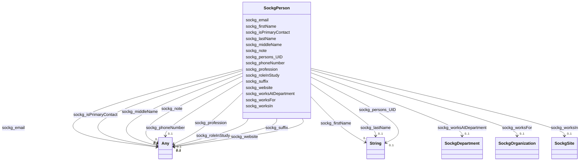

# Class: TODO -- what's a good name for what this class (type) describes? (sockg_Person)


_No type description provided_


URI: [sockg:Person](http://www.semanticweb.org/sockg/ontologies/2024/0/soil-carbon-ontology/Person)





<!-- no inheritance hierarchy -->


## Slots

| Name | Cardinality and Range | Description | Inheritance |
| ---  | --- | --- | --- |
| [sockg_worksIn](../slots/sockg_worksIn.md) | 0..1 <br/> [SockgSite](../classes/SockgSite.md) | No slot description provided | direct |
| [sockg_worksAtDepartment](../slots/sockg_worksAtDepartment.md) | 0..1 <br/> [SockgDepartment](../classes/SockgDepartment.md) | No slot description provided | direct |
| [sockg_worksFor](../slots/sockg_worksFor.md) | 0..1 <br/> [SockgOrganization](../classes/SockgOrganization.md) | No slot description provided | direct |
| [sockg_email](../slots/sockg_email.md) | 0..1 <br/> [xsd:string](http://www.w3.org/2001/XMLSchema#string)&nbsp;or&nbsp;<br />[xsd:double](http://www.w3.org/2001/XMLSchema#double) | No slot description provided | direct |
| [sockg_note](../slots/sockg_note.md) | 0..1 <br/> [xsd:double](http://www.w3.org/2001/XMLSchema#double)&nbsp;or&nbsp;<br />[xsd:string](http://www.w3.org/2001/XMLSchema#string) | No slot description provided | direct |
| [sockg_persons_UID](../slots/sockg_persons_UID.md) | 0..1 <br/> [xsd:string](http://www.w3.org/2001/XMLSchema#string) | No slot description provided | direct |
| [sockg_phoneNumber](../slots/sockg_phoneNumber.md) | 0..1 <br/> [xsd:double](http://www.w3.org/2001/XMLSchema#double)&nbsp;or&nbsp;<br />[xsd:string](http://www.w3.org/2001/XMLSchema#string) | No slot description provided | direct |
| [sockg_website](../slots/sockg_website.md) | 0..1 <br/> [xsd:string](http://www.w3.org/2001/XMLSchema#string)&nbsp;or&nbsp;<br />[xsd:double](http://www.w3.org/2001/XMLSchema#double) | No slot description provided | direct |
| [sockg_middleName](../slots/sockg_middleName.md) | 0..1 <br/> [xsd:string](http://www.w3.org/2001/XMLSchema#string)&nbsp;or&nbsp;<br />[xsd:double](http://www.w3.org/2001/XMLSchema#double) | No slot description provided | direct |
| [sockg_suffix](../slots/sockg_suffix.md) | 0..1 <br/> [xsd:string](http://www.w3.org/2001/XMLSchema#string)&nbsp;or&nbsp;<br />[xsd:double](http://www.w3.org/2001/XMLSchema#double) | No slot description provided | direct |
| [sockg_roleInStudy](../slots/sockg_roleInStudy.md) | 0..1 <br/> [xsd:string](http://www.w3.org/2001/XMLSchema#string)&nbsp;or&nbsp;<br />[xsd:double](http://www.w3.org/2001/XMLSchema#double) | No slot description provided | direct |
| [sockg_firstName](../slots/sockg_firstName.md) | 0..1 <br/> [xsd:string](http://www.w3.org/2001/XMLSchema#string) | No slot description provided | direct |
| [sockg_lastName](../slots/sockg_lastName.md) | 0..1 <br/> [xsd:string](http://www.w3.org/2001/XMLSchema#string) | No slot description provided | direct |
| [sockg_isPrimaryContact](../slots/sockg_isPrimaryContact.md) | 0..1 <br/> [xsd:string](http://www.w3.org/2001/XMLSchema#string)&nbsp;or&nbsp;<br />[xsd:double](http://www.w3.org/2001/XMLSchema#double) | No slot description provided | direct |
| [sockg_profession](../slots/sockg_profession.md) | 0..1 <br/> [xsd:string](http://www.w3.org/2001/XMLSchema#string)&nbsp;or&nbsp;<br />[xsd:double](http://www.w3.org/2001/XMLSchema#double) | No slot description provided | direct |


## Examples

| Value |
| --- |
| neo4j://graph.individuals#203289 |

## TODOs

* TODO -- Todos for this class go here
* or you can delete the todos
* if you think the class is perfect.

## Identifier and Mapping Information


### Schema Source


* from schema: soc-kg/main


## Mappings

| Mapping Type | Mapped Value |
| ---  | ---  |
| self | sockg:Person |
| native | soc-kg/main/:SockgPerson |


## LinkML Source

<!-- TODO: investigate https://stackoverflow.com/questions/37606292/how-to-create-tabbed-code-blocks-in-mkdocs-or-sphinx -->

### Direct

<details>
```yaml
name: sockg_Person
description: No type description provided
title: TODO -- what's a good name for what this class (type) describes?
todos:
- TODO -- Todos for this class go here
- or you can delete the todos
- if you think the class is perfect.
notes:
- There are 98 instances of this class.
examples:
- value: neo4j://graph.individuals#203289
from_schema: soc-kg/main
rank: 1000
slots:
- sockg_worksIn
- sockg_worksAtDepartment
- sockg_worksFor
- sockg_email
- sockg_note
- sockg_persons_UID
- sockg_phoneNumber
- sockg_website
- sockg_middleName
- sockg_suffix
- sockg_roleInStudy
- sockg_firstName
- sockg_lastName
- sockg_isPrimaryContact
- sockg_profession
class_uri: sockg:Person

```
</details>

### Induced

<details>
```yaml
name: sockg_Person
description: No type description provided
title: TODO -- what's a good name for what this class (type) describes?
todos:
- TODO -- Todos for this class go here
- or you can delete the todos
- if you think the class is perfect.
notes:
- There are 98 instances of this class.
examples:
- value: neo4j://graph.individuals#203289
from_schema: soc-kg/main
rank: 1000
attributes:
  sockg_worksIn:
    name: sockg_worksIn
    description: No slot description provided
    todos:
    - TODO -- Todos for this slot go here
    - or you can delete the todos
    - if you think the class is perfect.
    comments:
    - 165 occurrences with subject type sockg:Person and object type sockg:Site.
    examples:
    - value: neo4j://graph.individuals#203313 sockg:worksIn neo4j://graph.individuals#230713
    from_schema: soc-kg/main
    rank: 1000
    slot_uri: sockg:worksIn
    alias: sockg_worksIn
    owner: sockg_Person
    domain_of:
    - sockg_Person
    range: sockg_Site
  sockg_worksAtDepartment:
    name: sockg_worksAtDepartment
    description: No slot description provided
    todos:
    - TODO -- Todos for this slot go here
    - or you can delete the todos
    - if you think the class is perfect.
    comments:
    - 91 occurrences with subject type sockg:Person and object type sockg:Department.
    examples:
    - value: neo4j://graph.individuals#203333 sockg:worksAtDepartment neo4j://graph.individuals#51672
    from_schema: soc-kg/main
    rank: 1000
    slot_uri: sockg:worksAtDepartment
    alias: sockg_worksAtDepartment
    owner: sockg_Person
    domain_of:
    - sockg_Person
    range: sockg_Department
  sockg_worksFor:
    name: sockg_worksFor
    description: No slot description provided
    todos:
    - TODO -- Todos for this slot go here
    - or you can delete the todos
    - if you think the class is perfect.
    comments:
    - 35 occurrences with subject type sockg:Person and object type sockg:Organization.
    examples:
    - value: neo4j://graph.individuals#203294 sockg:worksFor neo4j://graph.individuals#203272
    from_schema: soc-kg/main
    rank: 1000
    slot_uri: sockg:worksFor
    alias: sockg_worksFor
    owner: sockg_Person
    domain_of:
    - sockg_Person
    range: sockg_Organization
  sockg_email:
    name: sockg_email
    description: No slot description provided
    todos:
    - TODO -- Todos for this slot go here
    - or you can delete the todos
    - if you think the class is perfect.
    comments:
    - 86 occurrences with subject type sockg:Person and object type string.
    - 12 occurrences with subject type sockg:Person and object type xsd:double.
    examples:
    - value: neo4j://graph.individuals#203351 sockg:email wayne.polumsky@ars.usda.gov
    - value: neo4j://graph.individuals#203284 sockg:email nan
    from_schema: soc-kg/main
    rank: 1000
    slot_uri: sockg:email
    alias: sockg_email
    owner: sockg_Person
    domain_of:
    - sockg_Person
    range: Any
    any_of:
    - range: string
    - range: double
  sockg_note:
    name: sockg_note
    description: No slot description provided
    todos:
    - TODO -- Todos for this slot go here
    - or you can delete the todos
    - if you think the class is perfect.
    comments:
    - 86 occurrences with subject type sockg:Person and object type xsd:double.
    - 12 occurrences with subject type sockg:Person and object type string.
    examples:
    - value: neo4j://graph.individuals#203375 sockg:note nan
    - value: neo4j://graph.individuals#203328 sockg:note Dr. Cantrell no longer works
        for ARS at this time.
    from_schema: soc-kg/main
    rank: 1000
    slot_uri: sockg:note
    alias: sockg_note
    owner: sockg_Person
    domain_of:
    - sockg_Person
    range: Any
    any_of:
    - range: double
    - range: string
  sockg_persons_UID:
    name: sockg_persons_UID
    description: No slot description provided
    todos:
    - TODO -- Todos for this slot go here
    - or you can delete the todos
    - if you think the class is perfect.
    comments:
    - 98 occurrences with subject type sockg:Person and object type string.
    examples:
    - value: neo4j://graph.individuals#203372 sockg:persons_UID Feike_Dijkstra_nan_nan_persons
    from_schema: soc-kg/main
    rank: 1000
    slot_uri: sockg:persons_UID
    alias: sockg_persons_UID
    owner: sockg_Person
    domain_of:
    - sockg_Person
    range: string
  sockg_phoneNumber:
    name: sockg_phoneNumber
    description: No slot description provided
    todos:
    - TODO -- Todos for this slot go here
    - or you can delete the todos
    - if you think the class is perfect.
    comments:
    - 15 occurrences with subject type sockg:Person and object type xsd:double.
    - 83 occurrences with subject type sockg:Person and object type string.
    examples:
    - value: neo4j://graph.individuals#203304 sockg:phoneNumber nan
    - value: neo4j://graph.individuals#203340 sockg:phoneNumber 806-749-5560x5233
    from_schema: soc-kg/main
    rank: 1000
    slot_uri: sockg:phoneNumber
    alias: sockg_phoneNumber
    owner: sockg_Person
    domain_of:
    - sockg_Person
    range: Any
    any_of:
    - range: double
    - range: string
  sockg_website:
    name: sockg_website
    description: No slot description provided
    todos:
    - TODO -- Todos for this slot go here
    - or you can delete the todos
    - if you think the class is perfect.
    comments:
    - 30 occurrences with subject type sockg:Person and object type string.
    - 68 occurrences with subject type sockg:Person and object type xsd:double.
    examples:
    - value: neo4j://graph.individuals#203358 sockg:website http://www.sidney.ars/usda/gov
    - value: neo4j://graph.individuals#203372 sockg:website nan
    from_schema: soc-kg/main
    rank: 1000
    slot_uri: sockg:website
    alias: sockg_website
    owner: sockg_Person
    domain_of:
    - sockg_Person
    range: Any
    any_of:
    - range: string
    - range: double
  sockg_middleName:
    name: sockg_middleName
    description: No slot description provided
    todos:
    - TODO -- Todos for this slot go here
    - or you can delete the todos
    - if you think the class is perfect.
    comments:
    - 65 occurrences with subject type sockg:Person and object type string.
    - 33 occurrences with subject type sockg:Person and object type xsd:double.
    examples:
    - value: neo4j://graph.individuals#203299 sockg:middleName W
    - value: neo4j://graph.individuals#203369 sockg:middleName nan
    from_schema: soc-kg/main
    rank: 1000
    slot_uri: sockg:middleName
    alias: sockg_middleName
    owner: sockg_Person
    domain_of:
    - sockg_Person
    range: Any
    any_of:
    - range: string
    - range: double
  sockg_suffix:
    name: sockg_suffix
    description: No slot description provided
    todos:
    - TODO -- Todos for this slot go here
    - or you can delete the todos
    - if you think the class is perfect.
    comments:
    - 32 occurrences with subject type sockg:Person and object type string.
    - 66 occurrences with subject type sockg:Person and object type xsd:double.
    examples:
    - value: neo4j://graph.individuals#203302 sockg:suffix PhD
    - value: neo4j://graph.individuals#203309 sockg:suffix nan
    from_schema: soc-kg/main
    rank: 1000
    slot_uri: sockg:suffix
    alias: sockg_suffix
    owner: sockg_Person
    domain_of:
    - sockg_Person
    range: Any
    any_of:
    - range: string
    - range: double
  sockg_roleInStudy:
    name: sockg_roleInStudy
    description: No slot description provided
    todos:
    - TODO -- Todos for this slot go here
    - or you can delete the todos
    - if you think the class is perfect.
    comments:
    - 93 occurrences with subject type sockg:Person and object type string.
    - 5 occurrences with subject type sockg:Person and object type xsd:double.
    examples:
    - value: neo4j://graph.individuals#203299 sockg:roleInStudy scientist
    - value: neo4j://graph.individuals#203285 sockg:roleInStudy nan
    from_schema: soc-kg/main
    rank: 1000
    slot_uri: sockg:roleInStudy
    alias: sockg_roleInStudy
    owner: sockg_Person
    domain_of:
    - sockg_Person
    range: Any
    any_of:
    - range: string
    - range: double
  sockg_firstName:
    name: sockg_firstName
    description: No slot description provided
    todos:
    - TODO -- Todos for this slot go here
    - or you can delete the todos
    - if you think the class is perfect.
    comments:
    - 98 occurrences with subject type sockg:Person and object type string.
    examples:
    - value: neo4j://graph.individuals#203296 sockg:firstName Michael
    from_schema: soc-kg/main
    rank: 1000
    slot_uri: sockg:firstName
    alias: sockg_firstName
    owner: sockg_Person
    domain_of:
    - sockg_Person
    range: string
  sockg_lastName:
    name: sockg_lastName
    description: No slot description provided
    todos:
    - TODO -- Todos for this slot go here
    - or you can delete the todos
    - if you think the class is perfect.
    comments:
    - 98 occurrences with subject type sockg:Person and object type string.
    examples:
    - value: neo4j://graph.individuals#203357 sockg:lastName Smith
    from_schema: soc-kg/main
    rank: 1000
    slot_uri: sockg:lastName
    alias: sockg_lastName
    owner: sockg_Person
    domain_of:
    - sockg_Person
    range: string
  sockg_isPrimaryContact:
    name: sockg_isPrimaryContact
    description: No slot description provided
    todos:
    - TODO -- Todos for this slot go here
    - or you can delete the todos
    - if you think the class is perfect.
    comments:
    - 82 occurrences with subject type sockg:Person and object type string.
    - 16 occurrences with subject type sockg:Person and object type xsd:double.
    examples:
    - value: neo4j://graph.individuals#203315 sockg:isPrimaryContact No
    - value: neo4j://graph.individuals#203365 sockg:isPrimaryContact nan
    from_schema: soc-kg/main
    rank: 1000
    slot_uri: sockg:isPrimaryContact
    alias: sockg_isPrimaryContact
    owner: sockg_Person
    domain_of:
    - sockg_Person
    range: Any
    any_of:
    - range: string
    - range: double
  sockg_profession:
    name: sockg_profession
    description: No slot description provided
    todos:
    - TODO -- Todos for this slot go here
    - or you can delete the todos
    - if you think the class is perfect.
    comments:
    - 93 occurrences with subject type sockg:Person and object type string.
    - 5 occurrences with subject type sockg:Person and object type xsd:double.
    examples:
    - value: neo4j://graph.individuals#203288 sockg:profession Research Leader/Soil
        Scientist
    - value: neo4j://graph.individuals#203344 sockg:profession nan
    from_schema: soc-kg/main
    rank: 1000
    slot_uri: sockg:profession
    alias: sockg_profession
    owner: sockg_Person
    domain_of:
    - sockg_Person
    range: Any
    any_of:
    - range: string
    - range: double
class_uri: sockg:Person

```
</details>