# Class: No class (entity type) name specified (sockg_Person)


_A Person represents an individual involved in agricultural activities, serving various roles such as researchers, farmers, or stakeholders in agricultural studies. Each person is uniquely identified and may have contact information, professional designations, and additional details relevant to their contributions in the field of agriculture._


This class occurs 98 times.


URI: [sockg:Person](https://idir.uta.edu/sockg-ontology/docs/Person)

```mermaid
 classDiagram
    class SockgPerson
    click SockgPerson href "../SockgPerson"
      SockgPerson : rdfs_seeAlso
        
          
    
    
    SockgPerson --> "0..1" Uri : rdfs_seeAlso
    click Uri href "../Uri"

        
      SockgPerson : sockg_email
        
          
    
    
    SockgPerson --> "0..1" String : sockg_email
    click String href "../String"

        
      SockgPerson : sockg_firstName
        
          
    
    
    SockgPerson --> "0..1" String : sockg_firstName
    click String href "../String"

        
      SockgPerson : sockg_isPrimaryContact
        
          
    
    
    SockgPerson --> "0..1" String : sockg_isPrimaryContact
    click String href "../String"

        
      SockgPerson : sockg_lastName
        
          
    
    
    SockgPerson --> "0..1" String : sockg_lastName
    click String href "../String"

        
      SockgPerson : sockg_middleName
        
          
    
    
    SockgPerson --> "0..1" String : sockg_middleName
    click String href "../String"

        
      SockgPerson : sockg_note
        
          
    
    
    SockgPerson --> "0..1" String : sockg_note
    click String href "../String"

        
      SockgPerson : sockg_organizationName
        
          
    
    
    SockgPerson --> "0..1" String : sockg_organizationName
    click String href "../String"

        
      SockgPerson : sockg_persons_UID
        
          
    
    
    SockgPerson --> "0..1" String : sockg_persons_UID
    click String href "../String"

        
      SockgPerson : sockg_phoneNumber
        
          
    
    
    SockgPerson --> "0..1" String : sockg_phoneNumber
    click String href "../String"

        
      SockgPerson : sockg_profession
        
          
    
    
    SockgPerson --> "0..1" String : sockg_profession
    click String href "../String"

        
      SockgPerson : sockg_roleInStudy
        
          
    
    
    SockgPerson --> "0..1" String : sockg_roleInStudy
    click String href "../String"

        
      SockgPerson : sockg_suffix
        
          
    
    
    SockgPerson --> "0..1" String : sockg_suffix
    click String href "../String"

        
      SockgPerson : sockg_website
        
          
    
    
    SockgPerson --> "0..1" String : sockg_website
    click String href "../String"

        
      SockgPerson : sockg_worksAtDepartment
        
          
    
    
    SockgPerson --> "0..1" SockgDepartment : sockg_worksAtDepartment
    click SockgDepartment href "../SockgDepartment"

        
      SockgPerson : sockg_worksFor
        
          
    
    
    SockgPerson --> "0..1" SockgOrganization : sockg_worksFor
    click SockgOrganization href "../SockgOrganization"

        
      SockgPerson : sockg_worksIn
        
          
    
    
    SockgPerson --> "0..1" SockgSite : sockg_worksIn
    click SockgSite href "../SockgSite"

        
      
```





<!-- no inheritance hierarchy -->


## Slots

| Name | Cardinality and Range | Description | Inheritance | Occurrences |
| ---  | --- | --- | --- | --- |
| [sockg_phoneNumber](../slots/sockg_phoneNumber.md) | 0..1 <br/> [xsd:string](http://www.w3.org/2001/XMLSchema#string) | No slot (predicate) description specified <br/>  | direct | 84 |
| [sockg_email](../slots/sockg_email.md) | 0..1 <br/> [xsd:string](http://www.w3.org/2001/XMLSchema#string) | No slot (predicate) description specified <br/>  | direct | 87 |
| [sockg_organizationName](../slots/sockg_organizationName.md) | 0..1 <br/> [xsd:string](http://www.w3.org/2001/XMLSchema#string) | No slot (predicate) description specified <br/>  | direct | 88 |
| [sockg_profession](../slots/sockg_profession.md) | 0..1 <br/> [xsd:string](http://www.w3.org/2001/XMLSchema#string) | No slot (predicate) description specified <br/>  | direct | 93 |
| [sockg_website](../slots/sockg_website.md) | 0..1 <br/> [xsd:string](http://www.w3.org/2001/XMLSchema#string) | No slot (predicate) description specified <br/>  | direct | 29 |
| [sockg_middleName](../slots/sockg_middleName.md) | 0..1 <br/> [xsd:string](http://www.w3.org/2001/XMLSchema#string) | No slot (predicate) description specified <br/>  | direct | 65 |
| [sockg_note](../slots/sockg_note.md) | 0..1 <br/> [xsd:string](http://www.w3.org/2001/XMLSchema#string) | No slot (predicate) description specified <br/>  | direct | 11 |
| [sockg_worksFor](../slots/sockg_worksFor.md) | 0..1 <br/> [SockgOrganization](../classes/SockgOrganization.md) | No slot (predicate) description specified <br/>  | direct | 35 |
| [sockg_worksAtDepartment](../slots/sockg_worksAtDepartment.md) | 0..1 <br/> [SockgDepartment](../classes/SockgDepartment.md) | No slot (predicate) description specified <br/>  | direct | 91 |
| [sockg_roleInStudy](../slots/sockg_roleInStudy.md) | 0..1 <br/> [xsd:string](http://www.w3.org/2001/XMLSchema#string) | No slot (predicate) description specified <br/>  | direct | 93 |
| [sockg_isPrimaryContact](../slots/sockg_isPrimaryContact.md) | 0..1 <br/> [xsd:string](http://www.w3.org/2001/XMLSchema#string) | No slot (predicate) description specified <br/>  | direct | 84 |
| [sockg_suffix](../slots/sockg_suffix.md) | 0..1 <br/> [xsd:string](http://www.w3.org/2001/XMLSchema#string) | No slot (predicate) description specified <br/>  | direct | 32 |
| [sockg_worksIn](../slots/sockg_worksIn.md) | 0..1 <br/> [SockgSite](../classes/SockgSite.md) | No slot (predicate) description specified <br/>  | direct | 165 |
| [sockg_persons_UID](../slots/sockg_persons_UID.md) | 0..1 <br/> [xsd:string](http://www.w3.org/2001/XMLSchema#string) | No slot (predicate) description specified <br/>  | direct | 98 |
| [rdfs_seeAlso](../slots/rdfs_seeAlso.md) | 0..1 <br/> [xsd:anyURI](http://www.w3.org/2001/XMLSchema#anyURI) | No slot (predicate) description specified <br/>  | direct | 98 |
| [sockg_lastName](../slots/sockg_lastName.md) | 0..1 <br/> [xsd:string](http://www.w3.org/2001/XMLSchema#string) | No slot (predicate) description specified <br/>  | direct | 98 |
| [sockg_firstName](../slots/sockg_firstName.md) | 0..1 <br/> [xsd:string](http://www.w3.org/2001/XMLSchema#string) | No slot (predicate) description specified <br/>  | direct | 98 |


## Usages

| used by | used in | type | used |
| ---  | --- | --- | --- |
| [SockgPerson](../classes/SockgPerson.md) | [sockg_phoneNumber](../slots/sockg_phoneNumber.md) | domain | [SockgPerson](../classes/SockgPerson.md) |
| [SockgPerson](../classes/SockgPerson.md) | [sockg_email](../slots/sockg_email.md) | domain | [SockgPerson](../classes/SockgPerson.md) |
| [SockgPerson](../classes/SockgPerson.md) | [sockg_profession](../slots/sockg_profession.md) | domain | [SockgPerson](../classes/SockgPerson.md) |
| [SockgPerson](../classes/SockgPerson.md) | [sockg_website](../slots/sockg_website.md) | domain | [SockgPerson](../classes/SockgPerson.md) |
| [SockgPerson](../classes/SockgPerson.md) | [sockg_middleName](../slots/sockg_middleName.md) | domain | [SockgPerson](../classes/SockgPerson.md) |
| [SockgPerson](../classes/SockgPerson.md) | [sockg_note](../slots/sockg_note.md) | domain | [SockgPerson](../classes/SockgPerson.md) |
| [SockgPerson](../classes/SockgPerson.md) | [sockg_worksFor](../slots/sockg_worksFor.md) | domain | [SockgPerson](../classes/SockgPerson.md) |
| [SockgPerson](../classes/SockgPerson.md) | [sockg_worksAtDepartment](../slots/sockg_worksAtDepartment.md) | domain | [SockgPerson](../classes/SockgPerson.md) |
| [SockgPerson](../classes/SockgPerson.md) | [sockg_roleInStudy](../slots/sockg_roleInStudy.md) | domain | [SockgPerson](../classes/SockgPerson.md) |
| [SockgPerson](../classes/SockgPerson.md) | [sockg_isPrimaryContact](../slots/sockg_isPrimaryContact.md) | domain | [SockgPerson](../classes/SockgPerson.md) |
| [SockgPerson](../classes/SockgPerson.md) | [sockg_suffix](../slots/sockg_suffix.md) | domain | [SockgPerson](../classes/SockgPerson.md) |
| [SockgPerson](../classes/SockgPerson.md) | [sockg_worksIn](../slots/sockg_worksIn.md) | domain | [SockgPerson](../classes/SockgPerson.md) |
| [SockgPerson](../classes/SockgPerson.md) | [sockg_persons_UID](../slots/sockg_persons_UID.md) | domain | [SockgPerson](../classes/SockgPerson.md) |
| [SockgPerson](../classes/SockgPerson.md) | [sockg_lastName](../slots/sockg_lastName.md) | domain | [SockgPerson](../classes/SockgPerson.md) |
| [SockgPerson](../classes/SockgPerson.md) | [sockg_firstName](../slots/sockg_firstName.md) | domain | [SockgPerson](../classes/SockgPerson.md) |


## See Also

* [https://lod.nal.usda.gov/nalt/774](https://lod.nal.usda.gov/nalt/774)


## LinkML Source

<!-- TODO: investigate https://stackoverflow.com/questions/37606292/how-to-create-tabbed-code-blocks-in-mkdocs-or-sphinx -->

### Direct

<details>

```yaml
name: sockg_Person
conforms_to: No schema conformance document specified
annotations:
  count:
    tag: count
    value: 98
description: A Person represents an individual involved in agricultural activities,
  serving various roles such as researchers, farmers, or stakeholders in agricultural
  studies. Each person is uniquely identified and may have contact information, professional
  designations, and additional details relevant to their contributions in the field
  of agriculture.
title: No class (entity type) name specified
from_schema: soc-kg
see_also:
- https://lod.nal.usda.gov/nalt/774
rank: 1000
slots:
- sockg_phoneNumber
- sockg_email
- sockg_organizationName
- sockg_profession
- sockg_website
- sockg_middleName
- sockg_note
- sockg_worksFor
- sockg_worksAtDepartment
- sockg_roleInStudy
- sockg_isPrimaryContact
- sockg_suffix
- sockg_worksIn
- sockg_persons_UID
- rdfs_seeAlso
- sockg_lastName
- sockg_firstName
slot_usage:
  rdfs_seeAlso:
    name: rdfs_seeAlso
    annotations:
      uri:
        tag: uri
        value: 98
  sockg_email:
    name: sockg_email
    annotations:
      string:
        tag: string
        value: 87
  sockg_firstName:
    name: sockg_firstName
    annotations:
      string:
        tag: string
        value: 98
  sockg_isPrimaryContact:
    name: sockg_isPrimaryContact
    annotations:
      string:
        tag: string
        value: 84
  sockg_lastName:
    name: sockg_lastName
    annotations:
      string:
        tag: string
        value: 98
  sockg_middleName:
    name: sockg_middleName
    annotations:
      string:
        tag: string
        value: 65
  sockg_note:
    name: sockg_note
    annotations:
      string:
        tag: string
        value: 11
  sockg_organizationName:
    name: sockg_organizationName
    annotations:
      string:
        tag: string
        value: 88
  sockg_persons_UID:
    name: sockg_persons_UID
    annotations:
      string:
        tag: string
        value: 98
  sockg_phoneNumber:
    name: sockg_phoneNumber
    annotations:
      string:
        tag: string
        value: 84
  sockg_profession:
    name: sockg_profession
    annotations:
      string:
        tag: string
        value: 93
  sockg_roleInStudy:
    name: sockg_roleInStudy
    annotations:
      string:
        tag: string
        value: 93
  sockg_suffix:
    name: sockg_suffix
    annotations:
      string:
        tag: string
        value: 32
  sockg_website:
    name: sockg_website
    annotations:
      string:
        tag: string
        value: 29
  sockg_worksAtDepartment:
    name: sockg_worksAtDepartment
    annotations:
      sockg_Department:
        tag: sockg_Department
        value: 91
  sockg_worksFor:
    name: sockg_worksFor
    annotations:
      sockg_Organization:
        tag: sockg_Organization
        value: 35
  sockg_worksIn:
    name: sockg_worksIn
    annotations:
      sockg_Site:
        tag: sockg_Site
        value: 165
class_uri: sockg:Person

```
</details>

### Induced

<details>

```yaml
name: sockg_Person
conforms_to: No schema conformance document specified
annotations:
  count:
    tag: count
    value: 98
description: A Person represents an individual involved in agricultural activities,
  serving various roles such as researchers, farmers, or stakeholders in agricultural
  studies. Each person is uniquely identified and may have contact information, professional
  designations, and additional details relevant to their contributions in the field
  of agriculture.
title: No class (entity type) name specified
from_schema: soc-kg
see_also:
- https://lod.nal.usda.gov/nalt/774
rank: 1000
slot_usage:
  rdfs_seeAlso:
    name: rdfs_seeAlso
    annotations:
      uri:
        tag: uri
        value: 98
  sockg_email:
    name: sockg_email
    annotations:
      string:
        tag: string
        value: 87
  sockg_firstName:
    name: sockg_firstName
    annotations:
      string:
        tag: string
        value: 98
  sockg_isPrimaryContact:
    name: sockg_isPrimaryContact
    annotations:
      string:
        tag: string
        value: 84
  sockg_lastName:
    name: sockg_lastName
    annotations:
      string:
        tag: string
        value: 98
  sockg_middleName:
    name: sockg_middleName
    annotations:
      string:
        tag: string
        value: 65
  sockg_note:
    name: sockg_note
    annotations:
      string:
        tag: string
        value: 11
  sockg_organizationName:
    name: sockg_organizationName
    annotations:
      string:
        tag: string
        value: 88
  sockg_persons_UID:
    name: sockg_persons_UID
    annotations:
      string:
        tag: string
        value: 98
  sockg_phoneNumber:
    name: sockg_phoneNumber
    annotations:
      string:
        tag: string
        value: 84
  sockg_profession:
    name: sockg_profession
    annotations:
      string:
        tag: string
        value: 93
  sockg_roleInStudy:
    name: sockg_roleInStudy
    annotations:
      string:
        tag: string
        value: 93
  sockg_suffix:
    name: sockg_suffix
    annotations:
      string:
        tag: string
        value: 32
  sockg_website:
    name: sockg_website
    annotations:
      string:
        tag: string
        value: 29
  sockg_worksAtDepartment:
    name: sockg_worksAtDepartment
    annotations:
      sockg_Department:
        tag: sockg_Department
        value: 91
  sockg_worksFor:
    name: sockg_worksFor
    annotations:
      sockg_Organization:
        tag: sockg_Organization
        value: 35
  sockg_worksIn:
    name: sockg_worksIn
    annotations:
      sockg_Site:
        tag: sockg_Site
        value: 165
attributes:
  sockg_phoneNumber:
    name: sockg_phoneNumber
    annotations:
      string:
        tag: string
        value: 84
    description: No slot (predicate) description specified
    title: No slot (predicate) name specified
    examples:
    - object:
        example_object: 970-492-7281
        example_object_type: string
        example_predicate: sockg:phoneNumber
        example_subject: sockg:individuals/203534
        example_subject_type: sockg_Person
    from_schema: soc-kg
    rank: 1000
    domain: sockg_Person
    slot_uri: sockg:phoneNumber
    alias: sockg_phoneNumber
    owner: sockg_Person
    domain_of:
    - sockg_Person
    range: string
  sockg_email:
    name: sockg_email
    annotations:
      string:
        tag: string
        value: 87
    description: No slot (predicate) description specified
    title: No slot (predicate) name specified
    examples:
    - object:
        example_object: steve.delgrosso@ars.usda.gov
        example_object_type: string
        example_predicate: sockg:email
        example_subject: sockg:individuals/203534
        example_subject_type: sockg_Person
    from_schema: soc-kg
    see_also:
    - https://lod.nal.usda.gov/nalt/35067
    rank: 1000
    domain: sockg_Person
    slot_uri: sockg:email
    alias: sockg_email
    owner: sockg_Person
    domain_of:
    - sockg_Person
    range: string
  sockg_organizationName:
    name: sockg_organizationName
    annotations:
      string:
        tag: string
        value: 88
    description: No slot (predicate) description specified
    title: No slot (predicate) name specified
    examples:
    - object:
        example_object: USDA-ARS
        example_object_type: string
        example_predicate: sockg:organizationName
        example_subject: sockg:individuals/203523
        example_subject_type: sockg_Organization
    - object:
        example_object: Soil Plant Nutrient Research Unit
        example_object_type: string
        example_predicate: sockg:organizationName
        example_subject: sockg:individuals/203534
        example_subject_type: sockg_Person
    from_schema: soc-kg
    see_also:
    - https://lod.nal.usda.gov/nalt/13189
    rank: 1000
    domain: sockg_Organization
    slot_uri: sockg:organizationName
    alias: sockg_organizationName
    owner: sockg_Person
    domain_of:
    - sockg_Organization
    - sockg_Person
    range: string
  sockg_profession:
    name: sockg_profession
    annotations:
      string:
        tag: string
        value: 93
    description: No slot (predicate) description specified
    title: No slot (predicate) name specified
    examples:
    - object:
        example_object: Soil Scientist
        example_object_type: string
        example_predicate: sockg:profession
        example_subject: sockg:individuals/203534
        example_subject_type: sockg_Person
    from_schema: soc-kg
    see_also:
    - https://lod.nal.usda.gov/nalt/11820
    rank: 1000
    domain: sockg_Person
    slot_uri: sockg:profession
    alias: sockg_profession
    owner: sockg_Person
    domain_of:
    - sockg_Person
    range: string
  sockg_website:
    name: sockg_website
    annotations:
      string:
        tag: string
        value: 29
    description: No slot (predicate) description specified
    title: No slot (predicate) name specified
    examples:
    - object:
        example_object: http://www.ars.usda.gov/pandp/people/people.htm?personid=36958
        example_object_type: string
        example_predicate: sockg:website
        example_subject: sockg:individuals/203534
        example_subject_type: sockg_Person
    from_schema: soc-kg
    rank: 1000
    domain: sockg_Person
    slot_uri: sockg:website
    alias: sockg_website
    owner: sockg_Person
    domain_of:
    - sockg_Person
    range: string
  sockg_middleName:
    name: sockg_middleName
    annotations:
      string:
        tag: string
        value: 65
    description: No slot (predicate) description specified
    title: No slot (predicate) name specified
    examples:
    - object:
        example_object: A.
        example_object_type: string
        example_predicate: sockg:middleName
        example_subject: sockg:individuals/203537
        example_subject_type: sockg_Person
    from_schema: soc-kg
    rank: 1000
    domain: sockg_Person
    slot_uri: sockg:middleName
    alias: sockg_middleName
    owner: sockg_Person
    domain_of:
    - sockg_Person
    range: string
  sockg_note:
    name: sockg_note
    annotations:
      string:
        tag: string
        value: 11
    description: No slot (predicate) description specified
    title: No slot (predicate) name specified
    examples:
    - object:
        example_object: V. Jin is current contact for GRACEnet/REAP DET updates.
        example_object_type: string
        example_predicate: sockg:note
        example_subject: sockg:individuals/203545
        example_subject_type: sockg_Person
    from_schema: soc-kg
    rank: 1000
    domain: sockg_Person
    slot_uri: sockg:note
    alias: sockg_note
    owner: sockg_Person
    domain_of:
    - sockg_Person
    range: string
  sockg_worksFor:
    name: sockg_worksFor
    annotations:
      sockg_Organization:
        tag: sockg_Organization
        value: 35
    description: No slot (predicate) description specified
    title: No slot (predicate) name specified
    examples:
    - object:
        example_object: sockg:individuals/203523
        example_object_type: sockg_Organization
        example_predicate: sockg:worksFor
        example_subject: sockg:individuals/203545
        example_subject_type: sockg_Person
    from_schema: soc-kg
    rank: 1000
    domain: sockg_Person
    slot_uri: sockg:worksFor
    alias: sockg_worksFor
    owner: sockg_Person
    domain_of:
    - sockg_Person
    range: sockg_Organization
  sockg_worksAtDepartment:
    name: sockg_worksAtDepartment
    annotations:
      sockg_Department:
        tag: sockg_Department
        value: 91
    description: No slot (predicate) description specified
    title: No slot (predicate) name specified
    examples:
    - object:
        example_object: sockg:individuals/51833
        example_object_type: sockg_Department
        example_predicate: sockg:worksAtDepartment
        example_subject: sockg:individuals/203534
        example_subject_type: sockg_Person
    from_schema: soc-kg
    rank: 1000
    domain: sockg_Person
    slot_uri: sockg:worksAtDepartment
    alias: sockg_worksAtDepartment
    owner: sockg_Person
    domain_of:
    - sockg_Person
    range: sockg_Department
  sockg_roleInStudy:
    name: sockg_roleInStudy
    annotations:
      string:
        tag: string
        value: 93
    description: No slot (predicate) description specified
    title: No slot (predicate) name specified
    examples:
    - object:
        example_object: PI
        example_object_type: string
        example_predicate: sockg:roleInStudy
        example_subject: sockg:individuals/203534
        example_subject_type: sockg_Person
    from_schema: soc-kg
    rank: 1000
    domain: sockg_Person
    slot_uri: sockg:roleInStudy
    alias: sockg_roleInStudy
    owner: sockg_Person
    domain_of:
    - sockg_Person
    range: string
  sockg_isPrimaryContact:
    name: sockg_isPrimaryContact
    annotations:
      string:
        tag: string
        value: 84
    description: No slot (predicate) description specified
    title: No slot (predicate) name specified
    examples:
    - object:
        example_object: 'Yes'
        example_object_type: string
        example_predicate: sockg:isPrimaryContact
        example_subject: sockg:individuals/203534
        example_subject_type: sockg_Person
    from_schema: soc-kg
    rank: 1000
    domain: sockg_Person
    slot_uri: sockg:isPrimaryContact
    alias: sockg_isPrimaryContact
    owner: sockg_Person
    domain_of:
    - sockg_Person
    range: string
  sockg_suffix:
    name: sockg_suffix
    annotations:
      string:
        tag: string
        value: 32
    description: No slot (predicate) description specified
    title: No slot (predicate) name specified
    examples:
    - object:
        example_object: Ph.D
        example_object_type: string
        example_predicate: sockg:suffix
        example_subject: sockg:individuals/203534
        example_subject_type: sockg_Person
    from_schema: soc-kg
    rank: 1000
    domain: sockg_Person
    slot_uri: sockg:suffix
    alias: sockg_suffix
    owner: sockg_Person
    domain_of:
    - sockg_Person
    range: string
  sockg_worksIn:
    name: sockg_worksIn
    annotations:
      sockg_Site:
        tag: sockg_Site
        value: 165
    description: No slot (predicate) description specified
    title: No slot (predicate) name specified
    examples:
    - object:
        example_object: sockg:individuals/231057
        example_object_type: sockg_Site
        example_predicate: sockg:worksIn
        example_subject: sockg:individuals/203534
        example_subject_type: sockg_Person
    from_schema: soc-kg
    rank: 1000
    domain: sockg_Person
    slot_uri: sockg:worksIn
    alias: sockg_worksIn
    owner: sockg_Person
    domain_of:
    - sockg_Person
    range: sockg_Site
  sockg_persons_UID:
    name: sockg_persons_UID
    annotations:
      string:
        tag: string
        value: 98
    description: No slot (predicate) description specified
    title: No slot (predicate) name specified
    examples:
    - object:
        example_object: Steve_Del_Grosso_nan_Ph.D_persons
        example_object_type: string
        example_predicate: sockg:persons_UID
        example_subject: sockg:individuals/203534
        example_subject_type: sockg_Person
    from_schema: soc-kg
    rank: 1000
    domain: sockg_Person
    slot_uri: sockg:persons_UID
    alias: sockg_persons_UID
    owner: sockg_Person
    domain_of:
    - sockg_Person
    range: string
  rdfs_seeAlso:
    name: rdfs_seeAlso
    annotations:
      uri:
        tag: uri
        value: 98
    description: No slot (predicate) description specified
    examples:
    - object:
        example_object: https://lod.nal.usda.gov/nalt/4605
        example_object_type: uri
        example_predicate: rdfs:seeAlso
        example_subject: sockg:individuals/0
        example_subject_type: sockg_Amendment
    - object:
        example_object: https://lod.nal.usda.gov/nalt/5859
        example_object_type: uri
        example_predicate: rdfs:seeAlso
        example_subject: sockg:individuals/100000
        example_subject_type: sockg_GasSample
    - object:
        example_object: https://lod.nal.usda.gov/nalt/281219
        example_object_type: uri
        example_predicate: rdfs:seeAlso
        example_subject: sockg:individuals/163960
        example_subject_type: sockg_Grazing
    - object:
        example_object: https://lod.nal.usda.gov/nalt/4377260
        example_object_type: uri
        example_predicate: rdfs:seeAlso
        example_subject: sockg:individuals/170955
        example_subject_type: sockg_GrazingManagementEvent
    - object:
        example_object: https://lod.nal.usda.gov/nalt/131626
        example_object_type: uri
        example_predicate: rdfs:seeAlso
        example_subject: sockg:individuals/172906
        example_subject_type: sockg_Harvest
    - object:
        example_object: https://lod.nal.usda.gov/nalt/281219
        example_object_type: uri
        example_predicate: rdfs:seeAlso
        example_subject: sockg:individuals/191262
        example_subject_type: sockg_HarvestFraction
    - object:
        example_object: https://lod.nal.usda.gov/nalt/13189
        example_object_type: uri
        example_predicate: rdfs:seeAlso
        example_subject: sockg:individuals/203523
        example_subject_type: sockg_Organization
    - object:
        example_object: https://lod.nal.usda.gov/nalt/3927
        example_object_type: uri
        example_predicate: rdfs:seeAlso
        example_subject: sockg:individuals/203632
        example_subject_type: sockg_Pesticide
    - object:
        example_object: https://lod.nal.usda.gov/nalt/849
        example_object_type: uri
        example_predicate: rdfs:seeAlso
        example_subject: sockg:individuals/227674
        example_subject_type: sockg_ResidueManagementEvent
    - object:
        example_object: https://lod.nal.usda.gov/nalt/30158
        example_object_type: uri
        example_predicate: rdfs:seeAlso
        example_subject: sockg:individuals/230982
        example_subject_type: sockg_Rotation
    - object:
        example_object: https://lod.nal.usda.gov/nalt/302328
        example_object_type: uri
        example_predicate: rdfs:seeAlso
        example_subject: sockg:individuals/231056
        example_subject_type: sockg_Site
    - object:
        example_object: https://lod.nal.usda.gov/nalt/2726
        example_object_type: uri
        example_predicate: rdfs:seeAlso
        example_subject: sockg:individuals/235229
        example_subject_type: sockg_SoilBiologicalSample
    - object:
        example_object: https://lod.nal.usda.gov/nalt/7974
        example_object_type: uri
        example_predicate: rdfs:seeAlso
        example_subject: sockg:individuals/253451
        example_subject_type: sockg_SoilChemicalSample
    - object:
        example_object: https://lod.nal.usda.gov/nalt/302328
        example_object_type: uri
        example_predicate: rdfs:seeAlso
        example_subject: sockg:individuals/307284
        example_subject_type: sockg_SoilCover
    - object:
        example_object: https://lod.nal.usda.gov/nalt/5143
        example_object_type: uri
        example_predicate: rdfs:seeAlso
        example_subject: sockg:individuals/308318
        example_subject_type: sockg_SoilPhysicalSample
    - object:
        example_object: https://lod.nal.usda.gov/nalt/5430914
        example_object_type: uri
        example_predicate: rdfs:seeAlso
        example_subject: sockg:individuals/336400
        example_subject_type: sockg_State
    - object:
        example_object: https://lod.nal.usda.gov/nalt/7140
        example_object_type: uri
        example_predicate: rdfs:seeAlso
        example_subject: sockg:individuals/336419
        example_subject_type: sockg_Tillage
    - object:
        example_object: https://lod.nal.usda.gov/nalt/28616
        example_object_type: uri
        example_predicate: rdfs:seeAlso
        example_subject: sockg:individuals/363556
        example_subject_type: sockg_Treatment
    - object:
        example_object: https://lod.nal.usda.gov/nalt/2717
        example_object_type: uri
        example_predicate: rdfs:seeAlso
        example_subject: sockg:individuals/37796
        example_subject_type: sockg_BioMassCarbohydrate
    - object:
        example_object: https://lod.nal.usda.gov/nalt/7140
        example_object_type: uri
        example_predicate: rdfs:seeAlso
        example_subject: sockg:individuals/39163
        example_subject_type: sockg_BioMassEnergy
    - object:
        example_object: https://lod.nal.usda.gov/nalt/281219
        example_object_type: uri
        example_predicate: rdfs:seeAlso
        example_subject: sockg:individuals/39962
        example_subject_type: sockg_BioMassMineral
    - object:
        example_object: https://lod.nal.usda.gov/nalt/2714
        example_object_type: uri
        example_predicate: rdfs:seeAlso
        example_subject: sockg:individuals/439235
        example_subject_type: sockg_WeatherObservation
    - object:
        example_object: https://lod.nal.usda.gov/nalt/7485997
        example_object_type: uri
        example_predicate: rdfs:seeAlso
        example_subject: sockg:individuals/46864
        example_subject_type: sockg_City
    - object:
        example_object: https://lod.nal.usda.gov/nalt/2217129
        example_object_type: uri
        example_predicate: rdfs:seeAlso
        example_subject: sockg:individuals/46904
        example_subject_type: sockg_County
    - object:
        example_object: https://lod.nal.usda.gov/nalt/302328
        example_object_type: uri
        example_predicate: rdfs:seeAlso
        example_subject: sockg:individuals/46937
        example_subject_type: sockg_CropGrowthStage
    - object:
        example_object: https://lod.nal.usda.gov/nalt/976
        example_object_type: uri
        example_predicate: rdfs:seeAlso
        example_subject: sockg:individuals/51906
        example_subject_type: sockg_Experiment
    - object:
        example_object: https://lod.nal.usda.gov/nalt/9183
        example_object_type: uri
        example_predicate: rdfs:seeAlso
        example_subject: sockg:individuals/51937
        example_subject_type: sockg_ExperimentalUnit
    - object:
        example_object: https://lod.nal.usda.gov/nalt/7259
        example_object_type: uri
        example_predicate: rdfs:seeAlso
        example_subject: sockg:individuals/55800
        example_subject_type: sockg_Field
    - object:
        example_object: https://lod.nal.usda.gov/nalt/7140
        example_object_type: uri
        example_predicate: rdfs:seeAlso
        example_subject: sockg:individuals/200732
        example_subject_type: sockg_NutrientEfficiency
    - object:
        example_object: https://lod.nal.usda.gov/nalt/35067
        example_object_type: uri
        example_predicate: rdfs:seeAlso
        example_subject: sockg:individuals/203534
        example_subject_type: sockg_Person
    - object:
        example_object: https://lod.nal.usda.gov/nalt/5630
        example_object_type: uri
        example_predicate: rdfs:seeAlso
        example_subject: sockg:individuals/203988
        example_subject_type: sockg_PlantingEvent
    - object:
        example_object: https://lod.nal.usda.gov/nalt/61097
        example_object_type: uri
        example_predicate: rdfs:seeAlso
        example_subject: sockg:individuals/227438
        example_subject_type: sockg_Project
    - object:
        example_object: https://lod.nal.usda.gov/nalt/305490
        example_object_type: uri
        example_predicate: rdfs:seeAlso
        example_subject: sockg:individuals/227447
        example_subject_type: sockg_Publication
    - object:
        example_object: https://lod.nal.usda.gov/nalt/48678
        example_object_type: uri
        example_predicate: rdfs:seeAlso
        example_subject: sockg:individuals/227609
        example_subject_type: sockg_ResearchUnit
    - object:
        example_object: https://lod.nal.usda.gov/nalt/33020
        example_object_type: uri
        example_predicate: rdfs:seeAlso
        example_subject: sockg:individuals/231116
        example_subject_type: sockg_Soil
    - object:
        example_object: https://lod.nal.usda.gov/nalt/7140
        example_object_type: uri
        example_predicate: rdfs:seeAlso
        example_subject: sockg:individuals/364326
        example_subject_type: sockg_WaterQualityArea
    - object:
        example_object: https://lod.nal.usda.gov/nalt/281219
        example_object_type: uri
        example_predicate: rdfs:seeAlso
        example_subject: sockg:individuals/364993
        example_subject_type: sockg_WaterQualityConc
    - object:
        example_object: https://lod.nal.usda.gov/nalt/7259
        example_object_type: uri
        example_predicate: rdfs:seeAlso
        example_subject: sockg:individuals/513777
        example_subject_type: sockg_WeatherStation
    - object:
        example_object: https://lod.nal.usda.gov/nalt/281219
        example_object_type: uri
        example_predicate: rdfs:seeAlso
        example_subject: sockg:individuals/55858
        example_subject_type: sockg_GasNutrientLoss
    - object:
        example_object: https://lod.nal.usda.gov/nalt/281219
        example_object_type: uri
        example_predicate: rdfs:seeAlso
        example_subject: sockg:individuals/624572
        example_subject_type: sockg_WindErosionArea
    - object:
        example_object: https://lod.nal.usda.gov/nalt/7140
        example_object_type: uri
        example_predicate: rdfs:seeAlso
        example_subject: sockg:individuals/624587
        example_subject_type: sockg_YieldNutrientUptake
    from_schema: soc-kg
    rank: 1000
    slot_uri: rdfs:seeAlso
    alias: rdfs_seeAlso
    owner: sockg_Person
    domain_of:
    - sockg_Amendment
    - sockg_BioMassCarbohydrate
    - sockg_BioMassEnergy
    - sockg_BioMassMineral
    - sockg_City
    - sockg_County
    - sockg_CropGrowthStage
    - sockg_Experiment
    - sockg_ExperimentalUnit
    - sockg_Field
    - sockg_GasNutrientLoss
    - sockg_GasSample
    - sockg_Grazing
    - sockg_GrazingManagementEvent
    - sockg_Harvest
    - sockg_HarvestFraction
    - sockg_NutrientEfficiency
    - sockg_Organization
    - sockg_Person
    - sockg_Pesticide
    - sockg_PlantingEvent
    - sockg_Project
    - sockg_Publication
    - sockg_ResearchUnit
    - sockg_ResidueManagementEvent
    - sockg_Rotation
    - sockg_Site
    - sockg_Soil
    - sockg_SoilBiologicalSample
    - sockg_SoilChemicalSample
    - sockg_SoilCover
    - sockg_SoilPhysicalSample
    - sockg_State
    - sockg_Tillage
    - sockg_Treatment
    - sockg_WaterQualityArea
    - sockg_WaterQualityConc
    - sockg_WeatherObservation
    - sockg_WeatherStation
    - sockg_WindErosionArea
    - sockg_YieldNutrientUptake
    range: uri
  sockg_lastName:
    name: sockg_lastName
    annotations:
      string:
        tag: string
        value: 98
    description: No slot (predicate) description specified
    title: No slot (predicate) name specified
    examples:
    - object:
        example_object: Del Grosso
        example_object_type: string
        example_predicate: sockg:lastName
        example_subject: sockg:individuals/203534
        example_subject_type: sockg_Person
    from_schema: soc-kg
    rank: 1000
    domain: sockg_Person
    slot_uri: sockg:lastName
    alias: sockg_lastName
    owner: sockg_Person
    domain_of:
    - sockg_Person
    range: string
  sockg_firstName:
    name: sockg_firstName
    annotations:
      string:
        tag: string
        value: 98
    description: No slot (predicate) description specified
    title: No slot (predicate) name specified
    examples:
    - object:
        example_object: Steve
        example_object_type: string
        example_predicate: sockg:firstName
        example_subject: sockg:individuals/203534
        example_subject_type: sockg_Person
    from_schema: soc-kg
    rank: 1000
    domain: sockg_Person
    slot_uri: sockg:firstName
    alias: sockg_firstName
    owner: sockg_Person
    domain_of:
    - sockg_Person
    range: string
class_uri: sockg:Person

```
</details>