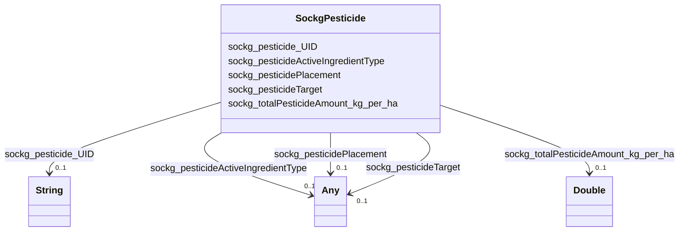

# Class: TODO -- what's a good name for what this class (type) describes? (sockg_Pesticide)


_TODO -- tell the world what this class (type) describes._


URI: [sockg:Pesticide](http://www.semanticweb.org/sockg/ontologies/2024/0/soil-carbon-ontology/Pesticide)





<!-- no inheritance hierarchy -->


## Slots

| Name | Cardinality and Range | Description | Inheritance |
| ---  | --- | --- | --- |
| [sockg_pesticidePlacement](../slots/sockg_pesticidePlacement.md) | 0..1 <br/> [Any](../classes/Any.md)&nbsp;or&nbsp;<br />[xsd:double](http://www.w3.org/2001/XMLSchema#double)&nbsp;or&nbsp;<br />[xsd:string](http://www.w3.org/2001/XMLSchema#string) | TODO -- tell the world what this slot (predicate) describes | direct |
| [sockg_pesticideActiveIngredientType](../slots/sockg_pesticideActiveIngredientType.md) | 0..1 <br/> [Any](../classes/Any.md)&nbsp;or&nbsp;<br />[xsd:string](http://www.w3.org/2001/XMLSchema#string)&nbsp;or&nbsp;<br />[xsd:double](http://www.w3.org/2001/XMLSchema#double) | TODO -- tell the world what this slot (predicate) describes | direct |
| [sockg_pesticideTarget](../slots/sockg_pesticideTarget.md) | 0..1 <br/> [Any](../classes/Any.md)&nbsp;or&nbsp;<br />[xsd:double](http://www.w3.org/2001/XMLSchema#double)&nbsp;or&nbsp;<br />[xsd:string](http://www.w3.org/2001/XMLSchema#string) | TODO -- tell the world what this slot (predicate) describes | direct |
| [sockg_pesticide_UID](../slots/sockg_pesticide_UID.md) | 0..1 <br/> [xsd:string](http://www.w3.org/2001/XMLSchema#string) | TODO -- tell the world what this slot (predicate) describes | direct |
| [sockg_totalPesticideAmount_kg_per_ha](../slots/sockg_totalPesticideAmount_kg_per_ha.md) | 0..1 <br/> [xsd:double](http://www.w3.org/2001/XMLSchema#double) | TODO -- tell the world what this slot (predicate) describes | direct |


## Usages

| used by | used in | type | used |
| ---  | --- | --- | --- |
| [SockgAmendment](../classes/SockgAmendment.md) | [sockg_hasPesticide](../slots/sockg_hasPesticide.md) | range | [SockgPesticide](../classes/SockgPesticide.md) |


## Examples

| Value |
| --- |
| neo4j://graph.individuals#203598 |

## TODOs

* TODO -- Todos for this class go here
* or you can delete the todos
* if you think the class is perfect.

## Identifier and Mapping Information


### Schema Source


* from schema: soc-kg/main


## Mappings

| Mapping Type | Mapped Value |
| ---  | ---  |
| self | sockg:Pesticide |
| native | soc-kg/main/:SockgPesticide |


## LinkML Source

<!-- TODO: investigate https://stackoverflow.com/questions/37606292/how-to-create-tabbed-code-blocks-in-mkdocs-or-sphinx -->

### Direct

<details>
```yaml
name: sockg_Pesticide
description: TODO -- tell the world what this class (type) describes.
title: TODO -- what's a good name for what this class (type) describes?
todos:
- TODO -- Todos for this class go here
- or you can delete the todos
- if you think the class is perfect.
notes:
- There are 356 instances of this class.
examples:
- value: neo4j://graph.individuals#203598
from_schema: soc-kg/main
slots:
- sockg_pesticidePlacement
- sockg_pesticideActiveIngredientType
- sockg_pesticideTarget
- sockg_pesticide_UID
- sockg_totalPesticideAmount_kg_per_ha
class_uri: sockg:Pesticide

```
</details>

### Induced

<details>
```yaml
name: sockg_Pesticide
description: TODO -- tell the world what this class (type) describes.
title: TODO -- what's a good name for what this class (type) describes?
todos:
- TODO -- Todos for this class go here
- or you can delete the todos
- if you think the class is perfect.
notes:
- There are 356 instances of this class.
examples:
- value: neo4j://graph.individuals#203598
from_schema: soc-kg/main
attributes:
  sockg_pesticidePlacement:
    name: sockg_pesticidePlacement
    description: TODO -- tell the world what this slot (predicate) describes.
    todos:
    - TODO -- Todos for this slot go here
    - or you can delete the todos
    - if you think the class is perfect.
    comments:
    - 126 occurrences with subject type sockg:Pesticide and object type xsd:double.
    - 230 occurrences with subject type sockg:Pesticide and object type string.
    examples:
    - value: neo4j://graph.individuals#203406 sockg:pesticidePlacement nan
    - value: neo4j://graph.individuals#203699 sockg:pesticidePlacement Tractor mounted
        spray boom
    from_schema: soc-kg/main
    rank: 1000
    slot_uri: sockg:pesticidePlacement
    alias: sockg_pesticidePlacement
    owner: sockg_Pesticide
    domain_of:
    - sockg_Pesticide
    range: Any
    any_of:
    - range: double
    - range: string
  sockg_pesticideActiveIngredientType:
    name: sockg_pesticideActiveIngredientType
    description: TODO -- tell the world what this slot (predicate) describes.
    todos:
    - TODO -- Todos for this slot go here
    - or you can delete the todos
    - if you think the class is perfect.
    comments:
    - 353 occurrences with subject type sockg:Pesticide and object type string.
    - 3 occurrences with subject type sockg:Pesticide and object type xsd:double.
    examples:
    - value: neo4j://graph.individuals#203409 sockg:pesticideActiveIngredientType
        Sethoxydim; CAS No. 74051-80-2
    - value: neo4j://graph.individuals#203707 sockg:pesticideActiveIngredientType
        nan
    from_schema: soc-kg/main
    rank: 1000
    slot_uri: sockg:pesticideActiveIngredientType
    alias: sockg_pesticideActiveIngredientType
    owner: sockg_Pesticide
    domain_of:
    - sockg_Pesticide
    range: Any
    any_of:
    - range: string
    - range: double
  sockg_pesticideTarget:
    name: sockg_pesticideTarget
    description: TODO -- tell the world what this slot (predicate) describes.
    todos:
    - TODO -- Todos for this slot go here
    - or you can delete the todos
    - if you think the class is perfect.
    comments:
    - 109 occurrences with subject type sockg:Pesticide and object type xsd:double.
    - 247 occurrences with subject type sockg:Pesticide and object type string.
    examples:
    - value: neo4j://graph.individuals#203722 sockg:pesticideTarget nan
    - value: neo4j://graph.individuals#203534 sockg:pesticideTarget Downy brome, ripgut
        brome and other grass species
    from_schema: soc-kg/main
    rank: 1000
    slot_uri: sockg:pesticideTarget
    alias: sockg_pesticideTarget
    owner: sockg_Pesticide
    domain_of:
    - sockg_Pesticide
    range: Any
    any_of:
    - range: double
    - range: string
  sockg_pesticide_UID:
    name: sockg_pesticide_UID
    description: TODO -- tell the world what this slot (predicate) describes.
    todos:
    - TODO -- Todos for this slot go here
    - or you can delete the todos
    - if you think the class is perfect.
    comments:
    - 356 occurrences with subject type sockg:Pesticide and object type string.
    examples:
    - value: neo4j://graph.individuals#203448 sockg:pesticide_UID AgCros_0.7_Atrazine_CAS_No._1912-24-9_Grass_Species_Tractor_mounted_spray_boom
    from_schema: soc-kg/main
    rank: 1000
    slot_uri: sockg:pesticide_UID
    alias: sockg_pesticide_UID
    owner: sockg_Pesticide
    domain_of:
    - sockg_Pesticide
    range: string
  sockg_totalPesticideAmount_kg_per_ha:
    name: sockg_totalPesticideAmount_kg_per_ha
    description: TODO -- tell the world what this slot (predicate) describes.
    todos:
    - TODO -- Todos for this slot go here
    - or you can delete the todos
    - if you think the class is perfect.
    comments:
    - 356 occurrences with subject type sockg:Pesticide and object type xsd:double.
    examples:
    - value: neo4j://graph.individuals#203659 sockg:totalPesticideAmount_kg_per_ha
        2.8
    from_schema: soc-kg/main
    rank: 1000
    slot_uri: sockg:totalPesticideAmount_kg_per_ha
    alias: sockg_totalPesticideAmount_kg_per_ha
    owner: sockg_Pesticide
    domain_of:
    - sockg_Pesticide
    range: double
class_uri: sockg:Pesticide

```
</details>