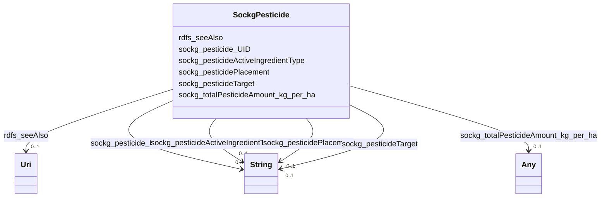

# Class: No class (entity type) name specified (sockg_Pesticide)


_Pesticides are substances used in agriculture to manage pests and diseases that affect crops, ensuring better yield and quality. Each pesticide is characterized by its active ingredients, application methods, target organisms, and usage amounts to optimize agricultural practices and minimize environmental impact._


This class occurs 356 times.


URI: [sockg:Pesticide](https://idir.uta.edu/sockg-ontology/docs/Pesticide)





<!-- no inheritance hierarchy -->


## Slots

| Name | Cardinality and Range | Description | Inheritance | Occurrences |
| ---  | --- | --- | --- | --- |
| [sockg_pesticidePlacement](../slots/sockg_pesticidePlacement.md) | 0..1 <br/> [xsd:string](http://www.w3.org/2001/XMLSchema#string) | No slot (predicate) description specified <br/>  | direct | 230 |
| [sockg_pesticideTarget](../slots/sockg_pesticideTarget.md) | 0..1 <br/> [xsd:string](http://www.w3.org/2001/XMLSchema#string) | No slot (predicate) description specified <br/>  | direct | 247 |
| [sockg_pesticideActiveIngredientType](../slots/sockg_pesticideActiveIngredientType.md) | 0..1 <br/> [xsd:string](http://www.w3.org/2001/XMLSchema#string) | No slot (predicate) description specified <br/>  | direct | 353 |
| [sockg_totalPesticideAmount_kg_per_ha](../slots/sockg_totalPesticideAmount_kg_per_ha.md) | 0..1 <br/> [xsd:float](http://www.w3.org/2001/XMLSchema#float)&nbsp;or&nbsp;<br />[xsd:double](http://www.w3.org/2001/XMLSchema#double) | No slot (predicate) description specified <br/>  | direct | 353 |
| [sockg_pesticide_UID](../slots/sockg_pesticide_UID.md) | 0..1 <br/> [xsd:string](http://www.w3.org/2001/XMLSchema#string) | No slot (predicate) description specified <br/>  | direct | 356 |
| [rdfs_seeAlso](../slots/rdfs_seeAlso.md) | 0..1 <br/> [xsd:anyURI](http://www.w3.org/2001/XMLSchema#anyURI) | No slot (predicate) description specified <br/>  | direct | 356 |


## Usages

| used by | used in | type | used |
| ---  | --- | --- | --- |
| [SockgAmendment](../classes/SockgAmendment.md) | [sockg_hasPesticide](../slots/sockg_hasPesticide.md) | range | [SockgPesticide](../classes/SockgPesticide.md) |
| [SockgPesticide](../classes/SockgPesticide.md) | [sockg_pesticidePlacement](../slots/sockg_pesticidePlacement.md) | domain | [SockgPesticide](../classes/SockgPesticide.md) |
| [SockgPesticide](../classes/SockgPesticide.md) | [sockg_pesticideTarget](../slots/sockg_pesticideTarget.md) | domain | [SockgPesticide](../classes/SockgPesticide.md) |
| [SockgPesticide](../classes/SockgPesticide.md) | [sockg_pesticideActiveIngredientType](../slots/sockg_pesticideActiveIngredientType.md) | domain | [SockgPesticide](../classes/SockgPesticide.md) |
| [SockgPesticide](../classes/SockgPesticide.md) | [sockg_totalPesticideAmount_kg_per_ha](../slots/sockg_totalPesticideAmount_kg_per_ha.md) | domain | [SockgPesticide](../classes/SockgPesticide.md) |
| [SockgPesticide](../classes/SockgPesticide.md) | [sockg_pesticide_UID](../slots/sockg_pesticide_UID.md) | domain | [SockgPesticide](../classes/SockgPesticide.md) |


## See Also

* [https://lod.nal.usda.gov/nalt/287](https://lod.nal.usda.gov/nalt/287)


## LinkML Source

<!-- TODO: investigate https://stackoverflow.com/questions/37606292/how-to-create-tabbed-code-blocks-in-mkdocs-or-sphinx -->

### Direct

<details>

```yaml
name: sockg_Pesticide
conforms_to: No schema conformance document specified
annotations:
  count:
    tag: count
    value: 356
description: Pesticides are substances used in agriculture to manage pests and diseases
  that affect crops, ensuring better yield and quality. Each pesticide is characterized
  by its active ingredients, application methods, target organisms, and usage amounts
  to optimize agricultural practices and minimize environmental impact.
title: No class (entity type) name specified
from_schema: soc-kg
see_also:
- https://lod.nal.usda.gov/nalt/287
rank: 1000
slots:
- sockg_pesticidePlacement
- sockg_pesticideTarget
- sockg_pesticideActiveIngredientType
- sockg_totalPesticideAmount_kg_per_ha
- sockg_pesticide_UID
- rdfs_seeAlso
slot_usage:
  rdfs_seeAlso:
    name: rdfs_seeAlso
    annotations:
      uri:
        tag: uri
        value: 356
  sockg_pesticideActiveIngredientType:
    name: sockg_pesticideActiveIngredientType
    annotations:
      string:
        tag: string
        value: 353
  sockg_pesticidePlacement:
    name: sockg_pesticidePlacement
    annotations:
      string:
        tag: string
        value: 230
  sockg_pesticideTarget:
    name: sockg_pesticideTarget
    annotations:
      string:
        tag: string
        value: 247
  sockg_pesticide_UID:
    name: sockg_pesticide_UID
    annotations:
      string:
        tag: string
        value: 356
  sockg_totalPesticideAmount_kg_per_ha:
    name: sockg_totalPesticideAmount_kg_per_ha
    annotations:
      double:
        tag: double
        value: 353
class_uri: sockg:Pesticide

```
</details>

### Induced

<details>

```yaml
name: sockg_Pesticide
conforms_to: No schema conformance document specified
annotations:
  count:
    tag: count
    value: 356
description: Pesticides are substances used in agriculture to manage pests and diseases
  that affect crops, ensuring better yield and quality. Each pesticide is characterized
  by its active ingredients, application methods, target organisms, and usage amounts
  to optimize agricultural practices and minimize environmental impact.
title: No class (entity type) name specified
from_schema: soc-kg
see_also:
- https://lod.nal.usda.gov/nalt/287
rank: 1000
slot_usage:
  rdfs_seeAlso:
    name: rdfs_seeAlso
    annotations:
      uri:
        tag: uri
        value: 356
  sockg_pesticideActiveIngredientType:
    name: sockg_pesticideActiveIngredientType
    annotations:
      string:
        tag: string
        value: 353
  sockg_pesticidePlacement:
    name: sockg_pesticidePlacement
    annotations:
      string:
        tag: string
        value: 230
  sockg_pesticideTarget:
    name: sockg_pesticideTarget
    annotations:
      string:
        tag: string
        value: 247
  sockg_pesticide_UID:
    name: sockg_pesticide_UID
    annotations:
      string:
        tag: string
        value: 356
  sockg_totalPesticideAmount_kg_per_ha:
    name: sockg_totalPesticideAmount_kg_per_ha
    annotations:
      double:
        tag: double
        value: 353
attributes:
  sockg_pesticidePlacement:
    name: sockg_pesticidePlacement
    annotations:
      string:
        tag: string
        value: 230
    description: No slot (predicate) description specified
    title: No slot (predicate) name specified
    examples:
    - object:
        example_object: Under soil with planter
        example_object_type: string
        example_predicate: sockg:pesticidePlacement
        example_subject: sockg:individuals/203636
        example_subject_type: sockg_Pesticide
    from_schema: soc-kg
    see_also:
    - https://lod.nal.usda.gov/nalt/142739
    rank: 1000
    domain: sockg_Pesticide
    slot_uri: sockg:pesticidePlacement
    alias: sockg_pesticidePlacement
    owner: sockg_Pesticide
    domain_of:
    - sockg_Pesticide
    range: string
  sockg_pesticideTarget:
    name: sockg_pesticideTarget
    annotations:
      string:
        tag: string
        value: 247
    description: No slot (predicate) description specified
    title: No slot (predicate) name specified
    examples:
    - object:
        example_object: weeds
        example_object_type: string
        example_predicate: sockg:pesticideTarget
        example_subject: sockg:individuals/203633
        example_subject_type: sockg_Pesticide
    from_schema: soc-kg
    see_also:
    - https://lod.nal.usda.gov/nalt/839
    rank: 1000
    domain: sockg_Pesticide
    slot_uri: sockg:pesticideTarget
    alias: sockg_pesticideTarget
    owner: sockg_Pesticide
    domain_of:
    - sockg_Pesticide
    range: string
  sockg_pesticideActiveIngredientType:
    name: sockg_pesticideActiveIngredientType
    annotations:
      string:
        tag: string
        value: 353
    description: No slot (predicate) description specified
    title: No slot (predicate) name specified
    examples:
    - object:
        example_object: 2,4-D; CAS No. 94-75-7
        example_object_type: string
        example_predicate: sockg:pesticideActiveIngredientType
        example_subject: sockg:individuals/203633
        example_subject_type: sockg_Pesticide
    from_schema: soc-kg
    see_also:
    - https://lod.nal.usda.gov/nalt/3927
    rank: 1000
    domain: sockg_Pesticide
    slot_uri: sockg:pesticideActiveIngredientType
    alias: sockg_pesticideActiveIngredientType
    owner: sockg_Pesticide
    domain_of:
    - sockg_Pesticide
    range: string
  sockg_totalPesticideAmount_kg_per_ha:
    name: sockg_totalPesticideAmount_kg_per_ha
    annotations:
      double:
        tag: double
        value: 353
    description: No slot (predicate) description specified
    title: No slot (predicate) name specified
    examples:
    - object:
        example_object: '0.0'
        example_object_type: double
        example_predicate: sockg:totalPesticideAmount_kg_per_ha
        example_subject: sockg:individuals/203632
        example_subject_type: sockg_Pesticide
    from_schema: soc-kg
    rank: 1000
    domain: sockg_Pesticide
    slot_uri: sockg:totalPesticideAmount_kg_per_ha
    alias: sockg_totalPesticideAmount_kg_per_ha
    owner: sockg_Pesticide
    domain_of:
    - sockg_Pesticide
    range: Any
    any_of:
    - range: float
    - range: double
  sockg_pesticide_UID:
    name: sockg_pesticide_UID
    annotations:
      string:
        tag: string
        value: 356
    description: No slot (predicate) description specified
    title: No slot (predicate) name specified
    examples:
    - object:
        example_object: AgCros_0.0_nan_nan_nan
        example_object_type: string
        example_predicate: sockg:pesticide_UID
        example_subject: sockg:individuals/203632
        example_subject_type: sockg_Pesticide
    from_schema: soc-kg
    rank: 1000
    domain: sockg_Pesticide
    slot_uri: sockg:pesticide_UID
    alias: sockg_pesticide_UID
    owner: sockg_Pesticide
    domain_of:
    - sockg_Pesticide
    range: string
  rdfs_seeAlso:
    name: rdfs_seeAlso
    annotations:
      uri:
        tag: uri
        value: 356
    description: No slot (predicate) description specified
    examples:
    - object:
        example_object: https://lod.nal.usda.gov/nalt/4605
        example_object_type: uri
        example_predicate: rdfs:seeAlso
        example_subject: sockg:individuals/0
        example_subject_type: sockg_Amendment
    - object:
        example_object: https://lod.nal.usda.gov/nalt/5859
        example_object_type: uri
        example_predicate: rdfs:seeAlso
        example_subject: sockg:individuals/100000
        example_subject_type: sockg_GasSample
    - object:
        example_object: https://lod.nal.usda.gov/nalt/281219
        example_object_type: uri
        example_predicate: rdfs:seeAlso
        example_subject: sockg:individuals/163960
        example_subject_type: sockg_Grazing
    - object:
        example_object: https://lod.nal.usda.gov/nalt/4377260
        example_object_type: uri
        example_predicate: rdfs:seeAlso
        example_subject: sockg:individuals/170955
        example_subject_type: sockg_GrazingManagementEvent
    - object:
        example_object: https://lod.nal.usda.gov/nalt/131626
        example_object_type: uri
        example_predicate: rdfs:seeAlso
        example_subject: sockg:individuals/172906
        example_subject_type: sockg_Harvest
    - object:
        example_object: https://lod.nal.usda.gov/nalt/281219
        example_object_type: uri
        example_predicate: rdfs:seeAlso
        example_subject: sockg:individuals/191262
        example_subject_type: sockg_HarvestFraction
    - object:
        example_object: https://lod.nal.usda.gov/nalt/13189
        example_object_type: uri
        example_predicate: rdfs:seeAlso
        example_subject: sockg:individuals/203523
        example_subject_type: sockg_Organization
    - object:
        example_object: https://lod.nal.usda.gov/nalt/3927
        example_object_type: uri
        example_predicate: rdfs:seeAlso
        example_subject: sockg:individuals/203632
        example_subject_type: sockg_Pesticide
    - object:
        example_object: https://lod.nal.usda.gov/nalt/849
        example_object_type: uri
        example_predicate: rdfs:seeAlso
        example_subject: sockg:individuals/227674
        example_subject_type: sockg_ResidueManagementEvent
    - object:
        example_object: https://lod.nal.usda.gov/nalt/30158
        example_object_type: uri
        example_predicate: rdfs:seeAlso
        example_subject: sockg:individuals/230982
        example_subject_type: sockg_Rotation
    - object:
        example_object: https://lod.nal.usda.gov/nalt/302328
        example_object_type: uri
        example_predicate: rdfs:seeAlso
        example_subject: sockg:individuals/231056
        example_subject_type: sockg_Site
    - object:
        example_object: https://lod.nal.usda.gov/nalt/2726
        example_object_type: uri
        example_predicate: rdfs:seeAlso
        example_subject: sockg:individuals/235229
        example_subject_type: sockg_SoilBiologicalSample
    - object:
        example_object: https://lod.nal.usda.gov/nalt/7974
        example_object_type: uri
        example_predicate: rdfs:seeAlso
        example_subject: sockg:individuals/253451
        example_subject_type: sockg_SoilChemicalSample
    - object:
        example_object: https://lod.nal.usda.gov/nalt/302328
        example_object_type: uri
        example_predicate: rdfs:seeAlso
        example_subject: sockg:individuals/307284
        example_subject_type: sockg_SoilCover
    - object:
        example_object: https://lod.nal.usda.gov/nalt/5143
        example_object_type: uri
        example_predicate: rdfs:seeAlso
        example_subject: sockg:individuals/308318
        example_subject_type: sockg_SoilPhysicalSample
    - object:
        example_object: https://lod.nal.usda.gov/nalt/5430914
        example_object_type: uri
        example_predicate: rdfs:seeAlso
        example_subject: sockg:individuals/336400
        example_subject_type: sockg_State
    - object:
        example_object: https://lod.nal.usda.gov/nalt/7140
        example_object_type: uri
        example_predicate: rdfs:seeAlso
        example_subject: sockg:individuals/336419
        example_subject_type: sockg_Tillage
    - object:
        example_object: https://lod.nal.usda.gov/nalt/28616
        example_object_type: uri
        example_predicate: rdfs:seeAlso
        example_subject: sockg:individuals/363556
        example_subject_type: sockg_Treatment
    - object:
        example_object: https://lod.nal.usda.gov/nalt/2717
        example_object_type: uri
        example_predicate: rdfs:seeAlso
        example_subject: sockg:individuals/37796
        example_subject_type: sockg_BioMassCarbohydrate
    - object:
        example_object: https://lod.nal.usda.gov/nalt/7140
        example_object_type: uri
        example_predicate: rdfs:seeAlso
        example_subject: sockg:individuals/39163
        example_subject_type: sockg_BioMassEnergy
    - object:
        example_object: https://lod.nal.usda.gov/nalt/281219
        example_object_type: uri
        example_predicate: rdfs:seeAlso
        example_subject: sockg:individuals/39962
        example_subject_type: sockg_BioMassMineral
    - object:
        example_object: https://lod.nal.usda.gov/nalt/2714
        example_object_type: uri
        example_predicate: rdfs:seeAlso
        example_subject: sockg:individuals/439235
        example_subject_type: sockg_WeatherObservation
    - object:
        example_object: https://lod.nal.usda.gov/nalt/7485997
        example_object_type: uri
        example_predicate: rdfs:seeAlso
        example_subject: sockg:individuals/46864
        example_subject_type: sockg_City
    - object:
        example_object: https://lod.nal.usda.gov/nalt/2217129
        example_object_type: uri
        example_predicate: rdfs:seeAlso
        example_subject: sockg:individuals/46904
        example_subject_type: sockg_County
    - object:
        example_object: https://lod.nal.usda.gov/nalt/302328
        example_object_type: uri
        example_predicate: rdfs:seeAlso
        example_subject: sockg:individuals/46937
        example_subject_type: sockg_CropGrowthStage
    - object:
        example_object: https://lod.nal.usda.gov/nalt/976
        example_object_type: uri
        example_predicate: rdfs:seeAlso
        example_subject: sockg:individuals/51906
        example_subject_type: sockg_Experiment
    - object:
        example_object: https://lod.nal.usda.gov/nalt/9183
        example_object_type: uri
        example_predicate: rdfs:seeAlso
        example_subject: sockg:individuals/51937
        example_subject_type: sockg_ExperimentalUnit
    - object:
        example_object: https://lod.nal.usda.gov/nalt/7259
        example_object_type: uri
        example_predicate: rdfs:seeAlso
        example_subject: sockg:individuals/55800
        example_subject_type: sockg_Field
    - object:
        example_object: https://lod.nal.usda.gov/nalt/7140
        example_object_type: uri
        example_predicate: rdfs:seeAlso
        example_subject: sockg:individuals/200732
        example_subject_type: sockg_NutrientEfficiency
    - object:
        example_object: https://lod.nal.usda.gov/nalt/35067
        example_object_type: uri
        example_predicate: rdfs:seeAlso
        example_subject: sockg:individuals/203534
        example_subject_type: sockg_Person
    - object:
        example_object: https://lod.nal.usda.gov/nalt/5630
        example_object_type: uri
        example_predicate: rdfs:seeAlso
        example_subject: sockg:individuals/203988
        example_subject_type: sockg_PlantingEvent
    - object:
        example_object: https://lod.nal.usda.gov/nalt/61097
        example_object_type: uri
        example_predicate: rdfs:seeAlso
        example_subject: sockg:individuals/227438
        example_subject_type: sockg_Project
    - object:
        example_object: https://lod.nal.usda.gov/nalt/305490
        example_object_type: uri
        example_predicate: rdfs:seeAlso
        example_subject: sockg:individuals/227447
        example_subject_type: sockg_Publication
    - object:
        example_object: https://lod.nal.usda.gov/nalt/48678
        example_object_type: uri
        example_predicate: rdfs:seeAlso
        example_subject: sockg:individuals/227609
        example_subject_type: sockg_ResearchUnit
    - object:
        example_object: https://lod.nal.usda.gov/nalt/33020
        example_object_type: uri
        example_predicate: rdfs:seeAlso
        example_subject: sockg:individuals/231116
        example_subject_type: sockg_Soil
    - object:
        example_object: https://lod.nal.usda.gov/nalt/7140
        example_object_type: uri
        example_predicate: rdfs:seeAlso
        example_subject: sockg:individuals/364326
        example_subject_type: sockg_WaterQualityArea
    - object:
        example_object: https://lod.nal.usda.gov/nalt/281219
        example_object_type: uri
        example_predicate: rdfs:seeAlso
        example_subject: sockg:individuals/364993
        example_subject_type: sockg_WaterQualityConc
    - object:
        example_object: https://lod.nal.usda.gov/nalt/7259
        example_object_type: uri
        example_predicate: rdfs:seeAlso
        example_subject: sockg:individuals/513777
        example_subject_type: sockg_WeatherStation
    - object:
        example_object: https://lod.nal.usda.gov/nalt/281219
        example_object_type: uri
        example_predicate: rdfs:seeAlso
        example_subject: sockg:individuals/55858
        example_subject_type: sockg_GasNutrientLoss
    - object:
        example_object: https://lod.nal.usda.gov/nalt/281219
        example_object_type: uri
        example_predicate: rdfs:seeAlso
        example_subject: sockg:individuals/624572
        example_subject_type: sockg_WindErosionArea
    - object:
        example_object: https://lod.nal.usda.gov/nalt/7140
        example_object_type: uri
        example_predicate: rdfs:seeAlso
        example_subject: sockg:individuals/624587
        example_subject_type: sockg_YieldNutrientUptake
    from_schema: soc-kg
    rank: 1000
    slot_uri: rdfs:seeAlso
    alias: rdfs_seeAlso
    owner: sockg_Pesticide
    domain_of:
    - sockg_Amendment
    - sockg_BioMassCarbohydrate
    - sockg_BioMassEnergy
    - sockg_BioMassMineral
    - sockg_City
    - sockg_County
    - sockg_CropGrowthStage
    - sockg_Experiment
    - sockg_ExperimentalUnit
    - sockg_Field
    - sockg_GasNutrientLoss
    - sockg_GasSample
    - sockg_Grazing
    - sockg_GrazingManagementEvent
    - sockg_Harvest
    - sockg_HarvestFraction
    - sockg_NutrientEfficiency
    - sockg_Organization
    - sockg_Person
    - sockg_Pesticide
    - sockg_PlantingEvent
    - sockg_Project
    - sockg_Publication
    - sockg_ResearchUnit
    - sockg_ResidueManagementEvent
    - sockg_Rotation
    - sockg_Site
    - sockg_Soil
    - sockg_SoilBiologicalSample
    - sockg_SoilChemicalSample
    - sockg_SoilCover
    - sockg_SoilPhysicalSample
    - sockg_State
    - sockg_Tillage
    - sockg_Treatment
    - sockg_WaterQualityArea
    - sockg_WaterQualityConc
    - sockg_WeatherObservation
    - sockg_WeatherStation
    - sockg_WindErosionArea
    - sockg_YieldNutrientUptake
    range: uri
class_uri: sockg:Pesticide

```
</details>