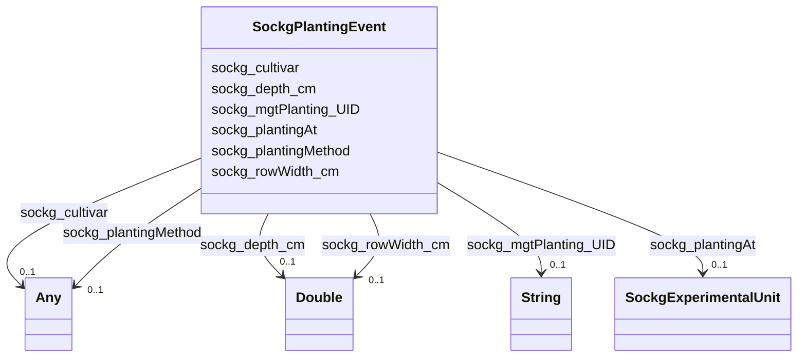

# Class: TODO -- what's a good name for what this class (type) describes? (sockg_PlantingEvent)


_TODO -- tell the world what this class (type) describes._


URI: [sockg:PlantingEvent](http://www.semanticweb.org/sockg/ontologies/2024/0/soil-carbon-ontology/PlantingEvent)





<!-- no inheritance hierarchy -->


## Slots

| Name | Cardinality and Range | Description | Inheritance |
| ---  | --- | --- | --- |
| [sockg_plantingAt](../slots/sockg_plantingAt.md) | 0..1 <br/> [SockgExperimentalUnit](../classes/SockgExperimentalUnit.md) | TODO -- tell the world what this slot (predicate) describes | direct |
| [sockg_plantingMethod](../slots/sockg_plantingMethod.md) | 0..1 <br/> [Any](../classes/Any.md)&nbsp;or&nbsp;<br />[xsd:double](http://www.w3.org/2001/XMLSchema#double)&nbsp;or&nbsp;<br />[xsd:string](http://www.w3.org/2001/XMLSchema#string) | TODO -- tell the world what this slot (predicate) describes | direct |
| [sockg_rowWidth_cm](../slots/sockg_rowWidth_cm.md) | 0..1 <br/> [xsd:double](http://www.w3.org/2001/XMLSchema#double) | TODO -- tell the world what this slot (predicate) describes | direct |
| [sockg_cultivar](../slots/sockg_cultivar.md) | 0..1 <br/> [Any](../classes/Any.md)&nbsp;or&nbsp;<br />[xsd:string](http://www.w3.org/2001/XMLSchema#string)&nbsp;or&nbsp;<br />[xsd:double](http://www.w3.org/2001/XMLSchema#double) | TODO -- tell the world what this slot (predicate) describes | direct |
| [sockg_depth_cm](../slots/sockg_depth_cm.md) | 0..1 <br/> [xsd:double](http://www.w3.org/2001/XMLSchema#double) | TODO -- tell the world what this slot (predicate) describes | direct |
| [sockg_mgtPlanting_UID](../slots/sockg_mgtPlanting_UID.md) | 0..1 <br/> [xsd:string](http://www.w3.org/2001/XMLSchema#string) | TODO -- tell the world what this slot (predicate) describes | direct |


## Examples

| Value |
| --- |
| neo4j://graph.individuals#220255 |

## TODOs

* TODO -- Todos for this class go here
* or you can delete the todos
* if you think the class is perfect.

## Identifier and Mapping Information


### Schema Source


* from schema: soc-kg/main


## Mappings

| Mapping Type | Mapped Value |
| ---  | ---  |
| self | sockg:PlantingEvent |
| native | soc-kg/main/:SockgPlantingEvent |


## LinkML Source

<!-- TODO: investigate https://stackoverflow.com/questions/37606292/how-to-create-tabbed-code-blocks-in-mkdocs-or-sphinx -->

### Direct

<details>
```yaml
name: sockg_PlantingEvent
description: TODO -- tell the world what this class (type) describes.
title: TODO -- what's a good name for what this class (type) describes?
todos:
- TODO -- Todos for this class go here
- or you can delete the todos
- if you think the class is perfect.
notes:
- There are 23450 instances of this class.
examples:
- value: neo4j://graph.individuals#220255
from_schema: soc-kg/main
slots:
- sockg_plantingAt
- sockg_plantingMethod
- sockg_rowWidth_cm
- sockg_cultivar
- sockg_depth_cm
- sockg_mgtPlanting_UID
class_uri: sockg:PlantingEvent

```
</details>

### Induced

<details>
```yaml
name: sockg_PlantingEvent
description: TODO -- tell the world what this class (type) describes.
title: TODO -- what's a good name for what this class (type) describes?
todos:
- TODO -- Todos for this class go here
- or you can delete the todos
- if you think the class is perfect.
notes:
- There are 23450 instances of this class.
examples:
- value: neo4j://graph.individuals#220255
from_schema: soc-kg/main
attributes:
  sockg_plantingAt:
    name: sockg_plantingAt
    description: TODO -- tell the world what this slot (predicate) describes.
    todos:
    - TODO -- Todos for this slot go here
    - or you can delete the todos
    - if you think the class is perfect.
    comments:
    - 23450 occurrences with subject type sockg:PlantingEvent and object type sockg:ExperimentalUnit.
    examples:
    - value: neo4j://graph.individuals#216173 sockg:plantingAt neo4j://graph.individuals#53269
    from_schema: soc-kg/main
    rank: 1000
    slot_uri: sockg:plantingAt
    alias: sockg_plantingAt
    owner: sockg_PlantingEvent
    domain_of:
    - sockg_PlantingEvent
    range: sockg_ExperimentalUnit
  sockg_plantingMethod:
    name: sockg_plantingMethod
    description: TODO -- tell the world what this slot (predicate) describes.
    todos:
    - TODO -- Todos for this slot go here
    - or you can delete the todos
    - if you think the class is perfect.
    comments:
    - 1136 occurrences with subject type sockg:PlantingEvent and object type xsd:double.
    - 22314 occurrences with subject type sockg:PlantingEvent and object type string.
    examples:
    - value: neo4j://graph.individuals#221390 sockg:plantingMethod nan
    - value: neo4j://graph.individuals#213199 sockg:plantingMethod Row
    from_schema: soc-kg/main
    rank: 1000
    slot_uri: sockg:plantingMethod
    alias: sockg_plantingMethod
    owner: sockg_PlantingEvent
    domain_of:
    - sockg_PlantingEvent
    range: Any
    any_of:
    - range: double
    - range: string
  sockg_rowWidth_cm:
    name: sockg_rowWidth_cm
    description: TODO -- tell the world what this slot (predicate) describes.
    todos:
    - TODO -- Todos for this slot go here
    - or you can delete the todos
    - if you think the class is perfect.
    comments:
    - 23450 occurrences with subject type sockg:PlantingEvent and object type xsd:double.
    examples:
    - value: neo4j://graph.individuals#212164 sockg:rowWidth_cm 76.2
    from_schema: soc-kg/main
    rank: 1000
    slot_uri: sockg:rowWidth_cm
    alias: sockg_rowWidth_cm
    owner: sockg_PlantingEvent
    domain_of:
    - sockg_PlantingEvent
    range: double
  sockg_cultivar:
    name: sockg_cultivar
    description: TODO -- tell the world what this slot (predicate) describes.
    todos:
    - TODO -- Todos for this slot go here
    - or you can delete the todos
    - if you think the class is perfect.
    comments:
    - 20817 occurrences with subject type sockg:PlantingEvent and object type string.
    - 2633 occurrences with subject type sockg:PlantingEvent and object type xsd:double.
    examples:
    - value: neo4j://graph.individuals#222400 sockg:cultivar Pioneer P1498AMI
    - value: neo4j://graph.individuals#220777 sockg:cultivar nan
    from_schema: soc-kg/main
    rank: 1000
    slot_uri: sockg:cultivar
    alias: sockg_cultivar
    owner: sockg_PlantingEvent
    domain_of:
    - sockg_PlantingEvent
    range: Any
    any_of:
    - range: string
    - range: double
  sockg_depth_cm:
    name: sockg_depth_cm
    description: TODO -- tell the world what this slot (predicate) describes.
    todos:
    - TODO -- Todos for this slot go here
    - or you can delete the todos
    - if you think the class is perfect.
    comments:
    - 23450 occurrences with subject type sockg:PlantingEvent and object type xsd:double.
    examples:
    - value: neo4j://graph.individuals#217775 sockg:depth_cm nan
    from_schema: soc-kg/main
    rank: 1000
    slot_uri: sockg:depth_cm
    alias: sockg_depth_cm
    owner: sockg_PlantingEvent
    domain_of:
    - sockg_PlantingEvent
    range: double
  sockg_mgtPlanting_UID:
    name: sockg_mgtPlanting_UID
    description: TODO -- tell the world what this slot (predicate) describes.
    todos:
    - TODO -- Todos for this slot go here
    - or you can delete the todos
    - if you think the class is perfect.
    comments:
    - 23450 occurrences with subject type sockg:PlantingEvent and object type string.
    examples:
    - value: neo4j://graph.individuals#223367 sockg:mgtPlanting_UID AgCros_NELITCSE_507_2009-05-14_Glycine_max_Soybean_
    from_schema: soc-kg/main
    rank: 1000
    slot_uri: sockg:mgtPlanting_UID
    alias: sockg_mgtPlanting_UID
    owner: sockg_PlantingEvent
    domain_of:
    - sockg_PlantingEvent
    range: string
class_uri: sockg:PlantingEvent

```
</details>