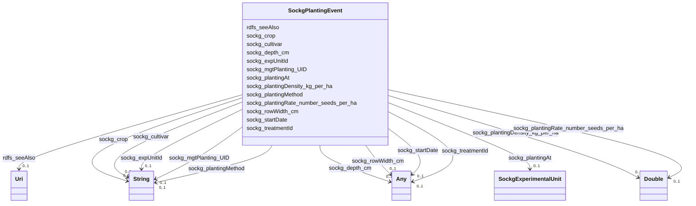

# Class: No class (entity type) name specified (sockg_PlantingEvent)


_An event involving the act of planting, which includes considerations for spacing and depth to optimize growth. This concept encompasses various methods and plant types to ensure successful agricultural production._


This class occurs 23450 times.


URI: [sockg:PlantingEvent](https://idir.uta.edu/sockg-ontology/docs/PlantingEvent)





<!-- no inheritance hierarchy -->


## Slots

| Name | Cardinality and Range | Description | Inheritance | Occurrences |
| ---  | --- | --- | --- | --- |
| [sockg_plantingRate_number_seeds_per_ha](../slots/sockg_plantingRate_number_seeds_per_ha.md) | 0..1 <br/> [xsd:double](http://www.w3.org/2001/XMLSchema#double) | No slot (predicate) description specified <br/>  | direct | 17377 |
| [sockg_mgtPlanting_UID](../slots/sockg_mgtPlanting_UID.md) | 0..1 <br/> [xsd:string](http://www.w3.org/2001/XMLSchema#string) | No slot (predicate) description specified <br/>  | direct | 23450 |
| [sockg_plantingAt](../slots/sockg_plantingAt.md) | 0..1 <br/> [SockgExperimentalUnit](../classes/SockgExperimentalUnit.md) | No slot (predicate) description specified <br/>  | direct | 23450 |
| [sockg_crop](../slots/sockg_crop.md) | 0..1 <br/> [xsd:string](http://www.w3.org/2001/XMLSchema#string) | No slot (predicate) description specified <br/>  | direct | 23450 |
| [sockg_startDate](../slots/sockg_startDate.md) | 0..1 <br/> [xsd:string](http://www.w3.org/2001/XMLSchema#string)&nbsp;or&nbsp;<br />[xsd:date](http://www.w3.org/2001/XMLSchema#date) | No slot (predicate) description specified <br/>  | direct | 23450 |
| [sockg_treatmentId](../slots/sockg_treatmentId.md) | 0..1 <br/> [xsd:float](http://www.w3.org/2001/XMLSchema#float)&nbsp;or&nbsp;<br />[xsd:string](http://www.w3.org/2001/XMLSchema#string)&nbsp;or&nbsp;<br />[xsd:date](http://www.w3.org/2001/XMLSchema#date) | No slot (predicate) description specified <br/>  | direct | 23450 |
| [sockg_plantingMethod](../slots/sockg_plantingMethod.md) | 0..1 <br/> [xsd:string](http://www.w3.org/2001/XMLSchema#string) | No slot (predicate) description specified <br/>  | direct | 22314 |
| [sockg_rowWidth_cm](../slots/sockg_rowWidth_cm.md) | 0..1 <br/> [xsd:float](http://www.w3.org/2001/XMLSchema#float)&nbsp;or&nbsp;<br />[xsd:double](http://www.w3.org/2001/XMLSchema#double) | No slot (predicate) description specified <br/>  | direct | 23450 |
| [sockg_cultivar](../slots/sockg_cultivar.md) | 0..1 <br/> [xsd:string](http://www.w3.org/2001/XMLSchema#string) | No slot (predicate) description specified <br/>  | direct | 20817 |
| [rdfs_seeAlso](../slots/rdfs_seeAlso.md) | 0..1 <br/> [xsd:anyURI](http://www.w3.org/2001/XMLSchema#anyURI) | No slot (predicate) description specified <br/>  | direct | 23450 |
| [sockg_expUnitId](../slots/sockg_expUnitId.md) | 0..1 <br/> [xsd:string](http://www.w3.org/2001/XMLSchema#string) | No slot (predicate) description specified <br/>  | direct | 23450 |
| [sockg_plantingDensity_kg_per_ha](../slots/sockg_plantingDensity_kg_per_ha.md) | 0..1 <br/> [xsd:double](http://www.w3.org/2001/XMLSchema#double) | No slot (predicate) description specified <br/>  | direct | 22514 |
| [sockg_depth_cm](../slots/sockg_depth_cm.md) | 0..1 <br/> [xsd:float](http://www.w3.org/2001/XMLSchema#float)&nbsp;or&nbsp;<br />[xsd:double](http://www.w3.org/2001/XMLSchema#double)&nbsp;or&nbsp;<br />[Int32](../types/Int32.md) | No slot (predicate) description specified <br/>  | direct | 20535 |


## Usages

| used by | used in | type | used |
| ---  | --- | --- | --- |
| [SockgPlantingEvent](../classes/SockgPlantingEvent.md) | [sockg_mgtPlanting_UID](../slots/sockg_mgtPlanting_UID.md) | domain | [SockgPlantingEvent](../classes/SockgPlantingEvent.md) |
| [SockgPlantingEvent](../classes/SockgPlantingEvent.md) | [sockg_plantingAt](../slots/sockg_plantingAt.md) | domain | [SockgPlantingEvent](../classes/SockgPlantingEvent.md) |
| [SockgPlantingEvent](../classes/SockgPlantingEvent.md) | [sockg_plantingMethod](../slots/sockg_plantingMethod.md) | domain | [SockgPlantingEvent](../classes/SockgPlantingEvent.md) |
| [SockgPlantingEvent](../classes/SockgPlantingEvent.md) | [sockg_rowWidth_cm](../slots/sockg_rowWidth_cm.md) | domain | [SockgPlantingEvent](../classes/SockgPlantingEvent.md) |
| [SockgPlantingEvent](../classes/SockgPlantingEvent.md) | [sockg_cultivar](../slots/sockg_cultivar.md) | domain | [SockgPlantingEvent](../classes/SockgPlantingEvent.md) |


## See Also

* [https://lod.nal.usda.gov/nalt/58546](https://lod.nal.usda.gov/nalt/58546)


## LinkML Source

<!-- TODO: investigate https://stackoverflow.com/questions/37606292/how-to-create-tabbed-code-blocks-in-mkdocs-or-sphinx -->

### Direct

<details>

```yaml
name: sockg_PlantingEvent
conforms_to: No schema conformance document specified
annotations:
  count:
    tag: count
    value: 23450
description: An event involving the act of planting, which includes considerations
  for spacing and depth to optimize growth. This concept encompasses various methods
  and plant types to ensure successful agricultural production.
title: No class (entity type) name specified
from_schema: soc-kg
see_also:
- https://lod.nal.usda.gov/nalt/58546
rank: 1000
slots:
- sockg_plantingRate_number_seeds_per_ha
- sockg_mgtPlanting_UID
- sockg_plantingAt
- sockg_crop
- sockg_startDate
- sockg_treatmentId
- sockg_plantingMethod
- sockg_rowWidth_cm
- sockg_cultivar
- rdfs_seeAlso
- sockg_expUnitId
- sockg_plantingDensity_kg_per_ha
- sockg_depth_cm
slot_usage:
  rdfs_seeAlso:
    name: rdfs_seeAlso
    annotations:
      uri:
        tag: uri
        value: 23450
  sockg_crop:
    name: sockg_crop
    annotations:
      string:
        tag: string
        value: 23450
  sockg_cultivar:
    name: sockg_cultivar
    annotations:
      string:
        tag: string
        value: 20817
  sockg_depth_cm:
    name: sockg_depth_cm
    annotations:
      double:
        tag: double
        value: 20535
  sockg_expUnitId:
    name: sockg_expUnitId
    annotations:
      string:
        tag: string
        value: 23450
  sockg_mgtPlanting_UID:
    name: sockg_mgtPlanting_UID
    annotations:
      string:
        tag: string
        value: 23450
  sockg_plantingAt:
    name: sockg_plantingAt
    annotations:
      sockg_ExperimentalUnit:
        tag: sockg_ExperimentalUnit
        value: 23450
  sockg_plantingDensity_kg_per_ha:
    name: sockg_plantingDensity_kg_per_ha
    annotations:
      double:
        tag: double
        value: 22514
  sockg_plantingMethod:
    name: sockg_plantingMethod
    annotations:
      string:
        tag: string
        value: 22314
  sockg_plantingRate_number_seeds_per_ha:
    name: sockg_plantingRate_number_seeds_per_ha
    annotations:
      double:
        tag: double
        value: 17377
  sockg_rowWidth_cm:
    name: sockg_rowWidth_cm
    annotations:
      double:
        tag: double
        value: 23450
  sockg_startDate:
    name: sockg_startDate
    annotations:
      string:
        tag: string
        value: 23450
  sockg_treatmentId:
    name: sockg_treatmentId
    annotations:
      string:
        tag: string
        value: 23450
class_uri: sockg:PlantingEvent

```
</details>

### Induced

<details>

```yaml
name: sockg_PlantingEvent
conforms_to: No schema conformance document specified
annotations:
  count:
    tag: count
    value: 23450
description: An event involving the act of planting, which includes considerations
  for spacing and depth to optimize growth. This concept encompasses various methods
  and plant types to ensure successful agricultural production.
title: No class (entity type) name specified
from_schema: soc-kg
see_also:
- https://lod.nal.usda.gov/nalt/58546
rank: 1000
slot_usage:
  rdfs_seeAlso:
    name: rdfs_seeAlso
    annotations:
      uri:
        tag: uri
        value: 23450
  sockg_crop:
    name: sockg_crop
    annotations:
      string:
        tag: string
        value: 23450
  sockg_cultivar:
    name: sockg_cultivar
    annotations:
      string:
        tag: string
        value: 20817
  sockg_depth_cm:
    name: sockg_depth_cm
    annotations:
      double:
        tag: double
        value: 20535
  sockg_expUnitId:
    name: sockg_expUnitId
    annotations:
      string:
        tag: string
        value: 23450
  sockg_mgtPlanting_UID:
    name: sockg_mgtPlanting_UID
    annotations:
      string:
        tag: string
        value: 23450
  sockg_plantingAt:
    name: sockg_plantingAt
    annotations:
      sockg_ExperimentalUnit:
        tag: sockg_ExperimentalUnit
        value: 23450
  sockg_plantingDensity_kg_per_ha:
    name: sockg_plantingDensity_kg_per_ha
    annotations:
      double:
        tag: double
        value: 22514
  sockg_plantingMethod:
    name: sockg_plantingMethod
    annotations:
      string:
        tag: string
        value: 22314
  sockg_plantingRate_number_seeds_per_ha:
    name: sockg_plantingRate_number_seeds_per_ha
    annotations:
      double:
        tag: double
        value: 17377
  sockg_rowWidth_cm:
    name: sockg_rowWidth_cm
    annotations:
      double:
        tag: double
        value: 23450
  sockg_startDate:
    name: sockg_startDate
    annotations:
      string:
        tag: string
        value: 23450
  sockg_treatmentId:
    name: sockg_treatmentId
    annotations:
      string:
        tag: string
        value: 23450
attributes:
  sockg_plantingRate_number_seeds_per_ha:
    name: sockg_plantingRate_number_seeds_per_ha
    annotations:
      double:
        tag: double
        value: 17377
    description: No slot (predicate) description specified
    examples:
    - object:
        example_object: '69188.0'
        example_object_type: double
        example_predicate: sockg:plantingRate_number_seeds_per_ha
        example_subject: sockg:individuals/203990
        example_subject_type: sockg_PlantingEvent
    from_schema: soc-kg
    rank: 1000
    slot_uri: sockg:plantingRate_number_seeds_per_ha
    alias: sockg_plantingRate_number_seeds_per_ha
    owner: sockg_PlantingEvent
    domain_of:
    - sockg_PlantingEvent
    range: double
  sockg_mgtPlanting_UID:
    name: sockg_mgtPlanting_UID
    annotations:
      string:
        tag: string
        value: 23450
    description: No slot (predicate) description specified
    title: No slot (predicate) name specified
    examples:
    - object:
        example_object: AgCros_MNMOFS_71_2004-11-04_Secale_cereale_Rye_
        example_object_type: string
        example_predicate: sockg:mgtPlanting_UID
        example_subject: sockg:individuals/203988
        example_subject_type: sockg_PlantingEvent
    from_schema: soc-kg
    rank: 1000
    domain: sockg_PlantingEvent
    slot_uri: sockg:mgtPlanting_UID
    alias: sockg_mgtPlanting_UID
    owner: sockg_PlantingEvent
    domain_of:
    - sockg_PlantingEvent
    range: string
  sockg_plantingAt:
    name: sockg_plantingAt
    annotations:
      sockg_ExperimentalUnit:
        tag: sockg_ExperimentalUnit
        value: 23450
    description: No slot (predicate) description specified
    title: No slot (predicate) name specified
    examples:
    - object:
        example_object: sockg:individuals/52719
        example_object_type: sockg_ExperimentalUnit
        example_predicate: sockg:plantingAt
        example_subject: sockg:individuals/203988
        example_subject_type: sockg_PlantingEvent
    from_schema: soc-kg
    rank: 1000
    domain: sockg_PlantingEvent
    slot_uri: sockg:plantingAt
    alias: sockg_plantingAt
    owner: sockg_PlantingEvent
    domain_of:
    - sockg_PlantingEvent
    range: sockg_ExperimentalUnit
  sockg_crop:
    name: sockg_crop
    annotations:
      string:
        tag: string
        value: 23450
    description: No slot (predicate) description specified
    title: No slot (predicate) name specified
    examples:
    - object:
        example_object: Glycine max (Soybean)
        example_object_type: string
        example_predicate: sockg:crop
        example_subject: sockg:individuals/0
        example_subject_type: sockg_Amendment
    - object:
        example_object: Rangeland
        example_object_type: string
        example_predicate: sockg:crop
        example_subject: sockg:individuals/100000
        example_subject_type: sockg_GasSample
    - object:
        example_object: Glycine max (Soybean)
        example_object_type: string
        example_predicate: sockg:crop
        example_subject: sockg:individuals/172906
        example_subject_type: sockg_Harvest
    - object:
        example_object: Zea mays (Corn)
        example_object_type: string
        example_predicate: sockg:crop
        example_subject: sockg:individuals/191262
        example_subject_type: sockg_HarvestFraction
    - object:
        example_object: Zea mays (Corn)
        example_object_type: string
        example_predicate: sockg:crop
        example_subject: sockg:individuals/227674
        example_subject_type: sockg_ResidueManagementEvent
    - object:
        example_object: Zea mays (Corn)
        example_object_type: string
        example_predicate: sockg:crop
        example_subject: sockg:individuals/37796
        example_subject_type: sockg_BioMassCarbohydrate
    - object:
        example_object: Zea mays (Corn)
        example_object_type: string
        example_predicate: sockg:crop
        example_subject: sockg:individuals/39163
        example_subject_type: sockg_BioMassEnergy
    - object:
        example_object: Zea mays (Corn)
        example_object_type: string
        example_predicate: sockg:crop
        example_subject: sockg:individuals/39962
        example_subject_type: sockg_BioMassMineral
    - object:
        example_object: Zea mays (Corn)
        example_object_type: string
        example_predicate: sockg:crop
        example_subject: sockg:individuals/46937
        example_subject_type: sockg_CropGrowthStage
    - object:
        example_object: Calendula officinalis L. (Calendula)
        example_object_type: string
        example_predicate: sockg:crop
        example_subject: sockg:individuals/200732
        example_subject_type: sockg_NutrientEfficiency
    - object:
        example_object: Secale cereale (Rye)
        example_object_type: string
        example_predicate: sockg:crop
        example_subject: sockg:individuals/203988
        example_subject_type: sockg_PlantingEvent
    - object:
        example_object: Glycine max (Soybean)
        example_object_type: string
        example_predicate: sockg:crop
        example_subject: sockg:individuals/364993
        example_subject_type: sockg_WaterQualityConc
    - object:
        example_object: Zea mays (Corn)
        example_object_type: string
        example_predicate: sockg:crop
        example_subject: sockg:individuals/55859
        example_subject_type: sockg_GasNutrientLoss
    - object:
        example_object: Zea mays (Corn)
        example_object_type: string
        example_predicate: sockg:crop
        example_subject: sockg:individuals/624587
        example_subject_type: sockg_YieldNutrientUptake
    from_schema: soc-kg
    see_also:
    - https://lod.nal.usda.gov/nalt/7140
    rank: 1000
    slot_uri: sockg:crop
    alias: sockg_crop
    owner: sockg_PlantingEvent
    domain_of:
    - sockg_Amendment
    - sockg_BioMassCarbohydrate
    - sockg_BioMassEnergy
    - sockg_BioMassMineral
    - sockg_CropGrowthStage
    - sockg_GasNutrientLoss
    - sockg_GasSample
    - sockg_Harvest
    - sockg_HarvestFraction
    - sockg_NutrientEfficiency
    - sockg_PlantingEvent
    - sockg_ResidueManagementEvent
    - sockg_WaterQualityConc
    - sockg_YieldNutrientUptake
    union_of:
    - '{''domain'': ''sockg_WaterQualityArea''}'
    - '{''domain'': ''sockg_WindErosionArea''}'
    - '{''domain'': ''sockg_NutrientEfficiency''}'
    - '{''domain'': ''sockg_WaterQualityConc''}'
    - '{''domain'': ''sockg_GasNutrientLoss''}'
    - '{''domain'': ''sockg_YieldNutrientUptake''}'
    - '{''domain'': ''sockg_BioMassMineral''}'
    - '{''domain'': ''sockg_BioMassCarbohydrate''}'
    - '{''domain'': ''sockg_BioMassEnergy''}'
    - '{''domain'': ''sockg_Tillage''}'
    range: string
  sockg_startDate:
    name: sockg_startDate
    annotations:
      string:
        tag: string
        value: 23450
    description: No slot (predicate) description specified
    title: No slot (predicate) name specified
    examples:
    - object:
        example_object: '2012-06-05'
        example_object_type: string
        example_predicate: sockg:startDate
        example_subject: sockg:individuals/0
        example_subject_type: sockg_Amendment
    - object:
        example_object: '2006-05-08'
        example_object_type: string
        example_predicate: sockg:startDate
        example_subject: sockg:individuals/170955
        example_subject_type: sockg_GrazingManagementEvent
    - object:
        example_object: '1987-04-30'
        example_object_type: string
        example_predicate: sockg:startDate
        example_subject: sockg:individuals/336419
        example_subject_type: sockg_Tillage
    - object:
        example_object: '2007-04-01'
        example_object_type: string
        example_predicate: sockg:startDate
        example_subject: sockg:individuals/51906
        example_subject_type: sockg_Experiment
    - object:
        example_object: '2009-01-01'
        example_object_type: string
        example_predicate: sockg:startDate
        example_subject: sockg:individuals/51937
        example_subject_type: sockg_ExperimentalUnit
    - object:
        example_object: '2004-11-04'
        example_object_type: string
        example_predicate: sockg:startDate
        example_subject: sockg:individuals/203988
        example_subject_type: sockg_PlantingEvent
    from_schema: soc-kg
    see_also:
    - https://lod.nal.usda.gov/nalt/9183
    rank: 1000
    slot_uri: sockg:startDate
    alias: sockg_startDate
    owner: sockg_PlantingEvent
    domain_of:
    - sockg_Amendment
    - sockg_Experiment
    - sockg_ExperimentalUnit
    - sockg_GrazingManagementEvent
    - sockg_PlantingEvent
    - sockg_Tillage
    union_of:
    - '{''domain'': ''sockg_WeatherStation''}'
    - '{''domain'': ''sockg_GrazingManagementEvent''}'
    - '{''domain'': ''sockg_ExperimentalUnit''}'
    - '{''domain'': ''sockg_Amendment''}'
    - '{''domain'': ''sockg_Experiment''}'
    range: Any
    any_of:
    - range: string
    - range: date
  sockg_treatmentId:
    name: sockg_treatmentId
    annotations:
      string:
        tag: string
        value: 23450
    description: No slot (predicate) description specified
    title: No slot (predicate) name specified
    examples:
    - object:
        example_object: PAHAW_ROT4
        example_object_type: string
        example_predicate: sockg:treatmentId
        example_subject: sockg:individuals/0
        example_subject_type: sockg_Amendment
    - object:
        example_object: NDMAHGPE_TANUR
        example_object_type: string
        example_predicate: sockg:treatmentId
        example_subject: sockg:individuals/100000
        example_subject_type: sockg_GasSample
    - object:
        example_object: GAJPCSR1_F1H1
        example_object_type: string
        example_predicate: sockg:treatmentId
        example_subject: sockg:individuals/163960
        example_subject_type: sockg_Grazing
    - object:
        example_object: PAHAW_PAST2
        example_object_type: string
        example_predicate: sockg:treatmentId
        example_subject: sockg:individuals/170955
        example_subject_type: sockg_GrazingManagementEvent
    - object:
        example_object: PAHAW_ROT1
        example_object_type: string
        example_predicate: sockg:treatmentId
        example_subject: sockg:individuals/172906
        example_subject_type: sockg_Harvest
    - object:
        example_object: MNMOFS_13
        example_object_type: string
        example_predicate: sockg:treatmentId
        example_subject: sockg:individuals/191262
        example_subject_type: sockg_HarvestFraction
    - object:
        example_object: PAHAW_ROT4
        example_object_type: string
        example_predicate: sockg:treatmentId
        example_subject: sockg:individuals/227674
        example_subject_type: sockg_ResidueManagementEvent
    - object:
        example_object: GAJPCSR1_F3H1
        example_object_type: string
        example_predicate: sockg:treatmentId
        example_subject: sockg:individuals/235229
        example_subject_type: sockg_SoilBiologicalSample
    - object:
        example_object: MNMOFS_44
        example_object_type: string
        example_predicate: sockg:treatmentId
        example_subject: sockg:individuals/253451
        example_subject_type: sockg_SoilChemicalSample
    - object:
        example_object: FullX200A
        example_object_type: string
        example_predicate: sockg:treatmentId
        example_subject: sockg:individuals/308318
        example_subject_type: sockg_SoilPhysicalSample
    - object:
        example_object: NDMAH3_C
        example_object_type: string
        example_predicate: sockg:treatmentId
        example_subject: sockg:individuals/363556
        example_subject_type: sockg_Treatment
    - object:
        example_object: MNSPReap_ST100
        example_object_type: string
        example_predicate: sockg:treatmentId
        example_subject: sockg:individuals/37796
        example_subject_type: sockg_BioMassCarbohydrate
    - object:
        example_object: SCFLSGI_100R
        example_object_type: string
        example_predicate: sockg:treatmentId
        example_subject: sockg:individuals/39163
        example_subject_type: sockg_BioMassEnergy
    - object:
        example_object: FullM125N
        example_object_type: string
        example_predicate: sockg:treatmentId
        example_subject: sockg:individuals/39962
        example_subject_type: sockg_BioMassMineral
    - object:
        example_object: INWLREAP_R50
        example_object_type: string
        example_predicate: sockg:treatmentId
        example_subject: sockg:individuals/46937
        example_subject_type: sockg_CropGrowthStage
    - object:
        example_object: MNMOCAL_N67
        example_object_type: string
        example_predicate: sockg:treatmentId
        example_subject: sockg:individuals/200732
        example_subject_type: sockg_NutrientEfficiency
    - object:
        example_object: MNMOFS_38
        example_object_type: string
        example_predicate: sockg:treatmentId
        example_subject: sockg:individuals/203988
        example_subject_type: sockg_PlantingEvent
    - object:
        example_object: WIPDBARN_SOIL
        example_object_type: string
        example_predicate: sockg:treatmentId
        example_subject: sockg:individuals/364326
        example_subject_type: sockg_WaterQualityArea
    - object:
        example_object: IAAMKELL_CC
        example_object_type: string
        example_predicate: sockg:treatmentId
        example_subject: sockg:individuals/364993
        example_subject_type: sockg_WaterQualityConc
    - object:
        example_object: IAAMKELL_NCC
        example_object_type: string
        example_predicate: sockg:treatmentId
        example_subject: sockg:individuals/55858
        example_subject_type: sockg_GasNutrientLoss
    - object:
        example_object: TXBSWEWC_N1985
        example_object_type: string
        example_predicate: sockg:treatmentId
        example_subject: sockg:individuals/624572
        example_subject_type: sockg_WindErosionArea
    - object:
        example_object: MNSP4R_U-S100
        example_object_type: string
        example_predicate: sockg:treatmentId
        example_subject: sockg:individuals/624587
        example_subject_type: sockg_YieldNutrientUptake
    from_schema: soc-kg
    rank: 1000
    slot_uri: sockg:treatmentId
    alias: sockg_treatmentId
    owner: sockg_PlantingEvent
    domain_of:
    - sockg_Amendment
    - sockg_BioMassCarbohydrate
    - sockg_BioMassEnergy
    - sockg_BioMassMineral
    - sockg_CropGrowthStage
    - sockg_GasNutrientLoss
    - sockg_GasSample
    - sockg_Grazing
    - sockg_GrazingManagementEvent
    - sockg_Harvest
    - sockg_HarvestFraction
    - sockg_NutrientEfficiency
    - sockg_PlantingEvent
    - sockg_ResidueManagementEvent
    - sockg_SoilBiologicalSample
    - sockg_SoilChemicalSample
    - sockg_SoilPhysicalSample
    - sockg_Treatment
    - sockg_WaterQualityArea
    - sockg_WaterQualityConc
    - sockg_WindErosionArea
    - sockg_YieldNutrientUptake
    union_of:
    - '{''domain'': ''sockg_SoilPhysicalSample''}'
    - '{''domain'': ''sockg_WaterQualityArea''}'
    - '{''domain'': ''sockg_WindErosionArea''}'
    - '{''domain'': ''sockg_NutrientEfficiency''}'
    - '{''domain'': ''sockg_Treatment''}'
    - '{''domain'': ''sockg_WaterQualityConc''}'
    - '{''domain'': ''sockg_GrazingManagementEvent''}'
    - '{''domain'': ''sockg_SoilChemicalSample''}'
    - '{''domain'': ''sockg_GasNutrientLoss''}'
    - '{''domain'': ''sockg_Amendment''}'
    - '{''domain'': ''sockg_SoilBiologicalSample''}'
    - '{''domain'': ''sockg_YieldNutrientUptake''}'
    - '{''domain'': ''sockg_BioMassCarbohydrate''}'
    - '{''domain'': ''sockg_HarvestFraction''}'
    - '{''domain'': ''sockg_ResidueManagementEvent''}'
    range: Any
    any_of:
    - range: float
    - range: string
    - range: date
  sockg_plantingMethod:
    name: sockg_plantingMethod
    annotations:
      string:
        tag: string
        value: 22314
    description: No slot (predicate) description specified
    title: No slot (predicate) name specified
    examples:
    - object:
        example_object: Broadcast
        example_object_type: string
        example_predicate: sockg:plantingMethod
        example_subject: sockg:individuals/203988
        example_subject_type: sockg_PlantingEvent
    from_schema: soc-kg
    see_also:
    - https://lod.nal.usda.gov/nalt/33957
    rank: 1000
    domain: sockg_PlantingEvent
    slot_uri: sockg:plantingMethod
    alias: sockg_plantingMethod
    owner: sockg_PlantingEvent
    domain_of:
    - sockg_PlantingEvent
    range: string
  sockg_rowWidth_cm:
    name: sockg_rowWidth_cm
    annotations:
      double:
        tag: double
        value: 23450
    description: No slot (predicate) description specified
    title: No slot (predicate) name specified
    examples:
    - object:
        example_object: '0.0'
        example_object_type: double
        example_predicate: sockg:rowWidth_cm
        example_subject: sockg:individuals/203988
        example_subject_type: sockg_PlantingEvent
    from_schema: soc-kg
    see_also:
    - https://lod.nal.usda.gov/nalt/58548
    rank: 1000
    domain: sockg_PlantingEvent
    slot_uri: sockg:rowWidth_cm
    alias: sockg_rowWidth_cm
    owner: sockg_PlantingEvent
    domain_of:
    - sockg_PlantingEvent
    range: Any
    any_of:
    - range: float
    - range: double
  sockg_cultivar:
    name: sockg_cultivar
    annotations:
      string:
        tag: string
        value: 20817
    description: No slot (predicate) description specified
    title: No slot (predicate) name specified
    examples:
    - object:
        example_object: Rye
        example_object_type: string
        example_predicate: sockg:cultivar
        example_subject: sockg:individuals/203988
        example_subject_type: sockg_PlantingEvent
    from_schema: soc-kg
    see_also:
    - https://lod.nal.usda.gov/nalt/5630
    rank: 1000
    domain: sockg_PlantingEvent
    slot_uri: sockg:cultivar
    alias: sockg_cultivar
    owner: sockg_PlantingEvent
    domain_of:
    - sockg_PlantingEvent
    range: string
  rdfs_seeAlso:
    name: rdfs_seeAlso
    annotations:
      uri:
        tag: uri
        value: 23450
    description: No slot (predicate) description specified
    examples:
    - object:
        example_object: https://lod.nal.usda.gov/nalt/4605
        example_object_type: uri
        example_predicate: rdfs:seeAlso
        example_subject: sockg:individuals/0
        example_subject_type: sockg_Amendment
    - object:
        example_object: https://lod.nal.usda.gov/nalt/5859
        example_object_type: uri
        example_predicate: rdfs:seeAlso
        example_subject: sockg:individuals/100000
        example_subject_type: sockg_GasSample
    - object:
        example_object: https://lod.nal.usda.gov/nalt/281219
        example_object_type: uri
        example_predicate: rdfs:seeAlso
        example_subject: sockg:individuals/163960
        example_subject_type: sockg_Grazing
    - object:
        example_object: https://lod.nal.usda.gov/nalt/4377260
        example_object_type: uri
        example_predicate: rdfs:seeAlso
        example_subject: sockg:individuals/170955
        example_subject_type: sockg_GrazingManagementEvent
    - object:
        example_object: https://lod.nal.usda.gov/nalt/131626
        example_object_type: uri
        example_predicate: rdfs:seeAlso
        example_subject: sockg:individuals/172906
        example_subject_type: sockg_Harvest
    - object:
        example_object: https://lod.nal.usda.gov/nalt/281219
        example_object_type: uri
        example_predicate: rdfs:seeAlso
        example_subject: sockg:individuals/191262
        example_subject_type: sockg_HarvestFraction
    - object:
        example_object: https://lod.nal.usda.gov/nalt/13189
        example_object_type: uri
        example_predicate: rdfs:seeAlso
        example_subject: sockg:individuals/203523
        example_subject_type: sockg_Organization
    - object:
        example_object: https://lod.nal.usda.gov/nalt/3927
        example_object_type: uri
        example_predicate: rdfs:seeAlso
        example_subject: sockg:individuals/203632
        example_subject_type: sockg_Pesticide
    - object:
        example_object: https://lod.nal.usda.gov/nalt/849
        example_object_type: uri
        example_predicate: rdfs:seeAlso
        example_subject: sockg:individuals/227674
        example_subject_type: sockg_ResidueManagementEvent
    - object:
        example_object: https://lod.nal.usda.gov/nalt/30158
        example_object_type: uri
        example_predicate: rdfs:seeAlso
        example_subject: sockg:individuals/230982
        example_subject_type: sockg_Rotation
    - object:
        example_object: https://lod.nal.usda.gov/nalt/302328
        example_object_type: uri
        example_predicate: rdfs:seeAlso
        example_subject: sockg:individuals/231056
        example_subject_type: sockg_Site
    - object:
        example_object: https://lod.nal.usda.gov/nalt/2726
        example_object_type: uri
        example_predicate: rdfs:seeAlso
        example_subject: sockg:individuals/235229
        example_subject_type: sockg_SoilBiologicalSample
    - object:
        example_object: https://lod.nal.usda.gov/nalt/7974
        example_object_type: uri
        example_predicate: rdfs:seeAlso
        example_subject: sockg:individuals/253451
        example_subject_type: sockg_SoilChemicalSample
    - object:
        example_object: https://lod.nal.usda.gov/nalt/302328
        example_object_type: uri
        example_predicate: rdfs:seeAlso
        example_subject: sockg:individuals/307284
        example_subject_type: sockg_SoilCover
    - object:
        example_object: https://lod.nal.usda.gov/nalt/5143
        example_object_type: uri
        example_predicate: rdfs:seeAlso
        example_subject: sockg:individuals/308318
        example_subject_type: sockg_SoilPhysicalSample
    - object:
        example_object: https://lod.nal.usda.gov/nalt/5430914
        example_object_type: uri
        example_predicate: rdfs:seeAlso
        example_subject: sockg:individuals/336400
        example_subject_type: sockg_State
    - object:
        example_object: https://lod.nal.usda.gov/nalt/7140
        example_object_type: uri
        example_predicate: rdfs:seeAlso
        example_subject: sockg:individuals/336419
        example_subject_type: sockg_Tillage
    - object:
        example_object: https://lod.nal.usda.gov/nalt/28616
        example_object_type: uri
        example_predicate: rdfs:seeAlso
        example_subject: sockg:individuals/363556
        example_subject_type: sockg_Treatment
    - object:
        example_object: https://lod.nal.usda.gov/nalt/2717
        example_object_type: uri
        example_predicate: rdfs:seeAlso
        example_subject: sockg:individuals/37796
        example_subject_type: sockg_BioMassCarbohydrate
    - object:
        example_object: https://lod.nal.usda.gov/nalt/7140
        example_object_type: uri
        example_predicate: rdfs:seeAlso
        example_subject: sockg:individuals/39163
        example_subject_type: sockg_BioMassEnergy
    - object:
        example_object: https://lod.nal.usda.gov/nalt/281219
        example_object_type: uri
        example_predicate: rdfs:seeAlso
        example_subject: sockg:individuals/39962
        example_subject_type: sockg_BioMassMineral
    - object:
        example_object: https://lod.nal.usda.gov/nalt/2714
        example_object_type: uri
        example_predicate: rdfs:seeAlso
        example_subject: sockg:individuals/439235
        example_subject_type: sockg_WeatherObservation
    - object:
        example_object: https://lod.nal.usda.gov/nalt/7485997
        example_object_type: uri
        example_predicate: rdfs:seeAlso
        example_subject: sockg:individuals/46864
        example_subject_type: sockg_City
    - object:
        example_object: https://lod.nal.usda.gov/nalt/2217129
        example_object_type: uri
        example_predicate: rdfs:seeAlso
        example_subject: sockg:individuals/46904
        example_subject_type: sockg_County
    - object:
        example_object: https://lod.nal.usda.gov/nalt/302328
        example_object_type: uri
        example_predicate: rdfs:seeAlso
        example_subject: sockg:individuals/46937
        example_subject_type: sockg_CropGrowthStage
    - object:
        example_object: https://lod.nal.usda.gov/nalt/976
        example_object_type: uri
        example_predicate: rdfs:seeAlso
        example_subject: sockg:individuals/51906
        example_subject_type: sockg_Experiment
    - object:
        example_object: https://lod.nal.usda.gov/nalt/9183
        example_object_type: uri
        example_predicate: rdfs:seeAlso
        example_subject: sockg:individuals/51937
        example_subject_type: sockg_ExperimentalUnit
    - object:
        example_object: https://lod.nal.usda.gov/nalt/7259
        example_object_type: uri
        example_predicate: rdfs:seeAlso
        example_subject: sockg:individuals/55800
        example_subject_type: sockg_Field
    - object:
        example_object: https://lod.nal.usda.gov/nalt/7140
        example_object_type: uri
        example_predicate: rdfs:seeAlso
        example_subject: sockg:individuals/200732
        example_subject_type: sockg_NutrientEfficiency
    - object:
        example_object: https://lod.nal.usda.gov/nalt/35067
        example_object_type: uri
        example_predicate: rdfs:seeAlso
        example_subject: sockg:individuals/203534
        example_subject_type: sockg_Person
    - object:
        example_object: https://lod.nal.usda.gov/nalt/5630
        example_object_type: uri
        example_predicate: rdfs:seeAlso
        example_subject: sockg:individuals/203988
        example_subject_type: sockg_PlantingEvent
    - object:
        example_object: https://lod.nal.usda.gov/nalt/61097
        example_object_type: uri
        example_predicate: rdfs:seeAlso
        example_subject: sockg:individuals/227438
        example_subject_type: sockg_Project
    - object:
        example_object: https://lod.nal.usda.gov/nalt/305490
        example_object_type: uri
        example_predicate: rdfs:seeAlso
        example_subject: sockg:individuals/227447
        example_subject_type: sockg_Publication
    - object:
        example_object: https://lod.nal.usda.gov/nalt/48678
        example_object_type: uri
        example_predicate: rdfs:seeAlso
        example_subject: sockg:individuals/227609
        example_subject_type: sockg_ResearchUnit
    - object:
        example_object: https://lod.nal.usda.gov/nalt/33020
        example_object_type: uri
        example_predicate: rdfs:seeAlso
        example_subject: sockg:individuals/231116
        example_subject_type: sockg_Soil
    - object:
        example_object: https://lod.nal.usda.gov/nalt/7140
        example_object_type: uri
        example_predicate: rdfs:seeAlso
        example_subject: sockg:individuals/364326
        example_subject_type: sockg_WaterQualityArea
    - object:
        example_object: https://lod.nal.usda.gov/nalt/281219
        example_object_type: uri
        example_predicate: rdfs:seeAlso
        example_subject: sockg:individuals/364993
        example_subject_type: sockg_WaterQualityConc
    - object:
        example_object: https://lod.nal.usda.gov/nalt/7259
        example_object_type: uri
        example_predicate: rdfs:seeAlso
        example_subject: sockg:individuals/513777
        example_subject_type: sockg_WeatherStation
    - object:
        example_object: https://lod.nal.usda.gov/nalt/281219
        example_object_type: uri
        example_predicate: rdfs:seeAlso
        example_subject: sockg:individuals/55858
        example_subject_type: sockg_GasNutrientLoss
    - object:
        example_object: https://lod.nal.usda.gov/nalt/281219
        example_object_type: uri
        example_predicate: rdfs:seeAlso
        example_subject: sockg:individuals/624572
        example_subject_type: sockg_WindErosionArea
    - object:
        example_object: https://lod.nal.usda.gov/nalt/7140
        example_object_type: uri
        example_predicate: rdfs:seeAlso
        example_subject: sockg:individuals/624587
        example_subject_type: sockg_YieldNutrientUptake
    from_schema: soc-kg
    rank: 1000
    slot_uri: rdfs:seeAlso
    alias: rdfs_seeAlso
    owner: sockg_PlantingEvent
    domain_of:
    - sockg_Amendment
    - sockg_BioMassCarbohydrate
    - sockg_BioMassEnergy
    - sockg_BioMassMineral
    - sockg_City
    - sockg_County
    - sockg_CropGrowthStage
    - sockg_Experiment
    - sockg_ExperimentalUnit
    - sockg_Field
    - sockg_GasNutrientLoss
    - sockg_GasSample
    - sockg_Grazing
    - sockg_GrazingManagementEvent
    - sockg_Harvest
    - sockg_HarvestFraction
    - sockg_NutrientEfficiency
    - sockg_Organization
    - sockg_Person
    - sockg_Pesticide
    - sockg_PlantingEvent
    - sockg_Project
    - sockg_Publication
    - sockg_ResearchUnit
    - sockg_ResidueManagementEvent
    - sockg_Rotation
    - sockg_Site
    - sockg_Soil
    - sockg_SoilBiologicalSample
    - sockg_SoilChemicalSample
    - sockg_SoilCover
    - sockg_SoilPhysicalSample
    - sockg_State
    - sockg_Tillage
    - sockg_Treatment
    - sockg_WaterQualityArea
    - sockg_WaterQualityConc
    - sockg_WeatherObservation
    - sockg_WeatherStation
    - sockg_WindErosionArea
    - sockg_YieldNutrientUptake
    range: uri
  sockg_expUnitId:
    name: sockg_expUnitId
    annotations:
      string:
        tag: string
        value: 23450
    description: No slot (predicate) description specified
    title: No slot (predicate) name specified
    examples:
    - object:
        example_object: MTSIFERE_GrazW-P/B-F3w2
        example_object_type: string
        example_predicate: sockg:expUnitId
        example_subject: sockg:individuals/51937
        example_subject_type: sockg_ExperimentalUnit
    - object:
        example_object: MNMOCAL_614
        example_object_type: string
        example_predicate: sockg:expUnitId
        example_subject: sockg:individuals/200732
        example_subject_type: sockg_NutrientEfficiency
    - object:
        example_object: MNMOFS_71
        example_object_type: string
        example_predicate: sockg:expUnitId
        example_subject: sockg:individuals/203988
        example_subject_type: sockg_PlantingEvent
    - object:
        example_object: WIPDBARN_2
        example_object_type: string
        example_predicate: sockg:expUnitId
        example_subject: sockg:individuals/364326
        example_subject_type: sockg_WaterQualityArea
    - object:
        example_object: IAAMKELL__120
        example_object_type: string
        example_predicate: sockg:expUnitId
        example_subject: sockg:individuals/364993
        example_subject_type: sockg_WaterQualityConc
    - object:
        example_object: IAAMKELL__116
        example_object_type: string
        example_predicate: sockg:expUnitId
        example_subject: sockg:individuals/55858
        example_subject_type: sockg_GasNutrientLoss
    - object:
        example_object: TXBSWEWC_COMP2
        example_object_type: string
        example_predicate: sockg:expUnitId
        example_subject: sockg:individuals/624572
        example_subject_type: sockg_WindErosionArea
    - object:
        example_object: MNSP4R_U-S100B
        example_object_type: string
        example_predicate: sockg:expUnitId
        example_subject: sockg:individuals/624587
        example_subject_type: sockg_YieldNutrientUptake
    from_schema: soc-kg
    see_also:
    - https://lod.nal.usda.gov/nalt/849
    rank: 1000
    slot_uri: sockg:expUnitId
    alias: sockg_expUnitId
    owner: sockg_PlantingEvent
    domain_of:
    - sockg_ExperimentalUnit
    - sockg_GasNutrientLoss
    - sockg_NutrientEfficiency
    - sockg_PlantingEvent
    - sockg_WaterQualityArea
    - sockg_WaterQualityConc
    - sockg_WindErosionArea
    - sockg_YieldNutrientUptake
    union_of:
    - '{''domain'': ''sockg_WaterQualityArea''}'
    - '{''domain'': ''sockg_WindErosionArea''}'
    - '{''domain'': ''sockg_NutrientEfficiency''}'
    - '{''domain'': ''sockg_WaterQualityConc''}'
    - '{''domain'': ''sockg_CropGrowthStage''}'
    - '{''domain'': ''sockg_ExperimentalUnit''}'
    - '{''domain'': ''sockg_Harvest''}'
    - '{''domain'': ''sockg_GasNutrientLoss''}'
    - '{''domain'': ''sockg_Amendment''}'
    - '{''domain'': ''sockg_YieldNutrientUptake''}'
    - '{''domain'': ''sockg_HarvestFraction''}'
    - '{''domain'': ''sockg_ResidueManagementEvent''}'
    - '{''domain'': ''sockg_GasSample''}'
    range: string
  sockg_plantingDensity_kg_per_ha:
    name: sockg_plantingDensity_kg_per_ha
    annotations:
      double:
        tag: double
        value: 22514
    description: No slot (predicate) description specified
    examples:
    - object:
        example_object: '151.0'
        example_object_type: double
        example_predicate: sockg:plantingDensity_kg_per_ha
        example_subject: sockg:individuals/203988
        example_subject_type: sockg_PlantingEvent
    from_schema: soc-kg
    rank: 1000
    slot_uri: sockg:plantingDensity_kg_per_ha
    alias: sockg_plantingDensity_kg_per_ha
    owner: sockg_PlantingEvent
    domain_of:
    - sockg_PlantingEvent
    range: double
  sockg_depth_cm:
    name: sockg_depth_cm
    annotations:
      double:
        tag: double
        value: 20535
    description: No slot (predicate) description specified
    title: No slot (predicate) name specified
    examples:
    - object:
        example_object: '0.0'
        example_object_type: double
        example_predicate: sockg:depth_cm
        example_subject: sockg:individuals/203988
        example_subject_type: sockg_PlantingEvent
    from_schema: soc-kg
    see_also:
    - https://lod.nal.usda.gov/nalt/305177
    rank: 1000
    slot_uri: sockg:depth_cm
    alias: sockg_depth_cm
    owner: sockg_PlantingEvent
    domain_of:
    - sockg_PlantingEvent
    union_of:
    - '{''domain'': ''sockg_Amendment''}'
    - '{''domain'': ''sockg_PlantingEvent''}'
    range: Any
    any_of:
    - range: float
    - range: double
    - range: int32
class_uri: sockg:PlantingEvent

```
</details>