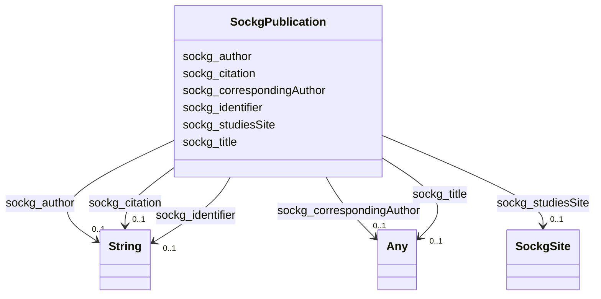

# Class: TODO -- what's a good name for what this class (type) describes? (sockg_Publication)


_TODO -- tell the world what this class (type) describes._


URI: [sockg:Publication](http://www.semanticweb.org/sockg/ontologies/2024/0/soil-carbon-ontology/Publication)





<!-- no inheritance hierarchy -->


## Slots

| Name | Cardinality and Range | Description | Inheritance |
| ---  | --- | --- | --- |
| [sockg_studiesSite](../slots/sockg_studiesSite.md) | 0..1 <br/> [SockgSite](../classes/SockgSite.md) | TODO -- tell the world what this slot (predicate) describes | direct |
| [sockg_title](../slots/sockg_title.md) | 0..1 <br/> [Any](../classes/Any.md)&nbsp;or&nbsp;<br />[xsd:string](http://www.w3.org/2001/XMLSchema#string)&nbsp;or&nbsp;<br />[xsd:double](http://www.w3.org/2001/XMLSchema#double) | TODO -- tell the world what this slot (predicate) describes | direct |
| [sockg_identifier](../slots/sockg_identifier.md) | 0..1 <br/> [xsd:string](http://www.w3.org/2001/XMLSchema#string) | TODO -- tell the world what this slot (predicate) describes | direct |
| [sockg_correspondingAuthor](../slots/sockg_correspondingAuthor.md) | 0..1 <br/> [Any](../classes/Any.md)&nbsp;or&nbsp;<br />[xsd:string](http://www.w3.org/2001/XMLSchema#string)&nbsp;or&nbsp;<br />[xsd:double](http://www.w3.org/2001/XMLSchema#double) | TODO -- tell the world what this slot (predicate) describes | direct |
| [sockg_author](../slots/sockg_author.md) | 0..1 <br/> [xsd:string](http://www.w3.org/2001/XMLSchema#string) | TODO -- tell the world what this slot (predicate) describes | direct |
| [sockg_citation](../slots/sockg_citation.md) | 0..1 <br/> [xsd:string](http://www.w3.org/2001/XMLSchema#string) | TODO -- tell the world what this slot (predicate) describes | direct |


## Examples

| Value |
| --- |
| neo4j://graph.individuals#227262 |

## TODOs

* TODO -- Todos for this class go here
* or you can delete the todos
* if you think the class is perfect.

## Identifier and Mapping Information


### Schema Source


* from schema: soc-kg/main


## Mappings

| Mapping Type | Mapped Value |
| ---  | ---  |
| self | sockg:Publication |
| native | soc-kg/main/:SockgPublication |


## LinkML Source

<!-- TODO: investigate https://stackoverflow.com/questions/37606292/how-to-create-tabbed-code-blocks-in-mkdocs-or-sphinx -->

### Direct

<details>
```yaml
name: sockg_Publication
description: TODO -- tell the world what this class (type) describes.
title: TODO -- what's a good name for what this class (type) describes?
todos:
- TODO -- Todos for this class go here
- or you can delete the todos
- if you think the class is perfect.
notes:
- There are 114 instances of this class.
examples:
- value: neo4j://graph.individuals#227262
from_schema: soc-kg/main
slots:
- sockg_studiesSite
- sockg_title
- sockg_identifier
- sockg_correspondingAuthor
- sockg_author
- sockg_citation
class_uri: sockg:Publication

```
</details>

### Induced

<details>
```yaml
name: sockg_Publication
description: TODO -- tell the world what this class (type) describes.
title: TODO -- what's a good name for what this class (type) describes?
todos:
- TODO -- Todos for this class go here
- or you can delete the todos
- if you think the class is perfect.
notes:
- There are 114 instances of this class.
examples:
- value: neo4j://graph.individuals#227262
from_schema: soc-kg/main
attributes:
  sockg_studiesSite:
    name: sockg_studiesSite
    description: TODO -- tell the world what this slot (predicate) describes.
    todos:
    - TODO -- Todos for this slot go here
    - or you can delete the todos
    - if you think the class is perfect.
    comments:
    - 123 occurrences with subject type sockg:Publication and object type sockg:Site.
    examples:
    - value: neo4j://graph.individuals#227270 sockg:studiesSite neo4j://graph.individuals#230710
    from_schema: soc-kg/main
    rank: 1000
    slot_uri: sockg:studiesSite
    alias: sockg_studiesSite
    owner: sockg_Publication
    domain_of:
    - sockg_Publication
    range: sockg_Site
  sockg_title:
    name: sockg_title
    description: TODO -- tell the world what this slot (predicate) describes.
    todos:
    - TODO -- Todos for this slot go here
    - or you can delete the todos
    - if you think the class is perfect.
    comments:
    - 107 occurrences with subject type sockg:Publication and object type string.
    - 7 occurrences with subject type sockg:Publication and object type xsd:double.
    examples:
    - value: neo4j://graph.individuals#227249 sockg:title Greenhouse gas emission
        from contrasting management scenarios in the northern Corn Belt.
    - value: neo4j://graph.individuals#227199 sockg:title nan
    from_schema: soc-kg/main
    rank: 1000
    slot_uri: sockg:title
    alias: sockg_title
    owner: sockg_Publication
    domain_of:
    - sockg_Publication
    range: Any
    any_of:
    - range: string
    - range: double
  sockg_identifier:
    name: sockg_identifier
    description: TODO -- tell the world what this slot (predicate) describes.
    todos:
    - TODO -- Todos for this slot go here
    - or you can delete the todos
    - if you think the class is perfect.
    comments:
    - 114 occurrences with subject type sockg:Publication and object type string.
    examples:
    - value: neo4j://graph.individuals#227247 sockg:identifier doi:10.2134/jeq2012.0129
    from_schema: soc-kg/main
    rank: 1000
    slot_uri: sockg:identifier
    alias: sockg_identifier
    owner: sockg_Publication
    domain_of:
    - sockg_Publication
    range: string
  sockg_correspondingAuthor:
    name: sockg_correspondingAuthor
    description: TODO -- tell the world what this slot (predicate) describes.
    todos:
    - TODO -- Todos for this slot go here
    - or you can delete the todos
    - if you think the class is perfect.
    comments:
    - 105 occurrences with subject type sockg:Publication and object type string.
    - 9 occurrences with subject type sockg:Publication and object type xsd:double.
    examples:
    - value: neo4j://graph.individuals#227203 sockg:correspondingAuthor Jin, Virginia
        L.
    - value: neo4j://graph.individuals#227205 sockg:correspondingAuthor nan
    from_schema: soc-kg/main
    rank: 1000
    slot_uri: sockg:correspondingAuthor
    alias: sockg_correspondingAuthor
    owner: sockg_Publication
    domain_of:
    - sockg_Publication
    range: Any
    any_of:
    - range: string
    - range: double
  sockg_author:
    name: sockg_author
    description: TODO -- tell the world what this slot (predicate) describes.
    todos:
    - TODO -- Todos for this slot go here
    - or you can delete the todos
    - if you think the class is perfect.
    comments:
    - 114 occurrences with subject type sockg:Publication and object type string.
    examples:
    - value: neo4j://graph.individuals#227211 sockg:author Sharon Weyers
    from_schema: soc-kg/main
    rank: 1000
    slot_uri: sockg:author
    alias: sockg_author
    owner: sockg_Publication
    domain_of:
    - sockg_Publication
    range: string
  sockg_citation:
    name: sockg_citation
    description: TODO -- tell the world what this slot (predicate) describes.
    todos:
    - TODO -- Todos for this slot go here
    - or you can delete the todos
    - if you think the class is perfect.
    comments:
    - 114 occurrences with subject type sockg:Publication and object type string.
    examples:
    - value: neo4j://graph.individuals#227242 sockg:citation Acosta-Martínez, V.,
        Dowd, S.E., Bell, C.W., Lascano, R., Booker, J.D., Zobeck, T.M., Upchurch
        D.R., 2010.  Microbial Community Composition as Affected by Dryland Cropping
        Systems and Tillage in a Semiarid Sandy Soil.  Diversity 2, 910-931.
    from_schema: soc-kg/main
    rank: 1000
    slot_uri: sockg:citation
    alias: sockg_citation
    owner: sockg_Publication
    domain_of:
    - sockg_Publication
    range: string
class_uri: sockg:Publication

```
</details>