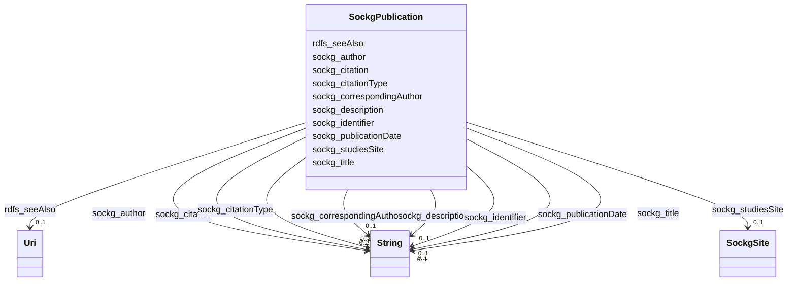

# Class: No class (entity type) name specified (sockg_Publication)


_A Publication is a documented work that disseminates findings, research, or insights relevant to the field of agriculture, often detailing innovations, methodologies, or case studies. These works contribute to the body of knowledge that supports agricultural practices, policy development, and research advancement in the sector._


This class occurs 162 times.


URI: [sockg:Publication](https://idir.uta.edu/sockg-ontology/docs/Publication)





<!-- no inheritance hierarchy -->


## Slots

| Name | Cardinality and Range | Description | Inheritance | Occurrences |
| ---  | --- | --- | --- | --- |
| [rdfs_seeAlso](../slots/rdfs_seeAlso.md) | 0..1 <br/> [xsd:anyURI](http://www.w3.org/2001/XMLSchema#anyURI) | No slot (predicate) description specified <br/>  | direct | 162 |
| [sockg_correspondingAuthor](../slots/sockg_correspondingAuthor.md) | 0..1 <br/> [xsd:string](http://www.w3.org/2001/XMLSchema#string) | No slot (predicate) description specified <br/>  | direct | 126 |
| [sockg_title](../slots/sockg_title.md) | 0..1 <br/> [xsd:string](http://www.w3.org/2001/XMLSchema#string) | No slot (predicate) description specified <br/>  | direct | 136 |
| [sockg_citationType](../slots/sockg_citationType.md) | 0..1 <br/> [xsd:string](http://www.w3.org/2001/XMLSchema#string) | No slot (predicate) description specified <br/>  | direct | 153 |
| [sockg_description](../slots/sockg_description.md) | 0..1 <br/> [xsd:string](http://www.w3.org/2001/XMLSchema#string) | No slot (predicate) description specified <br/>  | direct | 53 |
| [sockg_citation](../slots/sockg_citation.md) | 0..1 <br/> [xsd:string](http://www.w3.org/2001/XMLSchema#string) | No slot (predicate) description specified <br/>  | direct | 162 |
| [sockg_publicationDate](../slots/sockg_publicationDate.md) | 0..1 <br/> [xsd:string](http://www.w3.org/2001/XMLSchema#string) | No slot (predicate) description specified <br/>  | direct | 162 |
| [sockg_studiesSite](../slots/sockg_studiesSite.md) | 0..1 <br/> [SockgSite](../classes/SockgSite.md) | No slot (predicate) description specified <br/>  | direct | 123 |
| [sockg_author](../slots/sockg_author.md) | 0..1 <br/> [xsd:string](http://www.w3.org/2001/XMLSchema#string) | No slot (predicate) description specified <br/>  | direct | 158 |
| [sockg_identifier](../slots/sockg_identifier.md) | 0..1 <br/> [xsd:string](http://www.w3.org/2001/XMLSchema#string) | No slot (predicate) description specified <br/>  | direct | 114 |


## Usages

| used by | used in | type | used |
| ---  | --- | --- | --- |
| [SockgPublication](../classes/SockgPublication.md) | [sockg_correspondingAuthor](../slots/sockg_correspondingAuthor.md) | domain | [SockgPublication](../classes/SockgPublication.md) |
| [SockgPublication](../classes/SockgPublication.md) | [sockg_title](../slots/sockg_title.md) | domain | [SockgPublication](../classes/SockgPublication.md) |
| [SockgPublication](../classes/SockgPublication.md) | [sockg_citation](../slots/sockg_citation.md) | domain | [SockgPublication](../classes/SockgPublication.md) |
| [SockgPublication](../classes/SockgPublication.md) | [sockg_studiesSite](../slots/sockg_studiesSite.md) | domain | [SockgPublication](../classes/SockgPublication.md) |
| [SockgPublication](../classes/SockgPublication.md) | [sockg_author](../slots/sockg_author.md) | domain | [SockgPublication](../classes/SockgPublication.md) |
| [SockgPublication](../classes/SockgPublication.md) | [sockg_identifier](../slots/sockg_identifier.md) | domain | [SockgPublication](../classes/SockgPublication.md) |


## See Also

* [https://lod.nal.usda.gov/nalt/892](https://lod.nal.usda.gov/nalt/892)


## LinkML Source

<!-- TODO: investigate https://stackoverflow.com/questions/37606292/how-to-create-tabbed-code-blocks-in-mkdocs-or-sphinx -->

### Direct

<details>

```yaml
name: sockg_Publication
conforms_to: No schema conformance document specified
annotations:
  count:
    tag: count
    value: 162
description: A Publication is a documented work that disseminates findings, research,
  or insights relevant to the field of agriculture, often detailing innovations, methodologies,
  or case studies. These works contribute to the body of knowledge that supports agricultural
  practices, policy development, and research advancement in the sector.
title: No class (entity type) name specified
from_schema: soc-kg
see_also:
- https://lod.nal.usda.gov/nalt/892
rank: 1000
slots:
- rdfs_seeAlso
- sockg_correspondingAuthor
- sockg_title
- sockg_citationType
- sockg_description
- sockg_citation
- sockg_publicationDate
- sockg_studiesSite
- sockg_author
- sockg_identifier
slot_usage:
  rdfs_seeAlso:
    name: rdfs_seeAlso
    annotations:
      uri:
        tag: uri
        value: 162
  sockg_author:
    name: sockg_author
    annotations:
      string:
        tag: string
        value: 158
  sockg_citation:
    name: sockg_citation
    annotations:
      string:
        tag: string
        value: 162
  sockg_citationType:
    name: sockg_citationType
    annotations:
      string:
        tag: string
        value: 153
  sockg_correspondingAuthor:
    name: sockg_correspondingAuthor
    annotations:
      string:
        tag: string
        value: 126
  sockg_description:
    name: sockg_description
    annotations:
      string:
        tag: string
        value: 53
  sockg_identifier:
    name: sockg_identifier
    annotations:
      string:
        tag: string
        value: 114
  sockg_publicationDate:
    name: sockg_publicationDate
    annotations:
      string:
        tag: string
        value: 162
  sockg_studiesSite:
    name: sockg_studiesSite
    annotations:
      sockg_Site:
        tag: sockg_Site
        value: 123
  sockg_title:
    name: sockg_title
    annotations:
      string:
        tag: string
        value: 136
class_uri: sockg:Publication

```
</details>

### Induced

<details>

```yaml
name: sockg_Publication
conforms_to: No schema conformance document specified
annotations:
  count:
    tag: count
    value: 162
description: A Publication is a documented work that disseminates findings, research,
  or insights relevant to the field of agriculture, often detailing innovations, methodologies,
  or case studies. These works contribute to the body of knowledge that supports agricultural
  practices, policy development, and research advancement in the sector.
title: No class (entity type) name specified
from_schema: soc-kg
see_also:
- https://lod.nal.usda.gov/nalt/892
rank: 1000
slot_usage:
  rdfs_seeAlso:
    name: rdfs_seeAlso
    annotations:
      uri:
        tag: uri
        value: 162
  sockg_author:
    name: sockg_author
    annotations:
      string:
        tag: string
        value: 158
  sockg_citation:
    name: sockg_citation
    annotations:
      string:
        tag: string
        value: 162
  sockg_citationType:
    name: sockg_citationType
    annotations:
      string:
        tag: string
        value: 153
  sockg_correspondingAuthor:
    name: sockg_correspondingAuthor
    annotations:
      string:
        tag: string
        value: 126
  sockg_description:
    name: sockg_description
    annotations:
      string:
        tag: string
        value: 53
  sockg_identifier:
    name: sockg_identifier
    annotations:
      string:
        tag: string
        value: 114
  sockg_publicationDate:
    name: sockg_publicationDate
    annotations:
      string:
        tag: string
        value: 162
  sockg_studiesSite:
    name: sockg_studiesSite
    annotations:
      sockg_Site:
        tag: sockg_Site
        value: 123
  sockg_title:
    name: sockg_title
    annotations:
      string:
        tag: string
        value: 136
attributes:
  rdfs_seeAlso:
    name: rdfs_seeAlso
    annotations:
      uri:
        tag: uri
        value: 162
    description: No slot (predicate) description specified
    examples:
    - object:
        example_object: https://lod.nal.usda.gov/nalt/4605
        example_object_type: uri
        example_predicate: rdfs:seeAlso
        example_subject: sockg:individuals/0
        example_subject_type: sockg_Amendment
    - object:
        example_object: https://lod.nal.usda.gov/nalt/5859
        example_object_type: uri
        example_predicate: rdfs:seeAlso
        example_subject: sockg:individuals/100000
        example_subject_type: sockg_GasSample
    - object:
        example_object: https://lod.nal.usda.gov/nalt/281219
        example_object_type: uri
        example_predicate: rdfs:seeAlso
        example_subject: sockg:individuals/163960
        example_subject_type: sockg_Grazing
    - object:
        example_object: https://lod.nal.usda.gov/nalt/4377260
        example_object_type: uri
        example_predicate: rdfs:seeAlso
        example_subject: sockg:individuals/170955
        example_subject_type: sockg_GrazingManagementEvent
    - object:
        example_object: https://lod.nal.usda.gov/nalt/131626
        example_object_type: uri
        example_predicate: rdfs:seeAlso
        example_subject: sockg:individuals/172906
        example_subject_type: sockg_Harvest
    - object:
        example_object: https://lod.nal.usda.gov/nalt/281219
        example_object_type: uri
        example_predicate: rdfs:seeAlso
        example_subject: sockg:individuals/191262
        example_subject_type: sockg_HarvestFraction
    - object:
        example_object: https://lod.nal.usda.gov/nalt/13189
        example_object_type: uri
        example_predicate: rdfs:seeAlso
        example_subject: sockg:individuals/203523
        example_subject_type: sockg_Organization
    - object:
        example_object: https://lod.nal.usda.gov/nalt/3927
        example_object_type: uri
        example_predicate: rdfs:seeAlso
        example_subject: sockg:individuals/203632
        example_subject_type: sockg_Pesticide
    - object:
        example_object: https://lod.nal.usda.gov/nalt/849
        example_object_type: uri
        example_predicate: rdfs:seeAlso
        example_subject: sockg:individuals/227674
        example_subject_type: sockg_ResidueManagementEvent
    - object:
        example_object: https://lod.nal.usda.gov/nalt/30158
        example_object_type: uri
        example_predicate: rdfs:seeAlso
        example_subject: sockg:individuals/230982
        example_subject_type: sockg_Rotation
    - object:
        example_object: https://lod.nal.usda.gov/nalt/302328
        example_object_type: uri
        example_predicate: rdfs:seeAlso
        example_subject: sockg:individuals/231056
        example_subject_type: sockg_Site
    - object:
        example_object: https://lod.nal.usda.gov/nalt/2726
        example_object_type: uri
        example_predicate: rdfs:seeAlso
        example_subject: sockg:individuals/235229
        example_subject_type: sockg_SoilBiologicalSample
    - object:
        example_object: https://lod.nal.usda.gov/nalt/7974
        example_object_type: uri
        example_predicate: rdfs:seeAlso
        example_subject: sockg:individuals/253451
        example_subject_type: sockg_SoilChemicalSample
    - object:
        example_object: https://lod.nal.usda.gov/nalt/302328
        example_object_type: uri
        example_predicate: rdfs:seeAlso
        example_subject: sockg:individuals/307284
        example_subject_type: sockg_SoilCover
    - object:
        example_object: https://lod.nal.usda.gov/nalt/5143
        example_object_type: uri
        example_predicate: rdfs:seeAlso
        example_subject: sockg:individuals/308318
        example_subject_type: sockg_SoilPhysicalSample
    - object:
        example_object: https://lod.nal.usda.gov/nalt/5430914
        example_object_type: uri
        example_predicate: rdfs:seeAlso
        example_subject: sockg:individuals/336400
        example_subject_type: sockg_State
    - object:
        example_object: https://lod.nal.usda.gov/nalt/7140
        example_object_type: uri
        example_predicate: rdfs:seeAlso
        example_subject: sockg:individuals/336419
        example_subject_type: sockg_Tillage
    - object:
        example_object: https://lod.nal.usda.gov/nalt/28616
        example_object_type: uri
        example_predicate: rdfs:seeAlso
        example_subject: sockg:individuals/363556
        example_subject_type: sockg_Treatment
    - object:
        example_object: https://lod.nal.usda.gov/nalt/2717
        example_object_type: uri
        example_predicate: rdfs:seeAlso
        example_subject: sockg:individuals/37796
        example_subject_type: sockg_BioMassCarbohydrate
    - object:
        example_object: https://lod.nal.usda.gov/nalt/7140
        example_object_type: uri
        example_predicate: rdfs:seeAlso
        example_subject: sockg:individuals/39163
        example_subject_type: sockg_BioMassEnergy
    - object:
        example_object: https://lod.nal.usda.gov/nalt/281219
        example_object_type: uri
        example_predicate: rdfs:seeAlso
        example_subject: sockg:individuals/39962
        example_subject_type: sockg_BioMassMineral
    - object:
        example_object: https://lod.nal.usda.gov/nalt/2714
        example_object_type: uri
        example_predicate: rdfs:seeAlso
        example_subject: sockg:individuals/439235
        example_subject_type: sockg_WeatherObservation
    - object:
        example_object: https://lod.nal.usda.gov/nalt/7485997
        example_object_type: uri
        example_predicate: rdfs:seeAlso
        example_subject: sockg:individuals/46864
        example_subject_type: sockg_City
    - object:
        example_object: https://lod.nal.usda.gov/nalt/2217129
        example_object_type: uri
        example_predicate: rdfs:seeAlso
        example_subject: sockg:individuals/46904
        example_subject_type: sockg_County
    - object:
        example_object: https://lod.nal.usda.gov/nalt/302328
        example_object_type: uri
        example_predicate: rdfs:seeAlso
        example_subject: sockg:individuals/46937
        example_subject_type: sockg_CropGrowthStage
    - object:
        example_object: https://lod.nal.usda.gov/nalt/976
        example_object_type: uri
        example_predicate: rdfs:seeAlso
        example_subject: sockg:individuals/51906
        example_subject_type: sockg_Experiment
    - object:
        example_object: https://lod.nal.usda.gov/nalt/9183
        example_object_type: uri
        example_predicate: rdfs:seeAlso
        example_subject: sockg:individuals/51937
        example_subject_type: sockg_ExperimentalUnit
    - object:
        example_object: https://lod.nal.usda.gov/nalt/7259
        example_object_type: uri
        example_predicate: rdfs:seeAlso
        example_subject: sockg:individuals/55800
        example_subject_type: sockg_Field
    - object:
        example_object: https://lod.nal.usda.gov/nalt/7140
        example_object_type: uri
        example_predicate: rdfs:seeAlso
        example_subject: sockg:individuals/200732
        example_subject_type: sockg_NutrientEfficiency
    - object:
        example_object: https://lod.nal.usda.gov/nalt/35067
        example_object_type: uri
        example_predicate: rdfs:seeAlso
        example_subject: sockg:individuals/203534
        example_subject_type: sockg_Person
    - object:
        example_object: https://lod.nal.usda.gov/nalt/5630
        example_object_type: uri
        example_predicate: rdfs:seeAlso
        example_subject: sockg:individuals/203988
        example_subject_type: sockg_PlantingEvent
    - object:
        example_object: https://lod.nal.usda.gov/nalt/61097
        example_object_type: uri
        example_predicate: rdfs:seeAlso
        example_subject: sockg:individuals/227438
        example_subject_type: sockg_Project
    - object:
        example_object: https://lod.nal.usda.gov/nalt/305490
        example_object_type: uri
        example_predicate: rdfs:seeAlso
        example_subject: sockg:individuals/227447
        example_subject_type: sockg_Publication
    - object:
        example_object: https://lod.nal.usda.gov/nalt/48678
        example_object_type: uri
        example_predicate: rdfs:seeAlso
        example_subject: sockg:individuals/227609
        example_subject_type: sockg_ResearchUnit
    - object:
        example_object: https://lod.nal.usda.gov/nalt/33020
        example_object_type: uri
        example_predicate: rdfs:seeAlso
        example_subject: sockg:individuals/231116
        example_subject_type: sockg_Soil
    - object:
        example_object: https://lod.nal.usda.gov/nalt/7140
        example_object_type: uri
        example_predicate: rdfs:seeAlso
        example_subject: sockg:individuals/364326
        example_subject_type: sockg_WaterQualityArea
    - object:
        example_object: https://lod.nal.usda.gov/nalt/281219
        example_object_type: uri
        example_predicate: rdfs:seeAlso
        example_subject: sockg:individuals/364993
        example_subject_type: sockg_WaterQualityConc
    - object:
        example_object: https://lod.nal.usda.gov/nalt/7259
        example_object_type: uri
        example_predicate: rdfs:seeAlso
        example_subject: sockg:individuals/513777
        example_subject_type: sockg_WeatherStation
    - object:
        example_object: https://lod.nal.usda.gov/nalt/281219
        example_object_type: uri
        example_predicate: rdfs:seeAlso
        example_subject: sockg:individuals/55858
        example_subject_type: sockg_GasNutrientLoss
    - object:
        example_object: https://lod.nal.usda.gov/nalt/281219
        example_object_type: uri
        example_predicate: rdfs:seeAlso
        example_subject: sockg:individuals/624572
        example_subject_type: sockg_WindErosionArea
    - object:
        example_object: https://lod.nal.usda.gov/nalt/7140
        example_object_type: uri
        example_predicate: rdfs:seeAlso
        example_subject: sockg:individuals/624587
        example_subject_type: sockg_YieldNutrientUptake
    from_schema: soc-kg
    rank: 1000
    slot_uri: rdfs:seeAlso
    alias: rdfs_seeAlso
    owner: sockg_Publication
    domain_of:
    - sockg_Amendment
    - sockg_BioMassCarbohydrate
    - sockg_BioMassEnergy
    - sockg_BioMassMineral
    - sockg_City
    - sockg_County
    - sockg_CropGrowthStage
    - sockg_Experiment
    - sockg_ExperimentalUnit
    - sockg_Field
    - sockg_GasNutrientLoss
    - sockg_GasSample
    - sockg_Grazing
    - sockg_GrazingManagementEvent
    - sockg_Harvest
    - sockg_HarvestFraction
    - sockg_NutrientEfficiency
    - sockg_Organization
    - sockg_Person
    - sockg_Pesticide
    - sockg_PlantingEvent
    - sockg_Project
    - sockg_Publication
    - sockg_ResearchUnit
    - sockg_ResidueManagementEvent
    - sockg_Rotation
    - sockg_Site
    - sockg_Soil
    - sockg_SoilBiologicalSample
    - sockg_SoilChemicalSample
    - sockg_SoilCover
    - sockg_SoilPhysicalSample
    - sockg_State
    - sockg_Tillage
    - sockg_Treatment
    - sockg_WaterQualityArea
    - sockg_WaterQualityConc
    - sockg_WeatherObservation
    - sockg_WeatherStation
    - sockg_WindErosionArea
    - sockg_YieldNutrientUptake
    range: uri
  sockg_correspondingAuthor:
    name: sockg_correspondingAuthor
    annotations:
      string:
        tag: string
        value: 126
    description: No slot (predicate) description specified
    title: No slot (predicate) name specified
    examples:
    - object:
        example_object: Halvorson
        example_object_type: string
        example_predicate: sockg:correspondingAuthor
        example_subject: sockg:individuals/227450
        example_subject_type: sockg_Publication
    from_schema: soc-kg
    rank: 1000
    domain: sockg_Publication
    slot_uri: sockg:correspondingAuthor
    alias: sockg_correspondingAuthor
    owner: sockg_Publication
    domain_of:
    - sockg_Publication
    range: string
  sockg_title:
    name: sockg_title
    annotations:
      string:
        tag: string
        value: 136
    description: No slot (predicate) description specified
    title: No slot (predicate) name specified
    examples:
    - object:
        example_object: Nutrient concentrations in leachate and runoff from dairy
          cattle lots with different surface materials
        example_object_type: string
        example_predicate: sockg:title
        example_subject: sockg:individuals/227449
        example_subject_type: sockg_Publication
    from_schema: soc-kg
    rank: 1000
    domain: sockg_Publication
    slot_uri: sockg:title
    alias: sockg_title
    owner: sockg_Publication
    domain_of:
    - sockg_Publication
    range: string
  sockg_citationType:
    name: sockg_citationType
    annotations:
      string:
        tag: string
        value: 153
    description: No slot (predicate) description specified
    examples:
    - object:
        example_object: Journal article about data
        example_object_type: string
        example_predicate: sockg:citationType
        example_subject: sockg:individuals/227449
        example_subject_type: sockg_Publication
    from_schema: soc-kg
    rank: 1000
    slot_uri: sockg:citationType
    alias: sockg_citationType
    owner: sockg_Publication
    domain_of:
    - sockg_Publication
    range: string
  sockg_description:
    name: sockg_description
    annotations:
      string:
        tag: string
        value: 53
    description: No slot (predicate) description specified
    title: No slot (predicate) name specified
    examples:
    - object:
        example_object: N2O
        example_object_type: string
        example_predicate: sockg:description
        example_subject: sockg:individuals/227450
        example_subject_type: sockg_Publication
    from_schema: soc-kg
    see_also:
    - https://lod.nal.usda.gov/nalt/2179
    rank: 1000
    domain: sockg_MiscellaneousMeasurement
    slot_uri: sockg:description
    alias: sockg_description
    owner: sockg_Publication
    domain_of:
    - sockg_Publication
    range: string
  sockg_citation:
    name: sockg_citation
    annotations:
      string:
        tag: string
        value: 162
    description: No slot (predicate) description specified
    title: No slot (predicate) name specified
    examples:
    - object:
        example_object: Franzluebbers AJ, Stuedemann JA. 2005. Bermudagrass management
          in the Southern Piedmont USA. VII. Soil-profile organic carbon and total
          nitrogen. Soil Science Society of America Journal 69, 1455-1462.
        example_object_type: string
        example_predicate: sockg:citation
        example_subject: sockg:individuals/227447
        example_subject_type: sockg_Publication
    from_schema: soc-kg
    see_also:
    - https://lod.nal.usda.gov/nalt/305490
    rank: 1000
    domain: sockg_Publication
    slot_uri: sockg:citation
    alias: sockg_citation
    owner: sockg_Publication
    domain_of:
    - sockg_Publication
    range: string
  sockg_publicationDate:
    name: sockg_publicationDate
    annotations:
      string:
        tag: string
        value: 162
    description: No slot (predicate) description specified
    examples:
    - object:
        example_object: '2005-01-01'
        example_object_type: string
        example_predicate: sockg:publicationDate
        example_subject: sockg:individuals/227447
        example_subject_type: sockg_Publication
    from_schema: soc-kg
    rank: 1000
    slot_uri: sockg:publicationDate
    alias: sockg_publicationDate
    owner: sockg_Publication
    domain_of:
    - sockg_Publication
    range: string
  sockg_studiesSite:
    name: sockg_studiesSite
    annotations:
      sockg_Site:
        tag: sockg_Site
        value: 123
    description: No slot (predicate) description specified
    title: No slot (predicate) name specified
    examples:
    - object:
        example_object: sockg:individuals/231061
        example_object_type: sockg_Site
        example_predicate: sockg:studiesSite
        example_subject: sockg:individuals/227447
        example_subject_type: sockg_Publication
    from_schema: soc-kg
    rank: 1000
    domain: sockg_Publication
    slot_uri: sockg:studiesSite
    alias: sockg_studiesSite
    owner: sockg_Publication
    domain_of:
    - sockg_Publication
    range: sockg_Site
  sockg_author:
    name: sockg_author
    annotations:
      string:
        tag: string
        value: 158
    description: No slot (predicate) description specified
    title: No slot (predicate) name specified
    examples:
    - object:
        example_object: Franzluebbers
        example_object_type: string
        example_predicate: sockg:author
        example_subject: sockg:individuals/227447
        example_subject_type: sockg_Publication
    from_schema: soc-kg
    rank: 1000
    domain: sockg_Publication
    slot_uri: sockg:author
    alias: sockg_author
    owner: sockg_Publication
    domain_of:
    - sockg_Publication
    range: string
  sockg_identifier:
    name: sockg_identifier
    annotations:
      string:
        tag: string
        value: 114
    description: No slot (predicate) description specified
    title: No slot (predicate) name specified
    examples:
    - object:
        example_object: https://www.soils.org/publications/sssaj
        example_object_type: string
        example_predicate: sockg:identifier
        example_subject: sockg:individuals/227447
        example_subject_type: sockg_Publication
    from_schema: soc-kg
    rank: 1000
    domain: sockg_Publication
    slot_uri: sockg:identifier
    alias: sockg_identifier
    owner: sockg_Publication
    domain_of:
    - sockg_Publication
    range: string
class_uri: sockg:Publication

```
</details>