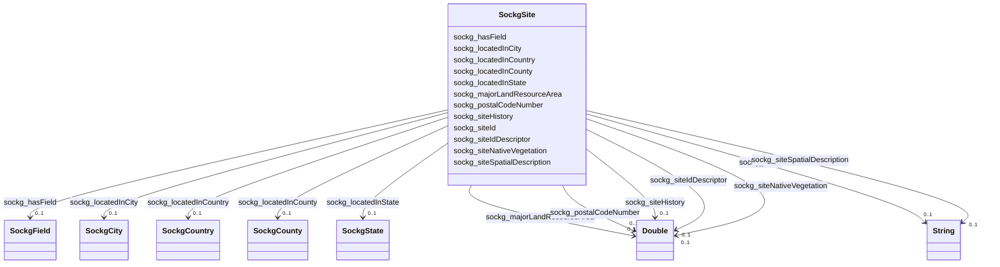

# Class: TODO -- what's a good name for what this class (type) describes? (sockg_Site)


_No type description provided_


URI: [sockg:Site](http://www.semanticweb.org/sockg/ontologies/2024/0/soil-carbon-ontology/Site)





<!-- no inheritance hierarchy -->


## Slots

| Name | Cardinality and Range | Description | Inheritance |
| ---  | --- | --- | --- |
| [sockg_locatedInCounty](../slots/sockg_locatedInCounty.md) | 0..1 <br/> [SockgCounty](../classes/SockgCounty.md) | No slot description provided | direct |
| [sockg_locatedInState](../slots/sockg_locatedInState.md) | 0..1 <br/> [SockgState](../classes/SockgState.md) | No slot description provided | direct |
| [sockg_locatedInCity](../slots/sockg_locatedInCity.md) | 0..1 <br/> [SockgCity](../classes/SockgCity.md) | No slot description provided | direct |
| [sockg_locatedInCountry](../slots/sockg_locatedInCountry.md) | 0..1 <br/> [SockgCountry](../classes/SockgCountry.md) | No slot description provided | direct |
| [sockg_hasField](../slots/sockg_hasField.md) | 0..1 <br/> [SockgField](../classes/SockgField.md) | No slot description provided | direct |
| [sockg_siteIdDescriptor](../slots/sockg_siteIdDescriptor.md) | 0..1 <br/> [xsd:double](http://www.w3.org/2001/XMLSchema#double) | No slot description provided | direct |
| [sockg_majorLandResourceArea](../slots/sockg_majorLandResourceArea.md) | 0..1 <br/> [xsd:double](http://www.w3.org/2001/XMLSchema#double) | No slot description provided | direct |
| [sockg_siteSpatialDescription](../slots/sockg_siteSpatialDescription.md) | 0..1 <br/> [xsd:string](http://www.w3.org/2001/XMLSchema#string) | No slot description provided | direct |
| [sockg_siteNativeVegetation](../slots/sockg_siteNativeVegetation.md) | 0..1 <br/> [xsd:double](http://www.w3.org/2001/XMLSchema#double) | No slot description provided | direct |
| [sockg_siteId](../slots/sockg_siteId.md) | 0..1 <br/> [xsd:string](http://www.w3.org/2001/XMLSchema#string) | No slot description provided | direct |
| [sockg_postalCodeNumber](../slots/sockg_postalCodeNumber.md) | 0..1 <br/> [xsd:double](http://www.w3.org/2001/XMLSchema#double) | No slot description provided | direct |
| [sockg_siteHistory](../slots/sockg_siteHistory.md) | 0..1 <br/> [xsd:double](http://www.w3.org/2001/XMLSchema#double) | No slot description provided | direct |


## Usages

| used by | used in | type | used |
| ---  | --- | --- | --- |
| [SockgExperiment](../classes/SockgExperiment.md) | [sockg_happenedInSite](../slots/sockg_happenedInSite.md) | range | [SockgSite](../classes/SockgSite.md) |
| [SockgPerson](../classes/SockgPerson.md) | [sockg_worksIn](../slots/sockg_worksIn.md) | range | [SockgSite](../classes/SockgSite.md) |
| [SockgPublication](../classes/SockgPublication.md) | [sockg_studiesSite](../slots/sockg_studiesSite.md) | range | [SockgSite](../classes/SockgSite.md) |
| [SockgWeatherObservation](../classes/SockgWeatherObservation.md) | [sockg_weatherRecordedAt](../slots/sockg_weatherRecordedAt.md) | range | [SockgSite](../classes/SockgSite.md) |
| [SockgWeatherStation](../classes/SockgWeatherStation.md) | [sockg_recordsWeatherForSite](../slots/sockg_recordsWeatherForSite.md) | range | [SockgSite](../classes/SockgSite.md) |


## Examples

| Value |
| --- |
| neo4j://graph.individuals#230717 |

## TODOs

* TODO -- Todos for this class go here
* or you can delete the todos
* if you think the class is perfect.

## Identifier and Mapping Information


### Schema Source


* from schema: soc-kg/main


## Mappings

| Mapping Type | Mapped Value |
| ---  | ---  |
| self | sockg:Site |
| native | soc-kg/main/:SockgSite |


## LinkML Source

<!-- TODO: investigate https://stackoverflow.com/questions/37606292/how-to-create-tabbed-code-blocks-in-mkdocs-or-sphinx -->

### Direct

<details>
```yaml
name: sockg_Site
description: No type description provided
title: TODO -- what's a good name for what this class (type) describes?
todos:
- TODO -- Todos for this class go here
- or you can delete the todos
- if you think the class is perfect.
notes:
- There are 60 instances of this class.
examples:
- value: neo4j://graph.individuals#230717
from_schema: soc-kg/main
rank: 1000
slots:
- sockg_locatedInCounty
- sockg_locatedInState
- sockg_locatedInCity
- sockg_locatedInCountry
- sockg_hasField
- sockg_siteIdDescriptor
- sockg_majorLandResourceArea
- sockg_siteSpatialDescription
- sockg_siteNativeVegetation
- sockg_siteId
- sockg_postalCodeNumber
- sockg_siteHistory
class_uri: sockg:Site

```
</details>

### Induced

<details>
```yaml
name: sockg_Site
description: No type description provided
title: TODO -- what's a good name for what this class (type) describes?
todos:
- TODO -- Todos for this class go here
- or you can delete the todos
- if you think the class is perfect.
notes:
- There are 60 instances of this class.
examples:
- value: neo4j://graph.individuals#230717
from_schema: soc-kg/main
rank: 1000
attributes:
  sockg_locatedInCounty:
    name: sockg_locatedInCounty
    description: No slot description provided
    todos:
    - TODO -- Todos for this slot go here
    - or you can delete the todos
    - if you think the class is perfect.
    comments:
    - 61 occurrences with subject type sockg:Site and object type sockg:County.
    examples:
    - value: neo4j://graph.individuals#230729 sockg:locatedInCounty neo4j://graph.individuals#46732
    from_schema: soc-kg/main
    rank: 1000
    slot_uri: sockg:locatedInCounty
    alias: sockg_locatedInCounty
    owner: sockg_Site
    domain_of:
    - sockg_Site
    range: sockg_County
  sockg_locatedInState:
    name: sockg_locatedInState
    description: No slot description provided
    todos:
    - TODO -- Todos for this slot go here
    - or you can delete the todos
    - if you think the class is perfect.
    comments:
    - 60 occurrences with subject type sockg:Site and object type sockg:State.
    examples:
    - value: neo4j://graph.individuals#230736 sockg:locatedInState neo4j://graph.individuals#331912
    from_schema: soc-kg/main
    rank: 1000
    slot_uri: sockg:locatedInState
    alias: sockg_locatedInState
    owner: sockg_Site
    domain_of:
    - sockg_Site
    range: sockg_State
  sockg_locatedInCity:
    name: sockg_locatedInCity
    description: No slot description provided
    todos:
    - TODO -- Todos for this slot go here
    - or you can delete the todos
    - if you think the class is perfect.
    comments:
    - 59 occurrences with subject type sockg:Site and object type sockg:City.
    examples:
    - value: neo4j://graph.individuals#230734 sockg:locatedInCity neo4j://graph.individuals#46687
    from_schema: soc-kg/main
    rank: 1000
    slot_uri: sockg:locatedInCity
    alias: sockg_locatedInCity
    owner: sockg_Site
    domain_of:
    - sockg_Site
    range: sockg_City
  sockg_locatedInCountry:
    name: sockg_locatedInCountry
    description: No slot description provided
    todos:
    - TODO -- Todos for this slot go here
    - or you can delete the todos
    - if you think the class is perfect.
    comments:
    - 60 occurrences with subject type sockg:Site and object type sockg:Country.
    examples:
    - value: neo4j://graph.individuals#230715 sockg:locatedInCountry neo4j://graph.individuals#46720
    from_schema: soc-kg/main
    rank: 1000
    slot_uri: sockg:locatedInCountry
    alias: sockg_locatedInCountry
    owner: sockg_Site
    domain_of:
    - sockg_Site
    range: sockg_Country
  sockg_hasField:
    name: sockg_hasField
    description: No slot description provided
    todos:
    - TODO -- Todos for this slot go here
    - or you can delete the todos
    - if you think the class is perfect.
    comments:
    - 65 occurrences with subject type sockg:Site and object type sockg:Field.
    examples:
    - value: neo4j://graph.individuals#230717 sockg:hasField neo4j://graph.individuals#55585
    from_schema: soc-kg/main
    rank: 1000
    slot_uri: sockg:hasField
    alias: sockg_hasField
    owner: sockg_Site
    domain_of:
    - sockg_Site
    range: sockg_Field
  sockg_siteIdDescriptor:
    name: sockg_siteIdDescriptor
    description: No slot description provided
    todos:
    - TODO -- Todos for this slot go here
    - or you can delete the todos
    - if you think the class is perfect.
    comments:
    - 60 occurrences with subject type sockg:Site and object type xsd:double.
    examples:
    - value: neo4j://graph.individuals#230688 sockg:siteIdDescriptor nan
    from_schema: soc-kg/main
    rank: 1000
    slot_uri: sockg:siteIdDescriptor
    alias: sockg_siteIdDescriptor
    owner: sockg_Site
    domain_of:
    - sockg_Site
    range: double
  sockg_majorLandResourceArea:
    name: sockg_majorLandResourceArea
    description: No slot description provided
    todos:
    - TODO -- Todos for this slot go here
    - or you can delete the todos
    - if you think the class is perfect.
    comments:
    - 60 occurrences with subject type sockg:Site and object type xsd:double.
    examples:
    - value: neo4j://graph.individuals#230695 sockg:majorLandResourceArea nan
    from_schema: soc-kg/main
    rank: 1000
    slot_uri: sockg:majorLandResourceArea
    alias: sockg_majorLandResourceArea
    owner: sockg_Site
    domain_of:
    - sockg_Site
    range: double
  sockg_siteSpatialDescription:
    name: sockg_siteSpatialDescription
    description: No slot description provided
    todos:
    - TODO -- Todos for this slot go here
    - or you can delete the todos
    - if you think the class is perfect.
    comments:
    - 60 occurrences with subject type sockg:Site and object type string.
    examples:
    - value: neo4j://graph.individuals#230713 sockg:siteSpatialDescription Bounding
        Box:,-93.766975,42.018853,-93.762143,42.016311
    from_schema: soc-kg/main
    rank: 1000
    slot_uri: sockg:siteSpatialDescription
    alias: sockg_siteSpatialDescription
    owner: sockg_Site
    domain_of:
    - sockg_Site
    range: string
  sockg_siteNativeVegetation:
    name: sockg_siteNativeVegetation
    description: No slot description provided
    todos:
    - TODO -- Todos for this slot go here
    - or you can delete the todos
    - if you think the class is perfect.
    comments:
    - 60 occurrences with subject type sockg:Site and object type xsd:double.
    examples:
    - value: neo4j://graph.individuals#230715 sockg:siteNativeVegetation nan
    from_schema: soc-kg/main
    rank: 1000
    slot_uri: sockg:siteNativeVegetation
    alias: sockg_siteNativeVegetation
    owner: sockg_Site
    domain_of:
    - sockg_Site
    range: double
  sockg_siteId:
    name: sockg_siteId
    description: No slot description provided
    todos:
    - TODO -- Todos for this slot go here
    - or you can delete the todos
    - if you think the class is perfect.
    comments:
    - 60 occurrences with subject type sockg:Site and object type string.
    examples:
    - value: neo4j://graph.individuals#230712 sockg:siteId ALAUTVS
    from_schema: soc-kg/main
    rank: 1000
    slot_uri: sockg:siteId
    alias: sockg_siteId
    owner: sockg_Site
    domain_of:
    - sockg_Site
    range: string
  sockg_postalCodeNumber:
    name: sockg_postalCodeNumber
    description: No slot description provided
    todos:
    - TODO -- Todos for this slot go here
    - or you can delete the todos
    - if you think the class is perfect.
    comments:
    - 60 occurrences with subject type sockg:Site and object type xsd:double.
    examples:
    - value: neo4j://graph.individuals#230697 sockg:postalCodeNumber 59270.0
    from_schema: soc-kg/main
    rank: 1000
    slot_uri: sockg:postalCodeNumber
    alias: sockg_postalCodeNumber
    owner: sockg_Site
    domain_of:
    - sockg_Site
    range: double
  sockg_siteHistory:
    name: sockg_siteHistory
    description: No slot description provided
    todos:
    - TODO -- Todos for this slot go here
    - or you can delete the todos
    - if you think the class is perfect.
    comments:
    - 60 occurrences with subject type sockg:Site and object type xsd:double.
    examples:
    - value: neo4j://graph.individuals#230723 sockg:siteHistory nan
    from_schema: soc-kg/main
    rank: 1000
    slot_uri: sockg:siteHistory
    alias: sockg_siteHistory
    owner: sockg_Site
    domain_of:
    - sockg_Site
    range: double
class_uri: sockg:Site

```
</details>