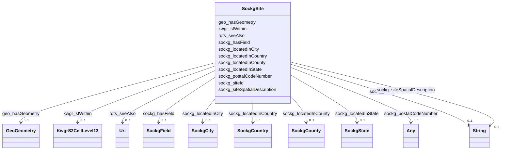

# Class: No class (entity type) name specified (sockg_Site)


_A Site represents a specific geographical location related to agricultural activities, encompassing its ecological features, historical context, and resource management practices. This class provides insights into the characteristics and significance of the land in supporting agricultural productivity and sustainability._


This class occurs 60 times.


URI: [sockg:Site](https://idir.uta.edu/sockg-ontology/docs/Site)





<!-- no inheritance hierarchy -->


## Slots

| Name | Cardinality and Range | Description | Inheritance | Occurrences |
| ---  | --- | --- | --- | --- |
| [sockg_hasField](../slots/sockg_hasField.md) | 0..1 <br/> [SockgField](../classes/SockgField.md) | No slot (predicate) description specified <br/>  | direct | 65 |
| [kwgr_sfWithin](../slots/kwgr_sfWithin.md) | 0..1 <br/> [KwgrS2CellLevel13](../classes/KwgrS2CellLevel13.md) | No slot (predicate) description specified <br/>  | direct | 4351 |
| [sockg_locatedInCity](../slots/sockg_locatedInCity.md) | 0..1 <br/> [SockgCity](../classes/SockgCity.md) | No slot (predicate) description specified <br/>  | direct | 59 |
| [sockg_postalCodeNumber](../slots/sockg_postalCodeNumber.md) | 0..1 <br/> [xsd:double](http://www.w3.org/2001/XMLSchema#double)&nbsp;or&nbsp;<br />[Int32](../types/Int32.md) | No slot (predicate) description specified <br/>  | direct | 60 |
| [geo_hasGeometry](../slots/geo_hasGeometry.md) | 0..1 <br/> [GeoGeometry](../classes/GeoGeometry.md) | No slot (predicate) description specified <br/>  | direct | 47 |
| [sockg_locatedInState](../slots/sockg_locatedInState.md) | 0..1 <br/> [SockgState](../classes/SockgState.md) | No slot (predicate) description specified <br/>  | direct | 60 |
| [sockg_siteSpatialDescription](../slots/sockg_siteSpatialDescription.md) | 0..1 <br/> [xsd:string](http://www.w3.org/2001/XMLSchema#string) | No slot (predicate) description specified <br/>  | direct | 60 |
| [sockg_locatedInCountry](../slots/sockg_locatedInCountry.md) | 0..1 <br/> [SockgCountry](../classes/SockgCountry.md) | No slot (predicate) description specified <br/>  | direct | 60 |
| [sockg_siteId](../slots/sockg_siteId.md) | 0..1 <br/> [xsd:string](http://www.w3.org/2001/XMLSchema#string) | No slot (predicate) description specified <br/>  | direct | 60 |
| [sockg_locatedInCounty](../slots/sockg_locatedInCounty.md) | 0..1 <br/> [SockgCounty](../classes/SockgCounty.md) | No slot (predicate) description specified <br/>  | direct | 61 |
| [rdfs_seeAlso](../slots/rdfs_seeAlso.md) | 0..1 <br/> [xsd:anyURI](http://www.w3.org/2001/XMLSchema#anyURI) | No slot (predicate) description specified <br/>  | direct | 60 |


## Usages

| used by | used in | type | used |
| ---  | --- | --- | --- |
| [KwgrS2CellLevel13](../classes/KwgrS2CellLevel13.md) | [kwgr_sfContains](../slots/kwgr_sfContains.md) | range | [SockgSite](../classes/SockgSite.md) |
| [KwgrS2CellLevel13](../classes/KwgrS2CellLevel13.md) | [kwgr_spatialRelation](../slots/kwgr_spatialRelation.md) | range | [SockgSite](../classes/SockgSite.md) |
| [SockgExperimentalUnit](../classes/SockgExperimentalUnit.md) | [sockg_locatedInSite](../slots/sockg_locatedInSite.md) | range | [SockgSite](../classes/SockgSite.md) |
| [SockgPerson](../classes/SockgPerson.md) | [sockg_worksIn](../slots/sockg_worksIn.md) | range | [SockgSite](../classes/SockgSite.md) |
| [SockgPublication](../classes/SockgPublication.md) | [sockg_studiesSite](../slots/sockg_studiesSite.md) | range | [SockgSite](../classes/SockgSite.md) |
| [SockgSite](../classes/SockgSite.md) | [sockg_hasField](../slots/sockg_hasField.md) | domain | [SockgSite](../classes/SockgSite.md) |
| [SockgSite](../classes/SockgSite.md) | [sockg_locatedInCity](../slots/sockg_locatedInCity.md) | domain | [SockgSite](../classes/SockgSite.md) |
| [SockgSite](../classes/SockgSite.md) | [sockg_postalCodeNumber](../slots/sockg_postalCodeNumber.md) | domain | [SockgSite](../classes/SockgSite.md) |
| [SockgSite](../classes/SockgSite.md) | [sockg_locatedInState](../slots/sockg_locatedInState.md) | domain | [SockgSite](../classes/SockgSite.md) |
| [SockgSite](../classes/SockgSite.md) | [sockg_siteSpatialDescription](../slots/sockg_siteSpatialDescription.md) | domain | [SockgSite](../classes/SockgSite.md) |
| [SockgSite](../classes/SockgSite.md) | [sockg_locatedInCountry](../slots/sockg_locatedInCountry.md) | domain | [SockgSite](../classes/SockgSite.md) |
| [SockgSite](../classes/SockgSite.md) | [sockg_siteId](../slots/sockg_siteId.md) | domain | [SockgSite](../classes/SockgSite.md) |
| [SockgSite](../classes/SockgSite.md) | [sockg_locatedInCounty](../slots/sockg_locatedInCounty.md) | domain | [SockgSite](../classes/SockgSite.md) |
| [SockgWeatherObservation](../classes/SockgWeatherObservation.md) | [sockg_weatherRecordedAt](../slots/sockg_weatherRecordedAt.md) | range | [SockgSite](../classes/SockgSite.md) |
| [SockgWeatherStation](../classes/SockgWeatherStation.md) | [sockg_recordsWeatherForSite](../slots/sockg_recordsWeatherForSite.md) | range | [SockgSite](../classes/SockgSite.md) |


## See Also

* [https://lod.nal.usda.gov/nalt/9795148](https://lod.nal.usda.gov/nalt/9795148)


## LinkML Source

<!-- TODO: investigate https://stackoverflow.com/questions/37606292/how-to-create-tabbed-code-blocks-in-mkdocs-or-sphinx -->

### Direct

<details>

```yaml
name: sockg_Site
conforms_to: No schema conformance document specified
annotations:
  count:
    tag: count
    value: 60
description: A Site represents a specific geographical location related to agricultural
  activities, encompassing its ecological features, historical context, and resource
  management practices. This class provides insights into the characteristics and
  significance of the land in supporting agricultural productivity and sustainability.
title: No class (entity type) name specified
from_schema: soc-kg
see_also:
- https://lod.nal.usda.gov/nalt/9795148
rank: 1000
slots:
- sockg_hasField
- kwgr_sfWithin
- sockg_locatedInCity
- sockg_postalCodeNumber
- geo_hasGeometry
- sockg_locatedInState
- sockg_siteSpatialDescription
- sockg_locatedInCountry
- sockg_siteId
- sockg_locatedInCounty
- rdfs_seeAlso
slot_usage:
  geo_hasGeometry:
    name: geo_hasGeometry
    annotations:
      geo_Geometry:
        tag: geo_Geometry
        value: 47
  kwgr_sfWithin:
    name: kwgr_sfWithin
    annotations:
      kwgr_S2Cell_Level13:
        tag: kwgr_S2Cell_Level13
        value: 4351
  rdfs_seeAlso:
    name: rdfs_seeAlso
    annotations:
      uri:
        tag: uri
        value: 60
  sockg_hasField:
    name: sockg_hasField
    annotations:
      sockg_Field:
        tag: sockg_Field
        value: 65
  sockg_locatedInCity:
    name: sockg_locatedInCity
    annotations:
      sockg_City:
        tag: sockg_City
        value: 59
  sockg_locatedInCountry:
    name: sockg_locatedInCountry
    annotations:
      sockg_Country:
        tag: sockg_Country
        value: 60
  sockg_locatedInCounty:
    name: sockg_locatedInCounty
    annotations:
      sockg_County:
        tag: sockg_County
        value: 61
  sockg_locatedInState:
    name: sockg_locatedInState
    annotations:
      sockg_State:
        tag: sockg_State
        value: 60
  sockg_postalCodeNumber:
    name: sockg_postalCodeNumber
    annotations:
      double:
        tag: double
        value: 60
  sockg_siteId:
    name: sockg_siteId
    annotations:
      string:
        tag: string
        value: 60
  sockg_siteSpatialDescription:
    name: sockg_siteSpatialDescription
    annotations:
      string:
        tag: string
        value: 60
class_uri: sockg:Site

```
</details>

### Induced

<details>

```yaml
name: sockg_Site
conforms_to: No schema conformance document specified
annotations:
  count:
    tag: count
    value: 60
description: A Site represents a specific geographical location related to agricultural
  activities, encompassing its ecological features, historical context, and resource
  management practices. This class provides insights into the characteristics and
  significance of the land in supporting agricultural productivity and sustainability.
title: No class (entity type) name specified
from_schema: soc-kg
see_also:
- https://lod.nal.usda.gov/nalt/9795148
rank: 1000
slot_usage:
  geo_hasGeometry:
    name: geo_hasGeometry
    annotations:
      geo_Geometry:
        tag: geo_Geometry
        value: 47
  kwgr_sfWithin:
    name: kwgr_sfWithin
    annotations:
      kwgr_S2Cell_Level13:
        tag: kwgr_S2Cell_Level13
        value: 4351
  rdfs_seeAlso:
    name: rdfs_seeAlso
    annotations:
      uri:
        tag: uri
        value: 60
  sockg_hasField:
    name: sockg_hasField
    annotations:
      sockg_Field:
        tag: sockg_Field
        value: 65
  sockg_locatedInCity:
    name: sockg_locatedInCity
    annotations:
      sockg_City:
        tag: sockg_City
        value: 59
  sockg_locatedInCountry:
    name: sockg_locatedInCountry
    annotations:
      sockg_Country:
        tag: sockg_Country
        value: 60
  sockg_locatedInCounty:
    name: sockg_locatedInCounty
    annotations:
      sockg_County:
        tag: sockg_County
        value: 61
  sockg_locatedInState:
    name: sockg_locatedInState
    annotations:
      sockg_State:
        tag: sockg_State
        value: 60
  sockg_postalCodeNumber:
    name: sockg_postalCodeNumber
    annotations:
      double:
        tag: double
        value: 60
  sockg_siteId:
    name: sockg_siteId
    annotations:
      string:
        tag: string
        value: 60
  sockg_siteSpatialDescription:
    name: sockg_siteSpatialDescription
    annotations:
      string:
        tag: string
        value: 60
attributes:
  sockg_hasField:
    name: sockg_hasField
    annotations:
      sockg_Field:
        tag: sockg_Field
        value: 65
    description: No slot (predicate) description specified
    title: No slot (predicate) name specified
    examples:
    - object:
        example_object: sockg:individuals/55800
        example_object_type: sockg_Field
        example_predicate: sockg:hasField
        example_subject: sockg:individuals/231056
        example_subject_type: sockg_Site
    from_schema: soc-kg
    rank: 1000
    domain: sockg_Site
    slot_uri: sockg:hasField
    alias: sockg_hasField
    owner: sockg_Site
    domain_of:
    - sockg_Site
    range: sockg_Field
  kwgr_sfWithin:
    name: kwgr_sfWithin
    annotations:
      kwgr_S2Cell_Level13:
        tag: kwgr_S2Cell_Level13
        value: 4351
    description: No slot (predicate) description specified
    examples:
    - object:
        example_object: kwgr:s2.level13.9839298676705460224
        example_object_type: kwgr_S2Cell_Level13
        example_predicate: kwgr:sfWithin
        example_subject: sockg:individuals/231056
        example_subject_type: sockg_Site
    from_schema: soc-kg
    rank: 1000
    slot_uri: kwgr:sfWithin
    alias: kwgr_sfWithin
    owner: sockg_Site
    domain_of:
    - sockg_Site
    range: kwgr_S2Cell_Level13
  sockg_locatedInCity:
    name: sockg_locatedInCity
    annotations:
      sockg_City:
        tag: sockg_City
        value: 59
    description: No slot (predicate) description specified
    title: No slot (predicate) name specified
    examples:
    - object:
        example_object: sockg:individuals/46864
        example_object_type: sockg_City
        example_predicate: sockg:locatedInCity
        example_subject: sockg:individuals/231056
        example_subject_type: sockg_Site
    from_schema: soc-kg
    rank: 1000
    domain: sockg_Site
    slot_uri: sockg:locatedInCity
    alias: sockg_locatedInCity
    owner: sockg_Site
    domain_of:
    - sockg_Site
    range: sockg_City
  sockg_postalCodeNumber:
    name: sockg_postalCodeNumber
    annotations:
      double:
        tag: double
        value: 60
    description: No slot (predicate) description specified
    title: No slot (predicate) name specified
    examples:
    - object:
        example_object: '36075.0'
        example_object_type: double
        example_predicate: sockg:postalCodeNumber
        example_subject: sockg:individuals/231056
        example_subject_type: sockg_Site
    from_schema: soc-kg
    see_also:
    - https://lod.nal.usda.gov/nalt/9775998
    rank: 1000
    domain: sockg_Site
    slot_uri: sockg:postalCodeNumber
    alias: sockg_postalCodeNumber
    owner: sockg_Site
    domain_of:
    - sockg_Site
    range: Any
    any_of:
    - range: double
    - range: int32
  geo_hasGeometry:
    name: geo_hasGeometry
    annotations:
      geo_Geometry:
        tag: geo_Geometry
        value: 47
    description: No slot (predicate) description specified
    examples:
    - object:
        example_object: sockg:individuals/geometry_ALAuburn
        example_object_type: geo_Geometry
        example_predicate: geo:hasGeometry
        example_subject: sockg:individuals/231056
        example_subject_type: sockg_Site
    from_schema: soc-kg
    rank: 1000
    slot_uri: geo:hasGeometry
    alias: geo_hasGeometry
    owner: sockg_Site
    domain_of:
    - sockg_Site
    range: geo_Geometry
  sockg_locatedInState:
    name: sockg_locatedInState
    annotations:
      sockg_State:
        tag: sockg_State
        value: 60
    description: No slot (predicate) description specified
    title: No slot (predicate) name specified
    examples:
    - object:
        example_object: sockg:individuals/336400
        example_object_type: sockg_State
        example_predicate: sockg:locatedInState
        example_subject: sockg:individuals/231056
        example_subject_type: sockg_Site
    from_schema: soc-kg
    rank: 1000
    domain: sockg_Site
    slot_uri: sockg:locatedInState
    alias: sockg_locatedInState
    owner: sockg_Site
    domain_of:
    - sockg_Site
    range: sockg_State
  sockg_siteSpatialDescription:
    name: sockg_siteSpatialDescription
    annotations:
      string:
        tag: string
        value: 60
    description: No slot (predicate) description specified
    title: No slot (predicate) name specified
    examples:
    - object:
        example_object: Bounding Box:,-85.897912,32.423849,-85.895231,32.421965
        example_object_type: string
        example_predicate: sockg:siteSpatialDescription
        example_subject: sockg:individuals/231056
        example_subject_type: sockg_Site
    from_schema: soc-kg
    rank: 1000
    domain: sockg_Site
    slot_uri: sockg:siteSpatialDescription
    alias: sockg_siteSpatialDescription
    owner: sockg_Site
    domain_of:
    - sockg_Site
    range: string
  sockg_locatedInCountry:
    name: sockg_locatedInCountry
    annotations:
      sockg_Country:
        tag: sockg_Country
        value: 60
    description: No slot (predicate) description specified
    title: No slot (predicate) name specified
    examples:
    - object:
        example_object: sockg:individuals/46901
        example_object_type: sockg_Country
        example_predicate: sockg:locatedInCountry
        example_subject: sockg:individuals/231056
        example_subject_type: sockg_Site
    from_schema: soc-kg
    rank: 1000
    domain: sockg_Site
    slot_uri: sockg:locatedInCountry
    alias: sockg_locatedInCountry
    owner: sockg_Site
    domain_of:
    - sockg_Site
    range: sockg_Country
  sockg_siteId:
    name: sockg_siteId
    annotations:
      string:
        tag: string
        value: 60
    description: No slot (predicate) description specified
    title: No slot (predicate) name specified
    examples:
    - object:
        example_object: ALAuburn
        example_object_type: string
        example_predicate: sockg:siteId
        example_subject: sockg:individuals/231056
        example_subject_type: sockg_Site
    from_schema: soc-kg
    rank: 1000
    domain: sockg_Site
    slot_uri: sockg:siteId
    alias: sockg_siteId
    owner: sockg_Site
    domain_of:
    - sockg_Site
    range: string
  sockg_locatedInCounty:
    name: sockg_locatedInCounty
    annotations:
      sockg_County:
        tag: sockg_County
        value: 61
    description: No slot (predicate) description specified
    title: No slot (predicate) name specified
    examples:
    - object:
        example_object: sockg:individuals/46904
        example_object_type: sockg_County
        example_predicate: sockg:locatedInCounty
        example_subject: sockg:individuals/231056
        example_subject_type: sockg_Site
    from_schema: soc-kg
    rank: 1000
    domain: sockg_Site
    slot_uri: sockg:locatedInCounty
    alias: sockg_locatedInCounty
    owner: sockg_Site
    domain_of:
    - sockg_Site
    range: sockg_County
  rdfs_seeAlso:
    name: rdfs_seeAlso
    annotations:
      uri:
        tag: uri
        value: 60
    description: No slot (predicate) description specified
    examples:
    - object:
        example_object: https://lod.nal.usda.gov/nalt/4605
        example_object_type: uri
        example_predicate: rdfs:seeAlso
        example_subject: sockg:individuals/0
        example_subject_type: sockg_Amendment
    - object:
        example_object: https://lod.nal.usda.gov/nalt/5859
        example_object_type: uri
        example_predicate: rdfs:seeAlso
        example_subject: sockg:individuals/100000
        example_subject_type: sockg_GasSample
    - object:
        example_object: https://lod.nal.usda.gov/nalt/281219
        example_object_type: uri
        example_predicate: rdfs:seeAlso
        example_subject: sockg:individuals/163960
        example_subject_type: sockg_Grazing
    - object:
        example_object: https://lod.nal.usda.gov/nalt/4377260
        example_object_type: uri
        example_predicate: rdfs:seeAlso
        example_subject: sockg:individuals/170955
        example_subject_type: sockg_GrazingManagementEvent
    - object:
        example_object: https://lod.nal.usda.gov/nalt/131626
        example_object_type: uri
        example_predicate: rdfs:seeAlso
        example_subject: sockg:individuals/172906
        example_subject_type: sockg_Harvest
    - object:
        example_object: https://lod.nal.usda.gov/nalt/281219
        example_object_type: uri
        example_predicate: rdfs:seeAlso
        example_subject: sockg:individuals/191262
        example_subject_type: sockg_HarvestFraction
    - object:
        example_object: https://lod.nal.usda.gov/nalt/13189
        example_object_type: uri
        example_predicate: rdfs:seeAlso
        example_subject: sockg:individuals/203523
        example_subject_type: sockg_Organization
    - object:
        example_object: https://lod.nal.usda.gov/nalt/3927
        example_object_type: uri
        example_predicate: rdfs:seeAlso
        example_subject: sockg:individuals/203632
        example_subject_type: sockg_Pesticide
    - object:
        example_object: https://lod.nal.usda.gov/nalt/849
        example_object_type: uri
        example_predicate: rdfs:seeAlso
        example_subject: sockg:individuals/227674
        example_subject_type: sockg_ResidueManagementEvent
    - object:
        example_object: https://lod.nal.usda.gov/nalt/30158
        example_object_type: uri
        example_predicate: rdfs:seeAlso
        example_subject: sockg:individuals/230982
        example_subject_type: sockg_Rotation
    - object:
        example_object: https://lod.nal.usda.gov/nalt/302328
        example_object_type: uri
        example_predicate: rdfs:seeAlso
        example_subject: sockg:individuals/231056
        example_subject_type: sockg_Site
    - object:
        example_object: https://lod.nal.usda.gov/nalt/2726
        example_object_type: uri
        example_predicate: rdfs:seeAlso
        example_subject: sockg:individuals/235229
        example_subject_type: sockg_SoilBiologicalSample
    - object:
        example_object: https://lod.nal.usda.gov/nalt/7974
        example_object_type: uri
        example_predicate: rdfs:seeAlso
        example_subject: sockg:individuals/253451
        example_subject_type: sockg_SoilChemicalSample
    - object:
        example_object: https://lod.nal.usda.gov/nalt/302328
        example_object_type: uri
        example_predicate: rdfs:seeAlso
        example_subject: sockg:individuals/307284
        example_subject_type: sockg_SoilCover
    - object:
        example_object: https://lod.nal.usda.gov/nalt/5143
        example_object_type: uri
        example_predicate: rdfs:seeAlso
        example_subject: sockg:individuals/308318
        example_subject_type: sockg_SoilPhysicalSample
    - object:
        example_object: https://lod.nal.usda.gov/nalt/5430914
        example_object_type: uri
        example_predicate: rdfs:seeAlso
        example_subject: sockg:individuals/336400
        example_subject_type: sockg_State
    - object:
        example_object: https://lod.nal.usda.gov/nalt/7140
        example_object_type: uri
        example_predicate: rdfs:seeAlso
        example_subject: sockg:individuals/336419
        example_subject_type: sockg_Tillage
    - object:
        example_object: https://lod.nal.usda.gov/nalt/28616
        example_object_type: uri
        example_predicate: rdfs:seeAlso
        example_subject: sockg:individuals/363556
        example_subject_type: sockg_Treatment
    - object:
        example_object: https://lod.nal.usda.gov/nalt/2717
        example_object_type: uri
        example_predicate: rdfs:seeAlso
        example_subject: sockg:individuals/37796
        example_subject_type: sockg_BioMassCarbohydrate
    - object:
        example_object: https://lod.nal.usda.gov/nalt/7140
        example_object_type: uri
        example_predicate: rdfs:seeAlso
        example_subject: sockg:individuals/39163
        example_subject_type: sockg_BioMassEnergy
    - object:
        example_object: https://lod.nal.usda.gov/nalt/281219
        example_object_type: uri
        example_predicate: rdfs:seeAlso
        example_subject: sockg:individuals/39962
        example_subject_type: sockg_BioMassMineral
    - object:
        example_object: https://lod.nal.usda.gov/nalt/2714
        example_object_type: uri
        example_predicate: rdfs:seeAlso
        example_subject: sockg:individuals/439235
        example_subject_type: sockg_WeatherObservation
    - object:
        example_object: https://lod.nal.usda.gov/nalt/7485997
        example_object_type: uri
        example_predicate: rdfs:seeAlso
        example_subject: sockg:individuals/46864
        example_subject_type: sockg_City
    - object:
        example_object: https://lod.nal.usda.gov/nalt/2217129
        example_object_type: uri
        example_predicate: rdfs:seeAlso
        example_subject: sockg:individuals/46904
        example_subject_type: sockg_County
    - object:
        example_object: https://lod.nal.usda.gov/nalt/302328
        example_object_type: uri
        example_predicate: rdfs:seeAlso
        example_subject: sockg:individuals/46937
        example_subject_type: sockg_CropGrowthStage
    - object:
        example_object: https://lod.nal.usda.gov/nalt/976
        example_object_type: uri
        example_predicate: rdfs:seeAlso
        example_subject: sockg:individuals/51906
        example_subject_type: sockg_Experiment
    - object:
        example_object: https://lod.nal.usda.gov/nalt/9183
        example_object_type: uri
        example_predicate: rdfs:seeAlso
        example_subject: sockg:individuals/51937
        example_subject_type: sockg_ExperimentalUnit
    - object:
        example_object: https://lod.nal.usda.gov/nalt/7259
        example_object_type: uri
        example_predicate: rdfs:seeAlso
        example_subject: sockg:individuals/55800
        example_subject_type: sockg_Field
    - object:
        example_object: https://lod.nal.usda.gov/nalt/7140
        example_object_type: uri
        example_predicate: rdfs:seeAlso
        example_subject: sockg:individuals/200732
        example_subject_type: sockg_NutrientEfficiency
    - object:
        example_object: https://lod.nal.usda.gov/nalt/35067
        example_object_type: uri
        example_predicate: rdfs:seeAlso
        example_subject: sockg:individuals/203534
        example_subject_type: sockg_Person
    - object:
        example_object: https://lod.nal.usda.gov/nalt/5630
        example_object_type: uri
        example_predicate: rdfs:seeAlso
        example_subject: sockg:individuals/203988
        example_subject_type: sockg_PlantingEvent
    - object:
        example_object: https://lod.nal.usda.gov/nalt/61097
        example_object_type: uri
        example_predicate: rdfs:seeAlso
        example_subject: sockg:individuals/227438
        example_subject_type: sockg_Project
    - object:
        example_object: https://lod.nal.usda.gov/nalt/305490
        example_object_type: uri
        example_predicate: rdfs:seeAlso
        example_subject: sockg:individuals/227447
        example_subject_type: sockg_Publication
    - object:
        example_object: https://lod.nal.usda.gov/nalt/48678
        example_object_type: uri
        example_predicate: rdfs:seeAlso
        example_subject: sockg:individuals/227609
        example_subject_type: sockg_ResearchUnit
    - object:
        example_object: https://lod.nal.usda.gov/nalt/33020
        example_object_type: uri
        example_predicate: rdfs:seeAlso
        example_subject: sockg:individuals/231116
        example_subject_type: sockg_Soil
    - object:
        example_object: https://lod.nal.usda.gov/nalt/7140
        example_object_type: uri
        example_predicate: rdfs:seeAlso
        example_subject: sockg:individuals/364326
        example_subject_type: sockg_WaterQualityArea
    - object:
        example_object: https://lod.nal.usda.gov/nalt/281219
        example_object_type: uri
        example_predicate: rdfs:seeAlso
        example_subject: sockg:individuals/364993
        example_subject_type: sockg_WaterQualityConc
    - object:
        example_object: https://lod.nal.usda.gov/nalt/7259
        example_object_type: uri
        example_predicate: rdfs:seeAlso
        example_subject: sockg:individuals/513777
        example_subject_type: sockg_WeatherStation
    - object:
        example_object: https://lod.nal.usda.gov/nalt/281219
        example_object_type: uri
        example_predicate: rdfs:seeAlso
        example_subject: sockg:individuals/55858
        example_subject_type: sockg_GasNutrientLoss
    - object:
        example_object: https://lod.nal.usda.gov/nalt/281219
        example_object_type: uri
        example_predicate: rdfs:seeAlso
        example_subject: sockg:individuals/624572
        example_subject_type: sockg_WindErosionArea
    - object:
        example_object: https://lod.nal.usda.gov/nalt/7140
        example_object_type: uri
        example_predicate: rdfs:seeAlso
        example_subject: sockg:individuals/624587
        example_subject_type: sockg_YieldNutrientUptake
    from_schema: soc-kg
    rank: 1000
    slot_uri: rdfs:seeAlso
    alias: rdfs_seeAlso
    owner: sockg_Site
    domain_of:
    - sockg_Amendment
    - sockg_BioMassCarbohydrate
    - sockg_BioMassEnergy
    - sockg_BioMassMineral
    - sockg_City
    - sockg_County
    - sockg_CropGrowthStage
    - sockg_Experiment
    - sockg_ExperimentalUnit
    - sockg_Field
    - sockg_GasNutrientLoss
    - sockg_GasSample
    - sockg_Grazing
    - sockg_GrazingManagementEvent
    - sockg_Harvest
    - sockg_HarvestFraction
    - sockg_NutrientEfficiency
    - sockg_Organization
    - sockg_Person
    - sockg_Pesticide
    - sockg_PlantingEvent
    - sockg_Project
    - sockg_Publication
    - sockg_ResearchUnit
    - sockg_ResidueManagementEvent
    - sockg_Rotation
    - sockg_Site
    - sockg_Soil
    - sockg_SoilBiologicalSample
    - sockg_SoilChemicalSample
    - sockg_SoilCover
    - sockg_SoilPhysicalSample
    - sockg_State
    - sockg_Tillage
    - sockg_Treatment
    - sockg_WaterQualityArea
    - sockg_WaterQualityConc
    - sockg_WeatherObservation
    - sockg_WeatherStation
    - sockg_WindErosionArea
    - sockg_YieldNutrientUptake
    range: uri
class_uri: sockg:Site

```
</details>