# Class: No class (entity type) name specified (sockg_SoilBiologicalSample)


_SoilBiologicalSample represents a collection of measurements related to microbial biomass and enzyme activity in soil, crucial for assessing soil health and fertility in agricultural practices. These samples provide insights into nutrient cycling and organic matter dynamics, helping farmers and researchers optimize soil management for improved crop productivity._


This class occurs 18222 times.


URI: [sockg:SoilBiologicalSample](https://idir.uta.edu/sockg-ontology/docs/SoilBiologicalSample)

```mermaid
 classDiagram
    class SockgSoilBiologicalSample
    click SockgSoilBiologicalSample href "../SockgSoilBiologicalSample"
      SockgSoilBiologicalSample : rdfs_seeAlso
        
          
    
    
    SockgSoilBiologicalSample --> "0..1" Uri : rdfs_seeAlso
    click Uri href "../Uri"

        
      SockgSoilBiologicalSample : sockg_acidPhosphatase_mg_per_kg_per_hr
        
          
    
    
    SockgSoilBiologicalSample --> "0..1" Any : sockg_acidPhosphatase_mg_per_kg_per_hr
    click Any href "../Any"

        
      SockgSoilBiologicalSample : sockg_alkPhosphatase_mg_per_kg_per_hr
        
          
    
    
    SockgSoilBiologicalSample --> "0..1" Any : sockg_alkPhosphatase_mg_per_kg_per_hr
    click Any href "../Any"

        
      SockgSoilBiologicalSample : sockg_carbonMicrobialBiomass_mgC_per_kg
        
          
    
    
    SockgSoilBiologicalSample --> "0..1" Double : sockg_carbonMicrobialBiomass_mgC_per_kg
    click Double href "../Double"

        
      SockgSoilBiologicalSample : sockg_date
        
          
    
    
    SockgSoilBiologicalSample --> "0..1" Any : sockg_date
    click Any href "../Any"

        
      SockgSoilBiologicalSample : sockg_glucosaminidase_mg_per_kg_per_hr
        
          
    
    
    SockgSoilBiologicalSample --> "0..1" Any : sockg_glucosaminidase_mg_per_kg_per_hr
    click Any href "../Any"

        
      SockgSoilBiologicalSample : sockg_glucosidase_mg_per_kg_per_hr
        
          
    
    
    SockgSoilBiologicalSample --> "0..1" Any : sockg_glucosidase_mg_per_kg_per_hr
    click Any href "../Any"

        
      SockgSoilBiologicalSample : sockg_lowerDepth_cm
        
          
    
    
    SockgSoilBiologicalSample --> "0..1" Any : sockg_lowerDepth_cm
    click Any href "../Any"

        
      SockgSoilBiologicalSample : sockg_measSoilBiol_UID
        
          
    
    
    SockgSoilBiologicalSample --> "0..1" String : sockg_measSoilBiol_UID
    click String href "../String"

        
      SockgSoilBiologicalSample : sockg_nitrogenMicrobialBiomass_mgN_per_kg
        
          
    
    
    SockgSoilBiologicalSample --> "0..1" Any : sockg_nitrogenMicrobialBiomass_mgN_per_kg
    click Any href "../Any"

        
      SockgSoilBiologicalSample : sockg_particulateOrganicMatter_gC_per_kg
        
          
    
    
    SockgSoilBiologicalSample --> "0..1" Any : sockg_particulateOrganicMatter_gC_per_kg
    click Any href "../Any"

        
      SockgSoilBiologicalSample : sockg_soilfluoresceinDiacetateHydrol_mg_per_kg_per_hr
        
          
    
    
    SockgSoilBiologicalSample --> "0..1" Double : sockg_soilfluoresceinDiacetateHydrol_mg_per_kg_per_hr
    click Double href "../Double"

        
      SockgSoilBiologicalSample : sockg_treatmentId
        
          
    
    
    SockgSoilBiologicalSample --> "0..1" Any : sockg_treatmentId
    click Any href "../Any"

        
      SockgSoilBiologicalSample : sockg_upperDepth_cm
        
          
    
    
    SockgSoilBiologicalSample --> "0..1" Any : sockg_upperDepth_cm
    click Any href "../Any"

        
      
```





<!-- no inheritance hierarchy -->


## Slots

| Name | Cardinality and Range | Description | Inheritance | Occurrences |
| ---  | --- | --- | --- | --- |
| [rdfs_seeAlso](../slots/rdfs_seeAlso.md) | 0..1 <br/> [xsd:anyURI](http://www.w3.org/2001/XMLSchema#anyURI) | No slot (predicate) description specified <br/>  | direct | 18222 |
| [sockg_nitrogenMicrobialBiomass_mgN_per_kg](../slots/sockg_nitrogenMicrobialBiomass_mgN_per_kg.md) | 0..1 <br/> [xsd:double](http://www.w3.org/2001/XMLSchema#double)&nbsp;or&nbsp;<br />[xsd:float](http://www.w3.org/2001/XMLSchema#float) | No slot (predicate) description specified <br/>  | direct | 2080 |
| [sockg_soilfluoresceinDiacetateHydrol_mg_per_kg_per_hr](../slots/sockg_soilfluoresceinDiacetateHydrol_mg_per_kg_per_hr.md) | 0..1 <br/> [xsd:double](http://www.w3.org/2001/XMLSchema#double) | No slot (predicate) description specified <br/>  | direct | 40 |
| [sockg_lowerDepth_cm](../slots/sockg_lowerDepth_cm.md) | 0..1 <br/> [xsd:integer](http://www.w3.org/2001/XMLSchema#integer)&nbsp;or&nbsp;<br />[xsd:double](http://www.w3.org/2001/XMLSchema#double) | No slot (predicate) description specified <br/>  | direct | 18222 |
| [sockg_glucosidase_mg_per_kg_per_hr](../slots/sockg_glucosidase_mg_per_kg_per_hr.md) | 0..1 <br/> [xsd:double](http://www.w3.org/2001/XMLSchema#double)&nbsp;or&nbsp;<br />[xsd:float](http://www.w3.org/2001/XMLSchema#float) | No slot (predicate) description specified <br/>  | direct | 1516 |
| [sockg_alkPhosphatase_mg_per_kg_per_hr](../slots/sockg_alkPhosphatase_mg_per_kg_per_hr.md) | 0..1 <br/> [xsd:double](http://www.w3.org/2001/XMLSchema#double)&nbsp;or&nbsp;<br />[xsd:float](http://www.w3.org/2001/XMLSchema#float) | No slot (predicate) description specified <br/>  | direct | 465 |
| [sockg_carbonMicrobialBiomass_mgC_per_kg](../slots/sockg_carbonMicrobialBiomass_mgC_per_kg.md) | 0..1 <br/> [xsd:double](http://www.w3.org/2001/XMLSchema#double) | No slot (predicate) description specified <br/>  | direct | 18222 |
| [sockg_upperDepth_cm](../slots/sockg_upperDepth_cm.md) | 0..1 <br/> [xsd:integer](http://www.w3.org/2001/XMLSchema#integer)&nbsp;or&nbsp;<br />[xsd:double](http://www.w3.org/2001/XMLSchema#double) | No slot (predicate) description specified <br/>  | direct | 18222 |
| [sockg_treatmentId](../slots/sockg_treatmentId.md) | 0..1 <br/> [xsd:date](http://www.w3.org/2001/XMLSchema#date)&nbsp;or&nbsp;<br />[xsd:string](http://www.w3.org/2001/XMLSchema#string)&nbsp;or&nbsp;<br />[xsd:float](http://www.w3.org/2001/XMLSchema#float) | No slot (predicate) description specified <br/>  | direct | 18222 |
| [sockg_measSoilBiol_UID](../slots/sockg_measSoilBiol_UID.md) | 0..1 <br/> [xsd:string](http://www.w3.org/2001/XMLSchema#string) | No slot (predicate) description specified <br/>  | direct | 18222 |
| [sockg_particulateOrganicMatter_gC_per_kg](../slots/sockg_particulateOrganicMatter_gC_per_kg.md) | 0..1 <br/> [xsd:double](http://www.w3.org/2001/XMLSchema#double)&nbsp;or&nbsp;<br />[xsd:float](http://www.w3.org/2001/XMLSchema#float) | No slot (predicate) description specified <br/>  | direct | 18222 |
| [sockg_glucosaminidase_mg_per_kg_per_hr](../slots/sockg_glucosaminidase_mg_per_kg_per_hr.md) | 0..1 <br/> [xsd:double](http://www.w3.org/2001/XMLSchema#double)&nbsp;or&nbsp;<br />[xsd:float](http://www.w3.org/2001/XMLSchema#float) | No slot (predicate) description specified <br/>  | direct | 601 |
| [sockg_date](../slots/sockg_date.md) | 0..1 <br/> [xsd:date](http://www.w3.org/2001/XMLSchema#date)&nbsp;or&nbsp;<br />[xsd:string](http://www.w3.org/2001/XMLSchema#string) | No slot (predicate) description specified <br/>  | direct | 18222 |
| [sockg_acidPhosphatase_mg_per_kg_per_hr](../slots/sockg_acidPhosphatase_mg_per_kg_per_hr.md) | 0..1 <br/> [xsd:double](http://www.w3.org/2001/XMLSchema#double)&nbsp;or&nbsp;<br />[xsd:float](http://www.w3.org/2001/XMLSchema#float) | No slot (predicate) description specified <br/>  | direct | 213 |


## Usages

| used by | used in | type | used |
| ---  | --- | --- | --- |
| [SockgExperimentalUnit](../classes/SockgExperimentalUnit.md) | [sockg_hasBioSample](../slots/sockg_hasBioSample.md) | range | [SockgSoilBiologicalSample](../classes/SockgSoilBiologicalSample.md) |
| [SockgSoilBiologicalSample](../classes/SockgSoilBiologicalSample.md) | [sockg_nitrogenMicrobialBiomass_mgN_per_kg](../slots/sockg_nitrogenMicrobialBiomass_mgN_per_kg.md) | domain | [SockgSoilBiologicalSample](../classes/SockgSoilBiologicalSample.md) |
| [SockgSoilBiologicalSample](../classes/SockgSoilBiologicalSample.md) | [sockg_glucosidase_mg_per_kg_per_hr](../slots/sockg_glucosidase_mg_per_kg_per_hr.md) | domain | [SockgSoilBiologicalSample](../classes/SockgSoilBiologicalSample.md) |
| [SockgSoilBiologicalSample](../classes/SockgSoilBiologicalSample.md) | [sockg_alkPhosphatase_mg_per_kg_per_hr](../slots/sockg_alkPhosphatase_mg_per_kg_per_hr.md) | domain | [SockgSoilBiologicalSample](../classes/SockgSoilBiologicalSample.md) |
| [SockgSoilBiologicalSample](../classes/SockgSoilBiologicalSample.md) | [sockg_measSoilBiol_UID](../slots/sockg_measSoilBiol_UID.md) | domain | [SockgSoilBiologicalSample](../classes/SockgSoilBiologicalSample.md) |
| [SockgSoilBiologicalSample](../classes/SockgSoilBiologicalSample.md) | [sockg_particulateOrganicMatter_gC_per_kg](../slots/sockg_particulateOrganicMatter_gC_per_kg.md) | domain | [SockgSoilBiologicalSample](../classes/SockgSoilBiologicalSample.md) |
| [SockgSoilBiologicalSample](../classes/SockgSoilBiologicalSample.md) | [sockg_glucosaminidase_mg_per_kg_per_hr](../slots/sockg_glucosaminidase_mg_per_kg_per_hr.md) | domain | [SockgSoilBiologicalSample](../classes/SockgSoilBiologicalSample.md) |
| [SockgSoilBiologicalSample](../classes/SockgSoilBiologicalSample.md) | [sockg_acidPhosphatase_mg_per_kg_per_hr](../slots/sockg_acidPhosphatase_mg_per_kg_per_hr.md) | domain | [SockgSoilBiologicalSample](../classes/SockgSoilBiologicalSample.md) |


## See Also

* [https://lod.nal.usda.gov/nalt/63353](https://lod.nal.usda.gov/nalt/63353)


## LinkML Source

<!-- TODO: investigate https://stackoverflow.com/questions/37606292/how-to-create-tabbed-code-blocks-in-mkdocs-or-sphinx -->

### Direct

<details>

```yaml
name: sockg_SoilBiologicalSample
conforms_to: No schema conformance document specified
annotations:
  count:
    tag: count
    value: 18222
description: SoilBiologicalSample represents a collection of measurements related
  to microbial biomass and enzyme activity in soil, crucial for assessing soil health
  and fertility in agricultural practices. These samples provide insights into nutrient
  cycling and organic matter dynamics, helping farmers and researchers optimize soil
  management for improved crop productivity.
title: No class (entity type) name specified
from_schema: soc-kg
see_also:
- https://lod.nal.usda.gov/nalt/63353
rank: 1000
slots:
- rdfs_seeAlso
- sockg_nitrogenMicrobialBiomass_mgN_per_kg
- sockg_soilfluoresceinDiacetateHydrol_mg_per_kg_per_hr
- sockg_lowerDepth_cm
- sockg_glucosidase_mg_per_kg_per_hr
- sockg_alkPhosphatase_mg_per_kg_per_hr
- sockg_carbonMicrobialBiomass_mgC_per_kg
- sockg_upperDepth_cm
- sockg_treatmentId
- sockg_measSoilBiol_UID
- sockg_particulateOrganicMatter_gC_per_kg
- sockg_glucosaminidase_mg_per_kg_per_hr
- sockg_date
- sockg_acidPhosphatase_mg_per_kg_per_hr
slot_usage:
  rdfs_seeAlso:
    name: rdfs_seeAlso
    annotations:
      uri:
        tag: uri
        value: 18222
  sockg_acidPhosphatase_mg_per_kg_per_hr:
    name: sockg_acidPhosphatase_mg_per_kg_per_hr
    annotations:
      double:
        tag: double
        value: 213
  sockg_alkPhosphatase_mg_per_kg_per_hr:
    name: sockg_alkPhosphatase_mg_per_kg_per_hr
    annotations:
      double:
        tag: double
        value: 465
  sockg_carbonMicrobialBiomass_mgC_per_kg:
    name: sockg_carbonMicrobialBiomass_mgC_per_kg
    annotations:
      double:
        tag: double
        value: 18222
  sockg_date:
    name: sockg_date
    annotations:
      string:
        tag: string
        value: 18222
  sockg_glucosaminidase_mg_per_kg_per_hr:
    name: sockg_glucosaminidase_mg_per_kg_per_hr
    annotations:
      double:
        tag: double
        value: 601
  sockg_glucosidase_mg_per_kg_per_hr:
    name: sockg_glucosidase_mg_per_kg_per_hr
    annotations:
      double:
        tag: double
        value: 1516
  sockg_lowerDepth_cm:
    name: sockg_lowerDepth_cm
    annotations:
      integer:
        tag: integer
        value: 18222
  sockg_measSoilBiol_UID:
    name: sockg_measSoilBiol_UID
    annotations:
      string:
        tag: string
        value: 18222
  sockg_nitrogenMicrobialBiomass_mgN_per_kg:
    name: sockg_nitrogenMicrobialBiomass_mgN_per_kg
    annotations:
      double:
        tag: double
        value: 2080
  sockg_particulateOrganicMatter_gC_per_kg:
    name: sockg_particulateOrganicMatter_gC_per_kg
    annotations:
      double:
        tag: double
        value: 18222
  sockg_soilfluoresceinDiacetateHydrol_mg_per_kg_per_hr:
    name: sockg_soilfluoresceinDiacetateHydrol_mg_per_kg_per_hr
    annotations:
      double:
        tag: double
        value: 40
  sockg_treatmentId:
    name: sockg_treatmentId
    annotations:
      string:
        tag: string
        value: 18222
  sockg_upperDepth_cm:
    name: sockg_upperDepth_cm
    annotations:
      integer:
        tag: integer
        value: 18222
class_uri: sockg:SoilBiologicalSample

```
</details>

### Induced

<details>

```yaml
name: sockg_SoilBiologicalSample
conforms_to: No schema conformance document specified
annotations:
  count:
    tag: count
    value: 18222
description: SoilBiologicalSample represents a collection of measurements related
  to microbial biomass and enzyme activity in soil, crucial for assessing soil health
  and fertility in agricultural practices. These samples provide insights into nutrient
  cycling and organic matter dynamics, helping farmers and researchers optimize soil
  management for improved crop productivity.
title: No class (entity type) name specified
from_schema: soc-kg
see_also:
- https://lod.nal.usda.gov/nalt/63353
rank: 1000
slot_usage:
  rdfs_seeAlso:
    name: rdfs_seeAlso
    annotations:
      uri:
        tag: uri
        value: 18222
  sockg_acidPhosphatase_mg_per_kg_per_hr:
    name: sockg_acidPhosphatase_mg_per_kg_per_hr
    annotations:
      double:
        tag: double
        value: 213
  sockg_alkPhosphatase_mg_per_kg_per_hr:
    name: sockg_alkPhosphatase_mg_per_kg_per_hr
    annotations:
      double:
        tag: double
        value: 465
  sockg_carbonMicrobialBiomass_mgC_per_kg:
    name: sockg_carbonMicrobialBiomass_mgC_per_kg
    annotations:
      double:
        tag: double
        value: 18222
  sockg_date:
    name: sockg_date
    annotations:
      string:
        tag: string
        value: 18222
  sockg_glucosaminidase_mg_per_kg_per_hr:
    name: sockg_glucosaminidase_mg_per_kg_per_hr
    annotations:
      double:
        tag: double
        value: 601
  sockg_glucosidase_mg_per_kg_per_hr:
    name: sockg_glucosidase_mg_per_kg_per_hr
    annotations:
      double:
        tag: double
        value: 1516
  sockg_lowerDepth_cm:
    name: sockg_lowerDepth_cm
    annotations:
      integer:
        tag: integer
        value: 18222
  sockg_measSoilBiol_UID:
    name: sockg_measSoilBiol_UID
    annotations:
      string:
        tag: string
        value: 18222
  sockg_nitrogenMicrobialBiomass_mgN_per_kg:
    name: sockg_nitrogenMicrobialBiomass_mgN_per_kg
    annotations:
      double:
        tag: double
        value: 2080
  sockg_particulateOrganicMatter_gC_per_kg:
    name: sockg_particulateOrganicMatter_gC_per_kg
    annotations:
      double:
        tag: double
        value: 18222
  sockg_soilfluoresceinDiacetateHydrol_mg_per_kg_per_hr:
    name: sockg_soilfluoresceinDiacetateHydrol_mg_per_kg_per_hr
    annotations:
      double:
        tag: double
        value: 40
  sockg_treatmentId:
    name: sockg_treatmentId
    annotations:
      string:
        tag: string
        value: 18222
  sockg_upperDepth_cm:
    name: sockg_upperDepth_cm
    annotations:
      integer:
        tag: integer
        value: 18222
attributes:
  rdfs_seeAlso:
    name: rdfs_seeAlso
    annotations:
      uri:
        tag: uri
        value: 18222
    description: No slot (predicate) description specified
    examples:
    - object:
        example_object: https://lod.nal.usda.gov/nalt/4605
        example_object_type: uri
        example_predicate: rdfs:seeAlso
        example_subject: sockg:individuals/0
        example_subject_type: sockg_Amendment
    - object:
        example_object: https://lod.nal.usda.gov/nalt/5859
        example_object_type: uri
        example_predicate: rdfs:seeAlso
        example_subject: sockg:individuals/100000
        example_subject_type: sockg_GasSample
    - object:
        example_object: https://lod.nal.usda.gov/nalt/281219
        example_object_type: uri
        example_predicate: rdfs:seeAlso
        example_subject: sockg:individuals/163960
        example_subject_type: sockg_Grazing
    - object:
        example_object: https://lod.nal.usda.gov/nalt/4377260
        example_object_type: uri
        example_predicate: rdfs:seeAlso
        example_subject: sockg:individuals/170955
        example_subject_type: sockg_GrazingManagementEvent
    - object:
        example_object: https://lod.nal.usda.gov/nalt/131626
        example_object_type: uri
        example_predicate: rdfs:seeAlso
        example_subject: sockg:individuals/172906
        example_subject_type: sockg_Harvest
    - object:
        example_object: https://lod.nal.usda.gov/nalt/281219
        example_object_type: uri
        example_predicate: rdfs:seeAlso
        example_subject: sockg:individuals/191262
        example_subject_type: sockg_HarvestFraction
    - object:
        example_object: https://lod.nal.usda.gov/nalt/13189
        example_object_type: uri
        example_predicate: rdfs:seeAlso
        example_subject: sockg:individuals/203523
        example_subject_type: sockg_Organization
    - object:
        example_object: https://lod.nal.usda.gov/nalt/3927
        example_object_type: uri
        example_predicate: rdfs:seeAlso
        example_subject: sockg:individuals/203632
        example_subject_type: sockg_Pesticide
    - object:
        example_object: https://lod.nal.usda.gov/nalt/849
        example_object_type: uri
        example_predicate: rdfs:seeAlso
        example_subject: sockg:individuals/227674
        example_subject_type: sockg_ResidueManagementEvent
    - object:
        example_object: https://lod.nal.usda.gov/nalt/30158
        example_object_type: uri
        example_predicate: rdfs:seeAlso
        example_subject: sockg:individuals/230982
        example_subject_type: sockg_Rotation
    - object:
        example_object: https://lod.nal.usda.gov/nalt/302328
        example_object_type: uri
        example_predicate: rdfs:seeAlso
        example_subject: sockg:individuals/231056
        example_subject_type: sockg_Site
    - object:
        example_object: https://lod.nal.usda.gov/nalt/2726
        example_object_type: uri
        example_predicate: rdfs:seeAlso
        example_subject: sockg:individuals/235229
        example_subject_type: sockg_SoilBiologicalSample
    - object:
        example_object: https://lod.nal.usda.gov/nalt/7974
        example_object_type: uri
        example_predicate: rdfs:seeAlso
        example_subject: sockg:individuals/253451
        example_subject_type: sockg_SoilChemicalSample
    - object:
        example_object: https://lod.nal.usda.gov/nalt/302328
        example_object_type: uri
        example_predicate: rdfs:seeAlso
        example_subject: sockg:individuals/307284
        example_subject_type: sockg_SoilCover
    - object:
        example_object: https://lod.nal.usda.gov/nalt/5143
        example_object_type: uri
        example_predicate: rdfs:seeAlso
        example_subject: sockg:individuals/308318
        example_subject_type: sockg_SoilPhysicalSample
    - object:
        example_object: https://lod.nal.usda.gov/nalt/5430914
        example_object_type: uri
        example_predicate: rdfs:seeAlso
        example_subject: sockg:individuals/336400
        example_subject_type: sockg_State
    - object:
        example_object: https://lod.nal.usda.gov/nalt/7140
        example_object_type: uri
        example_predicate: rdfs:seeAlso
        example_subject: sockg:individuals/336419
        example_subject_type: sockg_Tillage
    - object:
        example_object: https://lod.nal.usda.gov/nalt/28616
        example_object_type: uri
        example_predicate: rdfs:seeAlso
        example_subject: sockg:individuals/363556
        example_subject_type: sockg_Treatment
    - object:
        example_object: https://lod.nal.usda.gov/nalt/2717
        example_object_type: uri
        example_predicate: rdfs:seeAlso
        example_subject: sockg:individuals/37796
        example_subject_type: sockg_BioMassCarbohydrate
    - object:
        example_object: https://lod.nal.usda.gov/nalt/7140
        example_object_type: uri
        example_predicate: rdfs:seeAlso
        example_subject: sockg:individuals/39163
        example_subject_type: sockg_BioMassEnergy
    - object:
        example_object: https://lod.nal.usda.gov/nalt/281219
        example_object_type: uri
        example_predicate: rdfs:seeAlso
        example_subject: sockg:individuals/39962
        example_subject_type: sockg_BioMassMineral
    - object:
        example_object: https://lod.nal.usda.gov/nalt/2714
        example_object_type: uri
        example_predicate: rdfs:seeAlso
        example_subject: sockg:individuals/439235
        example_subject_type: sockg_WeatherObservation
    - object:
        example_object: https://lod.nal.usda.gov/nalt/7485997
        example_object_type: uri
        example_predicate: rdfs:seeAlso
        example_subject: sockg:individuals/46864
        example_subject_type: sockg_City
    - object:
        example_object: https://lod.nal.usda.gov/nalt/2217129
        example_object_type: uri
        example_predicate: rdfs:seeAlso
        example_subject: sockg:individuals/46904
        example_subject_type: sockg_County
    - object:
        example_object: https://lod.nal.usda.gov/nalt/302328
        example_object_type: uri
        example_predicate: rdfs:seeAlso
        example_subject: sockg:individuals/46937
        example_subject_type: sockg_CropGrowthStage
    - object:
        example_object: https://lod.nal.usda.gov/nalt/976
        example_object_type: uri
        example_predicate: rdfs:seeAlso
        example_subject: sockg:individuals/51906
        example_subject_type: sockg_Experiment
    - object:
        example_object: https://lod.nal.usda.gov/nalt/9183
        example_object_type: uri
        example_predicate: rdfs:seeAlso
        example_subject: sockg:individuals/51937
        example_subject_type: sockg_ExperimentalUnit
    - object:
        example_object: https://lod.nal.usda.gov/nalt/7259
        example_object_type: uri
        example_predicate: rdfs:seeAlso
        example_subject: sockg:individuals/55800
        example_subject_type: sockg_Field
    - object:
        example_object: https://lod.nal.usda.gov/nalt/7140
        example_object_type: uri
        example_predicate: rdfs:seeAlso
        example_subject: sockg:individuals/200732
        example_subject_type: sockg_NutrientEfficiency
    - object:
        example_object: https://lod.nal.usda.gov/nalt/35067
        example_object_type: uri
        example_predicate: rdfs:seeAlso
        example_subject: sockg:individuals/203534
        example_subject_type: sockg_Person
    - object:
        example_object: https://lod.nal.usda.gov/nalt/5630
        example_object_type: uri
        example_predicate: rdfs:seeAlso
        example_subject: sockg:individuals/203988
        example_subject_type: sockg_PlantingEvent
    - object:
        example_object: https://lod.nal.usda.gov/nalt/61097
        example_object_type: uri
        example_predicate: rdfs:seeAlso
        example_subject: sockg:individuals/227438
        example_subject_type: sockg_Project
    - object:
        example_object: https://lod.nal.usda.gov/nalt/305490
        example_object_type: uri
        example_predicate: rdfs:seeAlso
        example_subject: sockg:individuals/227447
        example_subject_type: sockg_Publication
    - object:
        example_object: https://lod.nal.usda.gov/nalt/48678
        example_object_type: uri
        example_predicate: rdfs:seeAlso
        example_subject: sockg:individuals/227609
        example_subject_type: sockg_ResearchUnit
    - object:
        example_object: https://lod.nal.usda.gov/nalt/33020
        example_object_type: uri
        example_predicate: rdfs:seeAlso
        example_subject: sockg:individuals/231116
        example_subject_type: sockg_Soil
    - object:
        example_object: https://lod.nal.usda.gov/nalt/7140
        example_object_type: uri
        example_predicate: rdfs:seeAlso
        example_subject: sockg:individuals/364326
        example_subject_type: sockg_WaterQualityArea
    - object:
        example_object: https://lod.nal.usda.gov/nalt/281219
        example_object_type: uri
        example_predicate: rdfs:seeAlso
        example_subject: sockg:individuals/364993
        example_subject_type: sockg_WaterQualityConc
    - object:
        example_object: https://lod.nal.usda.gov/nalt/7259
        example_object_type: uri
        example_predicate: rdfs:seeAlso
        example_subject: sockg:individuals/513777
        example_subject_type: sockg_WeatherStation
    - object:
        example_object: https://lod.nal.usda.gov/nalt/281219
        example_object_type: uri
        example_predicate: rdfs:seeAlso
        example_subject: sockg:individuals/55858
        example_subject_type: sockg_GasNutrientLoss
    - object:
        example_object: https://lod.nal.usda.gov/nalt/281219
        example_object_type: uri
        example_predicate: rdfs:seeAlso
        example_subject: sockg:individuals/624572
        example_subject_type: sockg_WindErosionArea
    - object:
        example_object: https://lod.nal.usda.gov/nalt/7140
        example_object_type: uri
        example_predicate: rdfs:seeAlso
        example_subject: sockg:individuals/624587
        example_subject_type: sockg_YieldNutrientUptake
    from_schema: soc-kg
    rank: 1000
    slot_uri: rdfs:seeAlso
    alias: rdfs_seeAlso
    owner: sockg_SoilBiologicalSample
    domain_of:
    - sockg_Amendment
    - sockg_BioMassCarbohydrate
    - sockg_BioMassEnergy
    - sockg_BioMassMineral
    - sockg_City
    - sockg_County
    - sockg_CropGrowthStage
    - sockg_Experiment
    - sockg_ExperimentalUnit
    - sockg_Field
    - sockg_GasNutrientLoss
    - sockg_GasSample
    - sockg_Grazing
    - sockg_GrazingManagementEvent
    - sockg_Harvest
    - sockg_HarvestFraction
    - sockg_NutrientEfficiency
    - sockg_Organization
    - sockg_Person
    - sockg_Pesticide
    - sockg_PlantingEvent
    - sockg_Project
    - sockg_Publication
    - sockg_ResearchUnit
    - sockg_ResidueManagementEvent
    - sockg_Rotation
    - sockg_Site
    - sockg_Soil
    - sockg_SoilBiologicalSample
    - sockg_SoilChemicalSample
    - sockg_SoilCover
    - sockg_SoilPhysicalSample
    - sockg_State
    - sockg_Tillage
    - sockg_Treatment
    - sockg_WaterQualityArea
    - sockg_WaterQualityConc
    - sockg_WeatherObservation
    - sockg_WeatherStation
    - sockg_WindErosionArea
    - sockg_YieldNutrientUptake
    range: uri
  sockg_nitrogenMicrobialBiomass_mgN_per_kg:
    name: sockg_nitrogenMicrobialBiomass_mgN_per_kg
    annotations:
      double:
        tag: double
        value: 2080
    description: No slot (predicate) description specified
    title: No slot (predicate) name specified
    examples:
    - object:
        example_object: '0.122'
        example_object_type: double
        example_predicate: sockg:nitrogenMicrobialBiomass_mgN_per_kg
        example_subject: sockg:individuals/235818
        example_subject_type: sockg_SoilBiologicalSample
    from_schema: soc-kg
    see_also:
    - https://lod.nal.usda.gov/nalt/324700
    rank: 1000
    domain: sockg_SoilBiologicalSample
    slot_uri: sockg:nitrogenMicrobialBiomass_mgN_per_kg
    alias: sockg_nitrogenMicrobialBiomass_mgN_per_kg
    owner: sockg_SoilBiologicalSample
    domain_of:
    - sockg_SoilBiologicalSample
    range: Any
    any_of:
    - range: double
    - range: float
  sockg_soilfluoresceinDiacetateHydrol_mg_per_kg_per_hr:
    name: sockg_soilfluoresceinDiacetateHydrol_mg_per_kg_per_hr
    annotations:
      double:
        tag: double
        value: 40
    description: No slot (predicate) description specified
    examples:
    - object:
        example_object: '0.1138633'
        example_object_type: double
        example_predicate: sockg:soilfluoresceinDiacetateHydrol_mg_per_kg_per_hr
        example_subject: sockg:individuals/248663
        example_subject_type: sockg_SoilBiologicalSample
    from_schema: soc-kg
    rank: 1000
    slot_uri: sockg:soilfluoresceinDiacetateHydrol_mg_per_kg_per_hr
    alias: sockg_soilfluoresceinDiacetateHydrol_mg_per_kg_per_hr
    owner: sockg_SoilBiologicalSample
    domain_of:
    - sockg_SoilBiologicalSample
    range: double
  sockg_lowerDepth_cm:
    name: sockg_lowerDepth_cm
    annotations:
      integer:
        tag: integer
        value: 18222
    description: No slot (predicate) description specified
    title: No slot (predicate) name specified
    examples:
    - object:
        example_object: '2'
        example_object_type: integer
        example_predicate: sockg:lowerDepth_cm
        example_subject: sockg:individuals/235229
        example_subject_type: sockg_SoilBiologicalSample
    - object:
        example_object: '15.0'
        example_object_type: double
        example_predicate: sockg:lowerDepth_cm
        example_subject: sockg:individuals/253451
        example_subject_type: sockg_SoilChemicalSample
    - object:
        example_object: '30.0'
        example_object_type: double
        example_predicate: sockg:lowerDepth_cm
        example_subject: sockg:individuals/308318
        example_subject_type: sockg_SoilPhysicalSample
    from_schema: soc-kg
    see_also:
    - https://lod.nal.usda.gov/nalt/63373
    rank: 1000
    slot_uri: sockg:lowerDepth_cm
    alias: sockg_lowerDepth_cm
    owner: sockg_SoilBiologicalSample
    domain_of:
    - sockg_SoilBiologicalSample
    - sockg_SoilChemicalSample
    - sockg_SoilPhysicalSample
    union_of:
    - '{''domain'': ''sockg_SoilChemicalSample''}'
    - '{''domain'': ''sockg_SoilBiologicalSample''}'
    - '{''domain'': ''sockg_SoilPhysicalSample''}'
    range: Any
    any_of:
    - range: integer
    - range: double
  sockg_glucosidase_mg_per_kg_per_hr:
    name: sockg_glucosidase_mg_per_kg_per_hr
    annotations:
      double:
        tag: double
        value: 1516
    description: No slot (predicate) description specified
    title: No slot (predicate) name specified
    examples:
    - object:
        example_object: '147.7399'
        example_object_type: double
        example_predicate: sockg:glucosidase_mg_per_kg_per_hr
        example_subject: sockg:individuals/248663
        example_subject_type: sockg_SoilBiologicalSample
    from_schema: soc-kg
    see_also:
    - https://lod.nal.usda.gov/nalt/6911
    rank: 1000
    domain: sockg_SoilBiologicalSample
    slot_uri: sockg:glucosidase_mg_per_kg_per_hr
    alias: sockg_glucosidase_mg_per_kg_per_hr
    owner: sockg_SoilBiologicalSample
    domain_of:
    - sockg_SoilBiologicalSample
    range: Any
    any_of:
    - range: double
    - range: float
  sockg_alkPhosphatase_mg_per_kg_per_hr:
    name: sockg_alkPhosphatase_mg_per_kg_per_hr
    annotations:
      double:
        tag: double
        value: 465
    description: No slot (predicate) description specified
    title: No slot (predicate) name specified
    examples:
    - object:
        example_object: '135.1641'
        example_object_type: double
        example_predicate: sockg:alkPhosphatase_mg_per_kg_per_hr
        example_subject: sockg:individuals/251567
        example_subject_type: sockg_SoilBiologicalSample
    from_schema: soc-kg
    see_also:
    - https://lod.nal.usda.gov/nalt/6425
    rank: 1000
    domain: sockg_SoilBiologicalSample
    slot_uri: sockg:alkPhosphatase_mg_per_kg_per_hr
    alias: sockg_alkPhosphatase_mg_per_kg_per_hr
    owner: sockg_SoilBiologicalSample
    domain_of:
    - sockg_SoilBiologicalSample
    range: Any
    any_of:
    - range: double
    - range: float
  sockg_carbonMicrobialBiomass_mgC_per_kg:
    name: sockg_carbonMicrobialBiomass_mgC_per_kg
    annotations:
      double:
        tag: double
        value: 18222
    description: No slot (predicate) description specified
    examples:
    - object:
        example_object: '444.0819'
        example_object_type: double
        example_predicate: sockg:carbonMicrobialBiomass_mgC_per_kg
        example_subject: sockg:individuals/235229
        example_subject_type: sockg_SoilBiologicalSample
    from_schema: soc-kg
    rank: 1000
    slot_uri: sockg:carbonMicrobialBiomass_mgC_per_kg
    alias: sockg_carbonMicrobialBiomass_mgC_per_kg
    owner: sockg_SoilBiologicalSample
    domain_of:
    - sockg_SoilBiologicalSample
    range: double
  sockg_upperDepth_cm:
    name: sockg_upperDepth_cm
    annotations:
      integer:
        tag: integer
        value: 18222
    description: No slot (predicate) description specified
    title: No slot (predicate) name specified
    examples:
    - object:
        example_object: '0'
        example_object_type: integer
        example_predicate: sockg:upperDepth_cm
        example_subject: sockg:individuals/235229
        example_subject_type: sockg_SoilBiologicalSample
    - object:
        example_object: '10.0'
        example_object_type: double
        example_predicate: sockg:upperDepth_cm
        example_subject: sockg:individuals/253451
        example_subject_type: sockg_SoilChemicalSample
    - object:
        example_object: '15.0'
        example_object_type: double
        example_predicate: sockg:upperDepth_cm
        example_subject: sockg:individuals/308318
        example_subject_type: sockg_SoilPhysicalSample
    from_schema: soc-kg
    see_also:
    - https://lod.nal.usda.gov/nalt/63373
    rank: 1000
    slot_uri: sockg:upperDepth_cm
    alias: sockg_upperDepth_cm
    owner: sockg_SoilBiologicalSample
    domain_of:
    - sockg_SoilBiologicalSample
    - sockg_SoilChemicalSample
    - sockg_SoilPhysicalSample
    union_of:
    - '{''domain'': ''sockg_SoilChemicalSample''}'
    - '{''domain'': ''sockg_SoilBiologicalSample''}'
    - '{''domain'': ''sockg_SoilPhysicalSample''}'
    range: Any
    any_of:
    - range: integer
    - range: double
  sockg_treatmentId:
    name: sockg_treatmentId
    annotations:
      string:
        tag: string
        value: 18222
    description: No slot (predicate) description specified
    title: No slot (predicate) name specified
    examples:
    - object:
        example_object: PAHAW_ROT4
        example_object_type: string
        example_predicate: sockg:treatmentId
        example_subject: sockg:individuals/0
        example_subject_type: sockg_Amendment
    - object:
        example_object: NDMAHGPE_TANUR
        example_object_type: string
        example_predicate: sockg:treatmentId
        example_subject: sockg:individuals/100000
        example_subject_type: sockg_GasSample
    - object:
        example_object: GAJPCSR1_F1H1
        example_object_type: string
        example_predicate: sockg:treatmentId
        example_subject: sockg:individuals/163960
        example_subject_type: sockg_Grazing
    - object:
        example_object: PAHAW_PAST2
        example_object_type: string
        example_predicate: sockg:treatmentId
        example_subject: sockg:individuals/170955
        example_subject_type: sockg_GrazingManagementEvent
    - object:
        example_object: PAHAW_ROT1
        example_object_type: string
        example_predicate: sockg:treatmentId
        example_subject: sockg:individuals/172906
        example_subject_type: sockg_Harvest
    - object:
        example_object: MNMOFS_13
        example_object_type: string
        example_predicate: sockg:treatmentId
        example_subject: sockg:individuals/191262
        example_subject_type: sockg_HarvestFraction
    - object:
        example_object: PAHAW_ROT4
        example_object_type: string
        example_predicate: sockg:treatmentId
        example_subject: sockg:individuals/227674
        example_subject_type: sockg_ResidueManagementEvent
    - object:
        example_object: GAJPCSR1_F3H1
        example_object_type: string
        example_predicate: sockg:treatmentId
        example_subject: sockg:individuals/235229
        example_subject_type: sockg_SoilBiologicalSample
    - object:
        example_object: MNMOFS_44
        example_object_type: string
        example_predicate: sockg:treatmentId
        example_subject: sockg:individuals/253451
        example_subject_type: sockg_SoilChemicalSample
    - object:
        example_object: FullX200A
        example_object_type: string
        example_predicate: sockg:treatmentId
        example_subject: sockg:individuals/308318
        example_subject_type: sockg_SoilPhysicalSample
    - object:
        example_object: NDMAH3_C
        example_object_type: string
        example_predicate: sockg:treatmentId
        example_subject: sockg:individuals/363556
        example_subject_type: sockg_Treatment
    - object:
        example_object: MNSPReap_ST100
        example_object_type: string
        example_predicate: sockg:treatmentId
        example_subject: sockg:individuals/37796
        example_subject_type: sockg_BioMassCarbohydrate
    - object:
        example_object: SCFLSGI_100R
        example_object_type: string
        example_predicate: sockg:treatmentId
        example_subject: sockg:individuals/39163
        example_subject_type: sockg_BioMassEnergy
    - object:
        example_object: FullM125N
        example_object_type: string
        example_predicate: sockg:treatmentId
        example_subject: sockg:individuals/39962
        example_subject_type: sockg_BioMassMineral
    - object:
        example_object: INWLREAP_R50
        example_object_type: string
        example_predicate: sockg:treatmentId
        example_subject: sockg:individuals/46937
        example_subject_type: sockg_CropGrowthStage
    - object:
        example_object: MNMOCAL_N67
        example_object_type: string
        example_predicate: sockg:treatmentId
        example_subject: sockg:individuals/200732
        example_subject_type: sockg_NutrientEfficiency
    - object:
        example_object: MNMOFS_38
        example_object_type: string
        example_predicate: sockg:treatmentId
        example_subject: sockg:individuals/203988
        example_subject_type: sockg_PlantingEvent
    - object:
        example_object: WIPDBARN_SOIL
        example_object_type: string
        example_predicate: sockg:treatmentId
        example_subject: sockg:individuals/364326
        example_subject_type: sockg_WaterQualityArea
    - object:
        example_object: IAAMKELL_CC
        example_object_type: string
        example_predicate: sockg:treatmentId
        example_subject: sockg:individuals/364993
        example_subject_type: sockg_WaterQualityConc
    - object:
        example_object: IAAMKELL_NCC
        example_object_type: string
        example_predicate: sockg:treatmentId
        example_subject: sockg:individuals/55858
        example_subject_type: sockg_GasNutrientLoss
    - object:
        example_object: TXBSWEWC_N1985
        example_object_type: string
        example_predicate: sockg:treatmentId
        example_subject: sockg:individuals/624572
        example_subject_type: sockg_WindErosionArea
    - object:
        example_object: MNSP4R_U-S100
        example_object_type: string
        example_predicate: sockg:treatmentId
        example_subject: sockg:individuals/624587
        example_subject_type: sockg_YieldNutrientUptake
    from_schema: soc-kg
    rank: 1000
    slot_uri: sockg:treatmentId
    alias: sockg_treatmentId
    owner: sockg_SoilBiologicalSample
    domain_of:
    - sockg_Amendment
    - sockg_BioMassCarbohydrate
    - sockg_BioMassEnergy
    - sockg_BioMassMineral
    - sockg_CropGrowthStage
    - sockg_GasNutrientLoss
    - sockg_GasSample
    - sockg_Grazing
    - sockg_GrazingManagementEvent
    - sockg_Harvest
    - sockg_HarvestFraction
    - sockg_NutrientEfficiency
    - sockg_PlantingEvent
    - sockg_ResidueManagementEvent
    - sockg_SoilBiologicalSample
    - sockg_SoilChemicalSample
    - sockg_SoilPhysicalSample
    - sockg_Treatment
    - sockg_WaterQualityArea
    - sockg_WaterQualityConc
    - sockg_WindErosionArea
    - sockg_YieldNutrientUptake
    union_of:
    - '{''domain'': ''sockg_WaterQualityArea''}'
    - '{''domain'': ''sockg_GrazingManagementEvent''}'
    - '{''domain'': ''sockg_NutrientEfficiency''}'
    - '{''domain'': ''sockg_SoilBiologicalSample''}'
    - '{''domain'': ''sockg_SoilChemicalSample''}'
    - '{''domain'': ''sockg_SoilPhysicalSample''}'
    - '{''domain'': ''sockg_HarvestFraction''}'
    - '{''domain'': ''sockg_WaterQualityConc''}'
    - '{''domain'': ''sockg_ResidueManagementEvent''}'
    - '{''domain'': ''sockg_WindErosionArea''}'
    - '{''domain'': ''sockg_GasNutrientLoss''}'
    - '{''domain'': ''sockg_Amendment''}'
    - '{''domain'': ''sockg_YieldNutrientUptake''}'
    - '{''domain'': ''sockg_BioMassCarbohydrate''}'
    - '{''domain'': ''sockg_Treatment''}'
    range: Any
    any_of:
    - range: date
    - range: string
    - range: float
  sockg_measSoilBiol_UID:
    name: sockg_measSoilBiol_UID
    annotations:
      string:
        tag: string
        value: 18222
    description: No slot (predicate) description specified
    title: No slot (predicate) name specified
    examples:
    - object:
        example_object: AgCros_GAJPCSR1_B2P105F3H1X600Y390_1994-04-11_0_2
        example_object_type: string
        example_predicate: sockg:measSoilBiol_UID
        example_subject: sockg:individuals/235229
        example_subject_type: sockg_SoilBiologicalSample
    from_schema: soc-kg
    rank: 1000
    domain: sockg_SoilBiologicalSample
    slot_uri: sockg:measSoilBiol_UID
    alias: sockg_measSoilBiol_UID
    owner: sockg_SoilBiologicalSample
    domain_of:
    - sockg_SoilBiologicalSample
    range: string
  sockg_particulateOrganicMatter_gC_per_kg:
    name: sockg_particulateOrganicMatter_gC_per_kg
    annotations:
      double:
        tag: double
        value: 18222
    description: No slot (predicate) description specified
    title: No slot (predicate) name specified
    examples:
    - object:
        example_object: '3.966132'
        example_object_type: double
        example_predicate: sockg:particulateOrganicMatter_gC_per_kg
        example_subject: sockg:individuals/235229
        example_subject_type: sockg_SoilBiologicalSample
    from_schema: soc-kg
    see_also:
    - https://lod.nal.usda.gov/nalt/263001
    rank: 1000
    domain: sockg_SoilBiologicalSample
    slot_uri: sockg:particulateOrganicMatter_gC_per_kg
    alias: sockg_particulateOrganicMatter_gC_per_kg
    owner: sockg_SoilBiologicalSample
    domain_of:
    - sockg_SoilBiologicalSample
    range: Any
    any_of:
    - range: double
    - range: float
  sockg_glucosaminidase_mg_per_kg_per_hr:
    name: sockg_glucosaminidase_mg_per_kg_per_hr
    annotations:
      double:
        tag: double
        value: 601
    description: No slot (predicate) description specified
    title: No slot (predicate) name specified
    examples:
    - object:
        example_object: '62.93184'
        example_object_type: double
        example_predicate: sockg:glucosaminidase_mg_per_kg_per_hr
        example_subject: sockg:individuals/248663
        example_subject_type: sockg_SoilBiologicalSample
    from_schema: soc-kg
    rank: 1000
    domain: sockg_SoilBiologicalSample
    slot_uri: sockg:glucosaminidase_mg_per_kg_per_hr
    alias: sockg_glucosaminidase_mg_per_kg_per_hr
    owner: sockg_SoilBiologicalSample
    domain_of:
    - sockg_SoilBiologicalSample
    range: Any
    any_of:
    - range: double
    - range: float
  sockg_date:
    name: sockg_date
    annotations:
      string:
        tag: string
        value: 18222
    description: No slot (predicate) description specified
    title: No slot (predicate) name specified
    examples:
    - object:
        example_object: '2005-06-28'
        example_object_type: string
        example_predicate: sockg:date
        example_subject: sockg:individuals/100000
        example_subject_type: sockg_GasSample
    - object:
        example_object: '1997-07-10'
        example_object_type: string
        example_predicate: sockg:date
        example_subject: sockg:individuals/163960
        example_subject_type: sockg_Grazing
    - object:
        example_object: '2007-11-14'
        example_object_type: string
        example_predicate: sockg:date
        example_subject: sockg:individuals/172906
        example_subject_type: sockg_Harvest
    - object:
        example_object: '2006-06-19'
        example_object_type: string
        example_predicate: sockg:date
        example_subject: sockg:individuals/191262
        example_subject_type: sockg_HarvestFraction
    - object:
        example_object: '2011-10-05'
        example_object_type: string
        example_predicate: sockg:date
        example_subject: sockg:individuals/227674
        example_subject_type: sockg_ResidueManagementEvent
    - object:
        example_object: '1994-04-11'
        example_object_type: string
        example_predicate: sockg:date
        example_subject: sockg:individuals/235229
        example_subject_type: sockg_SoilBiologicalSample
    - object:
        example_object: '2007-10-29'
        example_object_type: string
        example_predicate: sockg:date
        example_subject: sockg:individuals/253451
        example_subject_type: sockg_SoilChemicalSample
    - object:
        example_object: '2011-11-07'
        example_object_type: string
        example_predicate: sockg:date
        example_subject: sockg:individuals/307284
        example_subject_type: sockg_SoilCover
    - object:
        example_object: '2010-10-27'
        example_object_type: string
        example_predicate: sockg:date
        example_subject: sockg:individuals/308318
        example_subject_type: sockg_SoilPhysicalSample
    - object:
        example_object: '2009-10-01'
        example_object_type: string
        example_predicate: sockg:date
        example_subject: sockg:individuals/37796
        example_subject_type: sockg_BioMassCarbohydrate
    - object:
        example_object: '2008-09-04'
        example_object_type: string
        example_predicate: sockg:date
        example_subject: sockg:individuals/39163
        example_subject_type: sockg_BioMassEnergy
    - object:
        example_object: '2018-10-04'
        example_object_type: string
        example_predicate: sockg:date
        example_subject: sockg:individuals/39962
        example_subject_type: sockg_BioMassMineral
    - object:
        example_object: '2015-10-25'
        example_object_type: string
        example_predicate: sockg:date
        example_subject: sockg:individuals/439235
        example_subject_type: sockg_WeatherObservation
    - object:
        example_object: '2011-08-31'
        example_object_type: string
        example_predicate: sockg:date
        example_subject: sockg:individuals/46937
        example_subject_type: sockg_CropGrowthStage
    - object:
        example_object: '2014-09-15'
        example_object_type: string
        example_predicate: sockg:date
        example_subject: sockg:individuals/200732
        example_subject_type: sockg_NutrientEfficiency
    - object:
        example_object: '2011-04-12'
        example_object_type: string
        example_predicate: sockg:date
        example_subject: sockg:individuals/364326
        example_subject_type: sockg_WaterQualityArea
    - object:
        example_object: '2003-05-13'
        example_object_type: string
        example_predicate: sockg:date
        example_subject: sockg:individuals/364993
        example_subject_type: sockg_WaterQualityConc
    - object:
        example_object: '2003-11-22'
        example_object_type: string
        example_predicate: sockg:date
        example_subject: sockg:individuals/513777
        example_subject_type: sockg_WeatherStation
    - object:
        example_object: '2008-05-01'
        example_object_type: string
        example_predicate: sockg:date
        example_subject: sockg:individuals/55858
        example_subject_type: sockg_GasNutrientLoss
    - object:
        example_object: '2001-03-15'
        example_object_type: string
        example_predicate: sockg:date
        example_subject: sockg:individuals/624572
        example_subject_type: sockg_WindErosionArea
    - object:
        example_object: '2014-11-01'
        example_object_type: string
        example_predicate: sockg:date
        example_subject: sockg:individuals/624587
        example_subject_type: sockg_YieldNutrientUptake
    from_schema: soc-kg
    see_also:
    - https://lod.nal.usda.gov/nalt/302328
    rank: 1000
    slot_uri: sockg:date
    alias: sockg_date
    owner: sockg_SoilBiologicalSample
    domain_of:
    - sockg_BioMassCarbohydrate
    - sockg_BioMassEnergy
    - sockg_BioMassMineral
    - sockg_CropGrowthStage
    - sockg_GasNutrientLoss
    - sockg_GasSample
    - sockg_Grazing
    - sockg_Harvest
    - sockg_HarvestFraction
    - sockg_NutrientEfficiency
    - sockg_ResidueManagementEvent
    - sockg_SoilBiologicalSample
    - sockg_SoilChemicalSample
    - sockg_SoilCover
    - sockg_SoilPhysicalSample
    - sockg_WaterQualityArea
    - sockg_WaterQualityConc
    - sockg_WeatherObservation
    - sockg_WeatherStation
    - sockg_WindErosionArea
    - sockg_YieldNutrientUptake
    union_of:
    - '{''domain'': ''sockg_PlantingEvent''}'
    - '{''domain'': ''sockg_WaterQualityConc''}'
    - '{''domain'': ''sockg_BioMassMineral''}'
    - '{''domain'': ''sockg_Tillage''}'
    - '{''domain'': ''sockg_Publication''}'
    - '{''domain'': ''sockg_CropGrowthStage''}'
    - '{''domain'': ''sockg_BioMassCarbohydrate''}'
    - '{''domain'': ''sockg_Site''}'
    - '{''domain'': ''sockg_SoilBiologicalSample''}'
    - '{''domain'': ''sockg_GasSample''}'
    - '{''domain'': ''sockg_SoilCover''}'
    - '{''domain'': ''sockg_SoilChemicalSample''}'
    - '{''domain'': ''sockg_WaterQualityArea''}'
    - '{''domain'': ''sockg_NutrientEfficiency''}'
    - '{''domain'': ''sockg_WindErosionArea''}'
    - '{''domain'': ''sockg_Grazing''}'
    - '{''domain'': ''sockg_YieldNutrientUptake''}'
    - '{''domain'': ''sockg_MiscellaneousMeasurement''}'
    - '{''domain'': ''sockg_SoilPhysicalSample''}'
    - '{''domain'': ''sockg_BioMassEnergy''}'
    - '{''domain'': ''sockg_Harvest''}'
    - '{''domain'': ''sockg_ResidueManagementEvent''}'
    - '{''domain'': ''sockg_GasNutrientLoss''}'
    - '{''domain'': ''sockg_WeatherObservation''}'
    range: Any
    any_of:
    - range: date
    - range: string
  sockg_acidPhosphatase_mg_per_kg_per_hr:
    name: sockg_acidPhosphatase_mg_per_kg_per_hr
    annotations:
      double:
        tag: double
        value: 213
    description: No slot (predicate) description specified
    title: No slot (predicate) name specified
    examples:
    - object:
        example_object: '23.14453'
        example_object_type: double
        example_predicate: sockg:acidPhosphatase_mg_per_kg_per_hr
        example_subject: sockg:individuals/251798
        example_subject_type: sockg_SoilBiologicalSample
    from_schema: soc-kg
    see_also:
    - https://lod.nal.usda.gov/nalt/2726
    rank: 1000
    domain: sockg_SoilBiologicalSample
    slot_uri: sockg:acidPhosphatase_mg_per_kg_per_hr
    alias: sockg_acidPhosphatase_mg_per_kg_per_hr
    owner: sockg_SoilBiologicalSample
    domain_of:
    - sockg_SoilBiologicalSample
    range: Any
    any_of:
    - range: double
    - range: float
class_uri: sockg:SoilBiologicalSample

```
</details>