# Class: TODO -- what's a good name for what this class (type) describes? (sockg_SoilChemicalSample)


_TODO -- tell the world what this class (type) describes._


URI: [sockg:SoilChemicalSample](http://www.semanticweb.org/sockg/ontologies/2024/0/soil-carbon-ontology/SoilChemicalSample)

```mermaid
 classDiagram
    class SockgSoilChemicalSample
    click SockgSoilChemicalSample href "../SockgSoilChemicalSample"
      SockgSoilChemicalSample : sockg_ammonium_mgN_per_kg
        
          
    
    
    SockgSoilChemicalSample --> "0..1" Double : sockg_ammonium_mgN_per_kg
    click Double href "../Double"

        
      SockgSoilChemicalSample : sockg_ammoniumStd_mgN_per_kg
        
          
    
    
    SockgSoilChemicalSample --> "0..1" Double : sockg_ammoniumStd_mgN_per_kg
    click Double href "../Double"

        
      SockgSoilChemicalSample : sockg_cationExchangeCapacity_cmol_per_kg
        
          
    
    
    SockgSoilChemicalSample --> "0..1" Double : sockg_cationExchangeCapacity_cmol_per_kg
    click Double href "../Double"

        
      SockgSoilChemicalSample : sockg_cationExchangeCapacityStd_cmol_per_kg
        
          
    
    
    SockgSoilChemicalSample --> "0..1" Double : sockg_cationExchangeCapacityStd_cmol_per_kg
    click Double href "../Double"

        
      SockgSoilChemicalSample : sockg_date
        
          
    
    
    SockgSoilChemicalSample --> "0..1" Any : sockg_date
    click Any href "../Any"

        
      SockgSoilChemicalSample : sockg_electricalConductivity_siemens_per_m
        
          
    
    
    SockgSoilChemicalSample --> "0..1" Double : sockg_electricalConductivity_siemens_per_m
    click Double href "../Double"

        
      SockgSoilChemicalSample : sockg_electricalConductivityStd_siemens_per_m
        
          
    
    
    SockgSoilChemicalSample --> "0..1" Double : sockg_electricalConductivityStd_siemens_per_m
    click Double href "../Double"

        
      SockgSoilChemicalSample : sockg_extractableCalcium_mgCa_per_kg
        
          
    
    
    SockgSoilChemicalSample --> "0..1" Double : sockg_extractableCalcium_mgCa_per_kg
    click Double href "../Double"

        
      SockgSoilChemicalSample : sockg_extractableCalciumStd_mgCa_per_kg
        
          
    
    
    SockgSoilChemicalSample --> "0..1" Double : sockg_extractableCalciumStd_mgCa_per_kg
    click Double href "../Double"

        
      SockgSoilChemicalSample : sockg_extractableCopper_mgCu_per_kg
        
          
    
    
    SockgSoilChemicalSample --> "0..1" Double : sockg_extractableCopper_mgCu_per_kg
    click Double href "../Double"

        
      SockgSoilChemicalSample : sockg_extractableCopperStd_mgCu_per_kg
        
          
    
    
    SockgSoilChemicalSample --> "0..1" Double : sockg_extractableCopperStd_mgCu_per_kg
    click Double href "../Double"

        
      SockgSoilChemicalSample : sockg_extractableIron_mgFe_per_kg
        
          
    
    
    SockgSoilChemicalSample --> "0..1" Double : sockg_extractableIron_mgFe_per_kg
    click Double href "../Double"

        
      SockgSoilChemicalSample : sockg_extractableIronStd_mgFe_per_kg
        
          
    
    
    SockgSoilChemicalSample --> "0..1" Double : sockg_extractableIronStd_mgFe_per_kg
    click Double href "../Double"

        
      SockgSoilChemicalSample : sockg_extractableMagnesium_mgMg_per_kg
        
          
    
    
    SockgSoilChemicalSample --> "0..1" Double : sockg_extractableMagnesium_mgMg_per_kg
    click Double href "../Double"

        
      SockgSoilChemicalSample : sockg_extractableMagnesiumStd_mgMg_per_kg
        
          
    
    
    SockgSoilChemicalSample --> "0..1" Double : sockg_extractableMagnesiumStd_mgMg_per_kg
    click Double href "../Double"

        
      SockgSoilChemicalSample : sockg_extractableManganese_mgMN_per_kg
        
          
    
    
    SockgSoilChemicalSample --> "0..1" Double : sockg_extractableManganese_mgMN_per_kg
    click Double href "../Double"

        
      SockgSoilChemicalSample : sockg_extractableManganeseStd_mgMN_per_kg
        
          
    
    
    SockgSoilChemicalSample --> "0..1" Double : sockg_extractableManganeseStd_mgMN_per_kg
    click Double href "../Double"

        
      SockgSoilChemicalSample : sockg_extractableZinc_mgZn_per_kg
        
          
    
    
    SockgSoilChemicalSample --> "0..1" Double : sockg_extractableZinc_mgZn_per_kg
    click Double href "../Double"

        
      SockgSoilChemicalSample : sockg_extractableZincStd_mgZn_per_kg
        
          
    
    
    SockgSoilChemicalSample --> "0..1" Double : sockg_extractableZincStd_mgZn_per_kg
    click Double href "../Double"

        
      SockgSoilChemicalSample : sockg_inorganicCarbon_gC_per_kg
        
          
    
    
    SockgSoilChemicalSample --> "0..1" Double : sockg_inorganicCarbon_gC_per_kg
    click Double href "../Double"

        
      SockgSoilChemicalSample : sockg_inorganicCarbonStd_gC_per_kg
        
          
    
    
    SockgSoilChemicalSample --> "0..1" Double : sockg_inorganicCarbonStd_gC_per_kg
    click Double href "../Double"

        
      SockgSoilChemicalSample : sockg_lowerDepth_cm
        
          
    
    
    SockgSoilChemicalSample --> "0..1" Any : sockg_lowerDepth_cm
    click Any href "../Any"

        
      SockgSoilChemicalSample : sockg_measSoilChem_UID
        
          
    
    
    SockgSoilChemicalSample --> "0..1" String : sockg_measSoilChem_UID
    click String href "../String"

        
      SockgSoilChemicalSample : sockg_mineralCarbon_gC_per_kg
        
          
    
    
    SockgSoilChemicalSample --> "0..1" Double : sockg_mineralCarbon_gC_per_kg
    click Double href "../Double"

        
      SockgSoilChemicalSample : sockg_mineralCarbonStd_gC_per_kg
        
          
    
    
    SockgSoilChemicalSample --> "0..1" Double : sockg_mineralCarbonStd_gC_per_kg
    click Double href "../Double"

        
      SockgSoilChemicalSample : sockg_mineralizableNitrogen_gN_per_kg
        
          
    
    
    SockgSoilChemicalSample --> "0..1" Double : sockg_mineralizableNitrogen_gN_per_kg
    click Double href "../Double"

        
      SockgSoilChemicalSample : sockg_mineralizableNitrogenStd_gN_per_kg
        
          
    
    
    SockgSoilChemicalSample --> "0..1" Double : sockg_mineralizableNitrogenStd_gN_per_kg
    click Double href "../Double"

        
      SockgSoilChemicalSample : sockg_nitrate_mgN_per_kg
        
          
    
    
    SockgSoilChemicalSample --> "0..1" Double : sockg_nitrate_mgN_per_kg
    click Double href "../Double"

        
      SockgSoilChemicalSample : sockg_nitrateStd_mgN_per_kg
        
          
    
    
    SockgSoilChemicalSample --> "0..1" Double : sockg_nitrateStd_mgN_per_kg
    click Double href "../Double"

        
      SockgSoilChemicalSample : sockg_nitrites_mgN_per_kg
        
          
    
    
    SockgSoilChemicalSample --> "0..1" Double : sockg_nitrites_mgN_per_kg
    click Double href "../Double"

        
      SockgSoilChemicalSample : sockg_nitritesStd_mgN_per_kg
        
          
    
    
    SockgSoilChemicalSample --> "0..1" Double : sockg_nitritesStd_mgN_per_kg
    click Double href "../Double"

        
      SockgSoilChemicalSample : sockg_organicCarbon_gC_per_kg
        
          
    
    
    SockgSoilChemicalSample --> "0..1" Double : sockg_organicCarbon_gC_per_kg
    click Double href "../Double"

        
      SockgSoilChemicalSample : sockg_organicCarbonStd_gC_per_kg
        
          
    
    
    SockgSoilChemicalSample --> "0..1" Double : sockg_organicCarbonStd_gC_per_kg
    click Double href "../Double"

        
      SockgSoilChemicalSample : sockg_ph
        
          
    
    
    SockgSoilChemicalSample --> "0..1" Double : sockg_ph
    click Double href "../Double"

        
      SockgSoilChemicalSample : sockg_phosphorus_mgP_per_kg
        
          
    
    
    SockgSoilChemicalSample --> "0..1" Double : sockg_phosphorus_mgP_per_kg
    click Double href "../Double"

        
      SockgSoilChemicalSample : sockg_phosphorusStd_mgP_per_kg
        
          
    
    
    SockgSoilChemicalSample --> "0..1" Double : sockg_phosphorusStd_mgP_per_kg
    click Double href "../Double"

        
      SockgSoilChemicalSample : sockg_potassium_mgK_per_kg
        
          
    
    
    SockgSoilChemicalSample --> "0..1" Double : sockg_potassium_mgK_per_kg
    click Double href "../Double"

        
      SockgSoilChemicalSample : sockg_potassiumStd_mgK_per_kg
        
          
    
    
    SockgSoilChemicalSample --> "0..1" Double : sockg_potassiumStd_mgK_per_kg
    click Double href "../Double"

        
      SockgSoilChemicalSample : sockg_solubleOrganicCarbon_mgC_per_kg
        
          
    
    
    SockgSoilChemicalSample --> "0..1" Double : sockg_solubleOrganicCarbon_mgC_per_kg
    click Double href "../Double"

        
      SockgSoilChemicalSample : sockg_solubleOrganicCarbonStd_mgC_per_kg
        
          
    
    
    SockgSoilChemicalSample --> "0..1" Double : sockg_solubleOrganicCarbonStd_mgC_per_kg
    click Double href "../Double"

        
      SockgSoilChemicalSample : sockg_totalSoilCarbon_gC_per_kg
        
          
    
    
    SockgSoilChemicalSample --> "0..1" Double : sockg_totalSoilCarbon_gC_per_kg
    click Double href "../Double"

        
      SockgSoilChemicalSample : sockg_totalSoilCarbonStd_gC_per_kg
        
          
    
    
    SockgSoilChemicalSample --> "0..1" Double : sockg_totalSoilCarbonStd_gC_per_kg
    click Double href "../Double"

        
      SockgSoilChemicalSample : sockg_totalSoilNitrogen_gN_per_kg
        
          
    
    
    SockgSoilChemicalSample --> "0..1" Double : sockg_totalSoilNitrogen_gN_per_kg
    click Double href "../Double"

        
      SockgSoilChemicalSample : sockg_totalSoilNitrogenStd_gN_per_kg
        
          
    
    
    SockgSoilChemicalSample --> "0..1" Double : sockg_totalSoilNitrogenStd_gN_per_kg
    click Double href "../Double"

        
      SockgSoilChemicalSample : sockg_treatmentId
        
          
    
    
    SockgSoilChemicalSample --> "0..1" String : sockg_treatmentId
    click String href "../String"

        
      SockgSoilChemicalSample : sockg_upperDepth_cm
        
          
    
    
    SockgSoilChemicalSample --> "0..1" Any : sockg_upperDepth_cm
    click Any href "../Any"

        
      
```





<!-- no inheritance hierarchy -->


## Slots

| Name | Cardinality and Range | Description | Inheritance |
| ---  | --- | --- | --- |
| [sockg_extractableZinc_mgZn_per_kg](../slots/sockg_extractableZinc_mgZn_per_kg.md) | 0..1 <br/> [xsd:double](http://www.w3.org/2001/XMLSchema#double) | TODO -- tell the world what this slot (predicate) describes | direct |
| [sockg_nitrateStd_mgN_per_kg](../slots/sockg_nitrateStd_mgN_per_kg.md) | 0..1 <br/> [xsd:double](http://www.w3.org/2001/XMLSchema#double) | TODO -- tell the world what this slot (predicate) describes | direct |
| [sockg_date](../slots/sockg_date.md) | 0..1 <br/> [Any](../classes/Any.md)&nbsp;or&nbsp;<br />[xsd:string](http://www.w3.org/2001/XMLSchema#string)&nbsp;or&nbsp;<br />[xsd:double](http://www.w3.org/2001/XMLSchema#double) | TODO -- tell the world what this slot (predicate) describes | direct |
| [sockg_lowerDepth_cm](../slots/sockg_lowerDepth_cm.md) | 0..1 <br/> [Any](../classes/Any.md)&nbsp;or&nbsp;<br />[xsd:double](http://www.w3.org/2001/XMLSchema#double)&nbsp;or&nbsp;<br />[xsd:integer](http://www.w3.org/2001/XMLSchema#integer) | TODO -- tell the world what this slot (predicate) describes | direct |
| [sockg_inorganicCarbon_gC_per_kg](../slots/sockg_inorganicCarbon_gC_per_kg.md) | 0..1 <br/> [xsd:double](http://www.w3.org/2001/XMLSchema#double) | TODO -- tell the world what this slot (predicate) describes | direct |
| [sockg_measSoilChem_UID](../slots/sockg_measSoilChem_UID.md) | 0..1 <br/> [xsd:string](http://www.w3.org/2001/XMLSchema#string) | TODO -- tell the world what this slot (predicate) describes | direct |
| [sockg_extractableCalciumStd_mgCa_per_kg](../slots/sockg_extractableCalciumStd_mgCa_per_kg.md) | 0..1 <br/> [xsd:double](http://www.w3.org/2001/XMLSchema#double) | TODO -- tell the world what this slot (predicate) describes | direct |
| [sockg_extractableManganese_mgMN_per_kg](../slots/sockg_extractableManganese_mgMN_per_kg.md) | 0..1 <br/> [xsd:double](http://www.w3.org/2001/XMLSchema#double) | TODO -- tell the world what this slot (predicate) describes | direct |
| [sockg_nitrites_mgN_per_kg](../slots/sockg_nitrites_mgN_per_kg.md) | 0..1 <br/> [xsd:double](http://www.w3.org/2001/XMLSchema#double) | TODO -- tell the world what this slot (predicate) describes | direct |
| [sockg_organicCarbonStd_gC_per_kg](../slots/sockg_organicCarbonStd_gC_per_kg.md) | 0..1 <br/> [xsd:double](http://www.w3.org/2001/XMLSchema#double) | TODO -- tell the world what this slot (predicate) describes | direct |
| [sockg_extractableIronStd_mgFe_per_kg](../slots/sockg_extractableIronStd_mgFe_per_kg.md) | 0..1 <br/> [xsd:double](http://www.w3.org/2001/XMLSchema#double) | TODO -- tell the world what this slot (predicate) describes | direct |
| [sockg_mineralCarbon_gC_per_kg](../slots/sockg_mineralCarbon_gC_per_kg.md) | 0..1 <br/> [xsd:double](http://www.w3.org/2001/XMLSchema#double) | TODO -- tell the world what this slot (predicate) describes | direct |
| [sockg_ammoniumStd_mgN_per_kg](../slots/sockg_ammoniumStd_mgN_per_kg.md) | 0..1 <br/> [xsd:double](http://www.w3.org/2001/XMLSchema#double) | TODO -- tell the world what this slot (predicate) describes | direct |
| [sockg_extractableCalcium_mgCa_per_kg](../slots/sockg_extractableCalcium_mgCa_per_kg.md) | 0..1 <br/> [xsd:double](http://www.w3.org/2001/XMLSchema#double) | TODO -- tell the world what this slot (predicate) describes | direct |
| [sockg_potassium_mgK_per_kg](../slots/sockg_potassium_mgK_per_kg.md) | 0..1 <br/> [xsd:double](http://www.w3.org/2001/XMLSchema#double) | TODO -- tell the world what this slot (predicate) describes | direct |
| [sockg_electricalConductivity_siemens_per_m](../slots/sockg_electricalConductivity_siemens_per_m.md) | 0..1 <br/> [xsd:double](http://www.w3.org/2001/XMLSchema#double) | TODO -- tell the world what this slot (predicate) describes | direct |
| [sockg_ph](../slots/sockg_ph.md) | 0..1 <br/> [xsd:double](http://www.w3.org/2001/XMLSchema#double) | TODO -- tell the world what this slot (predicate) describes | direct |
| [sockg_extractableIron_mgFe_per_kg](../slots/sockg_extractableIron_mgFe_per_kg.md) | 0..1 <br/> [xsd:double](http://www.w3.org/2001/XMLSchema#double) | TODO -- tell the world what this slot (predicate) describes | direct |
| [sockg_solubleOrganicCarbonStd_mgC_per_kg](../slots/sockg_solubleOrganicCarbonStd_mgC_per_kg.md) | 0..1 <br/> [xsd:double](http://www.w3.org/2001/XMLSchema#double) | TODO -- tell the world what this slot (predicate) describes | direct |
| [sockg_electricalConductivityStd_siemens_per_m](../slots/sockg_electricalConductivityStd_siemens_per_m.md) | 0..1 <br/> [xsd:double](http://www.w3.org/2001/XMLSchema#double) | TODO -- tell the world what this slot (predicate) describes | direct |
| [sockg_inorganicCarbonStd_gC_per_kg](../slots/sockg_inorganicCarbonStd_gC_per_kg.md) | 0..1 <br/> [xsd:double](http://www.w3.org/2001/XMLSchema#double) | TODO -- tell the world what this slot (predicate) describes | direct |
| [sockg_extractableZincStd_mgZn_per_kg](../slots/sockg_extractableZincStd_mgZn_per_kg.md) | 0..1 <br/> [xsd:double](http://www.w3.org/2001/XMLSchema#double) | TODO -- tell the world what this slot (predicate) describes | direct |
| [sockg_organicCarbon_gC_per_kg](../slots/sockg_organicCarbon_gC_per_kg.md) | 0..1 <br/> [xsd:double](http://www.w3.org/2001/XMLSchema#double) | TODO -- tell the world what this slot (predicate) describes | direct |
| [sockg_nitrate_mgN_per_kg](../slots/sockg_nitrate_mgN_per_kg.md) | 0..1 <br/> [xsd:double](http://www.w3.org/2001/XMLSchema#double) | TODO -- tell the world what this slot (predicate) describes | direct |
| [sockg_potassiumStd_mgK_per_kg](../slots/sockg_potassiumStd_mgK_per_kg.md) | 0..1 <br/> [xsd:double](http://www.w3.org/2001/XMLSchema#double) | TODO -- tell the world what this slot (predicate) describes | direct |
| [sockg_mineralizableNitrogen_gN_per_kg](../slots/sockg_mineralizableNitrogen_gN_per_kg.md) | 0..1 <br/> [xsd:double](http://www.w3.org/2001/XMLSchema#double) | TODO -- tell the world what this slot (predicate) describes | direct |
| [sockg_totalSoilNitrogenStd_gN_per_kg](../slots/sockg_totalSoilNitrogenStd_gN_per_kg.md) | 0..1 <br/> [xsd:double](http://www.w3.org/2001/XMLSchema#double) | TODO -- tell the world what this slot (predicate) describes | direct |
| [sockg_mineralizableNitrogenStd_gN_per_kg](../slots/sockg_mineralizableNitrogenStd_gN_per_kg.md) | 0..1 <br/> [xsd:double](http://www.w3.org/2001/XMLSchema#double) | TODO -- tell the world what this slot (predicate) describes | direct |
| [sockg_solubleOrganicCarbon_mgC_per_kg](../slots/sockg_solubleOrganicCarbon_mgC_per_kg.md) | 0..1 <br/> [xsd:double](http://www.w3.org/2001/XMLSchema#double) | TODO -- tell the world what this slot (predicate) describes | direct |
| [sockg_extractableCopperStd_mgCu_per_kg](../slots/sockg_extractableCopperStd_mgCu_per_kg.md) | 0..1 <br/> [xsd:double](http://www.w3.org/2001/XMLSchema#double) | TODO -- tell the world what this slot (predicate) describes | direct |
| [sockg_treatmentId](../slots/sockg_treatmentId.md) | 0..1 <br/> [xsd:string](http://www.w3.org/2001/XMLSchema#string) | TODO -- tell the world what this slot (predicate) describes | direct |
| [sockg_upperDepth_cm](../slots/sockg_upperDepth_cm.md) | 0..1 <br/> [Any](../classes/Any.md)&nbsp;or&nbsp;<br />[xsd:double](http://www.w3.org/2001/XMLSchema#double)&nbsp;or&nbsp;<br />[xsd:integer](http://www.w3.org/2001/XMLSchema#integer) | TODO -- tell the world what this slot (predicate) describes | direct |
| [sockg_phosphorus_mgP_per_kg](../slots/sockg_phosphorus_mgP_per_kg.md) | 0..1 <br/> [xsd:double](http://www.w3.org/2001/XMLSchema#double) | TODO -- tell the world what this slot (predicate) describes | direct |
| [sockg_extractableCopper_mgCu_per_kg](../slots/sockg_extractableCopper_mgCu_per_kg.md) | 0..1 <br/> [xsd:double](http://www.w3.org/2001/XMLSchema#double) | TODO -- tell the world what this slot (predicate) describes | direct |
| [sockg_cationExchangeCapacityStd_cmol_per_kg](../slots/sockg_cationExchangeCapacityStd_cmol_per_kg.md) | 0..1 <br/> [xsd:double](http://www.w3.org/2001/XMLSchema#double) | TODO -- tell the world what this slot (predicate) describes | direct |
| [sockg_extractableManganeseStd_mgMN_per_kg](../slots/sockg_extractableManganeseStd_mgMN_per_kg.md) | 0..1 <br/> [xsd:double](http://www.w3.org/2001/XMLSchema#double) | TODO -- tell the world what this slot (predicate) describes | direct |
| [sockg_totalSoilNitrogen_gN_per_kg](../slots/sockg_totalSoilNitrogen_gN_per_kg.md) | 0..1 <br/> [xsd:double](http://www.w3.org/2001/XMLSchema#double) | TODO -- tell the world what this slot (predicate) describes | direct |
| [sockg_nitritesStd_mgN_per_kg](../slots/sockg_nitritesStd_mgN_per_kg.md) | 0..1 <br/> [xsd:double](http://www.w3.org/2001/XMLSchema#double) | TODO -- tell the world what this slot (predicate) describes | direct |
| [sockg_extractableMagnesium_mgMg_per_kg](../slots/sockg_extractableMagnesium_mgMg_per_kg.md) | 0..1 <br/> [xsd:double](http://www.w3.org/2001/XMLSchema#double) | TODO -- tell the world what this slot (predicate) describes | direct |
| [sockg_cationExchangeCapacity_cmol_per_kg](../slots/sockg_cationExchangeCapacity_cmol_per_kg.md) | 0..1 <br/> [xsd:double](http://www.w3.org/2001/XMLSchema#double) | TODO -- tell the world what this slot (predicate) describes | direct |
| [sockg_mineralCarbonStd_gC_per_kg](../slots/sockg_mineralCarbonStd_gC_per_kg.md) | 0..1 <br/> [xsd:double](http://www.w3.org/2001/XMLSchema#double) | TODO -- tell the world what this slot (predicate) describes | direct |
| [sockg_totalSoilCarbonStd_gC_per_kg](../slots/sockg_totalSoilCarbonStd_gC_per_kg.md) | 0..1 <br/> [xsd:double](http://www.w3.org/2001/XMLSchema#double) | TODO -- tell the world what this slot (predicate) describes | direct |
| [sockg_extractableMagnesiumStd_mgMg_per_kg](../slots/sockg_extractableMagnesiumStd_mgMg_per_kg.md) | 0..1 <br/> [xsd:double](http://www.w3.org/2001/XMLSchema#double) | TODO -- tell the world what this slot (predicate) describes | direct |
| [sockg_phosphorusStd_mgP_per_kg](../slots/sockg_phosphorusStd_mgP_per_kg.md) | 0..1 <br/> [xsd:double](http://www.w3.org/2001/XMLSchema#double) | TODO -- tell the world what this slot (predicate) describes | direct |
| [sockg_totalSoilCarbon_gC_per_kg](../slots/sockg_totalSoilCarbon_gC_per_kg.md) | 0..1 <br/> [xsd:double](http://www.w3.org/2001/XMLSchema#double) | TODO -- tell the world what this slot (predicate) describes | direct |
| [sockg_ammonium_mgN_per_kg](../slots/sockg_ammonium_mgN_per_kg.md) | 0..1 <br/> [xsd:double](http://www.w3.org/2001/XMLSchema#double) | TODO -- tell the world what this slot (predicate) describes | direct |


## Usages

| used by | used in | type | used |
| ---  | --- | --- | --- |
| [SockgExperimentalUnit](../classes/SockgExperimentalUnit.md) | [sockg_hasChemSample](../slots/sockg_hasChemSample.md) | range | [SockgSoilChemicalSample](../classes/SockgSoilChemicalSample.md) |


## Examples

| Value |
| --- |
| neo4j://graph.individuals#259887 |

## TODOs

* TODO -- Todos for this class go here
* or you can delete the todos
* if you think the class is perfect.

## Identifier and Mapping Information


### Schema Source


* from schema: soc-kg/main


## Mappings

| Mapping Type | Mapped Value |
| ---  | ---  |
| self | sockg:SoilChemicalSample |
| native | soc-kg/main/:SockgSoilChemicalSample |


## LinkML Source

<!-- TODO: investigate https://stackoverflow.com/questions/37606292/how-to-create-tabbed-code-blocks-in-mkdocs-or-sphinx -->

### Direct

<details>
```yaml
name: sockg_SoilChemicalSample
description: TODO -- tell the world what this class (type) describes.
title: TODO -- what's a good name for what this class (type) describes?
todos:
- TODO -- Todos for this class go here
- or you can delete the todos
- if you think the class is perfect.
notes:
- There are 53833 instances of this class.
examples:
- value: neo4j://graph.individuals#259887
from_schema: soc-kg/main
slots:
- sockg_extractableZinc_mgZn_per_kg
- sockg_nitrateStd_mgN_per_kg
- sockg_date
- sockg_lowerDepth_cm
- sockg_inorganicCarbon_gC_per_kg
- sockg_measSoilChem_UID
- sockg_extractableCalciumStd_mgCa_per_kg
- sockg_extractableManganese_mgMN_per_kg
- sockg_nitrites_mgN_per_kg
- sockg_organicCarbonStd_gC_per_kg
- sockg_extractableIronStd_mgFe_per_kg
- sockg_mineralCarbon_gC_per_kg
- sockg_ammoniumStd_mgN_per_kg
- sockg_extractableCalcium_mgCa_per_kg
- sockg_potassium_mgK_per_kg
- sockg_electricalConductivity_siemens_per_m
- sockg_ph
- sockg_extractableIron_mgFe_per_kg
- sockg_solubleOrganicCarbonStd_mgC_per_kg
- sockg_electricalConductivityStd_siemens_per_m
- sockg_inorganicCarbonStd_gC_per_kg
- sockg_extractableZincStd_mgZn_per_kg
- sockg_organicCarbon_gC_per_kg
- sockg_nitrate_mgN_per_kg
- sockg_potassiumStd_mgK_per_kg
- sockg_mineralizableNitrogen_gN_per_kg
- sockg_totalSoilNitrogenStd_gN_per_kg
- sockg_mineralizableNitrogenStd_gN_per_kg
- sockg_solubleOrganicCarbon_mgC_per_kg
- sockg_extractableCopperStd_mgCu_per_kg
- sockg_treatmentId
- sockg_upperDepth_cm
- sockg_phosphorus_mgP_per_kg
- sockg_extractableCopper_mgCu_per_kg
- sockg_cationExchangeCapacityStd_cmol_per_kg
- sockg_extractableManganeseStd_mgMN_per_kg
- sockg_totalSoilNitrogen_gN_per_kg
- sockg_nitritesStd_mgN_per_kg
- sockg_extractableMagnesium_mgMg_per_kg
- sockg_cationExchangeCapacity_cmol_per_kg
- sockg_mineralCarbonStd_gC_per_kg
- sockg_totalSoilCarbonStd_gC_per_kg
- sockg_extractableMagnesiumStd_mgMg_per_kg
- sockg_phosphorusStd_mgP_per_kg
- sockg_totalSoilCarbon_gC_per_kg
- sockg_ammonium_mgN_per_kg
class_uri: sockg:SoilChemicalSample

```
</details>

### Induced

<details>
```yaml
name: sockg_SoilChemicalSample
description: TODO -- tell the world what this class (type) describes.
title: TODO -- what's a good name for what this class (type) describes?
todos:
- TODO -- Todos for this class go here
- or you can delete the todos
- if you think the class is perfect.
notes:
- There are 53833 instances of this class.
examples:
- value: neo4j://graph.individuals#259887
from_schema: soc-kg/main
attributes:
  sockg_extractableZinc_mgZn_per_kg:
    name: sockg_extractableZinc_mgZn_per_kg
    description: TODO -- tell the world what this slot (predicate) describes.
    todos:
    - TODO -- Todos for this slot go here
    - or you can delete the todos
    - if you think the class is perfect.
    comments:
    - 53833 occurrences with subject type sockg:SoilChemicalSample and object type
      xsd:double.
    examples:
    - value: neo4j://graph.individuals#293773 sockg:extractableZinc_mgZn_per_kg nan
    from_schema: soc-kg/main
    rank: 1000
    slot_uri: sockg:extractableZinc_mgZn_per_kg
    alias: sockg_extractableZinc_mgZn_per_kg
    owner: sockg_SoilChemicalSample
    domain_of:
    - sockg_SoilChemicalSample
    range: double
  sockg_nitrateStd_mgN_per_kg:
    name: sockg_nitrateStd_mgN_per_kg
    description: TODO -- tell the world what this slot (predicate) describes.
    todos:
    - TODO -- Todos for this slot go here
    - or you can delete the todos
    - if you think the class is perfect.
    comments:
    - 53833 occurrences with subject type sockg:SoilChemicalSample and object type
      xsd:double.
    examples:
    - value: neo4j://graph.individuals#281774 sockg:nitrateStd_mgN_per_kg nan
    from_schema: soc-kg/main
    rank: 1000
    slot_uri: sockg:nitrateStd_mgN_per_kg
    alias: sockg_nitrateStd_mgN_per_kg
    owner: sockg_SoilChemicalSample
    domain_of:
    - sockg_SoilChemicalSample
    range: double
  sockg_date:
    name: sockg_date
    description: TODO -- tell the world what this slot (predicate) describes.
    todos:
    - TODO -- Todos for this slot go here
    - or you can delete the todos
    - if you think the class is perfect.
    comments:
    - 53833 occurrences with subject type sockg:SoilChemicalSample and object type
      string.
    - 147304 occurrences with subject type sockg:WeatherObservation and object type
      string.
    - 107354 occurrences with subject type sockg:GasSample and object type string.
    - 28082 occurrences with subject type sockg:SoilPhysicalSample and object type
      string.
    - 6995 occurrences with subject type sockg:Grazing and object type string.
    - 4896 occurrences with subject type sockg:CropGrowthStage and object type string.
    - 18222 occurrences with subject type sockg:SoilBiologicalSample and object type
      string.
    - 18304 occurrences with subject type sockg:Harvest and object type string.
    - 6723 occurrences with subject type sockg:BioMassMineral and object type string.
    - 3308 occurrences with subject type sockg:ResidueManagementEvent and object type
      string.
    - 2791 occurrences with subject type sockg:NutrientEfficiency and object type
      string.
    - 1367 occurrences with subject type sockg:BioMassCarbohydrate and object type
      string.
    - 1479 occurrences with subject type sockg:WaterQualityConc and object type string.
    - 748 occurrences with subject type sockg:GasNutrientLoss and object type string.
    - 1034 occurrences with subject type sockg:SoilCover and object type string.
    - 429 occurrences with subject type sockg:YieldNutrientUptake and object type
      string.
    - 52 occurrences with subject type sockg:Harvest and object type xsd:double.
    - 799 occurrences with subject type sockg:BioMassEnergy and object type string.
    - 667 occurrences with subject type sockg:WaterQualityArea and object type string.
    - 15 occurrences with subject type sockg:WindErosionArea and object type string.
    - 1 occurrences with subject type sockg:WeatherObservation and object type xsd:double.
    examples:
    - value: neo4j://graph.individuals#294621 sockg:date 2008-11-19
    - value: neo4j://graph.individuals#488503 sockg:date 2009-05-27
    - value: neo4j://graph.individuals#85292 sockg:date 2011-07-01
    - value: neo4j://graph.individuals#309598 sockg:date 1996-04-17
    - value: neo4j://graph.individuals#165161 sockg:date 1994-07-12
    - value: neo4j://graph.individuals#48449 sockg:date 2008-08-08
    - value: neo4j://graph.individuals#243645 sockg:date 2001-01-24
    - value: neo4j://graph.individuals#175155 sockg:date 1987-09-24
    - value: neo4j://graph.individuals#41902 sockg:date 2008-10-16
    - value: neo4j://graph.individuals#228638 sockg:date 2009-11-11
    - value: neo4j://graph.individuals#203067 sockg:date 2004-09-17
    - value: neo4j://graph.individuals#38588 sockg:date 2011-08-31
    - value: neo4j://graph.individuals#361436 sockg:date 2012-04-23
    - value: neo4j://graph.individuals#56011 sockg:date 2014-08-29
    - value: neo4j://graph.individuals#303276 sockg:date 2013-04-02
    - value: neo4j://graph.individuals#509459 sockg:date 2008-04-21
    - value: neo4j://graph.individuals#178323 sockg:date nan
    - value: neo4j://graph.individuals#39935 sockg:date 2008-09-04
    - value: neo4j://graph.individuals#359964 sockg:date 2010-11-02
    - value: neo4j://graph.individuals#509303 sockg:date 1993-03-15
    - value: neo4j://graph.individuals#377442 sockg:date nan
    from_schema: soc-kg/main
    rank: 1000
    slot_uri: sockg:date
    alias: sockg_date
    owner: sockg_SoilChemicalSample
    domain_of:
    - sockg_BioMassCarbohydrate
    - sockg_BioMassEnergy
    - sockg_BioMassMineral
    - sockg_CropGrowthStage
    - sockg_GasNutrientLoss
    - sockg_GasSample
    - sockg_Grazing
    - sockg_Harvest
    - sockg_NutrientEfficiency
    - sockg_ResidueManagementEvent
    - sockg_SoilBiologicalSample
    - sockg_SoilChemicalSample
    - sockg_SoilCover
    - sockg_SoilPhysicalSample
    - sockg_WaterQualityArea
    - sockg_WaterQualityConc
    - sockg_WeatherObservation
    - sockg_WindErosionArea
    - sockg_YieldNutrientUptake
    range: Any
    any_of:
    - range: string
    - range: double
  sockg_lowerDepth_cm:
    name: sockg_lowerDepth_cm
    description: TODO -- tell the world what this slot (predicate) describes.
    todos:
    - TODO -- Todos for this slot go here
    - or you can delete the todos
    - if you think the class is perfect.
    comments:
    - 53833 occurrences with subject type sockg:SoilChemicalSample and object type
      xsd:double.
    - 28082 occurrences with subject type sockg:SoilPhysicalSample and object type
      xsd:double.
    - 18222 occurrences with subject type sockg:SoilBiologicalSample and object type
      xsd:long.
    examples:
    - value: neo4j://graph.individuals#260140 sockg:lowerDepth_cm 30.0
    - value: neo4j://graph.individuals#328453 sockg:lowerDepth_cm 15.0
    - value: neo4j://graph.individuals#236782 sockg:lowerDepth_cm 120
    from_schema: soc-kg/main
    rank: 1000
    slot_uri: sockg:lowerDepth_cm
    alias: sockg_lowerDepth_cm
    owner: sockg_SoilChemicalSample
    domain_of:
    - sockg_SoilBiologicalSample
    - sockg_SoilChemicalSample
    - sockg_SoilPhysicalSample
    range: Any
    any_of:
    - range: double
    - range: integer
  sockg_inorganicCarbon_gC_per_kg:
    name: sockg_inorganicCarbon_gC_per_kg
    description: TODO -- tell the world what this slot (predicate) describes.
    todos:
    - TODO -- Todos for this slot go here
    - or you can delete the todos
    - if you think the class is perfect.
    comments:
    - 53833 occurrences with subject type sockg:SoilChemicalSample and object type
      xsd:double.
    examples:
    - value: neo4j://graph.individuals#301284 sockg:inorganicCarbon_gC_per_kg nan
    from_schema: soc-kg/main
    rank: 1000
    slot_uri: sockg:inorganicCarbon_gC_per_kg
    alias: sockg_inorganicCarbon_gC_per_kg
    owner: sockg_SoilChemicalSample
    domain_of:
    - sockg_SoilChemicalSample
    range: double
  sockg_measSoilChem_UID:
    name: sockg_measSoilChem_UID
    description: TODO -- tell the world what this slot (predicate) describes.
    todos:
    - TODO -- Todos for this slot go here
    - or you can delete the todos
    - if you think the class is perfect.
    comments:
    - 53833 occurrences with subject type sockg:SoilChemicalSample and object type
      string.
    examples:
    - value: neo4j://graph.individuals#291133 sockg:measSoilChem_UID AgCros_MNMOBRR_415_2005-10-20_5.0_10.0
    from_schema: soc-kg/main
    rank: 1000
    slot_uri: sockg:measSoilChem_UID
    alias: sockg_measSoilChem_UID
    owner: sockg_SoilChemicalSample
    domain_of:
    - sockg_SoilChemicalSample
    range: string
  sockg_extractableCalciumStd_mgCa_per_kg:
    name: sockg_extractableCalciumStd_mgCa_per_kg
    description: TODO -- tell the world what this slot (predicate) describes.
    todos:
    - TODO -- Todos for this slot go here
    - or you can delete the todos
    - if you think the class is perfect.
    comments:
    - 53833 occurrences with subject type sockg:SoilChemicalSample and object type
      xsd:double.
    examples:
    - value: neo4j://graph.individuals#286860 sockg:extractableCalciumStd_mgCa_per_kg
        nan
    from_schema: soc-kg/main
    rank: 1000
    slot_uri: sockg:extractableCalciumStd_mgCa_per_kg
    alias: sockg_extractableCalciumStd_mgCa_per_kg
    owner: sockg_SoilChemicalSample
    domain_of:
    - sockg_SoilChemicalSample
    range: double
  sockg_extractableManganese_mgMN_per_kg:
    name: sockg_extractableManganese_mgMN_per_kg
    description: TODO -- tell the world what this slot (predicate) describes.
    todos:
    - TODO -- Todos for this slot go here
    - or you can delete the todos
    - if you think the class is perfect.
    comments:
    - 53833 occurrences with subject type sockg:SoilChemicalSample and object type
      xsd:double.
    examples:
    - value: neo4j://graph.individuals#249120 sockg:extractableManganese_mgMN_per_kg
        nan
    from_schema: soc-kg/main
    rank: 1000
    slot_uri: sockg:extractableManganese_mgMN_per_kg
    alias: sockg_extractableManganese_mgMN_per_kg
    owner: sockg_SoilChemicalSample
    domain_of:
    - sockg_SoilChemicalSample
    range: double
  sockg_nitrites_mgN_per_kg:
    name: sockg_nitrites_mgN_per_kg
    description: TODO -- tell the world what this slot (predicate) describes.
    todos:
    - TODO -- Todos for this slot go here
    - or you can delete the todos
    - if you think the class is perfect.
    comments:
    - 53833 occurrences with subject type sockg:SoilChemicalSample and object type
      xsd:double.
    examples:
    - value: neo4j://graph.individuals#270223 sockg:nitrites_mgN_per_kg nan
    from_schema: soc-kg/main
    rank: 1000
    slot_uri: sockg:nitrites_mgN_per_kg
    alias: sockg_nitrites_mgN_per_kg
    owner: sockg_SoilChemicalSample
    domain_of:
    - sockg_SoilChemicalSample
    range: double
  sockg_organicCarbonStd_gC_per_kg:
    name: sockg_organicCarbonStd_gC_per_kg
    description: TODO -- tell the world what this slot (predicate) describes.
    todos:
    - TODO -- Todos for this slot go here
    - or you can delete the todos
    - if you think the class is perfect.
    comments:
    - 53833 occurrences with subject type sockg:SoilChemicalSample and object type
      xsd:double.
    examples:
    - value: neo4j://graph.individuals#275618 sockg:organicCarbonStd_gC_per_kg nan
    from_schema: soc-kg/main
    rank: 1000
    slot_uri: sockg:organicCarbonStd_gC_per_kg
    alias: sockg_organicCarbonStd_gC_per_kg
    owner: sockg_SoilChemicalSample
    domain_of:
    - sockg_SoilChemicalSample
    range: double
  sockg_extractableIronStd_mgFe_per_kg:
    name: sockg_extractableIronStd_mgFe_per_kg
    description: TODO -- tell the world what this slot (predicate) describes.
    todos:
    - TODO -- Todos for this slot go here
    - or you can delete the todos
    - if you think the class is perfect.
    comments:
    - 53833 occurrences with subject type sockg:SoilChemicalSample and object type
      xsd:double.
    examples:
    - value: neo4j://graph.individuals#301694 sockg:extractableIronStd_mgFe_per_kg
        nan
    from_schema: soc-kg/main
    rank: 1000
    slot_uri: sockg:extractableIronStd_mgFe_per_kg
    alias: sockg_extractableIronStd_mgFe_per_kg
    owner: sockg_SoilChemicalSample
    domain_of:
    - sockg_SoilChemicalSample
    range: double
  sockg_mineralCarbon_gC_per_kg:
    name: sockg_mineralCarbon_gC_per_kg
    description: TODO -- tell the world what this slot (predicate) describes.
    todos:
    - TODO -- Todos for this slot go here
    - or you can delete the todos
    - if you think the class is perfect.
    comments:
    - 53833 occurrences with subject type sockg:SoilChemicalSample and object type
      xsd:double.
    examples:
    - value: neo4j://graph.individuals#273001 sockg:mineralCarbon_gC_per_kg nan
    from_schema: soc-kg/main
    rank: 1000
    slot_uri: sockg:mineralCarbon_gC_per_kg
    alias: sockg_mineralCarbon_gC_per_kg
    owner: sockg_SoilChemicalSample
    domain_of:
    - sockg_SoilChemicalSample
    range: double
  sockg_ammoniumStd_mgN_per_kg:
    name: sockg_ammoniumStd_mgN_per_kg
    description: TODO -- tell the world what this slot (predicate) describes.
    todos:
    - TODO -- Todos for this slot go here
    - or you can delete the todos
    - if you think the class is perfect.
    comments:
    - 53833 occurrences with subject type sockg:SoilChemicalSample and object type
      xsd:double.
    examples:
    - value: neo4j://graph.individuals#293910 sockg:ammoniumStd_mgN_per_kg nan
    from_schema: soc-kg/main
    rank: 1000
    slot_uri: sockg:ammoniumStd_mgN_per_kg
    alias: sockg_ammoniumStd_mgN_per_kg
    owner: sockg_SoilChemicalSample
    domain_of:
    - sockg_SoilChemicalSample
    range: double
  sockg_extractableCalcium_mgCa_per_kg:
    name: sockg_extractableCalcium_mgCa_per_kg
    description: TODO -- tell the world what this slot (predicate) describes.
    todos:
    - TODO -- Todos for this slot go here
    - or you can delete the todos
    - if you think the class is perfect.
    comments:
    - 53833 occurrences with subject type sockg:SoilChemicalSample and object type
      xsd:double.
    examples:
    - value: neo4j://graph.individuals#250561 sockg:extractableCalcium_mgCa_per_kg
        nan
    from_schema: soc-kg/main
    rank: 1000
    slot_uri: sockg:extractableCalcium_mgCa_per_kg
    alias: sockg_extractableCalcium_mgCa_per_kg
    owner: sockg_SoilChemicalSample
    domain_of:
    - sockg_SoilChemicalSample
    range: double
  sockg_potassium_mgK_per_kg:
    name: sockg_potassium_mgK_per_kg
    description: TODO -- tell the world what this slot (predicate) describes.
    todos:
    - TODO -- Todos for this slot go here
    - or you can delete the todos
    - if you think the class is perfect.
    comments:
    - 53833 occurrences with subject type sockg:SoilChemicalSample and object type
      xsd:double.
    examples:
    - value: neo4j://graph.individuals#285610 sockg:potassium_mgK_per_kg nan
    from_schema: soc-kg/main
    rank: 1000
    slot_uri: sockg:potassium_mgK_per_kg
    alias: sockg_potassium_mgK_per_kg
    owner: sockg_SoilChemicalSample
    domain_of:
    - sockg_SoilChemicalSample
    range: double
  sockg_electricalConductivity_siemens_per_m:
    name: sockg_electricalConductivity_siemens_per_m
    description: TODO -- tell the world what this slot (predicate) describes.
    todos:
    - TODO -- Todos for this slot go here
    - or you can delete the todos
    - if you think the class is perfect.
    comments:
    - 53833 occurrences with subject type sockg:SoilChemicalSample and object type
      xsd:double.
    examples:
    - value: neo4j://graph.individuals#280408 sockg:electricalConductivity_siemens_per_m
        nan
    from_schema: soc-kg/main
    rank: 1000
    slot_uri: sockg:electricalConductivity_siemens_per_m
    alias: sockg_electricalConductivity_siemens_per_m
    owner: sockg_SoilChemicalSample
    domain_of:
    - sockg_SoilChemicalSample
    range: double
  sockg_ph:
    name: sockg_ph
    description: TODO -- tell the world what this slot (predicate) describes.
    todos:
    - TODO -- Todos for this slot go here
    - or you can delete the todos
    - if you think the class is perfect.
    comments:
    - 53833 occurrences with subject type sockg:SoilChemicalSample and object type
      xsd:double.
    - 667 occurrences with subject type sockg:WaterQualityArea and object type xsd:double.
    - 1479 occurrences with subject type sockg:WaterQualityConc and object type xsd:double.
    - 15 occurrences with subject type sockg:WindErosionArea and object type xsd:double.
    examples:
    - value: neo4j://graph.individuals#272323 sockg:ph nan
    - value: neo4j://graph.individuals#360143 sockg:ph nan
    - value: neo4j://graph.individuals#360790 sockg:ph nan
    - value: neo4j://graph.individuals#509304 sockg:ph nan
    from_schema: soc-kg/main
    rank: 1000
    slot_uri: sockg:ph
    alias: sockg_ph
    owner: sockg_SoilChemicalSample
    domain_of:
    - sockg_SoilChemicalSample
    - sockg_WaterQualityArea
    - sockg_WaterQualityConc
    - sockg_WindErosionArea
    range: double
  sockg_extractableIron_mgFe_per_kg:
    name: sockg_extractableIron_mgFe_per_kg
    description: TODO -- tell the world what this slot (predicate) describes.
    todos:
    - TODO -- Todos for this slot go here
    - or you can delete the todos
    - if you think the class is perfect.
    comments:
    - 53833 occurrences with subject type sockg:SoilChemicalSample and object type
      xsd:double.
    examples:
    - value: neo4j://graph.individuals#256561 sockg:extractableIron_mgFe_per_kg nan
    from_schema: soc-kg/main
    rank: 1000
    slot_uri: sockg:extractableIron_mgFe_per_kg
    alias: sockg_extractableIron_mgFe_per_kg
    owner: sockg_SoilChemicalSample
    domain_of:
    - sockg_SoilChemicalSample
    range: double
  sockg_solubleOrganicCarbonStd_mgC_per_kg:
    name: sockg_solubleOrganicCarbonStd_mgC_per_kg
    description: TODO -- tell the world what this slot (predicate) describes.
    todos:
    - TODO -- Todos for this slot go here
    - or you can delete the todos
    - if you think the class is perfect.
    comments:
    - 53833 occurrences with subject type sockg:SoilChemicalSample and object type
      xsd:double.
    examples:
    - value: neo4j://graph.individuals#276817 sockg:solubleOrganicCarbonStd_mgC_per_kg
        nan
    from_schema: soc-kg/main
    rank: 1000
    slot_uri: sockg:solubleOrganicCarbonStd_mgC_per_kg
    alias: sockg_solubleOrganicCarbonStd_mgC_per_kg
    owner: sockg_SoilChemicalSample
    domain_of:
    - sockg_SoilChemicalSample
    range: double
  sockg_electricalConductivityStd_siemens_per_m:
    name: sockg_electricalConductivityStd_siemens_per_m
    description: TODO -- tell the world what this slot (predicate) describes.
    todos:
    - TODO -- Todos for this slot go here
    - or you can delete the todos
    - if you think the class is perfect.
    comments:
    - 53833 occurrences with subject type sockg:SoilChemicalSample and object type
      xsd:double.
    examples:
    - value: neo4j://graph.individuals#267076 sockg:electricalConductivityStd_siemens_per_m
        nan
    from_schema: soc-kg/main
    rank: 1000
    slot_uri: sockg:electricalConductivityStd_siemens_per_m
    alias: sockg_electricalConductivityStd_siemens_per_m
    owner: sockg_SoilChemicalSample
    domain_of:
    - sockg_SoilChemicalSample
    range: double
  sockg_inorganicCarbonStd_gC_per_kg:
    name: sockg_inorganicCarbonStd_gC_per_kg
    description: TODO -- tell the world what this slot (predicate) describes.
    todos:
    - TODO -- Todos for this slot go here
    - or you can delete the todos
    - if you think the class is perfect.
    comments:
    - 53833 occurrences with subject type sockg:SoilChemicalSample and object type
      xsd:double.
    examples:
    - value: neo4j://graph.individuals#267405 sockg:inorganicCarbonStd_gC_per_kg nan
    from_schema: soc-kg/main
    rank: 1000
    slot_uri: sockg:inorganicCarbonStd_gC_per_kg
    alias: sockg_inorganicCarbonStd_gC_per_kg
    owner: sockg_SoilChemicalSample
    domain_of:
    - sockg_SoilChemicalSample
    range: double
  sockg_extractableZincStd_mgZn_per_kg:
    name: sockg_extractableZincStd_mgZn_per_kg
    description: TODO -- tell the world what this slot (predicate) describes.
    todos:
    - TODO -- Todos for this slot go here
    - or you can delete the todos
    - if you think the class is perfect.
    comments:
    - 53833 occurrences with subject type sockg:SoilChemicalSample and object type
      xsd:double.
    examples:
    - value: neo4j://graph.individuals#286799 sockg:extractableZincStd_mgZn_per_kg
        nan
    from_schema: soc-kg/main
    rank: 1000
    slot_uri: sockg:extractableZincStd_mgZn_per_kg
    alias: sockg_extractableZincStd_mgZn_per_kg
    owner: sockg_SoilChemicalSample
    domain_of:
    - sockg_SoilChemicalSample
    range: double
  sockg_organicCarbon_gC_per_kg:
    name: sockg_organicCarbon_gC_per_kg
    description: TODO -- tell the world what this slot (predicate) describes.
    todos:
    - TODO -- Todos for this slot go here
    - or you can delete the todos
    - if you think the class is perfect.
    comments:
    - 53833 occurrences with subject type sockg:SoilChemicalSample and object type
      xsd:double.
    examples:
    - value: neo4j://graph.individuals#254126 sockg:organicCarbon_gC_per_kg nan
    from_schema: soc-kg/main
    rank: 1000
    slot_uri: sockg:organicCarbon_gC_per_kg
    alias: sockg_organicCarbon_gC_per_kg
    owner: sockg_SoilChemicalSample
    domain_of:
    - sockg_SoilChemicalSample
    range: double
  sockg_nitrate_mgN_per_kg:
    name: sockg_nitrate_mgN_per_kg
    description: TODO -- tell the world what this slot (predicate) describes.
    todos:
    - TODO -- Todos for this slot go here
    - or you can delete the todos
    - if you think the class is perfect.
    comments:
    - 53833 occurrences with subject type sockg:SoilChemicalSample and object type
      xsd:double.
    examples:
    - value: neo4j://graph.individuals#262124 sockg:nitrate_mgN_per_kg 4.0
    from_schema: soc-kg/main
    rank: 1000
    slot_uri: sockg:nitrate_mgN_per_kg
    alias: sockg_nitrate_mgN_per_kg
    owner: sockg_SoilChemicalSample
    domain_of:
    - sockg_SoilChemicalSample
    range: double
  sockg_potassiumStd_mgK_per_kg:
    name: sockg_potassiumStd_mgK_per_kg
    description: TODO -- tell the world what this slot (predicate) describes.
    todos:
    - TODO -- Todos for this slot go here
    - or you can delete the todos
    - if you think the class is perfect.
    comments:
    - 53833 occurrences with subject type sockg:SoilChemicalSample and object type
      xsd:double.
    examples:
    - value: neo4j://graph.individuals#302341 sockg:potassiumStd_mgK_per_kg nan
    from_schema: soc-kg/main
    rank: 1000
    slot_uri: sockg:potassiumStd_mgK_per_kg
    alias: sockg_potassiumStd_mgK_per_kg
    owner: sockg_SoilChemicalSample
    domain_of:
    - sockg_SoilChemicalSample
    range: double
  sockg_mineralizableNitrogen_gN_per_kg:
    name: sockg_mineralizableNitrogen_gN_per_kg
    description: TODO -- tell the world what this slot (predicate) describes.
    todos:
    - TODO -- Todos for this slot go here
    - or you can delete the todos
    - if you think the class is perfect.
    comments:
    - 53833 occurrences with subject type sockg:SoilChemicalSample and object type
      xsd:double.
    examples:
    - value: neo4j://graph.individuals#293596 sockg:mineralizableNitrogen_gN_per_kg
        nan
    from_schema: soc-kg/main
    rank: 1000
    slot_uri: sockg:mineralizableNitrogen_gN_per_kg
    alias: sockg_mineralizableNitrogen_gN_per_kg
    owner: sockg_SoilChemicalSample
    domain_of:
    - sockg_SoilChemicalSample
    range: double
  sockg_totalSoilNitrogenStd_gN_per_kg:
    name: sockg_totalSoilNitrogenStd_gN_per_kg
    description: TODO -- tell the world what this slot (predicate) describes.
    todos:
    - TODO -- Todos for this slot go here
    - or you can delete the todos
    - if you think the class is perfect.
    comments:
    - 53833 occurrences with subject type sockg:SoilChemicalSample and object type
      xsd:double.
    examples:
    - value: neo4j://graph.individuals#252694 sockg:totalSoilNitrogenStd_gN_per_kg
        nan
    from_schema: soc-kg/main
    rank: 1000
    slot_uri: sockg:totalSoilNitrogenStd_gN_per_kg
    alias: sockg_totalSoilNitrogenStd_gN_per_kg
    owner: sockg_SoilChemicalSample
    domain_of:
    - sockg_SoilChemicalSample
    range: double
  sockg_mineralizableNitrogenStd_gN_per_kg:
    name: sockg_mineralizableNitrogenStd_gN_per_kg
    description: TODO -- tell the world what this slot (predicate) describes.
    todos:
    - TODO -- Todos for this slot go here
    - or you can delete the todos
    - if you think the class is perfect.
    comments:
    - 53833 occurrences with subject type sockg:SoilChemicalSample and object type
      xsd:double.
    examples:
    - value: neo4j://graph.individuals#296195 sockg:mineralizableNitrogenStd_gN_per_kg
        nan
    from_schema: soc-kg/main
    rank: 1000
    slot_uri: sockg:mineralizableNitrogenStd_gN_per_kg
    alias: sockg_mineralizableNitrogenStd_gN_per_kg
    owner: sockg_SoilChemicalSample
    domain_of:
    - sockg_SoilChemicalSample
    range: double
  sockg_solubleOrganicCarbon_mgC_per_kg:
    name: sockg_solubleOrganicCarbon_mgC_per_kg
    description: TODO -- tell the world what this slot (predicate) describes.
    todos:
    - TODO -- Todos for this slot go here
    - or you can delete the todos
    - if you think the class is perfect.
    comments:
    - 53833 occurrences with subject type sockg:SoilChemicalSample and object type
      xsd:double.
    examples:
    - value: neo4j://graph.individuals#300824 sockg:solubleOrganicCarbon_mgC_per_kg
        nan
    from_schema: soc-kg/main
    rank: 1000
    slot_uri: sockg:solubleOrganicCarbon_mgC_per_kg
    alias: sockg_solubleOrganicCarbon_mgC_per_kg
    owner: sockg_SoilChemicalSample
    domain_of:
    - sockg_SoilChemicalSample
    range: double
  sockg_extractableCopperStd_mgCu_per_kg:
    name: sockg_extractableCopperStd_mgCu_per_kg
    description: TODO -- tell the world what this slot (predicate) describes.
    todos:
    - TODO -- Todos for this slot go here
    - or you can delete the todos
    - if you think the class is perfect.
    comments:
    - 53833 occurrences with subject type sockg:SoilChemicalSample and object type
      xsd:double.
    examples:
    - value: neo4j://graph.individuals#286503 sockg:extractableCopperStd_mgCu_per_kg
        nan
    from_schema: soc-kg/main
    rank: 1000
    slot_uri: sockg:extractableCopperStd_mgCu_per_kg
    alias: sockg_extractableCopperStd_mgCu_per_kg
    owner: sockg_SoilChemicalSample
    domain_of:
    - sockg_SoilChemicalSample
    range: double
  sockg_treatmentId:
    name: sockg_treatmentId
    description: TODO -- tell the world what this slot (predicate) describes.
    todos:
    - TODO -- Todos for this slot go here
    - or you can delete the todos
    - if you think the class is perfect.
    comments:
    - 6723 occurrences with subject type sockg:BioMassMineral and object type string.
    - 107354 occurrences with subject type sockg:GasSample and object type string.
    - 53833 occurrences with subject type sockg:SoilChemicalSample and object type
      string.
    - 37796 occurrences with subject type sockg:Amendment and object type string.
    - 9470 occurrences with subject type sockg:HarvestFraction and object type string.
    - 28082 occurrences with subject type sockg:SoilPhysicalSample and object type
      string.
    - 18222 occurrences with subject type sockg:SoilBiologicalSample and object type
      string.
    - 4896 occurrences with subject type sockg:CropGrowthStage and object type string.
    - 6995 occurrences with subject type sockg:Grazing and object type string.
    - 1951 occurrences with subject type sockg:GrazingManagementEvent and object type
      string.
    - 799 occurrences with subject type sockg:BioMassEnergy and object type string.
    - 18356 occurrences with subject type sockg:Harvest and object type string.
    - 1479 occurrences with subject type sockg:WaterQualityConc and object type string.
    - 3308 occurrences with subject type sockg:ResidueManagementEvent and object type
      string.
    - 1367 occurrences with subject type sockg:BioMassCarbohydrate and object type
      string.
    - 667 occurrences with subject type sockg:WaterQualityArea and object type string.
    - 2791 occurrences with subject type sockg:NutrientEfficiency and object type
      string.
    - 429 occurrences with subject type sockg:YieldNutrientUptake and object type
      string.
    - 748 occurrences with subject type sockg:GasNutrientLoss and object type string.
    - 769 occurrences with subject type sockg:Treatment and object type string.
    - 15 occurrences with subject type sockg:WindErosionArea and object type string.
    examples:
    - value: neo4j://graph.individuals#43961 sockg:treatmentId PAUP_8
    - value: neo4j://graph.individuals#147269 sockg:treatmentId KYBGGHG_1
    - value: neo4j://graph.individuals#296284 sockg:treatmentId PAUP_15
    - value: neo4j://graph.individuals#13960 sockg:treatmentId NEMLTCRS_ROT62
    - value: neo4j://graph.individuals#200120 sockg:treatmentId ECUAlumbreP2_MtNocrhZf
    - value: neo4j://graph.individuals#311219 sockg:treatmentId GAJPCSR1_F3H1
    - value: neo4j://graph.individuals#248000 sockg:treatmentId MNMOBRR_N005C
    - value: neo4j://graph.individuals#47857 sockg:treatmentId INWLTPAC_NP
    - value: neo4j://graph.individuals#170669 sockg:treatmentId NDMAGWP_HG
    - value: neo4j://graph.individuals#171511 sockg:treatmentId GAJPCSR2_F5H2
    - value: neo4j://graph.individuals#39242 sockg:treatmentId SCFLSGI_50R
    - value: neo4j://graph.individuals#181825 sockg:treatmentId PAHAW_RCG1
    - value: neo4j://graph.individuals#361841 sockg:treatmentId WIPDBARN_SAND
    - value: neo4j://graph.individuals#227864 sockg:treatmentId PAHAW_ROT8
    - value: neo4j://graph.individuals#38229 sockg:treatmentId MNSPReap_ST000
    - value: neo4j://graph.individuals#360342 sockg:treatmentId WIPDBARN_SAND
    - value: neo4j://graph.individuals#203268 sockg:treatmentId COFOARD4_DM
    - value: neo4j://graph.individuals#509719 sockg:treatmentId MNSP4R_U-S100
    - value: neo4j://graph.individuals#56012 sockg:treatmentId WIPDBARN_SOIL
    - value: neo4j://graph.individuals#359420 sockg:treatmentId MNMOBRR_N010S
    - value: neo4j://graph.individuals#509310 sockg:treatmentId TXBSWEWC_ERODE
    from_schema: soc-kg/main
    rank: 1000
    slot_uri: sockg:treatmentId
    alias: sockg_treatmentId
    owner: sockg_SoilChemicalSample
    domain_of:
    - sockg_Amendment
    - sockg_BioMassCarbohydrate
    - sockg_BioMassEnergy
    - sockg_BioMassMineral
    - sockg_CropGrowthStage
    - sockg_GasNutrientLoss
    - sockg_GasSample
    - sockg_Grazing
    - sockg_GrazingManagementEvent
    - sockg_Harvest
    - sockg_HarvestFraction
    - sockg_NutrientEfficiency
    - sockg_ResidueManagementEvent
    - sockg_SoilBiologicalSample
    - sockg_SoilChemicalSample
    - sockg_SoilPhysicalSample
    - sockg_Treatment
    - sockg_WaterQualityArea
    - sockg_WaterQualityConc
    - sockg_WindErosionArea
    - sockg_YieldNutrientUptake
    range: string
  sockg_upperDepth_cm:
    name: sockg_upperDepth_cm
    description: TODO -- tell the world what this slot (predicate) describes.
    todos:
    - TODO -- Todos for this slot go here
    - or you can delete the todos
    - if you think the class is perfect.
    comments:
    - 28082 occurrences with subject type sockg:SoilPhysicalSample and object type
      xsd:double.
    - 53833 occurrences with subject type sockg:SoilChemicalSample and object type
      xsd:double.
    - 18222 occurrences with subject type sockg:SoilBiologicalSample and object type
      xsd:long.
    examples:
    - value: neo4j://graph.individuals#320164 sockg:upperDepth_cm 30.0
    - value: neo4j://graph.individuals#299540 sockg:upperDepth_cm 0.0
    - value: neo4j://graph.individuals#240599 sockg:upperDepth_cm 90
    from_schema: soc-kg/main
    rank: 1000
    slot_uri: sockg:upperDepth_cm
    alias: sockg_upperDepth_cm
    owner: sockg_SoilChemicalSample
    domain_of:
    - sockg_SoilBiologicalSample
    - sockg_SoilChemicalSample
    - sockg_SoilPhysicalSample
    range: Any
    any_of:
    - range: double
    - range: integer
  sockg_phosphorus_mgP_per_kg:
    name: sockg_phosphorus_mgP_per_kg
    description: TODO -- tell the world what this slot (predicate) describes.
    todos:
    - TODO -- Todos for this slot go here
    - or you can delete the todos
    - if you think the class is perfect.
    comments:
    - 53833 occurrences with subject type sockg:SoilChemicalSample and object type
      xsd:double.
    examples:
    - value: neo4j://graph.individuals#290943 sockg:phosphorus_mgP_per_kg nan
    from_schema: soc-kg/main
    rank: 1000
    slot_uri: sockg:phosphorus_mgP_per_kg
    alias: sockg_phosphorus_mgP_per_kg
    owner: sockg_SoilChemicalSample
    domain_of:
    - sockg_SoilChemicalSample
    range: double
  sockg_extractableCopper_mgCu_per_kg:
    name: sockg_extractableCopper_mgCu_per_kg
    description: TODO -- tell the world what this slot (predicate) describes.
    todos:
    - TODO -- Todos for this slot go here
    - or you can delete the todos
    - if you think the class is perfect.
    comments:
    - 53833 occurrences with subject type sockg:SoilChemicalSample and object type
      xsd:double.
    examples:
    - value: neo4j://graph.individuals#257556 sockg:extractableCopper_mgCu_per_kg
        nan
    from_schema: soc-kg/main
    rank: 1000
    slot_uri: sockg:extractableCopper_mgCu_per_kg
    alias: sockg_extractableCopper_mgCu_per_kg
    owner: sockg_SoilChemicalSample
    domain_of:
    - sockg_SoilChemicalSample
    range: double
  sockg_cationExchangeCapacityStd_cmol_per_kg:
    name: sockg_cationExchangeCapacityStd_cmol_per_kg
    description: TODO -- tell the world what this slot (predicate) describes.
    todos:
    - TODO -- Todos for this slot go here
    - or you can delete the todos
    - if you think the class is perfect.
    comments:
    - 53833 occurrences with subject type sockg:SoilChemicalSample and object type
      xsd:double.
    examples:
    - value: neo4j://graph.individuals#252979 sockg:cationExchangeCapacityStd_cmol_per_kg
        nan
    from_schema: soc-kg/main
    rank: 1000
    slot_uri: sockg:cationExchangeCapacityStd_cmol_per_kg
    alias: sockg_cationExchangeCapacityStd_cmol_per_kg
    owner: sockg_SoilChemicalSample
    domain_of:
    - sockg_SoilChemicalSample
    range: double
  sockg_extractableManganeseStd_mgMN_per_kg:
    name: sockg_extractableManganeseStd_mgMN_per_kg
    description: TODO -- tell the world what this slot (predicate) describes.
    todos:
    - TODO -- Todos for this slot go here
    - or you can delete the todos
    - if you think the class is perfect.
    comments:
    - 53833 occurrences with subject type sockg:SoilChemicalSample and object type
      xsd:double.
    examples:
    - value: neo4j://graph.individuals#261157 sockg:extractableManganeseStd_mgMN_per_kg
        nan
    from_schema: soc-kg/main
    rank: 1000
    slot_uri: sockg:extractableManganeseStd_mgMN_per_kg
    alias: sockg_extractableManganeseStd_mgMN_per_kg
    owner: sockg_SoilChemicalSample
    domain_of:
    - sockg_SoilChemicalSample
    range: double
  sockg_totalSoilNitrogen_gN_per_kg:
    name: sockg_totalSoilNitrogen_gN_per_kg
    description: TODO -- tell the world what this slot (predicate) describes.
    todos:
    - TODO -- Todos for this slot go here
    - or you can delete the todos
    - if you think the class is perfect.
    comments:
    - 53833 occurrences with subject type sockg:SoilChemicalSample and object type
      xsd:double.
    examples:
    - value: neo4j://graph.individuals#271695 sockg:totalSoilNitrogen_gN_per_kg 1.0143
    from_schema: soc-kg/main
    rank: 1000
    slot_uri: sockg:totalSoilNitrogen_gN_per_kg
    alias: sockg_totalSoilNitrogen_gN_per_kg
    owner: sockg_SoilChemicalSample
    domain_of:
    - sockg_SoilChemicalSample
    range: double
  sockg_nitritesStd_mgN_per_kg:
    name: sockg_nitritesStd_mgN_per_kg
    description: TODO -- tell the world what this slot (predicate) describes.
    todos:
    - TODO -- Todos for this slot go here
    - or you can delete the todos
    - if you think the class is perfect.
    comments:
    - 53833 occurrences with subject type sockg:SoilChemicalSample and object type
      xsd:double.
    examples:
    - value: neo4j://graph.individuals#267748 sockg:nitritesStd_mgN_per_kg nan
    from_schema: soc-kg/main
    rank: 1000
    slot_uri: sockg:nitritesStd_mgN_per_kg
    alias: sockg_nitritesStd_mgN_per_kg
    owner: sockg_SoilChemicalSample
    domain_of:
    - sockg_SoilChemicalSample
    range: double
  sockg_extractableMagnesium_mgMg_per_kg:
    name: sockg_extractableMagnesium_mgMg_per_kg
    description: TODO -- tell the world what this slot (predicate) describes.
    todos:
    - TODO -- Todos for this slot go here
    - or you can delete the todos
    - if you think the class is perfect.
    comments:
    - 53833 occurrences with subject type sockg:SoilChemicalSample and object type
      xsd:double.
    examples:
    - value: neo4j://graph.individuals#291241 sockg:extractableMagnesium_mgMg_per_kg
        nan
    from_schema: soc-kg/main
    rank: 1000
    slot_uri: sockg:extractableMagnesium_mgMg_per_kg
    alias: sockg_extractableMagnesium_mgMg_per_kg
    owner: sockg_SoilChemicalSample
    domain_of:
    - sockg_SoilChemicalSample
    range: double
  sockg_cationExchangeCapacity_cmol_per_kg:
    name: sockg_cationExchangeCapacity_cmol_per_kg
    description: TODO -- tell the world what this slot (predicate) describes.
    todos:
    - TODO -- Todos for this slot go here
    - or you can delete the todos
    - if you think the class is perfect.
    comments:
    - 53833 occurrences with subject type sockg:SoilChemicalSample and object type
      xsd:double.
    examples:
    - value: neo4j://graph.individuals#300775 sockg:cationExchangeCapacity_cmol_per_kg
        nan
    from_schema: soc-kg/main
    rank: 1000
    slot_uri: sockg:cationExchangeCapacity_cmol_per_kg
    alias: sockg_cationExchangeCapacity_cmol_per_kg
    owner: sockg_SoilChemicalSample
    domain_of:
    - sockg_SoilChemicalSample
    range: double
  sockg_mineralCarbonStd_gC_per_kg:
    name: sockg_mineralCarbonStd_gC_per_kg
    description: TODO -- tell the world what this slot (predicate) describes.
    todos:
    - TODO -- Todos for this slot go here
    - or you can delete the todos
    - if you think the class is perfect.
    comments:
    - 53833 occurrences with subject type sockg:SoilChemicalSample and object type
      xsd:double.
    examples:
    - value: neo4j://graph.individuals#287163 sockg:mineralCarbonStd_gC_per_kg nan
    from_schema: soc-kg/main
    rank: 1000
    slot_uri: sockg:mineralCarbonStd_gC_per_kg
    alias: sockg_mineralCarbonStd_gC_per_kg
    owner: sockg_SoilChemicalSample
    domain_of:
    - sockg_SoilChemicalSample
    range: double
  sockg_totalSoilCarbonStd_gC_per_kg:
    name: sockg_totalSoilCarbonStd_gC_per_kg
    description: TODO -- tell the world what this slot (predicate) describes.
    todos:
    - TODO -- Todos for this slot go here
    - or you can delete the todos
    - if you think the class is perfect.
    comments:
    - 53833 occurrences with subject type sockg:SoilChemicalSample and object type
      xsd:double.
    examples:
    - value: neo4j://graph.individuals#291760 sockg:totalSoilCarbonStd_gC_per_kg nan
    from_schema: soc-kg/main
    rank: 1000
    slot_uri: sockg:totalSoilCarbonStd_gC_per_kg
    alias: sockg_totalSoilCarbonStd_gC_per_kg
    owner: sockg_SoilChemicalSample
    domain_of:
    - sockg_SoilChemicalSample
    range: double
  sockg_extractableMagnesiumStd_mgMg_per_kg:
    name: sockg_extractableMagnesiumStd_mgMg_per_kg
    description: TODO -- tell the world what this slot (predicate) describes.
    todos:
    - TODO -- Todos for this slot go here
    - or you can delete the todos
    - if you think the class is perfect.
    comments:
    - 53833 occurrences with subject type sockg:SoilChemicalSample and object type
      xsd:double.
    examples:
    - value: neo4j://graph.individuals#276209 sockg:extractableMagnesiumStd_mgMg_per_kg
        nan
    from_schema: soc-kg/main
    rank: 1000
    slot_uri: sockg:extractableMagnesiumStd_mgMg_per_kg
    alias: sockg_extractableMagnesiumStd_mgMg_per_kg
    owner: sockg_SoilChemicalSample
    domain_of:
    - sockg_SoilChemicalSample
    range: double
  sockg_phosphorusStd_mgP_per_kg:
    name: sockg_phosphorusStd_mgP_per_kg
    description: TODO -- tell the world what this slot (predicate) describes.
    todos:
    - TODO -- Todos for this slot go here
    - or you can delete the todos
    - if you think the class is perfect.
    comments:
    - 53833 occurrences with subject type sockg:SoilChemicalSample and object type
      xsd:double.
    examples:
    - value: neo4j://graph.individuals#268276 sockg:phosphorusStd_mgP_per_kg nan
    from_schema: soc-kg/main
    rank: 1000
    slot_uri: sockg:phosphorusStd_mgP_per_kg
    alias: sockg_phosphorusStd_mgP_per_kg
    owner: sockg_SoilChemicalSample
    domain_of:
    - sockg_SoilChemicalSample
    range: double
  sockg_totalSoilCarbon_gC_per_kg:
    name: sockg_totalSoilCarbon_gC_per_kg
    description: TODO -- tell the world what this slot (predicate) describes.
    todos:
    - TODO -- Todos for this slot go here
    - or you can delete the todos
    - if you think the class is perfect.
    comments:
    - 53833 occurrences with subject type sockg:SoilChemicalSample and object type
      xsd:double.
    examples:
    - value: neo4j://graph.individuals#282045 sockg:totalSoilCarbon_gC_per_kg 0.0
    from_schema: soc-kg/main
    rank: 1000
    slot_uri: sockg:totalSoilCarbon_gC_per_kg
    alias: sockg_totalSoilCarbon_gC_per_kg
    owner: sockg_SoilChemicalSample
    domain_of:
    - sockg_SoilChemicalSample
    range: double
  sockg_ammonium_mgN_per_kg:
    name: sockg_ammonium_mgN_per_kg
    description: TODO -- tell the world what this slot (predicate) describes.
    todos:
    - TODO -- Todos for this slot go here
    - or you can delete the todos
    - if you think the class is perfect.
    comments:
    - 53833 occurrences with subject type sockg:SoilChemicalSample and object type
      xsd:double.
    examples:
    - value: neo4j://graph.individuals#277504 sockg:ammonium_mgN_per_kg 3.81
    from_schema: soc-kg/main
    rank: 1000
    slot_uri: sockg:ammonium_mgN_per_kg
    alias: sockg_ammonium_mgN_per_kg
    owner: sockg_SoilChemicalSample
    domain_of:
    - sockg_SoilChemicalSample
    range: double
class_uri: sockg:SoilChemicalSample

```
</details>