# Class: No class (entity type) name specified (sockg_SoilChemicalSample)


_The SoilChemicalSample class represents a comprehensive analysis of soil chemistry, capturing essential information about nutrient contents and soil properties that influence agricultural productivity. These samples play a crucial role in assessing soil health and informing management practices for optimal crop growth and sustainability._


This class occurs 53833 times.


URI: [sockg:SoilChemicalSample](https://idir.uta.edu/sockg-ontology/docs/SoilChemicalSample)

```mermaid
 classDiagram
    class SockgSoilChemicalSample
    click SockgSoilChemicalSample href "../SockgSoilChemicalSample"
      SockgSoilChemicalSample : rdfs_seeAlso
        
          
    
    
    SockgSoilChemicalSample --> "0..1" Uri : rdfs_seeAlso
    click Uri href "../Uri"

        
      SockgSoilChemicalSample : sockg_ammonium_mgN_per_kg
        
          
    
    
    SockgSoilChemicalSample --> "0..1" Any : sockg_ammonium_mgN_per_kg
    click Any href "../Any"

        
      SockgSoilChemicalSample : sockg_ammoniumSd_mgN_per_kg
        
          
    
    
    SockgSoilChemicalSample --> "0..1" Any : sockg_ammoniumSd_mgN_per_kg
    click Any href "../Any"

        
      SockgSoilChemicalSample : sockg_cationExchangeCapacity_cmol_per_kg
        
          
    
    
    SockgSoilChemicalSample --> "0..1" Any : sockg_cationExchangeCapacity_cmol_per_kg
    click Any href "../Any"

        
      SockgSoilChemicalSample : sockg_chemSampleHasTreatment
        
          
    
    
    SockgSoilChemicalSample --> "0..1" SockgTreatment : sockg_chemSampleHasTreatment
    click SockgTreatment href "../SockgTreatment"

        
      SockgSoilChemicalSample : sockg_date
        
          
    
    
    SockgSoilChemicalSample --> "0..1" Any : sockg_date
    click Any href "../Any"

        
      SockgSoilChemicalSample : sockg_electricalConductivity_siemens_per_m
        
          
    
    
    SockgSoilChemicalSample --> "0..1" Any : sockg_electricalConductivity_siemens_per_m
    click Any href "../Any"

        
      SockgSoilChemicalSample : sockg_extractableCalcium_mgCa_per_kg
        
          
    
    
    SockgSoilChemicalSample --> "0..1" Any : sockg_extractableCalcium_mgCa_per_kg
    click Any href "../Any"

        
      SockgSoilChemicalSample : sockg_extractableCopper_mgCu_per_kg
        
          
    
    
    SockgSoilChemicalSample --> "0..1" Any : sockg_extractableCopper_mgCu_per_kg
    click Any href "../Any"

        
      SockgSoilChemicalSample : sockg_extractableIron_mgFe_per_kg
        
          
    
    
    SockgSoilChemicalSample --> "0..1" Any : sockg_extractableIron_mgFe_per_kg
    click Any href "../Any"

        
      SockgSoilChemicalSample : sockg_extractableMagnesium_mgMg_per_kg
        
          
    
    
    SockgSoilChemicalSample --> "0..1" Any : sockg_extractableMagnesium_mgMg_per_kg
    click Any href "../Any"

        
      SockgSoilChemicalSample : sockg_extractableManganese_mgMN_per_kg
        
          
    
    
    SockgSoilChemicalSample --> "0..1" Any : sockg_extractableManganese_mgMN_per_kg
    click Any href "../Any"

        
      SockgSoilChemicalSample : sockg_extractableZinc_mgZn_per_kg
        
          
    
    
    SockgSoilChemicalSample --> "0..1" Any : sockg_extractableZinc_mgZn_per_kg
    click Any href "../Any"

        
      SockgSoilChemicalSample : sockg_inorganicCarbon_gC_per_kg
        
          
    
    
    SockgSoilChemicalSample --> "0..1" Any : sockg_inorganicCarbon_gC_per_kg
    click Any href "../Any"

        
      SockgSoilChemicalSample : sockg_lowerDepth_cm
        
          
    
    
    SockgSoilChemicalSample --> "0..1" Any : sockg_lowerDepth_cm
    click Any href "../Any"

        
      SockgSoilChemicalSample : sockg_measSoilChem_UID
        
          
    
    
    SockgSoilChemicalSample --> "0..1" String : sockg_measSoilChem_UID
    click String href "../String"

        
      SockgSoilChemicalSample : sockg_mineralCarbon_gC_per_kg
        
          
    
    
    SockgSoilChemicalSample --> "0..1" Any : sockg_mineralCarbon_gC_per_kg
    click Any href "../Any"

        
      SockgSoilChemicalSample : sockg_nitrate_mgN_per_kg
        
          
    
    
    SockgSoilChemicalSample --> "0..1" Any : sockg_nitrate_mgN_per_kg
    click Any href "../Any"

        
      SockgSoilChemicalSample : sockg_nitrateSd_mgN_per_kg
        
          
    
    
    SockgSoilChemicalSample --> "0..1" Any : sockg_nitrateSd_mgN_per_kg
    click Any href "../Any"

        
      SockgSoilChemicalSample : sockg_organicCarbon_gC_per_kg
        
          
    
    
    SockgSoilChemicalSample --> "0..1" Any : sockg_organicCarbon_gC_per_kg
    click Any href "../Any"

        
      SockgSoilChemicalSample : sockg_ph
        
          
    
    
    SockgSoilChemicalSample --> "0..1" Any : sockg_ph
    click Any href "../Any"

        
      SockgSoilChemicalSample : sockg_phosphorus_mgP_per_kg
        
          
    
    
    SockgSoilChemicalSample --> "0..1" Any : sockg_phosphorus_mgP_per_kg
    click Any href "../Any"

        
      SockgSoilChemicalSample : sockg_potassium_mgK_per_kg
        
          
    
    
    SockgSoilChemicalSample --> "0..1" Any : sockg_potassium_mgK_per_kg
    click Any href "../Any"

        
      SockgSoilChemicalSample : sockg_totalSoilCarbon_gC_per_kg
        
          
    
    
    SockgSoilChemicalSample --> "0..1" Any : sockg_totalSoilCarbon_gC_per_kg
    click Any href "../Any"

        
      SockgSoilChemicalSample : sockg_totalSoilCarbonSd_gC_per_kg
        
          
    
    
    SockgSoilChemicalSample --> "0..1" Any : sockg_totalSoilCarbonSd_gC_per_kg
    click Any href "../Any"

        
      SockgSoilChemicalSample : sockg_totalSoilNitrogen_gN_per_kg
        
          
    
    
    SockgSoilChemicalSample --> "0..1" Any : sockg_totalSoilNitrogen_gN_per_kg
    click Any href "../Any"

        
      SockgSoilChemicalSample : sockg_totalSoilNitrogenSd_gN_per_kg
        
          
    
    
    SockgSoilChemicalSample --> "0..1" Any : sockg_totalSoilNitrogenSd_gN_per_kg
    click Any href "../Any"

        
      SockgSoilChemicalSample : sockg_treatmentId
        
          
    
    
    SockgSoilChemicalSample --> "0..1" Any : sockg_treatmentId
    click Any href "../Any"

        
      SockgSoilChemicalSample : sockg_upperDepth_cm
        
          
    
    
    SockgSoilChemicalSample --> "0..1" Any : sockg_upperDepth_cm
    click Any href "../Any"

        
      
```





<!-- no inheritance hierarchy -->


## Slots

| Name | Cardinality and Range | Description | Inheritance | Occurrences |
| ---  | --- | --- | --- | --- |
| [sockg_lowerDepth_cm](../slots/sockg_lowerDepth_cm.md) | 0..1 <br/> [xsd:integer](http://www.w3.org/2001/XMLSchema#integer)&nbsp;or&nbsp;<br />[xsd:double](http://www.w3.org/2001/XMLSchema#double) | No slot (predicate) description specified <br/>  | direct | 53833 |
| [sockg_nitrate_mgN_per_kg](../slots/sockg_nitrate_mgN_per_kg.md) | 0..1 <br/> [xsd:double](http://www.w3.org/2001/XMLSchema#double)&nbsp;or&nbsp;<br />[xsd:float](http://www.w3.org/2001/XMLSchema#float) | No slot (predicate) description specified <br/>  | direct | 37066 |
| [sockg_extractableMagnesium_mgMg_per_kg](../slots/sockg_extractableMagnesium_mgMg_per_kg.md) | 0..1 <br/> [xsd:double](http://www.w3.org/2001/XMLSchema#double)&nbsp;or&nbsp;<br />[xsd:float](http://www.w3.org/2001/XMLSchema#float) | No slot (predicate) description specified <br/>  | direct | 3337 |
| [sockg_organicCarbon_gC_per_kg](../slots/sockg_organicCarbon_gC_per_kg.md) | 0..1 <br/> [xsd:double](http://www.w3.org/2001/XMLSchema#double)&nbsp;or&nbsp;<br />[xsd:float](http://www.w3.org/2001/XMLSchema#float) | No slot (predicate) description specified <br/>  | direct | 8192 |
| [sockg_nitrateSd_mgN_per_kg](../slots/sockg_nitrateSd_mgN_per_kg.md) | 0..1 <br/> [xsd:double](http://www.w3.org/2001/XMLSchema#double)&nbsp;or&nbsp;<br />[xsd:float](http://www.w3.org/2001/XMLSchema#float) | No slot (predicate) description specified <br/>  | direct | 354 |
| [sockg_potassium_mgK_per_kg](../slots/sockg_potassium_mgK_per_kg.md) | 0..1 <br/> [xsd:double](http://www.w3.org/2001/XMLSchema#double)&nbsp;or&nbsp;<br />[xsd:string](http://www.w3.org/2001/XMLSchema#string)&nbsp;or&nbsp;<br />[xsd:float](http://www.w3.org/2001/XMLSchema#float) | No slot (predicate) description specified <br/>  | direct | 10949 |
| [sockg_totalSoilNitrogenSd_gN_per_kg](../slots/sockg_totalSoilNitrogenSd_gN_per_kg.md) | 0..1 <br/> [xsd:double](http://www.w3.org/2001/XMLSchema#double)&nbsp;or&nbsp;<br />[xsd:float](http://www.w3.org/2001/XMLSchema#float) | No slot (predicate) description specified <br/>  | direct | 720 |
| [sockg_chemSampleHasTreatment](../slots/sockg_chemSampleHasTreatment.md) | 0..1 <br/> [SockgTreatment](../classes/SockgTreatment.md) | No slot (predicate) description specified <br/>  | direct | 54015 |
| [sockg_electricalConductivity_siemens_per_m](../slots/sockg_electricalConductivity_siemens_per_m.md) | 0..1 <br/> [xsd:double](http://www.w3.org/2001/XMLSchema#double)&nbsp;or&nbsp;<br />[xsd:float](http://www.w3.org/2001/XMLSchema#float) | No slot (predicate) description specified <br/>  | direct | 5552 |
| [sockg_ammoniumSd_mgN_per_kg](../slots/sockg_ammoniumSd_mgN_per_kg.md) | 0..1 <br/> [xsd:double](http://www.w3.org/2001/XMLSchema#double)&nbsp;or&nbsp;<br />[xsd:float](http://www.w3.org/2001/XMLSchema#float) | No slot (predicate) description specified <br/>  | direct | 354 |
| [sockg_extractableCopper_mgCu_per_kg](../slots/sockg_extractableCopper_mgCu_per_kg.md) | 0..1 <br/> [xsd:double](http://www.w3.org/2001/XMLSchema#double)&nbsp;or&nbsp;<br />[xsd:float](http://www.w3.org/2001/XMLSchema#float) | No slot (predicate) description specified <br/>  | direct | 1314 |
| [sockg_treatmentId](../slots/sockg_treatmentId.md) | 0..1 <br/> [xsd:date](http://www.w3.org/2001/XMLSchema#date)&nbsp;or&nbsp;<br />[xsd:string](http://www.w3.org/2001/XMLSchema#string)&nbsp;or&nbsp;<br />[xsd:float](http://www.w3.org/2001/XMLSchema#float) | No slot (predicate) description specified <br/>  | direct | 53833 |
| [sockg_ammonium_mgN_per_kg](../slots/sockg_ammonium_mgN_per_kg.md) | 0..1 <br/> [xsd:double](http://www.w3.org/2001/XMLSchema#double)&nbsp;or&nbsp;<br />[xsd:float](http://www.w3.org/2001/XMLSchema#float) | No slot (predicate) description specified <br/>  | direct | 35301 |
| [sockg_extractableCalcium_mgCa_per_kg](../slots/sockg_extractableCalcium_mgCa_per_kg.md) | 0..1 <br/> [xsd:double](http://www.w3.org/2001/XMLSchema#double)&nbsp;or&nbsp;<br />[xsd:float](http://www.w3.org/2001/XMLSchema#float) | No slot (predicate) description specified <br/>  | direct | 3336 |
| [sockg_extractableIron_mgFe_per_kg](../slots/sockg_extractableIron_mgFe_per_kg.md) | 0..1 <br/> [xsd:double](http://www.w3.org/2001/XMLSchema#double)&nbsp;or&nbsp;<br />[xsd:float](http://www.w3.org/2001/XMLSchema#float) | No slot (predicate) description specified <br/>  | direct | 1742 |
| [sockg_totalSoilCarbonSd_gC_per_kg](../slots/sockg_totalSoilCarbonSd_gC_per_kg.md) | 0..1 <br/> [xsd:double](http://www.w3.org/2001/XMLSchema#double)&nbsp;or&nbsp;<br />[xsd:float](http://www.w3.org/2001/XMLSchema#float) | No slot (predicate) description specified <br/>  | direct | 768 |
| [sockg_cationExchangeCapacity_cmol_per_kg](../slots/sockg_cationExchangeCapacity_cmol_per_kg.md) | 0..1 <br/> [xsd:double](http://www.w3.org/2001/XMLSchema#double)&nbsp;or&nbsp;<br />[xsd:float](http://www.w3.org/2001/XMLSchema#float) | No slot (predicate) description specified <br/>  | direct | 3398 |
| [sockg_inorganicCarbon_gC_per_kg](../slots/sockg_inorganicCarbon_gC_per_kg.md) | 0..1 <br/> [xsd:double](http://www.w3.org/2001/XMLSchema#double)&nbsp;or&nbsp;<br />[xsd:float](http://www.w3.org/2001/XMLSchema#float) | No slot (predicate) description specified <br/>  | direct | 5391 |
| [sockg_ph](../slots/sockg_ph.md) | 0..1 <br/> [xsd:double](http://www.w3.org/2001/XMLSchema#double)&nbsp;or&nbsp;<br />[xsd:float](http://www.w3.org/2001/XMLSchema#float) | No slot (predicate) description specified <br/>  | direct | 18189 |
| [sockg_totalSoilNitrogen_gN_per_kg](../slots/sockg_totalSoilNitrogen_gN_per_kg.md) | 0..1 <br/> [xsd:double](http://www.w3.org/2001/XMLSchema#double)&nbsp;or&nbsp;<br />[xsd:float](http://www.w3.org/2001/XMLSchema#float) | No slot (predicate) description specified <br/>  | direct | 46104 |
| [sockg_upperDepth_cm](../slots/sockg_upperDepth_cm.md) | 0..1 <br/> [xsd:integer](http://www.w3.org/2001/XMLSchema#integer)&nbsp;or&nbsp;<br />[xsd:double](http://www.w3.org/2001/XMLSchema#double) | No slot (predicate) description specified <br/>  | direct | 53833 |
| [sockg_extractableManganese_mgMN_per_kg](../slots/sockg_extractableManganese_mgMN_per_kg.md) | 0..1 <br/> [xsd:double](http://www.w3.org/2001/XMLSchema#double)&nbsp;or&nbsp;<br />[xsd:float](http://www.w3.org/2001/XMLSchema#float) | No slot (predicate) description specified <br/>  | direct | 2932 |
| [sockg_mineralCarbon_gC_per_kg](../slots/sockg_mineralCarbon_gC_per_kg.md) | 0..1 <br/> [xsd:double](http://www.w3.org/2001/XMLSchema#double)&nbsp;or&nbsp;<br />[xsd:float](http://www.w3.org/2001/XMLSchema#float) | No slot (predicate) description specified <br/>  | direct | 3343 |
| [sockg_date](../slots/sockg_date.md) | 0..1 <br/> [xsd:date](http://www.w3.org/2001/XMLSchema#date)&nbsp;or&nbsp;<br />[xsd:string](http://www.w3.org/2001/XMLSchema#string) | No slot (predicate) description specified <br/>  | direct | 53833 |
| [sockg_phosphorus_mgP_per_kg](../slots/sockg_phosphorus_mgP_per_kg.md) | 0..1 <br/> [xsd:double](http://www.w3.org/2001/XMLSchema#double)&nbsp;or&nbsp;<br />[xsd:float](http://www.w3.org/2001/XMLSchema#float) | No slot (predicate) description specified <br/>  | direct | 13439 |
| [rdfs_seeAlso](../slots/rdfs_seeAlso.md) | 0..1 <br/> [xsd:anyURI](http://www.w3.org/2001/XMLSchema#anyURI) | No slot (predicate) description specified <br/>  | direct | 53833 |
| [sockg_totalSoilCarbon_gC_per_kg](../slots/sockg_totalSoilCarbon_gC_per_kg.md) | 0..1 <br/> [xsd:double](http://www.w3.org/2001/XMLSchema#double)&nbsp;or&nbsp;<br />[xsd:float](http://www.w3.org/2001/XMLSchema#float) | No slot (predicate) description specified <br/>  | direct | 44073 |
| [sockg_extractableZinc_mgZn_per_kg](../slots/sockg_extractableZinc_mgZn_per_kg.md) | 0..1 <br/> [xsd:double](http://www.w3.org/2001/XMLSchema#double)&nbsp;or&nbsp;<br />[xsd:float](http://www.w3.org/2001/XMLSchema#float) | No slot (predicate) description specified <br/>  | direct | 2952 |
| [sockg_measSoilChem_UID](../slots/sockg_measSoilChem_UID.md) | 0..1 <br/> [xsd:string](http://www.w3.org/2001/XMLSchema#string) | No slot (predicate) description specified <br/>  | direct | 53833 |


## Usages

| used by | used in | type | used |
| ---  | --- | --- | --- |
| [SockgExperimentalUnit](../classes/SockgExperimentalUnit.md) | [sockg_hasChemSample](../slots/sockg_hasChemSample.md) | range | [SockgSoilChemicalSample](../classes/SockgSoilChemicalSample.md) |
| [SockgSoilChemicalSample](../classes/SockgSoilChemicalSample.md) | [sockg_nitrate_mgN_per_kg](../slots/sockg_nitrate_mgN_per_kg.md) | domain | [SockgSoilChemicalSample](../classes/SockgSoilChemicalSample.md) |
| [SockgSoilChemicalSample](../classes/SockgSoilChemicalSample.md) | [sockg_extractableMagnesium_mgMg_per_kg](../slots/sockg_extractableMagnesium_mgMg_per_kg.md) | domain | [SockgSoilChemicalSample](../classes/SockgSoilChemicalSample.md) |
| [SockgSoilChemicalSample](../classes/SockgSoilChemicalSample.md) | [sockg_organicCarbon_gC_per_kg](../slots/sockg_organicCarbon_gC_per_kg.md) | domain | [SockgSoilChemicalSample](../classes/SockgSoilChemicalSample.md) |
| [SockgSoilChemicalSample](../classes/SockgSoilChemicalSample.md) | [sockg_nitrateSd_mgN_per_kg](../slots/sockg_nitrateSd_mgN_per_kg.md) | domain | [SockgSoilChemicalSample](../classes/SockgSoilChemicalSample.md) |
| [SockgSoilChemicalSample](../classes/SockgSoilChemicalSample.md) | [sockg_potassium_mgK_per_kg](../slots/sockg_potassium_mgK_per_kg.md) | domain | [SockgSoilChemicalSample](../classes/SockgSoilChemicalSample.md) |
| [SockgSoilChemicalSample](../classes/SockgSoilChemicalSample.md) | [sockg_totalSoilNitrogenSd_gN_per_kg](../slots/sockg_totalSoilNitrogenSd_gN_per_kg.md) | domain | [SockgSoilChemicalSample](../classes/SockgSoilChemicalSample.md) |
| [SockgSoilChemicalSample](../classes/SockgSoilChemicalSample.md) | [sockg_chemSampleHasTreatment](../slots/sockg_chemSampleHasTreatment.md) | domain | [SockgSoilChemicalSample](../classes/SockgSoilChemicalSample.md) |
| [SockgSoilChemicalSample](../classes/SockgSoilChemicalSample.md) | [sockg_electricalConductivity_siemens_per_m](../slots/sockg_electricalConductivity_siemens_per_m.md) | domain | [SockgSoilChemicalSample](../classes/SockgSoilChemicalSample.md) |
| [SockgSoilChemicalSample](../classes/SockgSoilChemicalSample.md) | [sockg_ammoniumSd_mgN_per_kg](../slots/sockg_ammoniumSd_mgN_per_kg.md) | domain | [SockgSoilChemicalSample](../classes/SockgSoilChemicalSample.md) |
| [SockgSoilChemicalSample](../classes/SockgSoilChemicalSample.md) | [sockg_extractableCopper_mgCu_per_kg](../slots/sockg_extractableCopper_mgCu_per_kg.md) | domain | [SockgSoilChemicalSample](../classes/SockgSoilChemicalSample.md) |
| [SockgSoilChemicalSample](../classes/SockgSoilChemicalSample.md) | [sockg_ammonium_mgN_per_kg](../slots/sockg_ammonium_mgN_per_kg.md) | domain | [SockgSoilChemicalSample](../classes/SockgSoilChemicalSample.md) |
| [SockgSoilChemicalSample](../classes/SockgSoilChemicalSample.md) | [sockg_extractableCalcium_mgCa_per_kg](../slots/sockg_extractableCalcium_mgCa_per_kg.md) | domain | [SockgSoilChemicalSample](../classes/SockgSoilChemicalSample.md) |
| [SockgSoilChemicalSample](../classes/SockgSoilChemicalSample.md) | [sockg_extractableIron_mgFe_per_kg](../slots/sockg_extractableIron_mgFe_per_kg.md) | domain | [SockgSoilChemicalSample](../classes/SockgSoilChemicalSample.md) |
| [SockgSoilChemicalSample](../classes/SockgSoilChemicalSample.md) | [sockg_totalSoilCarbonSd_gC_per_kg](../slots/sockg_totalSoilCarbonSd_gC_per_kg.md) | domain | [SockgSoilChemicalSample](../classes/SockgSoilChemicalSample.md) |
| [SockgSoilChemicalSample](../classes/SockgSoilChemicalSample.md) | [sockg_cationExchangeCapacity_cmol_per_kg](../slots/sockg_cationExchangeCapacity_cmol_per_kg.md) | domain | [SockgSoilChemicalSample](../classes/SockgSoilChemicalSample.md) |
| [SockgSoilChemicalSample](../classes/SockgSoilChemicalSample.md) | [sockg_inorganicCarbon_gC_per_kg](../slots/sockg_inorganicCarbon_gC_per_kg.md) | domain | [SockgSoilChemicalSample](../classes/SockgSoilChemicalSample.md) |
| [SockgSoilChemicalSample](../classes/SockgSoilChemicalSample.md) | [sockg_totalSoilNitrogen_gN_per_kg](../slots/sockg_totalSoilNitrogen_gN_per_kg.md) | domain | [SockgSoilChemicalSample](../classes/SockgSoilChemicalSample.md) |
| [SockgSoilChemicalSample](../classes/SockgSoilChemicalSample.md) | [sockg_extractableManganese_mgMN_per_kg](../slots/sockg_extractableManganese_mgMN_per_kg.md) | domain | [SockgSoilChemicalSample](../classes/SockgSoilChemicalSample.md) |
| [SockgSoilChemicalSample](../classes/SockgSoilChemicalSample.md) | [sockg_mineralCarbon_gC_per_kg](../slots/sockg_mineralCarbon_gC_per_kg.md) | domain | [SockgSoilChemicalSample](../classes/SockgSoilChemicalSample.md) |
| [SockgSoilChemicalSample](../classes/SockgSoilChemicalSample.md) | [sockg_phosphorus_mgP_per_kg](../slots/sockg_phosphorus_mgP_per_kg.md) | domain | [SockgSoilChemicalSample](../classes/SockgSoilChemicalSample.md) |
| [SockgSoilChemicalSample](../classes/SockgSoilChemicalSample.md) | [sockg_totalSoilCarbon_gC_per_kg](../slots/sockg_totalSoilCarbon_gC_per_kg.md) | domain | [SockgSoilChemicalSample](../classes/SockgSoilChemicalSample.md) |
| [SockgSoilChemicalSample](../classes/SockgSoilChemicalSample.md) | [sockg_extractableZinc_mgZn_per_kg](../slots/sockg_extractableZinc_mgZn_per_kg.md) | domain | [SockgSoilChemicalSample](../classes/SockgSoilChemicalSample.md) |
| [SockgSoilChemicalSample](../classes/SockgSoilChemicalSample.md) | [sockg_measSoilChem_UID](../slots/sockg_measSoilChem_UID.md) | domain | [SockgSoilChemicalSample](../classes/SockgSoilChemicalSample.md) |


## See Also

* [https://lod.nal.usda.gov/nalt/9595](https://lod.nal.usda.gov/nalt/9595)


## LinkML Source

<!-- TODO: investigate https://stackoverflow.com/questions/37606292/how-to-create-tabbed-code-blocks-in-mkdocs-or-sphinx -->

### Direct

<details>

```yaml
name: sockg_SoilChemicalSample
conforms_to: No schema conformance document specified
annotations:
  count:
    tag: count
    value: 53833
description: The SoilChemicalSample class represents a comprehensive analysis of soil
  chemistry, capturing essential information about nutrient contents and soil properties
  that influence agricultural productivity. These samples play a crucial role in assessing
  soil health and informing management practices for optimal crop growth and sustainability.
title: No class (entity type) name specified
from_schema: soc-kg
see_also:
- https://lod.nal.usda.gov/nalt/9595
rank: 1000
slots:
- sockg_lowerDepth_cm
- sockg_nitrate_mgN_per_kg
- sockg_extractableMagnesium_mgMg_per_kg
- sockg_organicCarbon_gC_per_kg
- sockg_nitrateSd_mgN_per_kg
- sockg_potassium_mgK_per_kg
- sockg_totalSoilNitrogenSd_gN_per_kg
- sockg_chemSampleHasTreatment
- sockg_electricalConductivity_siemens_per_m
- sockg_ammoniumSd_mgN_per_kg
- sockg_extractableCopper_mgCu_per_kg
- sockg_treatmentId
- sockg_ammonium_mgN_per_kg
- sockg_extractableCalcium_mgCa_per_kg
- sockg_extractableIron_mgFe_per_kg
- sockg_totalSoilCarbonSd_gC_per_kg
- sockg_cationExchangeCapacity_cmol_per_kg
- sockg_inorganicCarbon_gC_per_kg
- sockg_ph
- sockg_totalSoilNitrogen_gN_per_kg
- sockg_upperDepth_cm
- sockg_extractableManganese_mgMN_per_kg
- sockg_mineralCarbon_gC_per_kg
- sockg_date
- sockg_phosphorus_mgP_per_kg
- rdfs_seeAlso
- sockg_totalSoilCarbon_gC_per_kg
- sockg_extractableZinc_mgZn_per_kg
- sockg_measSoilChem_UID
slot_usage:
  rdfs_seeAlso:
    name: rdfs_seeAlso
    annotations:
      uri:
        tag: uri
        value: 53833
  sockg_ammoniumSd_mgN_per_kg:
    name: sockg_ammoniumSd_mgN_per_kg
    annotations:
      double:
        tag: double
        value: 354
  sockg_ammonium_mgN_per_kg:
    name: sockg_ammonium_mgN_per_kg
    annotations:
      double:
        tag: double
        value: 35301
  sockg_cationExchangeCapacity_cmol_per_kg:
    name: sockg_cationExchangeCapacity_cmol_per_kg
    annotations:
      double:
        tag: double
        value: 3398
  sockg_chemSampleHasTreatment:
    name: sockg_chemSampleHasTreatment
    annotations:
      sockg_Treatment:
        tag: sockg_Treatment
        value: 54015
  sockg_date:
    name: sockg_date
    annotations:
      string:
        tag: string
        value: 53833
  sockg_electricalConductivity_siemens_per_m:
    name: sockg_electricalConductivity_siemens_per_m
    annotations:
      double:
        tag: double
        value: 5552
  sockg_extractableCalcium_mgCa_per_kg:
    name: sockg_extractableCalcium_mgCa_per_kg
    annotations:
      double:
        tag: double
        value: 3336
  sockg_extractableCopper_mgCu_per_kg:
    name: sockg_extractableCopper_mgCu_per_kg
    annotations:
      double:
        tag: double
        value: 1314
  sockg_extractableIron_mgFe_per_kg:
    name: sockg_extractableIron_mgFe_per_kg
    annotations:
      double:
        tag: double
        value: 1742
  sockg_extractableMagnesium_mgMg_per_kg:
    name: sockg_extractableMagnesium_mgMg_per_kg
    annotations:
      double:
        tag: double
        value: 3337
  sockg_extractableManganese_mgMN_per_kg:
    name: sockg_extractableManganese_mgMN_per_kg
    annotations:
      double:
        tag: double
        value: 2932
  sockg_extractableZinc_mgZn_per_kg:
    name: sockg_extractableZinc_mgZn_per_kg
    annotations:
      double:
        tag: double
        value: 2952
  sockg_inorganicCarbon_gC_per_kg:
    name: sockg_inorganicCarbon_gC_per_kg
    annotations:
      double:
        tag: double
        value: 5391
  sockg_lowerDepth_cm:
    name: sockg_lowerDepth_cm
    annotations:
      double:
        tag: double
        value: 53833
  sockg_measSoilChem_UID:
    name: sockg_measSoilChem_UID
    annotations:
      string:
        tag: string
        value: 53833
  sockg_mineralCarbon_gC_per_kg:
    name: sockg_mineralCarbon_gC_per_kg
    annotations:
      double:
        tag: double
        value: 3343
  sockg_nitrateSd_mgN_per_kg:
    name: sockg_nitrateSd_mgN_per_kg
    annotations:
      double:
        tag: double
        value: 354
  sockg_nitrate_mgN_per_kg:
    name: sockg_nitrate_mgN_per_kg
    annotations:
      double:
        tag: double
        value: 37066
  sockg_organicCarbon_gC_per_kg:
    name: sockg_organicCarbon_gC_per_kg
    annotations:
      double:
        tag: double
        value: 8192
  sockg_ph:
    name: sockg_ph
    annotations:
      double:
        tag: double
        value: 18189
  sockg_phosphorus_mgP_per_kg:
    name: sockg_phosphorus_mgP_per_kg
    annotations:
      double:
        tag: double
        value: 13439
  sockg_potassium_mgK_per_kg:
    name: sockg_potassium_mgK_per_kg
    annotations:
      double:
        tag: double
        value: 10949
  sockg_totalSoilCarbonSd_gC_per_kg:
    name: sockg_totalSoilCarbonSd_gC_per_kg
    annotations:
      double:
        tag: double
        value: 768
  sockg_totalSoilCarbon_gC_per_kg:
    name: sockg_totalSoilCarbon_gC_per_kg
    annotations:
      double:
        tag: double
        value: 44073
  sockg_totalSoilNitrogenSd_gN_per_kg:
    name: sockg_totalSoilNitrogenSd_gN_per_kg
    annotations:
      double:
        tag: double
        value: 720
  sockg_totalSoilNitrogen_gN_per_kg:
    name: sockg_totalSoilNitrogen_gN_per_kg
    annotations:
      double:
        tag: double
        value: 46104
  sockg_treatmentId:
    name: sockg_treatmentId
    annotations:
      string:
        tag: string
        value: 53833
  sockg_upperDepth_cm:
    name: sockg_upperDepth_cm
    annotations:
      double:
        tag: double
        value: 53833
class_uri: sockg:SoilChemicalSample

```
</details>

### Induced

<details>

```yaml
name: sockg_SoilChemicalSample
conforms_to: No schema conformance document specified
annotations:
  count:
    tag: count
    value: 53833
description: The SoilChemicalSample class represents a comprehensive analysis of soil
  chemistry, capturing essential information about nutrient contents and soil properties
  that influence agricultural productivity. These samples play a crucial role in assessing
  soil health and informing management practices for optimal crop growth and sustainability.
title: No class (entity type) name specified
from_schema: soc-kg
see_also:
- https://lod.nal.usda.gov/nalt/9595
rank: 1000
slot_usage:
  rdfs_seeAlso:
    name: rdfs_seeAlso
    annotations:
      uri:
        tag: uri
        value: 53833
  sockg_ammoniumSd_mgN_per_kg:
    name: sockg_ammoniumSd_mgN_per_kg
    annotations:
      double:
        tag: double
        value: 354
  sockg_ammonium_mgN_per_kg:
    name: sockg_ammonium_mgN_per_kg
    annotations:
      double:
        tag: double
        value: 35301
  sockg_cationExchangeCapacity_cmol_per_kg:
    name: sockg_cationExchangeCapacity_cmol_per_kg
    annotations:
      double:
        tag: double
        value: 3398
  sockg_chemSampleHasTreatment:
    name: sockg_chemSampleHasTreatment
    annotations:
      sockg_Treatment:
        tag: sockg_Treatment
        value: 54015
  sockg_date:
    name: sockg_date
    annotations:
      string:
        tag: string
        value: 53833
  sockg_electricalConductivity_siemens_per_m:
    name: sockg_electricalConductivity_siemens_per_m
    annotations:
      double:
        tag: double
        value: 5552
  sockg_extractableCalcium_mgCa_per_kg:
    name: sockg_extractableCalcium_mgCa_per_kg
    annotations:
      double:
        tag: double
        value: 3336
  sockg_extractableCopper_mgCu_per_kg:
    name: sockg_extractableCopper_mgCu_per_kg
    annotations:
      double:
        tag: double
        value: 1314
  sockg_extractableIron_mgFe_per_kg:
    name: sockg_extractableIron_mgFe_per_kg
    annotations:
      double:
        tag: double
        value: 1742
  sockg_extractableMagnesium_mgMg_per_kg:
    name: sockg_extractableMagnesium_mgMg_per_kg
    annotations:
      double:
        tag: double
        value: 3337
  sockg_extractableManganese_mgMN_per_kg:
    name: sockg_extractableManganese_mgMN_per_kg
    annotations:
      double:
        tag: double
        value: 2932
  sockg_extractableZinc_mgZn_per_kg:
    name: sockg_extractableZinc_mgZn_per_kg
    annotations:
      double:
        tag: double
        value: 2952
  sockg_inorganicCarbon_gC_per_kg:
    name: sockg_inorganicCarbon_gC_per_kg
    annotations:
      double:
        tag: double
        value: 5391
  sockg_lowerDepth_cm:
    name: sockg_lowerDepth_cm
    annotations:
      double:
        tag: double
        value: 53833
  sockg_measSoilChem_UID:
    name: sockg_measSoilChem_UID
    annotations:
      string:
        tag: string
        value: 53833
  sockg_mineralCarbon_gC_per_kg:
    name: sockg_mineralCarbon_gC_per_kg
    annotations:
      double:
        tag: double
        value: 3343
  sockg_nitrateSd_mgN_per_kg:
    name: sockg_nitrateSd_mgN_per_kg
    annotations:
      double:
        tag: double
        value: 354
  sockg_nitrate_mgN_per_kg:
    name: sockg_nitrate_mgN_per_kg
    annotations:
      double:
        tag: double
        value: 37066
  sockg_organicCarbon_gC_per_kg:
    name: sockg_organicCarbon_gC_per_kg
    annotations:
      double:
        tag: double
        value: 8192
  sockg_ph:
    name: sockg_ph
    annotations:
      double:
        tag: double
        value: 18189
  sockg_phosphorus_mgP_per_kg:
    name: sockg_phosphorus_mgP_per_kg
    annotations:
      double:
        tag: double
        value: 13439
  sockg_potassium_mgK_per_kg:
    name: sockg_potassium_mgK_per_kg
    annotations:
      double:
        tag: double
        value: 10949
  sockg_totalSoilCarbonSd_gC_per_kg:
    name: sockg_totalSoilCarbonSd_gC_per_kg
    annotations:
      double:
        tag: double
        value: 768
  sockg_totalSoilCarbon_gC_per_kg:
    name: sockg_totalSoilCarbon_gC_per_kg
    annotations:
      double:
        tag: double
        value: 44073
  sockg_totalSoilNitrogenSd_gN_per_kg:
    name: sockg_totalSoilNitrogenSd_gN_per_kg
    annotations:
      double:
        tag: double
        value: 720
  sockg_totalSoilNitrogen_gN_per_kg:
    name: sockg_totalSoilNitrogen_gN_per_kg
    annotations:
      double:
        tag: double
        value: 46104
  sockg_treatmentId:
    name: sockg_treatmentId
    annotations:
      string:
        tag: string
        value: 53833
  sockg_upperDepth_cm:
    name: sockg_upperDepth_cm
    annotations:
      double:
        tag: double
        value: 53833
attributes:
  sockg_lowerDepth_cm:
    name: sockg_lowerDepth_cm
    annotations:
      double:
        tag: double
        value: 53833
    description: No slot (predicate) description specified
    title: No slot (predicate) name specified
    examples:
    - object:
        example_object: '2'
        example_object_type: integer
        example_predicate: sockg:lowerDepth_cm
        example_subject: sockg:individuals/235229
        example_subject_type: sockg_SoilBiologicalSample
    - object:
        example_object: '15.0'
        example_object_type: double
        example_predicate: sockg:lowerDepth_cm
        example_subject: sockg:individuals/253451
        example_subject_type: sockg_SoilChemicalSample
    - object:
        example_object: '30.0'
        example_object_type: double
        example_predicate: sockg:lowerDepth_cm
        example_subject: sockg:individuals/308318
        example_subject_type: sockg_SoilPhysicalSample
    from_schema: soc-kg
    see_also:
    - https://lod.nal.usda.gov/nalt/63373
    rank: 1000
    slot_uri: sockg:lowerDepth_cm
    alias: sockg_lowerDepth_cm
    owner: sockg_SoilChemicalSample
    domain_of:
    - sockg_SoilBiologicalSample
    - sockg_SoilChemicalSample
    - sockg_SoilPhysicalSample
    union_of:
    - '{''domain'': ''sockg_SoilChemicalSample''}'
    - '{''domain'': ''sockg_SoilBiologicalSample''}'
    - '{''domain'': ''sockg_SoilPhysicalSample''}'
    range: Any
    any_of:
    - range: integer
    - range: double
  sockg_nitrate_mgN_per_kg:
    name: sockg_nitrate_mgN_per_kg
    annotations:
      double:
        tag: double
        value: 37066
    description: No slot (predicate) description specified
    title: No slot (predicate) name specified
    examples:
    - object:
        example_object: '1.28'
        example_object_type: double
        example_predicate: sockg:nitrate_mgN_per_kg
        example_subject: sockg:individuals/253452
        example_subject_type: sockg_SoilChemicalSample
    from_schema: soc-kg
    see_also:
    - https://lod.nal.usda.gov/nalt/54857
    rank: 1000
    domain: sockg_SoilChemicalSample
    slot_uri: sockg:nitrate_mgN_per_kg
    alias: sockg_nitrate_mgN_per_kg
    owner: sockg_SoilChemicalSample
    domain_of:
    - sockg_SoilChemicalSample
    range: Any
    any_of:
    - range: double
    - range: float
  sockg_extractableMagnesium_mgMg_per_kg:
    name: sockg_extractableMagnesium_mgMg_per_kg
    annotations:
      double:
        tag: double
        value: 3337
    description: No slot (predicate) description specified
    title: No slot (predicate) name specified
    examples:
    - object:
        example_object: '11341.88'
        example_object_type: double
        example_predicate: sockg:extractableMagnesium_mgMg_per_kg
        example_subject: sockg:individuals/272909
        example_subject_type: sockg_SoilChemicalSample
    from_schema: soc-kg
    rank: 1000
    domain: sockg_SoilChemicalSample
    slot_uri: sockg:extractableMagnesium_mgMg_per_kg
    alias: sockg_extractableMagnesium_mgMg_per_kg
    owner: sockg_SoilChemicalSample
    domain_of:
    - sockg_SoilChemicalSample
    range: Any
    any_of:
    - range: double
    - range: float
  sockg_organicCarbon_gC_per_kg:
    name: sockg_organicCarbon_gC_per_kg
    annotations:
      double:
        tag: double
        value: 8192
    description: No slot (predicate) description specified
    title: No slot (predicate) name specified
    examples:
    - object:
        example_object: '9.223125'
        example_object_type: double
        example_predicate: sockg:organicCarbon_gC_per_kg
        example_subject: sockg:individuals/267399
        example_subject_type: sockg_SoilChemicalSample
    from_schema: soc-kg
    see_also:
    - https://lod.nal.usda.gov/nalt/67854
    rank: 1000
    domain: sockg_SoilChemicalSample
    slot_uri: sockg:organicCarbon_gC_per_kg
    alias: sockg_organicCarbon_gC_per_kg
    owner: sockg_SoilChemicalSample
    domain_of:
    - sockg_SoilChemicalSample
    range: Any
    any_of:
    - range: double
    - range: float
  sockg_nitrateSd_mgN_per_kg:
    name: sockg_nitrateSd_mgN_per_kg
    annotations:
      double:
        tag: double
        value: 354
    description: No slot (predicate) description specified
    title: No slot (predicate) name specified
    examples:
    - object:
        example_object: '6.502024'
        example_object_type: double
        example_predicate: sockg:nitrateSd_mgN_per_kg
        example_subject: sockg:individuals/270000
        example_subject_type: sockg_SoilChemicalSample
    from_schema: soc-kg
    see_also:
    - https://lod.nal.usda.gov/nalt/54857
    rank: 1000
    domain: sockg_SoilChemicalSample
    slot_uri: sockg:nitrateSd_mgN_per_kg
    alias: sockg_nitrateSd_mgN_per_kg
    owner: sockg_SoilChemicalSample
    domain_of:
    - sockg_SoilChemicalSample
    range: Any
    any_of:
    - range: double
    - range: float
  sockg_potassium_mgK_per_kg:
    name: sockg_potassium_mgK_per_kg
    annotations:
      double:
        tag: double
        value: 10949
    description: No slot (predicate) description specified
    title: No slot (predicate) name specified
    examples:
    - object:
        example_object: '159.0'
        example_object_type: double
        example_predicate: sockg:potassium_mgK_per_kg
        example_subject: sockg:individuals/272117
        example_subject_type: sockg_SoilChemicalSample
    from_schema: soc-kg
    see_also:
    - https://lod.nal.usda.gov/nalt/6405
    rank: 1000
    domain: sockg_SoilChemicalSample
    slot_uri: sockg:potassium_mgK_per_kg
    alias: sockg_potassium_mgK_per_kg
    owner: sockg_SoilChemicalSample
    domain_of:
    - sockg_SoilChemicalSample
    range: Any
    any_of:
    - range: double
    - range: string
    - range: float
  sockg_totalSoilNitrogenSd_gN_per_kg:
    name: sockg_totalSoilNitrogenSd_gN_per_kg
    annotations:
      double:
        tag: double
        value: 720
    description: No slot (predicate) description specified
    title: No slot (predicate) name specified
    examples:
    - object:
        example_object: '2.77348'
        example_object_type: double
        example_predicate: sockg:totalSoilNitrogenSd_gN_per_kg
        example_subject: sockg:individuals/270000
        example_subject_type: sockg_SoilChemicalSample
    from_schema: soc-kg
    see_also:
    - https://lod.nal.usda.gov/nalt/281219
    rank: 1000
    domain: sockg_SoilChemicalSample
    slot_uri: sockg:totalSoilNitrogenSd_gN_per_kg
    alias: sockg_totalSoilNitrogenSd_gN_per_kg
    owner: sockg_SoilChemicalSample
    domain_of:
    - sockg_SoilChemicalSample
    range: Any
    any_of:
    - range: double
    - range: float
  sockg_chemSampleHasTreatment:
    name: sockg_chemSampleHasTreatment
    annotations:
      sockg_Treatment:
        tag: sockg_Treatment
        value: 54015
    description: No slot (predicate) description specified
    title: No slot (predicate) name specified
    examples:
    - object:
        example_object: sockg:individuals/363676
        example_object_type: sockg_Treatment
        example_predicate: sockg:chemSampleHasTreatment
        example_subject: sockg:individuals/253451
        example_subject_type: sockg_SoilChemicalSample
    from_schema: soc-kg
    rank: 1000
    domain: sockg_SoilChemicalSample
    slot_uri: sockg:chemSampleHasTreatment
    alias: sockg_chemSampleHasTreatment
    owner: sockg_SoilChemicalSample
    domain_of:
    - sockg_SoilChemicalSample
    range: sockg_Treatment
  sockg_electricalConductivity_siemens_per_m:
    name: sockg_electricalConductivity_siemens_per_m
    annotations:
      double:
        tag: double
        value: 5552
    description: No slot (predicate) description specified
    title: No slot (predicate) name specified
    examples:
    - object:
        example_object: '0.307'
        example_object_type: double
        example_predicate: sockg:electricalConductivity_siemens_per_m
        example_subject: sockg:individuals/253453
        example_subject_type: sockg_SoilChemicalSample
    from_schema: soc-kg
    see_also:
    - https://lod.nal.usda.gov/nalt/316816
    rank: 1000
    domain: sockg_SoilChemicalSample
    slot_uri: sockg:electricalConductivity_siemens_per_m
    alias: sockg_electricalConductivity_siemens_per_m
    owner: sockg_SoilChemicalSample
    domain_of:
    - sockg_SoilChemicalSample
    range: Any
    any_of:
    - range: double
    - range: float
  sockg_ammoniumSd_mgN_per_kg:
    name: sockg_ammoniumSd_mgN_per_kg
    annotations:
      double:
        tag: double
        value: 354
    description: No slot (predicate) description specified
    title: No slot (predicate) name specified
    examples:
    - object:
        example_object: '2.223841'
        example_object_type: double
        example_predicate: sockg:ammoniumSd_mgN_per_kg
        example_subject: sockg:individuals/270000
        example_subject_type: sockg_SoilChemicalSample
    from_schema: soc-kg
    see_also:
    - https://lod.nal.usda.gov/nalt/7974
    rank: 1000
    domain: sockg_SoilChemicalSample
    slot_uri: sockg:ammoniumSd_mgN_per_kg
    alias: sockg_ammoniumSd_mgN_per_kg
    owner: sockg_SoilChemicalSample
    domain_of:
    - sockg_SoilChemicalSample
    range: Any
    any_of:
    - range: double
    - range: float
  sockg_extractableCopper_mgCu_per_kg:
    name: sockg_extractableCopper_mgCu_per_kg
    annotations:
      double:
        tag: double
        value: 1314
    description: No slot (predicate) description specified
    title: No slot (predicate) name specified
    examples:
    - object:
        example_object: '0.7'
        example_object_type: double
        example_predicate: sockg:extractableCopper_mgCu_per_kg
        example_subject: sockg:individuals/298490
        example_subject_type: sockg_SoilChemicalSample
    from_schema: soc-kg
    rank: 1000
    domain: sockg_SoilChemicalSample
    slot_uri: sockg:extractableCopper_mgCu_per_kg
    alias: sockg_extractableCopper_mgCu_per_kg
    owner: sockg_SoilChemicalSample
    domain_of:
    - sockg_SoilChemicalSample
    range: Any
    any_of:
    - range: double
    - range: float
  sockg_treatmentId:
    name: sockg_treatmentId
    annotations:
      string:
        tag: string
        value: 53833
    description: No slot (predicate) description specified
    title: No slot (predicate) name specified
    examples:
    - object:
        example_object: PAHAW_ROT4
        example_object_type: string
        example_predicate: sockg:treatmentId
        example_subject: sockg:individuals/0
        example_subject_type: sockg_Amendment
    - object:
        example_object: NDMAHGPE_TANUR
        example_object_type: string
        example_predicate: sockg:treatmentId
        example_subject: sockg:individuals/100000
        example_subject_type: sockg_GasSample
    - object:
        example_object: GAJPCSR1_F1H1
        example_object_type: string
        example_predicate: sockg:treatmentId
        example_subject: sockg:individuals/163960
        example_subject_type: sockg_Grazing
    - object:
        example_object: PAHAW_PAST2
        example_object_type: string
        example_predicate: sockg:treatmentId
        example_subject: sockg:individuals/170955
        example_subject_type: sockg_GrazingManagementEvent
    - object:
        example_object: PAHAW_ROT1
        example_object_type: string
        example_predicate: sockg:treatmentId
        example_subject: sockg:individuals/172906
        example_subject_type: sockg_Harvest
    - object:
        example_object: MNMOFS_13
        example_object_type: string
        example_predicate: sockg:treatmentId
        example_subject: sockg:individuals/191262
        example_subject_type: sockg_HarvestFraction
    - object:
        example_object: PAHAW_ROT4
        example_object_type: string
        example_predicate: sockg:treatmentId
        example_subject: sockg:individuals/227674
        example_subject_type: sockg_ResidueManagementEvent
    - object:
        example_object: GAJPCSR1_F3H1
        example_object_type: string
        example_predicate: sockg:treatmentId
        example_subject: sockg:individuals/235229
        example_subject_type: sockg_SoilBiologicalSample
    - object:
        example_object: MNMOFS_44
        example_object_type: string
        example_predicate: sockg:treatmentId
        example_subject: sockg:individuals/253451
        example_subject_type: sockg_SoilChemicalSample
    - object:
        example_object: FullX200A
        example_object_type: string
        example_predicate: sockg:treatmentId
        example_subject: sockg:individuals/308318
        example_subject_type: sockg_SoilPhysicalSample
    - object:
        example_object: NDMAH3_C
        example_object_type: string
        example_predicate: sockg:treatmentId
        example_subject: sockg:individuals/363556
        example_subject_type: sockg_Treatment
    - object:
        example_object: MNSPReap_ST100
        example_object_type: string
        example_predicate: sockg:treatmentId
        example_subject: sockg:individuals/37796
        example_subject_type: sockg_BioMassCarbohydrate
    - object:
        example_object: SCFLSGI_100R
        example_object_type: string
        example_predicate: sockg:treatmentId
        example_subject: sockg:individuals/39163
        example_subject_type: sockg_BioMassEnergy
    - object:
        example_object: FullM125N
        example_object_type: string
        example_predicate: sockg:treatmentId
        example_subject: sockg:individuals/39962
        example_subject_type: sockg_BioMassMineral
    - object:
        example_object: INWLREAP_R50
        example_object_type: string
        example_predicate: sockg:treatmentId
        example_subject: sockg:individuals/46937
        example_subject_type: sockg_CropGrowthStage
    - object:
        example_object: MNMOCAL_N67
        example_object_type: string
        example_predicate: sockg:treatmentId
        example_subject: sockg:individuals/200732
        example_subject_type: sockg_NutrientEfficiency
    - object:
        example_object: MNMOFS_38
        example_object_type: string
        example_predicate: sockg:treatmentId
        example_subject: sockg:individuals/203988
        example_subject_type: sockg_PlantingEvent
    - object:
        example_object: WIPDBARN_SOIL
        example_object_type: string
        example_predicate: sockg:treatmentId
        example_subject: sockg:individuals/364326
        example_subject_type: sockg_WaterQualityArea
    - object:
        example_object: IAAMKELL_CC
        example_object_type: string
        example_predicate: sockg:treatmentId
        example_subject: sockg:individuals/364993
        example_subject_type: sockg_WaterQualityConc
    - object:
        example_object: IAAMKELL_NCC
        example_object_type: string
        example_predicate: sockg:treatmentId
        example_subject: sockg:individuals/55858
        example_subject_type: sockg_GasNutrientLoss
    - object:
        example_object: TXBSWEWC_N1985
        example_object_type: string
        example_predicate: sockg:treatmentId
        example_subject: sockg:individuals/624572
        example_subject_type: sockg_WindErosionArea
    - object:
        example_object: MNSP4R_U-S100
        example_object_type: string
        example_predicate: sockg:treatmentId
        example_subject: sockg:individuals/624587
        example_subject_type: sockg_YieldNutrientUptake
    from_schema: soc-kg
    rank: 1000
    slot_uri: sockg:treatmentId
    alias: sockg_treatmentId
    owner: sockg_SoilChemicalSample
    domain_of:
    - sockg_Amendment
    - sockg_BioMassCarbohydrate
    - sockg_BioMassEnergy
    - sockg_BioMassMineral
    - sockg_CropGrowthStage
    - sockg_GasNutrientLoss
    - sockg_GasSample
    - sockg_Grazing
    - sockg_GrazingManagementEvent
    - sockg_Harvest
    - sockg_HarvestFraction
    - sockg_NutrientEfficiency
    - sockg_PlantingEvent
    - sockg_ResidueManagementEvent
    - sockg_SoilBiologicalSample
    - sockg_SoilChemicalSample
    - sockg_SoilPhysicalSample
    - sockg_Treatment
    - sockg_WaterQualityArea
    - sockg_WaterQualityConc
    - sockg_WindErosionArea
    - sockg_YieldNutrientUptake
    union_of:
    - '{''domain'': ''sockg_WaterQualityArea''}'
    - '{''domain'': ''sockg_GrazingManagementEvent''}'
    - '{''domain'': ''sockg_NutrientEfficiency''}'
    - '{''domain'': ''sockg_SoilBiologicalSample''}'
    - '{''domain'': ''sockg_SoilChemicalSample''}'
    - '{''domain'': ''sockg_SoilPhysicalSample''}'
    - '{''domain'': ''sockg_HarvestFraction''}'
    - '{''domain'': ''sockg_WaterQualityConc''}'
    - '{''domain'': ''sockg_ResidueManagementEvent''}'
    - '{''domain'': ''sockg_WindErosionArea''}'
    - '{''domain'': ''sockg_GasNutrientLoss''}'
    - '{''domain'': ''sockg_Amendment''}'
    - '{''domain'': ''sockg_YieldNutrientUptake''}'
    - '{''domain'': ''sockg_BioMassCarbohydrate''}'
    - '{''domain'': ''sockg_Treatment''}'
    range: Any
    any_of:
    - range: date
    - range: string
    - range: float
  sockg_ammonium_mgN_per_kg:
    name: sockg_ammonium_mgN_per_kg
    annotations:
      double:
        tag: double
        value: 35301
    description: No slot (predicate) description specified
    title: No slot (predicate) name specified
    examples:
    - object:
        example_object: '3.94'
        example_object_type: double
        example_predicate: sockg:ammonium_mgN_per_kg
        example_subject: sockg:individuals/253452
        example_subject_type: sockg_SoilChemicalSample
    from_schema: soc-kg
    see_also:
    - https://lod.nal.usda.gov/nalt/7974
    rank: 1000
    domain: sockg_SoilChemicalSample
    slot_uri: sockg:ammonium_mgN_per_kg
    alias: sockg_ammonium_mgN_per_kg
    owner: sockg_SoilChemicalSample
    domain_of:
    - sockg_SoilChemicalSample
    range: Any
    any_of:
    - range: double
    - range: float
  sockg_extractableCalcium_mgCa_per_kg:
    name: sockg_extractableCalcium_mgCa_per_kg
    annotations:
      double:
        tag: double
        value: 3336
    description: No slot (predicate) description specified
    title: No slot (predicate) name specified
    examples:
    - object:
        example_object: '57705.63'
        example_object_type: double
        example_predicate: sockg:extractableCalcium_mgCa_per_kg
        example_subject: sockg:individuals/272909
        example_subject_type: sockg_SoilChemicalSample
    from_schema: soc-kg
    rank: 1000
    domain: sockg_SoilChemicalSample
    slot_uri: sockg:extractableCalcium_mgCa_per_kg
    alias: sockg_extractableCalcium_mgCa_per_kg
    owner: sockg_SoilChemicalSample
    domain_of:
    - sockg_SoilChemicalSample
    range: Any
    any_of:
    - range: double
    - range: float
  sockg_extractableIron_mgFe_per_kg:
    name: sockg_extractableIron_mgFe_per_kg
    annotations:
      double:
        tag: double
        value: 1742
    description: No slot (predicate) description specified
    title: No slot (predicate) name specified
    examples:
    - object:
        example_object: '16954.75'
        example_object_type: double
        example_predicate: sockg:extractableIron_mgFe_per_kg
        example_subject: sockg:individuals/272909
        example_subject_type: sockg_SoilChemicalSample
    from_schema: soc-kg
    rank: 1000
    domain: sockg_SoilChemicalSample
    slot_uri: sockg:extractableIron_mgFe_per_kg
    alias: sockg_extractableIron_mgFe_per_kg
    owner: sockg_SoilChemicalSample
    domain_of:
    - sockg_SoilChemicalSample
    range: Any
    any_of:
    - range: double
    - range: float
  sockg_totalSoilCarbonSd_gC_per_kg:
    name: sockg_totalSoilCarbonSd_gC_per_kg
    annotations:
      double:
        tag: double
        value: 768
    description: No slot (predicate) description specified
    title: No slot (predicate) name specified
    examples:
    - object:
        example_object: '0.2399022'
        example_object_type: double
        example_predicate: sockg:totalSoilCarbonSd_gC_per_kg
        example_subject: sockg:individuals/270000
        example_subject_type: sockg_SoilChemicalSample
    from_schema: soc-kg
    see_also:
    - https://lod.nal.usda.gov/nalt/325192
    rank: 1000
    domain: sockg_SoilChemicalSample
    slot_uri: sockg:totalSoilCarbonSd_gC_per_kg
    alias: sockg_totalSoilCarbonSd_gC_per_kg
    owner: sockg_SoilChemicalSample
    domain_of:
    - sockg_SoilChemicalSample
    range: Any
    any_of:
    - range: double
    - range: float
  sockg_cationExchangeCapacity_cmol_per_kg:
    name: sockg_cationExchangeCapacity_cmol_per_kg
    annotations:
      double:
        tag: double
        value: 3398
    description: No slot (predicate) description specified
    title: No slot (predicate) name specified
    examples:
    - object:
        example_object: '51.18'
        example_object_type: double
        example_predicate: sockg:cationExchangeCapacity_cmol_per_kg
        example_subject: sockg:individuals/282355
        example_subject_type: sockg_SoilChemicalSample
    from_schema: soc-kg
    see_also:
    - https://lod.nal.usda.gov/nalt/23045
    rank: 1000
    domain: sockg_SoilChemicalSample
    slot_uri: sockg:cationExchangeCapacity_cmol_per_kg
    alias: sockg_cationExchangeCapacity_cmol_per_kg
    owner: sockg_SoilChemicalSample
    domain_of:
    - sockg_SoilChemicalSample
    range: Any
    any_of:
    - range: double
    - range: float
  sockg_inorganicCarbon_gC_per_kg:
    name: sockg_inorganicCarbon_gC_per_kg
    annotations:
      double:
        tag: double
        value: 5391
    description: No slot (predicate) description specified
    title: No slot (predicate) name specified
    examples:
    - object:
        example_object: '0.6600704'
        example_object_type: double
        example_predicate: sockg:inorganicCarbon_gC_per_kg
        example_subject: sockg:individuals/253620
        example_subject_type: sockg_SoilChemicalSample
    from_schema: soc-kg
    see_also:
    - https://lod.nal.usda.gov/nalt/338945
    rank: 1000
    domain: sockg_SoilChemicalSample
    slot_uri: sockg:inorganicCarbon_gC_per_kg
    alias: sockg_inorganicCarbon_gC_per_kg
    owner: sockg_SoilChemicalSample
    domain_of:
    - sockg_SoilChemicalSample
    range: Any
    any_of:
    - range: double
    - range: float
  sockg_ph:
    name: sockg_ph
    annotations:
      double:
        tag: double
        value: 18189
    description: No slot (predicate) description specified
    title: No slot (predicate) name specified
    examples:
    - object:
        example_object: '8.06'
        example_object_type: double
        example_predicate: sockg:ph
        example_subject: sockg:individuals/253453
        example_subject_type: sockg_SoilChemicalSample
    from_schema: soc-kg
    see_also:
    - https://lod.nal.usda.gov/nalt/2736
    rank: 1000
    slot_uri: sockg:ph
    alias: sockg_ph
    owner: sockg_SoilChemicalSample
    domain_of:
    - sockg_SoilChemicalSample
    union_of:
    - '{''domain'': ''sockg_WaterQualityArea''}'
    - '{''domain'': ''sockg_SoilChemicalSample''}'
    - '{''domain'': ''sockg_WaterQualityConc''}'
    - '{''domain'': ''sockg_WindErosionArea''}'
    range: Any
    any_of:
    - range: double
    - range: float
  sockg_totalSoilNitrogen_gN_per_kg:
    name: sockg_totalSoilNitrogen_gN_per_kg
    annotations:
      double:
        tag: double
        value: 46104
    description: No slot (predicate) description specified
    title: No slot (predicate) name specified
    examples:
    - object:
        example_object: '2.5'
        example_object_type: double
        example_predicate: sockg:totalSoilNitrogen_gN_per_kg
        example_subject: sockg:individuals/253451
        example_subject_type: sockg_SoilChemicalSample
    from_schema: soc-kg
    rank: 1000
    domain: sockg_SoilChemicalSample
    slot_uri: sockg:totalSoilNitrogen_gN_per_kg
    alias: sockg_totalSoilNitrogen_gN_per_kg
    owner: sockg_SoilChemicalSample
    domain_of:
    - sockg_SoilChemicalSample
    range: Any
    any_of:
    - range: double
    - range: float
  sockg_upperDepth_cm:
    name: sockg_upperDepth_cm
    annotations:
      double:
        tag: double
        value: 53833
    description: No slot (predicate) description specified
    title: No slot (predicate) name specified
    examples:
    - object:
        example_object: '0'
        example_object_type: integer
        example_predicate: sockg:upperDepth_cm
        example_subject: sockg:individuals/235229
        example_subject_type: sockg_SoilBiologicalSample
    - object:
        example_object: '10.0'
        example_object_type: double
        example_predicate: sockg:upperDepth_cm
        example_subject: sockg:individuals/253451
        example_subject_type: sockg_SoilChemicalSample
    - object:
        example_object: '15.0'
        example_object_type: double
        example_predicate: sockg:upperDepth_cm
        example_subject: sockg:individuals/308318
        example_subject_type: sockg_SoilPhysicalSample
    from_schema: soc-kg
    see_also:
    - https://lod.nal.usda.gov/nalt/63373
    rank: 1000
    slot_uri: sockg:upperDepth_cm
    alias: sockg_upperDepth_cm
    owner: sockg_SoilChemicalSample
    domain_of:
    - sockg_SoilBiologicalSample
    - sockg_SoilChemicalSample
    - sockg_SoilPhysicalSample
    union_of:
    - '{''domain'': ''sockg_SoilChemicalSample''}'
    - '{''domain'': ''sockg_SoilBiologicalSample''}'
    - '{''domain'': ''sockg_SoilPhysicalSample''}'
    range: Any
    any_of:
    - range: integer
    - range: double
  sockg_extractableManganese_mgMN_per_kg:
    name: sockg_extractableManganese_mgMN_per_kg
    annotations:
      double:
        tag: double
        value: 2932
    description: No slot (predicate) description specified
    title: No slot (predicate) name specified
    examples:
    - object:
        example_object: '176.1778'
        example_object_type: double
        example_predicate: sockg:extractableManganese_mgMN_per_kg
        example_subject: sockg:individuals/272909
        example_subject_type: sockg_SoilChemicalSample
    from_schema: soc-kg
    rank: 1000
    domain: sockg_SoilChemicalSample
    slot_uri: sockg:extractableManganese_mgMN_per_kg
    alias: sockg_extractableManganese_mgMN_per_kg
    owner: sockg_SoilChemicalSample
    domain_of:
    - sockg_SoilChemicalSample
    range: Any
    any_of:
    - range: double
    - range: float
  sockg_mineralCarbon_gC_per_kg:
    name: sockg_mineralCarbon_gC_per_kg
    annotations:
      double:
        tag: double
        value: 3343
    description: No slot (predicate) description specified
    title: No slot (predicate) name specified
    examples:
    - object:
        example_object: '6.427706'
        example_object_type: double
        example_predicate: sockg:mineralCarbon_gC_per_kg
        example_subject: sockg:individuals/267681
        example_subject_type: sockg_SoilChemicalSample
    from_schema: soc-kg
    rank: 1000
    domain: sockg_SoilChemicalSample
    slot_uri: sockg:mineralCarbon_gC_per_kg
    alias: sockg_mineralCarbon_gC_per_kg
    owner: sockg_SoilChemicalSample
    domain_of:
    - sockg_SoilChemicalSample
    range: Any
    any_of:
    - range: double
    - range: float
  sockg_date:
    name: sockg_date
    annotations:
      string:
        tag: string
        value: 53833
    description: No slot (predicate) description specified
    title: No slot (predicate) name specified
    examples:
    - object:
        example_object: '2005-06-28'
        example_object_type: string
        example_predicate: sockg:date
        example_subject: sockg:individuals/100000
        example_subject_type: sockg_GasSample
    - object:
        example_object: '1997-07-10'
        example_object_type: string
        example_predicate: sockg:date
        example_subject: sockg:individuals/163960
        example_subject_type: sockg_Grazing
    - object:
        example_object: '2007-11-14'
        example_object_type: string
        example_predicate: sockg:date
        example_subject: sockg:individuals/172906
        example_subject_type: sockg_Harvest
    - object:
        example_object: '2006-06-19'
        example_object_type: string
        example_predicate: sockg:date
        example_subject: sockg:individuals/191262
        example_subject_type: sockg_HarvestFraction
    - object:
        example_object: '2011-10-05'
        example_object_type: string
        example_predicate: sockg:date
        example_subject: sockg:individuals/227674
        example_subject_type: sockg_ResidueManagementEvent
    - object:
        example_object: '1994-04-11'
        example_object_type: string
        example_predicate: sockg:date
        example_subject: sockg:individuals/235229
        example_subject_type: sockg_SoilBiologicalSample
    - object:
        example_object: '2007-10-29'
        example_object_type: string
        example_predicate: sockg:date
        example_subject: sockg:individuals/253451
        example_subject_type: sockg_SoilChemicalSample
    - object:
        example_object: '2011-11-07'
        example_object_type: string
        example_predicate: sockg:date
        example_subject: sockg:individuals/307284
        example_subject_type: sockg_SoilCover
    - object:
        example_object: '2010-10-27'
        example_object_type: string
        example_predicate: sockg:date
        example_subject: sockg:individuals/308318
        example_subject_type: sockg_SoilPhysicalSample
    - object:
        example_object: '2009-10-01'
        example_object_type: string
        example_predicate: sockg:date
        example_subject: sockg:individuals/37796
        example_subject_type: sockg_BioMassCarbohydrate
    - object:
        example_object: '2008-09-04'
        example_object_type: string
        example_predicate: sockg:date
        example_subject: sockg:individuals/39163
        example_subject_type: sockg_BioMassEnergy
    - object:
        example_object: '2018-10-04'
        example_object_type: string
        example_predicate: sockg:date
        example_subject: sockg:individuals/39962
        example_subject_type: sockg_BioMassMineral
    - object:
        example_object: '2015-10-25'
        example_object_type: string
        example_predicate: sockg:date
        example_subject: sockg:individuals/439235
        example_subject_type: sockg_WeatherObservation
    - object:
        example_object: '2011-08-31'
        example_object_type: string
        example_predicate: sockg:date
        example_subject: sockg:individuals/46937
        example_subject_type: sockg_CropGrowthStage
    - object:
        example_object: '2014-09-15'
        example_object_type: string
        example_predicate: sockg:date
        example_subject: sockg:individuals/200732
        example_subject_type: sockg_NutrientEfficiency
    - object:
        example_object: '2011-04-12'
        example_object_type: string
        example_predicate: sockg:date
        example_subject: sockg:individuals/364326
        example_subject_type: sockg_WaterQualityArea
    - object:
        example_object: '2003-05-13'
        example_object_type: string
        example_predicate: sockg:date
        example_subject: sockg:individuals/364993
        example_subject_type: sockg_WaterQualityConc
    - object:
        example_object: '2003-11-22'
        example_object_type: string
        example_predicate: sockg:date
        example_subject: sockg:individuals/513777
        example_subject_type: sockg_WeatherStation
    - object:
        example_object: '2008-05-01'
        example_object_type: string
        example_predicate: sockg:date
        example_subject: sockg:individuals/55858
        example_subject_type: sockg_GasNutrientLoss
    - object:
        example_object: '2001-03-15'
        example_object_type: string
        example_predicate: sockg:date
        example_subject: sockg:individuals/624572
        example_subject_type: sockg_WindErosionArea
    - object:
        example_object: '2014-11-01'
        example_object_type: string
        example_predicate: sockg:date
        example_subject: sockg:individuals/624587
        example_subject_type: sockg_YieldNutrientUptake
    from_schema: soc-kg
    see_also:
    - https://lod.nal.usda.gov/nalt/302328
    rank: 1000
    slot_uri: sockg:date
    alias: sockg_date
    owner: sockg_SoilChemicalSample
    domain_of:
    - sockg_BioMassCarbohydrate
    - sockg_BioMassEnergy
    - sockg_BioMassMineral
    - sockg_CropGrowthStage
    - sockg_GasNutrientLoss
    - sockg_GasSample
    - sockg_Grazing
    - sockg_Harvest
    - sockg_HarvestFraction
    - sockg_NutrientEfficiency
    - sockg_ResidueManagementEvent
    - sockg_SoilBiologicalSample
    - sockg_SoilChemicalSample
    - sockg_SoilCover
    - sockg_SoilPhysicalSample
    - sockg_WaterQualityArea
    - sockg_WaterQualityConc
    - sockg_WeatherObservation
    - sockg_WeatherStation
    - sockg_WindErosionArea
    - sockg_YieldNutrientUptake
    union_of:
    - '{''domain'': ''sockg_PlantingEvent''}'
    - '{''domain'': ''sockg_WaterQualityConc''}'
    - '{''domain'': ''sockg_BioMassMineral''}'
    - '{''domain'': ''sockg_Tillage''}'
    - '{''domain'': ''sockg_Publication''}'
    - '{''domain'': ''sockg_CropGrowthStage''}'
    - '{''domain'': ''sockg_BioMassCarbohydrate''}'
    - '{''domain'': ''sockg_Site''}'
    - '{''domain'': ''sockg_SoilBiologicalSample''}'
    - '{''domain'': ''sockg_GasSample''}'
    - '{''domain'': ''sockg_SoilCover''}'
    - '{''domain'': ''sockg_SoilChemicalSample''}'
    - '{''domain'': ''sockg_WaterQualityArea''}'
    - '{''domain'': ''sockg_NutrientEfficiency''}'
    - '{''domain'': ''sockg_WindErosionArea''}'
    - '{''domain'': ''sockg_Grazing''}'
    - '{''domain'': ''sockg_YieldNutrientUptake''}'
    - '{''domain'': ''sockg_MiscellaneousMeasurement''}'
    - '{''domain'': ''sockg_SoilPhysicalSample''}'
    - '{''domain'': ''sockg_BioMassEnergy''}'
    - '{''domain'': ''sockg_Harvest''}'
    - '{''domain'': ''sockg_ResidueManagementEvent''}'
    - '{''domain'': ''sockg_GasNutrientLoss''}'
    - '{''domain'': ''sockg_WeatherObservation''}'
    range: Any
    any_of:
    - range: date
    - range: string
  sockg_phosphorus_mgP_per_kg:
    name: sockg_phosphorus_mgP_per_kg
    annotations:
      double:
        tag: double
        value: 13439
    description: No slot (predicate) description specified
    title: No slot (predicate) name specified
    examples:
    - object:
        example_object: '12.31'
        example_object_type: double
        example_predicate: sockg:phosphorus_mgP_per_kg
        example_subject: sockg:individuals/253470
        example_subject_type: sockg_SoilChemicalSample
    from_schema: soc-kg
    see_also:
    - https://lod.nal.usda.gov/nalt/33436
    rank: 1000
    domain: sockg_SoilChemicalSample
    slot_uri: sockg:phosphorus_mgP_per_kg
    alias: sockg_phosphorus_mgP_per_kg
    owner: sockg_SoilChemicalSample
    domain_of:
    - sockg_SoilChemicalSample
    range: Any
    any_of:
    - range: double
    - range: float
  rdfs_seeAlso:
    name: rdfs_seeAlso
    annotations:
      uri:
        tag: uri
        value: 53833
    description: No slot (predicate) description specified
    examples:
    - object:
        example_object: https://lod.nal.usda.gov/nalt/4605
        example_object_type: uri
        example_predicate: rdfs:seeAlso
        example_subject: sockg:individuals/0
        example_subject_type: sockg_Amendment
    - object:
        example_object: https://lod.nal.usda.gov/nalt/5859
        example_object_type: uri
        example_predicate: rdfs:seeAlso
        example_subject: sockg:individuals/100000
        example_subject_type: sockg_GasSample
    - object:
        example_object: https://lod.nal.usda.gov/nalt/281219
        example_object_type: uri
        example_predicate: rdfs:seeAlso
        example_subject: sockg:individuals/163960
        example_subject_type: sockg_Grazing
    - object:
        example_object: https://lod.nal.usda.gov/nalt/4377260
        example_object_type: uri
        example_predicate: rdfs:seeAlso
        example_subject: sockg:individuals/170955
        example_subject_type: sockg_GrazingManagementEvent
    - object:
        example_object: https://lod.nal.usda.gov/nalt/131626
        example_object_type: uri
        example_predicate: rdfs:seeAlso
        example_subject: sockg:individuals/172906
        example_subject_type: sockg_Harvest
    - object:
        example_object: https://lod.nal.usda.gov/nalt/281219
        example_object_type: uri
        example_predicate: rdfs:seeAlso
        example_subject: sockg:individuals/191262
        example_subject_type: sockg_HarvestFraction
    - object:
        example_object: https://lod.nal.usda.gov/nalt/13189
        example_object_type: uri
        example_predicate: rdfs:seeAlso
        example_subject: sockg:individuals/203523
        example_subject_type: sockg_Organization
    - object:
        example_object: https://lod.nal.usda.gov/nalt/3927
        example_object_type: uri
        example_predicate: rdfs:seeAlso
        example_subject: sockg:individuals/203632
        example_subject_type: sockg_Pesticide
    - object:
        example_object: https://lod.nal.usda.gov/nalt/849
        example_object_type: uri
        example_predicate: rdfs:seeAlso
        example_subject: sockg:individuals/227674
        example_subject_type: sockg_ResidueManagementEvent
    - object:
        example_object: https://lod.nal.usda.gov/nalt/30158
        example_object_type: uri
        example_predicate: rdfs:seeAlso
        example_subject: sockg:individuals/230982
        example_subject_type: sockg_Rotation
    - object:
        example_object: https://lod.nal.usda.gov/nalt/302328
        example_object_type: uri
        example_predicate: rdfs:seeAlso
        example_subject: sockg:individuals/231056
        example_subject_type: sockg_Site
    - object:
        example_object: https://lod.nal.usda.gov/nalt/2726
        example_object_type: uri
        example_predicate: rdfs:seeAlso
        example_subject: sockg:individuals/235229
        example_subject_type: sockg_SoilBiologicalSample
    - object:
        example_object: https://lod.nal.usda.gov/nalt/7974
        example_object_type: uri
        example_predicate: rdfs:seeAlso
        example_subject: sockg:individuals/253451
        example_subject_type: sockg_SoilChemicalSample
    - object:
        example_object: https://lod.nal.usda.gov/nalt/302328
        example_object_type: uri
        example_predicate: rdfs:seeAlso
        example_subject: sockg:individuals/307284
        example_subject_type: sockg_SoilCover
    - object:
        example_object: https://lod.nal.usda.gov/nalt/5143
        example_object_type: uri
        example_predicate: rdfs:seeAlso
        example_subject: sockg:individuals/308318
        example_subject_type: sockg_SoilPhysicalSample
    - object:
        example_object: https://lod.nal.usda.gov/nalt/5430914
        example_object_type: uri
        example_predicate: rdfs:seeAlso
        example_subject: sockg:individuals/336400
        example_subject_type: sockg_State
    - object:
        example_object: https://lod.nal.usda.gov/nalt/7140
        example_object_type: uri
        example_predicate: rdfs:seeAlso
        example_subject: sockg:individuals/336419
        example_subject_type: sockg_Tillage
    - object:
        example_object: https://lod.nal.usda.gov/nalt/28616
        example_object_type: uri
        example_predicate: rdfs:seeAlso
        example_subject: sockg:individuals/363556
        example_subject_type: sockg_Treatment
    - object:
        example_object: https://lod.nal.usda.gov/nalt/2717
        example_object_type: uri
        example_predicate: rdfs:seeAlso
        example_subject: sockg:individuals/37796
        example_subject_type: sockg_BioMassCarbohydrate
    - object:
        example_object: https://lod.nal.usda.gov/nalt/7140
        example_object_type: uri
        example_predicate: rdfs:seeAlso
        example_subject: sockg:individuals/39163
        example_subject_type: sockg_BioMassEnergy
    - object:
        example_object: https://lod.nal.usda.gov/nalt/281219
        example_object_type: uri
        example_predicate: rdfs:seeAlso
        example_subject: sockg:individuals/39962
        example_subject_type: sockg_BioMassMineral
    - object:
        example_object: https://lod.nal.usda.gov/nalt/2714
        example_object_type: uri
        example_predicate: rdfs:seeAlso
        example_subject: sockg:individuals/439235
        example_subject_type: sockg_WeatherObservation
    - object:
        example_object: https://lod.nal.usda.gov/nalt/7485997
        example_object_type: uri
        example_predicate: rdfs:seeAlso
        example_subject: sockg:individuals/46864
        example_subject_type: sockg_City
    - object:
        example_object: https://lod.nal.usda.gov/nalt/2217129
        example_object_type: uri
        example_predicate: rdfs:seeAlso
        example_subject: sockg:individuals/46904
        example_subject_type: sockg_County
    - object:
        example_object: https://lod.nal.usda.gov/nalt/302328
        example_object_type: uri
        example_predicate: rdfs:seeAlso
        example_subject: sockg:individuals/46937
        example_subject_type: sockg_CropGrowthStage
    - object:
        example_object: https://lod.nal.usda.gov/nalt/976
        example_object_type: uri
        example_predicate: rdfs:seeAlso
        example_subject: sockg:individuals/51906
        example_subject_type: sockg_Experiment
    - object:
        example_object: https://lod.nal.usda.gov/nalt/9183
        example_object_type: uri
        example_predicate: rdfs:seeAlso
        example_subject: sockg:individuals/51937
        example_subject_type: sockg_ExperimentalUnit
    - object:
        example_object: https://lod.nal.usda.gov/nalt/7259
        example_object_type: uri
        example_predicate: rdfs:seeAlso
        example_subject: sockg:individuals/55800
        example_subject_type: sockg_Field
    - object:
        example_object: https://lod.nal.usda.gov/nalt/7140
        example_object_type: uri
        example_predicate: rdfs:seeAlso
        example_subject: sockg:individuals/200732
        example_subject_type: sockg_NutrientEfficiency
    - object:
        example_object: https://lod.nal.usda.gov/nalt/35067
        example_object_type: uri
        example_predicate: rdfs:seeAlso
        example_subject: sockg:individuals/203534
        example_subject_type: sockg_Person
    - object:
        example_object: https://lod.nal.usda.gov/nalt/5630
        example_object_type: uri
        example_predicate: rdfs:seeAlso
        example_subject: sockg:individuals/203988
        example_subject_type: sockg_PlantingEvent
    - object:
        example_object: https://lod.nal.usda.gov/nalt/61097
        example_object_type: uri
        example_predicate: rdfs:seeAlso
        example_subject: sockg:individuals/227438
        example_subject_type: sockg_Project
    - object:
        example_object: https://lod.nal.usda.gov/nalt/305490
        example_object_type: uri
        example_predicate: rdfs:seeAlso
        example_subject: sockg:individuals/227447
        example_subject_type: sockg_Publication
    - object:
        example_object: https://lod.nal.usda.gov/nalt/48678
        example_object_type: uri
        example_predicate: rdfs:seeAlso
        example_subject: sockg:individuals/227609
        example_subject_type: sockg_ResearchUnit
    - object:
        example_object: https://lod.nal.usda.gov/nalt/33020
        example_object_type: uri
        example_predicate: rdfs:seeAlso
        example_subject: sockg:individuals/231116
        example_subject_type: sockg_Soil
    - object:
        example_object: https://lod.nal.usda.gov/nalt/7140
        example_object_type: uri
        example_predicate: rdfs:seeAlso
        example_subject: sockg:individuals/364326
        example_subject_type: sockg_WaterQualityArea
    - object:
        example_object: https://lod.nal.usda.gov/nalt/281219
        example_object_type: uri
        example_predicate: rdfs:seeAlso
        example_subject: sockg:individuals/364993
        example_subject_type: sockg_WaterQualityConc
    - object:
        example_object: https://lod.nal.usda.gov/nalt/7259
        example_object_type: uri
        example_predicate: rdfs:seeAlso
        example_subject: sockg:individuals/513777
        example_subject_type: sockg_WeatherStation
    - object:
        example_object: https://lod.nal.usda.gov/nalt/281219
        example_object_type: uri
        example_predicate: rdfs:seeAlso
        example_subject: sockg:individuals/55858
        example_subject_type: sockg_GasNutrientLoss
    - object:
        example_object: https://lod.nal.usda.gov/nalt/281219
        example_object_type: uri
        example_predicate: rdfs:seeAlso
        example_subject: sockg:individuals/624572
        example_subject_type: sockg_WindErosionArea
    - object:
        example_object: https://lod.nal.usda.gov/nalt/7140
        example_object_type: uri
        example_predicate: rdfs:seeAlso
        example_subject: sockg:individuals/624587
        example_subject_type: sockg_YieldNutrientUptake
    from_schema: soc-kg
    rank: 1000
    slot_uri: rdfs:seeAlso
    alias: rdfs_seeAlso
    owner: sockg_SoilChemicalSample
    domain_of:
    - sockg_Amendment
    - sockg_BioMassCarbohydrate
    - sockg_BioMassEnergy
    - sockg_BioMassMineral
    - sockg_City
    - sockg_County
    - sockg_CropGrowthStage
    - sockg_Experiment
    - sockg_ExperimentalUnit
    - sockg_Field
    - sockg_GasNutrientLoss
    - sockg_GasSample
    - sockg_Grazing
    - sockg_GrazingManagementEvent
    - sockg_Harvest
    - sockg_HarvestFraction
    - sockg_NutrientEfficiency
    - sockg_Organization
    - sockg_Person
    - sockg_Pesticide
    - sockg_PlantingEvent
    - sockg_Project
    - sockg_Publication
    - sockg_ResearchUnit
    - sockg_ResidueManagementEvent
    - sockg_Rotation
    - sockg_Site
    - sockg_Soil
    - sockg_SoilBiologicalSample
    - sockg_SoilChemicalSample
    - sockg_SoilCover
    - sockg_SoilPhysicalSample
    - sockg_State
    - sockg_Tillage
    - sockg_Treatment
    - sockg_WaterQualityArea
    - sockg_WaterQualityConc
    - sockg_WeatherObservation
    - sockg_WeatherStation
    - sockg_WindErosionArea
    - sockg_YieldNutrientUptake
    range: uri
  sockg_totalSoilCarbon_gC_per_kg:
    name: sockg_totalSoilCarbon_gC_per_kg
    annotations:
      double:
        tag: double
        value: 44073
    description: No slot (predicate) description specified
    title: No slot (predicate) name specified
    examples:
    - object:
        example_object: '30.7'
        example_object_type: double
        example_predicate: sockg:totalSoilCarbon_gC_per_kg
        example_subject: sockg:individuals/253451
        example_subject_type: sockg_SoilChemicalSample
    from_schema: soc-kg
    see_also:
    - https://lod.nal.usda.gov/nalt/325192
    rank: 1000
    domain: sockg_SoilChemicalSample
    slot_uri: sockg:totalSoilCarbon_gC_per_kg
    alias: sockg_totalSoilCarbon_gC_per_kg
    owner: sockg_SoilChemicalSample
    domain_of:
    - sockg_SoilChemicalSample
    range: Any
    any_of:
    - range: double
    - range: float
  sockg_extractableZinc_mgZn_per_kg:
    name: sockg_extractableZinc_mgZn_per_kg
    annotations:
      double:
        tag: double
        value: 2952
    description: No slot (predicate) description specified
    title: No slot (predicate) name specified
    examples:
    - object:
        example_object: '64.33093'
        example_object_type: double
        example_predicate: sockg:extractableZinc_mgZn_per_kg
        example_subject: sockg:individuals/272909
        example_subject_type: sockg_SoilChemicalSample
    from_schema: soc-kg
    rank: 1000
    domain: sockg_SoilChemicalSample
    slot_uri: sockg:extractableZinc_mgZn_per_kg
    alias: sockg_extractableZinc_mgZn_per_kg
    owner: sockg_SoilChemicalSample
    domain_of:
    - sockg_SoilChemicalSample
    range: Any
    any_of:
    - range: double
    - range: float
  sockg_measSoilChem_UID:
    name: sockg_measSoilChem_UID
    annotations:
      string:
        tag: string
        value: 53833
    description: No slot (predicate) description specified
    title: No slot (predicate) name specified
    examples:
    - object:
        example_object: AgCros_MNMOFS_52_2007-10-29_10.0_15.0
        example_object_type: string
        example_predicate: sockg:measSoilChem_UID
        example_subject: sockg:individuals/253451
        example_subject_type: sockg_SoilChemicalSample
    from_schema: soc-kg
    rank: 1000
    domain: sockg_SoilChemicalSample
    slot_uri: sockg:measSoilChem_UID
    alias: sockg_measSoilChem_UID
    owner: sockg_SoilChemicalSample
    domain_of:
    - sockg_SoilChemicalSample
    range: string
class_uri: sockg:SoilChemicalSample

```
</details>