# Class: TODO -- what's a good name for what this class (type) describes? (sockg_SoilPhysicalSample)


_TODO -- tell the world what this class (type) describes._


URI: [sockg:SoilPhysicalSample](http://www.semanticweb.org/sockg/ontologies/2024/0/soil-carbon-ontology/SoilPhysicalSample)

```mermaid
 classDiagram
    class SockgSoilPhysicalSample
    click SockgSoilPhysicalSample href "../SockgSoilPhysicalSample"
      SockgSoilPhysicalSample : sockg_aggregationPercent
        
          
    
    
    SockgSoilPhysicalSample --> "0..1" Double : sockg_aggregationPercent
    click Double href "../Double"

        
      SockgSoilPhysicalSample : sockg_bulkDensity_g_per_cm_cubed
        
          
    
    
    SockgSoilPhysicalSample --> "0..1" Double : sockg_bulkDensity_g_per_cm_cubed
    click Double href "../Double"

        
      SockgSoilPhysicalSample : sockg_bulkDensityStd_g_per_cm_cubed
        
          
    
    
    SockgSoilPhysicalSample --> "0..1" Double : sockg_bulkDensityStd_g_per_cm_cubed
    click Double href "../Double"

        
      SockgSoilPhysicalSample : sockg_clayPercent
        
          
    
    
    SockgSoilPhysicalSample --> "0..1" Double : sockg_clayPercent
    click Double href "../Double"

        
      SockgSoilPhysicalSample : sockg_date
        
          
    
    
    SockgSoilPhysicalSample --> "0..1" Any : sockg_date
    click Any href "../Any"

        
      SockgSoilPhysicalSample : sockg_lowerDepth_cm
        
          
    
    
    SockgSoilPhysicalSample --> "0..1" Any : sockg_lowerDepth_cm
    click Any href "../Any"

        
      SockgSoilPhysicalSample : sockg_macroAggregatesPercentStd
        
          
    
    
    SockgSoilPhysicalSample --> "0..1" Double : sockg_macroAggregatesPercentStd
    click Double href "../Double"

        
      SockgSoilPhysicalSample : sockg_measSoilPhys_UID
        
          
    
    
    SockgSoilPhysicalSample --> "0..1" String : sockg_measSoilPhys_UID
    click String href "../String"

        
      SockgSoilPhysicalSample : sockg_moistureReleaseCurve
        
          
    
    
    SockgSoilPhysicalSample --> "0..1" Double : sockg_moistureReleaseCurve
    click Double href "../Double"

        
      SockgSoilPhysicalSample : sockg_nearInfraredCarbon_gC_per_kg
        
          
    
    
    SockgSoilPhysicalSample --> "0..1" Double : sockg_nearInfraredCarbon_gC_per_kg
    click Double href "../Double"

        
      SockgSoilPhysicalSample : sockg_nearInfraredCarbonStd_gC_per_kg
        
          
    
    
    SockgSoilPhysicalSample --> "0..1" Double : sockg_nearInfraredCarbonStd_gC_per_kg
    click Double href "../Double"

        
      SockgSoilPhysicalSample : sockg_sandPercent
        
          
    
    
    SockgSoilPhysicalSample --> "0..1" Double : sockg_sandPercent
    click Double href "../Double"

        
      SockgSoilPhysicalSample : sockg_saturatedHydraulicConductivity_cm_per_sec
        
          
    
    
    SockgSoilPhysicalSample --> "0..1" Double : sockg_saturatedHydraulicConductivity_cm_per_sec
    click Double href "../Double"

        
      SockgSoilPhysicalSample : sockg_saturatedHydraulicConductivityStd_cm_per_sec
        
          
    
    
    SockgSoilPhysicalSample --> "0..1" Double : sockg_saturatedHydraulicConductivityStd_cm_per_sec
    click Double href "../Double"

        
      SockgSoilPhysicalSample : sockg_siltPercent
        
          
    
    
    SockgSoilPhysicalSample --> "0..1" Double : sockg_siltPercent
    click Double href "../Double"

        
      SockgSoilPhysicalSample : sockg_treatmentId
        
          
    
    
    SockgSoilPhysicalSample --> "0..1" String : sockg_treatmentId
    click String href "../String"

        
      SockgSoilPhysicalSample : sockg_upperDepth_cm
        
          
    
    
    SockgSoilPhysicalSample --> "0..1" Any : sockg_upperDepth_cm
    click Any href "../Any"

        
      SockgSoilPhysicalSample : sockg_waterStableAggregatePercent
        
          
    
    
    SockgSoilPhysicalSample --> "0..1" Double : sockg_waterStableAggregatePercent
    click Double href "../Double"

        
      SockgSoilPhysicalSample : sockg_waterStableAggregatesPercentStd
        
          
    
    
    SockgSoilPhysicalSample --> "0..1" Double : sockg_waterStableAggregatesPercentStd
    click Double href "../Double"

        
      SockgSoilPhysicalSample : sockg_wiltingPoint_percent_volume
        
          
    
    
    SockgSoilPhysicalSample --> "0..1" Double : sockg_wiltingPoint_percent_volume
    click Double href "../Double"

        
      SockgSoilPhysicalSample : sockg_wiltingPointStd_percent_volume
        
          
    
    
    SockgSoilPhysicalSample --> "0..1" Double : sockg_wiltingPointStd_percent_volume
    click Double href "../Double"

        
      
```





<!-- no inheritance hierarchy -->


## Slots

| Name | Cardinality and Range | Description | Inheritance |
| ---  | --- | --- | --- |
| [sockg_wiltingPoint_percent_volume](../slots/sockg_wiltingPoint_percent_volume.md) | 0..1 <br/> [xsd:double](http://www.w3.org/2001/XMLSchema#double) | TODO -- tell the world what this slot (predicate) describes | direct |
| [sockg_aggregationPercent](../slots/sockg_aggregationPercent.md) | 0..1 <br/> [xsd:double](http://www.w3.org/2001/XMLSchema#double) | TODO -- tell the world what this slot (predicate) describes | direct |
| [sockg_upperDepth_cm](../slots/sockg_upperDepth_cm.md) | 0..1 <br/> [Any](../classes/Any.md)&nbsp;or&nbsp;<br />[xsd:double](http://www.w3.org/2001/XMLSchema#double)&nbsp;or&nbsp;<br />[xsd:integer](http://www.w3.org/2001/XMLSchema#integer) | TODO -- tell the world what this slot (predicate) describes | direct |
| [sockg_wiltingPointStd_percent_volume](../slots/sockg_wiltingPointStd_percent_volume.md) | 0..1 <br/> [xsd:double](http://www.w3.org/2001/XMLSchema#double) | TODO -- tell the world what this slot (predicate) describes | direct |
| [sockg_lowerDepth_cm](../slots/sockg_lowerDepth_cm.md) | 0..1 <br/> [Any](../classes/Any.md)&nbsp;or&nbsp;<br />[xsd:double](http://www.w3.org/2001/XMLSchema#double)&nbsp;or&nbsp;<br />[xsd:integer](http://www.w3.org/2001/XMLSchema#integer) | TODO -- tell the world what this slot (predicate) describes | direct |
| [sockg_clayPercent](../slots/sockg_clayPercent.md) | 0..1 <br/> [xsd:double](http://www.w3.org/2001/XMLSchema#double) | TODO -- tell the world what this slot (predicate) describes | direct |
| [sockg_date](../slots/sockg_date.md) | 0..1 <br/> [Any](../classes/Any.md)&nbsp;or&nbsp;<br />[xsd:string](http://www.w3.org/2001/XMLSchema#string)&nbsp;or&nbsp;<br />[xsd:double](http://www.w3.org/2001/XMLSchema#double) | TODO -- tell the world what this slot (predicate) describes | direct |
| [sockg_saturatedHydraulicConductivityStd_cm_per_sec](../slots/sockg_saturatedHydraulicConductivityStd_cm_per_sec.md) | 0..1 <br/> [xsd:double](http://www.w3.org/2001/XMLSchema#double) | TODO -- tell the world what this slot (predicate) describes | direct |
| [sockg_macroAggregatesPercentStd](../slots/sockg_macroAggregatesPercentStd.md) | 0..1 <br/> [xsd:double](http://www.w3.org/2001/XMLSchema#double) | TODO -- tell the world what this slot (predicate) describes | direct |
| [sockg_sandPercent](../slots/sockg_sandPercent.md) | 0..1 <br/> [xsd:double](http://www.w3.org/2001/XMLSchema#double) | TODO -- tell the world what this slot (predicate) describes | direct |
| [sockg_siltPercent](../slots/sockg_siltPercent.md) | 0..1 <br/> [xsd:double](http://www.w3.org/2001/XMLSchema#double) | TODO -- tell the world what this slot (predicate) describes | direct |
| [sockg_waterStableAggregatesPercentStd](../slots/sockg_waterStableAggregatesPercentStd.md) | 0..1 <br/> [xsd:double](http://www.w3.org/2001/XMLSchema#double) | TODO -- tell the world what this slot (predicate) describes | direct |
| [sockg_treatmentId](../slots/sockg_treatmentId.md) | 0..1 <br/> [xsd:string](http://www.w3.org/2001/XMLSchema#string) | TODO -- tell the world what this slot (predicate) describes | direct |
| [sockg_waterStableAggregatePercent](../slots/sockg_waterStableAggregatePercent.md) | 0..1 <br/> [xsd:double](http://www.w3.org/2001/XMLSchema#double) | TODO -- tell the world what this slot (predicate) describes | direct |
| [sockg_moistureReleaseCurve](../slots/sockg_moistureReleaseCurve.md) | 0..1 <br/> [xsd:double](http://www.w3.org/2001/XMLSchema#double) | TODO -- tell the world what this slot (predicate) describes | direct |
| [sockg_saturatedHydraulicConductivity_cm_per_sec](../slots/sockg_saturatedHydraulicConductivity_cm_per_sec.md) | 0..1 <br/> [xsd:double](http://www.w3.org/2001/XMLSchema#double) | TODO -- tell the world what this slot (predicate) describes | direct |
| [sockg_nearInfraredCarbonStd_gC_per_kg](../slots/sockg_nearInfraredCarbonStd_gC_per_kg.md) | 0..1 <br/> [xsd:double](http://www.w3.org/2001/XMLSchema#double) | TODO -- tell the world what this slot (predicate) describes | direct |
| [sockg_measSoilPhys_UID](../slots/sockg_measSoilPhys_UID.md) | 0..1 <br/> [xsd:string](http://www.w3.org/2001/XMLSchema#string) | TODO -- tell the world what this slot (predicate) describes | direct |
| [sockg_bulkDensity_g_per_cm_cubed](../slots/sockg_bulkDensity_g_per_cm_cubed.md) | 0..1 <br/> [xsd:double](http://www.w3.org/2001/XMLSchema#double) | TODO -- tell the world what this slot (predicate) describes | direct |
| [sockg_bulkDensityStd_g_per_cm_cubed](../slots/sockg_bulkDensityStd_g_per_cm_cubed.md) | 0..1 <br/> [xsd:double](http://www.w3.org/2001/XMLSchema#double) | TODO -- tell the world what this slot (predicate) describes | direct |
| [sockg_nearInfraredCarbon_gC_per_kg](../slots/sockg_nearInfraredCarbon_gC_per_kg.md) | 0..1 <br/> [xsd:double](http://www.w3.org/2001/XMLSchema#double) | TODO -- tell the world what this slot (predicate) describes | direct |


## Usages

| used by | used in | type | used |
| ---  | --- | --- | --- |
| [SockgExperimentalUnit](../classes/SockgExperimentalUnit.md) | [sockg_hasPhySample](../slots/sockg_hasPhySample.md) | range | [SockgSoilPhysicalSample](../classes/SockgSoilPhysicalSample.md) |


## Examples

| Value |
| --- |
| neo4j://graph.individuals#311176 |

## TODOs

* TODO -- Todos for this class go here
* or you can delete the todos
* if you think the class is perfect.

## Identifier and Mapping Information


### Schema Source


* from schema: soc-kg/main


## Mappings

| Mapping Type | Mapped Value |
| ---  | ---  |
| self | sockg:SoilPhysicalSample |
| native | soc-kg/main/:SockgSoilPhysicalSample |


## LinkML Source

<!-- TODO: investigate https://stackoverflow.com/questions/37606292/how-to-create-tabbed-code-blocks-in-mkdocs-or-sphinx -->

### Direct

<details>
```yaml
name: sockg_SoilPhysicalSample
description: TODO -- tell the world what this class (type) describes.
title: TODO -- what's a good name for what this class (type) describes?
todos:
- TODO -- Todos for this class go here
- or you can delete the todos
- if you think the class is perfect.
notes:
- There are 28082 instances of this class.
examples:
- value: neo4j://graph.individuals#311176
from_schema: soc-kg/main
slots:
- sockg_wiltingPoint_percent_volume
- sockg_aggregationPercent
- sockg_upperDepth_cm
- sockg_wiltingPointStd_percent_volume
- sockg_lowerDepth_cm
- sockg_clayPercent
- sockg_date
- sockg_saturatedHydraulicConductivityStd_cm_per_sec
- sockg_macroAggregatesPercentStd
- sockg_sandPercent
- sockg_siltPercent
- sockg_waterStableAggregatesPercentStd
- sockg_treatmentId
- sockg_waterStableAggregatePercent
- sockg_moistureReleaseCurve
- sockg_saturatedHydraulicConductivity_cm_per_sec
- sockg_nearInfraredCarbonStd_gC_per_kg
- sockg_measSoilPhys_UID
- sockg_bulkDensity_g_per_cm_cubed
- sockg_bulkDensityStd_g_per_cm_cubed
- sockg_nearInfraredCarbon_gC_per_kg
class_uri: sockg:SoilPhysicalSample

```
</details>

### Induced

<details>
```yaml
name: sockg_SoilPhysicalSample
description: TODO -- tell the world what this class (type) describes.
title: TODO -- what's a good name for what this class (type) describes?
todos:
- TODO -- Todos for this class go here
- or you can delete the todos
- if you think the class is perfect.
notes:
- There are 28082 instances of this class.
examples:
- value: neo4j://graph.individuals#311176
from_schema: soc-kg/main
attributes:
  sockg_wiltingPoint_percent_volume:
    name: sockg_wiltingPoint_percent_volume
    description: TODO -- tell the world what this slot (predicate) describes.
    todos:
    - TODO -- Todos for this slot go here
    - or you can delete the todos
    - if you think the class is perfect.
    comments:
    - 28082 occurrences with subject type sockg:SoilPhysicalSample and object type
      xsd:double.
    examples:
    - value: neo4j://graph.individuals#314217 sockg:wiltingPoint_percent_volume nan
    from_schema: soc-kg/main
    rank: 1000
    slot_uri: sockg:wiltingPoint_percent_volume
    alias: sockg_wiltingPoint_percent_volume
    owner: sockg_SoilPhysicalSample
    domain_of:
    - sockg_SoilPhysicalSample
    range: double
  sockg_aggregationPercent:
    name: sockg_aggregationPercent
    description: TODO -- tell the world what this slot (predicate) describes.
    todos:
    - TODO -- Todos for this slot go here
    - or you can delete the todos
    - if you think the class is perfect.
    comments:
    - 28082 occurrences with subject type sockg:SoilPhysicalSample and object type
      xsd:double.
    examples:
    - value: neo4j://graph.individuals#303979 sockg:aggregationPercent nan
    from_schema: soc-kg/main
    rank: 1000
    slot_uri: sockg:aggregationPercent
    alias: sockg_aggregationPercent
    owner: sockg_SoilPhysicalSample
    domain_of:
    - sockg_SoilPhysicalSample
    range: double
  sockg_upperDepth_cm:
    name: sockg_upperDepth_cm
    description: TODO -- tell the world what this slot (predicate) describes.
    todos:
    - TODO -- Todos for this slot go here
    - or you can delete the todos
    - if you think the class is perfect.
    comments:
    - 28082 occurrences with subject type sockg:SoilPhysicalSample and object type
      xsd:double.
    - 53833 occurrences with subject type sockg:SoilChemicalSample and object type
      xsd:double.
    - 18222 occurrences with subject type sockg:SoilBiologicalSample and object type
      xsd:long.
    examples:
    - value: neo4j://graph.individuals#320164 sockg:upperDepth_cm 30.0
    - value: neo4j://graph.individuals#299540 sockg:upperDepth_cm 0.0
    - value: neo4j://graph.individuals#240599 sockg:upperDepth_cm 90
    from_schema: soc-kg/main
    rank: 1000
    slot_uri: sockg:upperDepth_cm
    alias: sockg_upperDepth_cm
    owner: sockg_SoilPhysicalSample
    domain_of:
    - sockg_SoilBiologicalSample
    - sockg_SoilChemicalSample
    - sockg_SoilPhysicalSample
    range: Any
    any_of:
    - range: double
    - range: integer
  sockg_wiltingPointStd_percent_volume:
    name: sockg_wiltingPointStd_percent_volume
    description: TODO -- tell the world what this slot (predicate) describes.
    todos:
    - TODO -- Todos for this slot go here
    - or you can delete the todos
    - if you think the class is perfect.
    comments:
    - 28082 occurrences with subject type sockg:SoilPhysicalSample and object type
      xsd:double.
    examples:
    - value: neo4j://graph.individuals#320612 sockg:wiltingPointStd_percent_volume
        nan
    from_schema: soc-kg/main
    rank: 1000
    slot_uri: sockg:wiltingPointStd_percent_volume
    alias: sockg_wiltingPointStd_percent_volume
    owner: sockg_SoilPhysicalSample
    domain_of:
    - sockg_SoilPhysicalSample
    range: double
  sockg_lowerDepth_cm:
    name: sockg_lowerDepth_cm
    description: TODO -- tell the world what this slot (predicate) describes.
    todos:
    - TODO -- Todos for this slot go here
    - or you can delete the todos
    - if you think the class is perfect.
    comments:
    - 53833 occurrences with subject type sockg:SoilChemicalSample and object type
      xsd:double.
    - 28082 occurrences with subject type sockg:SoilPhysicalSample and object type
      xsd:double.
    - 18222 occurrences with subject type sockg:SoilBiologicalSample and object type
      xsd:long.
    examples:
    - value: neo4j://graph.individuals#260140 sockg:lowerDepth_cm 30.0
    - value: neo4j://graph.individuals#328453 sockg:lowerDepth_cm 15.0
    - value: neo4j://graph.individuals#236782 sockg:lowerDepth_cm 120
    from_schema: soc-kg/main
    rank: 1000
    slot_uri: sockg:lowerDepth_cm
    alias: sockg_lowerDepth_cm
    owner: sockg_SoilPhysicalSample
    domain_of:
    - sockg_SoilBiologicalSample
    - sockg_SoilChemicalSample
    - sockg_SoilPhysicalSample
    range: Any
    any_of:
    - range: double
    - range: integer
  sockg_clayPercent:
    name: sockg_clayPercent
    description: TODO -- tell the world what this slot (predicate) describes.
    todos:
    - TODO -- Todos for this slot go here
    - or you can delete the todos
    - if you think the class is perfect.
    comments:
    - 28082 occurrences with subject type sockg:SoilPhysicalSample and object type
      xsd:double.
    examples:
    - value: neo4j://graph.individuals#325026 sockg:clayPercent 0.0
    from_schema: soc-kg/main
    rank: 1000
    slot_uri: sockg:clayPercent
    alias: sockg_clayPercent
    owner: sockg_SoilPhysicalSample
    domain_of:
    - sockg_SoilPhysicalSample
    range: double
  sockg_date:
    name: sockg_date
    description: TODO -- tell the world what this slot (predicate) describes.
    todos:
    - TODO -- Todos for this slot go here
    - or you can delete the todos
    - if you think the class is perfect.
    comments:
    - 53833 occurrences with subject type sockg:SoilChemicalSample and object type
      string.
    - 147304 occurrences with subject type sockg:WeatherObservation and object type
      string.
    - 107354 occurrences with subject type sockg:GasSample and object type string.
    - 28082 occurrences with subject type sockg:SoilPhysicalSample and object type
      string.
    - 6995 occurrences with subject type sockg:Grazing and object type string.
    - 4896 occurrences with subject type sockg:CropGrowthStage and object type string.
    - 18222 occurrences with subject type sockg:SoilBiologicalSample and object type
      string.
    - 18304 occurrences with subject type sockg:Harvest and object type string.
    - 6723 occurrences with subject type sockg:BioMassMineral and object type string.
    - 3308 occurrences with subject type sockg:ResidueManagementEvent and object type
      string.
    - 2791 occurrences with subject type sockg:NutrientEfficiency and object type
      string.
    - 1367 occurrences with subject type sockg:BioMassCarbohydrate and object type
      string.
    - 1479 occurrences with subject type sockg:WaterQualityConc and object type string.
    - 748 occurrences with subject type sockg:GasNutrientLoss and object type string.
    - 1034 occurrences with subject type sockg:SoilCover and object type string.
    - 429 occurrences with subject type sockg:YieldNutrientUptake and object type
      string.
    - 52 occurrences with subject type sockg:Harvest and object type xsd:double.
    - 799 occurrences with subject type sockg:BioMassEnergy and object type string.
    - 667 occurrences with subject type sockg:WaterQualityArea and object type string.
    - 15 occurrences with subject type sockg:WindErosionArea and object type string.
    - 1 occurrences with subject type sockg:WeatherObservation and object type xsd:double.
    examples:
    - value: neo4j://graph.individuals#294621 sockg:date 2008-11-19
    - value: neo4j://graph.individuals#488503 sockg:date 2009-05-27
    - value: neo4j://graph.individuals#85292 sockg:date 2011-07-01
    - value: neo4j://graph.individuals#309598 sockg:date 1996-04-17
    - value: neo4j://graph.individuals#165161 sockg:date 1994-07-12
    - value: neo4j://graph.individuals#48449 sockg:date 2008-08-08
    - value: neo4j://graph.individuals#243645 sockg:date 2001-01-24
    - value: neo4j://graph.individuals#175155 sockg:date 1987-09-24
    - value: neo4j://graph.individuals#41902 sockg:date 2008-10-16
    - value: neo4j://graph.individuals#228638 sockg:date 2009-11-11
    - value: neo4j://graph.individuals#203067 sockg:date 2004-09-17
    - value: neo4j://graph.individuals#38588 sockg:date 2011-08-31
    - value: neo4j://graph.individuals#361436 sockg:date 2012-04-23
    - value: neo4j://graph.individuals#56011 sockg:date 2014-08-29
    - value: neo4j://graph.individuals#303276 sockg:date 2013-04-02
    - value: neo4j://graph.individuals#509459 sockg:date 2008-04-21
    - value: neo4j://graph.individuals#178323 sockg:date nan
    - value: neo4j://graph.individuals#39935 sockg:date 2008-09-04
    - value: neo4j://graph.individuals#359964 sockg:date 2010-11-02
    - value: neo4j://graph.individuals#509303 sockg:date 1993-03-15
    - value: neo4j://graph.individuals#377442 sockg:date nan
    from_schema: soc-kg/main
    rank: 1000
    slot_uri: sockg:date
    alias: sockg_date
    owner: sockg_SoilPhysicalSample
    domain_of:
    - sockg_BioMassCarbohydrate
    - sockg_BioMassEnergy
    - sockg_BioMassMineral
    - sockg_CropGrowthStage
    - sockg_GasNutrientLoss
    - sockg_GasSample
    - sockg_Grazing
    - sockg_Harvest
    - sockg_NutrientEfficiency
    - sockg_ResidueManagementEvent
    - sockg_SoilBiologicalSample
    - sockg_SoilChemicalSample
    - sockg_SoilCover
    - sockg_SoilPhysicalSample
    - sockg_WaterQualityArea
    - sockg_WaterQualityConc
    - sockg_WeatherObservation
    - sockg_WindErosionArea
    - sockg_YieldNutrientUptake
    range: Any
    any_of:
    - range: string
    - range: double
  sockg_saturatedHydraulicConductivityStd_cm_per_sec:
    name: sockg_saturatedHydraulicConductivityStd_cm_per_sec
    description: TODO -- tell the world what this slot (predicate) describes.
    todos:
    - TODO -- Todos for this slot go here
    - or you can delete the todos
    - if you think the class is perfect.
    comments:
    - 28082 occurrences with subject type sockg:SoilPhysicalSample and object type
      xsd:double.
    examples:
    - value: neo4j://graph.individuals#305331 sockg:saturatedHydraulicConductivityStd_cm_per_sec
        nan
    from_schema: soc-kg/main
    rank: 1000
    slot_uri: sockg:saturatedHydraulicConductivityStd_cm_per_sec
    alias: sockg_saturatedHydraulicConductivityStd_cm_per_sec
    owner: sockg_SoilPhysicalSample
    domain_of:
    - sockg_SoilPhysicalSample
    range: double
  sockg_macroAggregatesPercentStd:
    name: sockg_macroAggregatesPercentStd
    description: TODO -- tell the world what this slot (predicate) describes.
    todos:
    - TODO -- Todos for this slot go here
    - or you can delete the todos
    - if you think the class is perfect.
    comments:
    - 28082 occurrences with subject type sockg:SoilPhysicalSample and object type
      xsd:double.
    examples:
    - value: neo4j://graph.individuals#306672 sockg:macroAggregatesPercentStd nan
    from_schema: soc-kg/main
    rank: 1000
    slot_uri: sockg:macroAggregatesPercentStd
    alias: sockg_macroAggregatesPercentStd
    owner: sockg_SoilPhysicalSample
    domain_of:
    - sockg_SoilPhysicalSample
    range: double
  sockg_sandPercent:
    name: sockg_sandPercent
    description: TODO -- tell the world what this slot (predicate) describes.
    todos:
    - TODO -- Todos for this slot go here
    - or you can delete the todos
    - if you think the class is perfect.
    comments:
    - 28082 occurrences with subject type sockg:SoilPhysicalSample and object type
      xsd:double.
    examples:
    - value: neo4j://graph.individuals#306655 sockg:sandPercent 0.0
    from_schema: soc-kg/main
    rank: 1000
    slot_uri: sockg:sandPercent
    alias: sockg_sandPercent
    owner: sockg_SoilPhysicalSample
    domain_of:
    - sockg_SoilPhysicalSample
    range: double
  sockg_siltPercent:
    name: sockg_siltPercent
    description: TODO -- tell the world what this slot (predicate) describes.
    todos:
    - TODO -- Todos for this slot go here
    - or you can delete the todos
    - if you think the class is perfect.
    comments:
    - 28082 occurrences with subject type sockg:SoilPhysicalSample and object type
      xsd:double.
    examples:
    - value: neo4j://graph.individuals#314443 sockg:siltPercent 0.0
    from_schema: soc-kg/main
    rank: 1000
    slot_uri: sockg:siltPercent
    alias: sockg_siltPercent
    owner: sockg_SoilPhysicalSample
    domain_of:
    - sockg_SoilPhysicalSample
    range: double
  sockg_waterStableAggregatesPercentStd:
    name: sockg_waterStableAggregatesPercentStd
    description: TODO -- tell the world what this slot (predicate) describes.
    todos:
    - TODO -- Todos for this slot go here
    - or you can delete the todos
    - if you think the class is perfect.
    comments:
    - 28082 occurrences with subject type sockg:SoilPhysicalSample and object type
      xsd:double.
    examples:
    - value: neo4j://graph.individuals#313982 sockg:waterStableAggregatesPercentStd
        nan
    from_schema: soc-kg/main
    rank: 1000
    slot_uri: sockg:waterStableAggregatesPercentStd
    alias: sockg_waterStableAggregatesPercentStd
    owner: sockg_SoilPhysicalSample
    domain_of:
    - sockg_SoilPhysicalSample
    range: double
  sockg_treatmentId:
    name: sockg_treatmentId
    description: TODO -- tell the world what this slot (predicate) describes.
    todos:
    - TODO -- Todos for this slot go here
    - or you can delete the todos
    - if you think the class is perfect.
    comments:
    - 6723 occurrences with subject type sockg:BioMassMineral and object type string.
    - 107354 occurrences with subject type sockg:GasSample and object type string.
    - 53833 occurrences with subject type sockg:SoilChemicalSample and object type
      string.
    - 37796 occurrences with subject type sockg:Amendment and object type string.
    - 9470 occurrences with subject type sockg:HarvestFraction and object type string.
    - 28082 occurrences with subject type sockg:SoilPhysicalSample and object type
      string.
    - 18222 occurrences with subject type sockg:SoilBiologicalSample and object type
      string.
    - 4896 occurrences with subject type sockg:CropGrowthStage and object type string.
    - 6995 occurrences with subject type sockg:Grazing and object type string.
    - 1951 occurrences with subject type sockg:GrazingManagementEvent and object type
      string.
    - 799 occurrences with subject type sockg:BioMassEnergy and object type string.
    - 18356 occurrences with subject type sockg:Harvest and object type string.
    - 1479 occurrences with subject type sockg:WaterQualityConc and object type string.
    - 3308 occurrences with subject type sockg:ResidueManagementEvent and object type
      string.
    - 1367 occurrences with subject type sockg:BioMassCarbohydrate and object type
      string.
    - 667 occurrences with subject type sockg:WaterQualityArea and object type string.
    - 2791 occurrences with subject type sockg:NutrientEfficiency and object type
      string.
    - 429 occurrences with subject type sockg:YieldNutrientUptake and object type
      string.
    - 748 occurrences with subject type sockg:GasNutrientLoss and object type string.
    - 769 occurrences with subject type sockg:Treatment and object type string.
    - 15 occurrences with subject type sockg:WindErosionArea and object type string.
    examples:
    - value: neo4j://graph.individuals#43961 sockg:treatmentId PAUP_8
    - value: neo4j://graph.individuals#147269 sockg:treatmentId KYBGGHG_1
    - value: neo4j://graph.individuals#296284 sockg:treatmentId PAUP_15
    - value: neo4j://graph.individuals#13960 sockg:treatmentId NEMLTCRS_ROT62
    - value: neo4j://graph.individuals#200120 sockg:treatmentId ECUAlumbreP2_MtNocrhZf
    - value: neo4j://graph.individuals#311219 sockg:treatmentId GAJPCSR1_F3H1
    - value: neo4j://graph.individuals#248000 sockg:treatmentId MNMOBRR_N005C
    - value: neo4j://graph.individuals#47857 sockg:treatmentId INWLTPAC_NP
    - value: neo4j://graph.individuals#170669 sockg:treatmentId NDMAGWP_HG
    - value: neo4j://graph.individuals#171511 sockg:treatmentId GAJPCSR2_F5H2
    - value: neo4j://graph.individuals#39242 sockg:treatmentId SCFLSGI_50R
    - value: neo4j://graph.individuals#181825 sockg:treatmentId PAHAW_RCG1
    - value: neo4j://graph.individuals#361841 sockg:treatmentId WIPDBARN_SAND
    - value: neo4j://graph.individuals#227864 sockg:treatmentId PAHAW_ROT8
    - value: neo4j://graph.individuals#38229 sockg:treatmentId MNSPReap_ST000
    - value: neo4j://graph.individuals#360342 sockg:treatmentId WIPDBARN_SAND
    - value: neo4j://graph.individuals#203268 sockg:treatmentId COFOARD4_DM
    - value: neo4j://graph.individuals#509719 sockg:treatmentId MNSP4R_U-S100
    - value: neo4j://graph.individuals#56012 sockg:treatmentId WIPDBARN_SOIL
    - value: neo4j://graph.individuals#359420 sockg:treatmentId MNMOBRR_N010S
    - value: neo4j://graph.individuals#509310 sockg:treatmentId TXBSWEWC_ERODE
    from_schema: soc-kg/main
    rank: 1000
    slot_uri: sockg:treatmentId
    alias: sockg_treatmentId
    owner: sockg_SoilPhysicalSample
    domain_of:
    - sockg_Amendment
    - sockg_BioMassCarbohydrate
    - sockg_BioMassEnergy
    - sockg_BioMassMineral
    - sockg_CropGrowthStage
    - sockg_GasNutrientLoss
    - sockg_GasSample
    - sockg_Grazing
    - sockg_GrazingManagementEvent
    - sockg_Harvest
    - sockg_HarvestFraction
    - sockg_NutrientEfficiency
    - sockg_ResidueManagementEvent
    - sockg_SoilBiologicalSample
    - sockg_SoilChemicalSample
    - sockg_SoilPhysicalSample
    - sockg_Treatment
    - sockg_WaterQualityArea
    - sockg_WaterQualityConc
    - sockg_WindErosionArea
    - sockg_YieldNutrientUptake
    range: string
  sockg_waterStableAggregatePercent:
    name: sockg_waterStableAggregatePercent
    description: TODO -- tell the world what this slot (predicate) describes.
    todos:
    - TODO -- Todos for this slot go here
    - or you can delete the todos
    - if you think the class is perfect.
    comments:
    - 28082 occurrences with subject type sockg:SoilPhysicalSample and object type
      xsd:double.
    examples:
    - value: neo4j://graph.individuals#322591 sockg:waterStableAggregatePercent nan
    from_schema: soc-kg/main
    rank: 1000
    slot_uri: sockg:waterStableAggregatePercent
    alias: sockg_waterStableAggregatePercent
    owner: sockg_SoilPhysicalSample
    domain_of:
    - sockg_SoilPhysicalSample
    range: double
  sockg_moistureReleaseCurve:
    name: sockg_moistureReleaseCurve
    description: TODO -- tell the world what this slot (predicate) describes.
    todos:
    - TODO -- Todos for this slot go here
    - or you can delete the todos
    - if you think the class is perfect.
    comments:
    - 28082 occurrences with subject type sockg:SoilPhysicalSample and object type
      xsd:double.
    examples:
    - value: neo4j://graph.individuals#330248 sockg:moistureReleaseCurve nan
    from_schema: soc-kg/main
    rank: 1000
    slot_uri: sockg:moistureReleaseCurve
    alias: sockg_moistureReleaseCurve
    owner: sockg_SoilPhysicalSample
    domain_of:
    - sockg_SoilPhysicalSample
    range: double
  sockg_saturatedHydraulicConductivity_cm_per_sec:
    name: sockg_saturatedHydraulicConductivity_cm_per_sec
    description: TODO -- tell the world what this slot (predicate) describes.
    todos:
    - TODO -- Todos for this slot go here
    - or you can delete the todos
    - if you think the class is perfect.
    comments:
    - 28082 occurrences with subject type sockg:SoilPhysicalSample and object type
      xsd:double.
    examples:
    - value: neo4j://graph.individuals#315392 sockg:saturatedHydraulicConductivity_cm_per_sec
        nan
    from_schema: soc-kg/main
    rank: 1000
    slot_uri: sockg:saturatedHydraulicConductivity_cm_per_sec
    alias: sockg_saturatedHydraulicConductivity_cm_per_sec
    owner: sockg_SoilPhysicalSample
    domain_of:
    - sockg_SoilPhysicalSample
    range: double
  sockg_nearInfraredCarbonStd_gC_per_kg:
    name: sockg_nearInfraredCarbonStd_gC_per_kg
    description: TODO -- tell the world what this slot (predicate) describes.
    todos:
    - TODO -- Todos for this slot go here
    - or you can delete the todos
    - if you think the class is perfect.
    comments:
    - 28082 occurrences with subject type sockg:SoilPhysicalSample and object type
      xsd:double.
    examples:
    - value: neo4j://graph.individuals#326652 sockg:nearInfraredCarbonStd_gC_per_kg
        nan
    from_schema: soc-kg/main
    rank: 1000
    slot_uri: sockg:nearInfraredCarbonStd_gC_per_kg
    alias: sockg_nearInfraredCarbonStd_gC_per_kg
    owner: sockg_SoilPhysicalSample
    domain_of:
    - sockg_SoilPhysicalSample
    range: double
  sockg_measSoilPhys_UID:
    name: sockg_measSoilPhys_UID
    description: TODO -- tell the world what this slot (predicate) describes.
    todos:
    - TODO -- Todos for this slot go here
    - or you can delete the todos
    - if you think the class is perfect.
    comments:
    - 28082 occurrences with subject type sockg:SoilPhysicalSample and object type
      string.
    examples:
    - value: neo4j://graph.individuals#306319 sockg:measSoilPhys_UID AgCros_GAJPCSR1_B1P118F2H1X210Y90_1994-11-07_15.0_30.0
    from_schema: soc-kg/main
    rank: 1000
    slot_uri: sockg:measSoilPhys_UID
    alias: sockg_measSoilPhys_UID
    owner: sockg_SoilPhysicalSample
    domain_of:
    - sockg_SoilPhysicalSample
    range: string
  sockg_bulkDensity_g_per_cm_cubed:
    name: sockg_bulkDensity_g_per_cm_cubed
    description: TODO -- tell the world what this slot (predicate) describes.
    todos:
    - TODO -- Todos for this slot go here
    - or you can delete the todos
    - if you think the class is perfect.
    comments:
    - 28082 occurrences with subject type sockg:SoilPhysicalSample and object type
      xsd:double.
    examples:
    - value: neo4j://graph.individuals#330107 sockg:bulkDensity_g_per_cm_cubed 1.3
    from_schema: soc-kg/main
    rank: 1000
    slot_uri: sockg:bulkDensity_g_per_cm_cubed
    alias: sockg_bulkDensity_g_per_cm_cubed
    owner: sockg_SoilPhysicalSample
    domain_of:
    - sockg_SoilPhysicalSample
    range: double
  sockg_bulkDensityStd_g_per_cm_cubed:
    name: sockg_bulkDensityStd_g_per_cm_cubed
    description: TODO -- tell the world what this slot (predicate) describes.
    todos:
    - TODO -- Todos for this slot go here
    - or you can delete the todos
    - if you think the class is perfect.
    comments:
    - 28082 occurrences with subject type sockg:SoilPhysicalSample and object type
      xsd:double.
    examples:
    - value: neo4j://graph.individuals#319345 sockg:bulkDensityStd_g_per_cm_cubed
        nan
    from_schema: soc-kg/main
    rank: 1000
    slot_uri: sockg:bulkDensityStd_g_per_cm_cubed
    alias: sockg_bulkDensityStd_g_per_cm_cubed
    owner: sockg_SoilPhysicalSample
    domain_of:
    - sockg_SoilPhysicalSample
    range: double
  sockg_nearInfraredCarbon_gC_per_kg:
    name: sockg_nearInfraredCarbon_gC_per_kg
    description: TODO -- tell the world what this slot (predicate) describes.
    todos:
    - TODO -- Todos for this slot go here
    - or you can delete the todos
    - if you think the class is perfect.
    comments:
    - 28082 occurrences with subject type sockg:SoilPhysicalSample and object type
      xsd:double.
    examples:
    - value: neo4j://graph.individuals#331248 sockg:nearInfraredCarbon_gC_per_kg nan
    from_schema: soc-kg/main
    rank: 1000
    slot_uri: sockg:nearInfraredCarbon_gC_per_kg
    alias: sockg_nearInfraredCarbon_gC_per_kg
    owner: sockg_SoilPhysicalSample
    domain_of:
    - sockg_SoilPhysicalSample
    range: double
class_uri: sockg:SoilPhysicalSample

```
</details>