# Class: No class (entity type) name specified (sockg_SoilPhysicalSample)


_SoilPhysicalSample represents a comprehensive analysis of soil characteristics at specific depths, crucial for understanding its capacity to retain water, nutrients, and support plant growth. These samples are essential for optimizing agricultural practices and improving soil management strategies._


This class occurs 28082 times.


URI: [sockg:SoilPhysicalSample](https://idir.uta.edu/sockg-ontology/docs/SoilPhysicalSample)

```mermaid
 classDiagram
    class SockgSoilPhysicalSample
    click SockgSoilPhysicalSample href "../SockgSoilPhysicalSample"
      SockgSoilPhysicalSample : rdfs_seeAlso
        
          
    
    
    SockgSoilPhysicalSample --> "0..1" Uri : rdfs_seeAlso
    click Uri href "../Uri"

        
      SockgSoilPhysicalSample : sockg_bulkDensity_g_per_cm_cubed
        
          
    
    
    SockgSoilPhysicalSample --> "0..1" Any : sockg_bulkDensity_g_per_cm_cubed
    click Any href "../Any"

        
      SockgSoilPhysicalSample : sockg_bulkDensitySd_g_per_cm_cubed
        
          
    
    
    SockgSoilPhysicalSample --> "0..1" Any : sockg_bulkDensitySd_g_per_cm_cubed
    click Any href "../Any"

        
      SockgSoilPhysicalSample : sockg_clayPercent
        
          
    
    
    SockgSoilPhysicalSample --> "0..1" Any : sockg_clayPercent
    click Any href "../Any"

        
      SockgSoilPhysicalSample : sockg_date
        
          
    
    
    SockgSoilPhysicalSample --> "0..1" Any : sockg_date
    click Any href "../Any"

        
      SockgSoilPhysicalSample : sockg_fieldCapacity_percent_volume
        
          
    
    
    SockgSoilPhysicalSample --> "0..1" Double : sockg_fieldCapacity_percent_volume
    click Double href "../Double"

        
      SockgSoilPhysicalSample : sockg_fieldCapacitySd_percent_volume
        
          
    
    
    SockgSoilPhysicalSample --> "0..1" Double : sockg_fieldCapacitySd_percent_volume
    click Double href "../Double"

        
      SockgSoilPhysicalSample : sockg_lowerDepth_cm
        
          
    
    
    SockgSoilPhysicalSample --> "0..1" Any : sockg_lowerDepth_cm
    click Any href "../Any"

        
      SockgSoilPhysicalSample : sockg_measSoilPhys_UID
        
          
    
    
    SockgSoilPhysicalSample --> "0..1" String : sockg_measSoilPhys_UID
    click String href "../String"

        
      SockgSoilPhysicalSample : sockg_sandPercent
        
          
    
    
    SockgSoilPhysicalSample --> "0..1" Any : sockg_sandPercent
    click Any href "../Any"

        
      SockgSoilPhysicalSample : sockg_saturatedHydraulicConductivity_cm_per_sec
        
          
    
    
    SockgSoilPhysicalSample --> "0..1" Any : sockg_saturatedHydraulicConductivity_cm_per_sec
    click Any href "../Any"

        
      SockgSoilPhysicalSample : sockg_saturatedHydraulicConductivitySd_cm_per_sec
        
          
    
    
    SockgSoilPhysicalSample --> "0..1" Any : sockg_saturatedHydraulicConductivitySd_cm_per_sec
    click Any href "../Any"

        
      SockgSoilPhysicalSample : sockg_siltPercent
        
          
    
    
    SockgSoilPhysicalSample --> "0..1" Any : sockg_siltPercent
    click Any href "../Any"

        
      SockgSoilPhysicalSample : sockg_treatmentId
        
          
    
    
    SockgSoilPhysicalSample --> "0..1" Any : sockg_treatmentId
    click Any href "../Any"

        
      SockgSoilPhysicalSample : sockg_upperDepth_cm
        
          
    
    
    SockgSoilPhysicalSample --> "0..1" Any : sockg_upperDepth_cm
    click Any href "../Any"

        
      SockgSoilPhysicalSample : sockg_waterStableAggregatePercent
        
          
    
    
    SockgSoilPhysicalSample --> "0..1" Any : sockg_waterStableAggregatePercent
    click Any href "../Any"

        
      SockgSoilPhysicalSample : sockg_wiltingPoint_percent_volume
        
          
    
    
    SockgSoilPhysicalSample --> "0..1" Any : sockg_wiltingPoint_percent_volume
    click Any href "../Any"

        
      
```





<!-- no inheritance hierarchy -->


## Slots

| Name | Cardinality and Range | Description | Inheritance | Occurrences |
| ---  | --- | --- | --- | --- |
| [rdfs_seeAlso](../slots/rdfs_seeAlso.md) | 0..1 <br/> [xsd:anyURI](http://www.w3.org/2001/XMLSchema#anyURI) | No slot (predicate) description specified <br/>  | direct | 28082 |
| [sockg_wiltingPoint_percent_volume](../slots/sockg_wiltingPoint_percent_volume.md) | 0..1 <br/> [xsd:double](http://www.w3.org/2001/XMLSchema#double)&nbsp;or&nbsp;<br />[xsd:float](http://www.w3.org/2001/XMLSchema#float) | No slot (predicate) description specified <br/>  | direct | 24 |
| [sockg_lowerDepth_cm](../slots/sockg_lowerDepth_cm.md) | 0..1 <br/> [xsd:integer](http://www.w3.org/2001/XMLSchema#integer)&nbsp;or&nbsp;<br />[xsd:double](http://www.w3.org/2001/XMLSchema#double) | No slot (predicate) description specified <br/>  | direct | 28082 |
| [sockg_bulkDensitySd_g_per_cm_cubed](../slots/sockg_bulkDensitySd_g_per_cm_cubed.md) | 0..1 <br/> [xsd:double](http://www.w3.org/2001/XMLSchema#double)&nbsp;or&nbsp;<br />[xsd:float](http://www.w3.org/2001/XMLSchema#float) | No slot (predicate) description specified <br/>  | direct | 50 |
| [sockg_fieldCapacity_percent_volume](../slots/sockg_fieldCapacity_percent_volume.md) | 0..1 <br/> [xsd:double](http://www.w3.org/2001/XMLSchema#double) | No slot (predicate) description specified <br/>  | direct | 24 |
| [sockg_bulkDensity_g_per_cm_cubed](../slots/sockg_bulkDensity_g_per_cm_cubed.md) | 0..1 <br/> [xsd:double](http://www.w3.org/2001/XMLSchema#double)&nbsp;or&nbsp;<br />[xsd:float](http://www.w3.org/2001/XMLSchema#float) | No slot (predicate) description specified <br/>  | direct | 19670 |
| [sockg_upperDepth_cm](../slots/sockg_upperDepth_cm.md) | 0..1 <br/> [xsd:integer](http://www.w3.org/2001/XMLSchema#integer)&nbsp;or&nbsp;<br />[xsd:double](http://www.w3.org/2001/XMLSchema#double) | No slot (predicate) description specified <br/>  | direct | 28082 |
| [sockg_waterStableAggregatePercent](../slots/sockg_waterStableAggregatePercent.md) | 0..1 <br/> [xsd:double](http://www.w3.org/2001/XMLSchema#double)&nbsp;or&nbsp;<br />[xsd:float](http://www.w3.org/2001/XMLSchema#float) | No slot (predicate) description specified <br/>  | direct | 42 |
| [sockg_siltPercent](../slots/sockg_siltPercent.md) | 0..1 <br/> [xsd:double](http://www.w3.org/2001/XMLSchema#double)&nbsp;or&nbsp;<br />[xsd:float](http://www.w3.org/2001/XMLSchema#float) | No slot (predicate) description specified <br/>  | direct | 27112 |
| [sockg_saturatedHydraulicConductivitySd_cm_per_sec](../slots/sockg_saturatedHydraulicConductivitySd_cm_per_sec.md) | 0..1 <br/> [xsd:double](http://www.w3.org/2001/XMLSchema#double)&nbsp;or&nbsp;<br />[xsd:float](http://www.w3.org/2001/XMLSchema#float) | No slot (predicate) description specified <br/>  | direct | 27 |
| [sockg_treatmentId](../slots/sockg_treatmentId.md) | 0..1 <br/> [xsd:date](http://www.w3.org/2001/XMLSchema#date)&nbsp;or&nbsp;<br />[xsd:string](http://www.w3.org/2001/XMLSchema#string)&nbsp;or&nbsp;<br />[xsd:float](http://www.w3.org/2001/XMLSchema#float) | No slot (predicate) description specified <br/>  | direct | 28082 |
| [sockg_measSoilPhys_UID](../slots/sockg_measSoilPhys_UID.md) | 0..1 <br/> [xsd:string](http://www.w3.org/2001/XMLSchema#string) | No slot (predicate) description specified <br/>  | direct | 28082 |
| [sockg_fieldCapacitySd_percent_volume](../slots/sockg_fieldCapacitySd_percent_volume.md) | 0..1 <br/> [xsd:double](http://www.w3.org/2001/XMLSchema#double) | No slot (predicate) description specified <br/>  | direct | 18 |
| [sockg_saturatedHydraulicConductivity_cm_per_sec](../slots/sockg_saturatedHydraulicConductivity_cm_per_sec.md) | 0..1 <br/> [xsd:double](http://www.w3.org/2001/XMLSchema#double)&nbsp;or&nbsp;<br />[xsd:float](http://www.w3.org/2001/XMLSchema#float) | No slot (predicate) description specified <br/>  | direct | 33 |
| [sockg_sandPercent](../slots/sockg_sandPercent.md) | 0..1 <br/> [xsd:double](http://www.w3.org/2001/XMLSchema#double)&nbsp;or&nbsp;<br />[xsd:float](http://www.w3.org/2001/XMLSchema#float) | No slot (predicate) description specified <br/>  | direct | 27110 |
| [sockg_date](../slots/sockg_date.md) | 0..1 <br/> [xsd:date](http://www.w3.org/2001/XMLSchema#date)&nbsp;or&nbsp;<br />[xsd:string](http://www.w3.org/2001/XMLSchema#string) | No slot (predicate) description specified <br/>  | direct | 28082 |
| [sockg_clayPercent](../slots/sockg_clayPercent.md) | 0..1 <br/> [xsd:double](http://www.w3.org/2001/XMLSchema#double)&nbsp;or&nbsp;<br />[xsd:float](http://www.w3.org/2001/XMLSchema#float) | No slot (predicate) description specified <br/>  | direct | 27112 |


## Usages

| used by | used in | type | used |
| ---  | --- | --- | --- |
| [SockgExperimentalUnit](../classes/SockgExperimentalUnit.md) | [sockg_hasPhysSample](../slots/sockg_hasPhysSample.md) | range | [SockgSoilPhysicalSample](../classes/SockgSoilPhysicalSample.md) |
| [SockgSoilPhysicalSample](../classes/SockgSoilPhysicalSample.md) | [sockg_wiltingPoint_percent_volume](../slots/sockg_wiltingPoint_percent_volume.md) | domain | [SockgSoilPhysicalSample](../classes/SockgSoilPhysicalSample.md) |
| [SockgSoilPhysicalSample](../classes/SockgSoilPhysicalSample.md) | [sockg_bulkDensitySd_g_per_cm_cubed](../slots/sockg_bulkDensitySd_g_per_cm_cubed.md) | domain | [SockgSoilPhysicalSample](../classes/SockgSoilPhysicalSample.md) |
| [SockgSoilPhysicalSample](../classes/SockgSoilPhysicalSample.md) | [sockg_bulkDensity_g_per_cm_cubed](../slots/sockg_bulkDensity_g_per_cm_cubed.md) | domain | [SockgSoilPhysicalSample](../classes/SockgSoilPhysicalSample.md) |
| [SockgSoilPhysicalSample](../classes/SockgSoilPhysicalSample.md) | [sockg_waterStableAggregatePercent](../slots/sockg_waterStableAggregatePercent.md) | domain | [SockgSoilPhysicalSample](../classes/SockgSoilPhysicalSample.md) |
| [SockgSoilPhysicalSample](../classes/SockgSoilPhysicalSample.md) | [sockg_siltPercent](../slots/sockg_siltPercent.md) | domain | [SockgSoilPhysicalSample](../classes/SockgSoilPhysicalSample.md) |
| [SockgSoilPhysicalSample](../classes/SockgSoilPhysicalSample.md) | [sockg_saturatedHydraulicConductivitySd_cm_per_sec](../slots/sockg_saturatedHydraulicConductivitySd_cm_per_sec.md) | domain | [SockgSoilPhysicalSample](../classes/SockgSoilPhysicalSample.md) |
| [SockgSoilPhysicalSample](../classes/SockgSoilPhysicalSample.md) | [sockg_measSoilPhys_UID](../slots/sockg_measSoilPhys_UID.md) | domain | [SockgSoilPhysicalSample](../classes/SockgSoilPhysicalSample.md) |
| [SockgSoilPhysicalSample](../classes/SockgSoilPhysicalSample.md) | [sockg_saturatedHydraulicConductivity_cm_per_sec](../slots/sockg_saturatedHydraulicConductivity_cm_per_sec.md) | domain | [SockgSoilPhysicalSample](../classes/SockgSoilPhysicalSample.md) |
| [SockgSoilPhysicalSample](../classes/SockgSoilPhysicalSample.md) | [sockg_sandPercent](../slots/sockg_sandPercent.md) | domain | [SockgSoilPhysicalSample](../classes/SockgSoilPhysicalSample.md) |
| [SockgSoilPhysicalSample](../classes/SockgSoilPhysicalSample.md) | [sockg_clayPercent](../slots/sockg_clayPercent.md) | domain | [SockgSoilPhysicalSample](../classes/SockgSoilPhysicalSample.md) |


## See Also

* [https://lod.nal.usda.gov/nalt/5142](https://lod.nal.usda.gov/nalt/5142)


## LinkML Source

<!-- TODO: investigate https://stackoverflow.com/questions/37606292/how-to-create-tabbed-code-blocks-in-mkdocs-or-sphinx -->

### Direct

<details>

```yaml
name: sockg_SoilPhysicalSample
conforms_to: No schema conformance document specified
annotations:
  count:
    tag: count
    value: 28082
description: SoilPhysicalSample represents a comprehensive analysis of soil characteristics
  at specific depths, crucial for understanding its capacity to retain water, nutrients,
  and support plant growth. These samples are essential for optimizing agricultural
  practices and improving soil management strategies.
title: No class (entity type) name specified
from_schema: soc-kg
see_also:
- https://lod.nal.usda.gov/nalt/5142
rank: 1000
slots:
- rdfs_seeAlso
- sockg_wiltingPoint_percent_volume
- sockg_lowerDepth_cm
- sockg_bulkDensitySd_g_per_cm_cubed
- sockg_fieldCapacity_percent_volume
- sockg_bulkDensity_g_per_cm_cubed
- sockg_upperDepth_cm
- sockg_waterStableAggregatePercent
- sockg_siltPercent
- sockg_saturatedHydraulicConductivitySd_cm_per_sec
- sockg_treatmentId
- sockg_measSoilPhys_UID
- sockg_fieldCapacitySd_percent_volume
- sockg_saturatedHydraulicConductivity_cm_per_sec
- sockg_sandPercent
- sockg_date
- sockg_clayPercent
slot_usage:
  rdfs_seeAlso:
    name: rdfs_seeAlso
    annotations:
      uri:
        tag: uri
        value: 28082
  sockg_bulkDensitySd_g_per_cm_cubed:
    name: sockg_bulkDensitySd_g_per_cm_cubed
    annotations:
      double:
        tag: double
        value: 50
  sockg_bulkDensity_g_per_cm_cubed:
    name: sockg_bulkDensity_g_per_cm_cubed
    annotations:
      double:
        tag: double
        value: 19670
  sockg_clayPercent:
    name: sockg_clayPercent
    annotations:
      double:
        tag: double
        value: 27112
  sockg_date:
    name: sockg_date
    annotations:
      string:
        tag: string
        value: 28082
  sockg_fieldCapacitySd_percent_volume:
    name: sockg_fieldCapacitySd_percent_volume
    annotations:
      double:
        tag: double
        value: 18
  sockg_fieldCapacity_percent_volume:
    name: sockg_fieldCapacity_percent_volume
    annotations:
      double:
        tag: double
        value: 24
  sockg_lowerDepth_cm:
    name: sockg_lowerDepth_cm
    annotations:
      double:
        tag: double
        value: 28082
  sockg_measSoilPhys_UID:
    name: sockg_measSoilPhys_UID
    annotations:
      string:
        tag: string
        value: 28082
  sockg_sandPercent:
    name: sockg_sandPercent
    annotations:
      double:
        tag: double
        value: 27110
  sockg_saturatedHydraulicConductivitySd_cm_per_sec:
    name: sockg_saturatedHydraulicConductivitySd_cm_per_sec
    annotations:
      double:
        tag: double
        value: 27
  sockg_saturatedHydraulicConductivity_cm_per_sec:
    name: sockg_saturatedHydraulicConductivity_cm_per_sec
    annotations:
      double:
        tag: double
        value: 33
  sockg_siltPercent:
    name: sockg_siltPercent
    annotations:
      double:
        tag: double
        value: 27112
  sockg_treatmentId:
    name: sockg_treatmentId
    annotations:
      string:
        tag: string
        value: 28082
  sockg_upperDepth_cm:
    name: sockg_upperDepth_cm
    annotations:
      double:
        tag: double
        value: 28082
  sockg_waterStableAggregatePercent:
    name: sockg_waterStableAggregatePercent
    annotations:
      double:
        tag: double
        value: 42
  sockg_wiltingPoint_percent_volume:
    name: sockg_wiltingPoint_percent_volume
    annotations:
      double:
        tag: double
        value: 24
class_uri: sockg:SoilPhysicalSample

```
</details>

### Induced

<details>

```yaml
name: sockg_SoilPhysicalSample
conforms_to: No schema conformance document specified
annotations:
  count:
    tag: count
    value: 28082
description: SoilPhysicalSample represents a comprehensive analysis of soil characteristics
  at specific depths, crucial for understanding its capacity to retain water, nutrients,
  and support plant growth. These samples are essential for optimizing agricultural
  practices and improving soil management strategies.
title: No class (entity type) name specified
from_schema: soc-kg
see_also:
- https://lod.nal.usda.gov/nalt/5142
rank: 1000
slot_usage:
  rdfs_seeAlso:
    name: rdfs_seeAlso
    annotations:
      uri:
        tag: uri
        value: 28082
  sockg_bulkDensitySd_g_per_cm_cubed:
    name: sockg_bulkDensitySd_g_per_cm_cubed
    annotations:
      double:
        tag: double
        value: 50
  sockg_bulkDensity_g_per_cm_cubed:
    name: sockg_bulkDensity_g_per_cm_cubed
    annotations:
      double:
        tag: double
        value: 19670
  sockg_clayPercent:
    name: sockg_clayPercent
    annotations:
      double:
        tag: double
        value: 27112
  sockg_date:
    name: sockg_date
    annotations:
      string:
        tag: string
        value: 28082
  sockg_fieldCapacitySd_percent_volume:
    name: sockg_fieldCapacitySd_percent_volume
    annotations:
      double:
        tag: double
        value: 18
  sockg_fieldCapacity_percent_volume:
    name: sockg_fieldCapacity_percent_volume
    annotations:
      double:
        tag: double
        value: 24
  sockg_lowerDepth_cm:
    name: sockg_lowerDepth_cm
    annotations:
      double:
        tag: double
        value: 28082
  sockg_measSoilPhys_UID:
    name: sockg_measSoilPhys_UID
    annotations:
      string:
        tag: string
        value: 28082
  sockg_sandPercent:
    name: sockg_sandPercent
    annotations:
      double:
        tag: double
        value: 27110
  sockg_saturatedHydraulicConductivitySd_cm_per_sec:
    name: sockg_saturatedHydraulicConductivitySd_cm_per_sec
    annotations:
      double:
        tag: double
        value: 27
  sockg_saturatedHydraulicConductivity_cm_per_sec:
    name: sockg_saturatedHydraulicConductivity_cm_per_sec
    annotations:
      double:
        tag: double
        value: 33
  sockg_siltPercent:
    name: sockg_siltPercent
    annotations:
      double:
        tag: double
        value: 27112
  sockg_treatmentId:
    name: sockg_treatmentId
    annotations:
      string:
        tag: string
        value: 28082
  sockg_upperDepth_cm:
    name: sockg_upperDepth_cm
    annotations:
      double:
        tag: double
        value: 28082
  sockg_waterStableAggregatePercent:
    name: sockg_waterStableAggregatePercent
    annotations:
      double:
        tag: double
        value: 42
  sockg_wiltingPoint_percent_volume:
    name: sockg_wiltingPoint_percent_volume
    annotations:
      double:
        tag: double
        value: 24
attributes:
  rdfs_seeAlso:
    name: rdfs_seeAlso
    annotations:
      uri:
        tag: uri
        value: 28082
    description: No slot (predicate) description specified
    examples:
    - object:
        example_object: https://lod.nal.usda.gov/nalt/4605
        example_object_type: uri
        example_predicate: rdfs:seeAlso
        example_subject: sockg:individuals/0
        example_subject_type: sockg_Amendment
    - object:
        example_object: https://lod.nal.usda.gov/nalt/5859
        example_object_type: uri
        example_predicate: rdfs:seeAlso
        example_subject: sockg:individuals/100000
        example_subject_type: sockg_GasSample
    - object:
        example_object: https://lod.nal.usda.gov/nalt/281219
        example_object_type: uri
        example_predicate: rdfs:seeAlso
        example_subject: sockg:individuals/163960
        example_subject_type: sockg_Grazing
    - object:
        example_object: https://lod.nal.usda.gov/nalt/4377260
        example_object_type: uri
        example_predicate: rdfs:seeAlso
        example_subject: sockg:individuals/170955
        example_subject_type: sockg_GrazingManagementEvent
    - object:
        example_object: https://lod.nal.usda.gov/nalt/131626
        example_object_type: uri
        example_predicate: rdfs:seeAlso
        example_subject: sockg:individuals/172906
        example_subject_type: sockg_Harvest
    - object:
        example_object: https://lod.nal.usda.gov/nalt/281219
        example_object_type: uri
        example_predicate: rdfs:seeAlso
        example_subject: sockg:individuals/191262
        example_subject_type: sockg_HarvestFraction
    - object:
        example_object: https://lod.nal.usda.gov/nalt/13189
        example_object_type: uri
        example_predicate: rdfs:seeAlso
        example_subject: sockg:individuals/203523
        example_subject_type: sockg_Organization
    - object:
        example_object: https://lod.nal.usda.gov/nalt/3927
        example_object_type: uri
        example_predicate: rdfs:seeAlso
        example_subject: sockg:individuals/203632
        example_subject_type: sockg_Pesticide
    - object:
        example_object: https://lod.nal.usda.gov/nalt/849
        example_object_type: uri
        example_predicate: rdfs:seeAlso
        example_subject: sockg:individuals/227674
        example_subject_type: sockg_ResidueManagementEvent
    - object:
        example_object: https://lod.nal.usda.gov/nalt/30158
        example_object_type: uri
        example_predicate: rdfs:seeAlso
        example_subject: sockg:individuals/230982
        example_subject_type: sockg_Rotation
    - object:
        example_object: https://lod.nal.usda.gov/nalt/302328
        example_object_type: uri
        example_predicate: rdfs:seeAlso
        example_subject: sockg:individuals/231056
        example_subject_type: sockg_Site
    - object:
        example_object: https://lod.nal.usda.gov/nalt/2726
        example_object_type: uri
        example_predicate: rdfs:seeAlso
        example_subject: sockg:individuals/235229
        example_subject_type: sockg_SoilBiologicalSample
    - object:
        example_object: https://lod.nal.usda.gov/nalt/7974
        example_object_type: uri
        example_predicate: rdfs:seeAlso
        example_subject: sockg:individuals/253451
        example_subject_type: sockg_SoilChemicalSample
    - object:
        example_object: https://lod.nal.usda.gov/nalt/302328
        example_object_type: uri
        example_predicate: rdfs:seeAlso
        example_subject: sockg:individuals/307284
        example_subject_type: sockg_SoilCover
    - object:
        example_object: https://lod.nal.usda.gov/nalt/5143
        example_object_type: uri
        example_predicate: rdfs:seeAlso
        example_subject: sockg:individuals/308318
        example_subject_type: sockg_SoilPhysicalSample
    - object:
        example_object: https://lod.nal.usda.gov/nalt/5430914
        example_object_type: uri
        example_predicate: rdfs:seeAlso
        example_subject: sockg:individuals/336400
        example_subject_type: sockg_State
    - object:
        example_object: https://lod.nal.usda.gov/nalt/7140
        example_object_type: uri
        example_predicate: rdfs:seeAlso
        example_subject: sockg:individuals/336419
        example_subject_type: sockg_Tillage
    - object:
        example_object: https://lod.nal.usda.gov/nalt/28616
        example_object_type: uri
        example_predicate: rdfs:seeAlso
        example_subject: sockg:individuals/363556
        example_subject_type: sockg_Treatment
    - object:
        example_object: https://lod.nal.usda.gov/nalt/2717
        example_object_type: uri
        example_predicate: rdfs:seeAlso
        example_subject: sockg:individuals/37796
        example_subject_type: sockg_BioMassCarbohydrate
    - object:
        example_object: https://lod.nal.usda.gov/nalt/7140
        example_object_type: uri
        example_predicate: rdfs:seeAlso
        example_subject: sockg:individuals/39163
        example_subject_type: sockg_BioMassEnergy
    - object:
        example_object: https://lod.nal.usda.gov/nalt/281219
        example_object_type: uri
        example_predicate: rdfs:seeAlso
        example_subject: sockg:individuals/39962
        example_subject_type: sockg_BioMassMineral
    - object:
        example_object: https://lod.nal.usda.gov/nalt/2714
        example_object_type: uri
        example_predicate: rdfs:seeAlso
        example_subject: sockg:individuals/439235
        example_subject_type: sockg_WeatherObservation
    - object:
        example_object: https://lod.nal.usda.gov/nalt/7485997
        example_object_type: uri
        example_predicate: rdfs:seeAlso
        example_subject: sockg:individuals/46864
        example_subject_type: sockg_City
    - object:
        example_object: https://lod.nal.usda.gov/nalt/2217129
        example_object_type: uri
        example_predicate: rdfs:seeAlso
        example_subject: sockg:individuals/46904
        example_subject_type: sockg_County
    - object:
        example_object: https://lod.nal.usda.gov/nalt/302328
        example_object_type: uri
        example_predicate: rdfs:seeAlso
        example_subject: sockg:individuals/46937
        example_subject_type: sockg_CropGrowthStage
    - object:
        example_object: https://lod.nal.usda.gov/nalt/976
        example_object_type: uri
        example_predicate: rdfs:seeAlso
        example_subject: sockg:individuals/51906
        example_subject_type: sockg_Experiment
    - object:
        example_object: https://lod.nal.usda.gov/nalt/9183
        example_object_type: uri
        example_predicate: rdfs:seeAlso
        example_subject: sockg:individuals/51937
        example_subject_type: sockg_ExperimentalUnit
    - object:
        example_object: https://lod.nal.usda.gov/nalt/7259
        example_object_type: uri
        example_predicate: rdfs:seeAlso
        example_subject: sockg:individuals/55800
        example_subject_type: sockg_Field
    - object:
        example_object: https://lod.nal.usda.gov/nalt/7140
        example_object_type: uri
        example_predicate: rdfs:seeAlso
        example_subject: sockg:individuals/200732
        example_subject_type: sockg_NutrientEfficiency
    - object:
        example_object: https://lod.nal.usda.gov/nalt/35067
        example_object_type: uri
        example_predicate: rdfs:seeAlso
        example_subject: sockg:individuals/203534
        example_subject_type: sockg_Person
    - object:
        example_object: https://lod.nal.usda.gov/nalt/5630
        example_object_type: uri
        example_predicate: rdfs:seeAlso
        example_subject: sockg:individuals/203988
        example_subject_type: sockg_PlantingEvent
    - object:
        example_object: https://lod.nal.usda.gov/nalt/61097
        example_object_type: uri
        example_predicate: rdfs:seeAlso
        example_subject: sockg:individuals/227438
        example_subject_type: sockg_Project
    - object:
        example_object: https://lod.nal.usda.gov/nalt/305490
        example_object_type: uri
        example_predicate: rdfs:seeAlso
        example_subject: sockg:individuals/227447
        example_subject_type: sockg_Publication
    - object:
        example_object: https://lod.nal.usda.gov/nalt/48678
        example_object_type: uri
        example_predicate: rdfs:seeAlso
        example_subject: sockg:individuals/227609
        example_subject_type: sockg_ResearchUnit
    - object:
        example_object: https://lod.nal.usda.gov/nalt/33020
        example_object_type: uri
        example_predicate: rdfs:seeAlso
        example_subject: sockg:individuals/231116
        example_subject_type: sockg_Soil
    - object:
        example_object: https://lod.nal.usda.gov/nalt/7140
        example_object_type: uri
        example_predicate: rdfs:seeAlso
        example_subject: sockg:individuals/364326
        example_subject_type: sockg_WaterQualityArea
    - object:
        example_object: https://lod.nal.usda.gov/nalt/281219
        example_object_type: uri
        example_predicate: rdfs:seeAlso
        example_subject: sockg:individuals/364993
        example_subject_type: sockg_WaterQualityConc
    - object:
        example_object: https://lod.nal.usda.gov/nalt/7259
        example_object_type: uri
        example_predicate: rdfs:seeAlso
        example_subject: sockg:individuals/513777
        example_subject_type: sockg_WeatherStation
    - object:
        example_object: https://lod.nal.usda.gov/nalt/281219
        example_object_type: uri
        example_predicate: rdfs:seeAlso
        example_subject: sockg:individuals/55858
        example_subject_type: sockg_GasNutrientLoss
    - object:
        example_object: https://lod.nal.usda.gov/nalt/281219
        example_object_type: uri
        example_predicate: rdfs:seeAlso
        example_subject: sockg:individuals/624572
        example_subject_type: sockg_WindErosionArea
    - object:
        example_object: https://lod.nal.usda.gov/nalt/7140
        example_object_type: uri
        example_predicate: rdfs:seeAlso
        example_subject: sockg:individuals/624587
        example_subject_type: sockg_YieldNutrientUptake
    from_schema: soc-kg
    rank: 1000
    slot_uri: rdfs:seeAlso
    alias: rdfs_seeAlso
    owner: sockg_SoilPhysicalSample
    domain_of:
    - sockg_Amendment
    - sockg_BioMassCarbohydrate
    - sockg_BioMassEnergy
    - sockg_BioMassMineral
    - sockg_City
    - sockg_County
    - sockg_CropGrowthStage
    - sockg_Experiment
    - sockg_ExperimentalUnit
    - sockg_Field
    - sockg_GasNutrientLoss
    - sockg_GasSample
    - sockg_Grazing
    - sockg_GrazingManagementEvent
    - sockg_Harvest
    - sockg_HarvestFraction
    - sockg_NutrientEfficiency
    - sockg_Organization
    - sockg_Person
    - sockg_Pesticide
    - sockg_PlantingEvent
    - sockg_Project
    - sockg_Publication
    - sockg_ResearchUnit
    - sockg_ResidueManagementEvent
    - sockg_Rotation
    - sockg_Site
    - sockg_Soil
    - sockg_SoilBiologicalSample
    - sockg_SoilChemicalSample
    - sockg_SoilCover
    - sockg_SoilPhysicalSample
    - sockg_State
    - sockg_Tillage
    - sockg_Treatment
    - sockg_WaterQualityArea
    - sockg_WaterQualityConc
    - sockg_WeatherObservation
    - sockg_WeatherStation
    - sockg_WindErosionArea
    - sockg_YieldNutrientUptake
    range: uri
  sockg_wiltingPoint_percent_volume:
    name: sockg_wiltingPoint_percent_volume
    annotations:
      double:
        tag: double
        value: 24
    description: No slot (predicate) description specified
    title: No slot (predicate) name specified
    examples:
    - object:
        example_object: '21.2'
        example_object_type: double
        example_predicate: sockg:wiltingPoint_percent_volume
        example_subject: sockg:individuals/334651
        example_subject_type: sockg_SoilPhysicalSample
    from_schema: soc-kg
    see_also:
    - https://lod.nal.usda.gov/nalt/57491
    rank: 1000
    domain: sockg_SoilPhysicalSample
    slot_uri: sockg:wiltingPoint_percent_volume
    alias: sockg_wiltingPoint_percent_volume
    owner: sockg_SoilPhysicalSample
    domain_of:
    - sockg_SoilPhysicalSample
    range: Any
    any_of:
    - range: double
    - range: float
  sockg_lowerDepth_cm:
    name: sockg_lowerDepth_cm
    annotations:
      double:
        tag: double
        value: 28082
    description: No slot (predicate) description specified
    title: No slot (predicate) name specified
    examples:
    - object:
        example_object: '2'
        example_object_type: integer
        example_predicate: sockg:lowerDepth_cm
        example_subject: sockg:individuals/235229
        example_subject_type: sockg_SoilBiologicalSample
    - object:
        example_object: '15.0'
        example_object_type: double
        example_predicate: sockg:lowerDepth_cm
        example_subject: sockg:individuals/253451
        example_subject_type: sockg_SoilChemicalSample
    - object:
        example_object: '30.0'
        example_object_type: double
        example_predicate: sockg:lowerDepth_cm
        example_subject: sockg:individuals/308318
        example_subject_type: sockg_SoilPhysicalSample
    from_schema: soc-kg
    see_also:
    - https://lod.nal.usda.gov/nalt/63373
    rank: 1000
    slot_uri: sockg:lowerDepth_cm
    alias: sockg_lowerDepth_cm
    owner: sockg_SoilPhysicalSample
    domain_of:
    - sockg_SoilBiologicalSample
    - sockg_SoilChemicalSample
    - sockg_SoilPhysicalSample
    union_of:
    - '{''domain'': ''sockg_SoilChemicalSample''}'
    - '{''domain'': ''sockg_SoilBiologicalSample''}'
    - '{''domain'': ''sockg_SoilPhysicalSample''}'
    range: Any
    any_of:
    - range: integer
    - range: double
  sockg_bulkDensitySd_g_per_cm_cubed:
    name: sockg_bulkDensitySd_g_per_cm_cubed
    annotations:
      double:
        tag: double
        value: 50
    description: No slot (predicate) description specified
    title: No slot (predicate) name specified
    examples:
    - object:
        example_object: '0.07'
        example_object_type: double
        example_predicate: sockg:bulkDensitySd_g_per_cm_cubed
        example_subject: sockg:individuals/310002
        example_subject_type: sockg_SoilPhysicalSample
    from_schema: soc-kg
    see_also:
    - https://lod.nal.usda.gov/nalt/20349
    rank: 1000
    domain: sockg_SoilPhysicalSample
    slot_uri: sockg:bulkDensitySd_g_per_cm_cubed
    alias: sockg_bulkDensitySd_g_per_cm_cubed
    owner: sockg_SoilPhysicalSample
    domain_of:
    - sockg_SoilPhysicalSample
    range: Any
    any_of:
    - range: double
    - range: float
  sockg_fieldCapacity_percent_volume:
    name: sockg_fieldCapacity_percent_volume
    annotations:
      double:
        tag: double
        value: 24
    description: No slot (predicate) description specified
    examples:
    - object:
        example_object: '29.2'
        example_object_type: double
        example_predicate: sockg:fieldCapacity_percent_volume
        example_subject: sockg:individuals/334651
        example_subject_type: sockg_SoilPhysicalSample
    from_schema: soc-kg
    rank: 1000
    slot_uri: sockg:fieldCapacity_percent_volume
    alias: sockg_fieldCapacity_percent_volume
    owner: sockg_SoilPhysicalSample
    domain_of:
    - sockg_SoilPhysicalSample
    range: double
  sockg_bulkDensity_g_per_cm_cubed:
    name: sockg_bulkDensity_g_per_cm_cubed
    annotations:
      double:
        tag: double
        value: 19670
    description: No slot (predicate) description specified
    title: No slot (predicate) name specified
    examples:
    - object:
        example_object: '1.26'
        example_object_type: double
        example_predicate: sockg:bulkDensity_g_per_cm_cubed
        example_subject: sockg:individuals/308318
        example_subject_type: sockg_SoilPhysicalSample
    from_schema: soc-kg
    see_also:
    - https://lod.nal.usda.gov/nalt/20349
    rank: 1000
    domain: sockg_SoilPhysicalSample
    slot_uri: sockg:bulkDensity_g_per_cm_cubed
    alias: sockg_bulkDensity_g_per_cm_cubed
    owner: sockg_SoilPhysicalSample
    domain_of:
    - sockg_SoilPhysicalSample
    range: Any
    any_of:
    - range: double
    - range: float
  sockg_upperDepth_cm:
    name: sockg_upperDepth_cm
    annotations:
      double:
        tag: double
        value: 28082
    description: No slot (predicate) description specified
    title: No slot (predicate) name specified
    examples:
    - object:
        example_object: '0'
        example_object_type: integer
        example_predicate: sockg:upperDepth_cm
        example_subject: sockg:individuals/235229
        example_subject_type: sockg_SoilBiologicalSample
    - object:
        example_object: '10.0'
        example_object_type: double
        example_predicate: sockg:upperDepth_cm
        example_subject: sockg:individuals/253451
        example_subject_type: sockg_SoilChemicalSample
    - object:
        example_object: '15.0'
        example_object_type: double
        example_predicate: sockg:upperDepth_cm
        example_subject: sockg:individuals/308318
        example_subject_type: sockg_SoilPhysicalSample
    from_schema: soc-kg
    see_also:
    - https://lod.nal.usda.gov/nalt/63373
    rank: 1000
    slot_uri: sockg:upperDepth_cm
    alias: sockg_upperDepth_cm
    owner: sockg_SoilPhysicalSample
    domain_of:
    - sockg_SoilBiologicalSample
    - sockg_SoilChemicalSample
    - sockg_SoilPhysicalSample
    union_of:
    - '{''domain'': ''sockg_SoilChemicalSample''}'
    - '{''domain'': ''sockg_SoilBiologicalSample''}'
    - '{''domain'': ''sockg_SoilPhysicalSample''}'
    range: Any
    any_of:
    - range: integer
    - range: double
  sockg_waterStableAggregatePercent:
    name: sockg_waterStableAggregatePercent
    annotations:
      double:
        tag: double
        value: 42
    description: No slot (predicate) description specified
    title: No slot (predicate) name specified
    examples:
    - object:
        example_object: '8.593992'
        example_object_type: double
        example_predicate: sockg:waterStableAggregatePercent
        example_subject: sockg:individuals/330020
        example_subject_type: sockg_SoilPhysicalSample
    from_schema: soc-kg
    see_also:
    - https://lod.nal.usda.gov/nalt/325649
    rank: 1000
    domain: sockg_SoilPhysicalSample
    slot_uri: sockg:waterStableAggregatePercent
    alias: sockg_waterStableAggregatePercent
    owner: sockg_SoilPhysicalSample
    domain_of:
    - sockg_SoilPhysicalSample
    range: Any
    any_of:
    - range: double
    - range: float
  sockg_siltPercent:
    name: sockg_siltPercent
    annotations:
      double:
        tag: double
        value: 27112
    description: No slot (predicate) description specified
    title: No slot (predicate) name specified
    examples:
    - object:
        example_object: '0.0'
        example_object_type: double
        example_predicate: sockg:siltPercent
        example_subject: sockg:individuals/308319
        example_subject_type: sockg_SoilPhysicalSample
    from_schema: soc-kg
    see_also:
    - https://lod.nal.usda.gov/nalt/62743
    rank: 1000
    domain: sockg_SoilPhysicalSample
    slot_uri: sockg:siltPercent
    alias: sockg_siltPercent
    owner: sockg_SoilPhysicalSample
    domain_of:
    - sockg_SoilPhysicalSample
    range: Any
    any_of:
    - range: double
    - range: float
  sockg_saturatedHydraulicConductivitySd_cm_per_sec:
    name: sockg_saturatedHydraulicConductivitySd_cm_per_sec
    annotations:
      double:
        tag: double
        value: 27
    description: No slot (predicate) description specified
    title: No slot (predicate) name specified
    examples:
    - object:
        example_object: '0.3903844'
        example_object_type: double
        example_predicate: sockg:saturatedHydraulicConductivitySd_cm_per_sec
        example_subject: sockg:individuals/335220
        example_subject_type: sockg_SoilPhysicalSample
    from_schema: soc-kg
    see_also:
    - https://lod.nal.usda.gov/nalt/46278
    rank: 1000
    domain: sockg_SoilPhysicalSample
    slot_uri: sockg:saturatedHydraulicConductivitySd_cm_per_sec
    alias: sockg_saturatedHydraulicConductivitySd_cm_per_sec
    owner: sockg_SoilPhysicalSample
    domain_of:
    - sockg_SoilPhysicalSample
    range: Any
    any_of:
    - range: double
    - range: float
  sockg_treatmentId:
    name: sockg_treatmentId
    annotations:
      string:
        tag: string
        value: 28082
    description: No slot (predicate) description specified
    title: No slot (predicate) name specified
    examples:
    - object:
        example_object: PAHAW_ROT4
        example_object_type: string
        example_predicate: sockg:treatmentId
        example_subject: sockg:individuals/0
        example_subject_type: sockg_Amendment
    - object:
        example_object: NDMAHGPE_TANUR
        example_object_type: string
        example_predicate: sockg:treatmentId
        example_subject: sockg:individuals/100000
        example_subject_type: sockg_GasSample
    - object:
        example_object: GAJPCSR1_F1H1
        example_object_type: string
        example_predicate: sockg:treatmentId
        example_subject: sockg:individuals/163960
        example_subject_type: sockg_Grazing
    - object:
        example_object: PAHAW_PAST2
        example_object_type: string
        example_predicate: sockg:treatmentId
        example_subject: sockg:individuals/170955
        example_subject_type: sockg_GrazingManagementEvent
    - object:
        example_object: PAHAW_ROT1
        example_object_type: string
        example_predicate: sockg:treatmentId
        example_subject: sockg:individuals/172906
        example_subject_type: sockg_Harvest
    - object:
        example_object: MNMOFS_13
        example_object_type: string
        example_predicate: sockg:treatmentId
        example_subject: sockg:individuals/191262
        example_subject_type: sockg_HarvestFraction
    - object:
        example_object: PAHAW_ROT4
        example_object_type: string
        example_predicate: sockg:treatmentId
        example_subject: sockg:individuals/227674
        example_subject_type: sockg_ResidueManagementEvent
    - object:
        example_object: GAJPCSR1_F3H1
        example_object_type: string
        example_predicate: sockg:treatmentId
        example_subject: sockg:individuals/235229
        example_subject_type: sockg_SoilBiologicalSample
    - object:
        example_object: MNMOFS_44
        example_object_type: string
        example_predicate: sockg:treatmentId
        example_subject: sockg:individuals/253451
        example_subject_type: sockg_SoilChemicalSample
    - object:
        example_object: FullX200A
        example_object_type: string
        example_predicate: sockg:treatmentId
        example_subject: sockg:individuals/308318
        example_subject_type: sockg_SoilPhysicalSample
    - object:
        example_object: NDMAH3_C
        example_object_type: string
        example_predicate: sockg:treatmentId
        example_subject: sockg:individuals/363556
        example_subject_type: sockg_Treatment
    - object:
        example_object: MNSPReap_ST100
        example_object_type: string
        example_predicate: sockg:treatmentId
        example_subject: sockg:individuals/37796
        example_subject_type: sockg_BioMassCarbohydrate
    - object:
        example_object: SCFLSGI_100R
        example_object_type: string
        example_predicate: sockg:treatmentId
        example_subject: sockg:individuals/39163
        example_subject_type: sockg_BioMassEnergy
    - object:
        example_object: FullM125N
        example_object_type: string
        example_predicate: sockg:treatmentId
        example_subject: sockg:individuals/39962
        example_subject_type: sockg_BioMassMineral
    - object:
        example_object: INWLREAP_R50
        example_object_type: string
        example_predicate: sockg:treatmentId
        example_subject: sockg:individuals/46937
        example_subject_type: sockg_CropGrowthStage
    - object:
        example_object: MNMOCAL_N67
        example_object_type: string
        example_predicate: sockg:treatmentId
        example_subject: sockg:individuals/200732
        example_subject_type: sockg_NutrientEfficiency
    - object:
        example_object: MNMOFS_38
        example_object_type: string
        example_predicate: sockg:treatmentId
        example_subject: sockg:individuals/203988
        example_subject_type: sockg_PlantingEvent
    - object:
        example_object: WIPDBARN_SOIL
        example_object_type: string
        example_predicate: sockg:treatmentId
        example_subject: sockg:individuals/364326
        example_subject_type: sockg_WaterQualityArea
    - object:
        example_object: IAAMKELL_CC
        example_object_type: string
        example_predicate: sockg:treatmentId
        example_subject: sockg:individuals/364993
        example_subject_type: sockg_WaterQualityConc
    - object:
        example_object: IAAMKELL_NCC
        example_object_type: string
        example_predicate: sockg:treatmentId
        example_subject: sockg:individuals/55858
        example_subject_type: sockg_GasNutrientLoss
    - object:
        example_object: TXBSWEWC_N1985
        example_object_type: string
        example_predicate: sockg:treatmentId
        example_subject: sockg:individuals/624572
        example_subject_type: sockg_WindErosionArea
    - object:
        example_object: MNSP4R_U-S100
        example_object_type: string
        example_predicate: sockg:treatmentId
        example_subject: sockg:individuals/624587
        example_subject_type: sockg_YieldNutrientUptake
    from_schema: soc-kg
    rank: 1000
    slot_uri: sockg:treatmentId
    alias: sockg_treatmentId
    owner: sockg_SoilPhysicalSample
    domain_of:
    - sockg_Amendment
    - sockg_BioMassCarbohydrate
    - sockg_BioMassEnergy
    - sockg_BioMassMineral
    - sockg_CropGrowthStage
    - sockg_GasNutrientLoss
    - sockg_GasSample
    - sockg_Grazing
    - sockg_GrazingManagementEvent
    - sockg_Harvest
    - sockg_HarvestFraction
    - sockg_NutrientEfficiency
    - sockg_PlantingEvent
    - sockg_ResidueManagementEvent
    - sockg_SoilBiologicalSample
    - sockg_SoilChemicalSample
    - sockg_SoilPhysicalSample
    - sockg_Treatment
    - sockg_WaterQualityArea
    - sockg_WaterQualityConc
    - sockg_WindErosionArea
    - sockg_YieldNutrientUptake
    union_of:
    - '{''domain'': ''sockg_WaterQualityArea''}'
    - '{''domain'': ''sockg_GrazingManagementEvent''}'
    - '{''domain'': ''sockg_NutrientEfficiency''}'
    - '{''domain'': ''sockg_SoilBiologicalSample''}'
    - '{''domain'': ''sockg_SoilChemicalSample''}'
    - '{''domain'': ''sockg_SoilPhysicalSample''}'
    - '{''domain'': ''sockg_HarvestFraction''}'
    - '{''domain'': ''sockg_WaterQualityConc''}'
    - '{''domain'': ''sockg_ResidueManagementEvent''}'
    - '{''domain'': ''sockg_WindErosionArea''}'
    - '{''domain'': ''sockg_GasNutrientLoss''}'
    - '{''domain'': ''sockg_Amendment''}'
    - '{''domain'': ''sockg_YieldNutrientUptake''}'
    - '{''domain'': ''sockg_BioMassCarbohydrate''}'
    - '{''domain'': ''sockg_Treatment''}'
    range: Any
    any_of:
    - range: date
    - range: string
    - range: float
  sockg_measSoilPhys_UID:
    name: sockg_measSoilPhys_UID
    annotations:
      string:
        tag: string
        value: 28082
    description: No slot (predicate) description specified
    title: No slot (predicate) name specified
    examples:
    - object:
        example_object: AgCros_NECCIRR_305_2010-10-27_15.0_30.0
        example_object_type: string
        example_predicate: sockg:measSoilPhys_UID
        example_subject: sockg:individuals/308318
        example_subject_type: sockg_SoilPhysicalSample
    from_schema: soc-kg
    rank: 1000
    domain: sockg_SoilPhysicalSample
    slot_uri: sockg:measSoilPhys_UID
    alias: sockg_measSoilPhys_UID
    owner: sockg_SoilPhysicalSample
    domain_of:
    - sockg_SoilPhysicalSample
    range: string
  sockg_fieldCapacitySd_percent_volume:
    name: sockg_fieldCapacitySd_percent_volume
    annotations:
      double:
        tag: double
        value: 18
    description: No slot (predicate) description specified
    examples:
    - object:
        example_object: '1.110158'
        example_object_type: double
        example_predicate: sockg:fieldCapacitySd_percent_volume
        example_subject: sockg:individuals/335201
        example_subject_type: sockg_SoilPhysicalSample
    from_schema: soc-kg
    rank: 1000
    slot_uri: sockg:fieldCapacitySd_percent_volume
    alias: sockg_fieldCapacitySd_percent_volume
    owner: sockg_SoilPhysicalSample
    domain_of:
    - sockg_SoilPhysicalSample
    range: double
  sockg_saturatedHydraulicConductivity_cm_per_sec:
    name: sockg_saturatedHydraulicConductivity_cm_per_sec
    annotations:
      double:
        tag: double
        value: 33
    description: No slot (predicate) description specified
    title: No slot (predicate) name specified
    examples:
    - object:
        example_object: '0.00069444'
        example_object_type: double
        example_predicate: sockg:saturatedHydraulicConductivity_cm_per_sec
        example_subject: sockg:individuals/334651
        example_subject_type: sockg_SoilPhysicalSample
    from_schema: soc-kg
    see_also:
    - https://lod.nal.usda.gov/nalt/46278
    rank: 1000
    domain: sockg_SoilPhysicalSample
    slot_uri: sockg:saturatedHydraulicConductivity_cm_per_sec
    alias: sockg_saturatedHydraulicConductivity_cm_per_sec
    owner: sockg_SoilPhysicalSample
    domain_of:
    - sockg_SoilPhysicalSample
    range: Any
    any_of:
    - range: double
    - range: float
  sockg_sandPercent:
    name: sockg_sandPercent
    annotations:
      double:
        tag: double
        value: 27110
    description: No slot (predicate) description specified
    title: No slot (predicate) name specified
    examples:
    - object:
        example_object: '0.0'
        example_object_type: double
        example_predicate: sockg:sandPercent
        example_subject: sockg:individuals/308319
        example_subject_type: sockg_SoilPhysicalSample
    from_schema: soc-kg
    see_also:
    - https://lod.nal.usda.gov/nalt/62338
    rank: 1000
    domain: sockg_SoilPhysicalSample
    slot_uri: sockg:sandPercent
    alias: sockg_sandPercent
    owner: sockg_SoilPhysicalSample
    domain_of:
    - sockg_SoilPhysicalSample
    range: Any
    any_of:
    - range: double
    - range: float
  sockg_date:
    name: sockg_date
    annotations:
      string:
        tag: string
        value: 28082
    description: No slot (predicate) description specified
    title: No slot (predicate) name specified
    examples:
    - object:
        example_object: '2005-06-28'
        example_object_type: string
        example_predicate: sockg:date
        example_subject: sockg:individuals/100000
        example_subject_type: sockg_GasSample
    - object:
        example_object: '1997-07-10'
        example_object_type: string
        example_predicate: sockg:date
        example_subject: sockg:individuals/163960
        example_subject_type: sockg_Grazing
    - object:
        example_object: '2007-11-14'
        example_object_type: string
        example_predicate: sockg:date
        example_subject: sockg:individuals/172906
        example_subject_type: sockg_Harvest
    - object:
        example_object: '2006-06-19'
        example_object_type: string
        example_predicate: sockg:date
        example_subject: sockg:individuals/191262
        example_subject_type: sockg_HarvestFraction
    - object:
        example_object: '2011-10-05'
        example_object_type: string
        example_predicate: sockg:date
        example_subject: sockg:individuals/227674
        example_subject_type: sockg_ResidueManagementEvent
    - object:
        example_object: '1994-04-11'
        example_object_type: string
        example_predicate: sockg:date
        example_subject: sockg:individuals/235229
        example_subject_type: sockg_SoilBiologicalSample
    - object:
        example_object: '2007-10-29'
        example_object_type: string
        example_predicate: sockg:date
        example_subject: sockg:individuals/253451
        example_subject_type: sockg_SoilChemicalSample
    - object:
        example_object: '2011-11-07'
        example_object_type: string
        example_predicate: sockg:date
        example_subject: sockg:individuals/307284
        example_subject_type: sockg_SoilCover
    - object:
        example_object: '2010-10-27'
        example_object_type: string
        example_predicate: sockg:date
        example_subject: sockg:individuals/308318
        example_subject_type: sockg_SoilPhysicalSample
    - object:
        example_object: '2009-10-01'
        example_object_type: string
        example_predicate: sockg:date
        example_subject: sockg:individuals/37796
        example_subject_type: sockg_BioMassCarbohydrate
    - object:
        example_object: '2008-09-04'
        example_object_type: string
        example_predicate: sockg:date
        example_subject: sockg:individuals/39163
        example_subject_type: sockg_BioMassEnergy
    - object:
        example_object: '2018-10-04'
        example_object_type: string
        example_predicate: sockg:date
        example_subject: sockg:individuals/39962
        example_subject_type: sockg_BioMassMineral
    - object:
        example_object: '2015-10-25'
        example_object_type: string
        example_predicate: sockg:date
        example_subject: sockg:individuals/439235
        example_subject_type: sockg_WeatherObservation
    - object:
        example_object: '2011-08-31'
        example_object_type: string
        example_predicate: sockg:date
        example_subject: sockg:individuals/46937
        example_subject_type: sockg_CropGrowthStage
    - object:
        example_object: '2014-09-15'
        example_object_type: string
        example_predicate: sockg:date
        example_subject: sockg:individuals/200732
        example_subject_type: sockg_NutrientEfficiency
    - object:
        example_object: '2011-04-12'
        example_object_type: string
        example_predicate: sockg:date
        example_subject: sockg:individuals/364326
        example_subject_type: sockg_WaterQualityArea
    - object:
        example_object: '2003-05-13'
        example_object_type: string
        example_predicate: sockg:date
        example_subject: sockg:individuals/364993
        example_subject_type: sockg_WaterQualityConc
    - object:
        example_object: '2003-11-22'
        example_object_type: string
        example_predicate: sockg:date
        example_subject: sockg:individuals/513777
        example_subject_type: sockg_WeatherStation
    - object:
        example_object: '2008-05-01'
        example_object_type: string
        example_predicate: sockg:date
        example_subject: sockg:individuals/55858
        example_subject_type: sockg_GasNutrientLoss
    - object:
        example_object: '2001-03-15'
        example_object_type: string
        example_predicate: sockg:date
        example_subject: sockg:individuals/624572
        example_subject_type: sockg_WindErosionArea
    - object:
        example_object: '2014-11-01'
        example_object_type: string
        example_predicate: sockg:date
        example_subject: sockg:individuals/624587
        example_subject_type: sockg_YieldNutrientUptake
    from_schema: soc-kg
    see_also:
    - https://lod.nal.usda.gov/nalt/302328
    rank: 1000
    slot_uri: sockg:date
    alias: sockg_date
    owner: sockg_SoilPhysicalSample
    domain_of:
    - sockg_BioMassCarbohydrate
    - sockg_BioMassEnergy
    - sockg_BioMassMineral
    - sockg_CropGrowthStage
    - sockg_GasNutrientLoss
    - sockg_GasSample
    - sockg_Grazing
    - sockg_Harvest
    - sockg_HarvestFraction
    - sockg_NutrientEfficiency
    - sockg_ResidueManagementEvent
    - sockg_SoilBiologicalSample
    - sockg_SoilChemicalSample
    - sockg_SoilCover
    - sockg_SoilPhysicalSample
    - sockg_WaterQualityArea
    - sockg_WaterQualityConc
    - sockg_WeatherObservation
    - sockg_WeatherStation
    - sockg_WindErosionArea
    - sockg_YieldNutrientUptake
    union_of:
    - '{''domain'': ''sockg_PlantingEvent''}'
    - '{''domain'': ''sockg_WaterQualityConc''}'
    - '{''domain'': ''sockg_BioMassMineral''}'
    - '{''domain'': ''sockg_Tillage''}'
    - '{''domain'': ''sockg_Publication''}'
    - '{''domain'': ''sockg_CropGrowthStage''}'
    - '{''domain'': ''sockg_BioMassCarbohydrate''}'
    - '{''domain'': ''sockg_Site''}'
    - '{''domain'': ''sockg_SoilBiologicalSample''}'
    - '{''domain'': ''sockg_GasSample''}'
    - '{''domain'': ''sockg_SoilCover''}'
    - '{''domain'': ''sockg_SoilChemicalSample''}'
    - '{''domain'': ''sockg_WaterQualityArea''}'
    - '{''domain'': ''sockg_NutrientEfficiency''}'
    - '{''domain'': ''sockg_WindErosionArea''}'
    - '{''domain'': ''sockg_Grazing''}'
    - '{''domain'': ''sockg_YieldNutrientUptake''}'
    - '{''domain'': ''sockg_MiscellaneousMeasurement''}'
    - '{''domain'': ''sockg_SoilPhysicalSample''}'
    - '{''domain'': ''sockg_BioMassEnergy''}'
    - '{''domain'': ''sockg_Harvest''}'
    - '{''domain'': ''sockg_ResidueManagementEvent''}'
    - '{''domain'': ''sockg_GasNutrientLoss''}'
    - '{''domain'': ''sockg_WeatherObservation''}'
    range: Any
    any_of:
    - range: date
    - range: string
  sockg_clayPercent:
    name: sockg_clayPercent
    annotations:
      double:
        tag: double
        value: 27112
    description: No slot (predicate) description specified
    title: No slot (predicate) name specified
    examples:
    - object:
        example_object: '0.0'
        example_object_type: double
        example_predicate: sockg:clayPercent
        example_subject: sockg:individuals/308319
        example_subject_type: sockg_SoilPhysicalSample
    from_schema: soc-kg
    see_also:
    - https://lod.nal.usda.gov/nalt/567
    rank: 1000
    domain: sockg_SoilPhysicalSample
    slot_uri: sockg:clayPercent
    alias: sockg_clayPercent
    owner: sockg_SoilPhysicalSample
    domain_of:
    - sockg_SoilPhysicalSample
    range: Any
    any_of:
    - range: double
    - range: float
class_uri: sockg:SoilPhysicalSample

```
</details>