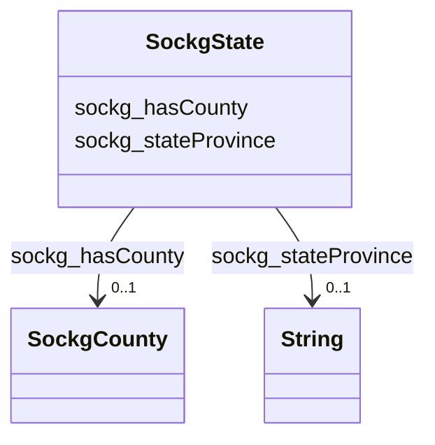

# Class: TODO -- what's a good name for what this class (type) describes? (sockg_State)


_No type description provided_


URI: [sockg:State](http://www.semanticweb.org/sockg/ontologies/2024/0/soil-carbon-ontology/State)





<!-- no inheritance hierarchy -->


## Slots

| Name | Cardinality and Range | Description | Inheritance |
| ---  | --- | --- | --- |
| [sockg_hasCounty](../slots/sockg_hasCounty.md) | 0..1 <br/> [SockgCounty](../classes/SockgCounty.md) | No slot description provided | direct |
| [sockg_stateProvince](../slots/sockg_stateProvince.md) | 0..1 <br/> [xsd:string](http://www.w3.org/2001/XMLSchema#string) | No slot description provided | direct |


## Usages

| used by | used in | type | used |
| ---  | --- | --- | --- |
| [SockgCountry](../classes/SockgCountry.md) | [sockg_hasState](../slots/sockg_hasState.md) | range | [SockgState](../classes/SockgState.md) |
| [SockgSite](../classes/SockgSite.md) | [sockg_locatedInState](../slots/sockg_locatedInState.md) | range | [SockgState](../classes/SockgState.md) |


## Examples

| Value |
| --- |
| neo4j://graph.individuals#331928 |

## TODOs

* TODO -- Todos for this class go here
* or you can delete the todos
* if you think the class is perfect.

## Identifier and Mapping Information


### Schema Source


* from schema: soc-kg/main


## Mappings

| Mapping Type | Mapped Value |
| ---  | ---  |
| self | sockg:State |
| native | soc-kg/main/:SockgState |


## LinkML Source

<!-- TODO: investigate https://stackoverflow.com/questions/37606292/how-to-create-tabbed-code-blocks-in-mkdocs-or-sphinx -->

### Direct

<details>
```yaml
name: sockg_State
description: No type description provided
title: TODO -- what's a good name for what this class (type) describes?
todos:
- TODO -- Todos for this class go here
- or you can delete the todos
- if you think the class is perfect.
notes:
- There are 20 instances of this class.
examples:
- value: neo4j://graph.individuals#331928
from_schema: soc-kg/main
rank: 1000
slots:
- sockg_hasCounty
- sockg_stateProvince
class_uri: sockg:State

```
</details>

### Induced

<details>
```yaml
name: sockg_State
description: No type description provided
title: TODO -- what's a good name for what this class (type) describes?
todos:
- TODO -- Todos for this class go here
- or you can delete the todos
- if you think the class is perfect.
notes:
- There are 20 instances of this class.
examples:
- value: neo4j://graph.individuals#331928
from_schema: soc-kg/main
rank: 1000
attributes:
  sockg_hasCounty:
    name: sockg_hasCounty
    description: No slot description provided
    todos:
    - TODO -- Todos for this slot go here
    - or you can delete the todos
    - if you think the class is perfect.
    comments:
    - 34 occurrences with subject type sockg:State and object type sockg:County.
    examples:
    - value: neo4j://graph.individuals#331928 sockg:hasCounty neo4j://graph.individuals#46723
    from_schema: soc-kg/main
    rank: 1000
    slot_uri: sockg:hasCounty
    alias: sockg_hasCounty
    owner: sockg_State
    domain_of:
    - sockg_State
    range: sockg_County
  sockg_stateProvince:
    name: sockg_stateProvince
    description: No slot description provided
    todos:
    - TODO -- Todos for this slot go here
    - or you can delete the todos
    - if you think the class is perfect.
    comments:
    - 20 occurrences with subject type sockg:State and object type string.
    examples:
    - value: neo4j://graph.individuals#331912 sockg:stateProvince CO
    from_schema: soc-kg/main
    rank: 1000
    slot_uri: sockg:stateProvince
    alias: sockg_stateProvince
    owner: sockg_State
    domain_of:
    - sockg_State
    range: string
class_uri: sockg:State

```
</details>