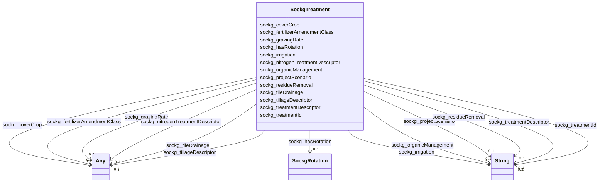

# Class: TODO -- what's a good name for what this class (type) describes? (sockg_Treatment)


_No type description provided_


URI: [sockg:Treatment](http://www.semanticweb.org/sockg/ontologies/2024/0/soil-carbon-ontology/Treatment)





<!-- no inheritance hierarchy -->


## Slots

| Name | Cardinality and Range | Description | Inheritance |
| ---  | --- | --- | --- |
| [sockg_hasRotation](../slots/sockg_hasRotation.md) | 0..1 <br/> [SockgRotation](../classes/SockgRotation.md) | No slot description provided | direct |
| [sockg_fertilizerAmendmentClass](../slots/sockg_fertilizerAmendmentClass.md) | 0..1 <br/> [xsd:string](http://www.w3.org/2001/XMLSchema#string)&nbsp;or&nbsp;<br />[xsd:double](http://www.w3.org/2001/XMLSchema#double) | No slot description provided | direct |
| [sockg_organicManagement](../slots/sockg_organicManagement.md) | 0..1 <br/> [xsd:string](http://www.w3.org/2001/XMLSchema#string) | No slot description provided | direct |
| [sockg_treatmentDescriptor](../slots/sockg_treatmentDescriptor.md) | 0..1 <br/> [xsd:string](http://www.w3.org/2001/XMLSchema#string) | No slot description provided | direct |
| [sockg_tileDrainage](../slots/sockg_tileDrainage.md) | 0..1 <br/> [xsd:double](http://www.w3.org/2001/XMLSchema#double)&nbsp;or&nbsp;<br />[xsd:string](http://www.w3.org/2001/XMLSchema#string) | No slot description provided | direct |
| [sockg_tillageDescriptor](../slots/sockg_tillageDescriptor.md) | 0..1 <br/> [xsd:string](http://www.w3.org/2001/XMLSchema#string)&nbsp;or&nbsp;<br />[xsd:double](http://www.w3.org/2001/XMLSchema#double) | No slot description provided | direct |
| [sockg_projectScenario](../slots/sockg_projectScenario.md) | 0..1 <br/> [xsd:string](http://www.w3.org/2001/XMLSchema#string) | No slot description provided | direct |
| [sockg_grazingRate](../slots/sockg_grazingRate.md) | 0..1 <br/> [xsd:double](http://www.w3.org/2001/XMLSchema#double)&nbsp;or&nbsp;<br />[xsd:string](http://www.w3.org/2001/XMLSchema#string) | No slot description provided | direct |
| [sockg_coverCrop](../slots/sockg_coverCrop.md) | 0..1 <br/> [xsd:double](http://www.w3.org/2001/XMLSchema#double)&nbsp;or&nbsp;<br />[xsd:string](http://www.w3.org/2001/XMLSchema#string) | No slot description provided | direct |
| [sockg_residueRemoval](../slots/sockg_residueRemoval.md) | 0..1 <br/> [xsd:string](http://www.w3.org/2001/XMLSchema#string) | No slot description provided | direct |
| [sockg_irrigation](../slots/sockg_irrigation.md) | 0..1 <br/> [xsd:string](http://www.w3.org/2001/XMLSchema#string) | No slot description provided | direct |
| [sockg_nitrogenTreatmentDescriptor](../slots/sockg_nitrogenTreatmentDescriptor.md) | 0..1 <br/> [xsd:double](http://www.w3.org/2001/XMLSchema#double)&nbsp;or&nbsp;<br />[xsd:string](http://www.w3.org/2001/XMLSchema#string) | No slot description provided | direct |
| [sockg_treatmentId](../slots/sockg_treatmentId.md) | 0..1 <br/> [xsd:string](http://www.w3.org/2001/XMLSchema#string) | No slot description provided | direct |


## Usages

| used by | used in | type | used |
| ---  | --- | --- | --- |
| [SockgExperiment](../classes/SockgExperiment.md) | [sockg_hasTreatment](../slots/sockg_hasTreatment.md) | range | [SockgTreatment](../classes/SockgTreatment.md) |
| [SockgWaterQualityArea](../classes/SockgWaterQualityArea.md) | [sockg_waterQualityAreaTreatment](../slots/sockg_waterQualityAreaTreatment.md) | range | [SockgTreatment](../classes/SockgTreatment.md) |
| [SockgWaterQualityConc](../classes/SockgWaterQualityConc.md) | [sockg_waterQualityConcTreatment](../slots/sockg_waterQualityConcTreatment.md) | range | [SockgTreatment](../classes/SockgTreatment.md) |
| [SockgWindErosionArea](../classes/SockgWindErosionArea.md) | [sockg_windErosionTreatment](../slots/sockg_windErosionTreatment.md) | range | [SockgTreatment](../classes/SockgTreatment.md) |
| [SockgYieldNutrientUptake](../classes/SockgYieldNutrientUptake.md) | [sockg_yieldNutrUptakeTreatment](../slots/sockg_yieldNutrUptakeTreatment.md) | range | [SockgTreatment](../classes/SockgTreatment.md) |


## Examples

| Value |
| --- |
| neo4j://graph.individuals#359750 |

## TODOs

* TODO -- Todos for this class go here
* or you can delete the todos
* if you think the class is perfect.

## Identifier and Mapping Information


### Schema Source


* from schema: soc-kg/main


## Mappings

| Mapping Type | Mapped Value |
| ---  | ---  |
| self | sockg:Treatment |
| native | soc-kg/main/:SockgTreatment |


## LinkML Source

<!-- TODO: investigate https://stackoverflow.com/questions/37606292/how-to-create-tabbed-code-blocks-in-mkdocs-or-sphinx -->

### Direct

<details>
```yaml
name: sockg_Treatment
description: No type description provided
title: TODO -- what's a good name for what this class (type) describes?
todos:
- TODO -- Todos for this class go here
- or you can delete the todos
- if you think the class is perfect.
notes:
- There are 769 instances of this class.
examples:
- value: neo4j://graph.individuals#359750
from_schema: soc-kg/main
rank: 1000
slots:
- sockg_hasRotation
- sockg_fertilizerAmendmentClass
- sockg_organicManagement
- sockg_treatmentDescriptor
- sockg_tileDrainage
- sockg_tillageDescriptor
- sockg_projectScenario
- sockg_grazingRate
- sockg_coverCrop
- sockg_residueRemoval
- sockg_irrigation
- sockg_nitrogenTreatmentDescriptor
- sockg_treatmentId
class_uri: sockg:Treatment

```
</details>

### Induced

<details>
```yaml
name: sockg_Treatment
description: No type description provided
title: TODO -- what's a good name for what this class (type) describes?
todos:
- TODO -- Todos for this class go here
- or you can delete the todos
- if you think the class is perfect.
notes:
- There are 769 instances of this class.
examples:
- value: neo4j://graph.individuals#359750
from_schema: soc-kg/main
rank: 1000
attributes:
  sockg_hasRotation:
    name: sockg_hasRotation
    description: No slot description provided
    todos:
    - TODO -- Todos for this slot go here
    - or you can delete the todos
    - if you think the class is perfect.
    comments:
    - 761 occurrences with subject type sockg:Treatment and object type sockg:Rotation.
    examples:
    - value: neo4j://graph.individuals#359556 sockg:hasRotation neo4j://graph.individuals#230618
    from_schema: soc-kg/main
    rank: 1000
    slot_uri: sockg:hasRotation
    alias: sockg_hasRotation
    owner: sockg_Treatment
    domain_of:
    - sockg_Treatment
    range: sockg_Rotation
  sockg_fertilizerAmendmentClass:
    name: sockg_fertilizerAmendmentClass
    description: No slot description provided
    todos:
    - TODO -- Todos for this slot go here
    - or you can delete the todos
    - if you think the class is perfect.
    comments:
    - 653 occurrences with subject type sockg:Treatment and object type string.
    - 116 occurrences with subject type sockg:Treatment and object type xsd:double.
    examples:
    - value: neo4j://graph.individuals#359116 sockg:fertilizerAmendmentClass Synthetic
    - value: neo4j://graph.individuals#359224 sockg:fertilizerAmendmentClass nan
    from_schema: soc-kg/main
    rank: 1000
    slot_uri: sockg:fertilizerAmendmentClass
    alias: sockg_fertilizerAmendmentClass
    owner: sockg_Treatment
    domain_of:
    - sockg_Treatment
    range: Any
    any_of:
    - range: string
    - range: double
  sockg_organicManagement:
    name: sockg_organicManagement
    description: No slot description provided
    todos:
    - TODO -- Todos for this slot go here
    - or you can delete the todos
    - if you think the class is perfect.
    comments:
    - 769 occurrences with subject type sockg:Treatment and object type string.
    examples:
    - value: neo4j://graph.individuals#359446 sockg:organicManagement No
    from_schema: soc-kg/main
    rank: 1000
    slot_uri: sockg:organicManagement
    alias: sockg_organicManagement
    owner: sockg_Treatment
    domain_of:
    - sockg_Treatment
    range: string
  sockg_treatmentDescriptor:
    name: sockg_treatmentDescriptor
    description: No slot description provided
    todos:
    - TODO -- Todos for this slot go here
    - or you can delete the todos
    - if you think the class is perfect.
    comments:
    - 769 occurrences with subject type sockg:Treatment and object type string.
    examples:
    - value: neo4j://graph.individuals#359070 sockg:treatmentDescriptor ConvSys 4yr
        rot  CT NF
    from_schema: soc-kg/main
    rank: 1000
    slot_uri: sockg:treatmentDescriptor
    alias: sockg_treatmentDescriptor
    owner: sockg_Treatment
    domain_of:
    - sockg_Treatment
    range: string
  sockg_tileDrainage:
    name: sockg_tileDrainage
    description: No slot description provided
    todos:
    - TODO -- Todos for this slot go here
    - or you can delete the todos
    - if you think the class is perfect.
    comments:
    - 331 occurrences with subject type sockg:Treatment and object type xsd:double.
    - 438 occurrences with subject type sockg:Treatment and object type string.
    examples:
    - value: neo4j://graph.individuals#359754 sockg:tileDrainage nan
    - value: neo4j://graph.individuals#359184 sockg:tileDrainage No
    from_schema: soc-kg/main
    rank: 1000
    slot_uri: sockg:tileDrainage
    alias: sockg_tileDrainage
    owner: sockg_Treatment
    domain_of:
    - sockg_Treatment
    range: Any
    any_of:
    - range: double
    - range: string
  sockg_tillageDescriptor:
    name: sockg_tillageDescriptor
    description: No slot description provided
    todos:
    - TODO -- Todos for this slot go here
    - or you can delete the todos
    - if you think the class is perfect.
    comments:
    - 719 occurrences with subject type sockg:Treatment and object type string.
    - 50 occurrences with subject type sockg:Treatment and object type xsd:double.
    examples:
    - value: neo4j://graph.individuals#359547 sockg:tillageDescriptor Strip Till
    - value: neo4j://graph.individuals#359460 sockg:tillageDescriptor nan
    from_schema: soc-kg/main
    rank: 1000
    slot_uri: sockg:tillageDescriptor
    alias: sockg_tillageDescriptor
    owner: sockg_Treatment
    domain_of:
    - sockg_Treatment
    range: Any
    any_of:
    - range: string
    - range: double
  sockg_projectScenario:
    name: sockg_projectScenario
    description: No slot description provided
    todos:
    - TODO -- Todos for this slot go here
    - or you can delete the todos
    - if you think the class is perfect.
    comments:
    - 769 occurrences with subject type sockg:Treatment and object type string.
    examples:
    - value: neo4j://graph.individuals#359484 sockg:projectScenario A=No removal
    from_schema: soc-kg/main
    rank: 1000
    slot_uri: sockg:projectScenario
    alias: sockg_projectScenario
    owner: sockg_Treatment
    domain_of:
    - sockg_Treatment
    range: string
  sockg_grazingRate:
    name: sockg_grazingRate
    description: No slot description provided
    todos:
    - TODO -- Todos for this slot go here
    - or you can delete the todos
    - if you think the class is perfect.
    comments:
    - 749 occurrences with subject type sockg:Treatment and object type xsd:double.
    - 20 occurrences with subject type sockg:Treatment and object type string.
    examples:
    - value: neo4j://graph.individuals#359097 sockg:grazingRate nan
    - value: neo4j://graph.individuals#359162 sockg:grazingRate Low
    from_schema: soc-kg/main
    rank: 1000
    slot_uri: sockg:grazingRate
    alias: sockg_grazingRate
    owner: sockg_Treatment
    domain_of:
    - sockg_Treatment
    range: Any
    any_of:
    - range: double
    - range: string
  sockg_coverCrop:
    name: sockg_coverCrop
    description: No slot description provided
    todos:
    - TODO -- Todos for this slot go here
    - or you can delete the todos
    - if you think the class is perfect.
    comments:
    - 575 occurrences with subject type sockg:Treatment and object type xsd:double.
    - 194 occurrences with subject type sockg:Treatment and object type string.
    examples:
    - value: neo4j://graph.individuals#359399 sockg:coverCrop nan
    - value: neo4j://graph.individuals#359662 sockg:coverCrop Secale cereale (Rye)
    from_schema: soc-kg/main
    rank: 1000
    slot_uri: sockg:coverCrop
    alias: sockg_coverCrop
    owner: sockg_Treatment
    domain_of:
    - sockg_Treatment
    range: Any
    any_of:
    - range: double
    - range: string
  sockg_residueRemoval:
    name: sockg_residueRemoval
    description: No slot description provided
    todos:
    - TODO -- Todos for this slot go here
    - or you can delete the todos
    - if you think the class is perfect.
    comments:
    - 769 occurrences with subject type sockg:Treatment and object type string.
    examples:
    - value: neo4j://graph.individuals#359092 sockg:residueRemoval No
    from_schema: soc-kg/main
    rank: 1000
    slot_uri: sockg:residueRemoval
    alias: sockg_residueRemoval
    owner: sockg_Treatment
    domain_of:
    - sockg_Treatment
    range: string
  sockg_irrigation:
    name: sockg_irrigation
    description: No slot description provided
    todos:
    - TODO -- Todos for this slot go here
    - or you can delete the todos
    - if you think the class is perfect.
    comments:
    - 769 occurrences with subject type sockg:Treatment and object type string.
    examples:
    - value: neo4j://graph.individuals#359538 sockg:irrigation No
    from_schema: soc-kg/main
    rank: 1000
    slot_uri: sockg:irrigation
    alias: sockg_irrigation
    owner: sockg_Treatment
    domain_of:
    - sockg_Treatment
    range: string
  sockg_nitrogenTreatmentDescriptor:
    name: sockg_nitrogenTreatmentDescriptor
    description: No slot description provided
    todos:
    - TODO -- Todos for this slot go here
    - or you can delete the todos
    - if you think the class is perfect.
    comments:
    - 19 occurrences with subject type sockg:Treatment and object type xsd:double.
    - 750 occurrences with subject type sockg:Treatment and object type string.
    examples:
    - value: neo4j://graph.individuals#359736 sockg:nitrogenTreatmentDescriptor nan
    - value: neo4j://graph.individuals#359592 sockg:nitrogenTreatmentDescriptor high
        yield
    from_schema: soc-kg/main
    rank: 1000
    slot_uri: sockg:nitrogenTreatmentDescriptor
    alias: sockg_nitrogenTreatmentDescriptor
    owner: sockg_Treatment
    domain_of:
    - sockg_Treatment
    range: Any
    any_of:
    - range: double
    - range: string
  sockg_treatmentId:
    name: sockg_treatmentId
    description: No slot description provided
    todos:
    - TODO -- Todos for this slot go here
    - or you can delete the todos
    - if you think the class is perfect.
    comments:
    - 6723 occurrences with subject type sockg:BioMassMineral and object type string.
    - 107354 occurrences with subject type sockg:GasSample and object type string.
    - 53833 occurrences with subject type sockg:SoilChemicalSample and object type
      string.
    - 37796 occurrences with subject type sockg:Amendment and object type string.
    - 9470 occurrences with subject type sockg:HarvestFraction and object type string.
    - 28082 occurrences with subject type sockg:SoilPhysicalSample and object type
      string.
    - 18222 occurrences with subject type sockg:SoilBiologicalSample and object type
      string.
    - 4896 occurrences with subject type sockg:CropGrowthStage and object type string.
    - 6995 occurrences with subject type sockg:Grazing and object type string.
    - 1951 occurrences with subject type sockg:GrazingManagementEvent and object type
      string.
    - 799 occurrences with subject type sockg:BioMassEnergy and object type string.
    - 18356 occurrences with subject type sockg:Harvest and object type string.
    - 1479 occurrences with subject type sockg:WaterQualityConc and object type string.
    - 3308 occurrences with subject type sockg:ResidueManagementEvent and object type
      string.
    - 1367 occurrences with subject type sockg:BioMassCarbohydrate and object type
      string.
    - 667 occurrences with subject type sockg:WaterQualityArea and object type string.
    - 2791 occurrences with subject type sockg:NutrientEfficiency and object type
      string.
    - 429 occurrences with subject type sockg:YieldNutrientUptake and object type
      string.
    - 748 occurrences with subject type sockg:GasNutrientLoss and object type string.
    - 769 occurrences with subject type sockg:Treatment and object type string.
    - 15 occurrences with subject type sockg:WindErosionArea and object type string.
    examples:
    - value: neo4j://graph.individuals#43961 sockg:treatmentId PAUP_8
    - value: neo4j://graph.individuals#147269 sockg:treatmentId KYBGGHG_1
    - value: neo4j://graph.individuals#296284 sockg:treatmentId PAUP_15
    - value: neo4j://graph.individuals#13960 sockg:treatmentId NEMLTCRS_ROT62
    - value: neo4j://graph.individuals#200120 sockg:treatmentId ECUAlumbreP2_MtNocrhZf
    - value: neo4j://graph.individuals#311219 sockg:treatmentId GAJPCSR1_F3H1
    - value: neo4j://graph.individuals#248000 sockg:treatmentId MNMOBRR_N005C
    - value: neo4j://graph.individuals#47857 sockg:treatmentId INWLTPAC_NP
    - value: neo4j://graph.individuals#170669 sockg:treatmentId NDMAGWP_HG
    - value: neo4j://graph.individuals#171511 sockg:treatmentId GAJPCSR2_F5H2
    - value: neo4j://graph.individuals#39242 sockg:treatmentId SCFLSGI_50R
    - value: neo4j://graph.individuals#181825 sockg:treatmentId PAHAW_RCG1
    - value: neo4j://graph.individuals#361841 sockg:treatmentId WIPDBARN_SAND
    - value: neo4j://graph.individuals#227864 sockg:treatmentId PAHAW_ROT8
    - value: neo4j://graph.individuals#38229 sockg:treatmentId MNSPReap_ST000
    - value: neo4j://graph.individuals#360342 sockg:treatmentId WIPDBARN_SAND
    - value: neo4j://graph.individuals#203268 sockg:treatmentId COFOARD4_DM
    - value: neo4j://graph.individuals#509719 sockg:treatmentId MNSP4R_U-S100
    - value: neo4j://graph.individuals#56012 sockg:treatmentId WIPDBARN_SOIL
    - value: neo4j://graph.individuals#359420 sockg:treatmentId MNMOBRR_N010S
    - value: neo4j://graph.individuals#509310 sockg:treatmentId TXBSWEWC_ERODE
    from_schema: soc-kg/main
    rank: 1000
    slot_uri: sockg:treatmentId
    alias: sockg_treatmentId
    owner: sockg_Treatment
    domain_of:
    - sockg_Amendment
    - sockg_BioMassCarbohydrate
    - sockg_BioMassEnergy
    - sockg_BioMassMineral
    - sockg_CropGrowthStage
    - sockg_GasNutrientLoss
    - sockg_GasSample
    - sockg_Grazing
    - sockg_GrazingManagementEvent
    - sockg_Harvest
    - sockg_HarvestFraction
    - sockg_NutrientEfficiency
    - sockg_ResidueManagementEvent
    - sockg_SoilBiologicalSample
    - sockg_SoilChemicalSample
    - sockg_SoilPhysicalSample
    - sockg_Treatment
    - sockg_WaterQualityArea
    - sockg_WaterQualityConc
    - sockg_WindErosionArea
    - sockg_YieldNutrientUptake
    range: string
class_uri: sockg:Treatment

```
</details>