# Class: No class (entity type) name specified (sockg_Treatment)


_The Treatment class encompasses various agricultural practices and management techniques applied to enhance crop production and sustainability. It includes strategies for soil improvement, nutrient management, and crop rotation, aimed at optimizing farm productivity while minimizing environmental impact._


This class occurs 769 times.


URI: [sockg:Treatment](https://idir.uta.edu/sockg-ontology/docs/Treatment)

```mermaid
 classDiagram
    class SockgTreatment
    click SockgTreatment href "../SockgTreatment"
      SockgTreatment : rdfs_seeAlso
        
          
    
    
    SockgTreatment --> "0..1" Uri : rdfs_seeAlso
    click Uri href "../Uri"

        
      SockgTreatment : sockg_coverCrop
        
          
    
    
    SockgTreatment --> "0..1" String : sockg_coverCrop
    click String href "../String"

        
      SockgTreatment : sockg_fertilizerAmendmentClass
        
          
    
    
    SockgTreatment --> "0..1" String : sockg_fertilizerAmendmentClass
    click String href "../String"

        
      SockgTreatment : sockg_grazingRate
        
          
    
    
    SockgTreatment --> "0..1" String : sockg_grazingRate
    click String href "../String"

        
      SockgTreatment : sockg_hasRotation
        
          
    
    
    SockgTreatment --> "0..1" SockgRotation : sockg_hasRotation
    click SockgRotation href "../SockgRotation"

        
      SockgTreatment : sockg_irrigation
        
          
    
    
    SockgTreatment --> "0..1" String : sockg_irrigation
    click String href "../String"

        
      SockgTreatment : sockg_nitrogenTreatmentDescriptor
        
          
    
    
    SockgTreatment --> "0..1" String : sockg_nitrogenTreatmentDescriptor
    click String href "../String"

        
      SockgTreatment : sockg_organicManagement
        
          
    
    
    SockgTreatment --> "0..1" String : sockg_organicManagement
    click String href "../String"

        
      SockgTreatment : sockg_projectScenario
        
          
    
    
    SockgTreatment --> "0..1" String : sockg_projectScenario
    click String href "../String"

        
      SockgTreatment : sockg_residueRemoval
        
          
    
    
    SockgTreatment --> "0..1" String : sockg_residueRemoval
    click String href "../String"

        
      SockgTreatment : sockg_tileDrainage
        
          
    
    
    SockgTreatment --> "0..1" String : sockg_tileDrainage
    click String href "../String"

        
      SockgTreatment : sockg_tillageDescriptor
        
          
    
    
    SockgTreatment --> "0..1" String : sockg_tillageDescriptor
    click String href "../String"

        
      SockgTreatment : sockg_treatmentDescriptor
        
          
    
    
    SockgTreatment --> "0..1" String : sockg_treatmentDescriptor
    click String href "../String"

        
      SockgTreatment : sockg_treatmentId
        
          
    
    
    SockgTreatment --> "0..1" Any : sockg_treatmentId
    click Any href "../Any"

        
      
```





<!-- no inheritance hierarchy -->


## Slots

| Name | Cardinality and Range | Description | Inheritance | Occurrences |
| ---  | --- | --- | --- | --- |
| [rdfs_seeAlso](../slots/rdfs_seeAlso.md) | 0..1 <br/> [xsd:anyURI](http://www.w3.org/2001/XMLSchema#anyURI) | No slot (predicate) description specified <br/>  | direct | 769 |
| [sockg_projectScenario](../slots/sockg_projectScenario.md) | 0..1 <br/> [xsd:string](http://www.w3.org/2001/XMLSchema#string) | No slot (predicate) description specified <br/>  | direct | 769 |
| [sockg_hasRotation](../slots/sockg_hasRotation.md) | 0..1 <br/> [SockgRotation](../classes/SockgRotation.md) | No slot (predicate) description specified <br/>  | direct | 761 |
| [sockg_tileDrainage](../slots/sockg_tileDrainage.md) | 0..1 <br/> [xsd:string](http://www.w3.org/2001/XMLSchema#string) | No slot (predicate) description specified <br/>  | direct | 438 |
| [sockg_nitrogenTreatmentDescriptor](../slots/sockg_nitrogenTreatmentDescriptor.md) | 0..1 <br/> [xsd:string](http://www.w3.org/2001/XMLSchema#string) | No slot (predicate) description specified <br/>  | direct | 750 |
| [sockg_grazingRate](../slots/sockg_grazingRate.md) | 0..1 <br/> [xsd:string](http://www.w3.org/2001/XMLSchema#string) | No slot (predicate) description specified <br/>  | direct | 20 |
| [sockg_coverCrop](../slots/sockg_coverCrop.md) | 0..1 <br/> [xsd:string](http://www.w3.org/2001/XMLSchema#string) | No slot (predicate) description specified <br/>  | direct | 194 |
| [sockg_irrigation](../slots/sockg_irrigation.md) | 0..1 <br/> [xsd:string](http://www.w3.org/2001/XMLSchema#string) | No slot (predicate) description specified <br/>  | direct | 769 |
| [sockg_treatmentId](../slots/sockg_treatmentId.md) | 0..1 <br/> [xsd:date](http://www.w3.org/2001/XMLSchema#date)&nbsp;or&nbsp;<br />[xsd:string](http://www.w3.org/2001/XMLSchema#string)&nbsp;or&nbsp;<br />[xsd:float](http://www.w3.org/2001/XMLSchema#float) | No slot (predicate) description specified <br/>  | direct | 769 |
| [sockg_residueRemoval](../slots/sockg_residueRemoval.md) | 0..1 <br/> [xsd:string](http://www.w3.org/2001/XMLSchema#string) | No slot (predicate) description specified <br/>  | direct | 769 |
| [sockg_tillageDescriptor](../slots/sockg_tillageDescriptor.md) | 0..1 <br/> [xsd:string](http://www.w3.org/2001/XMLSchema#string) | No slot (predicate) description specified <br/>  | direct | 719 |
| [sockg_treatmentDescriptor](../slots/sockg_treatmentDescriptor.md) | 0..1 <br/> [xsd:string](http://www.w3.org/2001/XMLSchema#string) | No slot (predicate) description specified <br/>  | direct | 769 |
| [sockg_fertilizerAmendmentClass](../slots/sockg_fertilizerAmendmentClass.md) | 0..1 <br/> [xsd:string](http://www.w3.org/2001/XMLSchema#string) | No slot (predicate) description specified <br/>  | direct | 653 |
| [sockg_organicManagement](../slots/sockg_organicManagement.md) | 0..1 <br/> [xsd:string](http://www.w3.org/2001/XMLSchema#string) | No slot (predicate) description specified <br/>  | direct | 769 |


## Usages

| used by | used in | type | used |
| ---  | --- | --- | --- |
| [SockgExperiment](../classes/SockgExperiment.md) | [sockg_hasTreatment](../slots/sockg_hasTreatment.md) | range | [SockgTreatment](../classes/SockgTreatment.md) |
| [SockgSoilChemicalSample](../classes/SockgSoilChemicalSample.md) | [sockg_chemSampleHasTreatment](../slots/sockg_chemSampleHasTreatment.md) | range | [SockgTreatment](../classes/SockgTreatment.md) |
| [SockgTreatment](../classes/SockgTreatment.md) | [sockg_projectScenario](../slots/sockg_projectScenario.md) | domain | [SockgTreatment](../classes/SockgTreatment.md) |
| [SockgTreatment](../classes/SockgTreatment.md) | [sockg_hasRotation](../slots/sockg_hasRotation.md) | domain | [SockgTreatment](../classes/SockgTreatment.md) |
| [SockgTreatment](../classes/SockgTreatment.md) | [sockg_tileDrainage](../slots/sockg_tileDrainage.md) | domain | [SockgTreatment](../classes/SockgTreatment.md) |
| [SockgTreatment](../classes/SockgTreatment.md) | [sockg_nitrogenTreatmentDescriptor](../slots/sockg_nitrogenTreatmentDescriptor.md) | domain | [SockgTreatment](../classes/SockgTreatment.md) |
| [SockgTreatment](../classes/SockgTreatment.md) | [sockg_grazingRate](../slots/sockg_grazingRate.md) | domain | [SockgTreatment](../classes/SockgTreatment.md) |
| [SockgTreatment](../classes/SockgTreatment.md) | [sockg_coverCrop](../slots/sockg_coverCrop.md) | domain | [SockgTreatment](../classes/SockgTreatment.md) |
| [SockgTreatment](../classes/SockgTreatment.md) | [sockg_irrigation](../slots/sockg_irrigation.md) | domain | [SockgTreatment](../classes/SockgTreatment.md) |
| [SockgTreatment](../classes/SockgTreatment.md) | [sockg_residueRemoval](../slots/sockg_residueRemoval.md) | domain | [SockgTreatment](../classes/SockgTreatment.md) |
| [SockgTreatment](../classes/SockgTreatment.md) | [sockg_treatmentDescriptor](../slots/sockg_treatmentDescriptor.md) | domain | [SockgTreatment](../classes/SockgTreatment.md) |
| [SockgTreatment](../classes/SockgTreatment.md) | [sockg_fertilizerAmendmentClass](../slots/sockg_fertilizerAmendmentClass.md) | domain | [SockgTreatment](../classes/SockgTreatment.md) |
| [SockgTreatment](../classes/SockgTreatment.md) | [sockg_organicManagement](../slots/sockg_organicManagement.md) | domain | [SockgTreatment](../classes/SockgTreatment.md) |
| [SockgWaterQualityArea](../classes/SockgWaterQualityArea.md) | [sockg_waterQualityAreaTreatment](../slots/sockg_waterQualityAreaTreatment.md) | range | [SockgTreatment](../classes/SockgTreatment.md) |
| [SockgWaterQualityConc](../classes/SockgWaterQualityConc.md) | [sockg_waterQualityConcTreatment](../slots/sockg_waterQualityConcTreatment.md) | range | [SockgTreatment](../classes/SockgTreatment.md) |
| [SockgWindErosionArea](../classes/SockgWindErosionArea.md) | [sockg_windErosionTreatment](../slots/sockg_windErosionTreatment.md) | range | [SockgTreatment](../classes/SockgTreatment.md) |
| [SockgYieldNutrientUptake](../classes/SockgYieldNutrientUptake.md) | [sockg_yieldNutrUptakeTreatment](../slots/sockg_yieldNutrUptakeTreatment.md) | range | [SockgTreatment](../classes/SockgTreatment.md) |


## See Also

* [https://lod.nal.usda.gov/nalt/6148134](https://lod.nal.usda.gov/nalt/6148134)


## LinkML Source

<!-- TODO: investigate https://stackoverflow.com/questions/37606292/how-to-create-tabbed-code-blocks-in-mkdocs-or-sphinx -->

### Direct

<details>

```yaml
name: sockg_Treatment
conforms_to: No schema conformance document specified
annotations:
  count:
    tag: count
    value: 769
description: The Treatment class encompasses various agricultural practices and management
  techniques applied to enhance crop production and sustainability. It includes strategies
  for soil improvement, nutrient management, and crop rotation, aimed at optimizing
  farm productivity while minimizing environmental impact.
title: No class (entity type) name specified
from_schema: soc-kg
see_also:
- https://lod.nal.usda.gov/nalt/6148134
rank: 1000
slots:
- rdfs_seeAlso
- sockg_projectScenario
- sockg_hasRotation
- sockg_tileDrainage
- sockg_nitrogenTreatmentDescriptor
- sockg_grazingRate
- sockg_coverCrop
- sockg_irrigation
- sockg_treatmentId
- sockg_residueRemoval
- sockg_tillageDescriptor
- sockg_treatmentDescriptor
- sockg_fertilizerAmendmentClass
- sockg_organicManagement
slot_usage:
  rdfs_seeAlso:
    name: rdfs_seeAlso
    annotations:
      uri:
        tag: uri
        value: 769
  sockg_coverCrop:
    name: sockg_coverCrop
    annotations:
      string:
        tag: string
        value: 194
  sockg_fertilizerAmendmentClass:
    name: sockg_fertilizerAmendmentClass
    annotations:
      string:
        tag: string
        value: 653
  sockg_grazingRate:
    name: sockg_grazingRate
    annotations:
      string:
        tag: string
        value: 20
  sockg_hasRotation:
    name: sockg_hasRotation
    annotations:
      sockg_Rotation:
        tag: sockg_Rotation
        value: 761
  sockg_irrigation:
    name: sockg_irrigation
    annotations:
      string:
        tag: string
        value: 769
  sockg_nitrogenTreatmentDescriptor:
    name: sockg_nitrogenTreatmentDescriptor
    annotations:
      string:
        tag: string
        value: 750
  sockg_organicManagement:
    name: sockg_organicManagement
    annotations:
      string:
        tag: string
        value: 769
  sockg_projectScenario:
    name: sockg_projectScenario
    annotations:
      string:
        tag: string
        value: 769
  sockg_residueRemoval:
    name: sockg_residueRemoval
    annotations:
      string:
        tag: string
        value: 769
  sockg_tileDrainage:
    name: sockg_tileDrainage
    annotations:
      string:
        tag: string
        value: 438
  sockg_tillageDescriptor:
    name: sockg_tillageDescriptor
    annotations:
      string:
        tag: string
        value: 719
  sockg_treatmentDescriptor:
    name: sockg_treatmentDescriptor
    annotations:
      string:
        tag: string
        value: 769
  sockg_treatmentId:
    name: sockg_treatmentId
    annotations:
      string:
        tag: string
        value: 769
class_uri: sockg:Treatment

```
</details>

### Induced

<details>

```yaml
name: sockg_Treatment
conforms_to: No schema conformance document specified
annotations:
  count:
    tag: count
    value: 769
description: The Treatment class encompasses various agricultural practices and management
  techniques applied to enhance crop production and sustainability. It includes strategies
  for soil improvement, nutrient management, and crop rotation, aimed at optimizing
  farm productivity while minimizing environmental impact.
title: No class (entity type) name specified
from_schema: soc-kg
see_also:
- https://lod.nal.usda.gov/nalt/6148134
rank: 1000
slot_usage:
  rdfs_seeAlso:
    name: rdfs_seeAlso
    annotations:
      uri:
        tag: uri
        value: 769
  sockg_coverCrop:
    name: sockg_coverCrop
    annotations:
      string:
        tag: string
        value: 194
  sockg_fertilizerAmendmentClass:
    name: sockg_fertilizerAmendmentClass
    annotations:
      string:
        tag: string
        value: 653
  sockg_grazingRate:
    name: sockg_grazingRate
    annotations:
      string:
        tag: string
        value: 20
  sockg_hasRotation:
    name: sockg_hasRotation
    annotations:
      sockg_Rotation:
        tag: sockg_Rotation
        value: 761
  sockg_irrigation:
    name: sockg_irrigation
    annotations:
      string:
        tag: string
        value: 769
  sockg_nitrogenTreatmentDescriptor:
    name: sockg_nitrogenTreatmentDescriptor
    annotations:
      string:
        tag: string
        value: 750
  sockg_organicManagement:
    name: sockg_organicManagement
    annotations:
      string:
        tag: string
        value: 769
  sockg_projectScenario:
    name: sockg_projectScenario
    annotations:
      string:
        tag: string
        value: 769
  sockg_residueRemoval:
    name: sockg_residueRemoval
    annotations:
      string:
        tag: string
        value: 769
  sockg_tileDrainage:
    name: sockg_tileDrainage
    annotations:
      string:
        tag: string
        value: 438
  sockg_tillageDescriptor:
    name: sockg_tillageDescriptor
    annotations:
      string:
        tag: string
        value: 719
  sockg_treatmentDescriptor:
    name: sockg_treatmentDescriptor
    annotations:
      string:
        tag: string
        value: 769
  sockg_treatmentId:
    name: sockg_treatmentId
    annotations:
      string:
        tag: string
        value: 769
attributes:
  rdfs_seeAlso:
    name: rdfs_seeAlso
    annotations:
      uri:
        tag: uri
        value: 769
    description: No slot (predicate) description specified
    examples:
    - object:
        example_object: https://lod.nal.usda.gov/nalt/4605
        example_object_type: uri
        example_predicate: rdfs:seeAlso
        example_subject: sockg:individuals/0
        example_subject_type: sockg_Amendment
    - object:
        example_object: https://lod.nal.usda.gov/nalt/5859
        example_object_type: uri
        example_predicate: rdfs:seeAlso
        example_subject: sockg:individuals/100000
        example_subject_type: sockg_GasSample
    - object:
        example_object: https://lod.nal.usda.gov/nalt/281219
        example_object_type: uri
        example_predicate: rdfs:seeAlso
        example_subject: sockg:individuals/163960
        example_subject_type: sockg_Grazing
    - object:
        example_object: https://lod.nal.usda.gov/nalt/4377260
        example_object_type: uri
        example_predicate: rdfs:seeAlso
        example_subject: sockg:individuals/170955
        example_subject_type: sockg_GrazingManagementEvent
    - object:
        example_object: https://lod.nal.usda.gov/nalt/131626
        example_object_type: uri
        example_predicate: rdfs:seeAlso
        example_subject: sockg:individuals/172906
        example_subject_type: sockg_Harvest
    - object:
        example_object: https://lod.nal.usda.gov/nalt/281219
        example_object_type: uri
        example_predicate: rdfs:seeAlso
        example_subject: sockg:individuals/191262
        example_subject_type: sockg_HarvestFraction
    - object:
        example_object: https://lod.nal.usda.gov/nalt/13189
        example_object_type: uri
        example_predicate: rdfs:seeAlso
        example_subject: sockg:individuals/203523
        example_subject_type: sockg_Organization
    - object:
        example_object: https://lod.nal.usda.gov/nalt/3927
        example_object_type: uri
        example_predicate: rdfs:seeAlso
        example_subject: sockg:individuals/203632
        example_subject_type: sockg_Pesticide
    - object:
        example_object: https://lod.nal.usda.gov/nalt/849
        example_object_type: uri
        example_predicate: rdfs:seeAlso
        example_subject: sockg:individuals/227674
        example_subject_type: sockg_ResidueManagementEvent
    - object:
        example_object: https://lod.nal.usda.gov/nalt/30158
        example_object_type: uri
        example_predicate: rdfs:seeAlso
        example_subject: sockg:individuals/230982
        example_subject_type: sockg_Rotation
    - object:
        example_object: https://lod.nal.usda.gov/nalt/302328
        example_object_type: uri
        example_predicate: rdfs:seeAlso
        example_subject: sockg:individuals/231056
        example_subject_type: sockg_Site
    - object:
        example_object: https://lod.nal.usda.gov/nalt/2726
        example_object_type: uri
        example_predicate: rdfs:seeAlso
        example_subject: sockg:individuals/235229
        example_subject_type: sockg_SoilBiologicalSample
    - object:
        example_object: https://lod.nal.usda.gov/nalt/7974
        example_object_type: uri
        example_predicate: rdfs:seeAlso
        example_subject: sockg:individuals/253451
        example_subject_type: sockg_SoilChemicalSample
    - object:
        example_object: https://lod.nal.usda.gov/nalt/302328
        example_object_type: uri
        example_predicate: rdfs:seeAlso
        example_subject: sockg:individuals/307284
        example_subject_type: sockg_SoilCover
    - object:
        example_object: https://lod.nal.usda.gov/nalt/5143
        example_object_type: uri
        example_predicate: rdfs:seeAlso
        example_subject: sockg:individuals/308318
        example_subject_type: sockg_SoilPhysicalSample
    - object:
        example_object: https://lod.nal.usda.gov/nalt/5430914
        example_object_type: uri
        example_predicate: rdfs:seeAlso
        example_subject: sockg:individuals/336400
        example_subject_type: sockg_State
    - object:
        example_object: https://lod.nal.usda.gov/nalt/7140
        example_object_type: uri
        example_predicate: rdfs:seeAlso
        example_subject: sockg:individuals/336419
        example_subject_type: sockg_Tillage
    - object:
        example_object: https://lod.nal.usda.gov/nalt/28616
        example_object_type: uri
        example_predicate: rdfs:seeAlso
        example_subject: sockg:individuals/363556
        example_subject_type: sockg_Treatment
    - object:
        example_object: https://lod.nal.usda.gov/nalt/2717
        example_object_type: uri
        example_predicate: rdfs:seeAlso
        example_subject: sockg:individuals/37796
        example_subject_type: sockg_BioMassCarbohydrate
    - object:
        example_object: https://lod.nal.usda.gov/nalt/7140
        example_object_type: uri
        example_predicate: rdfs:seeAlso
        example_subject: sockg:individuals/39163
        example_subject_type: sockg_BioMassEnergy
    - object:
        example_object: https://lod.nal.usda.gov/nalt/281219
        example_object_type: uri
        example_predicate: rdfs:seeAlso
        example_subject: sockg:individuals/39962
        example_subject_type: sockg_BioMassMineral
    - object:
        example_object: https://lod.nal.usda.gov/nalt/2714
        example_object_type: uri
        example_predicate: rdfs:seeAlso
        example_subject: sockg:individuals/439235
        example_subject_type: sockg_WeatherObservation
    - object:
        example_object: https://lod.nal.usda.gov/nalt/7485997
        example_object_type: uri
        example_predicate: rdfs:seeAlso
        example_subject: sockg:individuals/46864
        example_subject_type: sockg_City
    - object:
        example_object: https://lod.nal.usda.gov/nalt/2217129
        example_object_type: uri
        example_predicate: rdfs:seeAlso
        example_subject: sockg:individuals/46904
        example_subject_type: sockg_County
    - object:
        example_object: https://lod.nal.usda.gov/nalt/302328
        example_object_type: uri
        example_predicate: rdfs:seeAlso
        example_subject: sockg:individuals/46937
        example_subject_type: sockg_CropGrowthStage
    - object:
        example_object: https://lod.nal.usda.gov/nalt/976
        example_object_type: uri
        example_predicate: rdfs:seeAlso
        example_subject: sockg:individuals/51906
        example_subject_type: sockg_Experiment
    - object:
        example_object: https://lod.nal.usda.gov/nalt/9183
        example_object_type: uri
        example_predicate: rdfs:seeAlso
        example_subject: sockg:individuals/51937
        example_subject_type: sockg_ExperimentalUnit
    - object:
        example_object: https://lod.nal.usda.gov/nalt/7259
        example_object_type: uri
        example_predicate: rdfs:seeAlso
        example_subject: sockg:individuals/55800
        example_subject_type: sockg_Field
    - object:
        example_object: https://lod.nal.usda.gov/nalt/7140
        example_object_type: uri
        example_predicate: rdfs:seeAlso
        example_subject: sockg:individuals/200732
        example_subject_type: sockg_NutrientEfficiency
    - object:
        example_object: https://lod.nal.usda.gov/nalt/35067
        example_object_type: uri
        example_predicate: rdfs:seeAlso
        example_subject: sockg:individuals/203534
        example_subject_type: sockg_Person
    - object:
        example_object: https://lod.nal.usda.gov/nalt/5630
        example_object_type: uri
        example_predicate: rdfs:seeAlso
        example_subject: sockg:individuals/203988
        example_subject_type: sockg_PlantingEvent
    - object:
        example_object: https://lod.nal.usda.gov/nalt/61097
        example_object_type: uri
        example_predicate: rdfs:seeAlso
        example_subject: sockg:individuals/227438
        example_subject_type: sockg_Project
    - object:
        example_object: https://lod.nal.usda.gov/nalt/305490
        example_object_type: uri
        example_predicate: rdfs:seeAlso
        example_subject: sockg:individuals/227447
        example_subject_type: sockg_Publication
    - object:
        example_object: https://lod.nal.usda.gov/nalt/48678
        example_object_type: uri
        example_predicate: rdfs:seeAlso
        example_subject: sockg:individuals/227609
        example_subject_type: sockg_ResearchUnit
    - object:
        example_object: https://lod.nal.usda.gov/nalt/33020
        example_object_type: uri
        example_predicate: rdfs:seeAlso
        example_subject: sockg:individuals/231116
        example_subject_type: sockg_Soil
    - object:
        example_object: https://lod.nal.usda.gov/nalt/7140
        example_object_type: uri
        example_predicate: rdfs:seeAlso
        example_subject: sockg:individuals/364326
        example_subject_type: sockg_WaterQualityArea
    - object:
        example_object: https://lod.nal.usda.gov/nalt/281219
        example_object_type: uri
        example_predicate: rdfs:seeAlso
        example_subject: sockg:individuals/364993
        example_subject_type: sockg_WaterQualityConc
    - object:
        example_object: https://lod.nal.usda.gov/nalt/7259
        example_object_type: uri
        example_predicate: rdfs:seeAlso
        example_subject: sockg:individuals/513777
        example_subject_type: sockg_WeatherStation
    - object:
        example_object: https://lod.nal.usda.gov/nalt/281219
        example_object_type: uri
        example_predicate: rdfs:seeAlso
        example_subject: sockg:individuals/55858
        example_subject_type: sockg_GasNutrientLoss
    - object:
        example_object: https://lod.nal.usda.gov/nalt/281219
        example_object_type: uri
        example_predicate: rdfs:seeAlso
        example_subject: sockg:individuals/624572
        example_subject_type: sockg_WindErosionArea
    - object:
        example_object: https://lod.nal.usda.gov/nalt/7140
        example_object_type: uri
        example_predicate: rdfs:seeAlso
        example_subject: sockg:individuals/624587
        example_subject_type: sockg_YieldNutrientUptake
    from_schema: soc-kg
    rank: 1000
    slot_uri: rdfs:seeAlso
    alias: rdfs_seeAlso
    owner: sockg_Treatment
    domain_of:
    - sockg_Amendment
    - sockg_BioMassCarbohydrate
    - sockg_BioMassEnergy
    - sockg_BioMassMineral
    - sockg_City
    - sockg_County
    - sockg_CropGrowthStage
    - sockg_Experiment
    - sockg_ExperimentalUnit
    - sockg_Field
    - sockg_GasNutrientLoss
    - sockg_GasSample
    - sockg_Grazing
    - sockg_GrazingManagementEvent
    - sockg_Harvest
    - sockg_HarvestFraction
    - sockg_NutrientEfficiency
    - sockg_Organization
    - sockg_Person
    - sockg_Pesticide
    - sockg_PlantingEvent
    - sockg_Project
    - sockg_Publication
    - sockg_ResearchUnit
    - sockg_ResidueManagementEvent
    - sockg_Rotation
    - sockg_Site
    - sockg_Soil
    - sockg_SoilBiologicalSample
    - sockg_SoilChemicalSample
    - sockg_SoilCover
    - sockg_SoilPhysicalSample
    - sockg_State
    - sockg_Tillage
    - sockg_Treatment
    - sockg_WaterQualityArea
    - sockg_WaterQualityConc
    - sockg_WeatherObservation
    - sockg_WeatherStation
    - sockg_WindErosionArea
    - sockg_YieldNutrientUptake
    range: uri
  sockg_projectScenario:
    name: sockg_projectScenario
    annotations:
      string:
        tag: string
        value: 769
    description: No slot (predicate) description specified
    title: No slot (predicate) name specified
    examples:
    - object:
        example_object: 5=Other
        example_object_type: string
        example_predicate: sockg:projectScenario
        example_subject: sockg:individuals/363556
        example_subject_type: sockg_Treatment
    from_schema: soc-kg
    rank: 1000
    domain: sockg_Treatment
    slot_uri: sockg:projectScenario
    alias: sockg_projectScenario
    owner: sockg_Treatment
    domain_of:
    - sockg_Treatment
    range: string
  sockg_hasRotation:
    name: sockg_hasRotation
    annotations:
      sockg_Rotation:
        tag: sockg_Rotation
        value: 761
    description: No slot (predicate) description specified
    title: No slot (predicate) name specified
    examples:
    - object:
        example_object: sockg:individuals/230982
        example_object_type: sockg_Rotation
        example_predicate: sockg:hasRotation
        example_subject: sockg:individuals/363556
        example_subject_type: sockg_Treatment
    from_schema: soc-kg
    rank: 1000
    domain: sockg_Treatment
    slot_uri: sockg:hasRotation
    alias: sockg_hasRotation
    owner: sockg_Treatment
    domain_of:
    - sockg_Treatment
    range: sockg_Rotation
  sockg_tileDrainage:
    name: sockg_tileDrainage
    annotations:
      string:
        tag: string
        value: 438
    description: No slot (predicate) description specified
    title: No slot (predicate) name specified
    examples:
    - object:
        example_object: 'No'
        example_object_type: string
        example_predicate: sockg:tileDrainage
        example_subject: sockg:individuals/363556
        example_subject_type: sockg_Treatment
    from_schema: soc-kg
    rank: 1000
    domain: sockg_Treatment
    slot_uri: sockg:tileDrainage
    alias: sockg_tileDrainage
    owner: sockg_Treatment
    domain_of:
    - sockg_Treatment
    range: string
  sockg_nitrogenTreatmentDescriptor:
    name: sockg_nitrogenTreatmentDescriptor
    annotations:
      string:
        tag: string
        value: 750
    description: No slot (predicate) description specified
    title: No slot (predicate) name specified
    examples:
    - object:
        example_object: 0 kg N ha-1
        example_object_type: string
        example_predicate: sockg:nitrogenTreatmentDescriptor
        example_subject: sockg:individuals/363557
        example_subject_type: sockg_Treatment
    from_schema: soc-kg
    rank: 1000
    domain: sockg_Treatment
    slot_uri: sockg:nitrogenTreatmentDescriptor
    alias: sockg_nitrogenTreatmentDescriptor
    owner: sockg_Treatment
    domain_of:
    - sockg_Treatment
    range: string
  sockg_grazingRate:
    name: sockg_grazingRate
    annotations:
      string:
        tag: string
        value: 20
    description: No slot (predicate) description specified
    title: No slot (predicate) name specified
    examples:
    - object:
        example_object: Low
        example_object_type: string
        example_predicate: sockg:grazingRate
        example_subject: sockg:individuals/363643
        example_subject_type: sockg_Treatment
    from_schema: soc-kg
    see_also:
    - https://lod.nal.usda.gov/nalt/43782
    rank: 1000
    domain: sockg_Treatment
    slot_uri: sockg:grazingRate
    alias: sockg_grazingRate
    owner: sockg_Treatment
    domain_of:
    - sockg_Treatment
    range: string
  sockg_coverCrop:
    name: sockg_coverCrop
    annotations:
      string:
        tag: string
        value: 194
    description: No slot (predicate) description specified
    title: No slot (predicate) name specified
    examples:
    - object:
        example_object: Avena strigosa/Secale cereale (Black Oat/Rye)
        example_object_type: string
        example_predicate: sockg:coverCrop
        example_subject: sockg:individuals/363568
        example_subject_type: sockg_Treatment
    from_schema: soc-kg
    see_also:
    - https://lod.nal.usda.gov/nalt/28616
    rank: 1000
    domain: sockg_Treatment
    slot_uri: sockg:coverCrop
    alias: sockg_coverCrop
    owner: sockg_Treatment
    domain_of:
    - sockg_Treatment
    range: string
  sockg_irrigation:
    name: sockg_irrigation
    annotations:
      string:
        tag: string
        value: 769
    description: No slot (predicate) description specified
    title: No slot (predicate) name specified
    examples:
    - object:
        example_object: 'No'
        example_object_type: string
        example_predicate: sockg:irrigation
        example_subject: sockg:individuals/363556
        example_subject_type: sockg_Treatment
    from_schema: soc-kg
    see_also:
    - https://lod.nal.usda.gov/nalt/24709
    rank: 1000
    domain: sockg_Treatment
    slot_uri: sockg:irrigation
    alias: sockg_irrigation
    owner: sockg_Treatment
    domain_of:
    - sockg_Treatment
    range: string
  sockg_treatmentId:
    name: sockg_treatmentId
    annotations:
      string:
        tag: string
        value: 769
    description: No slot (predicate) description specified
    title: No slot (predicate) name specified
    examples:
    - object:
        example_object: PAHAW_ROT4
        example_object_type: string
        example_predicate: sockg:treatmentId
        example_subject: sockg:individuals/0
        example_subject_type: sockg_Amendment
    - object:
        example_object: NDMAHGPE_TANUR
        example_object_type: string
        example_predicate: sockg:treatmentId
        example_subject: sockg:individuals/100000
        example_subject_type: sockg_GasSample
    - object:
        example_object: GAJPCSR1_F1H1
        example_object_type: string
        example_predicate: sockg:treatmentId
        example_subject: sockg:individuals/163960
        example_subject_type: sockg_Grazing
    - object:
        example_object: PAHAW_PAST2
        example_object_type: string
        example_predicate: sockg:treatmentId
        example_subject: sockg:individuals/170955
        example_subject_type: sockg_GrazingManagementEvent
    - object:
        example_object: PAHAW_ROT1
        example_object_type: string
        example_predicate: sockg:treatmentId
        example_subject: sockg:individuals/172906
        example_subject_type: sockg_Harvest
    - object:
        example_object: MNMOFS_13
        example_object_type: string
        example_predicate: sockg:treatmentId
        example_subject: sockg:individuals/191262
        example_subject_type: sockg_HarvestFraction
    - object:
        example_object: PAHAW_ROT4
        example_object_type: string
        example_predicate: sockg:treatmentId
        example_subject: sockg:individuals/227674
        example_subject_type: sockg_ResidueManagementEvent
    - object:
        example_object: GAJPCSR1_F3H1
        example_object_type: string
        example_predicate: sockg:treatmentId
        example_subject: sockg:individuals/235229
        example_subject_type: sockg_SoilBiologicalSample
    - object:
        example_object: MNMOFS_44
        example_object_type: string
        example_predicate: sockg:treatmentId
        example_subject: sockg:individuals/253451
        example_subject_type: sockg_SoilChemicalSample
    - object:
        example_object: FullX200A
        example_object_type: string
        example_predicate: sockg:treatmentId
        example_subject: sockg:individuals/308318
        example_subject_type: sockg_SoilPhysicalSample
    - object:
        example_object: NDMAH3_C
        example_object_type: string
        example_predicate: sockg:treatmentId
        example_subject: sockg:individuals/363556
        example_subject_type: sockg_Treatment
    - object:
        example_object: MNSPReap_ST100
        example_object_type: string
        example_predicate: sockg:treatmentId
        example_subject: sockg:individuals/37796
        example_subject_type: sockg_BioMassCarbohydrate
    - object:
        example_object: SCFLSGI_100R
        example_object_type: string
        example_predicate: sockg:treatmentId
        example_subject: sockg:individuals/39163
        example_subject_type: sockg_BioMassEnergy
    - object:
        example_object: FullM125N
        example_object_type: string
        example_predicate: sockg:treatmentId
        example_subject: sockg:individuals/39962
        example_subject_type: sockg_BioMassMineral
    - object:
        example_object: INWLREAP_R50
        example_object_type: string
        example_predicate: sockg:treatmentId
        example_subject: sockg:individuals/46937
        example_subject_type: sockg_CropGrowthStage
    - object:
        example_object: MNMOCAL_N67
        example_object_type: string
        example_predicate: sockg:treatmentId
        example_subject: sockg:individuals/200732
        example_subject_type: sockg_NutrientEfficiency
    - object:
        example_object: MNMOFS_38
        example_object_type: string
        example_predicate: sockg:treatmentId
        example_subject: sockg:individuals/203988
        example_subject_type: sockg_PlantingEvent
    - object:
        example_object: WIPDBARN_SOIL
        example_object_type: string
        example_predicate: sockg:treatmentId
        example_subject: sockg:individuals/364326
        example_subject_type: sockg_WaterQualityArea
    - object:
        example_object: IAAMKELL_CC
        example_object_type: string
        example_predicate: sockg:treatmentId
        example_subject: sockg:individuals/364993
        example_subject_type: sockg_WaterQualityConc
    - object:
        example_object: IAAMKELL_NCC
        example_object_type: string
        example_predicate: sockg:treatmentId
        example_subject: sockg:individuals/55858
        example_subject_type: sockg_GasNutrientLoss
    - object:
        example_object: TXBSWEWC_N1985
        example_object_type: string
        example_predicate: sockg:treatmentId
        example_subject: sockg:individuals/624572
        example_subject_type: sockg_WindErosionArea
    - object:
        example_object: MNSP4R_U-S100
        example_object_type: string
        example_predicate: sockg:treatmentId
        example_subject: sockg:individuals/624587
        example_subject_type: sockg_YieldNutrientUptake
    from_schema: soc-kg
    rank: 1000
    slot_uri: sockg:treatmentId
    alias: sockg_treatmentId
    owner: sockg_Treatment
    domain_of:
    - sockg_Amendment
    - sockg_BioMassCarbohydrate
    - sockg_BioMassEnergy
    - sockg_BioMassMineral
    - sockg_CropGrowthStage
    - sockg_GasNutrientLoss
    - sockg_GasSample
    - sockg_Grazing
    - sockg_GrazingManagementEvent
    - sockg_Harvest
    - sockg_HarvestFraction
    - sockg_NutrientEfficiency
    - sockg_PlantingEvent
    - sockg_ResidueManagementEvent
    - sockg_SoilBiologicalSample
    - sockg_SoilChemicalSample
    - sockg_SoilPhysicalSample
    - sockg_Treatment
    - sockg_WaterQualityArea
    - sockg_WaterQualityConc
    - sockg_WindErosionArea
    - sockg_YieldNutrientUptake
    union_of:
    - '{''domain'': ''sockg_WaterQualityArea''}'
    - '{''domain'': ''sockg_GrazingManagementEvent''}'
    - '{''domain'': ''sockg_NutrientEfficiency''}'
    - '{''domain'': ''sockg_SoilBiologicalSample''}'
    - '{''domain'': ''sockg_SoilChemicalSample''}'
    - '{''domain'': ''sockg_SoilPhysicalSample''}'
    - '{''domain'': ''sockg_HarvestFraction''}'
    - '{''domain'': ''sockg_WaterQualityConc''}'
    - '{''domain'': ''sockg_ResidueManagementEvent''}'
    - '{''domain'': ''sockg_WindErosionArea''}'
    - '{''domain'': ''sockg_GasNutrientLoss''}'
    - '{''domain'': ''sockg_Amendment''}'
    - '{''domain'': ''sockg_YieldNutrientUptake''}'
    - '{''domain'': ''sockg_BioMassCarbohydrate''}'
    - '{''domain'': ''sockg_Treatment''}'
    range: Any
    any_of:
    - range: date
    - range: string
    - range: float
  sockg_residueRemoval:
    name: sockg_residueRemoval
    annotations:
      string:
        tag: string
        value: 769
    description: No slot (predicate) description specified
    title: No slot (predicate) name specified
    examples:
    - object:
        example_object: 'No'
        example_object_type: string
        example_predicate: sockg:residueRemoval
        example_subject: sockg:individuals/363556
        example_subject_type: sockg_Treatment
    from_schema: soc-kg
    see_also:
    - https://lod.nal.usda.gov/nalt/20527
    rank: 1000
    domain: sockg_Treatment
    slot_uri: sockg:residueRemoval
    alias: sockg_residueRemoval
    owner: sockg_Treatment
    domain_of:
    - sockg_Treatment
    range: string
  sockg_tillageDescriptor:
    name: sockg_tillageDescriptor
    annotations:
      string:
        tag: string
        value: 719
    description: No slot (predicate) description specified
    examples:
    - object:
        example_object: Conventional Till
        example_object_type: string
        example_predicate: sockg:tillageDescriptor
        example_subject: sockg:individuals/363558
        example_subject_type: sockg_Treatment
    from_schema: soc-kg
    rank: 1000
    slot_uri: sockg:tillageDescriptor
    alias: sockg_tillageDescriptor
    owner: sockg_Treatment
    domain_of:
    - sockg_Treatment
    range: string
  sockg_treatmentDescriptor:
    name: sockg_treatmentDescriptor
    annotations:
      string:
        tag: string
        value: 769
    description: No slot (predicate) description specified
    title: No slot (predicate) name specified
    examples:
    - object:
        example_object: Control
        example_object_type: string
        example_predicate: sockg:treatmentDescriptor
        example_subject: sockg:individuals/363556
        example_subject_type: sockg_Treatment
    from_schema: soc-kg
    rank: 1000
    domain: sockg_Treatment
    slot_uri: sockg:treatmentDescriptor
    alias: sockg_treatmentDescriptor
    owner: sockg_Treatment
    domain_of:
    - sockg_Treatment
    range: string
  sockg_fertilizerAmendmentClass:
    name: sockg_fertilizerAmendmentClass
    annotations:
      string:
        tag: string
        value: 653
    description: No slot (predicate) description specified
    title: No slot (predicate) name specified
    examples:
    - object:
        example_object: Integrated (Combination of organic and synthetic)
        example_object_type: string
        example_predicate: sockg:fertilizerAmendmentClass
        example_subject: sockg:individuals/363559
        example_subject_type: sockg_Treatment
    from_schema: soc-kg
    see_also:
    - https://lod.nal.usda.gov/nalt/5568
    rank: 1000
    domain: sockg_Treatment
    slot_uri: sockg:fertilizerAmendmentClass
    alias: sockg_fertilizerAmendmentClass
    owner: sockg_Treatment
    domain_of:
    - sockg_Treatment
    range: string
  sockg_organicManagement:
    name: sockg_organicManagement
    annotations:
      string:
        tag: string
        value: 769
    description: No slot (predicate) description specified
    title: No slot (predicate) name specified
    examples:
    - object:
        example_object: 'No'
        example_object_type: string
        example_predicate: sockg:organicManagement
        example_subject: sockg:individuals/363556
        example_subject_type: sockg_Treatment
    from_schema: soc-kg
    see_also:
    - https://lod.nal.usda.gov/nalt/7144
    rank: 1000
    domain: sockg_Treatment
    slot_uri: sockg:organicManagement
    alias: sockg_organicManagement
    owner: sockg_Treatment
    domain_of:
    - sockg_Treatment
    range: string
class_uri: sockg:Treatment

```
</details>