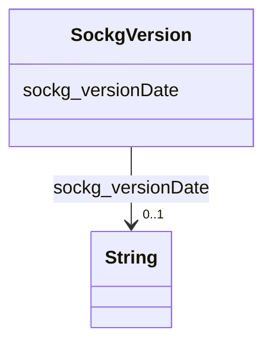

# Class: No class (entity type) name specified (sockg_Version)


_A Version represents a specific iteration or update of agricultural practices, research, or standards, reflecting changes over time in the field. It is essential for tracking advancements and ensuring that current methodologies are based on the latest information and developments in agriculture._


This class occurs 1 times.


URI: [sockg:Version](https://idir.uta.edu/sockg-ontology/docs/Version)





<!-- no inheritance hierarchy -->


## Slots

| Name | Cardinality and Range | Description | Inheritance | Occurrences |
| ---  | --- | --- | --- | --- |
| [sockg_versionDate](../slots/sockg_versionDate.md) | 0..1 <br/> [xsd:string](http://www.w3.org/2001/XMLSchema#string) | No slot (predicate) description specified <br/>  | direct | 1 |


## Usages

| used by | used in | type | used |
| ---  | --- | --- | --- |
| [SockgVersion](../classes/SockgVersion.md) | [sockg_versionDate](../slots/sockg_versionDate.md) | domain | [SockgVersion](../classes/SockgVersion.md) |


## LinkML Source

<!-- TODO: investigate https://stackoverflow.com/questions/37606292/how-to-create-tabbed-code-blocks-in-mkdocs-or-sphinx -->

### Direct

<details>

```yaml
name: sockg_Version
conforms_to: No schema conformance document specified
annotations:
  count:
    tag: count
    value: 1
description: A Version represents a specific iteration or update of agricultural practices,
  research, or standards, reflecting changes over time in the field. It is essential
  for tracking advancements and ensuring that current methodologies are based on the
  latest information and developments in agriculture.
title: No class (entity type) name specified
from_schema: soc-kg
rank: 1000
slots:
- sockg_versionDate
slot_usage:
  sockg_versionDate:
    name: sockg_versionDate
    annotations:
      string:
        tag: string
        value: 1
class_uri: sockg:Version

```
</details>

### Induced

<details>

```yaml
name: sockg_Version
conforms_to: No schema conformance document specified
annotations:
  count:
    tag: count
    value: 1
description: A Version represents a specific iteration or update of agricultural practices,
  research, or standards, reflecting changes over time in the field. It is essential
  for tracking advancements and ensuring that current methodologies are based on the
  latest information and developments in agriculture.
title: No class (entity type) name specified
from_schema: soc-kg
rank: 1000
slot_usage:
  sockg_versionDate:
    name: sockg_versionDate
    annotations:
      string:
        tag: string
        value: 1
attributes:
  sockg_versionDate:
    name: sockg_versionDate
    annotations:
      string:
        tag: string
        value: 1
    description: No slot (predicate) description specified
    title: No slot (predicate) name specified
    examples:
    - object:
        example_object: 04/17/2025
        example_object_type: string
        example_predicate: sockg:versionDate
        example_subject: sockg:individuals/364325
        example_subject_type: sockg_Version
    from_schema: soc-kg
    rank: 1000
    domain: sockg_Version
    slot_uri: sockg:versionDate
    alias: sockg_versionDate
    owner: sockg_Version
    domain_of:
    - sockg_Version
    range: string
class_uri: sockg:Version

```
</details>