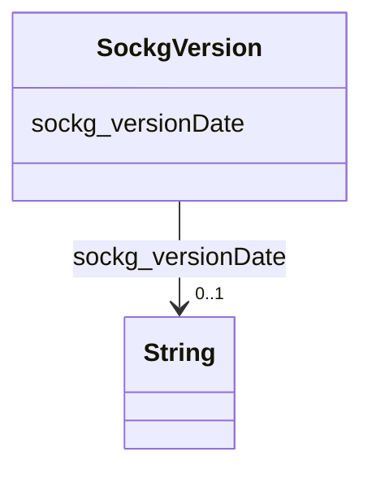

# Class: TODO -- what's a good name for what this class (type) describes? (sockg_Version)


_No type description provided_


URI: [sockg:Version](http://www.semanticweb.org/sockg/ontologies/2024/0/soil-carbon-ontology/Version)





<!-- no inheritance hierarchy -->


## Slots

| Name | Cardinality and Range | Description | Inheritance |
| ---  | --- | --- | --- |
| [sockg_versionDate](../slots/sockg_versionDate.md) | 0..1 <br/> [xsd:string](http://www.w3.org/2001/XMLSchema#string) | No slot description provided | direct |


## Examples

| Value |
| --- |
| neo4j://graph.individuals#359837 |

## TODOs

* TODO -- Todos for this class go here
* or you can delete the todos
* if you think the class is perfect.

## Identifier and Mapping Information


### Schema Source


* from schema: soc-kg/main


## Mappings

| Mapping Type | Mapped Value |
| ---  | ---  |
| self | sockg:Version |
| native | soc-kg/main/:SockgVersion |


## LinkML Source

<!-- TODO: investigate https://stackoverflow.com/questions/37606292/how-to-create-tabbed-code-blocks-in-mkdocs-or-sphinx -->

### Direct

<details>
```yaml
name: sockg_Version
description: No type description provided
title: TODO -- what's a good name for what this class (type) describes?
todos:
- TODO -- Todos for this class go here
- or you can delete the todos
- if you think the class is perfect.
notes:
- There are 1 instances of this class.
examples:
- value: neo4j://graph.individuals#359837
from_schema: soc-kg/main
rank: 1000
slots:
- sockg_versionDate
class_uri: sockg:Version

```
</details>

### Induced

<details>
```yaml
name: sockg_Version
description: No type description provided
title: TODO -- what's a good name for what this class (type) describes?
todos:
- TODO -- Todos for this class go here
- or you can delete the todos
- if you think the class is perfect.
notes:
- There are 1 instances of this class.
examples:
- value: neo4j://graph.individuals#359837
from_schema: soc-kg/main
rank: 1000
attributes:
  sockg_versionDate:
    name: sockg_versionDate
    description: No slot description provided
    todos:
    - TODO -- Todos for this slot go here
    - or you can delete the todos
    - if you think the class is perfect.
    comments:
    - 1 occurrences with subject type sockg:Version and object type string.
    examples:
    - value: neo4j://graph.individuals#359837 sockg:versionDate 10/08/2024
    from_schema: soc-kg/main
    rank: 1000
    slot_uri: sockg:versionDate
    alias: sockg_versionDate
    owner: sockg_Version
    domain_of:
    - sockg_Version
    range: string
class_uri: sockg:Version

```
</details>