# Class: TODO -- what's a good name for what this class (type) describes? (sockg_WaterQualityArea)


_No type description provided_


URI: [sockg:WaterQualityArea](http://www.semanticweb.org/sockg/ontologies/2024/0/soil-carbon-ontology/WaterQualityArea)

```mermaid
 classDiagram
    class SockgWaterQualityArea
    click SockgWaterQualityArea href "../SockgWaterQualityArea"
      SockgWaterQualityArea : sockg_crop
        
          
    
    
    SockgWaterQualityArea --> "0..1" Any : sockg_crop
    click Any href "../Any"

        
      SockgWaterQualityArea : sockg_date
        
          
    
    
    SockgWaterQualityArea --> "0..1" Any : sockg_date
    click Any href "../Any"

        
      SockgWaterQualityArea : sockg_dissolvedBoron_gB_ha
        
          
    
    
    SockgWaterQualityArea --> "0..1" Double : sockg_dissolvedBoron_gB_ha
    click Double href "../Double"

        
      SockgWaterQualityArea : sockg_dissolvedBoronStd_gB_ha
        
          
    
    
    SockgWaterQualityArea --> "0..1" Double : sockg_dissolvedBoronStd_gB_ha
    click Double href "../Double"

        
      SockgWaterQualityArea : sockg_dissolvedCalcium_kgCa_ha
        
          
    
    
    SockgWaterQualityArea --> "0..1" Double : sockg_dissolvedCalcium_kgCa_ha
    click Double href "../Double"

        
      SockgWaterQualityArea : sockg_dissolvedCalciumStd_kgCa_ha
        
          
    
    
    SockgWaterQualityArea --> "0..1" Double : sockg_dissolvedCalciumStd_kgCa_ha
    click Double href "../Double"

        
      SockgWaterQualityArea : sockg_dissolvedCopper_gCu_ha
        
          
    
    
    SockgWaterQualityArea --> "0..1" Double : sockg_dissolvedCopper_gCu_ha
    click Double href "../Double"

        
      SockgWaterQualityArea : sockg_dissolvedCopperStd_gCu_ha
        
          
    
    
    SockgWaterQualityArea --> "0..1" Double : sockg_dissolvedCopperStd_gCu_ha
    click Double href "../Double"

        
      SockgWaterQualityArea : sockg_dissolvedIron_gFe_ha
        
          
    
    
    SockgWaterQualityArea --> "0..1" Double : sockg_dissolvedIron_gFe_ha
    click Double href "../Double"

        
      SockgWaterQualityArea : sockg_dissolvedIronStd_gFe_ha
        
          
    
    
    SockgWaterQualityArea --> "0..1" Double : sockg_dissolvedIronStd_gFe_ha
    click Double href "../Double"

        
      SockgWaterQualityArea : sockg_dissolvedMagnesium_kgMg_ha
        
          
    
    
    SockgWaterQualityArea --> "0..1" Double : sockg_dissolvedMagnesium_kgMg_ha
    click Double href "../Double"

        
      SockgWaterQualityArea : sockg_dissolvedMagnesiumStd_kgMg_ha
        
          
    
    
    SockgWaterQualityArea --> "0..1" Double : sockg_dissolvedMagnesiumStd_kgMg_ha
    click Double href "../Double"

        
      SockgWaterQualityArea : sockg_dissolvedManganese_gMn_ha
        
          
    
    
    SockgWaterQualityArea --> "0..1" Double : sockg_dissolvedManganese_gMn_ha
    click Double href "../Double"

        
      SockgWaterQualityArea : sockg_dissolvedManganeseStd_gMn_ha
        
          
    
    
    SockgWaterQualityArea --> "0..1" Double : sockg_dissolvedManganeseStd_gMn_ha
    click Double href "../Double"

        
      SockgWaterQualityArea : sockg_dissolvedMolybdenum_gMo_ha
        
          
    
    
    SockgWaterQualityArea --> "0..1" Double : sockg_dissolvedMolybdenum_gMo_ha
    click Double href "../Double"

        
      SockgWaterQualityArea : sockg_dissolvedMolybdenumStd_gMo_ha
        
          
    
    
    SockgWaterQualityArea --> "0..1" Double : sockg_dissolvedMolybdenumStd_gMo_ha
    click Double href "../Double"

        
      SockgWaterQualityArea : sockg_dissolvedPotassium_kgK_ha
        
          
    
    
    SockgWaterQualityArea --> "0..1" Double : sockg_dissolvedPotassium_kgK_ha
    click Double href "../Double"

        
      SockgWaterQualityArea : sockg_dissolvedPotassiumStd_kgK_ha
        
          
    
    
    SockgWaterQualityArea --> "0..1" Double : sockg_dissolvedPotassiumStd_kgK_ha
    click Double href "../Double"

        
      SockgWaterQualityArea : sockg_dissolvedSilicon_kgSi_ha
        
          
    
    
    SockgWaterQualityArea --> "0..1" Double : sockg_dissolvedSilicon_kgSi_ha
    click Double href "../Double"

        
      SockgWaterQualityArea : sockg_dissolvedSodium_kgNa_ha
        
          
    
    
    SockgWaterQualityArea --> "0..1" Double : sockg_dissolvedSodium_kgNa_ha
    click Double href "../Double"

        
      SockgWaterQualityArea : sockg_dissolvedSulfur_kgS_ha
        
          
    
    
    SockgWaterQualityArea --> "0..1" Double : sockg_dissolvedSulfur_kgS_ha
    click Double href "../Double"

        
      SockgWaterQualityArea : sockg_dissolvedSulfurStd_kgS_ha
        
          
    
    
    SockgWaterQualityArea --> "0..1" Double : sockg_dissolvedSulfurStd_kgS_ha
    click Double href "../Double"

        
      SockgWaterQualityArea : sockg_dissolvedZinc_gZn_ha
        
          
    
    
    SockgWaterQualityArea --> "0..1" Double : sockg_dissolvedZinc_gZn_ha
    click Double href "../Double"

        
      SockgWaterQualityArea : sockg_dissolvedZincStd_gZn_ha
        
          
    
    
    SockgWaterQualityArea --> "0..1" Double : sockg_dissolvedZincStd_gZn_ha
    click Double href "../Double"

        
      SockgWaterQualityArea : sockg_dissovledSiliconStd_kgSi_ha
        
          
    
    
    SockgWaterQualityArea --> "0..1" Double : sockg_dissovledSiliconStd_kgSi_ha
    click Double href "../Double"

        
      SockgWaterQualityArea : sockg_dissovledSodiumStd_kgNa_ha
        
          
    
    
    SockgWaterQualityArea --> "0..1" Double : sockg_dissovledSodiumStd_kgNa_ha
    click Double href "../Double"

        
      SockgWaterQualityArea : sockg_electricalConductivity_ms_cm
        
          
    
    
    SockgWaterQualityArea --> "0..1" Double : sockg_electricalConductivity_ms_cm
    click Double href "../Double"

        
      SockgWaterQualityArea : sockg_electricalConductivityStd_ms_cm
        
          
    
    
    SockgWaterQualityArea --> "0..1" Double : sockg_electricalConductivityStd_ms_cm
    click Double href "../Double"

        
      SockgWaterQualityArea : sockg_erosionMethod
        
          
    
    
    SockgWaterQualityArea --> "0..1" Double : sockg_erosionMethod
    click Double href "../Double"

        
      SockgWaterQualityArea : sockg_erosionSediment_t_ha
        
          
    
    
    SockgWaterQualityArea --> "0..1" Double : sockg_erosionSediment_t_ha
    click Double href "../Double"

        
      SockgWaterQualityArea : sockg_erosionSedimentStd_t_ha
        
          
    
    
    SockgWaterQualityArea --> "0..1" Double : sockg_erosionSedimentStd_t_ha
    click Double href "../Double"

        
      SockgWaterQualityArea : sockg_erosionTotalSolids_t_ha
        
          
    
    
    SockgWaterQualityArea --> "0..1" Double : sockg_erosionTotalSolids_t_ha
    click Double href "../Double"

        
      SockgWaterQualityArea : sockg_erosionTotalSolidsStd_t_ha
        
          
    
    
    SockgWaterQualityArea --> "0..1" Double : sockg_erosionTotalSolidsStd_t_ha
    click Double href "../Double"

        
      SockgWaterQualityArea : sockg_erosionTotalSuspendedSolids_t_ha
        
          
    
    
    SockgWaterQualityArea --> "0..1" Double : sockg_erosionTotalSuspendedSolids_t_ha
    click Double href "../Double"

        
      SockgWaterQualityArea : sockg_erosionTotalSuspendedSolidsStd_t_ha
        
          
    
    
    SockgWaterQualityArea --> "0..1" Double : sockg_erosionTotalSuspendedSolidsStd_t_ha
    click Double href "../Double"

        
      SockgWaterQualityArea : sockg_expUnitId
        
          
    
    
    SockgWaterQualityArea --> "0..1" String : sockg_expUnitId
    click String href "../String"

        
      SockgWaterQualityArea : sockg_fieldId
        
          
    
    
    SockgWaterQualityArea --> "0..1" String : sockg_fieldId
    click String href "../String"

        
      SockgWaterQualityArea : sockg_growthStage
        
          
    
    
    SockgWaterQualityArea --> "0..1" Any : sockg_growthStage
    click Any href "../Any"

        
      SockgWaterQualityArea : sockg_hasWaterQualityAreaData
        
          
    
    
    SockgWaterQualityArea --> "0..1" SockgExperimentalUnit : sockg_hasWaterQualityAreaData
    click SockgExperimentalUnit href "../SockgExperimentalUnit"

        
      SockgWaterQualityArea : sockg_inorganicNitrogenStd_kgN_ha
        
          
    
    
    SockgWaterQualityArea --> "0..1" Double : sockg_inorganicNitrogenStd_kgN_ha
    click Double href "../Double"

        
      SockgWaterQualityArea : sockg_lossesOrDeposition
        
          
    
    
    SockgWaterQualityArea --> "0..1" Any : sockg_lossesOrDeposition
    click Any href "../Any"

        
      SockgWaterQualityArea : sockg_measWaterQualityArea_UID
        
          
    
    
    SockgWaterQualityArea --> "0..1" String : sockg_measWaterQualityArea_UID
    click String href "../String"

        
      SockgWaterQualityArea : sockg_modelIfSimulated
        
          
    
    
    SockgWaterQualityArea --> "0..1" Any : sockg_modelIfSimulated
    click Any href "../Any"

        
      SockgWaterQualityArea : sockg_nitrateNitrogen_kg_ha
        
          
    
    
    SockgWaterQualityArea --> "0..1" Double : sockg_nitrateNitrogen_kg_ha
    click Double href "../Double"

        
      SockgWaterQualityArea : sockg_nitrateStd_kgN_ha
        
          
    
    
    SockgWaterQualityArea --> "0..1" Double : sockg_nitrateStd_kgN_ha
    click Double href "../Double"

        
      SockgWaterQualityArea : sockg_ph
        
          
    
    
    SockgWaterQualityArea --> "0..1" Double : sockg_ph
    click Double href "../Double"

        
      SockgWaterQualityArea : sockg_phStd
        
          
    
    
    SockgWaterQualityArea --> "0..1" Double : sockg_phStd
    click Double href "../Double"

        
      SockgWaterQualityArea : sockg_samplingStartStopInterval
        
          
    
    
    SockgWaterQualityArea --> "0..1" Any : sockg_samplingStartStopInterval
    click Any href "../Any"

        
      SockgWaterQualityArea : sockg_soilOrganicCarbon_kgC_ha
        
          
    
    
    SockgWaterQualityArea --> "0..1" Double : sockg_soilOrganicCarbon_kgC_ha
    click Double href "../Double"

        
      SockgWaterQualityArea : sockg_soilOrganicCarbonStd_kgC_ha
        
          
    
    
    SockgWaterQualityArea --> "0..1" Double : sockg_soilOrganicCarbonStd_kgC_ha
    click Double href "../Double"

        
      SockgWaterQualityArea : sockg_surfaceOrLeaching
        
          
    
    
    SockgWaterQualityArea --> "0..1" String : sockg_surfaceOrLeaching
    click String href "../String"

        
      SockgWaterQualityArea : sockg_time
        
          
    
    
    SockgWaterQualityArea --> "0..1" Any : sockg_time
    click Any href "../Any"

        
      SockgWaterQualityArea : sockg_totalChloride_kg_ha
        
          
    
    
    SockgWaterQualityArea --> "0..1" Double : sockg_totalChloride_kg_ha
    click Double href "../Double"

        
      SockgWaterQualityArea : sockg_totalDissolvedNitrogen_kgN_ha
        
          
    
    
    SockgWaterQualityArea --> "0..1" Double : sockg_totalDissolvedNitrogen_kgN_ha
    click Double href "../Double"

        
      SockgWaterQualityArea : sockg_totalDissolvedNitrogenStd_kgN_ha
        
          
    
    
    SockgWaterQualityArea --> "0..1" Double : sockg_totalDissolvedNitrogenStd_kgN_ha
    click Double href "../Double"

        
      SockgWaterQualityArea : sockg_totalDissolvedPhosphorus_kgP_ha
        
          
    
    
    SockgWaterQualityArea --> "0..1" Double : sockg_totalDissolvedPhosphorus_kgP_ha
    click Double href "../Double"

        
      SockgWaterQualityArea : sockg_totalDissolvedPhosphorusStd_jgP_ha
        
          
    
    
    SockgWaterQualityArea --> "0..1" Double : sockg_totalDissolvedPhosphorusStd_jgP_ha
    click Double href "../Double"

        
      SockgWaterQualityArea : sockg_totalNitrogenStd_kgN_ha
        
          
    
    
    SockgWaterQualityArea --> "0..1" Double : sockg_totalNitrogenStd_kgN_ha
    click Double href "../Double"

        
      SockgWaterQualityArea : sockg_totalPhosphorusStd_kgP_ha
        
          
    
    
    SockgWaterQualityArea --> "0..1" Double : sockg_totalPhosphorusStd_kgP_ha
    click Double href "../Double"

        
      SockgWaterQualityArea : sockg_treatmentId
        
          
    
    
    SockgWaterQualityArea --> "0..1" String : sockg_treatmentId
    click String href "../String"

        
      SockgWaterQualityArea : sockg_waterQualityAreaDataAt
        
          
    
    
    SockgWaterQualityArea --> "0..1" SockgField : sockg_waterQualityAreaDataAt
    click SockgField href "../SockgField"

        
      SockgWaterQualityArea : sockg_waterQualityAreaTreatment
        
          
    
    
    SockgWaterQualityArea --> "0..1" SockgTreatment : sockg_waterQualityAreaTreatment
    click SockgTreatment href "../SockgTreatment"

        
      SockgWaterQualityArea : sockg_waterStd_mm
        
          
    
    
    SockgWaterQualityArea --> "0..1" Double : sockg_waterStd_mm
    click Double href "../Double"

        
      
```





<!-- no inheritance hierarchy -->


## Slots

| Name | Cardinality and Range | Description | Inheritance |
| ---  | --- | --- | --- |
| [sockg_hasWaterQualityAreaData](../slots/sockg_hasWaterQualityAreaData.md) | 0..1 <br/> [SockgExperimentalUnit](../classes/SockgExperimentalUnit.md) | No slot description provided | direct |
| [sockg_waterQualityAreaDataAt](../slots/sockg_waterQualityAreaDataAt.md) | 0..1 <br/> [SockgField](../classes/SockgField.md) | No slot description provided | direct |
| [sockg_waterQualityAreaTreatment](../slots/sockg_waterQualityAreaTreatment.md) | 0..1 <br/> [SockgTreatment](../classes/SockgTreatment.md) | No slot description provided | direct |
| [sockg_soilOrganicCarbon_kgC_ha](../slots/sockg_soilOrganicCarbon_kgC_ha.md) | 0..1 <br/> [xsd:double](http://www.w3.org/2001/XMLSchema#double) | No slot description provided | direct |
| [sockg_dissolvedManganese_gMn_ha](../slots/sockg_dissolvedManganese_gMn_ha.md) | 0..1 <br/> [xsd:double](http://www.w3.org/2001/XMLSchema#double) | No slot description provided | direct |
| [sockg_erosionSedimentStd_t_ha](../slots/sockg_erosionSedimentStd_t_ha.md) | 0..1 <br/> [xsd:double](http://www.w3.org/2001/XMLSchema#double) | No slot description provided | direct |
| [sockg_dissolvedBoron_gB_ha](../slots/sockg_dissolvedBoron_gB_ha.md) | 0..1 <br/> [xsd:double](http://www.w3.org/2001/XMLSchema#double) | No slot description provided | direct |
| [sockg_ph](../slots/sockg_ph.md) | 0..1 <br/> [xsd:double](http://www.w3.org/2001/XMLSchema#double) | No slot description provided | direct |
| [sockg_totalChloride_kg_ha](../slots/sockg_totalChloride_kg_ha.md) | 0..1 <br/> [xsd:double](http://www.w3.org/2001/XMLSchema#double) | No slot description provided | direct |
| [sockg_dissolvedMagnesium_kgMg_ha](../slots/sockg_dissolvedMagnesium_kgMg_ha.md) | 0..1 <br/> [xsd:double](http://www.w3.org/2001/XMLSchema#double) | No slot description provided | direct |
| [sockg_dissolvedPotassiumStd_kgK_ha](../slots/sockg_dissolvedPotassiumStd_kgK_ha.md) | 0..1 <br/> [xsd:double](http://www.w3.org/2001/XMLSchema#double) | No slot description provided | direct |
| [sockg_treatmentId](../slots/sockg_treatmentId.md) | 0..1 <br/> [xsd:string](http://www.w3.org/2001/XMLSchema#string) | No slot description provided | direct |
| [sockg_dissolvedPotassium_kgK_ha](../slots/sockg_dissolvedPotassium_kgK_ha.md) | 0..1 <br/> [xsd:double](http://www.w3.org/2001/XMLSchema#double) | No slot description provided | direct |
| [sockg_dissolvedSodium_kgNa_ha](../slots/sockg_dissolvedSodium_kgNa_ha.md) | 0..1 <br/> [xsd:double](http://www.w3.org/2001/XMLSchema#double) | No slot description provided | direct |
| [sockg_soilOrganicCarbonStd_kgC_ha](../slots/sockg_soilOrganicCarbonStd_kgC_ha.md) | 0..1 <br/> [xsd:double](http://www.w3.org/2001/XMLSchema#double) | No slot description provided | direct |
| [sockg_dissolvedCalciumStd_kgCa_ha](../slots/sockg_dissolvedCalciumStd_kgCa_ha.md) | 0..1 <br/> [xsd:double](http://www.w3.org/2001/XMLSchema#double) | No slot description provided | direct |
| [sockg_totalDissolvedNitrogen_kgN_ha](../slots/sockg_totalDissolvedNitrogen_kgN_ha.md) | 0..1 <br/> [xsd:double](http://www.w3.org/2001/XMLSchema#double) | No slot description provided | direct |
| [sockg_dissovledSiliconStd_kgSi_ha](../slots/sockg_dissovledSiliconStd_kgSi_ha.md) | 0..1 <br/> [xsd:double](http://www.w3.org/2001/XMLSchema#double) | No slot description provided | direct |
| [sockg_measWaterQualityArea_UID](../slots/sockg_measWaterQualityArea_UID.md) | 0..1 <br/> [xsd:string](http://www.w3.org/2001/XMLSchema#string) | No slot description provided | direct |
| [sockg_nitrateNitrogen_kg_ha](../slots/sockg_nitrateNitrogen_kg_ha.md) | 0..1 <br/> [xsd:double](http://www.w3.org/2001/XMLSchema#double) | No slot description provided | direct |
| [sockg_nitrateStd_kgN_ha](../slots/sockg_nitrateStd_kgN_ha.md) | 0..1 <br/> [xsd:double](http://www.w3.org/2001/XMLSchema#double) | No slot description provided | direct |
| [sockg_modelIfSimulated](../slots/sockg_modelIfSimulated.md) | 0..1 <br/> [xsd:double](http://www.w3.org/2001/XMLSchema#double)&nbsp;or&nbsp;<br />[xsd:string](http://www.w3.org/2001/XMLSchema#string) | No slot description provided | direct |
| [sockg_totalDissolvedNitrogenStd_kgN_ha](../slots/sockg_totalDissolvedNitrogenStd_kgN_ha.md) | 0..1 <br/> [xsd:double](http://www.w3.org/2001/XMLSchema#double) | No slot description provided | direct |
| [sockg_erosionSediment_t_ha](../slots/sockg_erosionSediment_t_ha.md) | 0..1 <br/> [xsd:double](http://www.w3.org/2001/XMLSchema#double) | No slot description provided | direct |
| [sockg_dissolvedSulfur_kgS_ha](../slots/sockg_dissolvedSulfur_kgS_ha.md) | 0..1 <br/> [xsd:double](http://www.w3.org/2001/XMLSchema#double) | No slot description provided | direct |
| [sockg_expUnitId](../slots/sockg_expUnitId.md) | 0..1 <br/> [xsd:string](http://www.w3.org/2001/XMLSchema#string) | No slot description provided | direct |
| [sockg_totalDissolvedPhosphorus_kgP_ha](../slots/sockg_totalDissolvedPhosphorus_kgP_ha.md) | 0..1 <br/> [xsd:double](http://www.w3.org/2001/XMLSchema#double) | No slot description provided | direct |
| [sockg_waterStd_mm](../slots/sockg_waterStd_mm.md) | 0..1 <br/> [xsd:double](http://www.w3.org/2001/XMLSchema#double) | No slot description provided | direct |
| [sockg_crop](../slots/sockg_crop.md) | 0..1 <br/> [xsd:string](http://www.w3.org/2001/XMLSchema#string)&nbsp;or&nbsp;<br />[xsd:double](http://www.w3.org/2001/XMLSchema#double) | No slot description provided | direct |
| [sockg_erosionTotalSolidsStd_t_ha](../slots/sockg_erosionTotalSolidsStd_t_ha.md) | 0..1 <br/> [xsd:double](http://www.w3.org/2001/XMLSchema#double) | No slot description provided | direct |
| [sockg_totalPhosphorusStd_kgP_ha](../slots/sockg_totalPhosphorusStd_kgP_ha.md) | 0..1 <br/> [xsd:double](http://www.w3.org/2001/XMLSchema#double) | No slot description provided | direct |
| [sockg_fieldId](../slots/sockg_fieldId.md) | 0..1 <br/> [xsd:string](http://www.w3.org/2001/XMLSchema#string) | No slot description provided | direct |
| [sockg_dissolvedCopperStd_gCu_ha](../slots/sockg_dissolvedCopperStd_gCu_ha.md) | 0..1 <br/> [xsd:double](http://www.w3.org/2001/XMLSchema#double) | No slot description provided | direct |
| [sockg_dissolvedCalcium_kgCa_ha](../slots/sockg_dissolvedCalcium_kgCa_ha.md) | 0..1 <br/> [xsd:double](http://www.w3.org/2001/XMLSchema#double) | No slot description provided | direct |
| [sockg_surfaceOrLeaching](../slots/sockg_surfaceOrLeaching.md) | 0..1 <br/> [xsd:string](http://www.w3.org/2001/XMLSchema#string) | No slot description provided | direct |
| [sockg_erosionTotalSuspendedSolids_t_ha](../slots/sockg_erosionTotalSuspendedSolids_t_ha.md) | 0..1 <br/> [xsd:double](http://www.w3.org/2001/XMLSchema#double) | No slot description provided | direct |
| [sockg_samplingStartStopInterval](../slots/sockg_samplingStartStopInterval.md) | 0..1 <br/> [xsd:double](http://www.w3.org/2001/XMLSchema#double)&nbsp;or&nbsp;<br />[xsd:string](http://www.w3.org/2001/XMLSchema#string) | No slot description provided | direct |
| [sockg_dissolvedZinc_gZn_ha](../slots/sockg_dissolvedZinc_gZn_ha.md) | 0..1 <br/> [xsd:double](http://www.w3.org/2001/XMLSchema#double) | No slot description provided | direct |
| [sockg_electricalConductivity_ms_cm](../slots/sockg_electricalConductivity_ms_cm.md) | 0..1 <br/> [xsd:double](http://www.w3.org/2001/XMLSchema#double) | No slot description provided | direct |
| [sockg_erosionMethod](../slots/sockg_erosionMethod.md) | 0..1 <br/> [xsd:double](http://www.w3.org/2001/XMLSchema#double) | No slot description provided | direct |
| [sockg_dissolvedManganeseStd_gMn_ha](../slots/sockg_dissolvedManganeseStd_gMn_ha.md) | 0..1 <br/> [xsd:double](http://www.w3.org/2001/XMLSchema#double) | No slot description provided | direct |
| [sockg_dissolvedIronStd_gFe_ha](../slots/sockg_dissolvedIronStd_gFe_ha.md) | 0..1 <br/> [xsd:double](http://www.w3.org/2001/XMLSchema#double) | No slot description provided | direct |
| [sockg_dissolvedCopper_gCu_ha](../slots/sockg_dissolvedCopper_gCu_ha.md) | 0..1 <br/> [xsd:double](http://www.w3.org/2001/XMLSchema#double) | No slot description provided | direct |
| [sockg_dissolvedIron_gFe_ha](../slots/sockg_dissolvedIron_gFe_ha.md) | 0..1 <br/> [xsd:double](http://www.w3.org/2001/XMLSchema#double) | No slot description provided | direct |
| [sockg_dissolvedSulfurStd_kgS_ha](../slots/sockg_dissolvedSulfurStd_kgS_ha.md) | 0..1 <br/> [xsd:double](http://www.w3.org/2001/XMLSchema#double) | No slot description provided | direct |
| [sockg_dissolvedSilicon_kgSi_ha](../slots/sockg_dissolvedSilicon_kgSi_ha.md) | 0..1 <br/> [xsd:double](http://www.w3.org/2001/XMLSchema#double) | No slot description provided | direct |
| [sockg_phStd](../slots/sockg_phStd.md) | 0..1 <br/> [xsd:double](http://www.w3.org/2001/XMLSchema#double) | No slot description provided | direct |
| [sockg_totalDissolvedPhosphorusStd_jgP_ha](../slots/sockg_totalDissolvedPhosphorusStd_jgP_ha.md) | 0..1 <br/> [xsd:double](http://www.w3.org/2001/XMLSchema#double) | No slot description provided | direct |
| [sockg_dissovledSodiumStd_kgNa_ha](../slots/sockg_dissovledSodiumStd_kgNa_ha.md) | 0..1 <br/> [xsd:double](http://www.w3.org/2001/XMLSchema#double) | No slot description provided | direct |
| [sockg_dissolvedMagnesiumStd_kgMg_ha](../slots/sockg_dissolvedMagnesiumStd_kgMg_ha.md) | 0..1 <br/> [xsd:double](http://www.w3.org/2001/XMLSchema#double) | No slot description provided | direct |
| [sockg_totalNitrogenStd_kgN_ha](../slots/sockg_totalNitrogenStd_kgN_ha.md) | 0..1 <br/> [xsd:double](http://www.w3.org/2001/XMLSchema#double) | No slot description provided | direct |
| [sockg_time](../slots/sockg_time.md) | 0..1 <br/> [xsd:double](http://www.w3.org/2001/XMLSchema#double)&nbsp;or&nbsp;<br />[xsd:string](http://www.w3.org/2001/XMLSchema#string) | No slot description provided | direct |
| [sockg_dissolvedMolybdenum_gMo_ha](../slots/sockg_dissolvedMolybdenum_gMo_ha.md) | 0..1 <br/> [xsd:double](http://www.w3.org/2001/XMLSchema#double) | No slot description provided | direct |
| [sockg_growthStage](../slots/sockg_growthStage.md) | 0..1 <br/> [xsd:string](http://www.w3.org/2001/XMLSchema#string)&nbsp;or&nbsp;<br />[xsd:double](http://www.w3.org/2001/XMLSchema#double) | No slot description provided | direct |
| [sockg_erosionTotalSuspendedSolidsStd_t_ha](../slots/sockg_erosionTotalSuspendedSolidsStd_t_ha.md) | 0..1 <br/> [xsd:double](http://www.w3.org/2001/XMLSchema#double) | No slot description provided | direct |
| [sockg_lossesOrDeposition](../slots/sockg_lossesOrDeposition.md) | 0..1 <br/> [xsd:double](http://www.w3.org/2001/XMLSchema#double)&nbsp;or&nbsp;<br />[xsd:string](http://www.w3.org/2001/XMLSchema#string) | No slot description provided | direct |
| [sockg_dissolvedZincStd_gZn_ha](../slots/sockg_dissolvedZincStd_gZn_ha.md) | 0..1 <br/> [xsd:double](http://www.w3.org/2001/XMLSchema#double) | No slot description provided | direct |
| [sockg_electricalConductivityStd_ms_cm](../slots/sockg_electricalConductivityStd_ms_cm.md) | 0..1 <br/> [xsd:double](http://www.w3.org/2001/XMLSchema#double) | No slot description provided | direct |
| [sockg_dissolvedBoronStd_gB_ha](../slots/sockg_dissolvedBoronStd_gB_ha.md) | 0..1 <br/> [xsd:double](http://www.w3.org/2001/XMLSchema#double) | No slot description provided | direct |
| [sockg_inorganicNitrogenStd_kgN_ha](../slots/sockg_inorganicNitrogenStd_kgN_ha.md) | 0..1 <br/> [xsd:double](http://www.w3.org/2001/XMLSchema#double) | No slot description provided | direct |
| [sockg_dissolvedMolybdenumStd_gMo_ha](../slots/sockg_dissolvedMolybdenumStd_gMo_ha.md) | 0..1 <br/> [xsd:double](http://www.w3.org/2001/XMLSchema#double) | No slot description provided | direct |
| [sockg_date](../slots/sockg_date.md) | 0..1 <br/> [xsd:string](http://www.w3.org/2001/XMLSchema#string)&nbsp;or&nbsp;<br />[xsd:double](http://www.w3.org/2001/XMLSchema#double) | No slot description provided | direct |
| [sockg_erosionTotalSolids_t_ha](../slots/sockg_erosionTotalSolids_t_ha.md) | 0..1 <br/> [xsd:double](http://www.w3.org/2001/XMLSchema#double) | No slot description provided | direct |


## Examples

| Value |
| --- |
| neo4j://graph.individuals#360503 |

## TODOs

* TODO -- Todos for this class go here
* or you can delete the todos
* if you think the class is perfect.

## Identifier and Mapping Information


### Schema Source


* from schema: soc-kg/main


## Mappings

| Mapping Type | Mapped Value |
| ---  | ---  |
| self | sockg:WaterQualityArea |
| native | soc-kg/main/:SockgWaterQualityArea |


## LinkML Source

<!-- TODO: investigate https://stackoverflow.com/questions/37606292/how-to-create-tabbed-code-blocks-in-mkdocs-or-sphinx -->

### Direct

<details>
```yaml
name: sockg_WaterQualityArea
description: No type description provided
title: TODO -- what's a good name for what this class (type) describes?
todos:
- TODO -- Todos for this class go here
- or you can delete the todos
- if you think the class is perfect.
notes:
- There are 667 instances of this class.
examples:
- value: neo4j://graph.individuals#360503
from_schema: soc-kg/main
rank: 1000
slots:
- sockg_hasWaterQualityAreaData
- sockg_waterQualityAreaDataAt
- sockg_waterQualityAreaTreatment
- sockg_soilOrganicCarbon_kgC_ha
- sockg_dissolvedManganese_gMn_ha
- sockg_erosionSedimentStd_t_ha
- sockg_dissolvedBoron_gB_ha
- sockg_ph
- sockg_totalChloride_kg_ha
- sockg_dissolvedMagnesium_kgMg_ha
- sockg_dissolvedPotassiumStd_kgK_ha
- sockg_treatmentId
- sockg_dissolvedPotassium_kgK_ha
- sockg_dissolvedSodium_kgNa_ha
- sockg_soilOrganicCarbonStd_kgC_ha
- sockg_dissolvedCalciumStd_kgCa_ha
- sockg_totalDissolvedNitrogen_kgN_ha
- sockg_dissovledSiliconStd_kgSi_ha
- sockg_measWaterQualityArea_UID
- sockg_nitrateNitrogen_kg_ha
- sockg_nitrateStd_kgN_ha
- sockg_modelIfSimulated
- sockg_totalDissolvedNitrogenStd_kgN_ha
- sockg_erosionSediment_t_ha
- sockg_dissolvedSulfur_kgS_ha
- sockg_expUnitId
- sockg_totalDissolvedPhosphorus_kgP_ha
- sockg_waterStd_mm
- sockg_crop
- sockg_erosionTotalSolidsStd_t_ha
- sockg_totalPhosphorusStd_kgP_ha
- sockg_fieldId
- sockg_dissolvedCopperStd_gCu_ha
- sockg_dissolvedCalcium_kgCa_ha
- sockg_surfaceOrLeaching
- sockg_erosionTotalSuspendedSolids_t_ha
- sockg_samplingStartStopInterval
- sockg_dissolvedZinc_gZn_ha
- sockg_electricalConductivity_ms_cm
- sockg_erosionMethod
- sockg_dissolvedManganeseStd_gMn_ha
- sockg_dissolvedIronStd_gFe_ha
- sockg_dissolvedCopper_gCu_ha
- sockg_dissolvedIron_gFe_ha
- sockg_dissolvedSulfurStd_kgS_ha
- sockg_dissolvedSilicon_kgSi_ha
- sockg_phStd
- sockg_totalDissolvedPhosphorusStd_jgP_ha
- sockg_dissovledSodiumStd_kgNa_ha
- sockg_dissolvedMagnesiumStd_kgMg_ha
- sockg_totalNitrogenStd_kgN_ha
- sockg_time
- sockg_dissolvedMolybdenum_gMo_ha
- sockg_growthStage
- sockg_erosionTotalSuspendedSolidsStd_t_ha
- sockg_lossesOrDeposition
- sockg_dissolvedZincStd_gZn_ha
- sockg_electricalConductivityStd_ms_cm
- sockg_dissolvedBoronStd_gB_ha
- sockg_inorganicNitrogenStd_kgN_ha
- sockg_dissolvedMolybdenumStd_gMo_ha
- sockg_date
- sockg_erosionTotalSolids_t_ha
class_uri: sockg:WaterQualityArea

```
</details>

### Induced

<details>
```yaml
name: sockg_WaterQualityArea
description: No type description provided
title: TODO -- what's a good name for what this class (type) describes?
todos:
- TODO -- Todos for this class go here
- or you can delete the todos
- if you think the class is perfect.
notes:
- There are 667 instances of this class.
examples:
- value: neo4j://graph.individuals#360503
from_schema: soc-kg/main
rank: 1000
attributes:
  sockg_hasWaterQualityAreaData:
    name: sockg_hasWaterQualityAreaData
    description: No slot description provided
    todos:
    - TODO -- Todos for this slot go here
    - or you can delete the todos
    - if you think the class is perfect.
    comments:
    - 667 occurrences with subject type sockg:WaterQualityArea and object type sockg:ExperimentalUnit.
    examples:
    - value: neo4j://graph.individuals#360375 sockg:hasWaterQualityAreaData neo4j://graph.individuals#55113
    from_schema: soc-kg/main
    rank: 1000
    slot_uri: sockg:hasWaterQualityAreaData
    alias: sockg_hasWaterQualityAreaData
    owner: sockg_WaterQualityArea
    domain_of:
    - sockg_WaterQualityArea
    range: sockg_ExperimentalUnit
  sockg_waterQualityAreaDataAt:
    name: sockg_waterQualityAreaDataAt
    description: No slot description provided
    todos:
    - TODO -- Todos for this slot go here
    - or you can delete the todos
    - if you think the class is perfect.
    comments:
    - 667 occurrences with subject type sockg:WaterQualityArea and object type sockg:Field.
    examples:
    - value: neo4j://graph.individuals#360495 sockg:waterQualityAreaDataAt neo4j://graph.individuals#55596
    from_schema: soc-kg/main
    rank: 1000
    slot_uri: sockg:waterQualityAreaDataAt
    alias: sockg_waterQualityAreaDataAt
    owner: sockg_WaterQualityArea
    domain_of:
    - sockg_WaterQualityArea
    range: sockg_Field
  sockg_waterQualityAreaTreatment:
    name: sockg_waterQualityAreaTreatment
    description: No slot description provided
    todos:
    - TODO -- Todos for this slot go here
    - or you can delete the todos
    - if you think the class is perfect.
    comments:
    - 667 occurrences with subject type sockg:WaterQualityArea and object type sockg:Treatment.
    examples:
    - value: neo4j://graph.individuals#360504 sockg:waterQualityAreaTreatment neo4j://graph.individuals#359736
    from_schema: soc-kg/main
    rank: 1000
    slot_uri: sockg:waterQualityAreaTreatment
    alias: sockg_waterQualityAreaTreatment
    owner: sockg_WaterQualityArea
    domain_of:
    - sockg_WaterQualityArea
    range: sockg_Treatment
  sockg_soilOrganicCarbon_kgC_ha:
    name: sockg_soilOrganicCarbon_kgC_ha
    description: No slot description provided
    todos:
    - TODO -- Todos for this slot go here
    - or you can delete the todos
    - if you think the class is perfect.
    comments:
    - 667 occurrences with subject type sockg:WaterQualityArea and object type xsd:double.
    examples:
    - value: neo4j://graph.individuals#360081 sockg:soilOrganicCarbon_kgC_ha nan
    from_schema: soc-kg/main
    rank: 1000
    slot_uri: sockg:soilOrganicCarbon_kgC_ha
    alias: sockg_soilOrganicCarbon_kgC_ha
    owner: sockg_WaterQualityArea
    domain_of:
    - sockg_WaterQualityArea
    range: double
  sockg_dissolvedManganese_gMn_ha:
    name: sockg_dissolvedManganese_gMn_ha
    description: No slot description provided
    todos:
    - TODO -- Todos for this slot go here
    - or you can delete the todos
    - if you think the class is perfect.
    comments:
    - 667 occurrences with subject type sockg:WaterQualityArea and object type xsd:double.
    examples:
    - value: neo4j://graph.individuals#360176 sockg:dissolvedManganese_gMn_ha nan
    from_schema: soc-kg/main
    rank: 1000
    slot_uri: sockg:dissolvedManganese_gMn_ha
    alias: sockg_dissolvedManganese_gMn_ha
    owner: sockg_WaterQualityArea
    domain_of:
    - sockg_WaterQualityArea
    range: double
  sockg_erosionSedimentStd_t_ha:
    name: sockg_erosionSedimentStd_t_ha
    description: No slot description provided
    todos:
    - TODO -- Todos for this slot go here
    - or you can delete the todos
    - if you think the class is perfect.
    comments:
    - 667 occurrences with subject type sockg:WaterQualityArea and object type xsd:double.
    examples:
    - value: neo4j://graph.individuals#360206 sockg:erosionSedimentStd_t_ha nan
    from_schema: soc-kg/main
    rank: 1000
    slot_uri: sockg:erosionSedimentStd_t_ha
    alias: sockg_erosionSedimentStd_t_ha
    owner: sockg_WaterQualityArea
    domain_of:
    - sockg_WaterQualityArea
    range: double
  sockg_dissolvedBoron_gB_ha:
    name: sockg_dissolvedBoron_gB_ha
    description: No slot description provided
    todos:
    - TODO -- Todos for this slot go here
    - or you can delete the todos
    - if you think the class is perfect.
    comments:
    - 667 occurrences with subject type sockg:WaterQualityArea and object type xsd:double.
    examples:
    - value: neo4j://graph.individuals#359908 sockg:dissolvedBoron_gB_ha nan
    from_schema: soc-kg/main
    rank: 1000
    slot_uri: sockg:dissolvedBoron_gB_ha
    alias: sockg_dissolvedBoron_gB_ha
    owner: sockg_WaterQualityArea
    domain_of:
    - sockg_WaterQualityArea
    range: double
  sockg_ph:
    name: sockg_ph
    description: No slot description provided
    todos:
    - TODO -- Todos for this slot go here
    - or you can delete the todos
    - if you think the class is perfect.
    comments:
    - 53833 occurrences with subject type sockg:SoilChemicalSample and object type
      xsd:double.
    - 667 occurrences with subject type sockg:WaterQualityArea and object type xsd:double.
    - 1479 occurrences with subject type sockg:WaterQualityConc and object type xsd:double.
    - 15 occurrences with subject type sockg:WindErosionArea and object type xsd:double.
    examples:
    - value: neo4j://graph.individuals#272323 sockg:ph nan
    - value: neo4j://graph.individuals#360143 sockg:ph nan
    - value: neo4j://graph.individuals#360790 sockg:ph nan
    - value: neo4j://graph.individuals#509304 sockg:ph nan
    from_schema: soc-kg/main
    rank: 1000
    slot_uri: sockg:ph
    alias: sockg_ph
    owner: sockg_WaterQualityArea
    domain_of:
    - sockg_SoilChemicalSample
    - sockg_WaterQualityArea
    - sockg_WaterQualityConc
    - sockg_WindErosionArea
    range: double
  sockg_totalChloride_kg_ha:
    name: sockg_totalChloride_kg_ha
    description: No slot description provided
    todos:
    - TODO -- Todos for this slot go here
    - or you can delete the todos
    - if you think the class is perfect.
    comments:
    - 667 occurrences with subject type sockg:WaterQualityArea and object type xsd:double.
    examples:
    - value: neo4j://graph.individuals#360210 sockg:totalChloride_kg_ha nan
    from_schema: soc-kg/main
    rank: 1000
    slot_uri: sockg:totalChloride_kg_ha
    alias: sockg_totalChloride_kg_ha
    owner: sockg_WaterQualityArea
    domain_of:
    - sockg_WaterQualityArea
    range: double
  sockg_dissolvedMagnesium_kgMg_ha:
    name: sockg_dissolvedMagnesium_kgMg_ha
    description: No slot description provided
    todos:
    - TODO -- Todos for this slot go here
    - or you can delete the todos
    - if you think the class is perfect.
    comments:
    - 667 occurrences with subject type sockg:WaterQualityArea and object type xsd:double.
    examples:
    - value: neo4j://graph.individuals#360226 sockg:dissolvedMagnesium_kgMg_ha nan
    from_schema: soc-kg/main
    rank: 1000
    slot_uri: sockg:dissolvedMagnesium_kgMg_ha
    alias: sockg_dissolvedMagnesium_kgMg_ha
    owner: sockg_WaterQualityArea
    domain_of:
    - sockg_WaterQualityArea
    range: double
  sockg_dissolvedPotassiumStd_kgK_ha:
    name: sockg_dissolvedPotassiumStd_kgK_ha
    description: No slot description provided
    todos:
    - TODO -- Todos for this slot go here
    - or you can delete the todos
    - if you think the class is perfect.
    comments:
    - 667 occurrences with subject type sockg:WaterQualityArea and object type xsd:double.
    examples:
    - value: neo4j://graph.individuals#360287 sockg:dissolvedPotassiumStd_kgK_ha nan
    from_schema: soc-kg/main
    rank: 1000
    slot_uri: sockg:dissolvedPotassiumStd_kgK_ha
    alias: sockg_dissolvedPotassiumStd_kgK_ha
    owner: sockg_WaterQualityArea
    domain_of:
    - sockg_WaterQualityArea
    range: double
  sockg_treatmentId:
    name: sockg_treatmentId
    description: No slot description provided
    todos:
    - TODO -- Todos for this slot go here
    - or you can delete the todos
    - if you think the class is perfect.
    comments:
    - 6723 occurrences with subject type sockg:BioMassMineral and object type string.
    - 107354 occurrences with subject type sockg:GasSample and object type string.
    - 53833 occurrences with subject type sockg:SoilChemicalSample and object type
      string.
    - 37796 occurrences with subject type sockg:Amendment and object type string.
    - 9470 occurrences with subject type sockg:HarvestFraction and object type string.
    - 28082 occurrences with subject type sockg:SoilPhysicalSample and object type
      string.
    - 18222 occurrences with subject type sockg:SoilBiologicalSample and object type
      string.
    - 4896 occurrences with subject type sockg:CropGrowthStage and object type string.
    - 6995 occurrences with subject type sockg:Grazing and object type string.
    - 1951 occurrences with subject type sockg:GrazingManagementEvent and object type
      string.
    - 799 occurrences with subject type sockg:BioMassEnergy and object type string.
    - 18356 occurrences with subject type sockg:Harvest and object type string.
    - 1479 occurrences with subject type sockg:WaterQualityConc and object type string.
    - 3308 occurrences with subject type sockg:ResidueManagementEvent and object type
      string.
    - 1367 occurrences with subject type sockg:BioMassCarbohydrate and object type
      string.
    - 667 occurrences with subject type sockg:WaterQualityArea and object type string.
    - 2791 occurrences with subject type sockg:NutrientEfficiency and object type
      string.
    - 429 occurrences with subject type sockg:YieldNutrientUptake and object type
      string.
    - 748 occurrences with subject type sockg:GasNutrientLoss and object type string.
    - 769 occurrences with subject type sockg:Treatment and object type string.
    - 15 occurrences with subject type sockg:WindErosionArea and object type string.
    examples:
    - value: neo4j://graph.individuals#43961 sockg:treatmentId PAUP_8
    - value: neo4j://graph.individuals#147269 sockg:treatmentId KYBGGHG_1
    - value: neo4j://graph.individuals#296284 sockg:treatmentId PAUP_15
    - value: neo4j://graph.individuals#13960 sockg:treatmentId NEMLTCRS_ROT62
    - value: neo4j://graph.individuals#200120 sockg:treatmentId ECUAlumbreP2_MtNocrhZf
    - value: neo4j://graph.individuals#311219 sockg:treatmentId GAJPCSR1_F3H1
    - value: neo4j://graph.individuals#248000 sockg:treatmentId MNMOBRR_N005C
    - value: neo4j://graph.individuals#47857 sockg:treatmentId INWLTPAC_NP
    - value: neo4j://graph.individuals#170669 sockg:treatmentId NDMAGWP_HG
    - value: neo4j://graph.individuals#171511 sockg:treatmentId GAJPCSR2_F5H2
    - value: neo4j://graph.individuals#39242 sockg:treatmentId SCFLSGI_50R
    - value: neo4j://graph.individuals#181825 sockg:treatmentId PAHAW_RCG1
    - value: neo4j://graph.individuals#361841 sockg:treatmentId WIPDBARN_SAND
    - value: neo4j://graph.individuals#227864 sockg:treatmentId PAHAW_ROT8
    - value: neo4j://graph.individuals#38229 sockg:treatmentId MNSPReap_ST000
    - value: neo4j://graph.individuals#360342 sockg:treatmentId WIPDBARN_SAND
    - value: neo4j://graph.individuals#203268 sockg:treatmentId COFOARD4_DM
    - value: neo4j://graph.individuals#509719 sockg:treatmentId MNSP4R_U-S100
    - value: neo4j://graph.individuals#56012 sockg:treatmentId WIPDBARN_SOIL
    - value: neo4j://graph.individuals#359420 sockg:treatmentId MNMOBRR_N010S
    - value: neo4j://graph.individuals#509310 sockg:treatmentId TXBSWEWC_ERODE
    from_schema: soc-kg/main
    rank: 1000
    slot_uri: sockg:treatmentId
    alias: sockg_treatmentId
    owner: sockg_WaterQualityArea
    domain_of:
    - sockg_Amendment
    - sockg_BioMassCarbohydrate
    - sockg_BioMassEnergy
    - sockg_BioMassMineral
    - sockg_CropGrowthStage
    - sockg_GasNutrientLoss
    - sockg_GasSample
    - sockg_Grazing
    - sockg_GrazingManagementEvent
    - sockg_Harvest
    - sockg_HarvestFraction
    - sockg_NutrientEfficiency
    - sockg_ResidueManagementEvent
    - sockg_SoilBiologicalSample
    - sockg_SoilChemicalSample
    - sockg_SoilPhysicalSample
    - sockg_Treatment
    - sockg_WaterQualityArea
    - sockg_WaterQualityConc
    - sockg_WindErosionArea
    - sockg_YieldNutrientUptake
    range: string
  sockg_dissolvedPotassium_kgK_ha:
    name: sockg_dissolvedPotassium_kgK_ha
    description: No slot description provided
    todos:
    - TODO -- Todos for this slot go here
    - or you can delete the todos
    - if you think the class is perfect.
    comments:
    - 667 occurrences with subject type sockg:WaterQualityArea and object type xsd:double.
    examples:
    - value: neo4j://graph.individuals#360121 sockg:dissolvedPotassium_kgK_ha nan
    from_schema: soc-kg/main
    rank: 1000
    slot_uri: sockg:dissolvedPotassium_kgK_ha
    alias: sockg_dissolvedPotassium_kgK_ha
    owner: sockg_WaterQualityArea
    domain_of:
    - sockg_WaterQualityArea
    range: double
  sockg_dissolvedSodium_kgNa_ha:
    name: sockg_dissolvedSodium_kgNa_ha
    description: No slot description provided
    todos:
    - TODO -- Todos for this slot go here
    - or you can delete the todos
    - if you think the class is perfect.
    comments:
    - 667 occurrences with subject type sockg:WaterQualityArea and object type xsd:double.
    examples:
    - value: neo4j://graph.individuals#360112 sockg:dissolvedSodium_kgNa_ha nan
    from_schema: soc-kg/main
    rank: 1000
    slot_uri: sockg:dissolvedSodium_kgNa_ha
    alias: sockg_dissolvedSodium_kgNa_ha
    owner: sockg_WaterQualityArea
    domain_of:
    - sockg_WaterQualityArea
    range: double
  sockg_soilOrganicCarbonStd_kgC_ha:
    name: sockg_soilOrganicCarbonStd_kgC_ha
    description: No slot description provided
    todos:
    - TODO -- Todos for this slot go here
    - or you can delete the todos
    - if you think the class is perfect.
    comments:
    - 667 occurrences with subject type sockg:WaterQualityArea and object type xsd:double.
    - 15 occurrences with subject type sockg:WindErosionArea and object type xsd:double.
    examples:
    - value: neo4j://graph.individuals#360152 sockg:soilOrganicCarbonStd_kgC_ha nan
    - value: neo4j://graph.individuals#509315 sockg:soilOrganicCarbonStd_kgC_ha nan
    from_schema: soc-kg/main
    rank: 1000
    slot_uri: sockg:soilOrganicCarbonStd_kgC_ha
    alias: sockg_soilOrganicCarbonStd_kgC_ha
    owner: sockg_WaterQualityArea
    domain_of:
    - sockg_WaterQualityArea
    - sockg_WindErosionArea
    range: double
  sockg_dissolvedCalciumStd_kgCa_ha:
    name: sockg_dissolvedCalciumStd_kgCa_ha
    description: No slot description provided
    todos:
    - TODO -- Todos for this slot go here
    - or you can delete the todos
    - if you think the class is perfect.
    comments:
    - 667 occurrences with subject type sockg:WaterQualityArea and object type xsd:double.
    examples:
    - value: neo4j://graph.individuals#360102 sockg:dissolvedCalciumStd_kgCa_ha nan
    from_schema: soc-kg/main
    rank: 1000
    slot_uri: sockg:dissolvedCalciumStd_kgCa_ha
    alias: sockg_dissolvedCalciumStd_kgCa_ha
    owner: sockg_WaterQualityArea
    domain_of:
    - sockg_WaterQualityArea
    range: double
  sockg_totalDissolvedNitrogen_kgN_ha:
    name: sockg_totalDissolvedNitrogen_kgN_ha
    description: No slot description provided
    todos:
    - TODO -- Todos for this slot go here
    - or you can delete the todos
    - if you think the class is perfect.
    comments:
    - 667 occurrences with subject type sockg:WaterQualityArea and object type xsd:double.
    examples:
    - value: neo4j://graph.individuals#360381 sockg:totalDissolvedNitrogen_kgN_ha
        nan
    from_schema: soc-kg/main
    rank: 1000
    slot_uri: sockg:totalDissolvedNitrogen_kgN_ha
    alias: sockg_totalDissolvedNitrogen_kgN_ha
    owner: sockg_WaterQualityArea
    domain_of:
    - sockg_WaterQualityArea
    range: double
  sockg_dissovledSiliconStd_kgSi_ha:
    name: sockg_dissovledSiliconStd_kgSi_ha
    description: No slot description provided
    todos:
    - TODO -- Todos for this slot go here
    - or you can delete the todos
    - if you think the class is perfect.
    comments:
    - 667 occurrences with subject type sockg:WaterQualityArea and object type xsd:double.
    examples:
    - value: neo4j://graph.individuals#359868 sockg:dissovledSiliconStd_kgSi_ha nan
    from_schema: soc-kg/main
    rank: 1000
    slot_uri: sockg:dissovledSiliconStd_kgSi_ha
    alias: sockg_dissovledSiliconStd_kgSi_ha
    owner: sockg_WaterQualityArea
    domain_of:
    - sockg_WaterQualityArea
    range: double
  sockg_measWaterQualityArea_UID:
    name: sockg_measWaterQualityArea_UID
    description: No slot description provided
    todos:
    - TODO -- Todos for this slot go here
    - or you can delete the todos
    - if you think the class is perfect.
    comments:
    - 667 occurrences with subject type sockg:WaterQualityArea and object type string.
    examples:
    - value: neo4j://graph.individuals#360315 sockg:measWaterQualityArea_UID AgCros_WIPDBARN_3_2014-10-07
    from_schema: soc-kg/main
    rank: 1000
    slot_uri: sockg:measWaterQualityArea_UID
    alias: sockg_measWaterQualityArea_UID
    owner: sockg_WaterQualityArea
    domain_of:
    - sockg_WaterQualityArea
    range: string
  sockg_nitrateNitrogen_kg_ha:
    name: sockg_nitrateNitrogen_kg_ha
    description: No slot description provided
    todos:
    - TODO -- Todos for this slot go here
    - or you can delete the todos
    - if you think the class is perfect.
    comments:
    - 667 occurrences with subject type sockg:WaterQualityArea and object type xsd:double.
    examples:
    - value: neo4j://graph.individuals#360246 sockg:nitrateNitrogen_kg_ha 1.9992895
    from_schema: soc-kg/main
    rank: 1000
    slot_uri: sockg:nitrateNitrogen_kg_ha
    alias: sockg_nitrateNitrogen_kg_ha
    owner: sockg_WaterQualityArea
    domain_of:
    - sockg_WaterQualityArea
    range: double
  sockg_nitrateStd_kgN_ha:
    name: sockg_nitrateStd_kgN_ha
    description: No slot description provided
    todos:
    - TODO -- Todos for this slot go here
    - or you can delete the todos
    - if you think the class is perfect.
    comments:
    - 667 occurrences with subject type sockg:WaterQualityArea and object type xsd:double.
    - 15 occurrences with subject type sockg:WindErosionArea and object type xsd:double.
    examples:
    - value: neo4j://graph.individuals#360065 sockg:nitrateStd_kgN_ha nan
    - value: neo4j://graph.individuals#509311 sockg:nitrateStd_kgN_ha nan
    from_schema: soc-kg/main
    rank: 1000
    slot_uri: sockg:nitrateStd_kgN_ha
    alias: sockg_nitrateStd_kgN_ha
    owner: sockg_WaterQualityArea
    domain_of:
    - sockg_WaterQualityArea
    - sockg_WindErosionArea
    range: double
  sockg_modelIfSimulated:
    name: sockg_modelIfSimulated
    description: No slot description provided
    todos:
    - TODO -- Todos for this slot go here
    - or you can delete the todos
    - if you think the class is perfect.
    comments:
    - 429 occurrences with subject type sockg:YieldNutrientUptake and object type
      xsd:double.
    - 667 occurrences with subject type sockg:WaterQualityArea and object type xsd:double.
    - 692 occurrences with subject type sockg:GasNutrientLoss and object type xsd:double.
    - 1466 occurrences with subject type sockg:WaterQualityConc and object type xsd:double.
    - 56 occurrences with subject type sockg:GasNutrientLoss and object type string.
    - 13 occurrences with subject type sockg:WaterQualityConc and object type string.
    - 4 occurrences with subject type sockg:WindErosionArea and object type string.
    - 11 occurrences with subject type sockg:WindErosionArea and object type xsd:double.
    examples:
    - value: neo4j://graph.individuals#509423 sockg:modelIfSimulated nan
    - value: neo4j://graph.individuals#360133 sockg:modelIfSimulated nan
    - value: neo4j://graph.individuals#56071 sockg:modelIfSimulated nan
    - value: neo4j://graph.individuals#361440 sockg:modelIfSimulated nan
    - value: neo4j://graph.individuals#55638 sockg:modelIfSimulated RZWQM
    - value: neo4j://graph.individuals#361269 sockg:modelIfSimulated RZWQM
    - value: neo4j://graph.individuals#509307 sockg:modelIfSimulated Linear Proportional
        with particle size correction factor
    - value: neo4j://graph.individuals#509303 sockg:modelIfSimulated nan
    from_schema: soc-kg/main
    rank: 1000
    slot_uri: sockg:modelIfSimulated
    alias: sockg_modelIfSimulated
    owner: sockg_WaterQualityArea
    domain_of:
    - sockg_GasNutrientLoss
    - sockg_WaterQualityArea
    - sockg_WaterQualityConc
    - sockg_WindErosionArea
    - sockg_YieldNutrientUptake
    range: Any
    any_of:
    - range: double
    - range: string
  sockg_totalDissolvedNitrogenStd_kgN_ha:
    name: sockg_totalDissolvedNitrogenStd_kgN_ha
    description: No slot description provided
    todos:
    - TODO -- Todos for this slot go here
    - or you can delete the todos
    - if you think the class is perfect.
    comments:
    - 667 occurrences with subject type sockg:WaterQualityArea and object type xsd:double.
    examples:
    - value: neo4j://graph.individuals#359870 sockg:totalDissolvedNitrogenStd_kgN_ha
        nan
    from_schema: soc-kg/main
    rank: 1000
    slot_uri: sockg:totalDissolvedNitrogenStd_kgN_ha
    alias: sockg_totalDissolvedNitrogenStd_kgN_ha
    owner: sockg_WaterQualityArea
    domain_of:
    - sockg_WaterQualityArea
    range: double
  sockg_erosionSediment_t_ha:
    name: sockg_erosionSediment_t_ha
    description: No slot description provided
    todos:
    - TODO -- Todos for this slot go here
    - or you can delete the todos
    - if you think the class is perfect.
    comments:
    - 667 occurrences with subject type sockg:WaterQualityArea and object type xsd:double.
    examples:
    - value: neo4j://graph.individuals#359897 sockg:erosionSediment_t_ha nan
    from_schema: soc-kg/main
    rank: 1000
    slot_uri: sockg:erosionSediment_t_ha
    alias: sockg_erosionSediment_t_ha
    owner: sockg_WaterQualityArea
    domain_of:
    - sockg_WaterQualityArea
    range: double
  sockg_dissolvedSulfur_kgS_ha:
    name: sockg_dissolvedSulfur_kgS_ha
    description: No slot description provided
    todos:
    - TODO -- Todos for this slot go here
    - or you can delete the todos
    - if you think the class is perfect.
    comments:
    - 667 occurrences with subject type sockg:WaterQualityArea and object type xsd:double.
    examples:
    - value: neo4j://graph.individuals#360429 sockg:dissolvedSulfur_kgS_ha nan
    from_schema: soc-kg/main
    rank: 1000
    slot_uri: sockg:dissolvedSulfur_kgS_ha
    alias: sockg_dissolvedSulfur_kgS_ha
    owner: sockg_WaterQualityArea
    domain_of:
    - sockg_WaterQualityArea
    range: double
  sockg_expUnitId:
    name: sockg_expUnitId
    description: No slot description provided
    todos:
    - TODO -- Todos for this slot go here
    - or you can delete the todos
    - if you think the class is perfect.
    comments:
    - 3809 occurrences with subject type sockg:ExperimentalUnit and object type string.
    - 2791 occurrences with subject type sockg:NutrientEfficiency and object type
      string.
    - 748 occurrences with subject type sockg:GasNutrientLoss and object type string.
    - 1479 occurrences with subject type sockg:WaterQualityConc and object type string.
    - 667 occurrences with subject type sockg:WaterQualityArea and object type string.
    - 429 occurrences with subject type sockg:YieldNutrientUptake and object type
      string.
    - 15 occurrences with subject type sockg:WindErosionArea and object type string.
    examples:
    - value: neo4j://graph.individuals#52840 sockg:expUnitId GAJPCSR1_B2P102F1H1X600Y90
    - value: neo4j://graph.individuals#201638 sockg:expUnitId NELITCSE_509
    - value: neo4j://graph.individuals#55654 sockg:expUnitId WIPDBARN_3
    - value: neo4j://graph.individuals#360565 sockg:expUnitId IAAMKELL__120
    - value: neo4j://graph.individuals#359954 sockg:expUnitId WIPDBARN_1
    - value: neo4j://graph.individuals#509440 sockg:expUnitId ALAURye_410
    - value: neo4j://graph.individuals#509305 sockg:expUnitId TXBSWEWC_COMP5
    from_schema: soc-kg/main
    rank: 1000
    slot_uri: sockg:expUnitId
    alias: sockg_expUnitId
    owner: sockg_WaterQualityArea
    domain_of:
    - sockg_ExperimentalUnit
    - sockg_GasNutrientLoss
    - sockg_NutrientEfficiency
    - sockg_WaterQualityArea
    - sockg_WaterQualityConc
    - sockg_WindErosionArea
    - sockg_YieldNutrientUptake
    range: string
  sockg_totalDissolvedPhosphorus_kgP_ha:
    name: sockg_totalDissolvedPhosphorus_kgP_ha
    description: No slot description provided
    todos:
    - TODO -- Todos for this slot go here
    - or you can delete the todos
    - if you think the class is perfect.
    comments:
    - 667 occurrences with subject type sockg:WaterQualityArea and object type xsd:double.
    examples:
    - value: neo4j://graph.individuals#360174 sockg:totalDissolvedPhosphorus_kgP_ha
        1.9134421
    from_schema: soc-kg/main
    rank: 1000
    slot_uri: sockg:totalDissolvedPhosphorus_kgP_ha
    alias: sockg_totalDissolvedPhosphorus_kgP_ha
    owner: sockg_WaterQualityArea
    domain_of:
    - sockg_WaterQualityArea
    range: double
  sockg_waterStd_mm:
    name: sockg_waterStd_mm
    description: No slot description provided
    todos:
    - TODO -- Todos for this slot go here
    - or you can delete the todos
    - if you think the class is perfect.
    comments:
    - 1479 occurrences with subject type sockg:WaterQualityConc and object type xsd:double.
    - 667 occurrences with subject type sockg:WaterQualityArea and object type xsd:double.
    examples:
    - value: neo4j://graph.individuals#361263 sockg:waterStd_mm nan
    - value: neo4j://graph.individuals#359881 sockg:waterStd_mm nan
    from_schema: soc-kg/main
    rank: 1000
    slot_uri: sockg:waterStd_mm
    alias: sockg_waterStd_mm
    owner: sockg_WaterQualityArea
    domain_of:
    - sockg_WaterQualityArea
    - sockg_WaterQualityConc
    range: double
  sockg_crop:
    name: sockg_crop
    description: No slot description provided
    todos:
    - TODO -- Todos for this slot go here
    - or you can delete the todos
    - if you think the class is perfect.
    comments:
    - 2791 occurrences with subject type sockg:NutrientEfficiency and object type
      string.
    - 105046 occurrences with subject type sockg:GasSample and object type string.
    - 6723 occurrences with subject type sockg:BioMassMineral and object type string.
    - 429 occurrences with subject type sockg:YieldNutrientUptake and object type
      string.
    - 667 occurrences with subject type sockg:WaterQualityArea and object type xsd:double.
    - 1367 occurrences with subject type sockg:BioMassCarbohydrate and object type
      string.
    - 799 occurrences with subject type sockg:BioMassEnergy and object type string.
    - 2308 occurrences with subject type sockg:GasSample and object type xsd:double.
    - 553 occurrences with subject type sockg:WaterQualityConc and object type string.
    - 698 occurrences with subject type sockg:GasNutrientLoss and object type xsd:double.
    - 926 occurrences with subject type sockg:WaterQualityConc and object type xsd:double.
    - 50 occurrences with subject type sockg:GasNutrientLoss and object type string.
    - 15 occurrences with subject type sockg:WindErosionArea and object type xsd:double.
    examples:
    - value: neo4j://graph.individuals#201065 sockg:crop Zea mays (Corn)
    - value: neo4j://graph.individuals#156219 sockg:crop Zea mays (Corn)
    - value: neo4j://graph.individuals#45025 sockg:crop Zea mays (Corn)
    - value: neo4j://graph.individuals#509340 sockg:crop Secale cereale (Rye)
    - value: neo4j://graph.individuals#360357 sockg:crop nan
    - value: neo4j://graph.individuals#37850 sockg:crop Zea mays (Corn)
    - value: neo4j://graph.individuals#39943 sockg:crop Zea mays (Corn)
    - value: neo4j://graph.individuals#112348 sockg:crop nan
    - value: neo4j://graph.individuals#360717 sockg:crop Glycine max (Soybean)
    - value: neo4j://graph.individuals#56206 sockg:crop nan
    - value: neo4j://graph.individuals#361559 sockg:crop nan
    - value: neo4j://graph.individuals#56324 sockg:crop Secale cereale (Rye)
    - value: neo4j://graph.individuals#509306 sockg:crop nan
    from_schema: soc-kg/main
    rank: 1000
    slot_uri: sockg:crop
    alias: sockg_crop
    owner: sockg_WaterQualityArea
    domain_of:
    - sockg_BioMassCarbohydrate
    - sockg_BioMassEnergy
    - sockg_BioMassMineral
    - sockg_GasNutrientLoss
    - sockg_GasSample
    - sockg_NutrientEfficiency
    - sockg_WaterQualityArea
    - sockg_WaterQualityConc
    - sockg_WindErosionArea
    - sockg_YieldNutrientUptake
    range: Any
    any_of:
    - range: string
    - range: double
  sockg_erosionTotalSolidsStd_t_ha:
    name: sockg_erosionTotalSolidsStd_t_ha
    description: No slot description provided
    todos:
    - TODO -- Todos for this slot go here
    - or you can delete the todos
    - if you think the class is perfect.
    comments:
    - 667 occurrences with subject type sockg:WaterQualityArea and object type xsd:double.
    examples:
    - value: neo4j://graph.individuals#360451 sockg:erosionTotalSolidsStd_t_ha nan
    from_schema: soc-kg/main
    rank: 1000
    slot_uri: sockg:erosionTotalSolidsStd_t_ha
    alias: sockg_erosionTotalSolidsStd_t_ha
    owner: sockg_WaterQualityArea
    domain_of:
    - sockg_WaterQualityArea
    range: double
  sockg_totalPhosphorusStd_kgP_ha:
    name: sockg_totalPhosphorusStd_kgP_ha
    description: No slot description provided
    todos:
    - TODO -- Todos for this slot go here
    - or you can delete the todos
    - if you think the class is perfect.
    comments:
    - 667 occurrences with subject type sockg:WaterQualityArea and object type xsd:double.
    examples:
    - value: neo4j://graph.individuals#360121 sockg:totalPhosphorusStd_kgP_ha nan
    from_schema: soc-kg/main
    rank: 1000
    slot_uri: sockg:totalPhosphorusStd_kgP_ha
    alias: sockg_totalPhosphorusStd_kgP_ha
    owner: sockg_WaterQualityArea
    domain_of:
    - sockg_WaterQualityArea
    range: double
  sockg_fieldId:
    name: sockg_fieldId
    description: No slot description provided
    todos:
    - TODO -- Todos for this slot go here
    - or you can delete the todos
    - if you think the class is perfect.
    comments:
    - 2791 occurrences with subject type sockg:NutrientEfficiency and object type
      string.
    - 748 occurrences with subject type sockg:GasNutrientLoss and object type string.
    - 667 occurrences with subject type sockg:WaterQualityArea and object type string.
    - 429 occurrences with subject type sockg:YieldNutrientUptake and object type
      string.
    - 1479 occurrences with subject type sockg:WaterQualityConc and object type string.
    - 15 occurrences with subject type sockg:WindErosionArea and object type string.
    - 58 occurrences with subject type sockg:Field and object type string.
    examples:
    - value: neo4j://graph.individuals#201298 sockg:fieldId NELITCSE
    - value: neo4j://graph.individuals#55677 sockg:fieldId WIPDBARN
    - value: neo4j://graph.individuals#360040 sockg:fieldId WIPDBARN
    - value: neo4j://graph.individuals#509384 sockg:fieldId ALAURye
    - value: neo4j://graph.individuals#361395 sockg:fieldId WIPDBARN
    - value: neo4j://graph.individuals#509301 sockg:fieldId TXBSWEWC
    - value: neo4j://graph.individuals#55606 sockg:fieldId NELITCSE
    from_schema: soc-kg/main
    rank: 1000
    slot_uri: sockg:fieldId
    alias: sockg_fieldId
    owner: sockg_WaterQualityArea
    domain_of:
    - sockg_Field
    - sockg_GasNutrientLoss
    - sockg_NutrientEfficiency
    - sockg_WaterQualityArea
    - sockg_WaterQualityConc
    - sockg_WindErosionArea
    - sockg_YieldNutrientUptake
    range: string
  sockg_dissolvedCopperStd_gCu_ha:
    name: sockg_dissolvedCopperStd_gCu_ha
    description: No slot description provided
    todos:
    - TODO -- Todos for this slot go here
    - or you can delete the todos
    - if you think the class is perfect.
    comments:
    - 667 occurrences with subject type sockg:WaterQualityArea and object type xsd:double.
    examples:
    - value: neo4j://graph.individuals#360258 sockg:dissolvedCopperStd_gCu_ha nan
    from_schema: soc-kg/main
    rank: 1000
    slot_uri: sockg:dissolvedCopperStd_gCu_ha
    alias: sockg_dissolvedCopperStd_gCu_ha
    owner: sockg_WaterQualityArea
    domain_of:
    - sockg_WaterQualityArea
    range: double
  sockg_dissolvedCalcium_kgCa_ha:
    name: sockg_dissolvedCalcium_kgCa_ha
    description: No slot description provided
    todos:
    - TODO -- Todos for this slot go here
    - or you can delete the todos
    - if you think the class is perfect.
    comments:
    - 667 occurrences with subject type sockg:WaterQualityArea and object type xsd:double.
    examples:
    - value: neo4j://graph.individuals#359911 sockg:dissolvedCalcium_kgCa_ha nan
    from_schema: soc-kg/main
    rank: 1000
    slot_uri: sockg:dissolvedCalcium_kgCa_ha
    alias: sockg_dissolvedCalcium_kgCa_ha
    owner: sockg_WaterQualityArea
    domain_of:
    - sockg_WaterQualityArea
    range: double
  sockg_surfaceOrLeaching:
    name: sockg_surfaceOrLeaching
    description: No slot description provided
    todos:
    - TODO -- Todos for this slot go here
    - or you can delete the todos
    - if you think the class is perfect.
    comments:
    - 1479 occurrences with subject type sockg:WaterQualityConc and object type string.
    - 667 occurrences with subject type sockg:WaterQualityArea and object type string.
    examples:
    - value: neo4j://graph.individuals#361259 sockg:surfaceOrLeaching Leaching
    - value: neo4j://graph.individuals#360315 sockg:surfaceOrLeaching Leaching
    from_schema: soc-kg/main
    rank: 1000
    slot_uri: sockg:surfaceOrLeaching
    alias: sockg_surfaceOrLeaching
    owner: sockg_WaterQualityArea
    domain_of:
    - sockg_WaterQualityArea
    - sockg_WaterQualityConc
    range: string
  sockg_erosionTotalSuspendedSolids_t_ha:
    name: sockg_erosionTotalSuspendedSolids_t_ha
    description: No slot description provided
    todos:
    - TODO -- Todos for this slot go here
    - or you can delete the todos
    - if you think the class is perfect.
    comments:
    - 667 occurrences with subject type sockg:WaterQualityArea and object type xsd:double.
    examples:
    - value: neo4j://graph.individuals#360479 sockg:erosionTotalSuspendedSolids_t_ha
        nan
    from_schema: soc-kg/main
    rank: 1000
    slot_uri: sockg:erosionTotalSuspendedSolids_t_ha
    alias: sockg_erosionTotalSuspendedSolids_t_ha
    owner: sockg_WaterQualityArea
    domain_of:
    - sockg_WaterQualityArea
    range: double
  sockg_samplingStartStopInterval:
    name: sockg_samplingStartStopInterval
    description: No slot description provided
    todos:
    - TODO -- Todos for this slot go here
    - or you can delete the todos
    - if you think the class is perfect.
    comments:
    - 667 occurrences with subject type sockg:WaterQualityConc and object type xsd:double.
    - 684 occurrences with subject type sockg:GasNutrientLoss and object type xsd:double.
    - 667 occurrences with subject type sockg:WaterQualityArea and object type xsd:double.
    - 812 occurrences with subject type sockg:WaterQualityConc and object type string.
    - 15 occurrences with subject type sockg:WindErosionArea and object type string.
    - 64 occurrences with subject type sockg:GasNutrientLoss and object type string.
    examples:
    - value: neo4j://graph.individuals#361366 sockg:samplingStartStopInterval nan
    - value: neo4j://graph.individuals#56298 sockg:samplingStartStopInterval nan
    - value: neo4j://graph.individuals#360222 sockg:samplingStartStopInterval nan
    - value: neo4j://graph.individuals#360975 sockg:samplingStartStopInterval Stop-Start
    - value: neo4j://graph.individuals#509301 sockg:samplingStartStopInterval Stop
    - value: neo4j://graph.individuals#56333 sockg:samplingStartStopInterval Stop-Start
    from_schema: soc-kg/main
    rank: 1000
    slot_uri: sockg:samplingStartStopInterval
    alias: sockg_samplingStartStopInterval
    owner: sockg_WaterQualityArea
    domain_of:
    - sockg_GasNutrientLoss
    - sockg_WaterQualityArea
    - sockg_WaterQualityConc
    - sockg_WindErosionArea
    range: Any
    any_of:
    - range: double
    - range: string
  sockg_dissolvedZinc_gZn_ha:
    name: sockg_dissolvedZinc_gZn_ha
    description: No slot description provided
    todos:
    - TODO -- Todos for this slot go here
    - or you can delete the todos
    - if you think the class is perfect.
    comments:
    - 667 occurrences with subject type sockg:WaterQualityArea and object type xsd:double.
    examples:
    - value: neo4j://graph.individuals#360376 sockg:dissolvedZinc_gZn_ha nan
    from_schema: soc-kg/main
    rank: 1000
    slot_uri: sockg:dissolvedZinc_gZn_ha
    alias: sockg_dissolvedZinc_gZn_ha
    owner: sockg_WaterQualityArea
    domain_of:
    - sockg_WaterQualityArea
    range: double
  sockg_electricalConductivity_ms_cm:
    name: sockg_electricalConductivity_ms_cm
    description: No slot description provided
    todos:
    - TODO -- Todos for this slot go here
    - or you can delete the todos
    - if you think the class is perfect.
    comments:
    - 1479 occurrences with subject type sockg:WaterQualityConc and object type xsd:double.
    - 15 occurrences with subject type sockg:WindErosionArea and object type xsd:double.
    - 667 occurrences with subject type sockg:WaterQualityArea and object type xsd:double.
    examples:
    - value: neo4j://graph.individuals#361630 sockg:electricalConductivity_ms_cm nan
    - value: neo4j://graph.individuals#509308 sockg:electricalConductivity_ms_cm nan
    - value: neo4j://graph.individuals#359870 sockg:electricalConductivity_ms_cm nan
    from_schema: soc-kg/main
    rank: 1000
    slot_uri: sockg:electricalConductivity_ms_cm
    alias: sockg_electricalConductivity_ms_cm
    owner: sockg_WaterQualityArea
    domain_of:
    - sockg_WaterQualityArea
    - sockg_WaterQualityConc
    - sockg_WindErosionArea
    range: double
  sockg_erosionMethod:
    name: sockg_erosionMethod
    description: No slot description provided
    todos:
    - TODO -- Todos for this slot go here
    - or you can delete the todos
    - if you think the class is perfect.
    comments:
    - 1479 occurrences with subject type sockg:WaterQualityConc and object type xsd:double.
    - 667 occurrences with subject type sockg:WaterQualityArea and object type xsd:double.
    - 15 occurrences with subject type sockg:WindErosionArea and object type xsd:double.
    examples:
    - value: neo4j://graph.individuals#361342 sockg:erosionMethod nan
    - value: neo4j://graph.individuals#360282 sockg:erosionMethod nan
    - value: neo4j://graph.individuals#509302 sockg:erosionMethod nan
    from_schema: soc-kg/main
    rank: 1000
    slot_uri: sockg:erosionMethod
    alias: sockg_erosionMethod
    owner: sockg_WaterQualityArea
    domain_of:
    - sockg_WaterQualityArea
    - sockg_WaterQualityConc
    - sockg_WindErosionArea
    range: double
  sockg_dissolvedManganeseStd_gMn_ha:
    name: sockg_dissolvedManganeseStd_gMn_ha
    description: No slot description provided
    todos:
    - TODO -- Todos for this slot go here
    - or you can delete the todos
    - if you think the class is perfect.
    comments:
    - 667 occurrences with subject type sockg:WaterQualityArea and object type xsd:double.
    examples:
    - value: neo4j://graph.individuals#360389 sockg:dissolvedManganeseStd_gMn_ha nan
    from_schema: soc-kg/main
    rank: 1000
    slot_uri: sockg:dissolvedManganeseStd_gMn_ha
    alias: sockg_dissolvedManganeseStd_gMn_ha
    owner: sockg_WaterQualityArea
    domain_of:
    - sockg_WaterQualityArea
    range: double
  sockg_dissolvedIronStd_gFe_ha:
    name: sockg_dissolvedIronStd_gFe_ha
    description: No slot description provided
    todos:
    - TODO -- Todos for this slot go here
    - or you can delete the todos
    - if you think the class is perfect.
    comments:
    - 667 occurrences with subject type sockg:WaterQualityArea and object type xsd:double.
    examples:
    - value: neo4j://graph.individuals#360387 sockg:dissolvedIronStd_gFe_ha nan
    from_schema: soc-kg/main
    rank: 1000
    slot_uri: sockg:dissolvedIronStd_gFe_ha
    alias: sockg_dissolvedIronStd_gFe_ha
    owner: sockg_WaterQualityArea
    domain_of:
    - sockg_WaterQualityArea
    range: double
  sockg_dissolvedCopper_gCu_ha:
    name: sockg_dissolvedCopper_gCu_ha
    description: No slot description provided
    todos:
    - TODO -- Todos for this slot go here
    - or you can delete the todos
    - if you think the class is perfect.
    comments:
    - 667 occurrences with subject type sockg:WaterQualityArea and object type xsd:double.
    examples:
    - value: neo4j://graph.individuals#360347 sockg:dissolvedCopper_gCu_ha nan
    from_schema: soc-kg/main
    rank: 1000
    slot_uri: sockg:dissolvedCopper_gCu_ha
    alias: sockg_dissolvedCopper_gCu_ha
    owner: sockg_WaterQualityArea
    domain_of:
    - sockg_WaterQualityArea
    range: double
  sockg_dissolvedIron_gFe_ha:
    name: sockg_dissolvedIron_gFe_ha
    description: No slot description provided
    todos:
    - TODO -- Todos for this slot go here
    - or you can delete the todos
    - if you think the class is perfect.
    comments:
    - 667 occurrences with subject type sockg:WaterQualityArea and object type xsd:double.
    examples:
    - value: neo4j://graph.individuals#360333 sockg:dissolvedIron_gFe_ha nan
    from_schema: soc-kg/main
    rank: 1000
    slot_uri: sockg:dissolvedIron_gFe_ha
    alias: sockg_dissolvedIron_gFe_ha
    owner: sockg_WaterQualityArea
    domain_of:
    - sockg_WaterQualityArea
    range: double
  sockg_dissolvedSulfurStd_kgS_ha:
    name: sockg_dissolvedSulfurStd_kgS_ha
    description: No slot description provided
    todos:
    - TODO -- Todos for this slot go here
    - or you can delete the todos
    - if you think the class is perfect.
    comments:
    - 667 occurrences with subject type sockg:WaterQualityArea and object type xsd:double.
    examples:
    - value: neo4j://graph.individuals#359879 sockg:dissolvedSulfurStd_kgS_ha nan
    from_schema: soc-kg/main
    rank: 1000
    slot_uri: sockg:dissolvedSulfurStd_kgS_ha
    alias: sockg_dissolvedSulfurStd_kgS_ha
    owner: sockg_WaterQualityArea
    domain_of:
    - sockg_WaterQualityArea
    range: double
  sockg_dissolvedSilicon_kgSi_ha:
    name: sockg_dissolvedSilicon_kgSi_ha
    description: No slot description provided
    todos:
    - TODO -- Todos for this slot go here
    - or you can delete the todos
    - if you think the class is perfect.
    comments:
    - 667 occurrences with subject type sockg:WaterQualityArea and object type xsd:double.
    examples:
    - value: neo4j://graph.individuals#360233 sockg:dissolvedSilicon_kgSi_ha nan
    from_schema: soc-kg/main
    rank: 1000
    slot_uri: sockg:dissolvedSilicon_kgSi_ha
    alias: sockg_dissolvedSilicon_kgSi_ha
    owner: sockg_WaterQualityArea
    domain_of:
    - sockg_WaterQualityArea
    range: double
  sockg_phStd:
    name: sockg_phStd
    description: No slot description provided
    todos:
    - TODO -- Todos for this slot go here
    - or you can delete the todos
    - if you think the class is perfect.
    comments:
    - 1479 occurrences with subject type sockg:WaterQualityConc and object type xsd:double.
    - 667 occurrences with subject type sockg:WaterQualityArea and object type xsd:double.
    - 15 occurrences with subject type sockg:WindErosionArea and object type xsd:double.
    examples:
    - value: neo4j://graph.individuals#360695 sockg:phStd nan
    - value: neo4j://graph.individuals#359965 sockg:phStd nan
    - value: neo4j://graph.individuals#509304 sockg:phStd nan
    from_schema: soc-kg/main
    rank: 1000
    slot_uri: sockg:phStd
    alias: sockg_phStd
    owner: sockg_WaterQualityArea
    domain_of:
    - sockg_WaterQualityArea
    - sockg_WaterQualityConc
    - sockg_WindErosionArea
    range: double
  sockg_totalDissolvedPhosphorusStd_jgP_ha:
    name: sockg_totalDissolvedPhosphorusStd_jgP_ha
    description: No slot description provided
    todos:
    - TODO -- Todos for this slot go here
    - or you can delete the todos
    - if you think the class is perfect.
    comments:
    - 667 occurrences with subject type sockg:WaterQualityArea and object type xsd:double.
    examples:
    - value: neo4j://graph.individuals#360422 sockg:totalDissolvedPhosphorusStd_jgP_ha
        nan
    from_schema: soc-kg/main
    rank: 1000
    slot_uri: sockg:totalDissolvedPhosphorusStd_jgP_ha
    alias: sockg_totalDissolvedPhosphorusStd_jgP_ha
    owner: sockg_WaterQualityArea
    domain_of:
    - sockg_WaterQualityArea
    range: double
  sockg_dissovledSodiumStd_kgNa_ha:
    name: sockg_dissovledSodiumStd_kgNa_ha
    description: No slot description provided
    todos:
    - TODO -- Todos for this slot go here
    - or you can delete the todos
    - if you think the class is perfect.
    comments:
    - 667 occurrences with subject type sockg:WaterQualityArea and object type xsd:double.
    examples:
    - value: neo4j://graph.individuals#360181 sockg:dissovledSodiumStd_kgNa_ha nan
    from_schema: soc-kg/main
    rank: 1000
    slot_uri: sockg:dissovledSodiumStd_kgNa_ha
    alias: sockg_dissovledSodiumStd_kgNa_ha
    owner: sockg_WaterQualityArea
    domain_of:
    - sockg_WaterQualityArea
    range: double
  sockg_dissolvedMagnesiumStd_kgMg_ha:
    name: sockg_dissolvedMagnesiumStd_kgMg_ha
    description: No slot description provided
    todos:
    - TODO -- Todos for this slot go here
    - or you can delete the todos
    - if you think the class is perfect.
    comments:
    - 667 occurrences with subject type sockg:WaterQualityArea and object type xsd:double.
    examples:
    - value: neo4j://graph.individuals#360252 sockg:dissolvedMagnesiumStd_kgMg_ha
        nan
    from_schema: soc-kg/main
    rank: 1000
    slot_uri: sockg:dissolvedMagnesiumStd_kgMg_ha
    alias: sockg_dissolvedMagnesiumStd_kgMg_ha
    owner: sockg_WaterQualityArea
    domain_of:
    - sockg_WaterQualityArea
    range: double
  sockg_totalNitrogenStd_kgN_ha:
    name: sockg_totalNitrogenStd_kgN_ha
    description: No slot description provided
    todos:
    - TODO -- Todos for this slot go here
    - or you can delete the todos
    - if you think the class is perfect.
    comments:
    - 667 occurrences with subject type sockg:WaterQualityArea and object type xsd:double.
    - 15 occurrences with subject type sockg:WindErosionArea and object type xsd:double.
    examples:
    - value: neo4j://graph.individuals#359962 sockg:totalNitrogenStd_kgN_ha nan
    - value: neo4j://graph.individuals#509313 sockg:totalNitrogenStd_kgN_ha nan
    from_schema: soc-kg/main
    rank: 1000
    slot_uri: sockg:totalNitrogenStd_kgN_ha
    alias: sockg_totalNitrogenStd_kgN_ha
    owner: sockg_WaterQualityArea
    domain_of:
    - sockg_WaterQualityArea
    - sockg_WindErosionArea
    range: double
  sockg_time:
    name: sockg_time
    description: No slot description provided
    todos:
    - TODO -- Todos for this slot go here
    - or you can delete the todos
    - if you think the class is perfect.
    comments:
    - 101883 occurrences with subject type sockg:GasSample and object type xsd:double.
    - 5471 occurrences with subject type sockg:GasSample and object type string.
    - 1479 occurrences with subject type sockg:WaterQualityConc and object type xsd:double.
    - 748 occurrences with subject type sockg:GasNutrientLoss and object type xsd:double.
    - 667 occurrences with subject type sockg:WaterQualityArea and object type xsd:double.
    - 15 occurrences with subject type sockg:WindErosionArea and object type xsd:double.
    examples:
    - value: neo4j://graph.individuals#97100 sockg:time nan
    - value: neo4j://graph.individuals#160382 sockg:time 11:09:00
    - value: neo4j://graph.individuals#361705 sockg:time nan
    - value: neo4j://graph.individuals#55832 sockg:time nan
    - value: neo4j://graph.individuals#360324 sockg:time nan
    - value: neo4j://graph.individuals#509313 sockg:time nan
    from_schema: soc-kg/main
    rank: 1000
    slot_uri: sockg:time
    alias: sockg_time
    owner: sockg_WaterQualityArea
    domain_of:
    - sockg_GasNutrientLoss
    - sockg_GasSample
    - sockg_WaterQualityArea
    - sockg_WaterQualityConc
    - sockg_WindErosionArea
    range: Any
    any_of:
    - range: double
    - range: string
  sockg_dissolvedMolybdenum_gMo_ha:
    name: sockg_dissolvedMolybdenum_gMo_ha
    description: No slot description provided
    todos:
    - TODO -- Todos for this slot go here
    - or you can delete the todos
    - if you think the class is perfect.
    comments:
    - 667 occurrences with subject type sockg:WaterQualityArea and object type xsd:double.
    examples:
    - value: neo4j://graph.individuals#360355 sockg:dissolvedMolybdenum_gMo_ha nan
    from_schema: soc-kg/main
    rank: 1000
    slot_uri: sockg:dissolvedMolybdenum_gMo_ha
    alias: sockg_dissolvedMolybdenum_gMo_ha
    owner: sockg_WaterQualityArea
    domain_of:
    - sockg_WaterQualityArea
    range: double
  sockg_growthStage:
    name: sockg_growthStage
    description: No slot description provided
    todos:
    - TODO -- Todos for this slot go here
    - or you can delete the todos
    - if you think the class is perfect.
    comments:
    - 17240 occurrences with subject type sockg:Harvest and object type string.
    - 6683 occurrences with subject type sockg:Grazing and object type string.
    - 6723 occurrences with subject type sockg:BioMassMineral and object type string.
    - 2791 occurrences with subject type sockg:NutrientEfficiency and object type
      string.
    - 9407 occurrences with subject type sockg:HarvestFraction and object type string.
    - 4896 occurrences with subject type sockg:CropGrowthStage and object type string.
    - 1367 occurrences with subject type sockg:BioMassCarbohydrate and object type
      string.
    - 799 occurrences with subject type sockg:BioMassEnergy and object type string.
    - 1116 occurrences with subject type sockg:Harvest and object type xsd:double.
    - 667 occurrences with subject type sockg:WaterQualityConc and object type xsd:double.
    - 812 occurrences with subject type sockg:WaterQualityConc and object type string.
    - 684 occurrences with subject type sockg:GasNutrientLoss and object type xsd:double.
    - 667 occurrences with subject type sockg:WaterQualityArea and object type xsd:double.
    - 312 occurrences with subject type sockg:Grazing and object type xsd:double.
    - 429 occurrences with subject type sockg:YieldNutrientUptake and object type
      string.
    - 64 occurrences with subject type sockg:GasNutrientLoss and object type string.
    - 15 occurrences with subject type sockg:WindErosionArea and object type string.
    - 63 occurrences with subject type sockg:HarvestFraction and object type xsd:double.
    examples:
    - value: neo4j://graph.individuals#179594 sockg:growthStage Maturity
    - value: neo4j://graph.individuals#169328 sockg:growthStage Maturity
    - value: neo4j://graph.individuals#42420 sockg:growthStage Maturity
    - value: neo4j://graph.individuals#201140 sockg:growthStage Maturity
    - value: neo4j://graph.individuals#192092 sockg:growthStage Maturity
    - value: neo4j://graph.individuals#48294 sockg:growthStage V8
    - value: neo4j://graph.individuals#38319 sockg:growthStage Harvest
    - value: neo4j://graph.individuals#39266 sockg:growthStage Harvest
    - value: neo4j://graph.individuals#181402 sockg:growthStage nan
    - value: neo4j://graph.individuals#361570 sockg:growthStage nan
    - value: neo4j://graph.individuals#360617 sockg:growthStage Pre-graze
    - value: neo4j://graph.individuals#55868 sockg:growthStage nan
    - value: neo4j://graph.individuals#360003 sockg:growthStage nan
    - value: neo4j://graph.individuals#170558 sockg:growthStage nan
    - value: neo4j://graph.individuals#509424 sockg:growthStage Harvest
    - value: neo4j://graph.individuals#56329 sockg:growthStage Pre-graze
    - value: neo4j://graph.individuals#509305 sockg:growthStage Pre-graze
    - value: neo4j://graph.individuals#194095 sockg:growthStage nan
    from_schema: soc-kg/main
    rank: 1000
    slot_uri: sockg:growthStage
    alias: sockg_growthStage
    owner: sockg_WaterQualityArea
    domain_of:
    - sockg_BioMassCarbohydrate
    - sockg_BioMassEnergy
    - sockg_BioMassMineral
    - sockg_CropGrowthStage
    - sockg_GasNutrientLoss
    - sockg_Grazing
    - sockg_Harvest
    - sockg_HarvestFraction
    - sockg_NutrientEfficiency
    - sockg_WaterQualityArea
    - sockg_WaterQualityConc
    - sockg_WindErosionArea
    - sockg_YieldNutrientUptake
    range: Any
    any_of:
    - range: string
    - range: double
  sockg_erosionTotalSuspendedSolidsStd_t_ha:
    name: sockg_erosionTotalSuspendedSolidsStd_t_ha
    description: No slot description provided
    todos:
    - TODO -- Todos for this slot go here
    - or you can delete the todos
    - if you think the class is perfect.
    comments:
    - 667 occurrences with subject type sockg:WaterQualityArea and object type xsd:double.
    examples:
    - value: neo4j://graph.individuals#360118 sockg:erosionTotalSuspendedSolidsStd_t_ha
        nan
    from_schema: soc-kg/main
    rank: 1000
    slot_uri: sockg:erosionTotalSuspendedSolidsStd_t_ha
    alias: sockg_erosionTotalSuspendedSolidsStd_t_ha
    owner: sockg_WaterQualityArea
    domain_of:
    - sockg_WaterQualityArea
    range: double
  sockg_lossesOrDeposition:
    name: sockg_lossesOrDeposition
    description: No slot description provided
    todos:
    - TODO -- Todos for this slot go here
    - or you can delete the todos
    - if you think the class is perfect.
    comments:
    - 549 occurrences with subject type sockg:WaterQualityArea and object type xsd:double.
    - 118 occurrences with subject type sockg:WaterQualityArea and object type string.
    - 5 occurrences with subject type sockg:WindErosionArea and object type string.
    - 10 occurrences with subject type sockg:WindErosionArea and object type xsd:double.
    examples:
    - value: neo4j://graph.individuals#360365 sockg:lossesOrDeposition nan
    - value: neo4j://graph.individuals#359910 sockg:lossesOrDeposition Deposition
    - value: neo4j://graph.individuals#509301 sockg:lossesOrDeposition Losses
    - value: neo4j://graph.individuals#509305 sockg:lossesOrDeposition nan
    from_schema: soc-kg/main
    rank: 1000
    slot_uri: sockg:lossesOrDeposition
    alias: sockg_lossesOrDeposition
    owner: sockg_WaterQualityArea
    domain_of:
    - sockg_WaterQualityArea
    - sockg_WindErosionArea
    range: Any
    any_of:
    - range: double
    - range: string
  sockg_dissolvedZincStd_gZn_ha:
    name: sockg_dissolvedZincStd_gZn_ha
    description: No slot description provided
    todos:
    - TODO -- Todos for this slot go here
    - or you can delete the todos
    - if you think the class is perfect.
    comments:
    - 667 occurrences with subject type sockg:WaterQualityArea and object type xsd:double.
    examples:
    - value: neo4j://graph.individuals#360196 sockg:dissolvedZincStd_gZn_ha nan
    from_schema: soc-kg/main
    rank: 1000
    slot_uri: sockg:dissolvedZincStd_gZn_ha
    alias: sockg_dissolvedZincStd_gZn_ha
    owner: sockg_WaterQualityArea
    domain_of:
    - sockg_WaterQualityArea
    range: double
  sockg_electricalConductivityStd_ms_cm:
    name: sockg_electricalConductivityStd_ms_cm
    description: No slot description provided
    todos:
    - TODO -- Todos for this slot go here
    - or you can delete the todos
    - if you think the class is perfect.
    comments:
    - 1479 occurrences with subject type sockg:WaterQualityConc and object type xsd:double.
    - 667 occurrences with subject type sockg:WaterQualityArea and object type xsd:double.
    - 15 occurrences with subject type sockg:WindErosionArea and object type xsd:double.
    examples:
    - value: neo4j://graph.individuals#360855 sockg:electricalConductivityStd_ms_cm
        nan
    - value: neo4j://graph.individuals#360494 sockg:electricalConductivityStd_ms_cm
        nan
    - value: neo4j://graph.individuals#509304 sockg:electricalConductivityStd_ms_cm
        nan
    from_schema: soc-kg/main
    rank: 1000
    slot_uri: sockg:electricalConductivityStd_ms_cm
    alias: sockg_electricalConductivityStd_ms_cm
    owner: sockg_WaterQualityArea
    domain_of:
    - sockg_WaterQualityArea
    - sockg_WaterQualityConc
    - sockg_WindErosionArea
    range: double
  sockg_dissolvedBoronStd_gB_ha:
    name: sockg_dissolvedBoronStd_gB_ha
    description: No slot description provided
    todos:
    - TODO -- Todos for this slot go here
    - or you can delete the todos
    - if you think the class is perfect.
    comments:
    - 667 occurrences with subject type sockg:WaterQualityArea and object type xsd:double.
    examples:
    - value: neo4j://graph.individuals#360109 sockg:dissolvedBoronStd_gB_ha nan
    from_schema: soc-kg/main
    rank: 1000
    slot_uri: sockg:dissolvedBoronStd_gB_ha
    alias: sockg_dissolvedBoronStd_gB_ha
    owner: sockg_WaterQualityArea
    domain_of:
    - sockg_WaterQualityArea
    range: double
  sockg_inorganicNitrogenStd_kgN_ha:
    name: sockg_inorganicNitrogenStd_kgN_ha
    description: No slot description provided
    todos:
    - TODO -- Todos for this slot go here
    - or you can delete the todos
    - if you think the class is perfect.
    comments:
    - 15 occurrences with subject type sockg:WindErosionArea and object type xsd:double.
    - 667 occurrences with subject type sockg:WaterQualityArea and object type xsd:double.
    examples:
    - value: neo4j://graph.individuals#509312 sockg:inorganicNitrogenStd_kgN_ha nan
    - value: neo4j://graph.individuals#360373 sockg:inorganicNitrogenStd_kgN_ha nan
    from_schema: soc-kg/main
    rank: 1000
    slot_uri: sockg:inorganicNitrogenStd_kgN_ha
    alias: sockg_inorganicNitrogenStd_kgN_ha
    owner: sockg_WaterQualityArea
    domain_of:
    - sockg_WaterQualityArea
    - sockg_WindErosionArea
    range: double
  sockg_dissolvedMolybdenumStd_gMo_ha:
    name: sockg_dissolvedMolybdenumStd_gMo_ha
    description: No slot description provided
    todos:
    - TODO -- Todos for this slot go here
    - or you can delete the todos
    - if you think the class is perfect.
    comments:
    - 667 occurrences with subject type sockg:WaterQualityArea and object type xsd:double.
    examples:
    - value: neo4j://graph.individuals#360166 sockg:dissolvedMolybdenumStd_gMo_ha
        nan
    from_schema: soc-kg/main
    rank: 1000
    slot_uri: sockg:dissolvedMolybdenumStd_gMo_ha
    alias: sockg_dissolvedMolybdenumStd_gMo_ha
    owner: sockg_WaterQualityArea
    domain_of:
    - sockg_WaterQualityArea
    range: double
  sockg_date:
    name: sockg_date
    description: No slot description provided
    todos:
    - TODO -- Todos for this slot go here
    - or you can delete the todos
    - if you think the class is perfect.
    comments:
    - 53833 occurrences with subject type sockg:SoilChemicalSample and object type
      string.
    - 147304 occurrences with subject type sockg:WeatherObservation and object type
      string.
    - 107354 occurrences with subject type sockg:GasSample and object type string.
    - 28082 occurrences with subject type sockg:SoilPhysicalSample and object type
      string.
    - 6995 occurrences with subject type sockg:Grazing and object type string.
    - 4896 occurrences with subject type sockg:CropGrowthStage and object type string.
    - 18222 occurrences with subject type sockg:SoilBiologicalSample and object type
      string.
    - 18304 occurrences with subject type sockg:Harvest and object type string.
    - 6723 occurrences with subject type sockg:BioMassMineral and object type string.
    - 3308 occurrences with subject type sockg:ResidueManagementEvent and object type
      string.
    - 2791 occurrences with subject type sockg:NutrientEfficiency and object type
      string.
    - 1367 occurrences with subject type sockg:BioMassCarbohydrate and object type
      string.
    - 1479 occurrences with subject type sockg:WaterQualityConc and object type string.
    - 748 occurrences with subject type sockg:GasNutrientLoss and object type string.
    - 1034 occurrences with subject type sockg:SoilCover and object type string.
    - 429 occurrences with subject type sockg:YieldNutrientUptake and object type
      string.
    - 52 occurrences with subject type sockg:Harvest and object type xsd:double.
    - 799 occurrences with subject type sockg:BioMassEnergy and object type string.
    - 667 occurrences with subject type sockg:WaterQualityArea and object type string.
    - 15 occurrences with subject type sockg:WindErosionArea and object type string.
    - 1 occurrences with subject type sockg:WeatherObservation and object type xsd:double.
    examples:
    - value: neo4j://graph.individuals#294621 sockg:date 2008-11-19
    - value: neo4j://graph.individuals#488503 sockg:date 2009-05-27
    - value: neo4j://graph.individuals#85292 sockg:date 2011-07-01
    - value: neo4j://graph.individuals#309598 sockg:date 1996-04-17
    - value: neo4j://graph.individuals#165161 sockg:date 1994-07-12
    - value: neo4j://graph.individuals#48449 sockg:date 2008-08-08
    - value: neo4j://graph.individuals#243645 sockg:date 2001-01-24
    - value: neo4j://graph.individuals#175155 sockg:date 1987-09-24
    - value: neo4j://graph.individuals#41902 sockg:date 2008-10-16
    - value: neo4j://graph.individuals#228638 sockg:date 2009-11-11
    - value: neo4j://graph.individuals#203067 sockg:date 2004-09-17
    - value: neo4j://graph.individuals#38588 sockg:date 2011-08-31
    - value: neo4j://graph.individuals#361436 sockg:date 2012-04-23
    - value: neo4j://graph.individuals#56011 sockg:date 2014-08-29
    - value: neo4j://graph.individuals#303276 sockg:date 2013-04-02
    - value: neo4j://graph.individuals#509459 sockg:date 2008-04-21
    - value: neo4j://graph.individuals#178323 sockg:date nan
    - value: neo4j://graph.individuals#39935 sockg:date 2008-09-04
    - value: neo4j://graph.individuals#359964 sockg:date 2010-11-02
    - value: neo4j://graph.individuals#509303 sockg:date 1993-03-15
    - value: neo4j://graph.individuals#377442 sockg:date nan
    from_schema: soc-kg/main
    rank: 1000
    slot_uri: sockg:date
    alias: sockg_date
    owner: sockg_WaterQualityArea
    domain_of:
    - sockg_BioMassCarbohydrate
    - sockg_BioMassEnergy
    - sockg_BioMassMineral
    - sockg_CropGrowthStage
    - sockg_GasNutrientLoss
    - sockg_GasSample
    - sockg_Grazing
    - sockg_Harvest
    - sockg_NutrientEfficiency
    - sockg_ResidueManagementEvent
    - sockg_SoilBiologicalSample
    - sockg_SoilChemicalSample
    - sockg_SoilCover
    - sockg_SoilPhysicalSample
    - sockg_WaterQualityArea
    - sockg_WaterQualityConc
    - sockg_WeatherObservation
    - sockg_WindErosionArea
    - sockg_YieldNutrientUptake
    range: Any
    any_of:
    - range: string
    - range: double
  sockg_erosionTotalSolids_t_ha:
    name: sockg_erosionTotalSolids_t_ha
    description: No slot description provided
    todos:
    - TODO -- Todos for this slot go here
    - or you can delete the todos
    - if you think the class is perfect.
    comments:
    - 667 occurrences with subject type sockg:WaterQualityArea and object type xsd:double.
    examples:
    - value: neo4j://graph.individuals#360092 sockg:erosionTotalSolids_t_ha 0.0
    from_schema: soc-kg/main
    rank: 1000
    slot_uri: sockg:erosionTotalSolids_t_ha
    alias: sockg_erosionTotalSolids_t_ha
    owner: sockg_WaterQualityArea
    domain_of:
    - sockg_WaterQualityArea
    range: double
class_uri: sockg:WaterQualityArea

```
</details>