# Class: No class (entity type) name specified (sockg_WaterQualityArea)


_A WaterQualityArea represents a designated agricultural zone where water quality parameters are monitored to assess the impact of various treatments and environmental factors on soil and crop health. This area is crucial for understanding water conditions, nutrient levels, and potential erosion, which can inform sustainable farming practices and improve crop yields._


This class occurs 667 times.


URI: [sockg:WaterQualityArea](https://idir.uta.edu/sockg-ontology/docs/WaterQualityArea)

```mermaid
 classDiagram
    class SockgWaterQualityArea
    click SockgWaterQualityArea href "../SockgWaterQualityArea"
      SockgWaterQualityArea : rdfs_seeAlso
        
          
    
    
    SockgWaterQualityArea --> "0..1" Uri : rdfs_seeAlso
    click Uri href "../Uri"

        
      SockgWaterQualityArea : sockg_ammoniumNitroge_kg_ha
        
          
    
    
    SockgWaterQualityArea --> "0..1" Double : sockg_ammoniumNitroge_kg_ha
    click Double href "../Double"

        
      SockgWaterQualityArea : sockg_date
        
          
    
    
    SockgWaterQualityArea --> "0..1" Any : sockg_date
    click Any href "../Any"

        
      SockgWaterQualityArea : sockg_erosionTotalSolids_t_ha
        
          
    
    
    SockgWaterQualityArea --> "0..1" Any : sockg_erosionTotalSolids_t_ha
    click Any href "../Any"

        
      SockgWaterQualityArea : sockg_expUnit_UID
        
          
    
    
    SockgWaterQualityArea --> "0..1" String : sockg_expUnit_UID
    click String href "../String"

        
      SockgWaterQualityArea : sockg_expUnitId
        
          
    
    
    SockgWaterQualityArea --> "0..1" String : sockg_expUnitId
    click String href "../String"

        
      SockgWaterQualityArea : sockg_fieldId
        
          
    
    
    SockgWaterQualityArea --> "0..1" String : sockg_fieldId
    click String href "../String"

        
      SockgWaterQualityArea : sockg_lossesOrDeposition
        
          
    
    
    SockgWaterQualityArea --> "0..1" Any : sockg_lossesOrDeposition
    click Any href "../Any"

        
      SockgWaterQualityArea : sockg_measWaterQualityArea_UID
        
          
    
    
    SockgWaterQualityArea --> "0..1" String : sockg_measWaterQualityArea_UID
    click String href "../String"

        
      SockgWaterQualityArea : sockg_nitrateNitrogen_kg_ha
        
          
    
    
    SockgWaterQualityArea --> "0..1" Any : sockg_nitrateNitrogen_kg_ha
    click Any href "../Any"

        
      SockgWaterQualityArea : sockg_surfaceOrLeaching
        
          
    
    
    SockgWaterQualityArea --> "0..1" String : sockg_surfaceOrLeaching
    click String href "../String"

        
      SockgWaterQualityArea : sockg_totalDissolvedPhosphorus_kgP_ha
        
          
    
    
    SockgWaterQualityArea --> "0..1" Any : sockg_totalDissolvedPhosphorus_kgP_ha
    click Any href "../Any"

        
      SockgWaterQualityArea : sockg_totalNitrogen_kg_ha
        
          
    
    
    SockgWaterQualityArea --> "0..1" Any : sockg_totalNitrogen_kg_ha
    click Any href "../Any"

        
      SockgWaterQualityArea : sockg_totalPhosphoru_kg_ha
        
          
    
    
    SockgWaterQualityArea --> "0..1" Double : sockg_totalPhosphoru_kg_ha
    click Double href "../Double"

        
      SockgWaterQualityArea : sockg_treatmentId
        
          
    
    
    SockgWaterQualityArea --> "0..1" Any : sockg_treatmentId
    click Any href "../Any"

        
      SockgWaterQualityArea : sockg_water_mm
        
          
    
    
    SockgWaterQualityArea --> "0..1" Any : sockg_water_mm
    click Any href "../Any"

        
      SockgWaterQualityArea : sockg_waterQualityAreaDataAt
        
          
    
    
    SockgWaterQualityArea --> "0..1" SockgField : sockg_waterQualityAreaDataAt
    click SockgField href "../SockgField"

        
      SockgWaterQualityArea : sockg_waterQualityAreaTreatment
        
          
    
    
    SockgWaterQualityArea --> "0..1" SockgTreatment : sockg_waterQualityAreaTreatment
    click SockgTreatment href "../SockgTreatment"

        
      
```





<!-- no inheritance hierarchy -->


## Slots

| Name | Cardinality and Range | Description | Inheritance | Occurrences |
| ---  | --- | --- | --- | --- |
| [sockg_date](../slots/sockg_date.md) | 0..1 <br/> [xsd:string](http://www.w3.org/2001/XMLSchema#string)&nbsp;or&nbsp;<br />[xsd:date](http://www.w3.org/2001/XMLSchema#date) | No slot (predicate) description specified <br/>  | direct | 667 |
| [sockg_ammoniumNitroge_kg_ha](../slots/sockg_ammoniumNitroge_kg_ha.md) | 0..1 <br/> [xsd:double](http://www.w3.org/2001/XMLSchema#double) | No slot (predicate) description specified <br/>  | direct | 667 |
| [sockg_totalNitrogen_kg_ha](../slots/sockg_totalNitrogen_kg_ha.md) | 0..1 <br/> [xsd:float](http://www.w3.org/2001/XMLSchema#float)&nbsp;or&nbsp;<br />[xsd:double](http://www.w3.org/2001/XMLSchema#double) | No slot (predicate) description specified <br/>  | direct | 667 |
| [sockg_waterQualityAreaTreatment](../slots/sockg_waterQualityAreaTreatment.md) | 0..1 <br/> [SockgTreatment](../classes/SockgTreatment.md) | No slot (predicate) description specified <br/>  | direct | 667 |
| [sockg_totalDissolvedPhosphorus_kgP_ha](../slots/sockg_totalDissolvedPhosphorus_kgP_ha.md) | 0..1 <br/> [xsd:float](http://www.w3.org/2001/XMLSchema#float)&nbsp;or&nbsp;<br />[xsd:double](http://www.w3.org/2001/XMLSchema#double) | No slot (predicate) description specified <br/>  | direct | 667 |
| [sockg_fieldId](../slots/sockg_fieldId.md) | 0..1 <br/> [xsd:string](http://www.w3.org/2001/XMLSchema#string) | No slot (predicate) description specified <br/>  | direct | 667 |
| [sockg_surfaceOrLeaching](../slots/sockg_surfaceOrLeaching.md) | 0..1 <br/> [xsd:string](http://www.w3.org/2001/XMLSchema#string) | No slot (predicate) description specified <br/>  | direct | 667 |
| [sockg_treatmentId](../slots/sockg_treatmentId.md) | 0..1 <br/> [xsd:float](http://www.w3.org/2001/XMLSchema#float)&nbsp;or&nbsp;<br />[xsd:string](http://www.w3.org/2001/XMLSchema#string)&nbsp;or&nbsp;<br />[xsd:date](http://www.w3.org/2001/XMLSchema#date) | No slot (predicate) description specified <br/>  | direct | 667 |
| [sockg_lossesOrDeposition](../slots/sockg_lossesOrDeposition.md) | 0..1 <br/> [xsd:float](http://www.w3.org/2001/XMLSchema#float)&nbsp;or&nbsp;<br />[xsd:string](http://www.w3.org/2001/XMLSchema#string) | No slot (predicate) description specified <br/>  | direct | 132 |
| [sockg_erosionTotalSolids_t_ha](../slots/sockg_erosionTotalSolids_t_ha.md) | 0..1 <br/> [xsd:float](http://www.w3.org/2001/XMLSchema#float)&nbsp;or&nbsp;<br />[xsd:double](http://www.w3.org/2001/XMLSchema#double) | No slot (predicate) description specified <br/>  | direct | 667 |
| [sockg_nitrateNitrogen_kg_ha](../slots/sockg_nitrateNitrogen_kg_ha.md) | 0..1 <br/> [xsd:float](http://www.w3.org/2001/XMLSchema#float)&nbsp;or&nbsp;<br />[xsd:double](http://www.w3.org/2001/XMLSchema#double) | No slot (predicate) description specified <br/>  | direct | 667 |
| [sockg_totalPhosphoru_kg_ha](../slots/sockg_totalPhosphoru_kg_ha.md) | 0..1 <br/> [xsd:double](http://www.w3.org/2001/XMLSchema#double) | No slot (predicate) description specified <br/>  | direct | 667 |
| [sockg_expUnitId](../slots/sockg_expUnitId.md) | 0..1 <br/> [xsd:string](http://www.w3.org/2001/XMLSchema#string) | No slot (predicate) description specified <br/>  | direct | 667 |
| [sockg_waterQualityAreaDataAt](../slots/sockg_waterQualityAreaDataAt.md) | 0..1 <br/> [SockgField](../classes/SockgField.md) | No slot (predicate) description specified <br/>  | direct | 667 |
| [sockg_water_mm](../slots/sockg_water_mm.md) | 0..1 <br/> [xsd:float](http://www.w3.org/2001/XMLSchema#float)&nbsp;or&nbsp;<br />[xsd:double](http://www.w3.org/2001/XMLSchema#double) | No slot (predicate) description specified <br/>  | direct | 667 |
| [rdfs_seeAlso](../slots/rdfs_seeAlso.md) | 0..1 <br/> [xsd:anyURI](http://www.w3.org/2001/XMLSchema#anyURI) | No slot (predicate) description specified <br/>  | direct | 667 |
| [sockg_expUnit_UID](../slots/sockg_expUnit_UID.md) | 0..1 <br/> [xsd:string](http://www.w3.org/2001/XMLSchema#string) | No slot (predicate) description specified <br/>  | direct | 667 |
| [sockg_measWaterQualityArea_UID](../slots/sockg_measWaterQualityArea_UID.md) | 0..1 <br/> [xsd:string](http://www.w3.org/2001/XMLSchema#string) | No slot (predicate) description specified <br/>  | direct | 667 |


## Usages

| used by | used in | type | used |
| ---  | --- | --- | --- |
| [SockgWaterQualityArea](../classes/SockgWaterQualityArea.md) | [sockg_waterQualityAreaTreatment](../slots/sockg_waterQualityAreaTreatment.md) | domain | [SockgWaterQualityArea](../classes/SockgWaterQualityArea.md) |
| [SockgWaterQualityArea](../classes/SockgWaterQualityArea.md) | [sockg_totalDissolvedPhosphorus_kgP_ha](../slots/sockg_totalDissolvedPhosphorus_kgP_ha.md) | domain | [SockgWaterQualityArea](../classes/SockgWaterQualityArea.md) |
| [SockgWaterQualityArea](../classes/SockgWaterQualityArea.md) | [sockg_erosionTotalSolids_t_ha](../slots/sockg_erosionTotalSolids_t_ha.md) | domain | [SockgWaterQualityArea](../classes/SockgWaterQualityArea.md) |
| [SockgWaterQualityArea](../classes/SockgWaterQualityArea.md) | [sockg_nitrateNitrogen_kg_ha](../slots/sockg_nitrateNitrogen_kg_ha.md) | domain | [SockgWaterQualityArea](../classes/SockgWaterQualityArea.md) |
| [SockgWaterQualityArea](../classes/SockgWaterQualityArea.md) | [sockg_waterQualityAreaDataAt](../slots/sockg_waterQualityAreaDataAt.md) | domain | [SockgWaterQualityArea](../classes/SockgWaterQualityArea.md) |
| [SockgWaterQualityArea](../classes/SockgWaterQualityArea.md) | [sockg_measWaterQualityArea_UID](../slots/sockg_measWaterQualityArea_UID.md) | domain | [SockgWaterQualityArea](../classes/SockgWaterQualityArea.md) |


## LinkML Source

<!-- TODO: investigate https://stackoverflow.com/questions/37606292/how-to-create-tabbed-code-blocks-in-mkdocs-or-sphinx -->

### Direct

<details>

```yaml
name: sockg_WaterQualityArea
conforms_to: No schema conformance document specified
annotations:
  count:
    tag: count
    value: 667
description: A WaterQualityArea represents a designated agricultural zone where water
  quality parameters are monitored to assess the impact of various treatments and
  environmental factors on soil and crop health. This area is crucial for understanding
  water conditions, nutrient levels, and potential erosion, which can inform sustainable
  farming practices and improve crop yields.
title: No class (entity type) name specified
from_schema: soc-kg
rank: 1000
slots:
- sockg_date
- sockg_ammoniumNitroge_kg_ha
- sockg_totalNitrogen_kg_ha
- sockg_waterQualityAreaTreatment
- sockg_totalDissolvedPhosphorus_kgP_ha
- sockg_fieldId
- sockg_surfaceOrLeaching
- sockg_treatmentId
- sockg_lossesOrDeposition
- sockg_erosionTotalSolids_t_ha
- sockg_nitrateNitrogen_kg_ha
- sockg_totalPhosphoru_kg_ha
- sockg_expUnitId
- sockg_waterQualityAreaDataAt
- sockg_water_mm
- rdfs_seeAlso
- sockg_expUnit_UID
- sockg_measWaterQualityArea_UID
slot_usage:
  rdfs_seeAlso:
    name: rdfs_seeAlso
    annotations:
      uri:
        tag: uri
        value: 667
  sockg_ammoniumNitroge_kg_ha:
    name: sockg_ammoniumNitroge_kg_ha
    annotations:
      double:
        tag: double
        value: 667
  sockg_date:
    name: sockg_date
    annotations:
      string:
        tag: string
        value: 667
  sockg_erosionTotalSolids_t_ha:
    name: sockg_erosionTotalSolids_t_ha
    annotations:
      double:
        tag: double
        value: 667
  sockg_expUnitId:
    name: sockg_expUnitId
    annotations:
      string:
        tag: string
        value: 667
  sockg_expUnit_UID:
    name: sockg_expUnit_UID
    annotations:
      string:
        tag: string
        value: 667
  sockg_fieldId:
    name: sockg_fieldId
    annotations:
      string:
        tag: string
        value: 667
  sockg_lossesOrDeposition:
    name: sockg_lossesOrDeposition
    annotations:
      string:
        tag: string
        value: 132
  sockg_measWaterQualityArea_UID:
    name: sockg_measWaterQualityArea_UID
    annotations:
      string:
        tag: string
        value: 667
  sockg_nitrateNitrogen_kg_ha:
    name: sockg_nitrateNitrogen_kg_ha
    annotations:
      double:
        tag: double
        value: 667
  sockg_surfaceOrLeaching:
    name: sockg_surfaceOrLeaching
    annotations:
      string:
        tag: string
        value: 667
  sockg_totalDissolvedPhosphorus_kgP_ha:
    name: sockg_totalDissolvedPhosphorus_kgP_ha
    annotations:
      double:
        tag: double
        value: 667
  sockg_totalNitrogen_kg_ha:
    name: sockg_totalNitrogen_kg_ha
    annotations:
      double:
        tag: double
        value: 667
  sockg_totalPhosphoru_kg_ha:
    name: sockg_totalPhosphoru_kg_ha
    annotations:
      double:
        tag: double
        value: 667
  sockg_treatmentId:
    name: sockg_treatmentId
    annotations:
      string:
        tag: string
        value: 667
  sockg_waterQualityAreaDataAt:
    name: sockg_waterQualityAreaDataAt
    annotations:
      sockg_Field:
        tag: sockg_Field
        value: 667
  sockg_waterQualityAreaTreatment:
    name: sockg_waterQualityAreaTreatment
    annotations:
      sockg_Treatment:
        tag: sockg_Treatment
        value: 667
  sockg_water_mm:
    name: sockg_water_mm
    annotations:
      double:
        tag: double
        value: 667
class_uri: sockg:WaterQualityArea

```
</details>

### Induced

<details>

```yaml
name: sockg_WaterQualityArea
conforms_to: No schema conformance document specified
annotations:
  count:
    tag: count
    value: 667
description: A WaterQualityArea represents a designated agricultural zone where water
  quality parameters are monitored to assess the impact of various treatments and
  environmental factors on soil and crop health. This area is crucial for understanding
  water conditions, nutrient levels, and potential erosion, which can inform sustainable
  farming practices and improve crop yields.
title: No class (entity type) name specified
from_schema: soc-kg
rank: 1000
slot_usage:
  rdfs_seeAlso:
    name: rdfs_seeAlso
    annotations:
      uri:
        tag: uri
        value: 667
  sockg_ammoniumNitroge_kg_ha:
    name: sockg_ammoniumNitroge_kg_ha
    annotations:
      double:
        tag: double
        value: 667
  sockg_date:
    name: sockg_date
    annotations:
      string:
        tag: string
        value: 667
  sockg_erosionTotalSolids_t_ha:
    name: sockg_erosionTotalSolids_t_ha
    annotations:
      double:
        tag: double
        value: 667
  sockg_expUnitId:
    name: sockg_expUnitId
    annotations:
      string:
        tag: string
        value: 667
  sockg_expUnit_UID:
    name: sockg_expUnit_UID
    annotations:
      string:
        tag: string
        value: 667
  sockg_fieldId:
    name: sockg_fieldId
    annotations:
      string:
        tag: string
        value: 667
  sockg_lossesOrDeposition:
    name: sockg_lossesOrDeposition
    annotations:
      string:
        tag: string
        value: 132
  sockg_measWaterQualityArea_UID:
    name: sockg_measWaterQualityArea_UID
    annotations:
      string:
        tag: string
        value: 667
  sockg_nitrateNitrogen_kg_ha:
    name: sockg_nitrateNitrogen_kg_ha
    annotations:
      double:
        tag: double
        value: 667
  sockg_surfaceOrLeaching:
    name: sockg_surfaceOrLeaching
    annotations:
      string:
        tag: string
        value: 667
  sockg_totalDissolvedPhosphorus_kgP_ha:
    name: sockg_totalDissolvedPhosphorus_kgP_ha
    annotations:
      double:
        tag: double
        value: 667
  sockg_totalNitrogen_kg_ha:
    name: sockg_totalNitrogen_kg_ha
    annotations:
      double:
        tag: double
        value: 667
  sockg_totalPhosphoru_kg_ha:
    name: sockg_totalPhosphoru_kg_ha
    annotations:
      double:
        tag: double
        value: 667
  sockg_treatmentId:
    name: sockg_treatmentId
    annotations:
      string:
        tag: string
        value: 667
  sockg_waterQualityAreaDataAt:
    name: sockg_waterQualityAreaDataAt
    annotations:
      sockg_Field:
        tag: sockg_Field
        value: 667
  sockg_waterQualityAreaTreatment:
    name: sockg_waterQualityAreaTreatment
    annotations:
      sockg_Treatment:
        tag: sockg_Treatment
        value: 667
  sockg_water_mm:
    name: sockg_water_mm
    annotations:
      double:
        tag: double
        value: 667
attributes:
  sockg_date:
    name: sockg_date
    annotations:
      string:
        tag: string
        value: 667
    description: No slot (predicate) description specified
    title: No slot (predicate) name specified
    examples:
    - object:
        example_object: '2005-06-28'
        example_object_type: string
        example_predicate: sockg:date
        example_subject: sockg:individuals/100000
        example_subject_type: sockg_GasSample
    - object:
        example_object: '1997-07-10'
        example_object_type: string
        example_predicate: sockg:date
        example_subject: sockg:individuals/163960
        example_subject_type: sockg_Grazing
    - object:
        example_object: '2007-11-14'
        example_object_type: string
        example_predicate: sockg:date
        example_subject: sockg:individuals/172906
        example_subject_type: sockg_Harvest
    - object:
        example_object: '2006-06-19'
        example_object_type: string
        example_predicate: sockg:date
        example_subject: sockg:individuals/191262
        example_subject_type: sockg_HarvestFraction
    - object:
        example_object: '2011-10-05'
        example_object_type: string
        example_predicate: sockg:date
        example_subject: sockg:individuals/227674
        example_subject_type: sockg_ResidueManagementEvent
    - object:
        example_object: '1994-04-11'
        example_object_type: string
        example_predicate: sockg:date
        example_subject: sockg:individuals/235229
        example_subject_type: sockg_SoilBiologicalSample
    - object:
        example_object: '2007-10-29'
        example_object_type: string
        example_predicate: sockg:date
        example_subject: sockg:individuals/253451
        example_subject_type: sockg_SoilChemicalSample
    - object:
        example_object: '2011-11-07'
        example_object_type: string
        example_predicate: sockg:date
        example_subject: sockg:individuals/307284
        example_subject_type: sockg_SoilCover
    - object:
        example_object: '2010-10-27'
        example_object_type: string
        example_predicate: sockg:date
        example_subject: sockg:individuals/308318
        example_subject_type: sockg_SoilPhysicalSample
    - object:
        example_object: '2009-10-01'
        example_object_type: string
        example_predicate: sockg:date
        example_subject: sockg:individuals/37796
        example_subject_type: sockg_BioMassCarbohydrate
    - object:
        example_object: '2008-09-04'
        example_object_type: string
        example_predicate: sockg:date
        example_subject: sockg:individuals/39163
        example_subject_type: sockg_BioMassEnergy
    - object:
        example_object: '2018-10-04'
        example_object_type: string
        example_predicate: sockg:date
        example_subject: sockg:individuals/39962
        example_subject_type: sockg_BioMassMineral
    - object:
        example_object: '2015-10-25'
        example_object_type: string
        example_predicate: sockg:date
        example_subject: sockg:individuals/439235
        example_subject_type: sockg_WeatherObservation
    - object:
        example_object: '2011-08-31'
        example_object_type: string
        example_predicate: sockg:date
        example_subject: sockg:individuals/46937
        example_subject_type: sockg_CropGrowthStage
    - object:
        example_object: '2014-09-15'
        example_object_type: string
        example_predicate: sockg:date
        example_subject: sockg:individuals/200732
        example_subject_type: sockg_NutrientEfficiency
    - object:
        example_object: '2011-04-12'
        example_object_type: string
        example_predicate: sockg:date
        example_subject: sockg:individuals/364326
        example_subject_type: sockg_WaterQualityArea
    - object:
        example_object: '2003-05-13'
        example_object_type: string
        example_predicate: sockg:date
        example_subject: sockg:individuals/364993
        example_subject_type: sockg_WaterQualityConc
    - object:
        example_object: '2003-11-22'
        example_object_type: string
        example_predicate: sockg:date
        example_subject: sockg:individuals/513777
        example_subject_type: sockg_WeatherStation
    - object:
        example_object: '2008-05-01'
        example_object_type: string
        example_predicate: sockg:date
        example_subject: sockg:individuals/55858
        example_subject_type: sockg_GasNutrientLoss
    - object:
        example_object: '2001-03-15'
        example_object_type: string
        example_predicate: sockg:date
        example_subject: sockg:individuals/624572
        example_subject_type: sockg_WindErosionArea
    - object:
        example_object: '2014-11-01'
        example_object_type: string
        example_predicate: sockg:date
        example_subject: sockg:individuals/624587
        example_subject_type: sockg_YieldNutrientUptake
    from_schema: soc-kg
    see_also:
    - https://lod.nal.usda.gov/nalt/302328
    rank: 1000
    slot_uri: sockg:date
    alias: sockg_date
    owner: sockg_WaterQualityArea
    domain_of:
    - sockg_BioMassCarbohydrate
    - sockg_BioMassEnergy
    - sockg_BioMassMineral
    - sockg_CropGrowthStage
    - sockg_GasNutrientLoss
    - sockg_GasSample
    - sockg_Grazing
    - sockg_Harvest
    - sockg_HarvestFraction
    - sockg_NutrientEfficiency
    - sockg_ResidueManagementEvent
    - sockg_SoilBiologicalSample
    - sockg_SoilChemicalSample
    - sockg_SoilCover
    - sockg_SoilPhysicalSample
    - sockg_WaterQualityArea
    - sockg_WaterQualityConc
    - sockg_WeatherObservation
    - sockg_WeatherStation
    - sockg_WindErosionArea
    - sockg_YieldNutrientUptake
    union_of:
    - '{''domain'': ''sockg_NutrientEfficiency''}'
    - '{''domain'': ''sockg_CropGrowthStage''}'
    - '{''domain'': ''sockg_BioMassCarbohydrate''}'
    - '{''domain'': ''sockg_Site''}'
    - '{''domain'': ''sockg_ResidueManagementEvent''}'
    - '{''domain'': ''sockg_GasSample''}'
    - '{''domain'': ''sockg_PlantingEvent''}'
    - '{''domain'': ''sockg_SoilCover''}'
    - '{''domain'': ''sockg_WaterQualityConc''}'
    - '{''domain'': ''sockg_WeatherObservation''}'
    - '{''domain'': ''sockg_SoilChemicalSample''}'
    - '{''domain'': ''sockg_WaterQualityArea''}'
    - '{''domain'': ''sockg_WindErosionArea''}'
    - '{''domain'': ''sockg_Publication''}'
    - '{''domain'': ''sockg_GasNutrientLoss''}'
    - '{''domain'': ''sockg_BioMassEnergy''}'
    - '{''domain'': ''sockg_MiscellaneousMeasurement''}'
    - '{''domain'': ''sockg_SoilPhysicalSample''}'
    - '{''domain'': ''sockg_Grazing''}'
    - '{''domain'': ''sockg_Harvest''}'
    - '{''domain'': ''sockg_SoilBiologicalSample''}'
    - '{''domain'': ''sockg_BioMassMineral''}'
    - '{''domain'': ''sockg_YieldNutrientUptake''}'
    - '{''domain'': ''sockg_Tillage''}'
    range: Any
    any_of:
    - range: string
    - range: date
  sockg_ammoniumNitroge_kg_ha:
    name: sockg_ammoniumNitroge_kg_ha
    annotations:
      double:
        tag: double
        value: 667
    description: No slot (predicate) description specified
    examples:
    - object:
        example_object: '3.270414'
        example_object_type: double
        example_predicate: sockg:ammoniumNitroge_kg_ha
        example_subject: sockg:individuals/364326
        example_subject_type: sockg_WaterQualityArea
    from_schema: soc-kg
    rank: 1000
    slot_uri: sockg:ammoniumNitroge_kg_ha
    alias: sockg_ammoniumNitroge_kg_ha
    owner: sockg_WaterQualityArea
    domain_of:
    - sockg_WaterQualityArea
    range: double
  sockg_totalNitrogen_kg_ha:
    name: sockg_totalNitrogen_kg_ha
    annotations:
      double:
        tag: double
        value: 667
    description: No slot (predicate) description specified
    title: No slot (predicate) name specified
    examples:
    - object:
        example_object: '4.698909'
        example_object_type: double
        example_predicate: sockg:totalNitrogen_kg_ha
        example_subject: sockg:individuals/364326
        example_subject_type: sockg_WaterQualityArea
    from_schema: soc-kg
    rank: 1000
    domain: sockg_WindErosionArea
    slot_uri: sockg:totalNitrogen_kg_ha
    alias: sockg_totalNitrogen_kg_ha
    owner: sockg_WaterQualityArea
    domain_of:
    - sockg_WaterQualityArea
    range: Any
    any_of:
    - range: float
    - range: double
  sockg_waterQualityAreaTreatment:
    name: sockg_waterQualityAreaTreatment
    annotations:
      sockg_Treatment:
        tag: sockg_Treatment
        value: 667
    description: No slot (predicate) description specified
    title: No slot (predicate) name specified
    examples:
    - object:
        example_object: sockg:individuals/364223
        example_object_type: sockg_Treatment
        example_predicate: sockg:waterQualityAreaTreatment
        example_subject: sockg:individuals/364326
        example_subject_type: sockg_WaterQualityArea
    from_schema: soc-kg
    rank: 1000
    domain: sockg_WaterQualityArea
    slot_uri: sockg:waterQualityAreaTreatment
    alias: sockg_waterQualityAreaTreatment
    owner: sockg_WaterQualityArea
    domain_of:
    - sockg_WaterQualityArea
    range: sockg_Treatment
  sockg_totalDissolvedPhosphorus_kgP_ha:
    name: sockg_totalDissolvedPhosphorus_kgP_ha
    annotations:
      double:
        tag: double
        value: 667
    description: No slot (predicate) description specified
    title: No slot (predicate) name specified
    examples:
    - object:
        example_object: '1.409174'
        example_object_type: double
        example_predicate: sockg:totalDissolvedPhosphorus_kgP_ha
        example_subject: sockg:individuals/364326
        example_subject_type: sockg_WaterQualityArea
    from_schema: soc-kg
    rank: 1000
    domain: sockg_WaterQualityArea
    slot_uri: sockg:totalDissolvedPhosphorus_kgP_ha
    alias: sockg_totalDissolvedPhosphorus_kgP_ha
    owner: sockg_WaterQualityArea
    domain_of:
    - sockg_WaterQualityArea
    range: Any
    any_of:
    - range: float
    - range: double
  sockg_fieldId:
    name: sockg_fieldId
    annotations:
      string:
        tag: string
        value: 667
    description: No slot (predicate) description specified
    title: No slot (predicate) name specified
    examples:
    - object:
        example_object: ALAUSDR
        example_object_type: string
        example_predicate: sockg:fieldId
        example_subject: sockg:individuals/55800
        example_subject_type: sockg_Field
    - object:
        example_object: MNMOCAL
        example_object_type: string
        example_predicate: sockg:fieldId
        example_subject: sockg:individuals/200732
        example_subject_type: sockg_NutrientEfficiency
    - object:
        example_object: WIPDBARN
        example_object_type: string
        example_predicate: sockg:fieldId
        example_subject: sockg:individuals/364326
        example_subject_type: sockg_WaterQualityArea
    - object:
        example_object: IAAMKELL
        example_object_type: string
        example_predicate: sockg:fieldId
        example_subject: sockg:individuals/364993
        example_subject_type: sockg_WaterQualityConc
    - object:
        example_object: IAAMKELL
        example_object_type: string
        example_predicate: sockg:fieldId
        example_subject: sockg:individuals/55858
        example_subject_type: sockg_GasNutrientLoss
    - object:
        example_object: TXBSWEWC
        example_object_type: string
        example_predicate: sockg:fieldId
        example_subject: sockg:individuals/624572
        example_subject_type: sockg_WindErosionArea
    - object:
        example_object: MNSP4R
        example_object_type: string
        example_predicate: sockg:fieldId
        example_subject: sockg:individuals/624587
        example_subject_type: sockg_YieldNutrientUptake
    from_schema: soc-kg
    rank: 1000
    slot_uri: sockg:fieldId
    alias: sockg_fieldId
    owner: sockg_WaterQualityArea
    domain_of:
    - sockg_Field
    - sockg_GasNutrientLoss
    - sockg_NutrientEfficiency
    - sockg_WaterQualityArea
    - sockg_WaterQualityConc
    - sockg_WindErosionArea
    - sockg_YieldNutrientUptake
    union_of:
    - '{''domain'': ''sockg_WaterQualityArea''}'
    - '{''domain'': ''sockg_WindErosionArea''}'
    - '{''domain'': ''sockg_NutrientEfficiency''}'
    - '{''domain'': ''sockg_Field''}'
    - '{''domain'': ''sockg_WaterQualityConc''}'
    - '{''domain'': ''sockg_GasNutrientLoss''}'
    - '{''domain'': ''sockg_YieldNutrientUptake''}'
    range: string
  sockg_surfaceOrLeaching:
    name: sockg_surfaceOrLeaching
    annotations:
      string:
        tag: string
        value: 667
    description: No slot (predicate) description specified
    title: No slot (predicate) name specified
    examples:
    - object:
        example_object: Surface
        example_object_type: string
        example_predicate: sockg:surfaceOrLeaching
        example_subject: sockg:individuals/364326
        example_subject_type: sockg_WaterQualityArea
    - object:
        example_object: Leaching
        example_object_type: string
        example_predicate: sockg:surfaceOrLeaching
        example_subject: sockg:individuals/364993
        example_subject_type: sockg_WaterQualityConc
    from_schema: soc-kg
    rank: 1000
    slot_uri: sockg:surfaceOrLeaching
    alias: sockg_surfaceOrLeaching
    owner: sockg_WaterQualityArea
    domain_of:
    - sockg_WaterQualityArea
    - sockg_WaterQualityConc
    union_of:
    - '{''domain'': ''sockg_WaterQualityConc''}'
    - '{''domain'': ''sockg_WaterQualityArea''}'
    range: string
  sockg_treatmentId:
    name: sockg_treatmentId
    annotations:
      string:
        tag: string
        value: 667
    description: No slot (predicate) description specified
    title: No slot (predicate) name specified
    examples:
    - object:
        example_object: PAHAW_ROT4
        example_object_type: string
        example_predicate: sockg:treatmentId
        example_subject: sockg:individuals/0
        example_subject_type: sockg_Amendment
    - object:
        example_object: NDMAHGPE_TANUR
        example_object_type: string
        example_predicate: sockg:treatmentId
        example_subject: sockg:individuals/100000
        example_subject_type: sockg_GasSample
    - object:
        example_object: GAJPCSR1_F1H1
        example_object_type: string
        example_predicate: sockg:treatmentId
        example_subject: sockg:individuals/163960
        example_subject_type: sockg_Grazing
    - object:
        example_object: PAHAW_PAST2
        example_object_type: string
        example_predicate: sockg:treatmentId
        example_subject: sockg:individuals/170955
        example_subject_type: sockg_GrazingManagementEvent
    - object:
        example_object: PAHAW_ROT1
        example_object_type: string
        example_predicate: sockg:treatmentId
        example_subject: sockg:individuals/172906
        example_subject_type: sockg_Harvest
    - object:
        example_object: MNMOFS_13
        example_object_type: string
        example_predicate: sockg:treatmentId
        example_subject: sockg:individuals/191262
        example_subject_type: sockg_HarvestFraction
    - object:
        example_object: PAHAW_ROT4
        example_object_type: string
        example_predicate: sockg:treatmentId
        example_subject: sockg:individuals/227674
        example_subject_type: sockg_ResidueManagementEvent
    - object:
        example_object: GAJPCSR1_F3H1
        example_object_type: string
        example_predicate: sockg:treatmentId
        example_subject: sockg:individuals/235229
        example_subject_type: sockg_SoilBiologicalSample
    - object:
        example_object: MNMOFS_44
        example_object_type: string
        example_predicate: sockg:treatmentId
        example_subject: sockg:individuals/253451
        example_subject_type: sockg_SoilChemicalSample
    - object:
        example_object: FullX200A
        example_object_type: string
        example_predicate: sockg:treatmentId
        example_subject: sockg:individuals/308318
        example_subject_type: sockg_SoilPhysicalSample
    - object:
        example_object: NDMAH3_C
        example_object_type: string
        example_predicate: sockg:treatmentId
        example_subject: sockg:individuals/363556
        example_subject_type: sockg_Treatment
    - object:
        example_object: MNSPReap_ST100
        example_object_type: string
        example_predicate: sockg:treatmentId
        example_subject: sockg:individuals/37796
        example_subject_type: sockg_BioMassCarbohydrate
    - object:
        example_object: SCFLSGI_100R
        example_object_type: string
        example_predicate: sockg:treatmentId
        example_subject: sockg:individuals/39163
        example_subject_type: sockg_BioMassEnergy
    - object:
        example_object: FullM125N
        example_object_type: string
        example_predicate: sockg:treatmentId
        example_subject: sockg:individuals/39962
        example_subject_type: sockg_BioMassMineral
    - object:
        example_object: INWLREAP_R50
        example_object_type: string
        example_predicate: sockg:treatmentId
        example_subject: sockg:individuals/46937
        example_subject_type: sockg_CropGrowthStage
    - object:
        example_object: MNMOCAL_N67
        example_object_type: string
        example_predicate: sockg:treatmentId
        example_subject: sockg:individuals/200732
        example_subject_type: sockg_NutrientEfficiency
    - object:
        example_object: MNMOFS_38
        example_object_type: string
        example_predicate: sockg:treatmentId
        example_subject: sockg:individuals/203988
        example_subject_type: sockg_PlantingEvent
    - object:
        example_object: WIPDBARN_SOIL
        example_object_type: string
        example_predicate: sockg:treatmentId
        example_subject: sockg:individuals/364326
        example_subject_type: sockg_WaterQualityArea
    - object:
        example_object: IAAMKELL_CC
        example_object_type: string
        example_predicate: sockg:treatmentId
        example_subject: sockg:individuals/364993
        example_subject_type: sockg_WaterQualityConc
    - object:
        example_object: IAAMKELL_NCC
        example_object_type: string
        example_predicate: sockg:treatmentId
        example_subject: sockg:individuals/55858
        example_subject_type: sockg_GasNutrientLoss
    - object:
        example_object: TXBSWEWC_N1985
        example_object_type: string
        example_predicate: sockg:treatmentId
        example_subject: sockg:individuals/624572
        example_subject_type: sockg_WindErosionArea
    - object:
        example_object: MNSP4R_U-S100
        example_object_type: string
        example_predicate: sockg:treatmentId
        example_subject: sockg:individuals/624587
        example_subject_type: sockg_YieldNutrientUptake
    from_schema: soc-kg
    rank: 1000
    slot_uri: sockg:treatmentId
    alias: sockg_treatmentId
    owner: sockg_WaterQualityArea
    domain_of:
    - sockg_Amendment
    - sockg_BioMassCarbohydrate
    - sockg_BioMassEnergy
    - sockg_BioMassMineral
    - sockg_CropGrowthStage
    - sockg_GasNutrientLoss
    - sockg_GasSample
    - sockg_Grazing
    - sockg_GrazingManagementEvent
    - sockg_Harvest
    - sockg_HarvestFraction
    - sockg_NutrientEfficiency
    - sockg_PlantingEvent
    - sockg_ResidueManagementEvent
    - sockg_SoilBiologicalSample
    - sockg_SoilChemicalSample
    - sockg_SoilPhysicalSample
    - sockg_Treatment
    - sockg_WaterQualityArea
    - sockg_WaterQualityConc
    - sockg_WindErosionArea
    - sockg_YieldNutrientUptake
    union_of:
    - '{''domain'': ''sockg_SoilPhysicalSample''}'
    - '{''domain'': ''sockg_WaterQualityArea''}'
    - '{''domain'': ''sockg_WindErosionArea''}'
    - '{''domain'': ''sockg_NutrientEfficiency''}'
    - '{''domain'': ''sockg_Treatment''}'
    - '{''domain'': ''sockg_WaterQualityConc''}'
    - '{''domain'': ''sockg_GrazingManagementEvent''}'
    - '{''domain'': ''sockg_SoilChemicalSample''}'
    - '{''domain'': ''sockg_GasNutrientLoss''}'
    - '{''domain'': ''sockg_Amendment''}'
    - '{''domain'': ''sockg_SoilBiologicalSample''}'
    - '{''domain'': ''sockg_YieldNutrientUptake''}'
    - '{''domain'': ''sockg_BioMassCarbohydrate''}'
    - '{''domain'': ''sockg_HarvestFraction''}'
    - '{''domain'': ''sockg_ResidueManagementEvent''}'
    range: Any
    any_of:
    - range: float
    - range: string
    - range: date
  sockg_lossesOrDeposition:
    name: sockg_lossesOrDeposition
    annotations:
      string:
        tag: string
        value: 132
    description: No slot (predicate) description specified
    title: No slot (predicate) name specified
    examples:
    - object:
        example_object: Deposition
        example_object_type: string
        example_predicate: sockg:lossesOrDeposition
        example_subject: sockg:individuals/364326
        example_subject_type: sockg_WaterQualityArea
    - object:
        example_object: Losses
        example_object_type: string
        example_predicate: sockg:lossesOrDeposition
        example_subject: sockg:individuals/624572
        example_subject_type: sockg_WindErosionArea
    from_schema: soc-kg
    rank: 1000
    slot_uri: sockg:lossesOrDeposition
    alias: sockg_lossesOrDeposition
    owner: sockg_WaterQualityArea
    domain_of:
    - sockg_WaterQualityArea
    - sockg_WindErosionArea
    union_of:
    - '{''domain'': ''sockg_WaterQualityArea''}'
    - '{''domain'': ''sockg_WindErosionArea''}'
    range: Any
    any_of:
    - range: float
    - range: string
  sockg_erosionTotalSolids_t_ha:
    name: sockg_erosionTotalSolids_t_ha
    annotations:
      double:
        tag: double
        value: 667
    description: No slot (predicate) description specified
    title: No slot (predicate) name specified
    examples:
    - object:
        example_object: '0.2296461'
        example_object_type: double
        example_predicate: sockg:erosionTotalSolids_t_ha
        example_subject: sockg:individuals/364326
        example_subject_type: sockg_WaterQualityArea
    from_schema: soc-kg
    rank: 1000
    domain: sockg_WaterQualityArea
    slot_uri: sockg:erosionTotalSolids_t_ha
    alias: sockg_erosionTotalSolids_t_ha
    owner: sockg_WaterQualityArea
    domain_of:
    - sockg_WaterQualityArea
    range: Any
    any_of:
    - range: float
    - range: double
  sockg_nitrateNitrogen_kg_ha:
    name: sockg_nitrateNitrogen_kg_ha
    annotations:
      double:
        tag: double
        value: 667
    description: No slot (predicate) description specified
    title: No slot (predicate) name specified
    examples:
    - object:
        example_object: '0.02023422'
        example_object_type: double
        example_predicate: sockg:nitrateNitrogen_kg_ha
        example_subject: sockg:individuals/364326
        example_subject_type: sockg_WaterQualityArea
    from_schema: soc-kg
    rank: 1000
    domain: sockg_WaterQualityArea
    slot_uri: sockg:nitrateNitrogen_kg_ha
    alias: sockg_nitrateNitrogen_kg_ha
    owner: sockg_WaterQualityArea
    domain_of:
    - sockg_WaterQualityArea
    range: Any
    any_of:
    - range: float
    - range: double
  sockg_totalPhosphoru_kg_ha:
    name: sockg_totalPhosphoru_kg_ha
    annotations:
      double:
        tag: double
        value: 667
    description: No slot (predicate) description specified
    examples:
    - object:
        example_object: '2.07584'
        example_object_type: double
        example_predicate: sockg:totalPhosphoru_kg_ha
        example_subject: sockg:individuals/364326
        example_subject_type: sockg_WaterQualityArea
    from_schema: soc-kg
    rank: 1000
    slot_uri: sockg:totalPhosphoru_kg_ha
    alias: sockg_totalPhosphoru_kg_ha
    owner: sockg_WaterQualityArea
    domain_of:
    - sockg_WaterQualityArea
    range: double
  sockg_expUnitId:
    name: sockg_expUnitId
    annotations:
      string:
        tag: string
        value: 667
    description: No slot (predicate) description specified
    title: No slot (predicate) name specified
    examples:
    - object:
        example_object: MTSIFERE_GrazW-P/B-F3w2
        example_object_type: string
        example_predicate: sockg:expUnitId
        example_subject: sockg:individuals/51937
        example_subject_type: sockg_ExperimentalUnit
    - object:
        example_object: MNMOCAL_614
        example_object_type: string
        example_predicate: sockg:expUnitId
        example_subject: sockg:individuals/200732
        example_subject_type: sockg_NutrientEfficiency
    - object:
        example_object: MNMOFS_71
        example_object_type: string
        example_predicate: sockg:expUnitId
        example_subject: sockg:individuals/203988
        example_subject_type: sockg_PlantingEvent
    - object:
        example_object: WIPDBARN_2
        example_object_type: string
        example_predicate: sockg:expUnitId
        example_subject: sockg:individuals/364326
        example_subject_type: sockg_WaterQualityArea
    - object:
        example_object: IAAMKELL__120
        example_object_type: string
        example_predicate: sockg:expUnitId
        example_subject: sockg:individuals/364993
        example_subject_type: sockg_WaterQualityConc
    - object:
        example_object: IAAMKELL__116
        example_object_type: string
        example_predicate: sockg:expUnitId
        example_subject: sockg:individuals/55858
        example_subject_type: sockg_GasNutrientLoss
    - object:
        example_object: TXBSWEWC_COMP2
        example_object_type: string
        example_predicate: sockg:expUnitId
        example_subject: sockg:individuals/624572
        example_subject_type: sockg_WindErosionArea
    - object:
        example_object: MNSP4R_U-S100B
        example_object_type: string
        example_predicate: sockg:expUnitId
        example_subject: sockg:individuals/624587
        example_subject_type: sockg_YieldNutrientUptake
    from_schema: soc-kg
    see_also:
    - https://lod.nal.usda.gov/nalt/849
    rank: 1000
    slot_uri: sockg:expUnitId
    alias: sockg_expUnitId
    owner: sockg_WaterQualityArea
    domain_of:
    - sockg_ExperimentalUnit
    - sockg_GasNutrientLoss
    - sockg_NutrientEfficiency
    - sockg_PlantingEvent
    - sockg_WaterQualityArea
    - sockg_WaterQualityConc
    - sockg_WindErosionArea
    - sockg_YieldNutrientUptake
    union_of:
    - '{''domain'': ''sockg_WaterQualityArea''}'
    - '{''domain'': ''sockg_WindErosionArea''}'
    - '{''domain'': ''sockg_NutrientEfficiency''}'
    - '{''domain'': ''sockg_WaterQualityConc''}'
    - '{''domain'': ''sockg_CropGrowthStage''}'
    - '{''domain'': ''sockg_ExperimentalUnit''}'
    - '{''domain'': ''sockg_Harvest''}'
    - '{''domain'': ''sockg_GasNutrientLoss''}'
    - '{''domain'': ''sockg_Amendment''}'
    - '{''domain'': ''sockg_YieldNutrientUptake''}'
    - '{''domain'': ''sockg_HarvestFraction''}'
    - '{''domain'': ''sockg_ResidueManagementEvent''}'
    - '{''domain'': ''sockg_GasSample''}'
    range: string
  sockg_waterQualityAreaDataAt:
    name: sockg_waterQualityAreaDataAt
    annotations:
      sockg_Field:
        tag: sockg_Field
        value: 667
    description: No slot (predicate) description specified
    title: No slot (predicate) name specified
    examples:
    - object:
        example_object: sockg:individuals/55847
        example_object_type: sockg_Field
        example_predicate: sockg:waterQualityAreaDataAt
        example_subject: sockg:individuals/364326
        example_subject_type: sockg_WaterQualityArea
    from_schema: soc-kg
    rank: 1000
    domain: sockg_WaterQualityArea
    slot_uri: sockg:waterQualityAreaDataAt
    alias: sockg_waterQualityAreaDataAt
    owner: sockg_WaterQualityArea
    domain_of:
    - sockg_WaterQualityArea
    range: sockg_Field
  sockg_water_mm:
    name: sockg_water_mm
    annotations:
      double:
        tag: double
        value: 667
    description: No slot (predicate) description specified
    title: No slot (predicate) name specified
    examples:
    - object:
        example_object: '33.61166'
        example_object_type: double
        example_predicate: sockg:water_mm
        example_subject: sockg:individuals/364326
        example_subject_type: sockg_WaterQualityArea
    - object:
        example_object: '70.85973'
        example_object_type: double
        example_predicate: sockg:water_mm
        example_subject: sockg:individuals/364993
        example_subject_type: sockg_WaterQualityConc
    from_schema: soc-kg
    rank: 1000
    domain: sockg_WaterQualityConc
    slot_uri: sockg:water_mm
    alias: sockg_water_mm
    owner: sockg_WaterQualityArea
    domain_of:
    - sockg_WaterQualityArea
    - sockg_WaterQualityConc
    range: Any
    any_of:
    - range: float
    - range: double
  rdfs_seeAlso:
    name: rdfs_seeAlso
    annotations:
      uri:
        tag: uri
        value: 667
    description: No slot (predicate) description specified
    examples:
    - object:
        example_object: https://lod.nal.usda.gov/nalt/4605
        example_object_type: uri
        example_predicate: rdfs:seeAlso
        example_subject: sockg:individuals/0
        example_subject_type: sockg_Amendment
    - object:
        example_object: https://lod.nal.usda.gov/nalt/5859
        example_object_type: uri
        example_predicate: rdfs:seeAlso
        example_subject: sockg:individuals/100000
        example_subject_type: sockg_GasSample
    - object:
        example_object: https://lod.nal.usda.gov/nalt/281219
        example_object_type: uri
        example_predicate: rdfs:seeAlso
        example_subject: sockg:individuals/163960
        example_subject_type: sockg_Grazing
    - object:
        example_object: https://lod.nal.usda.gov/nalt/4377260
        example_object_type: uri
        example_predicate: rdfs:seeAlso
        example_subject: sockg:individuals/170955
        example_subject_type: sockg_GrazingManagementEvent
    - object:
        example_object: https://lod.nal.usda.gov/nalt/131626
        example_object_type: uri
        example_predicate: rdfs:seeAlso
        example_subject: sockg:individuals/172906
        example_subject_type: sockg_Harvest
    - object:
        example_object: https://lod.nal.usda.gov/nalt/281219
        example_object_type: uri
        example_predicate: rdfs:seeAlso
        example_subject: sockg:individuals/191262
        example_subject_type: sockg_HarvestFraction
    - object:
        example_object: https://lod.nal.usda.gov/nalt/13189
        example_object_type: uri
        example_predicate: rdfs:seeAlso
        example_subject: sockg:individuals/203523
        example_subject_type: sockg_Organization
    - object:
        example_object: https://lod.nal.usda.gov/nalt/3927
        example_object_type: uri
        example_predicate: rdfs:seeAlso
        example_subject: sockg:individuals/203632
        example_subject_type: sockg_Pesticide
    - object:
        example_object: https://lod.nal.usda.gov/nalt/849
        example_object_type: uri
        example_predicate: rdfs:seeAlso
        example_subject: sockg:individuals/227674
        example_subject_type: sockg_ResidueManagementEvent
    - object:
        example_object: https://lod.nal.usda.gov/nalt/30158
        example_object_type: uri
        example_predicate: rdfs:seeAlso
        example_subject: sockg:individuals/230982
        example_subject_type: sockg_Rotation
    - object:
        example_object: https://lod.nal.usda.gov/nalt/302328
        example_object_type: uri
        example_predicate: rdfs:seeAlso
        example_subject: sockg:individuals/231056
        example_subject_type: sockg_Site
    - object:
        example_object: https://lod.nal.usda.gov/nalt/2726
        example_object_type: uri
        example_predicate: rdfs:seeAlso
        example_subject: sockg:individuals/235229
        example_subject_type: sockg_SoilBiologicalSample
    - object:
        example_object: https://lod.nal.usda.gov/nalt/7974
        example_object_type: uri
        example_predicate: rdfs:seeAlso
        example_subject: sockg:individuals/253451
        example_subject_type: sockg_SoilChemicalSample
    - object:
        example_object: https://lod.nal.usda.gov/nalt/302328
        example_object_type: uri
        example_predicate: rdfs:seeAlso
        example_subject: sockg:individuals/307284
        example_subject_type: sockg_SoilCover
    - object:
        example_object: https://lod.nal.usda.gov/nalt/5143
        example_object_type: uri
        example_predicate: rdfs:seeAlso
        example_subject: sockg:individuals/308318
        example_subject_type: sockg_SoilPhysicalSample
    - object:
        example_object: https://lod.nal.usda.gov/nalt/5430914
        example_object_type: uri
        example_predicate: rdfs:seeAlso
        example_subject: sockg:individuals/336400
        example_subject_type: sockg_State
    - object:
        example_object: https://lod.nal.usda.gov/nalt/7140
        example_object_type: uri
        example_predicate: rdfs:seeAlso
        example_subject: sockg:individuals/336419
        example_subject_type: sockg_Tillage
    - object:
        example_object: https://lod.nal.usda.gov/nalt/28616
        example_object_type: uri
        example_predicate: rdfs:seeAlso
        example_subject: sockg:individuals/363556
        example_subject_type: sockg_Treatment
    - object:
        example_object: https://lod.nal.usda.gov/nalt/2717
        example_object_type: uri
        example_predicate: rdfs:seeAlso
        example_subject: sockg:individuals/37796
        example_subject_type: sockg_BioMassCarbohydrate
    - object:
        example_object: https://lod.nal.usda.gov/nalt/7140
        example_object_type: uri
        example_predicate: rdfs:seeAlso
        example_subject: sockg:individuals/39163
        example_subject_type: sockg_BioMassEnergy
    - object:
        example_object: https://lod.nal.usda.gov/nalt/281219
        example_object_type: uri
        example_predicate: rdfs:seeAlso
        example_subject: sockg:individuals/39962
        example_subject_type: sockg_BioMassMineral
    - object:
        example_object: https://lod.nal.usda.gov/nalt/2714
        example_object_type: uri
        example_predicate: rdfs:seeAlso
        example_subject: sockg:individuals/439235
        example_subject_type: sockg_WeatherObservation
    - object:
        example_object: https://lod.nal.usda.gov/nalt/7485997
        example_object_type: uri
        example_predicate: rdfs:seeAlso
        example_subject: sockg:individuals/46864
        example_subject_type: sockg_City
    - object:
        example_object: https://lod.nal.usda.gov/nalt/2217129
        example_object_type: uri
        example_predicate: rdfs:seeAlso
        example_subject: sockg:individuals/46904
        example_subject_type: sockg_County
    - object:
        example_object: https://lod.nal.usda.gov/nalt/302328
        example_object_type: uri
        example_predicate: rdfs:seeAlso
        example_subject: sockg:individuals/46937
        example_subject_type: sockg_CropGrowthStage
    - object:
        example_object: https://lod.nal.usda.gov/nalt/976
        example_object_type: uri
        example_predicate: rdfs:seeAlso
        example_subject: sockg:individuals/51906
        example_subject_type: sockg_Experiment
    - object:
        example_object: https://lod.nal.usda.gov/nalt/9183
        example_object_type: uri
        example_predicate: rdfs:seeAlso
        example_subject: sockg:individuals/51937
        example_subject_type: sockg_ExperimentalUnit
    - object:
        example_object: https://lod.nal.usda.gov/nalt/7259
        example_object_type: uri
        example_predicate: rdfs:seeAlso
        example_subject: sockg:individuals/55800
        example_subject_type: sockg_Field
    - object:
        example_object: https://lod.nal.usda.gov/nalt/7140
        example_object_type: uri
        example_predicate: rdfs:seeAlso
        example_subject: sockg:individuals/200732
        example_subject_type: sockg_NutrientEfficiency
    - object:
        example_object: https://lod.nal.usda.gov/nalt/35067
        example_object_type: uri
        example_predicate: rdfs:seeAlso
        example_subject: sockg:individuals/203534
        example_subject_type: sockg_Person
    - object:
        example_object: https://lod.nal.usda.gov/nalt/5630
        example_object_type: uri
        example_predicate: rdfs:seeAlso
        example_subject: sockg:individuals/203988
        example_subject_type: sockg_PlantingEvent
    - object:
        example_object: https://lod.nal.usda.gov/nalt/61097
        example_object_type: uri
        example_predicate: rdfs:seeAlso
        example_subject: sockg:individuals/227438
        example_subject_type: sockg_Project
    - object:
        example_object: https://lod.nal.usda.gov/nalt/305490
        example_object_type: uri
        example_predicate: rdfs:seeAlso
        example_subject: sockg:individuals/227447
        example_subject_type: sockg_Publication
    - object:
        example_object: https://lod.nal.usda.gov/nalt/48678
        example_object_type: uri
        example_predicate: rdfs:seeAlso
        example_subject: sockg:individuals/227609
        example_subject_type: sockg_ResearchUnit
    - object:
        example_object: https://lod.nal.usda.gov/nalt/33020
        example_object_type: uri
        example_predicate: rdfs:seeAlso
        example_subject: sockg:individuals/231116
        example_subject_type: sockg_Soil
    - object:
        example_object: https://lod.nal.usda.gov/nalt/7140
        example_object_type: uri
        example_predicate: rdfs:seeAlso
        example_subject: sockg:individuals/364326
        example_subject_type: sockg_WaterQualityArea
    - object:
        example_object: https://lod.nal.usda.gov/nalt/281219
        example_object_type: uri
        example_predicate: rdfs:seeAlso
        example_subject: sockg:individuals/364993
        example_subject_type: sockg_WaterQualityConc
    - object:
        example_object: https://lod.nal.usda.gov/nalt/7259
        example_object_type: uri
        example_predicate: rdfs:seeAlso
        example_subject: sockg:individuals/513777
        example_subject_type: sockg_WeatherStation
    - object:
        example_object: https://lod.nal.usda.gov/nalt/281219
        example_object_type: uri
        example_predicate: rdfs:seeAlso
        example_subject: sockg:individuals/55858
        example_subject_type: sockg_GasNutrientLoss
    - object:
        example_object: https://lod.nal.usda.gov/nalt/281219
        example_object_type: uri
        example_predicate: rdfs:seeAlso
        example_subject: sockg:individuals/624572
        example_subject_type: sockg_WindErosionArea
    - object:
        example_object: https://lod.nal.usda.gov/nalt/7140
        example_object_type: uri
        example_predicate: rdfs:seeAlso
        example_subject: sockg:individuals/624587
        example_subject_type: sockg_YieldNutrientUptake
    from_schema: soc-kg
    rank: 1000
    slot_uri: rdfs:seeAlso
    alias: rdfs_seeAlso
    owner: sockg_WaterQualityArea
    domain_of:
    - sockg_Amendment
    - sockg_BioMassCarbohydrate
    - sockg_BioMassEnergy
    - sockg_BioMassMineral
    - sockg_City
    - sockg_County
    - sockg_CropGrowthStage
    - sockg_Experiment
    - sockg_ExperimentalUnit
    - sockg_Field
    - sockg_GasNutrientLoss
    - sockg_GasSample
    - sockg_Grazing
    - sockg_GrazingManagementEvent
    - sockg_Harvest
    - sockg_HarvestFraction
    - sockg_NutrientEfficiency
    - sockg_Organization
    - sockg_Person
    - sockg_Pesticide
    - sockg_PlantingEvent
    - sockg_Project
    - sockg_Publication
    - sockg_ResearchUnit
    - sockg_ResidueManagementEvent
    - sockg_Rotation
    - sockg_Site
    - sockg_Soil
    - sockg_SoilBiologicalSample
    - sockg_SoilChemicalSample
    - sockg_SoilCover
    - sockg_SoilPhysicalSample
    - sockg_State
    - sockg_Tillage
    - sockg_Treatment
    - sockg_WaterQualityArea
    - sockg_WaterQualityConc
    - sockg_WeatherObservation
    - sockg_WeatherStation
    - sockg_WindErosionArea
    - sockg_YieldNutrientUptake
    range: uri
  sockg_expUnit_UID:
    name: sockg_expUnit_UID
    annotations:
      string:
        tag: string
        value: 667
    description: No slot (predicate) description specified
    title: No slot (predicate) name specified
    examples:
    - object:
        example_object: AgCros_MTSIFERE_GrazW-P_B-F3w2
        example_object_type: string
        example_predicate: sockg:expUnit_UID
        example_subject: sockg:individuals/51937
        example_subject_type: sockg_ExperimentalUnit
    - object:
        example_object: AgCros_MNMOCAL_614
        example_object_type: string
        example_predicate: sockg:expUnit_UID
        example_subject: sockg:individuals/200732
        example_subject_type: sockg_NutrientEfficiency
    - object:
        example_object: AgCros_WIPDBARN_2
        example_object_type: string
        example_predicate: sockg:expUnit_UID
        example_subject: sockg:individuals/364326
        example_subject_type: sockg_WaterQualityArea
    - object:
        example_object: AgCros_IAAMKELL_120
        example_object_type: string
        example_predicate: sockg:expUnit_UID
        example_subject: sockg:individuals/364993
        example_subject_type: sockg_WaterQualityConc
    - object:
        example_object: AgCros_IAAMKELL_116
        example_object_type: string
        example_predicate: sockg:expUnit_UID
        example_subject: sockg:individuals/55858
        example_subject_type: sockg_GasNutrientLoss
    - object:
        example_object: AgCros_TXBSWEWC_COMP2
        example_object_type: string
        example_predicate: sockg:expUnit_UID
        example_subject: sockg:individuals/624572
        example_subject_type: sockg_WindErosionArea
    - object:
        example_object: AgCros_MNSP4R_U-S100B
        example_object_type: string
        example_predicate: sockg:expUnit_UID
        example_subject: sockg:individuals/624587
        example_subject_type: sockg_YieldNutrientUptake
    from_schema: soc-kg
    rank: 1000
    slot_uri: sockg:expUnit_UID
    alias: sockg_expUnit_UID
    owner: sockg_WaterQualityArea
    domain_of:
    - sockg_ExperimentalUnit
    - sockg_GasNutrientLoss
    - sockg_NutrientEfficiency
    - sockg_WaterQualityArea
    - sockg_WaterQualityConc
    - sockg_WindErosionArea
    - sockg_YieldNutrientUptake
    union_of:
    - '{''domain'': ''sockg_WindErosionArea''}'
    - '{''domain'': ''sockg_NutrientEfficiency''}'
    - '{''domain'': ''sockg_WaterQualityConc''}'
    - '{''domain'': ''sockg_ExperimentalUnit''}'
    - '{''domain'': ''sockg_GasNutrientLoss''}'
    - '{''domain'': ''sockg_YieldNutrientUptake''}'
    range: string
  sockg_measWaterQualityArea_UID:
    name: sockg_measWaterQualityArea_UID
    annotations:
      string:
        tag: string
        value: 667
    description: No slot (predicate) description specified
    title: No slot (predicate) name specified
    examples:
    - object:
        example_object: AgCros_WIPDBARN_2_2011-04-12
        example_object_type: string
        example_predicate: sockg:measWaterQualityArea_UID
        example_subject: sockg:individuals/364326
        example_subject_type: sockg_WaterQualityArea
    from_schema: soc-kg
    rank: 1000
    domain: sockg_WaterQualityArea
    slot_uri: sockg:measWaterQualityArea_UID
    alias: sockg_measWaterQualityArea_UID
    owner: sockg_WaterQualityArea
    domain_of:
    - sockg_WaterQualityArea
    range: string
class_uri: sockg:WaterQualityArea

```
</details>