# Class: No class (entity type) name specified (sockg_WeatherObservation)


_The WeatherObservation class captures daily meteorological data that are crucial for understanding the impact of weather conditions on agricultural practices. It includes measurements that help in assessing soil health, crop growth, and overall farm productivity._


This class occurs 147305 times.


URI: [sockg:WeatherObservation](https://idir.uta.edu/sockg-ontology/docs/WeatherObservation)

```mermaid
 classDiagram
    class SockgWeatherObservation
    click SockgWeatherObservation href "../SockgWeatherObservation"
      SockgWeatherObservation : rdfs_seeAlso
        
          
    
    
    SockgWeatherObservation --> "0..1" Uri : rdfs_seeAlso
    click Uri href "../Uri"

        
      SockgWeatherObservation : sockg_atmosphericNitrogenDeposition_kg_per_ha_per_d
        
          
    
    
    SockgWeatherObservation --> "0..1" Any : sockg_atmosphericNitrogenDeposition_kg_per_ha_per_d
    click Any href "../Any"

        
      SockgWeatherObservation : sockg_date
        
          
    
    
    SockgWeatherObservation --> "0..1" Any : sockg_date
    click Any href "../Any"

        
      SockgWeatherObservation : sockg_dewPointDegc
        
          
    
    
    SockgWeatherObservation --> "0..1" Double : sockg_dewPointDegc
    click Double href "../Double"

        
      SockgWeatherObservation : sockg_openPanEvaporation_mm_per_d
        
          
    
    
    SockgWeatherObservation --> "0..1" Any : sockg_openPanEvaporation_mm_per_d
    click Any href "../Any"

        
      SockgWeatherObservation : sockg_precipitation_mm_per_d
        
          
    
    
    SockgWeatherObservation --> "0..1" Any : sockg_precipitation_mm_per_d
    click Any href "../Any"

        
      SockgWeatherObservation : sockg_relativeHumidityPercent
        
          
    
    
    SockgWeatherObservation --> "0..1" Any : sockg_relativeHumidityPercent
    click Any href "../Any"

        
      SockgWeatherObservation : sockg_soilTemp10cm_degC
        
          
    
    
    SockgWeatherObservation --> "0..1" Any : sockg_soilTemp10cm_degC
    click Any href "../Any"

        
      SockgWeatherObservation : sockg_soilTemp5cm_degC
        
          
    
    
    SockgWeatherObservation --> "0..1" Any : sockg_soilTemp5cm_degC
    click Any href "../Any"

        
      SockgWeatherObservation : sockg_solarRadiationBareSoil_MJ_per_m_squared_per_d
        
          
    
    
    SockgWeatherObservation --> "0..1" Any : sockg_solarRadiationBareSoil_MJ_per_m_squared_per_d
    click Any href "../Any"

        
      SockgWeatherObservation : sockg_solarRadiationVegetatedGround_MJ_per_m_squared_per_d
        
          
    
    
    SockgWeatherObservation --> "0..1" Any : sockg_solarRadiationVegetatedGround_MJ_per_m_squared_per_d
    click Any href "../Any"

        
      SockgWeatherObservation : sockg_tempMax_degC
        
          
    
    
    SockgWeatherObservation --> "0..1" Any : sockg_tempMax_degC
    click Any href "../Any"

        
      SockgWeatherObservation : sockg_tempMin_degC
        
          
    
    
    SockgWeatherObservation --> "0..1" Any : sockg_tempMin_degC
    click Any href "../Any"

        
      SockgWeatherObservation : sockg_totalSolarRadiationBareSoil_MJ_per_m_squared_per_d
        
          
    
    
    SockgWeatherObservation --> "0..1" Double : sockg_totalSolarRadiationBareSoil_MJ_per_m_squared_per_d
    click Double href "../Double"

        
      SockgWeatherObservation : sockg_weatherAtField
        
          
    
    
    SockgWeatherObservation --> "0..1" SockgField : sockg_weatherAtField
    click SockgField href "../SockgField"

        
      SockgWeatherObservation : sockg_weatherBadValueFlag
        
          
    
    
    SockgWeatherObservation --> "0..1" Any : sockg_weatherBadValueFlag
    click Any href "../Any"

        
      SockgWeatherObservation : sockg_weatherDaily_UID
        
          
    
    
    SockgWeatherObservation --> "0..1" String : sockg_weatherDaily_UID
    click String href "../String"

        
      SockgWeatherObservation : sockg_weatherRecordedAt
        
          
    
    
    SockgWeatherObservation --> "0..1" SockgSite : sockg_weatherRecordedAt
    click SockgSite href "../SockgSite"

        
      SockgWeatherObservation : sockg_weatherStationId
        
          
    
    
    SockgWeatherObservation --> "0..1" String : sockg_weatherStationId
    click String href "../String"

        
      SockgWeatherObservation : sockg_windDirectionDegFromNorth
        
          
    
    
    SockgWeatherObservation --> "0..1" Any : sockg_windDirectionDegFromNorth
    click Any href "../Any"

        
      SockgWeatherObservation : sockg_windSpeed_m_per_s
        
          
    
    
    SockgWeatherObservation --> "0..1" Any : sockg_windSpeed_m_per_s
    click Any href "../Any"

        
      
```





<!-- no inheritance hierarchy -->


## Slots

| Name | Cardinality and Range | Description | Inheritance | Occurrences |
| ---  | --- | --- | --- | --- |
| [sockg_windSpeed_m_per_s](../slots/sockg_windSpeed_m_per_s.md) | 0..1 <br/> [xsd:float](http://www.w3.org/2001/XMLSchema#float)&nbsp;or&nbsp;<br />[xsd:double](http://www.w3.org/2001/XMLSchema#double) | No slot (predicate) description specified <br/>  | direct | 92684 |
| [sockg_precipitation_mm_per_d](../slots/sockg_precipitation_mm_per_d.md) | 0..1 <br/> [xsd:float](http://www.w3.org/2001/XMLSchema#float)&nbsp;or&nbsp;<br />[xsd:double](http://www.w3.org/2001/XMLSchema#double) | No slot (predicate) description specified <br/>  | direct | 147232 |
| [sockg_weatherRecordedAt](../slots/sockg_weatherRecordedAt.md) | 0..1 <br/> [SockgSite](../classes/SockgSite.md) | No slot (predicate) description specified <br/>  | direct | 149473 |
| [sockg_tempMin_degC](../slots/sockg_tempMin_degC.md) | 0..1 <br/> [xsd:float](http://www.w3.org/2001/XMLSchema#float)&nbsp;or&nbsp;<br />[xsd:double](http://www.w3.org/2001/XMLSchema#double) | No slot (predicate) description specified <br/>  | direct | 144828 |
| [sockg_soilTemp5cm_degC](../slots/sockg_soilTemp5cm_degC.md) | 0..1 <br/> [xsd:float](http://www.w3.org/2001/XMLSchema#float)&nbsp;or&nbsp;<br />[xsd:double](http://www.w3.org/2001/XMLSchema#double) | No slot (predicate) description specified <br/>  | direct | 44409 |
| [sockg_totalSolarRadiationBareSoil_MJ_per_m_squared_per_d](../slots/sockg_totalSolarRadiationBareSoil_MJ_per_m_squared_per_d.md) | 0..1 <br/> [xsd:double](http://www.w3.org/2001/XMLSchema#double) | No slot (predicate) description specified <br/>  | direct | 8195 |
| [sockg_solarRadiationVegetatedGround_MJ_per_m_squared_per_d](../slots/sockg_solarRadiationVegetatedGround_MJ_per_m_squared_per_d.md) | 0..1 <br/> [xsd:float](http://www.w3.org/2001/XMLSchema#float)&nbsp;or&nbsp;<br />[xsd:double](http://www.w3.org/2001/XMLSchema#double) | No slot (predicate) description specified <br/>  | direct | 119985 |
| [sockg_soilTemp10cm_degC](../slots/sockg_soilTemp10cm_degC.md) | 0..1 <br/> [xsd:float](http://www.w3.org/2001/XMLSchema#float)&nbsp;or&nbsp;<br />[xsd:double](http://www.w3.org/2001/XMLSchema#double) | No slot (predicate) description specified <br/>  | direct | 138926 |
| [sockg_windDirectionDegFromNorth](../slots/sockg_windDirectionDegFromNorth.md) | 0..1 <br/> [xsd:float](http://www.w3.org/2001/XMLSchema#float)&nbsp;or&nbsp;<br />[xsd:double](http://www.w3.org/2001/XMLSchema#double) | No slot (predicate) description specified <br/>  | direct | 51210 |
| [sockg_atmosphericNitrogenDeposition_kg_per_ha_per_d](../slots/sockg_atmosphericNitrogenDeposition_kg_per_ha_per_d.md) | 0..1 <br/> [xsd:float](http://www.w3.org/2001/XMLSchema#float)&nbsp;or&nbsp;<br />[xsd:double](http://www.w3.org/2001/XMLSchema#double) | No slot (predicate) description specified <br/>  | direct | 954 |
| [sockg_weatherDaily_UID](../slots/sockg_weatherDaily_UID.md) | 0..1 <br/> [xsd:string](http://www.w3.org/2001/XMLSchema#string) | No slot (predicate) description specified <br/>  | direct | 147305 |
| [sockg_tempMax_degC](../slots/sockg_tempMax_degC.md) | 0..1 <br/> [xsd:float](http://www.w3.org/2001/XMLSchema#float)&nbsp;or&nbsp;<br />[xsd:double](http://www.w3.org/2001/XMLSchema#double) | No slot (predicate) description specified <br/>  | direct | 144885 |
| [sockg_solarRadiationBareSoil_MJ_per_m_squared_per_d](../slots/sockg_solarRadiationBareSoil_MJ_per_m_squared_per_d.md) | 0..1 <br/> [xsd:float](http://www.w3.org/2001/XMLSchema#float)&nbsp;or&nbsp;<br />[xsd:double](http://www.w3.org/2001/XMLSchema#double) | No slot (predicate) description specified <br/>  | direct | 38763 |
| [sockg_date](../slots/sockg_date.md) | 0..1 <br/> [xsd:string](http://www.w3.org/2001/XMLSchema#string)&nbsp;or&nbsp;<br />[xsd:date](http://www.w3.org/2001/XMLSchema#date) | No slot (predicate) description specified <br/>  | direct | 147304 |
| [sockg_weatherStationId](../slots/sockg_weatherStationId.md) | 0..1 <br/> [xsd:string](http://www.w3.org/2001/XMLSchema#string) | No slot (predicate) description specified <br/>  | direct | 38363 |
| [sockg_relativeHumidityPercent](../slots/sockg_relativeHumidityPercent.md) | 0..1 <br/> [xsd:float](http://www.w3.org/2001/XMLSchema#float)&nbsp;or&nbsp;<br />[xsd:double](http://www.w3.org/2001/XMLSchema#double) | No slot (predicate) description specified <br/>  | direct | 138705 |
| [sockg_openPanEvaporation_mm_per_d](../slots/sockg_openPanEvaporation_mm_per_d.md) | 0..1 <br/> [xsd:float](http://www.w3.org/2001/XMLSchema#float)&nbsp;or&nbsp;<br />[xsd:double](http://www.w3.org/2001/XMLSchema#double) | No slot (predicate) description specified <br/>  | direct | 131522 |
| [sockg_weatherBadValueFlag](../slots/sockg_weatherBadValueFlag.md) | 0..1 <br/> [xsd:double](http://www.w3.org/2001/XMLSchema#double)&nbsp;or&nbsp;<br />[Int32](../types/Int32.md) | No slot (predicate) description specified <br/>  | direct | 1824 |
| [sockg_weatherAtField](../slots/sockg_weatherAtField.md) | 0..1 <br/> [SockgField](../classes/SockgField.md) | No slot (predicate) description specified <br/>  | direct | 147305 |
| [sockg_dewPointDegc](../slots/sockg_dewPointDegc.md) | 0..1 <br/> [xsd:double](http://www.w3.org/2001/XMLSchema#double) | No slot (predicate) description specified <br/>  | direct | 121030 |
| [rdfs_seeAlso](../slots/rdfs_seeAlso.md) | 0..1 <br/> [xsd:anyURI](http://www.w3.org/2001/XMLSchema#anyURI) | No slot (predicate) description specified <br/>  | direct | 147305 |


## Usages

| used by | used in | type | used |
| ---  | --- | --- | --- |
| [SockgWeatherObservation](../classes/SockgWeatherObservation.md) | [sockg_windSpeed_m_per_s](../slots/sockg_windSpeed_m_per_s.md) | domain | [SockgWeatherObservation](../classes/SockgWeatherObservation.md) |
| [SockgWeatherObservation](../classes/SockgWeatherObservation.md) | [sockg_precipitation_mm_per_d](../slots/sockg_precipitation_mm_per_d.md) | domain | [SockgWeatherObservation](../classes/SockgWeatherObservation.md) |
| [SockgWeatherObservation](../classes/SockgWeatherObservation.md) | [sockg_weatherRecordedAt](../slots/sockg_weatherRecordedAt.md) | domain | [SockgWeatherObservation](../classes/SockgWeatherObservation.md) |
| [SockgWeatherObservation](../classes/SockgWeatherObservation.md) | [sockg_tempMin_degC](../slots/sockg_tempMin_degC.md) | domain | [SockgWeatherObservation](../classes/SockgWeatherObservation.md) |
| [SockgWeatherObservation](../classes/SockgWeatherObservation.md) | [sockg_soilTemp5cm_degC](../slots/sockg_soilTemp5cm_degC.md) | domain | [SockgWeatherObservation](../classes/SockgWeatherObservation.md) |
| [SockgWeatherObservation](../classes/SockgWeatherObservation.md) | [sockg_solarRadiationVegetatedGround_MJ_per_m_squared_per_d](../slots/sockg_solarRadiationVegetatedGround_MJ_per_m_squared_per_d.md) | domain | [SockgWeatherObservation](../classes/SockgWeatherObservation.md) |
| [SockgWeatherObservation](../classes/SockgWeatherObservation.md) | [sockg_soilTemp10cm_degC](../slots/sockg_soilTemp10cm_degC.md) | domain | [SockgWeatherObservation](../classes/SockgWeatherObservation.md) |
| [SockgWeatherObservation](../classes/SockgWeatherObservation.md) | [sockg_windDirectionDegFromNorth](../slots/sockg_windDirectionDegFromNorth.md) | domain | [SockgWeatherObservation](../classes/SockgWeatherObservation.md) |
| [SockgWeatherObservation](../classes/SockgWeatherObservation.md) | [sockg_atmosphericNitrogenDeposition_kg_per_ha_per_d](../slots/sockg_atmosphericNitrogenDeposition_kg_per_ha_per_d.md) | domain | [SockgWeatherObservation](../classes/SockgWeatherObservation.md) |
| [SockgWeatherObservation](../classes/SockgWeatherObservation.md) | [sockg_weatherDaily_UID](../slots/sockg_weatherDaily_UID.md) | domain | [SockgWeatherObservation](../classes/SockgWeatherObservation.md) |
| [SockgWeatherObservation](../classes/SockgWeatherObservation.md) | [sockg_tempMax_degC](../slots/sockg_tempMax_degC.md) | domain | [SockgWeatherObservation](../classes/SockgWeatherObservation.md) |
| [SockgWeatherObservation](../classes/SockgWeatherObservation.md) | [sockg_solarRadiationBareSoil_MJ_per_m_squared_per_d](../slots/sockg_solarRadiationBareSoil_MJ_per_m_squared_per_d.md) | domain | [SockgWeatherObservation](../classes/SockgWeatherObservation.md) |
| [SockgWeatherObservation](../classes/SockgWeatherObservation.md) | [sockg_relativeHumidityPercent](../slots/sockg_relativeHumidityPercent.md) | domain | [SockgWeatherObservation](../classes/SockgWeatherObservation.md) |
| [SockgWeatherObservation](../classes/SockgWeatherObservation.md) | [sockg_openPanEvaporation_mm_per_d](../slots/sockg_openPanEvaporation_mm_per_d.md) | domain | [SockgWeatherObservation](../classes/SockgWeatherObservation.md) |
| [SockgWeatherObservation](../classes/SockgWeatherObservation.md) | [sockg_weatherBadValueFlag](../slots/sockg_weatherBadValueFlag.md) | domain | [SockgWeatherObservation](../classes/SockgWeatherObservation.md) |
| [SockgWeatherObservation](../classes/SockgWeatherObservation.md) | [sockg_weatherAtField](../slots/sockg_weatherAtField.md) | domain | [SockgWeatherObservation](../classes/SockgWeatherObservation.md) |
| [SockgWeatherStation](../classes/SockgWeatherStation.md) | [sockg_weatherRecordedBy](../slots/sockg_weatherRecordedBy.md) | range | [SockgWeatherObservation](../classes/SockgWeatherObservation.md) |


## See Also

* [https://lod.nal.usda.gov/nalt/5862](https://lod.nal.usda.gov/nalt/5862)


## LinkML Source

<!-- TODO: investigate https://stackoverflow.com/questions/37606292/how-to-create-tabbed-code-blocks-in-mkdocs-or-sphinx -->

### Direct

<details>

```yaml
name: sockg_WeatherObservation
conforms_to: No schema conformance document specified
annotations:
  count:
    tag: count
    value: 147305
description: The WeatherObservation class captures daily meteorological data that
  are crucial for understanding the impact of weather conditions on agricultural practices.
  It includes measurements that help in assessing soil health, crop growth, and overall
  farm productivity.
title: No class (entity type) name specified
from_schema: soc-kg
see_also:
- https://lod.nal.usda.gov/nalt/5862
rank: 1000
slots:
- sockg_windSpeed_m_per_s
- sockg_precipitation_mm_per_d
- sockg_weatherRecordedAt
- sockg_tempMin_degC
- sockg_soilTemp5cm_degC
- sockg_totalSolarRadiationBareSoil_MJ_per_m_squared_per_d
- sockg_solarRadiationVegetatedGround_MJ_per_m_squared_per_d
- sockg_soilTemp10cm_degC
- sockg_windDirectionDegFromNorth
- sockg_atmosphericNitrogenDeposition_kg_per_ha_per_d
- sockg_weatherDaily_UID
- sockg_tempMax_degC
- sockg_solarRadiationBareSoil_MJ_per_m_squared_per_d
- sockg_date
- sockg_weatherStationId
- sockg_relativeHumidityPercent
- sockg_openPanEvaporation_mm_per_d
- sockg_weatherBadValueFlag
- sockg_weatherAtField
- sockg_dewPointDegc
- rdfs_seeAlso
slot_usage:
  rdfs_seeAlso:
    name: rdfs_seeAlso
    annotations:
      uri:
        tag: uri
        value: 147305
  sockg_atmosphericNitrogenDeposition_kg_per_ha_per_d:
    name: sockg_atmosphericNitrogenDeposition_kg_per_ha_per_d
    annotations:
      double:
        tag: double
        value: 954
  sockg_date:
    name: sockg_date
    annotations:
      string:
        tag: string
        value: 147304
  sockg_dewPointDegc:
    name: sockg_dewPointDegc
    annotations:
      double:
        tag: double
        value: 121030
  sockg_openPanEvaporation_mm_per_d:
    name: sockg_openPanEvaporation_mm_per_d
    annotations:
      double:
        tag: double
        value: 131522
  sockg_precipitation_mm_per_d:
    name: sockg_precipitation_mm_per_d
    annotations:
      double:
        tag: double
        value: 147232
  sockg_relativeHumidityPercent:
    name: sockg_relativeHumidityPercent
    annotations:
      double:
        tag: double
        value: 138705
  sockg_soilTemp10cm_degC:
    name: sockg_soilTemp10cm_degC
    annotations:
      double:
        tag: double
        value: 138926
  sockg_soilTemp5cm_degC:
    name: sockg_soilTemp5cm_degC
    annotations:
      double:
        tag: double
        value: 44409
  sockg_solarRadiationBareSoil_MJ_per_m_squared_per_d:
    name: sockg_solarRadiationBareSoil_MJ_per_m_squared_per_d
    annotations:
      double:
        tag: double
        value: 38763
  sockg_solarRadiationVegetatedGround_MJ_per_m_squared_per_d:
    name: sockg_solarRadiationVegetatedGround_MJ_per_m_squared_per_d
    annotations:
      double:
        tag: double
        value: 119985
  sockg_tempMax_degC:
    name: sockg_tempMax_degC
    annotations:
      double:
        tag: double
        value: 144885
  sockg_tempMin_degC:
    name: sockg_tempMin_degC
    annotations:
      double:
        tag: double
        value: 144828
  sockg_totalSolarRadiationBareSoil_MJ_per_m_squared_per_d:
    name: sockg_totalSolarRadiationBareSoil_MJ_per_m_squared_per_d
    annotations:
      double:
        tag: double
        value: 8195
  sockg_weatherAtField:
    name: sockg_weatherAtField
    annotations:
      sockg_Field:
        tag: sockg_Field
        value: 147305
  sockg_weatherBadValueFlag:
    name: sockg_weatherBadValueFlag
    annotations:
      double:
        tag: double
        value: 1824
  sockg_weatherDaily_UID:
    name: sockg_weatherDaily_UID
    annotations:
      string:
        tag: string
        value: 147305
  sockg_weatherRecordedAt:
    name: sockg_weatherRecordedAt
    annotations:
      sockg_Site:
        tag: sockg_Site
        value: 149473
  sockg_weatherStationId:
    name: sockg_weatherStationId
    annotations:
      string:
        tag: string
        value: 38363
  sockg_windDirectionDegFromNorth:
    name: sockg_windDirectionDegFromNorth
    annotations:
      double:
        tag: double
        value: 51210
  sockg_windSpeed_m_per_s:
    name: sockg_windSpeed_m_per_s
    annotations:
      double:
        tag: double
        value: 92684
class_uri: sockg:WeatherObservation

```
</details>

### Induced

<details>

```yaml
name: sockg_WeatherObservation
conforms_to: No schema conformance document specified
annotations:
  count:
    tag: count
    value: 147305
description: The WeatherObservation class captures daily meteorological data that
  are crucial for understanding the impact of weather conditions on agricultural practices.
  It includes measurements that help in assessing soil health, crop growth, and overall
  farm productivity.
title: No class (entity type) name specified
from_schema: soc-kg
see_also:
- https://lod.nal.usda.gov/nalt/5862
rank: 1000
slot_usage:
  rdfs_seeAlso:
    name: rdfs_seeAlso
    annotations:
      uri:
        tag: uri
        value: 147305
  sockg_atmosphericNitrogenDeposition_kg_per_ha_per_d:
    name: sockg_atmosphericNitrogenDeposition_kg_per_ha_per_d
    annotations:
      double:
        tag: double
        value: 954
  sockg_date:
    name: sockg_date
    annotations:
      string:
        tag: string
        value: 147304
  sockg_dewPointDegc:
    name: sockg_dewPointDegc
    annotations:
      double:
        tag: double
        value: 121030
  sockg_openPanEvaporation_mm_per_d:
    name: sockg_openPanEvaporation_mm_per_d
    annotations:
      double:
        tag: double
        value: 131522
  sockg_precipitation_mm_per_d:
    name: sockg_precipitation_mm_per_d
    annotations:
      double:
        tag: double
        value: 147232
  sockg_relativeHumidityPercent:
    name: sockg_relativeHumidityPercent
    annotations:
      double:
        tag: double
        value: 138705
  sockg_soilTemp10cm_degC:
    name: sockg_soilTemp10cm_degC
    annotations:
      double:
        tag: double
        value: 138926
  sockg_soilTemp5cm_degC:
    name: sockg_soilTemp5cm_degC
    annotations:
      double:
        tag: double
        value: 44409
  sockg_solarRadiationBareSoil_MJ_per_m_squared_per_d:
    name: sockg_solarRadiationBareSoil_MJ_per_m_squared_per_d
    annotations:
      double:
        tag: double
        value: 38763
  sockg_solarRadiationVegetatedGround_MJ_per_m_squared_per_d:
    name: sockg_solarRadiationVegetatedGround_MJ_per_m_squared_per_d
    annotations:
      double:
        tag: double
        value: 119985
  sockg_tempMax_degC:
    name: sockg_tempMax_degC
    annotations:
      double:
        tag: double
        value: 144885
  sockg_tempMin_degC:
    name: sockg_tempMin_degC
    annotations:
      double:
        tag: double
        value: 144828
  sockg_totalSolarRadiationBareSoil_MJ_per_m_squared_per_d:
    name: sockg_totalSolarRadiationBareSoil_MJ_per_m_squared_per_d
    annotations:
      double:
        tag: double
        value: 8195
  sockg_weatherAtField:
    name: sockg_weatherAtField
    annotations:
      sockg_Field:
        tag: sockg_Field
        value: 147305
  sockg_weatherBadValueFlag:
    name: sockg_weatherBadValueFlag
    annotations:
      double:
        tag: double
        value: 1824
  sockg_weatherDaily_UID:
    name: sockg_weatherDaily_UID
    annotations:
      string:
        tag: string
        value: 147305
  sockg_weatherRecordedAt:
    name: sockg_weatherRecordedAt
    annotations:
      sockg_Site:
        tag: sockg_Site
        value: 149473
  sockg_weatherStationId:
    name: sockg_weatherStationId
    annotations:
      string:
        tag: string
        value: 38363
  sockg_windDirectionDegFromNorth:
    name: sockg_windDirectionDegFromNorth
    annotations:
      double:
        tag: double
        value: 51210
  sockg_windSpeed_m_per_s:
    name: sockg_windSpeed_m_per_s
    annotations:
      double:
        tag: double
        value: 92684
attributes:
  sockg_windSpeed_m_per_s:
    name: sockg_windSpeed_m_per_s
    annotations:
      double:
        tag: double
        value: 92684
    description: No slot (predicate) description specified
    title: No slot (predicate) name specified
    examples:
    - object:
        example_object: '2.4'
        example_object_type: double
        example_predicate: sockg:windSpeed_m_per_s
        example_subject: sockg:individuals/439235
        example_subject_type: sockg_WeatherObservation
    from_schema: soc-kg
    see_also:
    - https://lod.nal.usda.gov/nalt/4651
    rank: 1000
    domain: sockg_WeatherObservation
    slot_uri: sockg:windSpeed_m_per_s
    alias: sockg_windSpeed_m_per_s
    owner: sockg_WeatherObservation
    domain_of:
    - sockg_WeatherObservation
    range: Any
    any_of:
    - range: float
    - range: double
  sockg_precipitation_mm_per_d:
    name: sockg_precipitation_mm_per_d
    annotations:
      double:
        tag: double
        value: 147232
    description: No slot (predicate) description specified
    title: No slot (predicate) name specified
    examples:
    - object:
        example_object: '0.0'
        example_object_type: double
        example_predicate: sockg:precipitation_mm_per_d
        example_subject: sockg:individuals/439235
        example_subject_type: sockg_WeatherObservation
    from_schema: soc-kg
    see_also:
    - https://lod.nal.usda.gov/nalt/44298
    rank: 1000
    domain: sockg_WeatherObservation
    slot_uri: sockg:precipitation_mm_per_d
    alias: sockg_precipitation_mm_per_d
    owner: sockg_WeatherObservation
    domain_of:
    - sockg_WeatherObservation
    range: Any
    any_of:
    - range: float
    - range: double
  sockg_weatherRecordedAt:
    name: sockg_weatherRecordedAt
    annotations:
      sockg_Site:
        tag: sockg_Site
        value: 149473
    description: No slot (predicate) description specified
    title: No slot (predicate) name specified
    examples:
    - object:
        example_object: sockg:individuals/231084
        example_object_type: sockg_Site
        example_predicate: sockg:weatherRecordedAt
        example_subject: sockg:individuals/439235
        example_subject_type: sockg_WeatherObservation
    from_schema: soc-kg
    rank: 1000
    domain: sockg_WeatherObservation
    slot_uri: sockg:weatherRecordedAt
    alias: sockg_weatherRecordedAt
    owner: sockg_WeatherObservation
    domain_of:
    - sockg_WeatherObservation
    range: sockg_Site
  sockg_tempMin_degC:
    name: sockg_tempMin_degC
    annotations:
      double:
        tag: double
        value: 144828
    description: No slot (predicate) description specified
    title: No slot (predicate) name specified
    examples:
    - object:
        example_object: '0.1'
        example_object_type: double
        example_predicate: sockg:tempMin_degC
        example_subject: sockg:individuals/439235
        example_subject_type: sockg_WeatherObservation
    from_schema: soc-kg
    see_also:
    - https://lod.nal.usda.gov/nalt/5859
    rank: 1000
    domain: sockg_WeatherObservation
    slot_uri: sockg:tempMin_degC
    alias: sockg_tempMin_degC
    owner: sockg_WeatherObservation
    domain_of:
    - sockg_WeatherObservation
    range: Any
    any_of:
    - range: float
    - range: double
  sockg_soilTemp5cm_degC:
    name: sockg_soilTemp5cm_degC
    annotations:
      double:
        tag: double
        value: 44409
    description: No slot (predicate) description specified
    title: No slot (predicate) name specified
    examples:
    - object:
        example_object: '-10.93'
        example_object_type: double
        example_predicate: sockg:soilTemp5cm_degC
        example_subject: sockg:individuals/468806
        example_subject_type: sockg_WeatherObservation
    from_schema: soc-kg
    see_also:
    - https://lod.nal.usda.gov/nalt/61641
    rank: 1000
    domain: sockg_WeatherObservation
    slot_uri: sockg:soilTemp5cm_degC
    alias: sockg_soilTemp5cm_degC
    owner: sockg_WeatherObservation
    domain_of:
    - sockg_WeatherObservation
    range: Any
    any_of:
    - range: float
    - range: double
  sockg_totalSolarRadiationBareSoil_MJ_per_m_squared_per_d:
    name: sockg_totalSolarRadiationBareSoil_MJ_per_m_squared_per_d
    annotations:
      double:
        tag: double
        value: 8195
    description: No slot (predicate) description specified
    examples:
    - object:
        example_object: '3.964'
        example_object_type: double
        example_predicate: sockg:totalSolarRadiationBareSoil_MJ_per_m_squared_per_d
        example_subject: sockg:individuals/366472
        example_subject_type: sockg_WeatherObservation
    from_schema: soc-kg
    rank: 1000
    slot_uri: sockg:totalSolarRadiationBareSoil_MJ_per_m_squared_per_d
    alias: sockg_totalSolarRadiationBareSoil_MJ_per_m_squared_per_d
    owner: sockg_WeatherObservation
    domain_of:
    - sockg_WeatherObservation
    range: double
  sockg_solarRadiationVegetatedGround_MJ_per_m_squared_per_d:
    name: sockg_solarRadiationVegetatedGround_MJ_per_m_squared_per_d
    annotations:
      double:
        tag: double
        value: 119985
    description: No slot (predicate) description specified
    title: No slot (predicate) name specified
    examples:
    - object:
        example_object: '0.0'
        example_object_type: double
        example_predicate: sockg:solarRadiationVegetatedGround_MJ_per_m_squared_per_d
        example_subject: sockg:individuals/439235
        example_subject_type: sockg_WeatherObservation
    from_schema: soc-kg
    see_also:
    - https://lod.nal.usda.gov/nalt/47447
    rank: 1000
    domain: sockg_WeatherObservation
    slot_uri: sockg:solarRadiationVegetatedGround_MJ_per_m_squared_per_d
    alias: sockg_solarRadiationVegetatedGround_MJ_per_m_squared_per_d
    owner: sockg_WeatherObservation
    domain_of:
    - sockg_WeatherObservation
    range: Any
    any_of:
    - range: float
    - range: double
  sockg_soilTemp10cm_degC:
    name: sockg_soilTemp10cm_degC
    annotations:
      double:
        tag: double
        value: 138926
    description: No slot (predicate) description specified
    title: No slot (predicate) name specified
    examples:
    - object:
        example_object: '12.3'
        example_object_type: double
        example_predicate: sockg:soilTemp10cm_degC
        example_subject: sockg:individuals/439235
        example_subject_type: sockg_WeatherObservation
    from_schema: soc-kg
    see_also:
    - https://lod.nal.usda.gov/nalt/61641
    rank: 1000
    domain: sockg_WeatherObservation
    slot_uri: sockg:soilTemp10cm_degC
    alias: sockg_soilTemp10cm_degC
    owner: sockg_WeatherObservation
    domain_of:
    - sockg_WeatherObservation
    range: Any
    any_of:
    - range: float
    - range: double
  sockg_windDirectionDegFromNorth:
    name: sockg_windDirectionDegFromNorth
    annotations:
      double:
        tag: double
        value: 51210
    description: No slot (predicate) description specified
    title: No slot (predicate) name specified
    examples:
    - object:
        example_object: '52.84'
        example_object_type: double
        example_predicate: sockg:windDirectionDegFromNorth
        example_subject: sockg:individuals/468806
        example_subject_type: sockg_WeatherObservation
    from_schema: soc-kg
    see_also:
    - https://lod.nal.usda.gov/nalt/67367
    rank: 1000
    domain: sockg_WeatherObservation
    slot_uri: sockg:windDirectionDegFromNorth
    alias: sockg_windDirectionDegFromNorth
    owner: sockg_WeatherObservation
    domain_of:
    - sockg_WeatherObservation
    range: Any
    any_of:
    - range: float
    - range: double
  sockg_atmosphericNitrogenDeposition_kg_per_ha_per_d:
    name: sockg_atmosphericNitrogenDeposition_kg_per_ha_per_d
    annotations:
      double:
        tag: double
        value: 954
    description: No slot (predicate) description specified
    title: No slot (predicate) name specified
    examples:
    - object:
        example_object: '0.00178'
        example_object_type: double
        example_predicate: sockg:atmosphericNitrogenDeposition_kg_per_ha_per_d
        example_subject: sockg:individuals/396018
        example_subject_type: sockg_WeatherObservation
    from_schema: soc-kg
    see_also:
    - https://lod.nal.usda.gov/nalt/2714
    rank: 1000
    domain: sockg_WeatherObservation
    slot_uri: sockg:atmosphericNitrogenDeposition_kg_per_ha_per_d
    alias: sockg_atmosphericNitrogenDeposition_kg_per_ha_per_d
    owner: sockg_WeatherObservation
    domain_of:
    - sockg_WeatherObservation
    range: Any
    any_of:
    - range: float
    - range: double
  sockg_weatherDaily_UID:
    name: sockg_weatherDaily_UID
    annotations:
      string:
        tag: string
        value: 147305
    description: No slot (predicate) description specified
    title: No slot (predicate) name specified
    examples:
    - object:
        example_object: AgCros_NEMEIRR_2015-10-25
        example_object_type: string
        example_predicate: sockg:weatherDaily_UID
        example_subject: sockg:individuals/439235
        example_subject_type: sockg_WeatherObservation
    from_schema: soc-kg
    rank: 1000
    domain: sockg_WeatherObservation
    slot_uri: sockg:weatherDaily_UID
    alias: sockg_weatherDaily_UID
    owner: sockg_WeatherObservation
    domain_of:
    - sockg_WeatherObservation
    range: string
  sockg_tempMax_degC:
    name: sockg_tempMax_degC
    annotations:
      double:
        tag: double
        value: 144885
    description: No slot (predicate) description specified
    title: No slot (predicate) name specified
    examples:
    - object:
        example_object: '18.7'
        example_object_type: double
        example_predicate: sockg:tempMax_degC
        example_subject: sockg:individuals/439235
        example_subject_type: sockg_WeatherObservation
    from_schema: soc-kg
    see_also:
    - https://lod.nal.usda.gov/nalt/5859
    rank: 1000
    domain: sockg_WeatherObservation
    slot_uri: sockg:tempMax_degC
    alias: sockg_tempMax_degC
    owner: sockg_WeatherObservation
    domain_of:
    - sockg_WeatherObservation
    range: Any
    any_of:
    - range: float
    - range: double
  sockg_solarRadiationBareSoil_MJ_per_m_squared_per_d:
    name: sockg_solarRadiationBareSoil_MJ_per_m_squared_per_d
    annotations:
      double:
        tag: double
        value: 38763
    description: No slot (predicate) description specified
    title: No slot (predicate) name specified
    examples:
    - object:
        example_object: '7.35'
        example_object_type: double
        example_predicate: sockg:solarRadiationBareSoil_MJ_per_m_squared_per_d
        example_subject: sockg:individuals/439235
        example_subject_type: sockg_WeatherObservation
    from_schema: soc-kg
    see_also:
    - https://lod.nal.usda.gov/nalt/47447
    rank: 1000
    domain: sockg_WeatherObservation
    slot_uri: sockg:solarRadiationBareSoil_MJ_per_m_squared_per_d
    alias: sockg_solarRadiationBareSoil_MJ_per_m_squared_per_d
    owner: sockg_WeatherObservation
    domain_of:
    - sockg_WeatherObservation
    range: Any
    any_of:
    - range: float
    - range: double
  sockg_date:
    name: sockg_date
    annotations:
      string:
        tag: string
        value: 147304
    description: No slot (predicate) description specified
    title: No slot (predicate) name specified
    examples:
    - object:
        example_object: '2005-06-28'
        example_object_type: string
        example_predicate: sockg:date
        example_subject: sockg:individuals/100000
        example_subject_type: sockg_GasSample
    - object:
        example_object: '1997-07-10'
        example_object_type: string
        example_predicate: sockg:date
        example_subject: sockg:individuals/163960
        example_subject_type: sockg_Grazing
    - object:
        example_object: '2007-11-14'
        example_object_type: string
        example_predicate: sockg:date
        example_subject: sockg:individuals/172906
        example_subject_type: sockg_Harvest
    - object:
        example_object: '2006-06-19'
        example_object_type: string
        example_predicate: sockg:date
        example_subject: sockg:individuals/191262
        example_subject_type: sockg_HarvestFraction
    - object:
        example_object: '2011-10-05'
        example_object_type: string
        example_predicate: sockg:date
        example_subject: sockg:individuals/227674
        example_subject_type: sockg_ResidueManagementEvent
    - object:
        example_object: '1994-04-11'
        example_object_type: string
        example_predicate: sockg:date
        example_subject: sockg:individuals/235229
        example_subject_type: sockg_SoilBiologicalSample
    - object:
        example_object: '2007-10-29'
        example_object_type: string
        example_predicate: sockg:date
        example_subject: sockg:individuals/253451
        example_subject_type: sockg_SoilChemicalSample
    - object:
        example_object: '2011-11-07'
        example_object_type: string
        example_predicate: sockg:date
        example_subject: sockg:individuals/307284
        example_subject_type: sockg_SoilCover
    - object:
        example_object: '2010-10-27'
        example_object_type: string
        example_predicate: sockg:date
        example_subject: sockg:individuals/308318
        example_subject_type: sockg_SoilPhysicalSample
    - object:
        example_object: '2009-10-01'
        example_object_type: string
        example_predicate: sockg:date
        example_subject: sockg:individuals/37796
        example_subject_type: sockg_BioMassCarbohydrate
    - object:
        example_object: '2008-09-04'
        example_object_type: string
        example_predicate: sockg:date
        example_subject: sockg:individuals/39163
        example_subject_type: sockg_BioMassEnergy
    - object:
        example_object: '2018-10-04'
        example_object_type: string
        example_predicate: sockg:date
        example_subject: sockg:individuals/39962
        example_subject_type: sockg_BioMassMineral
    - object:
        example_object: '2015-10-25'
        example_object_type: string
        example_predicate: sockg:date
        example_subject: sockg:individuals/439235
        example_subject_type: sockg_WeatherObservation
    - object:
        example_object: '2011-08-31'
        example_object_type: string
        example_predicate: sockg:date
        example_subject: sockg:individuals/46937
        example_subject_type: sockg_CropGrowthStage
    - object:
        example_object: '2014-09-15'
        example_object_type: string
        example_predicate: sockg:date
        example_subject: sockg:individuals/200732
        example_subject_type: sockg_NutrientEfficiency
    - object:
        example_object: '2011-04-12'
        example_object_type: string
        example_predicate: sockg:date
        example_subject: sockg:individuals/364326
        example_subject_type: sockg_WaterQualityArea
    - object:
        example_object: '2003-05-13'
        example_object_type: string
        example_predicate: sockg:date
        example_subject: sockg:individuals/364993
        example_subject_type: sockg_WaterQualityConc
    - object:
        example_object: '2003-11-22'
        example_object_type: string
        example_predicate: sockg:date
        example_subject: sockg:individuals/513777
        example_subject_type: sockg_WeatherStation
    - object:
        example_object: '2008-05-01'
        example_object_type: string
        example_predicate: sockg:date
        example_subject: sockg:individuals/55858
        example_subject_type: sockg_GasNutrientLoss
    - object:
        example_object: '2001-03-15'
        example_object_type: string
        example_predicate: sockg:date
        example_subject: sockg:individuals/624572
        example_subject_type: sockg_WindErosionArea
    - object:
        example_object: '2014-11-01'
        example_object_type: string
        example_predicate: sockg:date
        example_subject: sockg:individuals/624587
        example_subject_type: sockg_YieldNutrientUptake
    from_schema: soc-kg
    see_also:
    - https://lod.nal.usda.gov/nalt/302328
    rank: 1000
    slot_uri: sockg:date
    alias: sockg_date
    owner: sockg_WeatherObservation
    domain_of:
    - sockg_BioMassCarbohydrate
    - sockg_BioMassEnergy
    - sockg_BioMassMineral
    - sockg_CropGrowthStage
    - sockg_GasNutrientLoss
    - sockg_GasSample
    - sockg_Grazing
    - sockg_Harvest
    - sockg_HarvestFraction
    - sockg_NutrientEfficiency
    - sockg_ResidueManagementEvent
    - sockg_SoilBiologicalSample
    - sockg_SoilChemicalSample
    - sockg_SoilCover
    - sockg_SoilPhysicalSample
    - sockg_WaterQualityArea
    - sockg_WaterQualityConc
    - sockg_WeatherObservation
    - sockg_WeatherStation
    - sockg_WindErosionArea
    - sockg_YieldNutrientUptake
    union_of:
    - '{''domain'': ''sockg_NutrientEfficiency''}'
    - '{''domain'': ''sockg_CropGrowthStage''}'
    - '{''domain'': ''sockg_BioMassCarbohydrate''}'
    - '{''domain'': ''sockg_Site''}'
    - '{''domain'': ''sockg_ResidueManagementEvent''}'
    - '{''domain'': ''sockg_GasSample''}'
    - '{''domain'': ''sockg_PlantingEvent''}'
    - '{''domain'': ''sockg_SoilCover''}'
    - '{''domain'': ''sockg_WaterQualityConc''}'
    - '{''domain'': ''sockg_WeatherObservation''}'
    - '{''domain'': ''sockg_SoilChemicalSample''}'
    - '{''domain'': ''sockg_WaterQualityArea''}'
    - '{''domain'': ''sockg_WindErosionArea''}'
    - '{''domain'': ''sockg_Publication''}'
    - '{''domain'': ''sockg_GasNutrientLoss''}'
    - '{''domain'': ''sockg_BioMassEnergy''}'
    - '{''domain'': ''sockg_MiscellaneousMeasurement''}'
    - '{''domain'': ''sockg_SoilPhysicalSample''}'
    - '{''domain'': ''sockg_Grazing''}'
    - '{''domain'': ''sockg_Harvest''}'
    - '{''domain'': ''sockg_SoilBiologicalSample''}'
    - '{''domain'': ''sockg_BioMassMineral''}'
    - '{''domain'': ''sockg_YieldNutrientUptake''}'
    - '{''domain'': ''sockg_Tillage''}'
    range: Any
    any_of:
    - range: string
    - range: date
  sockg_weatherStationId:
    name: sockg_weatherStationId
    annotations:
      string:
        tag: string
        value: 38363
    description: No slot (predicate) description specified
    title: No slot (predicate) name specified
    examples:
    - object:
        example_object: MEADAGROFARM
        example_object_type: string
        example_predicate: sockg:weatherStationId
        example_subject: sockg:individuals/439235
        example_subject_type: sockg_WeatherObservation
    - object:
        example_object: MEADAGROFARM
        example_object_type: string
        example_predicate: sockg:weatherStationId
        example_subject: sockg:individuals/588342
        example_subject_type: sockg_WeatherStation
    from_schema: soc-kg
    rank: 1000
    domain: sockg_WeatherStation
    slot_uri: sockg:weatherStationId
    alias: sockg_weatherStationId
    owner: sockg_WeatherObservation
    domain_of:
    - sockg_WeatherObservation
    - sockg_WeatherStation
    range: string
  sockg_relativeHumidityPercent:
    name: sockg_relativeHumidityPercent
    annotations:
      double:
        tag: double
        value: 138705
    description: No slot (predicate) description specified
    title: No slot (predicate) name specified
    examples:
    - object:
        example_object: '60.27'
        example_object_type: double
        example_predicate: sockg:relativeHumidityPercent
        example_subject: sockg:individuals/439235
        example_subject_type: sockg_WeatherObservation
    from_schema: soc-kg
    see_also:
    - https://lod.nal.usda.gov/nalt/46149
    rank: 1000
    domain: sockg_WeatherObservation
    slot_uri: sockg:relativeHumidityPercent
    alias: sockg_relativeHumidityPercent
    owner: sockg_WeatherObservation
    domain_of:
    - sockg_WeatherObservation
    range: Any
    any_of:
    - range: float
    - range: double
  sockg_openPanEvaporation_mm_per_d:
    name: sockg_openPanEvaporation_mm_per_d
    annotations:
      double:
        tag: double
        value: 131522
    description: No slot (predicate) description specified
    title: No slot (predicate) name specified
    examples:
    - object:
        example_object: '3.3'
        example_object_type: double
        example_predicate: sockg:openPanEvaporation_mm_per_d
        example_subject: sockg:individuals/439235
        example_subject_type: sockg_WeatherObservation
    from_schema: soc-kg
    rank: 1000
    domain: sockg_WeatherObservation
    slot_uri: sockg:openPanEvaporation_mm_per_d
    alias: sockg_openPanEvaporation_mm_per_d
    owner: sockg_WeatherObservation
    domain_of:
    - sockg_WeatherObservation
    range: Any
    any_of:
    - range: float
    - range: double
  sockg_weatherBadValueFlag:
    name: sockg_weatherBadValueFlag
    annotations:
      double:
        tag: double
        value: 1824
    description: No slot (predicate) description specified
    title: No slot (predicate) name specified
    examples:
    - object:
        example_object: '-999.0'
        example_object_type: double
        example_predicate: sockg:weatherBadValueFlag
        example_subject: sockg:individuals/501979
        example_subject_type: sockg_WeatherObservation
    from_schema: soc-kg
    rank: 1000
    domain: sockg_WeatherObservation
    slot_uri: sockg:weatherBadValueFlag
    alias: sockg_weatherBadValueFlag
    owner: sockg_WeatherObservation
    domain_of:
    - sockg_WeatherObservation
    range: Any
    any_of:
    - range: double
    - range: int32
  sockg_weatherAtField:
    name: sockg_weatherAtField
    annotations:
      sockg_Field:
        tag: sockg_Field
        value: 147305
    description: No slot (predicate) description specified
    title: No slot (predicate) name specified
    examples:
    - object:
        example_object: sockg:individuals/55827
        example_object_type: sockg_Field
        example_predicate: sockg:weatherAtField
        example_subject: sockg:individuals/439235
        example_subject_type: sockg_WeatherObservation
    from_schema: soc-kg
    rank: 1000
    domain: sockg_WeatherObservation
    slot_uri: sockg:weatherAtField
    alias: sockg_weatherAtField
    owner: sockg_WeatherObservation
    domain_of:
    - sockg_WeatherObservation
    range: sockg_Field
  sockg_dewPointDegc:
    name: sockg_dewPointDegc
    annotations:
      double:
        tag: double
        value: 121030
    description: No slot (predicate) description specified
    examples:
    - object:
        example_object: '0.0'
        example_object_type: double
        example_predicate: sockg:dewPointDegc
        example_subject: sockg:individuals/439235
        example_subject_type: sockg_WeatherObservation
    from_schema: soc-kg
    rank: 1000
    slot_uri: sockg:dewPointDegc
    alias: sockg_dewPointDegc
    owner: sockg_WeatherObservation
    domain_of:
    - sockg_WeatherObservation
    range: double
  rdfs_seeAlso:
    name: rdfs_seeAlso
    annotations:
      uri:
        tag: uri
        value: 147305
    description: No slot (predicate) description specified
    examples:
    - object:
        example_object: https://lod.nal.usda.gov/nalt/4605
        example_object_type: uri
        example_predicate: rdfs:seeAlso
        example_subject: sockg:individuals/0
        example_subject_type: sockg_Amendment
    - object:
        example_object: https://lod.nal.usda.gov/nalt/5859
        example_object_type: uri
        example_predicate: rdfs:seeAlso
        example_subject: sockg:individuals/100000
        example_subject_type: sockg_GasSample
    - object:
        example_object: https://lod.nal.usda.gov/nalt/281219
        example_object_type: uri
        example_predicate: rdfs:seeAlso
        example_subject: sockg:individuals/163960
        example_subject_type: sockg_Grazing
    - object:
        example_object: https://lod.nal.usda.gov/nalt/4377260
        example_object_type: uri
        example_predicate: rdfs:seeAlso
        example_subject: sockg:individuals/170955
        example_subject_type: sockg_GrazingManagementEvent
    - object:
        example_object: https://lod.nal.usda.gov/nalt/131626
        example_object_type: uri
        example_predicate: rdfs:seeAlso
        example_subject: sockg:individuals/172906
        example_subject_type: sockg_Harvest
    - object:
        example_object: https://lod.nal.usda.gov/nalt/281219
        example_object_type: uri
        example_predicate: rdfs:seeAlso
        example_subject: sockg:individuals/191262
        example_subject_type: sockg_HarvestFraction
    - object:
        example_object: https://lod.nal.usda.gov/nalt/13189
        example_object_type: uri
        example_predicate: rdfs:seeAlso
        example_subject: sockg:individuals/203523
        example_subject_type: sockg_Organization
    - object:
        example_object: https://lod.nal.usda.gov/nalt/3927
        example_object_type: uri
        example_predicate: rdfs:seeAlso
        example_subject: sockg:individuals/203632
        example_subject_type: sockg_Pesticide
    - object:
        example_object: https://lod.nal.usda.gov/nalt/849
        example_object_type: uri
        example_predicate: rdfs:seeAlso
        example_subject: sockg:individuals/227674
        example_subject_type: sockg_ResidueManagementEvent
    - object:
        example_object: https://lod.nal.usda.gov/nalt/30158
        example_object_type: uri
        example_predicate: rdfs:seeAlso
        example_subject: sockg:individuals/230982
        example_subject_type: sockg_Rotation
    - object:
        example_object: https://lod.nal.usda.gov/nalt/302328
        example_object_type: uri
        example_predicate: rdfs:seeAlso
        example_subject: sockg:individuals/231056
        example_subject_type: sockg_Site
    - object:
        example_object: https://lod.nal.usda.gov/nalt/2726
        example_object_type: uri
        example_predicate: rdfs:seeAlso
        example_subject: sockg:individuals/235229
        example_subject_type: sockg_SoilBiologicalSample
    - object:
        example_object: https://lod.nal.usda.gov/nalt/7974
        example_object_type: uri
        example_predicate: rdfs:seeAlso
        example_subject: sockg:individuals/253451
        example_subject_type: sockg_SoilChemicalSample
    - object:
        example_object: https://lod.nal.usda.gov/nalt/302328
        example_object_type: uri
        example_predicate: rdfs:seeAlso
        example_subject: sockg:individuals/307284
        example_subject_type: sockg_SoilCover
    - object:
        example_object: https://lod.nal.usda.gov/nalt/5143
        example_object_type: uri
        example_predicate: rdfs:seeAlso
        example_subject: sockg:individuals/308318
        example_subject_type: sockg_SoilPhysicalSample
    - object:
        example_object: https://lod.nal.usda.gov/nalt/5430914
        example_object_type: uri
        example_predicate: rdfs:seeAlso
        example_subject: sockg:individuals/336400
        example_subject_type: sockg_State
    - object:
        example_object: https://lod.nal.usda.gov/nalt/7140
        example_object_type: uri
        example_predicate: rdfs:seeAlso
        example_subject: sockg:individuals/336419
        example_subject_type: sockg_Tillage
    - object:
        example_object: https://lod.nal.usda.gov/nalt/28616
        example_object_type: uri
        example_predicate: rdfs:seeAlso
        example_subject: sockg:individuals/363556
        example_subject_type: sockg_Treatment
    - object:
        example_object: https://lod.nal.usda.gov/nalt/2717
        example_object_type: uri
        example_predicate: rdfs:seeAlso
        example_subject: sockg:individuals/37796
        example_subject_type: sockg_BioMassCarbohydrate
    - object:
        example_object: https://lod.nal.usda.gov/nalt/7140
        example_object_type: uri
        example_predicate: rdfs:seeAlso
        example_subject: sockg:individuals/39163
        example_subject_type: sockg_BioMassEnergy
    - object:
        example_object: https://lod.nal.usda.gov/nalt/281219
        example_object_type: uri
        example_predicate: rdfs:seeAlso
        example_subject: sockg:individuals/39962
        example_subject_type: sockg_BioMassMineral
    - object:
        example_object: https://lod.nal.usda.gov/nalt/2714
        example_object_type: uri
        example_predicate: rdfs:seeAlso
        example_subject: sockg:individuals/439235
        example_subject_type: sockg_WeatherObservation
    - object:
        example_object: https://lod.nal.usda.gov/nalt/7485997
        example_object_type: uri
        example_predicate: rdfs:seeAlso
        example_subject: sockg:individuals/46864
        example_subject_type: sockg_City
    - object:
        example_object: https://lod.nal.usda.gov/nalt/2217129
        example_object_type: uri
        example_predicate: rdfs:seeAlso
        example_subject: sockg:individuals/46904
        example_subject_type: sockg_County
    - object:
        example_object: https://lod.nal.usda.gov/nalt/302328
        example_object_type: uri
        example_predicate: rdfs:seeAlso
        example_subject: sockg:individuals/46937
        example_subject_type: sockg_CropGrowthStage
    - object:
        example_object: https://lod.nal.usda.gov/nalt/976
        example_object_type: uri
        example_predicate: rdfs:seeAlso
        example_subject: sockg:individuals/51906
        example_subject_type: sockg_Experiment
    - object:
        example_object: https://lod.nal.usda.gov/nalt/9183
        example_object_type: uri
        example_predicate: rdfs:seeAlso
        example_subject: sockg:individuals/51937
        example_subject_type: sockg_ExperimentalUnit
    - object:
        example_object: https://lod.nal.usda.gov/nalt/7259
        example_object_type: uri
        example_predicate: rdfs:seeAlso
        example_subject: sockg:individuals/55800
        example_subject_type: sockg_Field
    - object:
        example_object: https://lod.nal.usda.gov/nalt/7140
        example_object_type: uri
        example_predicate: rdfs:seeAlso
        example_subject: sockg:individuals/200732
        example_subject_type: sockg_NutrientEfficiency
    - object:
        example_object: https://lod.nal.usda.gov/nalt/35067
        example_object_type: uri
        example_predicate: rdfs:seeAlso
        example_subject: sockg:individuals/203534
        example_subject_type: sockg_Person
    - object:
        example_object: https://lod.nal.usda.gov/nalt/5630
        example_object_type: uri
        example_predicate: rdfs:seeAlso
        example_subject: sockg:individuals/203988
        example_subject_type: sockg_PlantingEvent
    - object:
        example_object: https://lod.nal.usda.gov/nalt/61097
        example_object_type: uri
        example_predicate: rdfs:seeAlso
        example_subject: sockg:individuals/227438
        example_subject_type: sockg_Project
    - object:
        example_object: https://lod.nal.usda.gov/nalt/305490
        example_object_type: uri
        example_predicate: rdfs:seeAlso
        example_subject: sockg:individuals/227447
        example_subject_type: sockg_Publication
    - object:
        example_object: https://lod.nal.usda.gov/nalt/48678
        example_object_type: uri
        example_predicate: rdfs:seeAlso
        example_subject: sockg:individuals/227609
        example_subject_type: sockg_ResearchUnit
    - object:
        example_object: https://lod.nal.usda.gov/nalt/33020
        example_object_type: uri
        example_predicate: rdfs:seeAlso
        example_subject: sockg:individuals/231116
        example_subject_type: sockg_Soil
    - object:
        example_object: https://lod.nal.usda.gov/nalt/7140
        example_object_type: uri
        example_predicate: rdfs:seeAlso
        example_subject: sockg:individuals/364326
        example_subject_type: sockg_WaterQualityArea
    - object:
        example_object: https://lod.nal.usda.gov/nalt/281219
        example_object_type: uri
        example_predicate: rdfs:seeAlso
        example_subject: sockg:individuals/364993
        example_subject_type: sockg_WaterQualityConc
    - object:
        example_object: https://lod.nal.usda.gov/nalt/7259
        example_object_type: uri
        example_predicate: rdfs:seeAlso
        example_subject: sockg:individuals/513777
        example_subject_type: sockg_WeatherStation
    - object:
        example_object: https://lod.nal.usda.gov/nalt/281219
        example_object_type: uri
        example_predicate: rdfs:seeAlso
        example_subject: sockg:individuals/55858
        example_subject_type: sockg_GasNutrientLoss
    - object:
        example_object: https://lod.nal.usda.gov/nalt/281219
        example_object_type: uri
        example_predicate: rdfs:seeAlso
        example_subject: sockg:individuals/624572
        example_subject_type: sockg_WindErosionArea
    - object:
        example_object: https://lod.nal.usda.gov/nalt/7140
        example_object_type: uri
        example_predicate: rdfs:seeAlso
        example_subject: sockg:individuals/624587
        example_subject_type: sockg_YieldNutrientUptake
    from_schema: soc-kg
    rank: 1000
    slot_uri: rdfs:seeAlso
    alias: rdfs_seeAlso
    owner: sockg_WeatherObservation
    domain_of:
    - sockg_Amendment
    - sockg_BioMassCarbohydrate
    - sockg_BioMassEnergy
    - sockg_BioMassMineral
    - sockg_City
    - sockg_County
    - sockg_CropGrowthStage
    - sockg_Experiment
    - sockg_ExperimentalUnit
    - sockg_Field
    - sockg_GasNutrientLoss
    - sockg_GasSample
    - sockg_Grazing
    - sockg_GrazingManagementEvent
    - sockg_Harvest
    - sockg_HarvestFraction
    - sockg_NutrientEfficiency
    - sockg_Organization
    - sockg_Person
    - sockg_Pesticide
    - sockg_PlantingEvent
    - sockg_Project
    - sockg_Publication
    - sockg_ResearchUnit
    - sockg_ResidueManagementEvent
    - sockg_Rotation
    - sockg_Site
    - sockg_Soil
    - sockg_SoilBiologicalSample
    - sockg_SoilChemicalSample
    - sockg_SoilCover
    - sockg_SoilPhysicalSample
    - sockg_State
    - sockg_Tillage
    - sockg_Treatment
    - sockg_WaterQualityArea
    - sockg_WaterQualityConc
    - sockg_WeatherObservation
    - sockg_WeatherStation
    - sockg_WindErosionArea
    - sockg_YieldNutrientUptake
    range: uri
class_uri: sockg:WeatherObservation

```
</details>