# Class: TODO -- what's a good name for what this class (type) describes? (sockg_WeatherObservation)


_TODO -- tell the world what this class (type) describes._


URI: [sockg:WeatherObservation](http://www.semanticweb.org/sockg/ontologies/2024/0/soil-carbon-ontology/WeatherObservation)

```mermaid
 classDiagram
    class SockgWeatherObservation
    click SockgWeatherObservation href "../SockgWeatherObservation"
      SockgWeatherObservation : sockg_atmosphericNitrogenDeposition_kg_per_ha_per_d
        
          
    
    
    SockgWeatherObservation --> "0..1" Double : sockg_atmosphericNitrogenDeposition_kg_per_ha_per_d
    click Double href "../Double"

        
      SockgWeatherObservation : sockg_closedPanEvaporation_mm_per_d
        
          
    
    
    SockgWeatherObservation --> "0..1" Double : sockg_closedPanEvaporation_mm_per_d
    click Double href "../Double"

        
      SockgWeatherObservation : sockg_date
        
          
    
    
    SockgWeatherObservation --> "0..1" Any : sockg_date
    click Any href "../Any"

        
      SockgWeatherObservation : sockg_openPanEvaporation_mm_per_d
        
          
    
    
    SockgWeatherObservation --> "0..1" Double : sockg_openPanEvaporation_mm_per_d
    click Double href "../Double"

        
      SockgWeatherObservation : sockg_precipitation_mm_per_d
        
          
    
    
    SockgWeatherObservation --> "0..1" Double : sockg_precipitation_mm_per_d
    click Double href "../Double"

        
      SockgWeatherObservation : sockg_relativeHumidityPercent
        
          
    
    
    SockgWeatherObservation --> "0..1" Double : sockg_relativeHumidityPercent
    click Double href "../Double"

        
      SockgWeatherObservation : sockg_snow_mm_per_d
        
          
    
    
    SockgWeatherObservation --> "0..1" Double : sockg_snow_mm_per_d
    click Double href "../Double"

        
      SockgWeatherObservation : sockg_soilTemp10cm_degC
        
          
    
    
    SockgWeatherObservation --> "0..1" Double : sockg_soilTemp10cm_degC
    click Double href "../Double"

        
      SockgWeatherObservation : sockg_soilTemp5cm_degC
        
          
    
    
    SockgWeatherObservation --> "0..1" Double : sockg_soilTemp5cm_degC
    click Double href "../Double"

        
      SockgWeatherObservation : sockg_solarRadiationBareSoil_MJ_per_m_squared_per_d
        
          
    
    
    SockgWeatherObservation --> "0..1" Double : sockg_solarRadiationBareSoil_MJ_per_m_squared_per_d
    click Double href "../Double"

        
      SockgWeatherObservation : sockg_solarRadiationVegetatedGround_MJ_per_m_squared_per_d
        
          
    
    
    SockgWeatherObservation --> "0..1" Double : sockg_solarRadiationVegetatedGround_MJ_per_m_squared_per_d
    click Double href "../Double"

        
      SockgWeatherObservation : sockg_tempMax_degC
        
          
    
    
    SockgWeatherObservation --> "0..1" Double : sockg_tempMax_degC
    click Double href "../Double"

        
      SockgWeatherObservation : sockg_tempMin_degC
        
          
    
    
    SockgWeatherObservation --> "0..1" Double : sockg_tempMin_degC
    click Double href "../Double"

        
      SockgWeatherObservation : sockg_weatherAtField
        
          
    
    
    SockgWeatherObservation --> "0..1" SockgField : sockg_weatherAtField
    click SockgField href "../SockgField"

        
      SockgWeatherObservation : sockg_weatherBadValueFlag
        
          
    
    
    SockgWeatherObservation --> "0..1" Double : sockg_weatherBadValueFlag
    click Double href "../Double"

        
      SockgWeatherObservation : sockg_weatherDaily_UID
        
          
    
    
    SockgWeatherObservation --> "0..1" String : sockg_weatherDaily_UID
    click String href "../String"

        
      SockgWeatherObservation : sockg_weatherRecordedAt
        
          
    
    
    SockgWeatherObservation --> "0..1" SockgSite : sockg_weatherRecordedAt
    click SockgSite href "../SockgSite"

        
      SockgWeatherObservation : sockg_windDirectionDegFromNorth
        
          
    
    
    SockgWeatherObservation --> "0..1" Double : sockg_windDirectionDegFromNorth
    click Double href "../Double"

        
      SockgWeatherObservation : sockg_windSpeed_m_per_s
        
          
    
    
    SockgWeatherObservation --> "0..1" Double : sockg_windSpeed_m_per_s
    click Double href "../Double"

        
      
```





<!-- no inheritance hierarchy -->


## Slots

| Name | Cardinality and Range | Description | Inheritance |
| ---  | --- | --- | --- |
| [sockg_weatherRecordedAt](../slots/sockg_weatherRecordedAt.md) | 0..1 <br/> [SockgSite](../classes/SockgSite.md) | TODO -- tell the world what this slot (predicate) describes | direct |
| [sockg_weatherAtField](../slots/sockg_weatherAtField.md) | 0..1 <br/> [SockgField](../classes/SockgField.md) | TODO -- tell the world what this slot (predicate) describes | direct |
| [sockg_windSpeed_m_per_s](../slots/sockg_windSpeed_m_per_s.md) | 0..1 <br/> [xsd:double](http://www.w3.org/2001/XMLSchema#double) | TODO -- tell the world what this slot (predicate) describes | direct |
| [sockg_precipitation_mm_per_d](../slots/sockg_precipitation_mm_per_d.md) | 0..1 <br/> [xsd:double](http://www.w3.org/2001/XMLSchema#double) | TODO -- tell the world what this slot (predicate) describes | direct |
| [sockg_tempMax_degC](../slots/sockg_tempMax_degC.md) | 0..1 <br/> [xsd:double](http://www.w3.org/2001/XMLSchema#double) | TODO -- tell the world what this slot (predicate) describes | direct |
| [sockg_weatherBadValueFlag](../slots/sockg_weatherBadValueFlag.md) | 0..1 <br/> [xsd:double](http://www.w3.org/2001/XMLSchema#double) | TODO -- tell the world what this slot (predicate) describes | direct |
| [sockg_windDirectionDegFromNorth](../slots/sockg_windDirectionDegFromNorth.md) | 0..1 <br/> [xsd:double](http://www.w3.org/2001/XMLSchema#double) | TODO -- tell the world what this slot (predicate) describes | direct |
| [sockg_atmosphericNitrogenDeposition_kg_per_ha_per_d](../slots/sockg_atmosphericNitrogenDeposition_kg_per_ha_per_d.md) | 0..1 <br/> [xsd:double](http://www.w3.org/2001/XMLSchema#double) | TODO -- tell the world what this slot (predicate) describes | direct |
| [sockg_relativeHumidityPercent](../slots/sockg_relativeHumidityPercent.md) | 0..1 <br/> [xsd:double](http://www.w3.org/2001/XMLSchema#double) | TODO -- tell the world what this slot (predicate) describes | direct |
| [sockg_soilTemp5cm_degC](../slots/sockg_soilTemp5cm_degC.md) | 0..1 <br/> [xsd:double](http://www.w3.org/2001/XMLSchema#double) | TODO -- tell the world what this slot (predicate) describes | direct |
| [sockg_snow_mm_per_d](../slots/sockg_snow_mm_per_d.md) | 0..1 <br/> [xsd:double](http://www.w3.org/2001/XMLSchema#double) | TODO -- tell the world what this slot (predicate) describes | direct |
| [sockg_date](../slots/sockg_date.md) | 0..1 <br/> [Any](../classes/Any.md)&nbsp;or&nbsp;<br />[xsd:string](http://www.w3.org/2001/XMLSchema#string)&nbsp;or&nbsp;<br />[xsd:double](http://www.w3.org/2001/XMLSchema#double) | TODO -- tell the world what this slot (predicate) describes | direct |
| [sockg_solarRadiationBareSoil_MJ_per_m_squared_per_d](../slots/sockg_solarRadiationBareSoil_MJ_per_m_squared_per_d.md) | 0..1 <br/> [xsd:double](http://www.w3.org/2001/XMLSchema#double) | TODO -- tell the world what this slot (predicate) describes | direct |
| [sockg_closedPanEvaporation_mm_per_d](../slots/sockg_closedPanEvaporation_mm_per_d.md) | 0..1 <br/> [xsd:double](http://www.w3.org/2001/XMLSchema#double) | TODO -- tell the world what this slot (predicate) describes | direct |
| [sockg_tempMin_degC](../slots/sockg_tempMin_degC.md) | 0..1 <br/> [xsd:double](http://www.w3.org/2001/XMLSchema#double) | TODO -- tell the world what this slot (predicate) describes | direct |
| [sockg_openPanEvaporation_mm_per_d](../slots/sockg_openPanEvaporation_mm_per_d.md) | 0..1 <br/> [xsd:double](http://www.w3.org/2001/XMLSchema#double) | TODO -- tell the world what this slot (predicate) describes | direct |
| [sockg_solarRadiationVegetatedGround_MJ_per_m_squared_per_d](../slots/sockg_solarRadiationVegetatedGround_MJ_per_m_squared_per_d.md) | 0..1 <br/> [xsd:double](http://www.w3.org/2001/XMLSchema#double) | TODO -- tell the world what this slot (predicate) describes | direct |
| [sockg_weatherDaily_UID](../slots/sockg_weatherDaily_UID.md) | 0..1 <br/> [xsd:string](http://www.w3.org/2001/XMLSchema#string) | TODO -- tell the world what this slot (predicate) describes | direct |
| [sockg_soilTemp10cm_degC](../slots/sockg_soilTemp10cm_degC.md) | 0..1 <br/> [xsd:double](http://www.w3.org/2001/XMLSchema#double) | TODO -- tell the world what this slot (predicate) describes | direct |


## Usages

| used by | used in | type | used |
| ---  | --- | --- | --- |
| [SockgWeatherStation](../classes/SockgWeatherStation.md) | [sockg_weatherRecordedBy](../slots/sockg_weatherRecordedBy.md) | range | [SockgWeatherObservation](../classes/SockgWeatherObservation.md) |


## Examples

| Value |
| --- |
| neo4j://graph.individuals#463448 |

## TODOs

* TODO -- Todos for this class go here
* or you can delete the todos
* if you think the class is perfect.

## Identifier and Mapping Information


### Schema Source


* from schema: soc-kg/main


## Mappings

| Mapping Type | Mapped Value |
| ---  | ---  |
| self | sockg:WeatherObservation |
| native | soc-kg/main/:SockgWeatherObservation |


## LinkML Source

<!-- TODO: investigate https://stackoverflow.com/questions/37606292/how-to-create-tabbed-code-blocks-in-mkdocs-or-sphinx -->

### Direct

<details>
```yaml
name: sockg_WeatherObservation
description: TODO -- tell the world what this class (type) describes.
title: TODO -- what's a good name for what this class (type) describes?
todos:
- TODO -- Todos for this class go here
- or you can delete the todos
- if you think the class is perfect.
notes:
- There are 147305 instances of this class.
examples:
- value: neo4j://graph.individuals#463448
from_schema: soc-kg/main
slots:
- sockg_weatherRecordedAt
- sockg_weatherAtField
- sockg_windSpeed_m_per_s
- sockg_precipitation_mm_per_d
- sockg_tempMax_degC
- sockg_weatherBadValueFlag
- sockg_windDirectionDegFromNorth
- sockg_atmosphericNitrogenDeposition_kg_per_ha_per_d
- sockg_relativeHumidityPercent
- sockg_soilTemp5cm_degC
- sockg_snow_mm_per_d
- sockg_date
- sockg_solarRadiationBareSoil_MJ_per_m_squared_per_d
- sockg_closedPanEvaporation_mm_per_d
- sockg_tempMin_degC
- sockg_openPanEvaporation_mm_per_d
- sockg_solarRadiationVegetatedGround_MJ_per_m_squared_per_d
- sockg_weatherDaily_UID
- sockg_soilTemp10cm_degC
class_uri: sockg:WeatherObservation

```
</details>

### Induced

<details>
```yaml
name: sockg_WeatherObservation
description: TODO -- tell the world what this class (type) describes.
title: TODO -- what's a good name for what this class (type) describes?
todos:
- TODO -- Todos for this class go here
- or you can delete the todos
- if you think the class is perfect.
notes:
- There are 147305 instances of this class.
examples:
- value: neo4j://graph.individuals#463448
from_schema: soc-kg/main
attributes:
  sockg_weatherRecordedAt:
    name: sockg_weatherRecordedAt
    description: TODO -- tell the world what this slot (predicate) describes.
    todos:
    - TODO -- Todos for this slot go here
    - or you can delete the todos
    - if you think the class is perfect.
    comments:
    - 149473 occurrences with subject type sockg:WeatherObservation and object type
      sockg:Site.
    examples:
    - value: neo4j://graph.individuals#391269 sockg:weatherRecordedAt neo4j://graph.individuals#230693
    from_schema: soc-kg/main
    rank: 1000
    slot_uri: sockg:weatherRecordedAt
    alias: sockg_weatherRecordedAt
    owner: sockg_WeatherObservation
    domain_of:
    - sockg_WeatherObservation
    range: sockg_Site
  sockg_weatherAtField:
    name: sockg_weatherAtField
    description: TODO -- tell the world what this slot (predicate) describes.
    todos:
    - TODO -- Todos for this slot go here
    - or you can delete the todos
    - if you think the class is perfect.
    comments:
    - 147305 occurrences with subject type sockg:WeatherObservation and object type
      sockg:Field.
    examples:
    - value: neo4j://graph.individuals#507965 sockg:weatherAtField neo4j://graph.individuals#55588
    from_schema: soc-kg/main
    rank: 1000
    slot_uri: sockg:weatherAtField
    alias: sockg_weatherAtField
    owner: sockg_WeatherObservation
    domain_of:
    - sockg_WeatherObservation
    range: sockg_Field
  sockg_windSpeed_m_per_s:
    name: sockg_windSpeed_m_per_s
    description: TODO -- tell the world what this slot (predicate) describes.
    todos:
    - TODO -- Todos for this slot go here
    - or you can delete the todos
    - if you think the class is perfect.
    comments:
    - 147305 occurrences with subject type sockg:WeatherObservation and object type
      xsd:double.
    examples:
    - value: neo4j://graph.individuals#384160 sockg:windSpeed_m_per_s 6.557
    from_schema: soc-kg/main
    rank: 1000
    slot_uri: sockg:windSpeed_m_per_s
    alias: sockg_windSpeed_m_per_s
    owner: sockg_WeatherObservation
    domain_of:
    - sockg_WeatherObservation
    range: double
  sockg_precipitation_mm_per_d:
    name: sockg_precipitation_mm_per_d
    description: TODO -- tell the world what this slot (predicate) describes.
    todos:
    - TODO -- Todos for this slot go here
    - or you can delete the todos
    - if you think the class is perfect.
    comments:
    - 147305 occurrences with subject type sockg:WeatherObservation and object type
      xsd:double.
    examples:
    - value: neo4j://graph.individuals#383705 sockg:precipitation_mm_per_d 0.0
    from_schema: soc-kg/main
    rank: 1000
    slot_uri: sockg:precipitation_mm_per_d
    alias: sockg_precipitation_mm_per_d
    owner: sockg_WeatherObservation
    domain_of:
    - sockg_WeatherObservation
    range: double
  sockg_tempMax_degC:
    name: sockg_tempMax_degC
    description: TODO -- tell the world what this slot (predicate) describes.
    todos:
    - TODO -- Todos for this slot go here
    - or you can delete the todos
    - if you think the class is perfect.
    comments:
    - 147305 occurrences with subject type sockg:WeatherObservation and object type
      xsd:double.
    examples:
    - value: neo4j://graph.individuals#394986 sockg:tempMax_degC -8.5
    from_schema: soc-kg/main
    rank: 1000
    slot_uri: sockg:tempMax_degC
    alias: sockg_tempMax_degC
    owner: sockg_WeatherObservation
    domain_of:
    - sockg_WeatherObservation
    range: double
  sockg_weatherBadValueFlag:
    name: sockg_weatherBadValueFlag
    description: TODO -- tell the world what this slot (predicate) describes.
    todos:
    - TODO -- Todos for this slot go here
    - or you can delete the todos
    - if you think the class is perfect.
    comments:
    - 147305 occurrences with subject type sockg:WeatherObservation and object type
      xsd:double.
    examples:
    - value: neo4j://graph.individuals#369287 sockg:weatherBadValueFlag nan
    from_schema: soc-kg/main
    rank: 1000
    slot_uri: sockg:weatherBadValueFlag
    alias: sockg_weatherBadValueFlag
    owner: sockg_WeatherObservation
    domain_of:
    - sockg_WeatherObservation
    range: double
  sockg_windDirectionDegFromNorth:
    name: sockg_windDirectionDegFromNorth
    description: TODO -- tell the world what this slot (predicate) describes.
    todos:
    - TODO -- Todos for this slot go here
    - or you can delete the todos
    - if you think the class is perfect.
    comments:
    - 147305 occurrences with subject type sockg:WeatherObservation and object type
      xsd:double.
    examples:
    - value: neo4j://graph.individuals#466075 sockg:windDirectionDegFromNorth nan
    from_schema: soc-kg/main
    rank: 1000
    slot_uri: sockg:windDirectionDegFromNorth
    alias: sockg_windDirectionDegFromNorth
    owner: sockg_WeatherObservation
    domain_of:
    - sockg_WeatherObservation
    range: double
  sockg_atmosphericNitrogenDeposition_kg_per_ha_per_d:
    name: sockg_atmosphericNitrogenDeposition_kg_per_ha_per_d
    description: TODO -- tell the world what this slot (predicate) describes.
    todos:
    - TODO -- Todos for this slot go here
    - or you can delete the todos
    - if you think the class is perfect.
    comments:
    - 147305 occurrences with subject type sockg:WeatherObservation and object type
      xsd:double.
    examples:
    - value: neo4j://graph.individuals#447890 sockg:atmosphericNitrogenDeposition_kg_per_ha_per_d
        nan
    from_schema: soc-kg/main
    rank: 1000
    slot_uri: sockg:atmosphericNitrogenDeposition_kg_per_ha_per_d
    alias: sockg_atmosphericNitrogenDeposition_kg_per_ha_per_d
    owner: sockg_WeatherObservation
    domain_of:
    - sockg_WeatherObservation
    range: double
  sockg_relativeHumidityPercent:
    name: sockg_relativeHumidityPercent
    description: TODO -- tell the world what this slot (predicate) describes.
    todos:
    - TODO -- Todos for this slot go here
    - or you can delete the todos
    - if you think the class is perfect.
    comments:
    - 147305 occurrences with subject type sockg:WeatherObservation and object type
      xsd:double.
    examples:
    - value: neo4j://graph.individuals#504568 sockg:relativeHumidityPercent 0.0
    from_schema: soc-kg/main
    rank: 1000
    slot_uri: sockg:relativeHumidityPercent
    alias: sockg_relativeHumidityPercent
    owner: sockg_WeatherObservation
    domain_of:
    - sockg_WeatherObservation
    range: double
  sockg_soilTemp5cm_degC:
    name: sockg_soilTemp5cm_degC
    description: TODO -- tell the world what this slot (predicate) describes.
    todos:
    - TODO -- Todos for this slot go here
    - or you can delete the todos
    - if you think the class is perfect.
    comments:
    - 147305 occurrences with subject type sockg:WeatherObservation and object type
      xsd:double.
    examples:
    - value: neo4j://graph.individuals#438034 sockg:soilTemp5cm_degC nan
    from_schema: soc-kg/main
    rank: 1000
    slot_uri: sockg:soilTemp5cm_degC
    alias: sockg_soilTemp5cm_degC
    owner: sockg_WeatherObservation
    domain_of:
    - sockg_WeatherObservation
    range: double
  sockg_snow_mm_per_d:
    name: sockg_snow_mm_per_d
    description: TODO -- tell the world what this slot (predicate) describes.
    todos:
    - TODO -- Todos for this slot go here
    - or you can delete the todos
    - if you think the class is perfect.
    comments:
    - 147305 occurrences with subject type sockg:WeatherObservation and object type
      xsd:double.
    examples:
    - value: neo4j://graph.individuals#410732 sockg:snow_mm_per_d nan
    from_schema: soc-kg/main
    rank: 1000
    slot_uri: sockg:snow_mm_per_d
    alias: sockg_snow_mm_per_d
    owner: sockg_WeatherObservation
    domain_of:
    - sockg_WeatherObservation
    range: double
  sockg_date:
    name: sockg_date
    description: TODO -- tell the world what this slot (predicate) describes.
    todos:
    - TODO -- Todos for this slot go here
    - or you can delete the todos
    - if you think the class is perfect.
    comments:
    - 53833 occurrences with subject type sockg:SoilChemicalSample and object type
      string.
    - 147304 occurrences with subject type sockg:WeatherObservation and object type
      string.
    - 107354 occurrences with subject type sockg:GasSample and object type string.
    - 28082 occurrences with subject type sockg:SoilPhysicalSample and object type
      string.
    - 6995 occurrences with subject type sockg:Grazing and object type string.
    - 4896 occurrences with subject type sockg:CropGrowthStage and object type string.
    - 18222 occurrences with subject type sockg:SoilBiologicalSample and object type
      string.
    - 18304 occurrences with subject type sockg:Harvest and object type string.
    - 6723 occurrences with subject type sockg:BioMassMineral and object type string.
    - 3308 occurrences with subject type sockg:ResidueManagementEvent and object type
      string.
    - 2791 occurrences with subject type sockg:NutrientEfficiency and object type
      string.
    - 1367 occurrences with subject type sockg:BioMassCarbohydrate and object type
      string.
    - 1479 occurrences with subject type sockg:WaterQualityConc and object type string.
    - 748 occurrences with subject type sockg:GasNutrientLoss and object type string.
    - 1034 occurrences with subject type sockg:SoilCover and object type string.
    - 429 occurrences with subject type sockg:YieldNutrientUptake and object type
      string.
    - 52 occurrences with subject type sockg:Harvest and object type xsd:double.
    - 799 occurrences with subject type sockg:BioMassEnergy and object type string.
    - 667 occurrences with subject type sockg:WaterQualityArea and object type string.
    - 15 occurrences with subject type sockg:WindErosionArea and object type string.
    - 1 occurrences with subject type sockg:WeatherObservation and object type xsd:double.
    examples:
    - value: neo4j://graph.individuals#294621 sockg:date 2008-11-19
    - value: neo4j://graph.individuals#488503 sockg:date 2009-05-27
    - value: neo4j://graph.individuals#85292 sockg:date 2011-07-01
    - value: neo4j://graph.individuals#309598 sockg:date 1996-04-17
    - value: neo4j://graph.individuals#165161 sockg:date 1994-07-12
    - value: neo4j://graph.individuals#48449 sockg:date 2008-08-08
    - value: neo4j://graph.individuals#243645 sockg:date 2001-01-24
    - value: neo4j://graph.individuals#175155 sockg:date 1987-09-24
    - value: neo4j://graph.individuals#41902 sockg:date 2008-10-16
    - value: neo4j://graph.individuals#228638 sockg:date 2009-11-11
    - value: neo4j://graph.individuals#203067 sockg:date 2004-09-17
    - value: neo4j://graph.individuals#38588 sockg:date 2011-08-31
    - value: neo4j://graph.individuals#361436 sockg:date 2012-04-23
    - value: neo4j://graph.individuals#56011 sockg:date 2014-08-29
    - value: neo4j://graph.individuals#303276 sockg:date 2013-04-02
    - value: neo4j://graph.individuals#509459 sockg:date 2008-04-21
    - value: neo4j://graph.individuals#178323 sockg:date nan
    - value: neo4j://graph.individuals#39935 sockg:date 2008-09-04
    - value: neo4j://graph.individuals#359964 sockg:date 2010-11-02
    - value: neo4j://graph.individuals#509303 sockg:date 1993-03-15
    - value: neo4j://graph.individuals#377442 sockg:date nan
    from_schema: soc-kg/main
    rank: 1000
    slot_uri: sockg:date
    alias: sockg_date
    owner: sockg_WeatherObservation
    domain_of:
    - sockg_BioMassCarbohydrate
    - sockg_BioMassEnergy
    - sockg_BioMassMineral
    - sockg_CropGrowthStage
    - sockg_GasNutrientLoss
    - sockg_GasSample
    - sockg_Grazing
    - sockg_Harvest
    - sockg_NutrientEfficiency
    - sockg_ResidueManagementEvent
    - sockg_SoilBiologicalSample
    - sockg_SoilChemicalSample
    - sockg_SoilCover
    - sockg_SoilPhysicalSample
    - sockg_WaterQualityArea
    - sockg_WaterQualityConc
    - sockg_WeatherObservation
    - sockg_WindErosionArea
    - sockg_YieldNutrientUptake
    range: Any
    any_of:
    - range: string
    - range: double
  sockg_solarRadiationBareSoil_MJ_per_m_squared_per_d:
    name: sockg_solarRadiationBareSoil_MJ_per_m_squared_per_d
    description: TODO -- tell the world what this slot (predicate) describes.
    todos:
    - TODO -- Todos for this slot go here
    - or you can delete the todos
    - if you think the class is perfect.
    comments:
    - 147305 occurrences with subject type sockg:WeatherObservation and object type
      xsd:double.
    examples:
    - value: neo4j://graph.individuals#423513 sockg:solarRadiationBareSoil_MJ_per_m_squared_per_d
        nan
    from_schema: soc-kg/main
    rank: 1000
    slot_uri: sockg:solarRadiationBareSoil_MJ_per_m_squared_per_d
    alias: sockg_solarRadiationBareSoil_MJ_per_m_squared_per_d
    owner: sockg_WeatherObservation
    domain_of:
    - sockg_WeatherObservation
    range: double
  sockg_closedPanEvaporation_mm_per_d:
    name: sockg_closedPanEvaporation_mm_per_d
    description: TODO -- tell the world what this slot (predicate) describes.
    todos:
    - TODO -- Todos for this slot go here
    - or you can delete the todos
    - if you think the class is perfect.
    comments:
    - 147305 occurrences with subject type sockg:WeatherObservation and object type
      xsd:double.
    examples:
    - value: neo4j://graph.individuals#382399 sockg:closedPanEvaporation_mm_per_d
        nan
    from_schema: soc-kg/main
    rank: 1000
    slot_uri: sockg:closedPanEvaporation_mm_per_d
    alias: sockg_closedPanEvaporation_mm_per_d
    owner: sockg_WeatherObservation
    domain_of:
    - sockg_WeatherObservation
    range: double
  sockg_tempMin_degC:
    name: sockg_tempMin_degC
    description: TODO -- tell the world what this slot (predicate) describes.
    todos:
    - TODO -- Todos for this slot go here
    - or you can delete the todos
    - if you think the class is perfect.
    comments:
    - 147305 occurrences with subject type sockg:WeatherObservation and object type
      xsd:double.
    examples:
    - value: neo4j://graph.individuals#489925 sockg:tempMin_degC -22.66
    from_schema: soc-kg/main
    rank: 1000
    slot_uri: sockg:tempMin_degC
    alias: sockg_tempMin_degC
    owner: sockg_WeatherObservation
    domain_of:
    - sockg_WeatherObservation
    range: double
  sockg_openPanEvaporation_mm_per_d:
    name: sockg_openPanEvaporation_mm_per_d
    description: TODO -- tell the world what this slot (predicate) describes.
    todos:
    - TODO -- Todos for this slot go here
    - or you can delete the todos
    - if you think the class is perfect.
    comments:
    - 147305 occurrences with subject type sockg:WeatherObservation and object type
      xsd:double.
    examples:
    - value: neo4j://graph.individuals#473026 sockg:openPanEvaporation_mm_per_d 0.0
    from_schema: soc-kg/main
    rank: 1000
    slot_uri: sockg:openPanEvaporation_mm_per_d
    alias: sockg_openPanEvaporation_mm_per_d
    owner: sockg_WeatherObservation
    domain_of:
    - sockg_WeatherObservation
    range: double
  sockg_solarRadiationVegetatedGround_MJ_per_m_squared_per_d:
    name: sockg_solarRadiationVegetatedGround_MJ_per_m_squared_per_d
    description: TODO -- tell the world what this slot (predicate) describes.
    todos:
    - TODO -- Todos for this slot go here
    - or you can delete the todos
    - if you think the class is perfect.
    comments:
    - 147305 occurrences with subject type sockg:WeatherObservation and object type
      xsd:double.
    examples:
    - value: neo4j://graph.individuals#493283 sockg:solarRadiationVegetatedGround_MJ_per_m_squared_per_d
        13.082394
    from_schema: soc-kg/main
    rank: 1000
    slot_uri: sockg:solarRadiationVegetatedGround_MJ_per_m_squared_per_d
    alias: sockg_solarRadiationVegetatedGround_MJ_per_m_squared_per_d
    owner: sockg_WeatherObservation
    domain_of:
    - sockg_WeatherObservation
    range: double
  sockg_weatherDaily_UID:
    name: sockg_weatherDaily_UID
    description: TODO -- tell the world what this slot (predicate) describes.
    todos:
    - TODO -- Todos for this slot go here
    - or you can delete the todos
    - if you think the class is perfect.
    comments:
    - 147305 occurrences with subject type sockg:WeatherObservation and object type
      string.
    examples:
    - value: neo4j://graph.individuals#462955 sockg:weatherDaily_UID AgCros_IAAMKELL_2003-11-16
    from_schema: soc-kg/main
    rank: 1000
    slot_uri: sockg:weatherDaily_UID
    alias: sockg_weatherDaily_UID
    owner: sockg_WeatherObservation
    domain_of:
    - sockg_WeatherObservation
    range: string
  sockg_soilTemp10cm_degC:
    name: sockg_soilTemp10cm_degC
    description: TODO -- tell the world what this slot (predicate) describes.
    todos:
    - TODO -- Todos for this slot go here
    - or you can delete the todos
    - if you think the class is perfect.
    comments:
    - 147305 occurrences with subject type sockg:WeatherObservation and object type
      xsd:double.
    examples:
    - value: neo4j://graph.individuals#475495 sockg:soilTemp10cm_degC 0.0
    from_schema: soc-kg/main
    rank: 1000
    slot_uri: sockg:soilTemp10cm_degC
    alias: sockg_soilTemp10cm_degC
    owner: sockg_WeatherObservation
    domain_of:
    - sockg_WeatherObservation
    range: double
class_uri: sockg:WeatherObservation

```
</details>