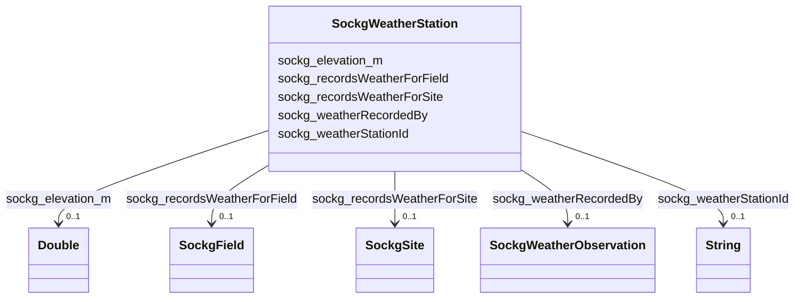

# Class: TODO -- what's a good name for what this class (type) describes? (sockg_WeatherStation)


_TODO -- tell the world what this class (type) describes._


URI: [sockg:WeatherStation](http://www.semanticweb.org/sockg/ontologies/2024/0/soil-carbon-ontology/WeatherStation)





<!-- no inheritance hierarchy -->


## Slots

| Name | Cardinality and Range | Description | Inheritance |
| ---  | --- | --- | --- |
| [sockg_weatherRecordedBy](../slots/sockg_weatherRecordedBy.md) | 0..1 <br/> [SockgWeatherObservation](../classes/SockgWeatherObservation.md) | TODO -- tell the world what this slot (predicate) describes | direct |
| [sockg_recordsWeatherForField](../slots/sockg_recordsWeatherForField.md) | 0..1 <br/> [SockgField](../classes/SockgField.md) | TODO -- tell the world what this slot (predicate) describes | direct |
| [sockg_recordsWeatherForSite](../slots/sockg_recordsWeatherForSite.md) | 0..1 <br/> [SockgSite](../classes/SockgSite.md) | TODO -- tell the world what this slot (predicate) describes | direct |
| [sockg_elevation_m](../slots/sockg_elevation_m.md) | 0..1 <br/> [xsd:double](http://www.w3.org/2001/XMLSchema#double) | TODO -- tell the world what this slot (predicate) describes | direct |
| [sockg_weatherStationId](../slots/sockg_weatherStationId.md) | 0..1 <br/> [xsd:string](http://www.w3.org/2001/XMLSchema#string) | TODO -- tell the world what this slot (predicate) describes | direct |


## Examples

| Value |
| --- |
| neo4j://graph.individuals#509294 |

## TODOs

* TODO -- Todos for this class go here
* or you can delete the todos
* if you think the class is perfect.

## Identifier and Mapping Information


### Schema Source


* from schema: soc-kg/main


## Mappings

| Mapping Type | Mapped Value |
| ---  | ---  |
| self | sockg:WeatherStation |
| native | soc-kg/main/:SockgWeatherStation |


## LinkML Source

<!-- TODO: investigate https://stackoverflow.com/questions/37606292/how-to-create-tabbed-code-blocks-in-mkdocs-or-sphinx -->

### Direct

<details>
```yaml
name: sockg_WeatherStation
description: TODO -- tell the world what this class (type) describes.
title: TODO -- what's a good name for what this class (type) describes?
todos:
- TODO -- Todos for this class go here
- or you can delete the todos
- if you think the class is perfect.
notes:
- There are 12 instances of this class.
examples:
- value: neo4j://graph.individuals#509294
from_schema: soc-kg/main
slots:
- sockg_weatherRecordedBy
- sockg_recordsWeatherForField
- sockg_recordsWeatherForSite
- sockg_elevation_m
- sockg_weatherStationId
class_uri: sockg:WeatherStation

```
</details>

### Induced

<details>
```yaml
name: sockg_WeatherStation
description: TODO -- tell the world what this class (type) describes.
title: TODO -- what's a good name for what this class (type) describes?
todos:
- TODO -- Todos for this class go here
- or you can delete the todos
- if you think the class is perfect.
notes:
- There are 12 instances of this class.
examples:
- value: neo4j://graph.individuals#509294
from_schema: soc-kg/main
attributes:
  sockg_weatherRecordedBy:
    name: sockg_weatherRecordedBy
    description: TODO -- tell the world what this slot (predicate) describes.
    todos:
    - TODO -- Todos for this slot go here
    - or you can delete the todos
    - if you think the class is perfect.
    comments:
    - 39489 occurrences with subject type sockg:WeatherStation and object type sockg:WeatherObservation.
    examples:
    - value: neo4j://graph.individuals#509289 sockg:weatherRecordedBy neo4j://graph.individuals#442714
    from_schema: soc-kg/main
    rank: 1000
    slot_uri: sockg:weatherRecordedBy
    alias: sockg_weatherRecordedBy
    owner: sockg_WeatherStation
    domain_of:
    - sockg_WeatherStation
    range: sockg_WeatherObservation
  sockg_recordsWeatherForField:
    name: sockg_recordsWeatherForField
    description: TODO -- tell the world what this slot (predicate) describes.
    todos:
    - TODO -- Todos for this slot go here
    - or you can delete the todos
    - if you think the class is perfect.
    comments:
    - 14 occurrences with subject type sockg:WeatherStation and object type sockg:Field.
    examples:
    - value: neo4j://graph.individuals#509299 sockg:recordsWeatherForField neo4j://graph.individuals#55587
    from_schema: soc-kg/main
    rank: 1000
    slot_uri: sockg:recordsWeatherForField
    alias: sockg_recordsWeatherForField
    owner: sockg_WeatherStation
    domain_of:
    - sockg_WeatherStation
    range: sockg_Field
  sockg_recordsWeatherForSite:
    name: sockg_recordsWeatherForSite
    description: TODO -- tell the world what this slot (predicate) describes.
    todos:
    - TODO -- Todos for this slot go here
    - or you can delete the todos
    - if you think the class is perfect.
    comments:
    - 14 occurrences with subject type sockg:WeatherStation and object type sockg:Site.
    examples:
    - value: neo4j://graph.individuals#509293 sockg:recordsWeatherForSite neo4j://graph.individuals#230728
    from_schema: soc-kg/main
    rank: 1000
    slot_uri: sockg:recordsWeatherForSite
    alias: sockg_recordsWeatherForSite
    owner: sockg_WeatherStation
    domain_of:
    - sockg_WeatherStation
    range: sockg_Site
  sockg_elevation_m:
    name: sockg_elevation_m
    description: TODO -- tell the world what this slot (predicate) describes.
    todos:
    - TODO -- Todos for this slot go here
    - or you can delete the todos
    - if you think the class is perfect.
    comments:
    - 58 occurrences with subject type sockg:Field and object type xsd:double.
    - 12 occurrences with subject type sockg:WeatherStation and object type xsd:double.
    examples:
    - value: neo4j://graph.individuals#55601 sockg:elevation_m nan
    - value: neo4j://graph.individuals#509298 sockg:elevation_m nan
    from_schema: soc-kg/main
    rank: 1000
    slot_uri: sockg:elevation_m
    alias: sockg_elevation_m
    owner: sockg_WeatherStation
    domain_of:
    - sockg_Field
    - sockg_WeatherStation
    range: double
  sockg_weatherStationId:
    name: sockg_weatherStationId
    description: TODO -- tell the world what this slot (predicate) describes.
    todos:
    - TODO -- Todos for this slot go here
    - or you can delete the todos
    - if you think the class is perfect.
    comments:
    - 12 occurrences with subject type sockg:WeatherStation and object type string.
    examples:
    - value: neo4j://graph.individuals#509296 sockg:weatherStationId 477576
    from_schema: soc-kg/main
    rank: 1000
    slot_uri: sockg:weatherStationId
    alias: sockg_weatherStationId
    owner: sockg_WeatherStation
    domain_of:
    - sockg_WeatherStation
    range: string
class_uri: sockg:WeatherStation

```
</details>