# Class: TODO -- what's a good name for what this class (type) describes? (sockg_YieldNutrientUptake)


_No type description provided_


URI: [sockg:YieldNutrientUptake](http://www.semanticweb.org/sockg/ontologies/2024/0/soil-carbon-ontology/YieldNutrientUptake)

```mermaid
 classDiagram
    class SockgYieldNutrientUptake
    click SockgYieldNutrientUptake href "../SockgYieldNutrientUptake"
      SockgYieldNutrientUptake : sockg_crop
        
          
    
    
    SockgYieldNutrientUptake --> "0..1" Any : sockg_crop
    click Any href "../Any"

        
      SockgYieldNutrientUptake : sockg_date
        
          
    
    
    SockgYieldNutrientUptake --> "0..1" Any : sockg_date
    click Any href "../Any"

        
      SockgYieldNutrientUptake : sockg_expUnit_UID
        
          
    
    
    SockgYieldNutrientUptake --> "0..1" String : sockg_expUnit_UID
    click String href "../String"

        
      SockgYieldNutrientUptake : sockg_expUnitId
        
          
    
    
    SockgYieldNutrientUptake --> "0..1" String : sockg_expUnitId
    click String href "../String"

        
      SockgYieldNutrientUptake : sockg_fieldId
        
          
    
    
    SockgYieldNutrientUptake --> "0..1" String : sockg_fieldId
    click String href "../String"

        
      SockgYieldNutrientUptake : sockg_fracBoron_gB_ha
        
          
    
    
    SockgYieldNutrientUptake --> "0..1" Double : sockg_fracBoron_gB_ha
    click Double href "../Double"

        
      SockgYieldNutrientUptake : sockg_fracBoronStd_gB_ha
        
          
    
    
    SockgYieldNutrientUptake --> "0..1" Double : sockg_fracBoronStd_gB_ha
    click Double href "../Double"

        
      SockgYieldNutrientUptake : sockg_fracCalcium_kgCa_ha
        
          
    
    
    SockgYieldNutrientUptake --> "0..1" Double : sockg_fracCalcium_kgCa_ha
    click Double href "../Double"

        
      SockgYieldNutrientUptake : sockg_fracCalciumStd_kgCa_ha
        
          
    
    
    SockgYieldNutrientUptake --> "0..1" Double : sockg_fracCalciumStd_kgCa_ha
    click Double href "../Double"

        
      SockgYieldNutrientUptake : sockg_fracCarbon_kgC_ha
        
          
    
    
    SockgYieldNutrientUptake --> "0..1" Double : sockg_fracCarbon_kgC_ha
    click Double href "../Double"

        
      SockgYieldNutrientUptake : sockg_fracCarbonStd_kgC_ha
        
          
    
    
    SockgYieldNutrientUptake --> "0..1" Double : sockg_fracCarbonStd_kgC_ha
    click Double href "../Double"

        
      SockgYieldNutrientUptake : sockg_fracCopper_gCu_ha
        
          
    
    
    SockgYieldNutrientUptake --> "0..1" Double : sockg_fracCopper_gCu_ha
    click Double href "../Double"

        
      SockgYieldNutrientUptake : sockg_fracCopperStd_gCu_ha
        
          
    
    
    SockgYieldNutrientUptake --> "0..1" Double : sockg_fracCopperStd_gCu_ha
    click Double href "../Double"

        
      SockgYieldNutrientUptake : sockg_fracCropProductivity_kg_ha
        
          
    
    
    SockgYieldNutrientUptake --> "0..1" Double : sockg_fracCropProductivity_kg_ha
    click Double href "../Double"

        
      SockgYieldNutrientUptake : sockg_fracIron_gFe_ha
        
          
    
    
    SockgYieldNutrientUptake --> "0..1" Double : sockg_fracIron_gFe_ha
    click Double href "../Double"

        
      SockgYieldNutrientUptake : sockg_fracIronStd_gFe_ha
        
          
    
    
    SockgYieldNutrientUptake --> "0..1" Double : sockg_fracIronStd_gFe_ha
    click Double href "../Double"

        
      SockgYieldNutrientUptake : sockg_fracMagnesium_kgMg_ha
        
          
    
    
    SockgYieldNutrientUptake --> "0..1" Double : sockg_fracMagnesium_kgMg_ha
    click Double href "../Double"

        
      SockgYieldNutrientUptake : sockg_fracMagnesiumStd_kgMg_ha
        
          
    
    
    SockgYieldNutrientUptake --> "0..1" Double : sockg_fracMagnesiumStd_kgMg_ha
    click Double href "../Double"

        
      SockgYieldNutrientUptake : sockg_fracManganese_gMn_ha
        
          
    
    
    SockgYieldNutrientUptake --> "0..1" Double : sockg_fracManganese_gMn_ha
    click Double href "../Double"

        
      SockgYieldNutrientUptake : sockg_fracManganeseStd_gMn_ha
        
          
    
    
    SockgYieldNutrientUptake --> "0..1" Double : sockg_fracManganeseStd_gMn_ha
    click Double href "../Double"

        
      SockgYieldNutrientUptake : sockg_fracMoisturePercent
        
          
    
    
    SockgYieldNutrientUptake --> "0..1" Double : sockg_fracMoisturePercent
    click Double href "../Double"

        
      SockgYieldNutrientUptake : sockg_fracMoisturePercentStd
        
          
    
    
    SockgYieldNutrientUptake --> "0..1" Double : sockg_fracMoisturePercentStd
    click Double href "../Double"

        
      SockgYieldNutrientUptake : sockg_fracMolybdenum_gMo_ha
        
          
    
    
    SockgYieldNutrientUptake --> "0..1" Double : sockg_fracMolybdenum_gMo_ha
    click Double href "../Double"

        
      SockgYieldNutrientUptake : sockg_fracMolybdenumStd_gMo_ha
        
          
    
    
    SockgYieldNutrientUptake --> "0..1" Double : sockg_fracMolybdenumStd_gMo_ha
    click Double href "../Double"

        
      SockgYieldNutrientUptake : sockg_fracNitrogen_kgN_ha
        
          
    
    
    SockgYieldNutrientUptake --> "0..1" Double : sockg_fracNitrogen_kgN_ha
    click Double href "../Double"

        
      SockgYieldNutrientUptake : sockg_fracNitrogenStd_kgN_ha
        
          
    
    
    SockgYieldNutrientUptake --> "0..1" Double : sockg_fracNitrogenStd_kgN_ha
    click Double href "../Double"

        
      SockgYieldNutrientUptake : sockg_fracPhosphorus_kgP_ha
        
          
    
    
    SockgYieldNutrientUptake --> "0..1" Double : sockg_fracPhosphorus_kgP_ha
    click Double href "../Double"

        
      SockgYieldNutrientUptake : sockg_fracPhosphorusStd_kgP_ha
        
          
    
    
    SockgYieldNutrientUptake --> "0..1" Double : sockg_fracPhosphorusStd_kgP_ha
    click Double href "../Double"

        
      SockgYieldNutrientUptake : sockg_fracPotassium_kgK_ha
        
          
    
    
    SockgYieldNutrientUptake --> "0..1" Double : sockg_fracPotassium_kgK_ha
    click Double href "../Double"

        
      SockgYieldNutrientUptake : sockg_fracPotassiumStd_kgK_ha
        
          
    
    
    SockgYieldNutrientUptake --> "0..1" Double : sockg_fracPotassiumStd_kgK_ha
    click Double href "../Double"

        
      SockgYieldNutrientUptake : sockg_fracProductivityStd_kg_ha
        
          
    
    
    SockgYieldNutrientUptake --> "0..1" Double : sockg_fracProductivityStd_kg_ha
    click Double href "../Double"

        
      SockgYieldNutrientUptake : sockg_fracSulfur_kgS_ha
        
          
    
    
    SockgYieldNutrientUptake --> "0..1" Double : sockg_fracSulfur_kgS_ha
    click Double href "../Double"

        
      SockgYieldNutrientUptake : sockg_fracSulfurStd_kgS_ha
        
          
    
    
    SockgYieldNutrientUptake --> "0..1" Double : sockg_fracSulfurStd_kgS_ha
    click Double href "../Double"

        
      SockgYieldNutrientUptake : sockg_fracZinc_gZn_ha
        
          
    
    
    SockgYieldNutrientUptake --> "0..1" Double : sockg_fracZinc_gZn_ha
    click Double href "../Double"

        
      SockgYieldNutrientUptake : sockg_fracZincStd_gZn_ha
        
          
    
    
    SockgYieldNutrientUptake --> "0..1" Double : sockg_fracZincStd_gZn_ha
    click Double href "../Double"

        
      SockgYieldNutrientUptake : sockg_grainWeightKernelYnu_mg
        
          
    
    
    SockgYieldNutrientUptake --> "0..1" Double : sockg_grainWeightKernelYnu_mg
    click Double href "../Double"

        
      SockgYieldNutrientUptake : sockg_grainWeightKernelYnuStd_mg
        
          
    
    
    SockgYieldNutrientUptake --> "0..1" Double : sockg_grainWeightKernelYnuStd_mg
    click Double href "../Double"

        
      SockgYieldNutrientUptake : sockg_growthStage
        
          
    
    
    SockgYieldNutrientUptake --> "0..1" Any : sockg_growthStage
    click Any href "../Any"

        
      SockgYieldNutrientUptake : sockg_hasYieldNutrUptakeData
        
          
    
    
    SockgYieldNutrientUptake --> "0..1" SockgExperimentalUnit : sockg_hasYieldNutrUptakeData
    click SockgExperimentalUnit href "../SockgExperimentalUnit"

        
      SockgYieldNutrientUptake : sockg_measYieldNutUptake_UID
        
          
    
    
    SockgYieldNutrientUptake --> "0..1" String : sockg_measYieldNutUptake_UID
    click String href "../String"

        
      SockgYieldNutrientUptake : sockg_modelIfSimulated
        
          
    
    
    SockgYieldNutrientUptake --> "0..1" Any : sockg_modelIfSimulated
    click Any href "../Any"

        
      SockgYieldNutrientUptake : sockg_plantFraction
        
          
    
    
    SockgYieldNutrientUptake --> "0..1" Any : sockg_plantFraction
    click Any href "../Any"

        
      SockgYieldNutrientUptake : sockg_treatmentId
        
          
    
    
    SockgYieldNutrientUptake --> "0..1" String : sockg_treatmentId
    click String href "../String"

        
      SockgYieldNutrientUptake : sockg_yieldNutrUptakeDataAt
        
          
    
    
    SockgYieldNutrientUptake --> "0..1" SockgField : sockg_yieldNutrUptakeDataAt
    click SockgField href "../SockgField"

        
      SockgYieldNutrientUptake : sockg_yieldNutrUptakeTreatment
        
          
    
    
    SockgYieldNutrientUptake --> "0..1" SockgTreatment : sockg_yieldNutrUptakeTreatment
    click SockgTreatment href "../SockgTreatment"

        
      
```





<!-- no inheritance hierarchy -->


## Slots

| Name | Cardinality and Range | Description | Inheritance |
| ---  | --- | --- | --- |
| [sockg_hasYieldNutrUptakeData](../slots/sockg_hasYieldNutrUptakeData.md) | 0..1 <br/> [SockgExperimentalUnit](../classes/SockgExperimentalUnit.md) | No slot description provided | direct |
| [sockg_yieldNutrUptakeDataAt](../slots/sockg_yieldNutrUptakeDataAt.md) | 0..1 <br/> [SockgField](../classes/SockgField.md) | No slot description provided | direct |
| [sockg_yieldNutrUptakeTreatment](../slots/sockg_yieldNutrUptakeTreatment.md) | 0..1 <br/> [SockgTreatment](../classes/SockgTreatment.md) | No slot description provided | direct |
| [sockg_fracBoron_gB_ha](../slots/sockg_fracBoron_gB_ha.md) | 0..1 <br/> [xsd:double](http://www.w3.org/2001/XMLSchema#double) | No slot description provided | direct |
| [sockg_fracProductivityStd_kg_ha](../slots/sockg_fracProductivityStd_kg_ha.md) | 0..1 <br/> [xsd:double](http://www.w3.org/2001/XMLSchema#double) | No slot description provided | direct |
| [sockg_fracCarbonStd_kgC_ha](../slots/sockg_fracCarbonStd_kgC_ha.md) | 0..1 <br/> [xsd:double](http://www.w3.org/2001/XMLSchema#double) | No slot description provided | direct |
| [sockg_fracNitrogenStd_kgN_ha](../slots/sockg_fracNitrogenStd_kgN_ha.md) | 0..1 <br/> [xsd:double](http://www.w3.org/2001/XMLSchema#double) | No slot description provided | direct |
| [sockg_fracZincStd_gZn_ha](../slots/sockg_fracZincStd_gZn_ha.md) | 0..1 <br/> [xsd:double](http://www.w3.org/2001/XMLSchema#double) | No slot description provided | direct |
| [sockg_crop](../slots/sockg_crop.md) | 0..1 <br/> [xsd:string](http://www.w3.org/2001/XMLSchema#string)&nbsp;or&nbsp;<br />[xsd:double](http://www.w3.org/2001/XMLSchema#double) | No slot description provided | direct |
| [sockg_measYieldNutUptake_UID](../slots/sockg_measYieldNutUptake_UID.md) | 0..1 <br/> [xsd:string](http://www.w3.org/2001/XMLSchema#string) | No slot description provided | direct |
| [sockg_fracSulfur_kgS_ha](../slots/sockg_fracSulfur_kgS_ha.md) | 0..1 <br/> [xsd:double](http://www.w3.org/2001/XMLSchema#double) | No slot description provided | direct |
| [sockg_modelIfSimulated](../slots/sockg_modelIfSimulated.md) | 0..1 <br/> [xsd:double](http://www.w3.org/2001/XMLSchema#double)&nbsp;or&nbsp;<br />[xsd:string](http://www.w3.org/2001/XMLSchema#string) | No slot description provided | direct |
| [sockg_fracMolybdenumStd_gMo_ha](../slots/sockg_fracMolybdenumStd_gMo_ha.md) | 0..1 <br/> [xsd:double](http://www.w3.org/2001/XMLSchema#double) | No slot description provided | direct |
| [sockg_fracPotassiumStd_kgK_ha](../slots/sockg_fracPotassiumStd_kgK_ha.md) | 0..1 <br/> [xsd:double](http://www.w3.org/2001/XMLSchema#double) | No slot description provided | direct |
| [sockg_plantFraction](../slots/sockg_plantFraction.md) | 0..1 <br/> [xsd:string](http://www.w3.org/2001/XMLSchema#string)&nbsp;or&nbsp;<br />[xsd:double](http://www.w3.org/2001/XMLSchema#double) | No slot description provided | direct |
| [sockg_grainWeightKernelYnu_mg](../slots/sockg_grainWeightKernelYnu_mg.md) | 0..1 <br/> [xsd:double](http://www.w3.org/2001/XMLSchema#double) | No slot description provided | direct |
| [sockg_fracMagnesium_kgMg_ha](../slots/sockg_fracMagnesium_kgMg_ha.md) | 0..1 <br/> [xsd:double](http://www.w3.org/2001/XMLSchema#double) | No slot description provided | direct |
| [sockg_fracCarbon_kgC_ha](../slots/sockg_fracCarbon_kgC_ha.md) | 0..1 <br/> [xsd:double](http://www.w3.org/2001/XMLSchema#double) | No slot description provided | direct |
| [sockg_fracManganeseStd_gMn_ha](../slots/sockg_fracManganeseStd_gMn_ha.md) | 0..1 <br/> [xsd:double](http://www.w3.org/2001/XMLSchema#double) | No slot description provided | direct |
| [sockg_treatmentId](../slots/sockg_treatmentId.md) | 0..1 <br/> [xsd:string](http://www.w3.org/2001/XMLSchema#string) | No slot description provided | direct |
| [sockg_fracCopperStd_gCu_ha](../slots/sockg_fracCopperStd_gCu_ha.md) | 0..1 <br/> [xsd:double](http://www.w3.org/2001/XMLSchema#double) | No slot description provided | direct |
| [sockg_fracMagnesiumStd_kgMg_ha](../slots/sockg_fracMagnesiumStd_kgMg_ha.md) | 0..1 <br/> [xsd:double](http://www.w3.org/2001/XMLSchema#double) | No slot description provided | direct |
| [sockg_fracIron_gFe_ha](../slots/sockg_fracIron_gFe_ha.md) | 0..1 <br/> [xsd:double](http://www.w3.org/2001/XMLSchema#double) | No slot description provided | direct |
| [sockg_fracCalcium_kgCa_ha](../slots/sockg_fracCalcium_kgCa_ha.md) | 0..1 <br/> [xsd:double](http://www.w3.org/2001/XMLSchema#double) | No slot description provided | direct |
| [sockg_fracPhosphorus_kgP_ha](../slots/sockg_fracPhosphorus_kgP_ha.md) | 0..1 <br/> [xsd:double](http://www.w3.org/2001/XMLSchema#double) | No slot description provided | direct |
| [sockg_fieldId](../slots/sockg_fieldId.md) | 0..1 <br/> [xsd:string](http://www.w3.org/2001/XMLSchema#string) | No slot description provided | direct |
| [sockg_fracIronStd_gFe_ha](../slots/sockg_fracIronStd_gFe_ha.md) | 0..1 <br/> [xsd:double](http://www.w3.org/2001/XMLSchema#double) | No slot description provided | direct |
| [sockg_fracMoisturePercentStd](../slots/sockg_fracMoisturePercentStd.md) | 0..1 <br/> [xsd:double](http://www.w3.org/2001/XMLSchema#double) | No slot description provided | direct |
| [sockg_expUnit_UID](../slots/sockg_expUnit_UID.md) | 0..1 <br/> [xsd:string](http://www.w3.org/2001/XMLSchema#string) | No slot description provided | direct |
| [sockg_fracZinc_gZn_ha](../slots/sockg_fracZinc_gZn_ha.md) | 0..1 <br/> [xsd:double](http://www.w3.org/2001/XMLSchema#double) | No slot description provided | direct |
| [sockg_fracSulfurStd_kgS_ha](../slots/sockg_fracSulfurStd_kgS_ha.md) | 0..1 <br/> [xsd:double](http://www.w3.org/2001/XMLSchema#double) | No slot description provided | direct |
| [sockg_fracPotassium_kgK_ha](../slots/sockg_fracPotassium_kgK_ha.md) | 0..1 <br/> [xsd:double](http://www.w3.org/2001/XMLSchema#double) | No slot description provided | direct |
| [sockg_fracMoisturePercent](../slots/sockg_fracMoisturePercent.md) | 0..1 <br/> [xsd:double](http://www.w3.org/2001/XMLSchema#double) | No slot description provided | direct |
| [sockg_fracCopper_gCu_ha](../slots/sockg_fracCopper_gCu_ha.md) | 0..1 <br/> [xsd:double](http://www.w3.org/2001/XMLSchema#double) | No slot description provided | direct |
| [sockg_fracMolybdenum_gMo_ha](../slots/sockg_fracMolybdenum_gMo_ha.md) | 0..1 <br/> [xsd:double](http://www.w3.org/2001/XMLSchema#double) | No slot description provided | direct |
| [sockg_fracCalciumStd_kgCa_ha](../slots/sockg_fracCalciumStd_kgCa_ha.md) | 0..1 <br/> [xsd:double](http://www.w3.org/2001/XMLSchema#double) | No slot description provided | direct |
| [sockg_date](../slots/sockg_date.md) | 0..1 <br/> [xsd:string](http://www.w3.org/2001/XMLSchema#string)&nbsp;or&nbsp;<br />[xsd:double](http://www.w3.org/2001/XMLSchema#double) | No slot description provided | direct |
| [sockg_fracBoronStd_gB_ha](../slots/sockg_fracBoronStd_gB_ha.md) | 0..1 <br/> [xsd:double](http://www.w3.org/2001/XMLSchema#double) | No slot description provided | direct |
| [sockg_expUnitId](../slots/sockg_expUnitId.md) | 0..1 <br/> [xsd:string](http://www.w3.org/2001/XMLSchema#string) | No slot description provided | direct |
| [sockg_grainWeightKernelYnuStd_mg](../slots/sockg_grainWeightKernelYnuStd_mg.md) | 0..1 <br/> [xsd:double](http://www.w3.org/2001/XMLSchema#double) | No slot description provided | direct |
| [sockg_fracCropProductivity_kg_ha](../slots/sockg_fracCropProductivity_kg_ha.md) | 0..1 <br/> [xsd:double](http://www.w3.org/2001/XMLSchema#double) | No slot description provided | direct |
| [sockg_fracManganese_gMn_ha](../slots/sockg_fracManganese_gMn_ha.md) | 0..1 <br/> [xsd:double](http://www.w3.org/2001/XMLSchema#double) | No slot description provided | direct |
| [sockg_growthStage](../slots/sockg_growthStage.md) | 0..1 <br/> [xsd:string](http://www.w3.org/2001/XMLSchema#string)&nbsp;or&nbsp;<br />[xsd:double](http://www.w3.org/2001/XMLSchema#double) | No slot description provided | direct |
| [sockg_fracPhosphorusStd_kgP_ha](../slots/sockg_fracPhosphorusStd_kgP_ha.md) | 0..1 <br/> [xsd:double](http://www.w3.org/2001/XMLSchema#double) | No slot description provided | direct |
| [sockg_fracNitrogen_kgN_ha](../slots/sockg_fracNitrogen_kgN_ha.md) | 0..1 <br/> [xsd:double](http://www.w3.org/2001/XMLSchema#double) | No slot description provided | direct |


## Examples

| Value |
| --- |
| neo4j://graph.individuals#509686 |

## TODOs

* TODO -- Todos for this class go here
* or you can delete the todos
* if you think the class is perfect.

## Identifier and Mapping Information


### Schema Source


* from schema: soc-kg/main


## Mappings

| Mapping Type | Mapped Value |
| ---  | ---  |
| self | sockg:YieldNutrientUptake |
| native | soc-kg/main/:SockgYieldNutrientUptake |


## LinkML Source

<!-- TODO: investigate https://stackoverflow.com/questions/37606292/how-to-create-tabbed-code-blocks-in-mkdocs-or-sphinx -->

### Direct

<details>
```yaml
name: sockg_YieldNutrientUptake
description: No type description provided
title: TODO -- what's a good name for what this class (type) describes?
todos:
- TODO -- Todos for this class go here
- or you can delete the todos
- if you think the class is perfect.
notes:
- There are 429 instances of this class.
examples:
- value: neo4j://graph.individuals#509686
from_schema: soc-kg/main
rank: 1000
slots:
- sockg_hasYieldNutrUptakeData
- sockg_yieldNutrUptakeDataAt
- sockg_yieldNutrUptakeTreatment
- sockg_fracBoron_gB_ha
- sockg_fracProductivityStd_kg_ha
- sockg_fracCarbonStd_kgC_ha
- sockg_fracNitrogenStd_kgN_ha
- sockg_fracZincStd_gZn_ha
- sockg_crop
- sockg_measYieldNutUptake_UID
- sockg_fracSulfur_kgS_ha
- sockg_modelIfSimulated
- sockg_fracMolybdenumStd_gMo_ha
- sockg_fracPotassiumStd_kgK_ha
- sockg_plantFraction
- sockg_grainWeightKernelYnu_mg
- sockg_fracMagnesium_kgMg_ha
- sockg_fracCarbon_kgC_ha
- sockg_fracManganeseStd_gMn_ha
- sockg_treatmentId
- sockg_fracCopperStd_gCu_ha
- sockg_fracMagnesiumStd_kgMg_ha
- sockg_fracIron_gFe_ha
- sockg_fracCalcium_kgCa_ha
- sockg_fracPhosphorus_kgP_ha
- sockg_fieldId
- sockg_fracIronStd_gFe_ha
- sockg_fracMoisturePercentStd
- sockg_expUnit_UID
- sockg_fracZinc_gZn_ha
- sockg_fracSulfurStd_kgS_ha
- sockg_fracPotassium_kgK_ha
- sockg_fracMoisturePercent
- sockg_fracCopper_gCu_ha
- sockg_fracMolybdenum_gMo_ha
- sockg_fracCalciumStd_kgCa_ha
- sockg_date
- sockg_fracBoronStd_gB_ha
- sockg_expUnitId
- sockg_grainWeightKernelYnuStd_mg
- sockg_fracCropProductivity_kg_ha
- sockg_fracManganese_gMn_ha
- sockg_growthStage
- sockg_fracPhosphorusStd_kgP_ha
- sockg_fracNitrogen_kgN_ha
class_uri: sockg:YieldNutrientUptake

```
</details>

### Induced

<details>
```yaml
name: sockg_YieldNutrientUptake
description: No type description provided
title: TODO -- what's a good name for what this class (type) describes?
todos:
- TODO -- Todos for this class go here
- or you can delete the todos
- if you think the class is perfect.
notes:
- There are 429 instances of this class.
examples:
- value: neo4j://graph.individuals#509686
from_schema: soc-kg/main
rank: 1000
attributes:
  sockg_hasYieldNutrUptakeData:
    name: sockg_hasYieldNutrUptakeData
    description: No slot description provided
    todos:
    - TODO -- Todos for this slot go here
    - or you can delete the todos
    - if you think the class is perfect.
    comments:
    - 429 occurrences with subject type sockg:YieldNutrientUptake and object type
      sockg:ExperimentalUnit.
    examples:
    - value: neo4j://graph.individuals#509481 sockg:hasYieldNutrUptakeData neo4j://graph.individuals#54846
    from_schema: soc-kg/main
    rank: 1000
    slot_uri: sockg:hasYieldNutrUptakeData
    alias: sockg_hasYieldNutrUptakeData
    owner: sockg_YieldNutrientUptake
    domain_of:
    - sockg_YieldNutrientUptake
    range: sockg_ExperimentalUnit
  sockg_yieldNutrUptakeDataAt:
    name: sockg_yieldNutrUptakeDataAt
    description: No slot description provided
    todos:
    - TODO -- Todos for this slot go here
    - or you can delete the todos
    - if you think the class is perfect.
    comments:
    - 429 occurrences with subject type sockg:YieldNutrientUptake and object type
      sockg:Field.
    examples:
    - value: neo4j://graph.individuals#509380 sockg:yieldNutrUptakeDataAt neo4j://graph.individuals#55597
    from_schema: soc-kg/main
    rank: 1000
    slot_uri: sockg:yieldNutrUptakeDataAt
    alias: sockg_yieldNutrUptakeDataAt
    owner: sockg_YieldNutrientUptake
    domain_of:
    - sockg_YieldNutrientUptake
    range: sockg_Field
  sockg_yieldNutrUptakeTreatment:
    name: sockg_yieldNutrUptakeTreatment
    description: No slot description provided
    todos:
    - TODO -- Todos for this slot go here
    - or you can delete the todos
    - if you think the class is perfect.
    comments:
    - 409 occurrences with subject type sockg:YieldNutrientUptake and object type
      sockg:Treatment.
    examples:
    - value: neo4j://graph.individuals#509368 sockg:yieldNutrUptakeTreatment neo4j://graph.individuals#359705
    from_schema: soc-kg/main
    rank: 1000
    slot_uri: sockg:yieldNutrUptakeTreatment
    alias: sockg_yieldNutrUptakeTreatment
    owner: sockg_YieldNutrientUptake
    domain_of:
    - sockg_YieldNutrientUptake
    range: sockg_Treatment
  sockg_fracBoron_gB_ha:
    name: sockg_fracBoron_gB_ha
    description: No slot description provided
    todos:
    - TODO -- Todos for this slot go here
    - or you can delete the todos
    - if you think the class is perfect.
    comments:
    - 429 occurrences with subject type sockg:YieldNutrientUptake and object type
      xsd:double.
    examples:
    - value: neo4j://graph.individuals#509524 sockg:fracBoron_gB_ha nan
    from_schema: soc-kg/main
    rank: 1000
    slot_uri: sockg:fracBoron_gB_ha
    alias: sockg_fracBoron_gB_ha
    owner: sockg_YieldNutrientUptake
    domain_of:
    - sockg_YieldNutrientUptake
    range: double
  sockg_fracProductivityStd_kg_ha:
    name: sockg_fracProductivityStd_kg_ha
    description: No slot description provided
    todos:
    - TODO -- Todos for this slot go here
    - or you can delete the todos
    - if you think the class is perfect.
    comments:
    - 429 occurrences with subject type sockg:YieldNutrientUptake and object type
      xsd:double.
    examples:
    - value: neo4j://graph.individuals#509399 sockg:fracProductivityStd_kg_ha nan
    from_schema: soc-kg/main
    rank: 1000
    slot_uri: sockg:fracProductivityStd_kg_ha
    alias: sockg_fracProductivityStd_kg_ha
    owner: sockg_YieldNutrientUptake
    domain_of:
    - sockg_YieldNutrientUptake
    range: double
  sockg_fracCarbonStd_kgC_ha:
    name: sockg_fracCarbonStd_kgC_ha
    description: No slot description provided
    todos:
    - TODO -- Todos for this slot go here
    - or you can delete the todos
    - if you think the class is perfect.
    comments:
    - 429 occurrences with subject type sockg:YieldNutrientUptake and object type
      xsd:double.
    examples:
    - value: neo4j://graph.individuals#509502 sockg:fracCarbonStd_kgC_ha nan
    from_schema: soc-kg/main
    rank: 1000
    slot_uri: sockg:fracCarbonStd_kgC_ha
    alias: sockg_fracCarbonStd_kgC_ha
    owner: sockg_YieldNutrientUptake
    domain_of:
    - sockg_YieldNutrientUptake
    range: double
  sockg_fracNitrogenStd_kgN_ha:
    name: sockg_fracNitrogenStd_kgN_ha
    description: No slot description provided
    todos:
    - TODO -- Todos for this slot go here
    - or you can delete the todos
    - if you think the class is perfect.
    comments:
    - 429 occurrences with subject type sockg:YieldNutrientUptake and object type
      xsd:double.
    examples:
    - value: neo4j://graph.individuals#509680 sockg:fracNitrogenStd_kgN_ha nan
    from_schema: soc-kg/main
    rank: 1000
    slot_uri: sockg:fracNitrogenStd_kgN_ha
    alias: sockg_fracNitrogenStd_kgN_ha
    owner: sockg_YieldNutrientUptake
    domain_of:
    - sockg_YieldNutrientUptake
    range: double
  sockg_fracZincStd_gZn_ha:
    name: sockg_fracZincStd_gZn_ha
    description: No slot description provided
    todos:
    - TODO -- Todos for this slot go here
    - or you can delete the todos
    - if you think the class is perfect.
    comments:
    - 429 occurrences with subject type sockg:YieldNutrientUptake and object type
      xsd:double.
    examples:
    - value: neo4j://graph.individuals#509346 sockg:fracZincStd_gZn_ha nan
    from_schema: soc-kg/main
    rank: 1000
    slot_uri: sockg:fracZincStd_gZn_ha
    alias: sockg_fracZincStd_gZn_ha
    owner: sockg_YieldNutrientUptake
    domain_of:
    - sockg_YieldNutrientUptake
    range: double
  sockg_crop:
    name: sockg_crop
    description: No slot description provided
    todos:
    - TODO -- Todos for this slot go here
    - or you can delete the todos
    - if you think the class is perfect.
    comments:
    - 2791 occurrences with subject type sockg:NutrientEfficiency and object type
      string.
    - 105046 occurrences with subject type sockg:GasSample and object type string.
    - 6723 occurrences with subject type sockg:BioMassMineral and object type string.
    - 429 occurrences with subject type sockg:YieldNutrientUptake and object type
      string.
    - 667 occurrences with subject type sockg:WaterQualityArea and object type xsd:double.
    - 1367 occurrences with subject type sockg:BioMassCarbohydrate and object type
      string.
    - 799 occurrences with subject type sockg:BioMassEnergy and object type string.
    - 2308 occurrences with subject type sockg:GasSample and object type xsd:double.
    - 553 occurrences with subject type sockg:WaterQualityConc and object type string.
    - 698 occurrences with subject type sockg:GasNutrientLoss and object type xsd:double.
    - 926 occurrences with subject type sockg:WaterQualityConc and object type xsd:double.
    - 50 occurrences with subject type sockg:GasNutrientLoss and object type string.
    - 15 occurrences with subject type sockg:WindErosionArea and object type xsd:double.
    examples:
    - value: neo4j://graph.individuals#201065 sockg:crop Zea mays (Corn)
    - value: neo4j://graph.individuals#156219 sockg:crop Zea mays (Corn)
    - value: neo4j://graph.individuals#45025 sockg:crop Zea mays (Corn)
    - value: neo4j://graph.individuals#509340 sockg:crop Secale cereale (Rye)
    - value: neo4j://graph.individuals#360357 sockg:crop nan
    - value: neo4j://graph.individuals#37850 sockg:crop Zea mays (Corn)
    - value: neo4j://graph.individuals#39943 sockg:crop Zea mays (Corn)
    - value: neo4j://graph.individuals#112348 sockg:crop nan
    - value: neo4j://graph.individuals#360717 sockg:crop Glycine max (Soybean)
    - value: neo4j://graph.individuals#56206 sockg:crop nan
    - value: neo4j://graph.individuals#361559 sockg:crop nan
    - value: neo4j://graph.individuals#56324 sockg:crop Secale cereale (Rye)
    - value: neo4j://graph.individuals#509306 sockg:crop nan
    from_schema: soc-kg/main
    rank: 1000
    slot_uri: sockg:crop
    alias: sockg_crop
    owner: sockg_YieldNutrientUptake
    domain_of:
    - sockg_BioMassCarbohydrate
    - sockg_BioMassEnergy
    - sockg_BioMassMineral
    - sockg_GasNutrientLoss
    - sockg_GasSample
    - sockg_NutrientEfficiency
    - sockg_WaterQualityArea
    - sockg_WaterQualityConc
    - sockg_WindErosionArea
    - sockg_YieldNutrientUptake
    range: Any
    any_of:
    - range: string
    - range: double
  sockg_measYieldNutUptake_UID:
    name: sockg_measYieldNutUptake_UID
    description: No slot description provided
    todos:
    - TODO -- Todos for this slot go here
    - or you can delete the todos
    - if you think the class is perfect.
    comments:
    - 429 occurrences with subject type sockg:YieldNutrientUptake and object type
      string.
    examples:
    - value: neo4j://graph.individuals#509338 sockg:measYieldNutUptake_UID AgCros_ALAURye_205_2006-04-20
    from_schema: soc-kg/main
    rank: 1000
    slot_uri: sockg:measYieldNutUptake_UID
    alias: sockg_measYieldNutUptake_UID
    owner: sockg_YieldNutrientUptake
    domain_of:
    - sockg_YieldNutrientUptake
    range: string
  sockg_fracSulfur_kgS_ha:
    name: sockg_fracSulfur_kgS_ha
    description: No slot description provided
    todos:
    - TODO -- Todos for this slot go here
    - or you can delete the todos
    - if you think the class is perfect.
    comments:
    - 429 occurrences with subject type sockg:YieldNutrientUptake and object type
      xsd:double.
    examples:
    - value: neo4j://graph.individuals#509379 sockg:fracSulfur_kgS_ha nan
    from_schema: soc-kg/main
    rank: 1000
    slot_uri: sockg:fracSulfur_kgS_ha
    alias: sockg_fracSulfur_kgS_ha
    owner: sockg_YieldNutrientUptake
    domain_of:
    - sockg_YieldNutrientUptake
    range: double
  sockg_modelIfSimulated:
    name: sockg_modelIfSimulated
    description: No slot description provided
    todos:
    - TODO -- Todos for this slot go here
    - or you can delete the todos
    - if you think the class is perfect.
    comments:
    - 429 occurrences with subject type sockg:YieldNutrientUptake and object type
      xsd:double.
    - 667 occurrences with subject type sockg:WaterQualityArea and object type xsd:double.
    - 692 occurrences with subject type sockg:GasNutrientLoss and object type xsd:double.
    - 1466 occurrences with subject type sockg:WaterQualityConc and object type xsd:double.
    - 56 occurrences with subject type sockg:GasNutrientLoss and object type string.
    - 13 occurrences with subject type sockg:WaterQualityConc and object type string.
    - 4 occurrences with subject type sockg:WindErosionArea and object type string.
    - 11 occurrences with subject type sockg:WindErosionArea and object type xsd:double.
    examples:
    - value: neo4j://graph.individuals#509423 sockg:modelIfSimulated nan
    - value: neo4j://graph.individuals#360133 sockg:modelIfSimulated nan
    - value: neo4j://graph.individuals#56071 sockg:modelIfSimulated nan
    - value: neo4j://graph.individuals#361440 sockg:modelIfSimulated nan
    - value: neo4j://graph.individuals#55638 sockg:modelIfSimulated RZWQM
    - value: neo4j://graph.individuals#361269 sockg:modelIfSimulated RZWQM
    - value: neo4j://graph.individuals#509307 sockg:modelIfSimulated Linear Proportional
        with particle size correction factor
    - value: neo4j://graph.individuals#509303 sockg:modelIfSimulated nan
    from_schema: soc-kg/main
    rank: 1000
    slot_uri: sockg:modelIfSimulated
    alias: sockg_modelIfSimulated
    owner: sockg_YieldNutrientUptake
    domain_of:
    - sockg_GasNutrientLoss
    - sockg_WaterQualityArea
    - sockg_WaterQualityConc
    - sockg_WindErosionArea
    - sockg_YieldNutrientUptake
    range: Any
    any_of:
    - range: double
    - range: string
  sockg_fracMolybdenumStd_gMo_ha:
    name: sockg_fracMolybdenumStd_gMo_ha
    description: No slot description provided
    todos:
    - TODO -- Todos for this slot go here
    - or you can delete the todos
    - if you think the class is perfect.
    comments:
    - 429 occurrences with subject type sockg:YieldNutrientUptake and object type
      xsd:double.
    examples:
    - value: neo4j://graph.individuals#509388 sockg:fracMolybdenumStd_gMo_ha nan
    from_schema: soc-kg/main
    rank: 1000
    slot_uri: sockg:fracMolybdenumStd_gMo_ha
    alias: sockg_fracMolybdenumStd_gMo_ha
    owner: sockg_YieldNutrientUptake
    domain_of:
    - sockg_YieldNutrientUptake
    range: double
  sockg_fracPotassiumStd_kgK_ha:
    name: sockg_fracPotassiumStd_kgK_ha
    description: No slot description provided
    todos:
    - TODO -- Todos for this slot go here
    - or you can delete the todos
    - if you think the class is perfect.
    comments:
    - 429 occurrences with subject type sockg:YieldNutrientUptake and object type
      xsd:double.
    examples:
    - value: neo4j://graph.individuals#509474 sockg:fracPotassiumStd_kgK_ha nan
    from_schema: soc-kg/main
    rank: 1000
    slot_uri: sockg:fracPotassiumStd_kgK_ha
    alias: sockg_fracPotassiumStd_kgK_ha
    owner: sockg_YieldNutrientUptake
    domain_of:
    - sockg_YieldNutrientUptake
    range: double
  sockg_plantFraction:
    name: sockg_plantFraction
    description: No slot description provided
    todos:
    - TODO -- Todos for this slot go here
    - or you can delete the todos
    - if you think the class is perfect.
    comments:
    - 9470 occurrences with subject type sockg:HarvestFraction and object type string.
    - 6723 occurrences with subject type sockg:BioMassMineral and object type string.
    - 2683 occurrences with subject type sockg:NutrientEfficiency and object type
      string.
    - 429 occurrences with subject type sockg:YieldNutrientUptake and object type
      string.
    - 1367 occurrences with subject type sockg:BioMassCarbohydrate and object type
      string.
    - 799 occurrences with subject type sockg:BioMassEnergy and object type string.
    - 108 occurrences with subject type sockg:NutrientEfficiency and object type xsd:double.
    examples:
    - value: neo4j://graph.individuals#192293 sockg:plantFraction Grain
    - value: neo4j://graph.individuals#44722 sockg:plantFraction Grain
    - value: neo4j://graph.individuals#201773 sockg:plantFraction Grain
    - value: neo4j://graph.individuals#509641 sockg:plantFraction Roots
    - value: neo4j://graph.individuals#37806 sockg:plantFraction Above earshank
    - value: neo4j://graph.individuals#39360 sockg:plantFraction Cobs
    - value: neo4j://graph.individuals#200713 sockg:plantFraction nan
    from_schema: soc-kg/main
    rank: 1000
    slot_uri: sockg:plantFraction
    alias: sockg_plantFraction
    owner: sockg_YieldNutrientUptake
    domain_of:
    - sockg_BioMassCarbohydrate
    - sockg_BioMassEnergy
    - sockg_BioMassMineral
    - sockg_HarvestFraction
    - sockg_NutrientEfficiency
    - sockg_YieldNutrientUptake
    range: Any
    any_of:
    - range: string
    - range: double
  sockg_grainWeightKernelYnu_mg:
    name: sockg_grainWeightKernelYnu_mg
    description: No slot description provided
    todos:
    - TODO -- Todos for this slot go here
    - or you can delete the todos
    - if you think the class is perfect.
    comments:
    - 429 occurrences with subject type sockg:YieldNutrientUptake and object type
      xsd:double.
    examples:
    - value: neo4j://graph.individuals#509409 sockg:grainWeightKernelYnu_mg nan
    from_schema: soc-kg/main
    rank: 1000
    slot_uri: sockg:grainWeightKernelYnu_mg
    alias: sockg_grainWeightKernelYnu_mg
    owner: sockg_YieldNutrientUptake
    domain_of:
    - sockg_YieldNutrientUptake
    range: double
  sockg_fracMagnesium_kgMg_ha:
    name: sockg_fracMagnesium_kgMg_ha
    description: No slot description provided
    todos:
    - TODO -- Todos for this slot go here
    - or you can delete the todos
    - if you think the class is perfect.
    comments:
    - 429 occurrences with subject type sockg:YieldNutrientUptake and object type
      xsd:double.
    examples:
    - value: neo4j://graph.individuals#509599 sockg:fracMagnesium_kgMg_ha nan
    from_schema: soc-kg/main
    rank: 1000
    slot_uri: sockg:fracMagnesium_kgMg_ha
    alias: sockg_fracMagnesium_kgMg_ha
    owner: sockg_YieldNutrientUptake
    domain_of:
    - sockg_YieldNutrientUptake
    range: double
  sockg_fracCarbon_kgC_ha:
    name: sockg_fracCarbon_kgC_ha
    description: No slot description provided
    todos:
    - TODO -- Todos for this slot go here
    - or you can delete the todos
    - if you think the class is perfect.
    comments:
    - 429 occurrences with subject type sockg:YieldNutrientUptake and object type
      xsd:double.
    examples:
    - value: neo4j://graph.individuals#509582 sockg:fracCarbon_kgC_ha 348.0
    from_schema: soc-kg/main
    rank: 1000
    slot_uri: sockg:fracCarbon_kgC_ha
    alias: sockg_fracCarbon_kgC_ha
    owner: sockg_YieldNutrientUptake
    domain_of:
    - sockg_YieldNutrientUptake
    range: double
  sockg_fracManganeseStd_gMn_ha:
    name: sockg_fracManganeseStd_gMn_ha
    description: No slot description provided
    todos:
    - TODO -- Todos for this slot go here
    - or you can delete the todos
    - if you think the class is perfect.
    comments:
    - 429 occurrences with subject type sockg:YieldNutrientUptake and object type
      xsd:double.
    examples:
    - value: neo4j://graph.individuals#509627 sockg:fracManganeseStd_gMn_ha nan
    from_schema: soc-kg/main
    rank: 1000
    slot_uri: sockg:fracManganeseStd_gMn_ha
    alias: sockg_fracManganeseStd_gMn_ha
    owner: sockg_YieldNutrientUptake
    domain_of:
    - sockg_YieldNutrientUptake
    range: double
  sockg_treatmentId:
    name: sockg_treatmentId
    description: No slot description provided
    todos:
    - TODO -- Todos for this slot go here
    - or you can delete the todos
    - if you think the class is perfect.
    comments:
    - 6723 occurrences with subject type sockg:BioMassMineral and object type string.
    - 107354 occurrences with subject type sockg:GasSample and object type string.
    - 53833 occurrences with subject type sockg:SoilChemicalSample and object type
      string.
    - 37796 occurrences with subject type sockg:Amendment and object type string.
    - 9470 occurrences with subject type sockg:HarvestFraction and object type string.
    - 28082 occurrences with subject type sockg:SoilPhysicalSample and object type
      string.
    - 18222 occurrences with subject type sockg:SoilBiologicalSample and object type
      string.
    - 4896 occurrences with subject type sockg:CropGrowthStage and object type string.
    - 6995 occurrences with subject type sockg:Grazing and object type string.
    - 1951 occurrences with subject type sockg:GrazingManagementEvent and object type
      string.
    - 799 occurrences with subject type sockg:BioMassEnergy and object type string.
    - 18356 occurrences with subject type sockg:Harvest and object type string.
    - 1479 occurrences with subject type sockg:WaterQualityConc and object type string.
    - 3308 occurrences with subject type sockg:ResidueManagementEvent and object type
      string.
    - 1367 occurrences with subject type sockg:BioMassCarbohydrate and object type
      string.
    - 667 occurrences with subject type sockg:WaterQualityArea and object type string.
    - 2791 occurrences with subject type sockg:NutrientEfficiency and object type
      string.
    - 429 occurrences with subject type sockg:YieldNutrientUptake and object type
      string.
    - 748 occurrences with subject type sockg:GasNutrientLoss and object type string.
    - 769 occurrences with subject type sockg:Treatment and object type string.
    - 15 occurrences with subject type sockg:WindErosionArea and object type string.
    examples:
    - value: neo4j://graph.individuals#43961 sockg:treatmentId PAUP_8
    - value: neo4j://graph.individuals#147269 sockg:treatmentId KYBGGHG_1
    - value: neo4j://graph.individuals#296284 sockg:treatmentId PAUP_15
    - value: neo4j://graph.individuals#13960 sockg:treatmentId NEMLTCRS_ROT62
    - value: neo4j://graph.individuals#200120 sockg:treatmentId ECUAlumbreP2_MtNocrhZf
    - value: neo4j://graph.individuals#311219 sockg:treatmentId GAJPCSR1_F3H1
    - value: neo4j://graph.individuals#248000 sockg:treatmentId MNMOBRR_N005C
    - value: neo4j://graph.individuals#47857 sockg:treatmentId INWLTPAC_NP
    - value: neo4j://graph.individuals#170669 sockg:treatmentId NDMAGWP_HG
    - value: neo4j://graph.individuals#171511 sockg:treatmentId GAJPCSR2_F5H2
    - value: neo4j://graph.individuals#39242 sockg:treatmentId SCFLSGI_50R
    - value: neo4j://graph.individuals#181825 sockg:treatmentId PAHAW_RCG1
    - value: neo4j://graph.individuals#361841 sockg:treatmentId WIPDBARN_SAND
    - value: neo4j://graph.individuals#227864 sockg:treatmentId PAHAW_ROT8
    - value: neo4j://graph.individuals#38229 sockg:treatmentId MNSPReap_ST000
    - value: neo4j://graph.individuals#360342 sockg:treatmentId WIPDBARN_SAND
    - value: neo4j://graph.individuals#203268 sockg:treatmentId COFOARD4_DM
    - value: neo4j://graph.individuals#509719 sockg:treatmentId MNSP4R_U-S100
    - value: neo4j://graph.individuals#56012 sockg:treatmentId WIPDBARN_SOIL
    - value: neo4j://graph.individuals#359420 sockg:treatmentId MNMOBRR_N010S
    - value: neo4j://graph.individuals#509310 sockg:treatmentId TXBSWEWC_ERODE
    from_schema: soc-kg/main
    rank: 1000
    slot_uri: sockg:treatmentId
    alias: sockg_treatmentId
    owner: sockg_YieldNutrientUptake
    domain_of:
    - sockg_Amendment
    - sockg_BioMassCarbohydrate
    - sockg_BioMassEnergy
    - sockg_BioMassMineral
    - sockg_CropGrowthStage
    - sockg_GasNutrientLoss
    - sockg_GasSample
    - sockg_Grazing
    - sockg_GrazingManagementEvent
    - sockg_Harvest
    - sockg_HarvestFraction
    - sockg_NutrientEfficiency
    - sockg_ResidueManagementEvent
    - sockg_SoilBiologicalSample
    - sockg_SoilChemicalSample
    - sockg_SoilPhysicalSample
    - sockg_Treatment
    - sockg_WaterQualityArea
    - sockg_WaterQualityConc
    - sockg_WindErosionArea
    - sockg_YieldNutrientUptake
    range: string
  sockg_fracCopperStd_gCu_ha:
    name: sockg_fracCopperStd_gCu_ha
    description: No slot description provided
    todos:
    - TODO -- Todos for this slot go here
    - or you can delete the todos
    - if you think the class is perfect.
    comments:
    - 429 occurrences with subject type sockg:YieldNutrientUptake and object type
      xsd:double.
    examples:
    - value: neo4j://graph.individuals#509408 sockg:fracCopperStd_gCu_ha nan
    from_schema: soc-kg/main
    rank: 1000
    slot_uri: sockg:fracCopperStd_gCu_ha
    alias: sockg_fracCopperStd_gCu_ha
    owner: sockg_YieldNutrientUptake
    domain_of:
    - sockg_YieldNutrientUptake
    range: double
  sockg_fracMagnesiumStd_kgMg_ha:
    name: sockg_fracMagnesiumStd_kgMg_ha
    description: No slot description provided
    todos:
    - TODO -- Todos for this slot go here
    - or you can delete the todos
    - if you think the class is perfect.
    comments:
    - 429 occurrences with subject type sockg:YieldNutrientUptake and object type
      xsd:double.
    examples:
    - value: neo4j://graph.individuals#509490 sockg:fracMagnesiumStd_kgMg_ha nan
    from_schema: soc-kg/main
    rank: 1000
    slot_uri: sockg:fracMagnesiumStd_kgMg_ha
    alias: sockg_fracMagnesiumStd_kgMg_ha
    owner: sockg_YieldNutrientUptake
    domain_of:
    - sockg_YieldNutrientUptake
    range: double
  sockg_fracIron_gFe_ha:
    name: sockg_fracIron_gFe_ha
    description: No slot description provided
    todos:
    - TODO -- Todos for this slot go here
    - or you can delete the todos
    - if you think the class is perfect.
    comments:
    - 429 occurrences with subject type sockg:YieldNutrientUptake and object type
      xsd:double.
    examples:
    - value: neo4j://graph.individuals#509659 sockg:fracIron_gFe_ha nan
    from_schema: soc-kg/main
    rank: 1000
    slot_uri: sockg:fracIron_gFe_ha
    alias: sockg_fracIron_gFe_ha
    owner: sockg_YieldNutrientUptake
    domain_of:
    - sockg_YieldNutrientUptake
    range: double
  sockg_fracCalcium_kgCa_ha:
    name: sockg_fracCalcium_kgCa_ha
    description: No slot description provided
    todos:
    - TODO -- Todos for this slot go here
    - or you can delete the todos
    - if you think the class is perfect.
    comments:
    - 429 occurrences with subject type sockg:YieldNutrientUptake and object type
      xsd:double.
    examples:
    - value: neo4j://graph.individuals#509683 sockg:fracCalcium_kgCa_ha nan
    from_schema: soc-kg/main
    rank: 1000
    slot_uri: sockg:fracCalcium_kgCa_ha
    alias: sockg_fracCalcium_kgCa_ha
    owner: sockg_YieldNutrientUptake
    domain_of:
    - sockg_YieldNutrientUptake
    range: double
  sockg_fracPhosphorus_kgP_ha:
    name: sockg_fracPhosphorus_kgP_ha
    description: No slot description provided
    todos:
    - TODO -- Todos for this slot go here
    - or you can delete the todos
    - if you think the class is perfect.
    comments:
    - 429 occurrences with subject type sockg:YieldNutrientUptake and object type
      xsd:double.
    examples:
    - value: neo4j://graph.individuals#509733 sockg:fracPhosphorus_kgP_ha nan
    from_schema: soc-kg/main
    rank: 1000
    slot_uri: sockg:fracPhosphorus_kgP_ha
    alias: sockg_fracPhosphorus_kgP_ha
    owner: sockg_YieldNutrientUptake
    domain_of:
    - sockg_YieldNutrientUptake
    range: double
  sockg_fieldId:
    name: sockg_fieldId
    description: No slot description provided
    todos:
    - TODO -- Todos for this slot go here
    - or you can delete the todos
    - if you think the class is perfect.
    comments:
    - 2791 occurrences with subject type sockg:NutrientEfficiency and object type
      string.
    - 748 occurrences with subject type sockg:GasNutrientLoss and object type string.
    - 667 occurrences with subject type sockg:WaterQualityArea and object type string.
    - 429 occurrences with subject type sockg:YieldNutrientUptake and object type
      string.
    - 1479 occurrences with subject type sockg:WaterQualityConc and object type string.
    - 15 occurrences with subject type sockg:WindErosionArea and object type string.
    - 58 occurrences with subject type sockg:Field and object type string.
    examples:
    - value: neo4j://graph.individuals#201298 sockg:fieldId NELITCSE
    - value: neo4j://graph.individuals#55677 sockg:fieldId WIPDBARN
    - value: neo4j://graph.individuals#360040 sockg:fieldId WIPDBARN
    - value: neo4j://graph.individuals#509384 sockg:fieldId ALAURye
    - value: neo4j://graph.individuals#361395 sockg:fieldId WIPDBARN
    - value: neo4j://graph.individuals#509301 sockg:fieldId TXBSWEWC
    - value: neo4j://graph.individuals#55606 sockg:fieldId NELITCSE
    from_schema: soc-kg/main
    rank: 1000
    slot_uri: sockg:fieldId
    alias: sockg_fieldId
    owner: sockg_YieldNutrientUptake
    domain_of:
    - sockg_Field
    - sockg_GasNutrientLoss
    - sockg_NutrientEfficiency
    - sockg_WaterQualityArea
    - sockg_WaterQualityConc
    - sockg_WindErosionArea
    - sockg_YieldNutrientUptake
    range: string
  sockg_fracIronStd_gFe_ha:
    name: sockg_fracIronStd_gFe_ha
    description: No slot description provided
    todos:
    - TODO -- Todos for this slot go here
    - or you can delete the todos
    - if you think the class is perfect.
    comments:
    - 429 occurrences with subject type sockg:YieldNutrientUptake and object type
      xsd:double.
    examples:
    - value: neo4j://graph.individuals#509544 sockg:fracIronStd_gFe_ha nan
    from_schema: soc-kg/main
    rank: 1000
    slot_uri: sockg:fracIronStd_gFe_ha
    alias: sockg_fracIronStd_gFe_ha
    owner: sockg_YieldNutrientUptake
    domain_of:
    - sockg_YieldNutrientUptake
    range: double
  sockg_fracMoisturePercentStd:
    name: sockg_fracMoisturePercentStd
    description: No slot description provided
    todos:
    - TODO -- Todos for this slot go here
    - or you can delete the todos
    - if you think the class is perfect.
    comments:
    - 429 occurrences with subject type sockg:YieldNutrientUptake and object type
      xsd:double.
    examples:
    - value: neo4j://graph.individuals#509448 sockg:fracMoisturePercentStd nan
    from_schema: soc-kg/main
    rank: 1000
    slot_uri: sockg:fracMoisturePercentStd
    alias: sockg_fracMoisturePercentStd
    owner: sockg_YieldNutrientUptake
    domain_of:
    - sockg_YieldNutrientUptake
    range: double
  sockg_expUnit_UID:
    name: sockg_expUnit_UID
    description: No slot description provided
    todos:
    - TODO -- Todos for this slot go here
    - or you can delete the todos
    - if you think the class is perfect.
    comments:
    - 3809 occurrences with subject type sockg:ExperimentalUnit and object type string.
    - 2791 occurrences with subject type sockg:NutrientEfficiency and object type
      string.
    - 748 occurrences with subject type sockg:GasNutrientLoss and object type string.
    - 1479 occurrences with subject type sockg:WaterQualityConc and object type string.
    - 429 occurrences with subject type sockg:YieldNutrientUptake and object type
      string.
    - 15 occurrences with subject type sockg:WindErosionArea and object type string.
    examples:
    - value: neo4j://graph.individuals#52433 sockg:expUnit_UID AgCros_TXLULIB1_26
    - value: neo4j://graph.individuals#201925 sockg:expUnit_UID AgCros_NELITCSE_201
    - value: neo4j://graph.individuals#55653 sockg:expUnit_UID AgCros_WIPDBARN_1
    - value: neo4j://graph.individuals#360941 sockg:expUnit_UID AgCros_IAAMKELL_120
    - value: neo4j://graph.individuals#509548 sockg:expUnit_UID AgCros_MNMOCAM_678
    - value: neo4j://graph.individuals#509309 sockg:expUnit_UID AgCros_TXBSWEWC_COMP3
    from_schema: soc-kg/main
    rank: 1000
    slot_uri: sockg:expUnit_UID
    alias: sockg_expUnit_UID
    owner: sockg_YieldNutrientUptake
    domain_of:
    - sockg_ExperimentalUnit
    - sockg_GasNutrientLoss
    - sockg_NutrientEfficiency
    - sockg_WaterQualityConc
    - sockg_WindErosionArea
    - sockg_YieldNutrientUptake
    range: string
  sockg_fracZinc_gZn_ha:
    name: sockg_fracZinc_gZn_ha
    description: No slot description provided
    todos:
    - TODO -- Todos for this slot go here
    - or you can delete the todos
    - if you think the class is perfect.
    comments:
    - 429 occurrences with subject type sockg:YieldNutrientUptake and object type
      xsd:double.
    examples:
    - value: neo4j://graph.individuals#509669 sockg:fracZinc_gZn_ha nan
    from_schema: soc-kg/main
    rank: 1000
    slot_uri: sockg:fracZinc_gZn_ha
    alias: sockg_fracZinc_gZn_ha
    owner: sockg_YieldNutrientUptake
    domain_of:
    - sockg_YieldNutrientUptake
    range: double
  sockg_fracSulfurStd_kgS_ha:
    name: sockg_fracSulfurStd_kgS_ha
    description: No slot description provided
    todos:
    - TODO -- Todos for this slot go here
    - or you can delete the todos
    - if you think the class is perfect.
    comments:
    - 429 occurrences with subject type sockg:YieldNutrientUptake and object type
      xsd:double.
    examples:
    - value: neo4j://graph.individuals#509710 sockg:fracSulfurStd_kgS_ha nan
    from_schema: soc-kg/main
    rank: 1000
    slot_uri: sockg:fracSulfurStd_kgS_ha
    alias: sockg_fracSulfurStd_kgS_ha
    owner: sockg_YieldNutrientUptake
    domain_of:
    - sockg_YieldNutrientUptake
    range: double
  sockg_fracPotassium_kgK_ha:
    name: sockg_fracPotassium_kgK_ha
    description: No slot description provided
    todos:
    - TODO -- Todos for this slot go here
    - or you can delete the todos
    - if you think the class is perfect.
    comments:
    - 429 occurrences with subject type sockg:YieldNutrientUptake and object type
      xsd:double.
    examples:
    - value: neo4j://graph.individuals#509670 sockg:fracPotassium_kgK_ha nan
    from_schema: soc-kg/main
    rank: 1000
    slot_uri: sockg:fracPotassium_kgK_ha
    alias: sockg_fracPotassium_kgK_ha
    owner: sockg_YieldNutrientUptake
    domain_of:
    - sockg_YieldNutrientUptake
    range: double
  sockg_fracMoisturePercent:
    name: sockg_fracMoisturePercent
    description: No slot description provided
    todos:
    - TODO -- Todos for this slot go here
    - or you can delete the todos
    - if you think the class is perfect.
    comments:
    - 429 occurrences with subject type sockg:YieldNutrientUptake and object type
      xsd:double.
    examples:
    - value: neo4j://graph.individuals#509648 sockg:fracMoisturePercent nan
    from_schema: soc-kg/main
    rank: 1000
    slot_uri: sockg:fracMoisturePercent
    alias: sockg_fracMoisturePercent
    owner: sockg_YieldNutrientUptake
    domain_of:
    - sockg_YieldNutrientUptake
    range: double
  sockg_fracCopper_gCu_ha:
    name: sockg_fracCopper_gCu_ha
    description: No slot description provided
    todos:
    - TODO -- Todos for this slot go here
    - or you can delete the todos
    - if you think the class is perfect.
    comments:
    - 429 occurrences with subject type sockg:YieldNutrientUptake and object type
      xsd:double.
    examples:
    - value: neo4j://graph.individuals#509703 sockg:fracCopper_gCu_ha nan
    from_schema: soc-kg/main
    rank: 1000
    slot_uri: sockg:fracCopper_gCu_ha
    alias: sockg_fracCopper_gCu_ha
    owner: sockg_YieldNutrientUptake
    domain_of:
    - sockg_YieldNutrientUptake
    range: double
  sockg_fracMolybdenum_gMo_ha:
    name: sockg_fracMolybdenum_gMo_ha
    description: No slot description provided
    todos:
    - TODO -- Todos for this slot go here
    - or you can delete the todos
    - if you think the class is perfect.
    comments:
    - 429 occurrences with subject type sockg:YieldNutrientUptake and object type
      xsd:double.
    examples:
    - value: neo4j://graph.individuals#509368 sockg:fracMolybdenum_gMo_ha nan
    from_schema: soc-kg/main
    rank: 1000
    slot_uri: sockg:fracMolybdenum_gMo_ha
    alias: sockg_fracMolybdenum_gMo_ha
    owner: sockg_YieldNutrientUptake
    domain_of:
    - sockg_YieldNutrientUptake
    range: double
  sockg_fracCalciumStd_kgCa_ha:
    name: sockg_fracCalciumStd_kgCa_ha
    description: No slot description provided
    todos:
    - TODO -- Todos for this slot go here
    - or you can delete the todos
    - if you think the class is perfect.
    comments:
    - 429 occurrences with subject type sockg:YieldNutrientUptake and object type
      xsd:double.
    examples:
    - value: neo4j://graph.individuals#509465 sockg:fracCalciumStd_kgCa_ha nan
    from_schema: soc-kg/main
    rank: 1000
    slot_uri: sockg:fracCalciumStd_kgCa_ha
    alias: sockg_fracCalciumStd_kgCa_ha
    owner: sockg_YieldNutrientUptake
    domain_of:
    - sockg_YieldNutrientUptake
    range: double
  sockg_date:
    name: sockg_date
    description: No slot description provided
    todos:
    - TODO -- Todos for this slot go here
    - or you can delete the todos
    - if you think the class is perfect.
    comments:
    - 53833 occurrences with subject type sockg:SoilChemicalSample and object type
      string.
    - 147304 occurrences with subject type sockg:WeatherObservation and object type
      string.
    - 107354 occurrences with subject type sockg:GasSample and object type string.
    - 28082 occurrences with subject type sockg:SoilPhysicalSample and object type
      string.
    - 6995 occurrences with subject type sockg:Grazing and object type string.
    - 4896 occurrences with subject type sockg:CropGrowthStage and object type string.
    - 18222 occurrences with subject type sockg:SoilBiologicalSample and object type
      string.
    - 18304 occurrences with subject type sockg:Harvest and object type string.
    - 6723 occurrences with subject type sockg:BioMassMineral and object type string.
    - 3308 occurrences with subject type sockg:ResidueManagementEvent and object type
      string.
    - 2791 occurrences with subject type sockg:NutrientEfficiency and object type
      string.
    - 1367 occurrences with subject type sockg:BioMassCarbohydrate and object type
      string.
    - 1479 occurrences with subject type sockg:WaterQualityConc and object type string.
    - 748 occurrences with subject type sockg:GasNutrientLoss and object type string.
    - 1034 occurrences with subject type sockg:SoilCover and object type string.
    - 429 occurrences with subject type sockg:YieldNutrientUptake and object type
      string.
    - 52 occurrences with subject type sockg:Harvest and object type xsd:double.
    - 799 occurrences with subject type sockg:BioMassEnergy and object type string.
    - 667 occurrences with subject type sockg:WaterQualityArea and object type string.
    - 15 occurrences with subject type sockg:WindErosionArea and object type string.
    - 1 occurrences with subject type sockg:WeatherObservation and object type xsd:double.
    examples:
    - value: neo4j://graph.individuals#294621 sockg:date 2008-11-19
    - value: neo4j://graph.individuals#488503 sockg:date 2009-05-27
    - value: neo4j://graph.individuals#85292 sockg:date 2011-07-01
    - value: neo4j://graph.individuals#309598 sockg:date 1996-04-17
    - value: neo4j://graph.individuals#165161 sockg:date 1994-07-12
    - value: neo4j://graph.individuals#48449 sockg:date 2008-08-08
    - value: neo4j://graph.individuals#243645 sockg:date 2001-01-24
    - value: neo4j://graph.individuals#175155 sockg:date 1987-09-24
    - value: neo4j://graph.individuals#41902 sockg:date 2008-10-16
    - value: neo4j://graph.individuals#228638 sockg:date 2009-11-11
    - value: neo4j://graph.individuals#203067 sockg:date 2004-09-17
    - value: neo4j://graph.individuals#38588 sockg:date 2011-08-31
    - value: neo4j://graph.individuals#361436 sockg:date 2012-04-23
    - value: neo4j://graph.individuals#56011 sockg:date 2014-08-29
    - value: neo4j://graph.individuals#303276 sockg:date 2013-04-02
    - value: neo4j://graph.individuals#509459 sockg:date 2008-04-21
    - value: neo4j://graph.individuals#178323 sockg:date nan
    - value: neo4j://graph.individuals#39935 sockg:date 2008-09-04
    - value: neo4j://graph.individuals#359964 sockg:date 2010-11-02
    - value: neo4j://graph.individuals#509303 sockg:date 1993-03-15
    - value: neo4j://graph.individuals#377442 sockg:date nan
    from_schema: soc-kg/main
    rank: 1000
    slot_uri: sockg:date
    alias: sockg_date
    owner: sockg_YieldNutrientUptake
    domain_of:
    - sockg_BioMassCarbohydrate
    - sockg_BioMassEnergy
    - sockg_BioMassMineral
    - sockg_CropGrowthStage
    - sockg_GasNutrientLoss
    - sockg_GasSample
    - sockg_Grazing
    - sockg_Harvest
    - sockg_NutrientEfficiency
    - sockg_ResidueManagementEvent
    - sockg_SoilBiologicalSample
    - sockg_SoilChemicalSample
    - sockg_SoilCover
    - sockg_SoilPhysicalSample
    - sockg_WaterQualityArea
    - sockg_WaterQualityConc
    - sockg_WeatherObservation
    - sockg_WindErosionArea
    - sockg_YieldNutrientUptake
    range: Any
    any_of:
    - range: string
    - range: double
  sockg_fracBoronStd_gB_ha:
    name: sockg_fracBoronStd_gB_ha
    description: No slot description provided
    todos:
    - TODO -- Todos for this slot go here
    - or you can delete the todos
    - if you think the class is perfect.
    comments:
    - 429 occurrences with subject type sockg:YieldNutrientUptake and object type
      xsd:double.
    examples:
    - value: neo4j://graph.individuals#509383 sockg:fracBoronStd_gB_ha nan
    from_schema: soc-kg/main
    rank: 1000
    slot_uri: sockg:fracBoronStd_gB_ha
    alias: sockg_fracBoronStd_gB_ha
    owner: sockg_YieldNutrientUptake
    domain_of:
    - sockg_YieldNutrientUptake
    range: double
  sockg_expUnitId:
    name: sockg_expUnitId
    description: No slot description provided
    todos:
    - TODO -- Todos for this slot go here
    - or you can delete the todos
    - if you think the class is perfect.
    comments:
    - 3809 occurrences with subject type sockg:ExperimentalUnit and object type string.
    - 2791 occurrences with subject type sockg:NutrientEfficiency and object type
      string.
    - 748 occurrences with subject type sockg:GasNutrientLoss and object type string.
    - 1479 occurrences with subject type sockg:WaterQualityConc and object type string.
    - 667 occurrences with subject type sockg:WaterQualityArea and object type string.
    - 429 occurrences with subject type sockg:YieldNutrientUptake and object type
      string.
    - 15 occurrences with subject type sockg:WindErosionArea and object type string.
    examples:
    - value: neo4j://graph.individuals#52840 sockg:expUnitId GAJPCSR1_B2P102F1H1X600Y90
    - value: neo4j://graph.individuals#201638 sockg:expUnitId NELITCSE_509
    - value: neo4j://graph.individuals#55654 sockg:expUnitId WIPDBARN_3
    - value: neo4j://graph.individuals#360565 sockg:expUnitId IAAMKELL__120
    - value: neo4j://graph.individuals#359954 sockg:expUnitId WIPDBARN_1
    - value: neo4j://graph.individuals#509440 sockg:expUnitId ALAURye_410
    - value: neo4j://graph.individuals#509305 sockg:expUnitId TXBSWEWC_COMP5
    from_schema: soc-kg/main
    rank: 1000
    slot_uri: sockg:expUnitId
    alias: sockg_expUnitId
    owner: sockg_YieldNutrientUptake
    domain_of:
    - sockg_ExperimentalUnit
    - sockg_GasNutrientLoss
    - sockg_NutrientEfficiency
    - sockg_WaterQualityArea
    - sockg_WaterQualityConc
    - sockg_WindErosionArea
    - sockg_YieldNutrientUptake
    range: string
  sockg_grainWeightKernelYnuStd_mg:
    name: sockg_grainWeightKernelYnuStd_mg
    description: No slot description provided
    todos:
    - TODO -- Todos for this slot go here
    - or you can delete the todos
    - if you think the class is perfect.
    comments:
    - 429 occurrences with subject type sockg:YieldNutrientUptake and object type
      xsd:double.
    examples:
    - value: neo4j://graph.individuals#509521 sockg:grainWeightKernelYnuStd_mg nan
    from_schema: soc-kg/main
    rank: 1000
    slot_uri: sockg:grainWeightKernelYnuStd_mg
    alias: sockg_grainWeightKernelYnuStd_mg
    owner: sockg_YieldNutrientUptake
    domain_of:
    - sockg_YieldNutrientUptake
    range: double
  sockg_fracCropProductivity_kg_ha:
    name: sockg_fracCropProductivity_kg_ha
    description: No slot description provided
    todos:
    - TODO -- Todos for this slot go here
    - or you can delete the todos
    - if you think the class is perfect.
    comments:
    - 429 occurrences with subject type sockg:YieldNutrientUptake and object type
      xsd:double.
    examples:
    - value: neo4j://graph.individuals#509495 sockg:fracCropProductivity_kg_ha 5060.0
    from_schema: soc-kg/main
    rank: 1000
    slot_uri: sockg:fracCropProductivity_kg_ha
    alias: sockg_fracCropProductivity_kg_ha
    owner: sockg_YieldNutrientUptake
    domain_of:
    - sockg_YieldNutrientUptake
    range: double
  sockg_fracManganese_gMn_ha:
    name: sockg_fracManganese_gMn_ha
    description: No slot description provided
    todos:
    - TODO -- Todos for this slot go here
    - or you can delete the todos
    - if you think the class is perfect.
    comments:
    - 429 occurrences with subject type sockg:YieldNutrientUptake and object type
      xsd:double.
    examples:
    - value: neo4j://graph.individuals#509473 sockg:fracManganese_gMn_ha nan
    from_schema: soc-kg/main
    rank: 1000
    slot_uri: sockg:fracManganese_gMn_ha
    alias: sockg_fracManganese_gMn_ha
    owner: sockg_YieldNutrientUptake
    domain_of:
    - sockg_YieldNutrientUptake
    range: double
  sockg_growthStage:
    name: sockg_growthStage
    description: No slot description provided
    todos:
    - TODO -- Todos for this slot go here
    - or you can delete the todos
    - if you think the class is perfect.
    comments:
    - 17240 occurrences with subject type sockg:Harvest and object type string.
    - 6683 occurrences with subject type sockg:Grazing and object type string.
    - 6723 occurrences with subject type sockg:BioMassMineral and object type string.
    - 2791 occurrences with subject type sockg:NutrientEfficiency and object type
      string.
    - 9407 occurrences with subject type sockg:HarvestFraction and object type string.
    - 4896 occurrences with subject type sockg:CropGrowthStage and object type string.
    - 1367 occurrences with subject type sockg:BioMassCarbohydrate and object type
      string.
    - 799 occurrences with subject type sockg:BioMassEnergy and object type string.
    - 1116 occurrences with subject type sockg:Harvest and object type xsd:double.
    - 667 occurrences with subject type sockg:WaterQualityConc and object type xsd:double.
    - 812 occurrences with subject type sockg:WaterQualityConc and object type string.
    - 684 occurrences with subject type sockg:GasNutrientLoss and object type xsd:double.
    - 667 occurrences with subject type sockg:WaterQualityArea and object type xsd:double.
    - 312 occurrences with subject type sockg:Grazing and object type xsd:double.
    - 429 occurrences with subject type sockg:YieldNutrientUptake and object type
      string.
    - 64 occurrences with subject type sockg:GasNutrientLoss and object type string.
    - 15 occurrences with subject type sockg:WindErosionArea and object type string.
    - 63 occurrences with subject type sockg:HarvestFraction and object type xsd:double.
    examples:
    - value: neo4j://graph.individuals#179594 sockg:growthStage Maturity
    - value: neo4j://graph.individuals#169328 sockg:growthStage Maturity
    - value: neo4j://graph.individuals#42420 sockg:growthStage Maturity
    - value: neo4j://graph.individuals#201140 sockg:growthStage Maturity
    - value: neo4j://graph.individuals#192092 sockg:growthStage Maturity
    - value: neo4j://graph.individuals#48294 sockg:growthStage V8
    - value: neo4j://graph.individuals#38319 sockg:growthStage Harvest
    - value: neo4j://graph.individuals#39266 sockg:growthStage Harvest
    - value: neo4j://graph.individuals#181402 sockg:growthStage nan
    - value: neo4j://graph.individuals#361570 sockg:growthStage nan
    - value: neo4j://graph.individuals#360617 sockg:growthStage Pre-graze
    - value: neo4j://graph.individuals#55868 sockg:growthStage nan
    - value: neo4j://graph.individuals#360003 sockg:growthStage nan
    - value: neo4j://graph.individuals#170558 sockg:growthStage nan
    - value: neo4j://graph.individuals#509424 sockg:growthStage Harvest
    - value: neo4j://graph.individuals#56329 sockg:growthStage Pre-graze
    - value: neo4j://graph.individuals#509305 sockg:growthStage Pre-graze
    - value: neo4j://graph.individuals#194095 sockg:growthStage nan
    from_schema: soc-kg/main
    rank: 1000
    slot_uri: sockg:growthStage
    alias: sockg_growthStage
    owner: sockg_YieldNutrientUptake
    domain_of:
    - sockg_BioMassCarbohydrate
    - sockg_BioMassEnergy
    - sockg_BioMassMineral
    - sockg_CropGrowthStage
    - sockg_GasNutrientLoss
    - sockg_Grazing
    - sockg_Harvest
    - sockg_HarvestFraction
    - sockg_NutrientEfficiency
    - sockg_WaterQualityArea
    - sockg_WaterQualityConc
    - sockg_WindErosionArea
    - sockg_YieldNutrientUptake
    range: Any
    any_of:
    - range: string
    - range: double
  sockg_fracPhosphorusStd_kgP_ha:
    name: sockg_fracPhosphorusStd_kgP_ha
    description: No slot description provided
    todos:
    - TODO -- Todos for this slot go here
    - or you can delete the todos
    - if you think the class is perfect.
    comments:
    - 429 occurrences with subject type sockg:YieldNutrientUptake and object type
      xsd:double.
    examples:
    - value: neo4j://graph.individuals#509475 sockg:fracPhosphorusStd_kgP_ha nan
    from_schema: soc-kg/main
    rank: 1000
    slot_uri: sockg:fracPhosphorusStd_kgP_ha
    alias: sockg_fracPhosphorusStd_kgP_ha
    owner: sockg_YieldNutrientUptake
    domain_of:
    - sockg_YieldNutrientUptake
    range: double
  sockg_fracNitrogen_kgN_ha:
    name: sockg_fracNitrogen_kgN_ha
    description: No slot description provided
    todos:
    - TODO -- Todos for this slot go here
    - or you can delete the todos
    - if you think the class is perfect.
    comments:
    - 429 occurrences with subject type sockg:YieldNutrientUptake and object type
      xsd:double.
    examples:
    - value: neo4j://graph.individuals#509571 sockg:fracNitrogen_kgN_ha 33.346
    from_schema: soc-kg/main
    rank: 1000
    slot_uri: sockg:fracNitrogen_kgN_ha
    alias: sockg_fracNitrogen_kgN_ha
    owner: sockg_YieldNutrientUptake
    domain_of:
    - sockg_YieldNutrientUptake
    range: double
class_uri: sockg:YieldNutrientUptake

```
</details>