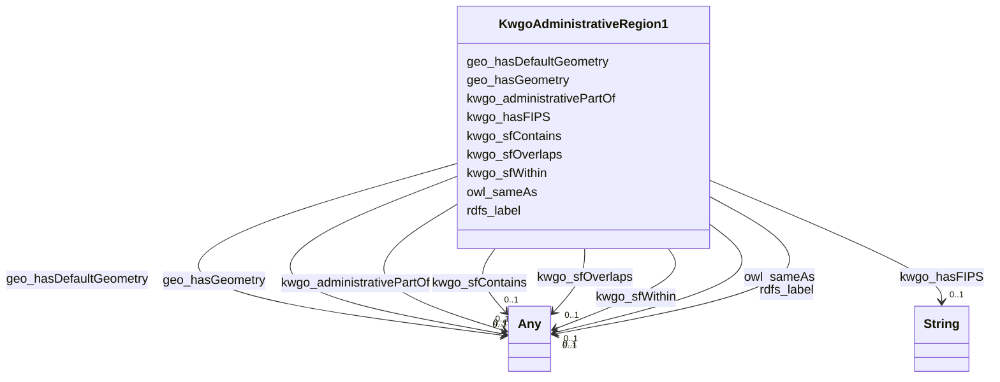

# Class: No class (type) name specified (kwgo_AdministrativeRegion_1)


_No class (type) description specified_


This class occurs 2 times.


URI: [kwgo:AdministrativeRegion_1](http://stko-kwg.geog.ucsb.edu/lod/ontology/AdministrativeRegion_1)





<!-- no inheritance hierarchy -->


## Slots

| Name | Cardinality and Range | Description | Inheritance | Occurrences |
| ---  | --- | --- | --- | --- |
| [kwgo_administrativePartOf](../slots/kwgo_administrativePartOf.md) | 0..1 <br/> [OwlThing](../classes/OwlThing.md)&nbsp;or&nbsp;<br />[KwgoAdministrativeRegion2](../classes/KwgoAdministrativeRegion2.md)&nbsp;or&nbsp;<br />[KwgoAdministrativeRegion1](../classes/KwgoAdministrativeRegion1.md) | No slot (predicate) description specified <br/>  | direct | 2 |
| [kwgo_sfOverlaps](../slots/kwgo_sfOverlaps.md) | 0..1 <br/> [OwlThing](../classes/OwlThing.md)&nbsp;or&nbsp;<br />[KwgoAdministrativeRegion1](../classes/KwgoAdministrativeRegion1.md)&nbsp;or&nbsp;<br />[KwgoAdministrativeRegion3](../classes/KwgoAdministrativeRegion3.md)&nbsp;or&nbsp;<br />[KwgoS2CellLevel13](../classes/KwgoS2CellLevel13.md)&nbsp;or&nbsp;<br />[KwgoAdministrativeRegion2](../classes/KwgoAdministrativeRegion2.md) | No slot (predicate) description specified <br/>  | direct | 9718 |
| [kwgo_sfContains](../slots/kwgo_sfContains.md) | 0..1 <br/> [OwlThing](../classes/OwlThing.md)&nbsp;or&nbsp;<br />[KwgoS2CellLevel13](../classes/KwgoS2CellLevel13.md) | No slot (predicate) description specified <br/>  | direct | 489408 |
| [owl_sameAs](../slots/owl_sameAs.md) | 0..1 <br/> [GeoGeometry](../classes/GeoGeometry.md)&nbsp;or&nbsp;<br />[RdfObjectProperty](../classes/RdfObjectProperty.md)&nbsp;or&nbsp;<br />[RdfList](../classes/RdfList.md)&nbsp;or&nbsp;<br />[KwgoAdministrativeRegion1](../classes/KwgoAdministrativeRegion1.md)&nbsp;or&nbsp;<br />[OwlThing](../classes/OwlThing.md)&nbsp;or&nbsp;<br />[xsd:anyURI](http://www.w3.org/2001/XMLSchema#anyURI)&nbsp;or&nbsp;<br />[Sf#Polygon](../classes/Sf#Polygon.md)&nbsp;or&nbsp;<br />[KwgoAdministrativeRegion3](../classes/KwgoAdministrativeRegion3.md)&nbsp;or&nbsp;<br />[KwgoAdministrativeRegion2](../classes/KwgoAdministrativeRegion2.md)&nbsp;or&nbsp;<br />[KwgoS2CellLevel13](../classes/KwgoS2CellLevel13.md) | No slot (predicate) description specified <br/>  | direct | 4 |
| [rdfs_label](../slots/rdfs_label.md) | 0..1 <br/> [xsd:string](http://www.w3.org/2001/XMLSchema#string)&nbsp;or&nbsp;<br />[xsd:anyURI](http://www.w3.org/2001/XMLSchema#anyURI) | No slot (predicate) description specified <br/>  | direct | 2 |
| [geo_hasGeometry](../slots/geo_hasGeometry.md) | 0..1 <br/> [Sf#Polygon](../classes/Sf#Polygon.md)&nbsp;or&nbsp;<br />[GeoGeometry](../classes/GeoGeometry.md)&nbsp;or&nbsp;<br />[OwlThing](../classes/OwlThing.md) | No slot (predicate) description specified <br/>  | direct | 6 |
| [kwgo_hasFIPS](../slots/kwgo_hasFIPS.md) | 0..1 <br/> [xsd:string](http://www.w3.org/2001/XMLSchema#string) | No slot (predicate) description specified <br/>  | direct | 2 |
| [geo_hasDefaultGeometry](../slots/geo_hasDefaultGeometry.md) | 0..1 <br/> [Sf#Polygon](../classes/Sf#Polygon.md)&nbsp;or&nbsp;<br />[GeoGeometry](../classes/GeoGeometry.md)&nbsp;or&nbsp;<br />[OwlThing](../classes/OwlThing.md) | No slot (predicate) description specified <br/>  | direct | 6 |
| [kwgo_sfWithin](../slots/kwgo_sfWithin.md) | 0..1 <br/> [OwlThing](../classes/OwlThing.md)&nbsp;or&nbsp;<br />[KwgoAdministrativeRegion2](../classes/KwgoAdministrativeRegion2.md)&nbsp;or&nbsp;<br />[KwgoAdministrativeRegion3](../classes/KwgoAdministrativeRegion3.md)&nbsp;or&nbsp;<br />[KwgoAdministrativeRegion1](../classes/KwgoAdministrativeRegion1.md) | No slot (predicate) description specified <br/>  | direct | 2 |


## Usages

| used by | used in | type | used |
| ---  | --- | --- | --- |
| [GeoGeometry](../classes/GeoGeometry.md) | [owl_sameAs](../slots/owl_sameAs.md) | any_of[range] | [KwgoAdministrativeRegion1](../classes/KwgoAdministrativeRegion1.md) |
| [KwgoAdministrativeRegion1](../classes/KwgoAdministrativeRegion1.md) | [kwgo_administrativePartOf](../slots/kwgo_administrativePartOf.md) | any_of[range] | [KwgoAdministrativeRegion1](../classes/KwgoAdministrativeRegion1.md) |
| [KwgoAdministrativeRegion1](../classes/KwgoAdministrativeRegion1.md) | [kwgo_sfOverlaps](../slots/kwgo_sfOverlaps.md) | any_of[range] | [KwgoAdministrativeRegion1](../classes/KwgoAdministrativeRegion1.md) |
| [KwgoAdministrativeRegion1](../classes/KwgoAdministrativeRegion1.md) | [owl_sameAs](../slots/owl_sameAs.md) | any_of[range] | [KwgoAdministrativeRegion1](../classes/KwgoAdministrativeRegion1.md) |
| [KwgoAdministrativeRegion1](../classes/KwgoAdministrativeRegion1.md) | [kwgo_sfWithin](../slots/kwgo_sfWithin.md) | any_of[range] | [KwgoAdministrativeRegion1](../classes/KwgoAdministrativeRegion1.md) |
| [KwgoAdministrativeRegion2](../classes/KwgoAdministrativeRegion2.md) | [kwgo_administrativePartOf](../slots/kwgo_administrativePartOf.md) | any_of[range] | [KwgoAdministrativeRegion1](../classes/KwgoAdministrativeRegion1.md) |
| [KwgoAdministrativeRegion2](../classes/KwgoAdministrativeRegion2.md) | [kwgo_sfOverlaps](../slots/kwgo_sfOverlaps.md) | any_of[range] | [KwgoAdministrativeRegion1](../classes/KwgoAdministrativeRegion1.md) |
| [KwgoAdministrativeRegion2](../classes/KwgoAdministrativeRegion2.md) | [owl_sameAs](../slots/owl_sameAs.md) | any_of[range] | [KwgoAdministrativeRegion1](../classes/KwgoAdministrativeRegion1.md) |
| [KwgoAdministrativeRegion2](../classes/KwgoAdministrativeRegion2.md) | [kwgo_sfWithin](../slots/kwgo_sfWithin.md) | any_of[range] | [KwgoAdministrativeRegion1](../classes/KwgoAdministrativeRegion1.md) |
| [KwgoAdministrativeRegion3](../classes/KwgoAdministrativeRegion3.md) | [kwgo_administrativePartOf](../slots/kwgo_administrativePartOf.md) | any_of[range] | [KwgoAdministrativeRegion1](../classes/KwgoAdministrativeRegion1.md) |
| [KwgoAdministrativeRegion3](../classes/KwgoAdministrativeRegion3.md) | [kwgo_sfOverlaps](../slots/kwgo_sfOverlaps.md) | any_of[range] | [KwgoAdministrativeRegion1](../classes/KwgoAdministrativeRegion1.md) |
| [KwgoAdministrativeRegion3](../classes/KwgoAdministrativeRegion3.md) | [owl_sameAs](../slots/owl_sameAs.md) | any_of[range] | [KwgoAdministrativeRegion1](../classes/KwgoAdministrativeRegion1.md) |
| [KwgoAdministrativeRegion3](../classes/KwgoAdministrativeRegion3.md) | [kwgo_sfWithin](../slots/kwgo_sfWithin.md) | any_of[range] | [KwgoAdministrativeRegion1](../classes/KwgoAdministrativeRegion1.md) |
| [KwgoS2CellLevel13](../classes/KwgoS2CellLevel13.md) | [kwgo_sfOverlaps](../slots/kwgo_sfOverlaps.md) | any_of[range] | [KwgoAdministrativeRegion1](../classes/KwgoAdministrativeRegion1.md) |
| [KwgoS2CellLevel13](../classes/KwgoS2CellLevel13.md) | [owl_sameAs](../slots/owl_sameAs.md) | any_of[range] | [KwgoAdministrativeRegion1](../classes/KwgoAdministrativeRegion1.md) |
| [KwgoS2CellLevel13](../classes/KwgoS2CellLevel13.md) | [kwgo_sfWithin](../slots/kwgo_sfWithin.md) | any_of[range] | [KwgoAdministrativeRegion1](../classes/KwgoAdministrativeRegion1.md) |
| [OwlNamedIndividual](../classes/OwlNamedIndividual.md) | [kwgo_administrativePartOf](../slots/kwgo_administrativePartOf.md) | any_of[range] | [KwgoAdministrativeRegion1](../classes/KwgoAdministrativeRegion1.md) |
| [OwlNamedIndividual](../classes/OwlNamedIndividual.md) | [kwgo_sfOverlaps](../slots/kwgo_sfOverlaps.md) | any_of[range] | [KwgoAdministrativeRegion1](../classes/KwgoAdministrativeRegion1.md) |
| [OwlNamedIndividual](../classes/OwlNamedIndividual.md) | [owl_sameAs](../slots/owl_sameAs.md) | any_of[range] | [KwgoAdministrativeRegion1](../classes/KwgoAdministrativeRegion1.md) |
| [OwlNamedIndividual](../classes/OwlNamedIndividual.md) | [kwgo_sfWithin](../slots/kwgo_sfWithin.md) | any_of[range] | [KwgoAdministrativeRegion1](../classes/KwgoAdministrativeRegion1.md) |
| [OwlNothing](../classes/OwlNothing.md) | [kwgo_administrativePartOf](../slots/kwgo_administrativePartOf.md) | any_of[range] | [KwgoAdministrativeRegion1](../classes/KwgoAdministrativeRegion1.md) |
| [OwlNothing](../classes/OwlNothing.md) | [kwgo_sfOverlaps](../slots/kwgo_sfOverlaps.md) | any_of[range] | [KwgoAdministrativeRegion1](../classes/KwgoAdministrativeRegion1.md) |
| [OwlNothing](../classes/OwlNothing.md) | [owl_sameAs](../slots/owl_sameAs.md) | any_of[range] | [KwgoAdministrativeRegion1](../classes/KwgoAdministrativeRegion1.md) |
| [OwlNothing](../classes/OwlNothing.md) | [kwgo_sfWithin](../slots/kwgo_sfWithin.md) | any_of[range] | [KwgoAdministrativeRegion1](../classes/KwgoAdministrativeRegion1.md) |
| [OwlThing](../classes/OwlThing.md) | [kwgo_administrativePartOf](../slots/kwgo_administrativePartOf.md) | any_of[range] | [KwgoAdministrativeRegion1](../classes/KwgoAdministrativeRegion1.md) |
| [OwlThing](../classes/OwlThing.md) | [kwgo_sfOverlaps](../slots/kwgo_sfOverlaps.md) | any_of[range] | [KwgoAdministrativeRegion1](../classes/KwgoAdministrativeRegion1.md) |
| [OwlThing](../classes/OwlThing.md) | [owl_sameAs](../slots/owl_sameAs.md) | any_of[range] | [KwgoAdministrativeRegion1](../classes/KwgoAdministrativeRegion1.md) |
| [OwlThing](../classes/OwlThing.md) | [kwgo_sfWithin](../slots/kwgo_sfWithin.md) | any_of[range] | [KwgoAdministrativeRegion1](../classes/KwgoAdministrativeRegion1.md) |
| [RdfList](../classes/RdfList.md) | [owl_sameAs](../slots/owl_sameAs.md) | any_of[range] | [KwgoAdministrativeRegion1](../classes/KwgoAdministrativeRegion1.md) |
| [RdfObjectProperty](../classes/RdfObjectProperty.md) | [owl_sameAs](../slots/owl_sameAs.md) | any_of[range] | [KwgoAdministrativeRegion1](../classes/KwgoAdministrativeRegion1.md) |
| [Sf#Polygon](../classes/Sf#Polygon.md) | [owl_sameAs](../slots/owl_sameAs.md) | any_of[range] | [KwgoAdministrativeRegion1](../classes/KwgoAdministrativeRegion1.md) |


## LinkML Source

<!-- TODO: investigate https://stackoverflow.com/questions/37606292/how-to-create-tabbed-code-blocks-in-mkdocs-or-sphinx -->

### Direct

<details>

```yaml
name: kwgo_AdministrativeRegion_1
conforms_to: No schema conformance document specified
annotations:
  count:
    tag: count
    value: 2
description: No class (type) description specified
title: No class (type) name specified
from_schema: spatial-kg
rank: 1000
slots:
- kwgo_administrativePartOf
- kwgo_sfOverlaps
- kwgo_sfContains
- owl_sameAs
- rdfs_label
- geo_hasGeometry
- kwgo_hasFIPS
- geo_hasDefaultGeometry
- kwgo_sfWithin
slot_usage:
  geo_hasDefaultGeometry:
    name: geo_hasDefaultGeometry
    annotations:
      geo_Geometry:
        tag: geo_Geometry
        value: 2
      owl_Thing:
        tag: owl_Thing
        value: 2
      sf_#Polygon:
        tag: sf_#Polygon
        value: 2
  geo_hasGeometry:
    name: geo_hasGeometry
    annotations:
      geo_Geometry:
        tag: geo_Geometry
        value: 2
      owl_Thing:
        tag: owl_Thing
        value: 2
      sf_#Polygon:
        tag: sf_#Polygon
        value: 2
  kwgo_administrativePartOf:
    name: kwgo_administrativePartOf
    annotations:
      owl_Thing:
        tag: owl_Thing
        value: 2
  kwgo_hasFIPS:
    name: kwgo_hasFIPS
    annotations:
      string:
        tag: string
        value: 2
  kwgo_sfContains:
    name: kwgo_sfContains
    annotations:
      kwgo_S2Cell_Level13:
        tag: kwgo_S2Cell_Level13
        value: 244704
      owl_Thing:
        tag: owl_Thing
        value: 244704
  kwgo_sfOverlaps:
    name: kwgo_sfOverlaps
    annotations:
      kwgo_S2Cell_Level13:
        tag: kwgo_S2Cell_Level13
        value: 4845
      owl_Thing:
        tag: owl_Thing
        value: 4873
  kwgo_sfWithin:
    name: kwgo_sfWithin
    annotations:
      owl_Thing:
        tag: owl_Thing
        value: 2
  owl_sameAs:
    name: owl_sameAs
    annotations:
      kwgo_AdministrativeRegion_1:
        tag: kwgo_AdministrativeRegion_1
        value: 2
      owl_Thing:
        tag: owl_Thing
        value: 2
  rdfs_label:
    name: rdfs_label
    annotations:
      string:
        tag: string
        value: 2
class_uri: kwgo:AdministrativeRegion_1

```
</details>

### Induced

<details>

```yaml
name: kwgo_AdministrativeRegion_1
conforms_to: No schema conformance document specified
annotations:
  count:
    tag: count
    value: 2
description: No class (type) description specified
title: No class (type) name specified
from_schema: spatial-kg
rank: 1000
slot_usage:
  geo_hasDefaultGeometry:
    name: geo_hasDefaultGeometry
    annotations:
      geo_Geometry:
        tag: geo_Geometry
        value: 2
      owl_Thing:
        tag: owl_Thing
        value: 2
      sf_#Polygon:
        tag: sf_#Polygon
        value: 2
  geo_hasGeometry:
    name: geo_hasGeometry
    annotations:
      geo_Geometry:
        tag: geo_Geometry
        value: 2
      owl_Thing:
        tag: owl_Thing
        value: 2
      sf_#Polygon:
        tag: sf_#Polygon
        value: 2
  kwgo_administrativePartOf:
    name: kwgo_administrativePartOf
    annotations:
      owl_Thing:
        tag: owl_Thing
        value: 2
  kwgo_hasFIPS:
    name: kwgo_hasFIPS
    annotations:
      string:
        tag: string
        value: 2
  kwgo_sfContains:
    name: kwgo_sfContains
    annotations:
      kwgo_S2Cell_Level13:
        tag: kwgo_S2Cell_Level13
        value: 244704
      owl_Thing:
        tag: owl_Thing
        value: 244704
  kwgo_sfOverlaps:
    name: kwgo_sfOverlaps
    annotations:
      kwgo_S2Cell_Level13:
        tag: kwgo_S2Cell_Level13
        value: 4845
      owl_Thing:
        tag: owl_Thing
        value: 4873
  kwgo_sfWithin:
    name: kwgo_sfWithin
    annotations:
      owl_Thing:
        tag: owl_Thing
        value: 2
  owl_sameAs:
    name: owl_sameAs
    annotations:
      kwgo_AdministrativeRegion_1:
        tag: kwgo_AdministrativeRegion_1
        value: 2
      owl_Thing:
        tag: owl_Thing
        value: 2
  rdfs_label:
    name: rdfs_label
    annotations:
      string:
        tag: string
        value: 2
attributes:
  kwgo_administrativePartOf:
    name: kwgo_administrativePartOf
    annotations:
      owl_Thing:
        tag: owl_Thing
        value: 2
    description: No slot (predicate) description specified
    title: No slot (predicate) name specified
    examples:
    - object:
        example_object: kwgr:administrativeRegion.USA
        example_object_type: owl_Thing
        example_predicate: kwgo:administrativePartOf
        example_subject: kwgr:administrativeRegion.USA.17
        example_subject_type: kwgo_AdministrativeRegion_1
    - object:
        example_object: kwgr:administrativeRegion.USA
        example_object_type: owl_Thing
        example_predicate: kwgo:administrativePartOf
        example_subject: kwgr:administrativeRegion.USA.17
        example_subject_type: owl_Thing
    - object:
        example_object: kwgr:administrativeRegion.USA.17
        example_object_type: kwgo_AdministrativeRegion_1
        example_predicate: kwgo:administrativePartOf
        example_subject: kwgr:administrativeRegion.USA.17001
        example_subject_type: kwgo_AdministrativeRegion_2
    - object:
        example_object: kwgr:administrativeRegion.USA.17
        example_object_type: owl_Thing
        example_predicate: kwgo:administrativePartOf
        example_subject: kwgr:administrativeRegion.USA.17001
        example_subject_type: kwgo_AdministrativeRegion_2
    - object:
        example_object: kwgr:administrativeRegion.USA.17
        example_object_type: kwgo_AdministrativeRegion_1
        example_predicate: kwgo:administrativePartOf
        example_subject: kwgr:administrativeRegion.USA.17001
        example_subject_type: owl_Thing
    - object:
        example_object: kwgr:administrativeRegion.USA.17001
        example_object_type: kwgo_AdministrativeRegion_2
        example_predicate: kwgo:administrativePartOf
        example_subject: https://datacommons.org/browser/geoId/1700105742
        example_subject_type: owl_Thing
    - object:
        example_object: kwgr:administrativeRegion.USA.17001
        example_object_type: kwgo_AdministrativeRegion_2
        example_predicate: kwgo:administrativePartOf
        example_subject: https://datacommons.org/browser/geoId/1700105742
        example_subject_type: kwgo_AdministrativeRegion_3
    - object:
        example_object: kwgr:administrativeRegion.USA.17001
        example_object_type: owl_Thing
        example_predicate: kwgo:administrativePartOf
        example_subject: https://datacommons.org/browser/geoId/1700105742
        example_subject_type: kwgo_AdministrativeRegion_3
    from_schema: spatial-kg
    rank: 1000
    slot_uri: kwgo:administrativePartOf
    alias: kwgo_administrativePartOf
    owner: kwgo_AdministrativeRegion_1
    domain_of:
    - kwgo_AdministrativeRegion_1
    - kwgo_AdministrativeRegion_2
    - kwgo_AdministrativeRegion_3
    - owl_Thing
    range: Any
    any_of:
    - range: owl_Thing
    - range: kwgo_AdministrativeRegion_2
    - range: kwgo_AdministrativeRegion_1
  kwgo_sfOverlaps:
    name: kwgo_sfOverlaps
    annotations:
      kwgo_S2Cell_Level13:
        tag: kwgo_S2Cell_Level13
        value: 4845
      owl_Thing:
        tag: owl_Thing
        value: 4873
    description: No slot (predicate) description specified
    title: No slot (predicate) name specified
    examples:
    - object:
        example_object: kwgr:s2.level13.9788714407319044096
        example_object_type: kwgo_S2Cell_Level13
        example_predicate: kwgo:sfOverlaps
        example_subject: kwgr:administrativeRegion.USA.17
        example_subject_type: kwgo_AdministrativeRegion_1
    - object:
        example_object: kwgr:s2.level13.9788714407319044096
        example_object_type: owl_Thing
        example_predicate: kwgo:sfOverlaps
        example_subject: kwgr:administrativeRegion.USA.17
        example_subject_type: kwgo_AdministrativeRegion_1
    - object:
        example_object: kwgr:s2.level13.9788714407319044096
        example_object_type: kwgo_S2Cell_Level13
        example_predicate: kwgo:sfOverlaps
        example_subject: kwgr:administrativeRegion.USA.17
        example_subject_type: owl_Thing
    - object:
        example_object: kwgr:s2.level13.9788714407319044096
        example_object_type: owl_Thing
        example_predicate: kwgo:sfOverlaps
        example_subject: kwgr:administrativeRegion.USA.17
        example_subject_type: owl_Thing
    - object:
        example_object: kwgr:s2.level13.9790229946658979840
        example_object_type: kwgo_S2Cell_Level13
        example_predicate: kwgo:sfOverlaps
        example_subject: kwgr:administrativeRegion.USA.17001
        example_subject_type: kwgo_AdministrativeRegion_2
    - object:
        example_object: kwgr:s2.level13.9790229946658979840
        example_object_type: owl_Thing
        example_predicate: kwgo:sfOverlaps
        example_subject: kwgr:administrativeRegion.USA.17001
        example_subject_type: kwgo_AdministrativeRegion_2
    - object:
        example_object: kwgr:administrativeRegion.USA.23
        example_object_type: kwgo_AdministrativeRegion_1
        example_predicate: kwgo:sfOverlaps
        example_subject: kwgr:s2.level13.5522341869704445952
        example_subject_type: kwgo_S2Cell_Level13
    - object:
        example_object: kwgr:administrativeRegion.USA.23
        example_object_type: owl_Thing
        example_predicate: kwgo:sfOverlaps
        example_subject: kwgr:s2.level13.5522341869704445952
        example_subject_type: kwgo_S2Cell_Level13
    - object:
        example_object: kwgr:administrativeRegion.USA.23
        example_object_type: kwgo_AdministrativeRegion_1
        example_predicate: kwgo:sfOverlaps
        example_subject: kwgr:s2.level13.5522341869704445952
        example_subject_type: owl_Thing
    - object:
        example_object: kwgr:administrativeRegion.USA.23003
        example_object_type: kwgo_AdministrativeRegion_2
        example_predicate: kwgo:sfOverlaps
        example_subject: kwgr:s2.level13.5522341869704445952
        example_subject_type: kwgo_S2Cell_Level13
    - object:
        example_object: kwgr:administrativeRegion.USA.23003
        example_object_type: kwgo_AdministrativeRegion_2
        example_predicate: kwgo:sfOverlaps
        example_subject: kwgr:s2.level13.5522341869704445952
        example_subject_type: owl_Thing
    - object:
        example_object: https://datacommons.org/browser/geoId/2300325615
        example_object_type: kwgo_AdministrativeRegion_3
        example_predicate: kwgo:sfOverlaps
        example_subject: kwgr:s2.level13.5522341869704445952
        example_subject_type: kwgo_S2Cell_Level13
    - object:
        example_object: https://datacommons.org/browser/geoId/2300325615
        example_object_type: kwgo_AdministrativeRegion_3
        example_predicate: kwgo:sfOverlaps
        example_subject: kwgr:s2.level13.5522341869704445952
        example_subject_type: owl_Thing
    - object:
        example_object: kwgr:s2.level13.9790280524193857536
        example_object_type: kwgo_S2Cell_Level13
        example_predicate: kwgo:sfOverlaps
        example_subject: https://datacommons.org/browser/geoId/1700105742
        example_subject_type: kwgo_AdministrativeRegion_3
    - object:
        example_object: kwgr:s2.level13.9790280524193857536
        example_object_type: owl_Thing
        example_predicate: kwgo:sfOverlaps
        example_subject: https://datacommons.org/browser/geoId/1700105742
        example_subject_type: kwgo_AdministrativeRegion_3
    from_schema: spatial-kg
    rank: 1000
    slot_uri: kwgo:sfOverlaps
    alias: kwgo_sfOverlaps
    owner: kwgo_AdministrativeRegion_1
    domain_of:
    - kwgo_AdministrativeRegion_1
    - kwgo_AdministrativeRegion_2
    - kwgo_AdministrativeRegion_3
    - kwgo_S2Cell_Level13
    - owl_Thing
    range: Any
    any_of:
    - range: owl_Thing
    - range: kwgo_AdministrativeRegion_1
    - range: kwgo_AdministrativeRegion_3
    - range: kwgo_S2Cell_Level13
    - range: kwgo_AdministrativeRegion_2
  kwgo_sfContains:
    name: kwgo_sfContains
    annotations:
      kwgo_S2Cell_Level13:
        tag: kwgo_S2Cell_Level13
        value: 244704
      owl_Thing:
        tag: owl_Thing
        value: 244704
    description: No slot (predicate) description specified
    title: No slot (predicate) name specified
    examples:
    - object:
        example_object: kwgr:s2.level13.9788714544757997568
        example_object_type: kwgo_S2Cell_Level13
        example_predicate: kwgo:sfContains
        example_subject: kwgr:administrativeRegion.USA.17
        example_subject_type: kwgo_AdministrativeRegion_1
    - object:
        example_object: kwgr:s2.level13.9788714544757997568
        example_object_type: owl_Thing
        example_predicate: kwgo:sfContains
        example_subject: kwgr:administrativeRegion.USA.17
        example_subject_type: kwgo_AdministrativeRegion_1
    - object:
        example_object: kwgr:s2.level13.9788714544757997568
        example_object_type: kwgo_S2Cell_Level13
        example_predicate: kwgo:sfContains
        example_subject: kwgr:administrativeRegion.USA.17
        example_subject_type: owl_Thing
    - object:
        example_object: kwgr:s2.level13.9788714544757997568
        example_object_type: owl_Thing
        example_predicate: kwgo:sfContains
        example_subject: kwgr:administrativeRegion.USA.17
        example_subject_type: owl_Thing
    - object:
        example_object: kwgr:s2.level13.9790230015378456576
        example_object_type: kwgo_S2Cell_Level13
        example_predicate: kwgo:sfContains
        example_subject: kwgr:administrativeRegion.USA.17001
        example_subject_type: kwgo_AdministrativeRegion_2
    - object:
        example_object: kwgr:s2.level13.9790230015378456576
        example_object_type: owl_Thing
        example_predicate: kwgo:sfContains
        example_subject: kwgr:administrativeRegion.USA.17001
        example_subject_type: kwgo_AdministrativeRegion_2
    - object:
        example_object: kwgr:s2.level13.9790280627273072640
        example_object_type: kwgo_S2Cell_Level13
        example_predicate: kwgo:sfContains
        example_subject: https://datacommons.org/browser/geoId/1700105742
        example_subject_type: kwgo_AdministrativeRegion_3
    - object:
        example_object: kwgr:s2.level13.9790280627273072640
        example_object_type: owl_Thing
        example_predicate: kwgo:sfContains
        example_subject: https://datacommons.org/browser/geoId/1700105742
        example_subject_type: kwgo_AdministrativeRegion_3
    from_schema: spatial-kg
    rank: 1000
    slot_uri: kwgo:sfContains
    alias: kwgo_sfContains
    owner: kwgo_AdministrativeRegion_1
    domain_of:
    - kwgo_AdministrativeRegion_1
    - kwgo_AdministrativeRegion_2
    - kwgo_AdministrativeRegion_3
    - owl_Thing
    range: Any
    any_of:
    - range: owl_Thing
    - range: kwgo_S2Cell_Level13
  owl_sameAs:
    name: owl_sameAs
    annotations:
      kwgo_AdministrativeRegion_1:
        tag: kwgo_AdministrativeRegion_1
        value: 2
      owl_Thing:
        tag: owl_Thing
        value: 2
    description: No slot (predicate) description specified
    title: No slot (predicate) name specified
    examples:
    - object:
        example_object: http://sawgraph.spatialai.org/v1/saw_geo#d.Polygon.administrativeRegion.USA.1700105742
        example_object_type: sf_#Polygon
        example_predicate: owl:sameAs
        example_subject: http://sawgraph.spatialai.org/v1/saw_geo#d.Polygon.administrativeRegion.USA.1700105742
        example_subject_type: geo_Geometry
    - object:
        example_object: http://sawgraph.spatialai.org/v1/saw_geo#d.Polygon.administrativeRegion.USA.1700105742
        example_object_type: geo_Geometry
        example_predicate: owl:sameAs
        example_subject: http://sawgraph.spatialai.org/v1/saw_geo#d.Polygon.administrativeRegion.USA.1700105742
        example_subject_type: geo_Geometry
    - object:
        example_object: http://sawgraph.spatialai.org/v1/saw_geo#d.Polygon.administrativeRegion.USA.1700105742
        example_object_type: owl_Thing
        example_predicate: owl:sameAs
        example_subject: http://sawgraph.spatialai.org/v1/saw_geo#d.Polygon.administrativeRegion.USA.1700105742
        example_subject_type: geo_Geometry
    - object:
        example_object: http://sawgraph.spatialai.org/v1/saw_geo#d.Polygon.administrativeRegion.USA.1700105742
        example_object_type: sf_#Polygon
        example_predicate: owl:sameAs
        example_subject: http://sawgraph.spatialai.org/v1/saw_geo#d.Polygon.administrativeRegion.USA.1700105742
        example_subject_type: sf_#Polygon
    - object:
        example_object: http://sawgraph.spatialai.org/v1/saw_geo#d.Polygon.administrativeRegion.USA.1700105742
        example_object_type: geo_Geometry
        example_predicate: owl:sameAs
        example_subject: http://sawgraph.spatialai.org/v1/saw_geo#d.Polygon.administrativeRegion.USA.1700105742
        example_subject_type: sf_#Polygon
    - object:
        example_object: http://sawgraph.spatialai.org/v1/saw_geo#d.Polygon.administrativeRegion.USA.1700105742
        example_object_type: owl_Thing
        example_predicate: owl:sameAs
        example_subject: http://sawgraph.spatialai.org/v1/saw_geo#d.Polygon.administrativeRegion.USA.1700105742
        example_subject_type: sf_#Polygon
    - object:
        example_object: http://sawgraph.spatialai.org/v1/saw_geo#d.Polygon.administrativeRegion.USA.1700105742
        example_object_type: sf_#Polygon
        example_predicate: owl:sameAs
        example_subject: http://sawgraph.spatialai.org/v1/saw_geo#d.Polygon.administrativeRegion.USA.1700105742
        example_subject_type: owl_Thing
    - object:
        example_object: http://sawgraph.spatialai.org/v1/saw_geo#d.Polygon.administrativeRegion.USA.1700105742
        example_object_type: geo_Geometry
        example_predicate: owl:sameAs
        example_subject: http://sawgraph.spatialai.org/v1/saw_geo#d.Polygon.administrativeRegion.USA.1700105742
        example_subject_type: owl_Thing
    - object:
        example_object: http://sawgraph.spatialai.org/v1/saw_geo#d.Polygon.administrativeRegion.USA.1700105742
        example_object_type: owl_Thing
        example_predicate: owl:sameAs
        example_subject: http://sawgraph.spatialai.org/v1/saw_geo#d.Polygon.administrativeRegion.USA.1700105742
        example_subject_type: owl_Thing
    - object:
        example_object: kwgr:administrativeRegion.USA.17
        example_object_type: kwgo_AdministrativeRegion_1
        example_predicate: owl:sameAs
        example_subject: kwgr:administrativeRegion.USA.17
        example_subject_type: kwgo_AdministrativeRegion_1
    - object:
        example_object: kwgr:administrativeRegion.USA.17
        example_object_type: owl_Thing
        example_predicate: owl:sameAs
        example_subject: kwgr:administrativeRegion.USA.17
        example_subject_type: kwgo_AdministrativeRegion_1
    - object:
        example_object: kwgr:administrativeRegion.USA.17
        example_object_type: kwgo_AdministrativeRegion_1
        example_predicate: owl:sameAs
        example_subject: kwgr:administrativeRegion.USA.17
        example_subject_type: owl_Thing
    - object:
        example_object: kwgr:administrativeRegion.USA.17001
        example_object_type: kwgo_AdministrativeRegion_2
        example_predicate: owl:sameAs
        example_subject: kwgr:administrativeRegion.USA.17001
        example_subject_type: kwgo_AdministrativeRegion_2
    - object:
        example_object: kwgr:administrativeRegion.USA.17001
        example_object_type: owl_Thing
        example_predicate: owl:sameAs
        example_subject: kwgr:administrativeRegion.USA.17001
        example_subject_type: kwgo_AdministrativeRegion_2
    - object:
        example_object: kwgr:administrativeRegion.USA.17001
        example_object_type: kwgo_AdministrativeRegion_2
        example_predicate: owl:sameAs
        example_subject: kwgr:administrativeRegion.USA.17001
        example_subject_type: owl_Thing
    - object:
        example_object: kwgr:s2.level13.5522341869704445952
        example_object_type: kwgo_S2Cell_Level13
        example_predicate: owl:sameAs
        example_subject: kwgr:s2.level13.5522341869704445952
        example_subject_type: kwgo_S2Cell_Level13
    - object:
        example_object: kwgr:s2.level13.5522341869704445952
        example_object_type: owl_Thing
        example_predicate: owl:sameAs
        example_subject: kwgr:s2.level13.5522341869704445952
        example_subject_type: kwgo_S2Cell_Level13
    - object:
        example_object: kwgr:s2.level13.5522341869704445952
        example_object_type: kwgo_S2Cell_Level13
        example_predicate: owl:sameAs
        example_subject: kwgr:s2.level13.5522341869704445952
        example_subject_type: owl_Thing
    - object:
        example_object: rdf:nil
        example_object_type: rdf_List
        example_predicate: owl:sameAs
        example_subject: rdf:nil
        example_subject_type: owl_Thing
    - object:
        example_object: rdf:nil
        example_object_type: owl_Thing
        example_predicate: owl:sameAs
        example_subject: rdf:nil
        example_subject_type: rdf_List
    - object:
        example_object: rdf:nil
        example_object_type: rdf_List
        example_predicate: owl:sameAs
        example_subject: rdf:nil
        example_subject_type: rdf_List
    - object:
        example_object: owl:topObjectProperty
        example_object_type: rdf_ObjectProperty
        example_predicate: owl:sameAs
        example_subject: owl:topObjectProperty
        example_subject_type: rdf_ObjectProperty
    - object:
        example_object: owl:topObjectProperty
        example_object_type: owl_Thing
        example_predicate: owl:sameAs
        example_subject: owl:topObjectProperty
        example_subject_type: rdf_ObjectProperty
    - object:
        example_object: owl:topObjectProperty
        example_object_type: rdf_ObjectProperty
        example_predicate: owl:sameAs
        example_subject: owl:topObjectProperty
        example_subject_type: owl_Thing
    - object:
        example_object: https://datacommons.org/browser/geoId/1700105742
        example_object_type: kwgo_AdministrativeRegion_3
        example_predicate: owl:sameAs
        example_subject: https://datacommons.org/browser/geoId/1700105742
        example_subject_type: owl_Thing
    - object:
        example_object: https://datacommons.org/browser/geoId/1700105742
        example_object_type: owl_Thing
        example_predicate: owl:sameAs
        example_subject: https://datacommons.org/browser/geoId/1700105742
        example_subject_type: kwgo_AdministrativeRegion_3
    - object:
        example_object: https://datacommons.org/browser/geoId/1700105742
        example_object_type: kwgo_AdministrativeRegion_3
        example_predicate: owl:sameAs
        example_subject: https://datacommons.org/browser/geoId/1700105742
        example_subject_type: kwgo_AdministrativeRegion_3
    from_schema: spatial-kg
    rank: 1000
    domain: owl_sameAs
    slot_uri: owl:sameAs
    alias: owl_sameAs
    owner: kwgo_AdministrativeRegion_1
    domain_of:
    - geo_Geometry
    - kwgo_AdministrativeRegion_1
    - kwgo_AdministrativeRegion_2
    - kwgo_AdministrativeRegion_3
    - kwgo_S2Cell_Level13
    - owl_Thing
    - rdf_List
    - rdf_ObjectProperty
    - sf_#Polygon
    range: Any
    any_of:
    - range: geo_Geometry
    - range: rdf_ObjectProperty
    - range: rdf_List
    - range: kwgo_AdministrativeRegion_1
    - range: owl_Thing
    - range: uri
    - range: sf_#Polygon
    - range: kwgo_AdministrativeRegion_3
    - range: kwgo_AdministrativeRegion_2
    - range: kwgo_S2Cell_Level13
  rdfs_label:
    name: rdfs_label
    annotations:
      string:
        tag: string
        value: 2
    description: No slot (predicate) description specified
    title: No slot (predicate) name specified
    examples:
    - object:
        example_object: Geometry of Beverly township, Illinois
        example_object_type: string
        example_predicate: rdfs:label
        example_subject: http://sawgraph.spatialai.org/v1/saw_geo#d.Polygon.administrativeRegion.USA.1700105742
        example_subject_type: geo_Geometry
    - object:
        example_object: Geometry of Beverly township, Illinois
        example_object_type: string
        example_predicate: rdfs:label
        example_subject: http://sawgraph.spatialai.org/v1/saw_geo#d.Polygon.administrativeRegion.USA.1700105742
        example_subject_type: sf_#Polygon
    - object:
        example_object: Geometry of Beverly township, Illinois
        example_object_type: string
        example_predicate: rdfs:label
        example_subject: http://sawgraph.spatialai.org/v1/saw_geo#d.Polygon.administrativeRegion.USA.1700105742
        example_subject_type: owl_Thing
    - object:
        example_object: Illinois
        example_object_type: string
        example_predicate: rdfs:label
        example_subject: kwgr:administrativeRegion.USA.17
        example_subject_type: kwgo_AdministrativeRegion_1
    - object:
        example_object: Adams County, Illinois
        example_object_type: string
        example_predicate: rdfs:label
        example_subject: kwgr:administrativeRegion.USA.17001
        example_subject_type: kwgo_AdministrativeRegion_2
    - object:
        example_object: S2 Cell at level 13 with ID 5522341869704445952
        example_object_type: string
        example_predicate: rdfs:label
        example_subject: kwgr:s2.level13.5522341869704445952
        example_subject_type: kwgo_S2Cell_Level13
    - object:
        example_object: Beverly township, Illinois
        example_object_type: string
        example_predicate: rdfs:label
        example_subject: https://datacommons.org/browser/geoId/1700105742
        example_subject_type: kwgo_AdministrativeRegion_3
    from_schema: spatial-kg
    rank: 1000
    slot_uri: rdfs:label
    alias: rdfs_label
    owner: kwgo_AdministrativeRegion_1
    domain_of:
    - geo_Geometry
    - kwgo_AdministrativeRegion_1
    - kwgo_AdministrativeRegion_2
    - kwgo_AdministrativeRegion_3
    - kwgo_S2Cell_Level13
    - owl_Thing
    - sf_#Polygon
    range: Any
    any_of:
    - range: string
    - range: uri
  geo_hasGeometry:
    name: geo_hasGeometry
    annotations:
      geo_Geometry:
        tag: geo_Geometry
        value: 2
      owl_Thing:
        tag: owl_Thing
        value: 2
      sf_#Polygon:
        tag: sf_#Polygon
        value: 2
    description: No slot (predicate) description specified
    title: No slot (predicate) name specified
    examples:
    - object:
        example_object: kwgr:geometry.Polygon.administrativeRegion.USA.17
        example_object_type: sf_#Polygon
        example_predicate: geo:hasGeometry
        example_subject: kwgr:administrativeRegion.USA.17
        example_subject_type: kwgo_AdministrativeRegion_1
    - object:
        example_object: kwgr:geometry.Polygon.administrativeRegion.USA.17
        example_object_type: geo_Geometry
        example_predicate: geo:hasGeometry
        example_subject: kwgr:administrativeRegion.USA.17
        example_subject_type: kwgo_AdministrativeRegion_1
    - object:
        example_object: kwgr:geometry.Polygon.administrativeRegion.USA.17
        example_object_type: owl_Thing
        example_predicate: geo:hasGeometry
        example_subject: kwgr:administrativeRegion.USA.17
        example_subject_type: kwgo_AdministrativeRegion_1
    - object:
        example_object: kwgr:geometry.Polygon.administrativeRegion.USA.17
        example_object_type: sf_#Polygon
        example_predicate: geo:hasGeometry
        example_subject: kwgr:administrativeRegion.USA.17
        example_subject_type: owl_Thing
    - object:
        example_object: kwgr:geometry.Polygon.administrativeRegion.USA.17
        example_object_type: geo_Geometry
        example_predicate: geo:hasGeometry
        example_subject: kwgr:administrativeRegion.USA.17
        example_subject_type: owl_Thing
    - object:
        example_object: kwgr:geometry.Polygon.administrativeRegion.USA.17
        example_object_type: owl_Thing
        example_predicate: geo:hasGeometry
        example_subject: kwgr:administrativeRegion.USA.17
        example_subject_type: owl_Thing
    - object:
        example_object: kwgr:geometry.Polygon.administrativeRegion.USA.17001
        example_object_type: geo_Geometry
        example_predicate: geo:hasGeometry
        example_subject: kwgr:administrativeRegion.USA.17001
        example_subject_type: kwgo_AdministrativeRegion_2
    - object:
        example_object: kwgr:geometry.Polygon.administrativeRegion.USA.17001
        example_object_type: owl_Thing
        example_predicate: geo:hasGeometry
        example_subject: kwgr:administrativeRegion.USA.17001
        example_subject_type: kwgo_AdministrativeRegion_2
    - object:
        example_object: kwgr:geometry.polygon.s2.level13.5522341869704445952
        example_object_type: sf_#Polygon
        example_predicate: geo:hasGeometry
        example_subject: kwgr:s2.level13.5522341869704445952
        example_subject_type: kwgo_S2Cell_Level13
    - object:
        example_object: kwgr:geometry.polygon.s2.level13.5522341869704445952
        example_object_type: geo_Geometry
        example_predicate: geo:hasGeometry
        example_subject: kwgr:s2.level13.5522341869704445952
        example_subject_type: kwgo_S2Cell_Level13
    - object:
        example_object: kwgr:geometry.polygon.s2.level13.5522341869704445952
        example_object_type: owl_Thing
        example_predicate: geo:hasGeometry
        example_subject: kwgr:s2.level13.5522341869704445952
        example_subject_type: kwgo_S2Cell_Level13
    - object:
        example_object: http://sawgraph.spatialai.org/v1/saw_geo#d.Polygon.administrativeRegion.USA.1700105742
        example_object_type: sf_#Polygon
        example_predicate: geo:hasGeometry
        example_subject: https://datacommons.org/browser/geoId/1700105742
        example_subject_type: kwgo_AdministrativeRegion_3
    - object:
        example_object: http://sawgraph.spatialai.org/v1/saw_geo#d.Polygon.administrativeRegion.USA.1700105742
        example_object_type: geo_Geometry
        example_predicate: geo:hasGeometry
        example_subject: https://datacommons.org/browser/geoId/1700105742
        example_subject_type: kwgo_AdministrativeRegion_3
    - object:
        example_object: http://sawgraph.spatialai.org/v1/saw_geo#d.Polygon.administrativeRegion.USA.1700105742
        example_object_type: owl_Thing
        example_predicate: geo:hasGeometry
        example_subject: https://datacommons.org/browser/geoId/1700105742
        example_subject_type: kwgo_AdministrativeRegion_3
    from_schema: spatial-kg
    rank: 1000
    slot_uri: geo:hasGeometry
    alias: geo_hasGeometry
    owner: kwgo_AdministrativeRegion_1
    domain_of:
    - kwgo_AdministrativeRegion_1
    - kwgo_AdministrativeRegion_2
    - kwgo_AdministrativeRegion_3
    - kwgo_S2Cell_Level13
    - owl_Thing
    range: Any
    any_of:
    - range: sf_#Polygon
    - range: geo_Geometry
    - range: owl_Thing
  kwgo_hasFIPS:
    name: kwgo_hasFIPS
    annotations:
      string:
        tag: string
        value: 2
    description: No slot (predicate) description specified
    title: No slot (predicate) name specified
    examples:
    - object:
        example_object: '17'
        example_object_type: string
        example_predicate: kwgo:hasFIPS
        example_subject: kwgr:administrativeRegion.USA.17
        example_subject_type: kwgo_AdministrativeRegion_1
    - object:
        example_object: '17'
        example_object_type: string
        example_predicate: kwgo:hasFIPS
        example_subject: kwgr:administrativeRegion.USA.17
        example_subject_type: owl_Thing
    - object:
        example_object: '17001'
        example_object_type: string
        example_predicate: kwgo:hasFIPS
        example_subject: kwgr:administrativeRegion.USA.17001
        example_subject_type: kwgo_AdministrativeRegion_2
    - object:
        example_object: '1700105742'
        example_object_type: string
        example_predicate: kwgo:hasFIPS
        example_subject: https://datacommons.org/browser/geoId/1700105742
        example_subject_type: kwgo_AdministrativeRegion_3
    from_schema: spatial-kg
    rank: 1000
    slot_uri: kwgo:hasFIPS
    alias: kwgo_hasFIPS
    owner: kwgo_AdministrativeRegion_1
    domain_of:
    - kwgo_AdministrativeRegion_1
    - kwgo_AdministrativeRegion_2
    - kwgo_AdministrativeRegion_3
    - owl_Thing
    range: string
  geo_hasDefaultGeometry:
    name: geo_hasDefaultGeometry
    annotations:
      geo_Geometry:
        tag: geo_Geometry
        value: 2
      owl_Thing:
        tag: owl_Thing
        value: 2
      sf_#Polygon:
        tag: sf_#Polygon
        value: 2
    description: No slot (predicate) description specified
    title: No slot (predicate) name specified
    examples:
    - object:
        example_object: kwgr:geometry.Polygon.administrativeRegion.USA.17
        example_object_type: sf_#Polygon
        example_predicate: geo:hasDefaultGeometry
        example_subject: kwgr:administrativeRegion.USA.17
        example_subject_type: kwgo_AdministrativeRegion_1
    - object:
        example_object: kwgr:geometry.Polygon.administrativeRegion.USA.17
        example_object_type: geo_Geometry
        example_predicate: geo:hasDefaultGeometry
        example_subject: kwgr:administrativeRegion.USA.17
        example_subject_type: kwgo_AdministrativeRegion_1
    - object:
        example_object: kwgr:geometry.Polygon.administrativeRegion.USA.17
        example_object_type: owl_Thing
        example_predicate: geo:hasDefaultGeometry
        example_subject: kwgr:administrativeRegion.USA.17
        example_subject_type: kwgo_AdministrativeRegion_1
    - object:
        example_object: kwgr:geometry.Polygon.administrativeRegion.USA.17
        example_object_type: sf_#Polygon
        example_predicate: geo:hasDefaultGeometry
        example_subject: kwgr:administrativeRegion.USA.17
        example_subject_type: owl_Thing
    - object:
        example_object: kwgr:geometry.Polygon.administrativeRegion.USA.17
        example_object_type: geo_Geometry
        example_predicate: geo:hasDefaultGeometry
        example_subject: kwgr:administrativeRegion.USA.17
        example_subject_type: owl_Thing
    - object:
        example_object: kwgr:geometry.Polygon.administrativeRegion.USA.17
        example_object_type: owl_Thing
        example_predicate: geo:hasDefaultGeometry
        example_subject: kwgr:administrativeRegion.USA.17
        example_subject_type: owl_Thing
    - object:
        example_object: kwgr:geometry.Polygon.administrativeRegion.USA.17001
        example_object_type: geo_Geometry
        example_predicate: geo:hasDefaultGeometry
        example_subject: kwgr:administrativeRegion.USA.17001
        example_subject_type: kwgo_AdministrativeRegion_2
    - object:
        example_object: kwgr:geometry.Polygon.administrativeRegion.USA.17001
        example_object_type: owl_Thing
        example_predicate: geo:hasDefaultGeometry
        example_subject: kwgr:administrativeRegion.USA.17001
        example_subject_type: kwgo_AdministrativeRegion_2
    - object:
        example_object: kwgr:geometry.polygon.s2.level13.5522341869704445952
        example_object_type: sf_#Polygon
        example_predicate: geo:hasDefaultGeometry
        example_subject: kwgr:s2.level13.5522341869704445952
        example_subject_type: kwgo_S2Cell_Level13
    - object:
        example_object: kwgr:geometry.polygon.s2.level13.5522341869704445952
        example_object_type: geo_Geometry
        example_predicate: geo:hasDefaultGeometry
        example_subject: kwgr:s2.level13.5522341869704445952
        example_subject_type: kwgo_S2Cell_Level13
    - object:
        example_object: kwgr:geometry.polygon.s2.level13.5522341869704445952
        example_object_type: owl_Thing
        example_predicate: geo:hasDefaultGeometry
        example_subject: kwgr:s2.level13.5522341869704445952
        example_subject_type: kwgo_S2Cell_Level13
    from_schema: spatial-kg
    rank: 1000
    slot_uri: geo:hasDefaultGeometry
    alias: geo_hasDefaultGeometry
    owner: kwgo_AdministrativeRegion_1
    domain_of:
    - kwgo_AdministrativeRegion_1
    - kwgo_AdministrativeRegion_2
    - kwgo_S2Cell_Level13
    - owl_Thing
    range: Any
    any_of:
    - range: sf_#Polygon
    - range: geo_Geometry
    - range: owl_Thing
  kwgo_sfWithin:
    name: kwgo_sfWithin
    annotations:
      owl_Thing:
        tag: owl_Thing
        value: 2
    description: No slot (predicate) description specified
    title: No slot (predicate) name specified
    examples:
    - object:
        example_object: kwgr:administrativeRegion.USA
        example_object_type: owl_Thing
        example_predicate: kwgo:sfWithin
        example_subject: kwgr:administrativeRegion.USA.17
        example_subject_type: kwgo_AdministrativeRegion_1
    - object:
        example_object: kwgr:administrativeRegion.USA
        example_object_type: owl_Thing
        example_predicate: kwgo:sfWithin
        example_subject: kwgr:administrativeRegion.USA.17
        example_subject_type: owl_Thing
    - object:
        example_object: kwgr:administrativeRegion.USA.17
        example_object_type: kwgo_AdministrativeRegion_1
        example_predicate: kwgo:sfWithin
        example_subject: kwgr:administrativeRegion.USA.17001
        example_subject_type: kwgo_AdministrativeRegion_2
    - object:
        example_object: kwgr:administrativeRegion.USA.17
        example_object_type: owl_Thing
        example_predicate: kwgo:sfWithin
        example_subject: kwgr:administrativeRegion.USA.17001
        example_subject_type: kwgo_AdministrativeRegion_2
    - object:
        example_object: kwgr:administrativeRegion.USA.17
        example_object_type: kwgo_AdministrativeRegion_1
        example_predicate: kwgo:sfWithin
        example_subject: kwgr:administrativeRegion.USA.17001
        example_subject_type: owl_Thing
    - object:
        example_object: kwgr:s2.level12.5522341886884315136
        example_object_type: owl_Thing
        example_predicate: kwgo:sfWithin
        example_subject: kwgr:s2.level13.5522341869704445952
        example_subject_type: kwgo_S2Cell_Level13
    - object:
        example_object: kwgr:administrativeRegion.USA.23
        example_object_type: kwgo_AdministrativeRegion_1
        example_predicate: kwgo:sfWithin
        example_subject: kwgr:s2.level13.5522342041503137792
        example_subject_type: kwgo_S2Cell_Level13
    - object:
        example_object: kwgr:administrativeRegion.USA.23003
        example_object_type: kwgo_AdministrativeRegion_2
        example_predicate: kwgo:sfWithin
        example_subject: kwgr:s2.level13.5522342041503137792
        example_subject_type: kwgo_S2Cell_Level13
    - object:
        example_object: kwgr:administrativeRegion.USA.23003
        example_object_type: kwgo_AdministrativeRegion_2
        example_predicate: kwgo:sfWithin
        example_subject: kwgr:s2.level13.5522342041503137792
        example_subject_type: owl_Thing
    - object:
        example_object: https://datacommons.org/browser/geoId/2300325615
        example_object_type: kwgo_AdministrativeRegion_3
        example_predicate: kwgo:sfWithin
        example_subject: kwgr:s2.level13.5522342041503137792
        example_subject_type: kwgo_S2Cell_Level13
    - object:
        example_object: https://datacommons.org/browser/geoId/2300325615
        example_object_type: kwgo_AdministrativeRegion_3
        example_predicate: kwgo:sfWithin
        example_subject: kwgr:s2.level13.5522342041503137792
        example_subject_type: owl_Thing
    - object:
        example_object: kwgr:administrativeRegion.USA.17001
        example_object_type: kwgo_AdministrativeRegion_2
        example_predicate: kwgo:sfWithin
        example_subject: https://datacommons.org/browser/geoId/1700105742
        example_subject_type: kwgo_AdministrativeRegion_3
    - object:
        example_object: kwgr:administrativeRegion.USA.17001
        example_object_type: owl_Thing
        example_predicate: kwgo:sfWithin
        example_subject: https://datacommons.org/browser/geoId/1700105742
        example_subject_type: kwgo_AdministrativeRegion_3
    from_schema: spatial-kg
    rank: 1000
    slot_uri: kwgo:sfWithin
    alias: kwgo_sfWithin
    owner: kwgo_AdministrativeRegion_1
    domain_of:
    - kwgo_AdministrativeRegion_1
    - kwgo_AdministrativeRegion_2
    - kwgo_AdministrativeRegion_3
    - kwgo_S2Cell_Level13
    - owl_Thing
    range: Any
    any_of:
    - range: owl_Thing
    - range: kwgo_AdministrativeRegion_2
    - range: kwgo_AdministrativeRegion_3
    - range: kwgo_AdministrativeRegion_1
class_uri: kwgo:AdministrativeRegion_1

```
</details>