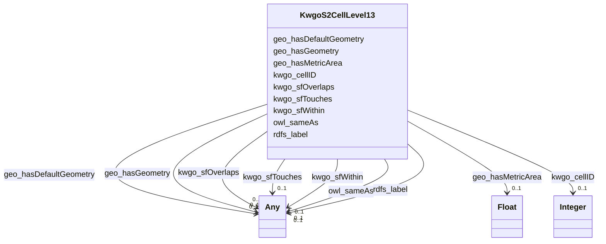

# Class: No class (type) name specified (kwgo_S2Cell_Level13)


_No class (type) description specified_


This class occurs 249509 times.


URI: [kwgo:S2Cell_Level13](http://stko-kwg.geog.ucsb.edu/lod/ontology/S2Cell_Level13)





<!-- no inheritance hierarchy -->


## Slots

| Name | Cardinality and Range | Description | Inheritance | Occurrences |
| ---  | --- | --- | --- | --- |
| [kwgo_cellID](../slots/kwgo_cellID.md) | 0..1 <br/> [xsd:integer](http://www.w3.org/2001/XMLSchema#integer) | No slot (predicate) description specified <br/>  | direct | 249509 |
| [geo_hasMetricArea](../slots/geo_hasMetricArea.md) | 0..1 <br/> [xsd:float](http://www.w3.org/2001/XMLSchema#float) | No slot (predicate) description specified <br/>  | direct | 249509 |
| [kwgo_sfOverlaps](../slots/kwgo_sfOverlaps.md) | 0..1 <br/> [OwlThing](../classes/OwlThing.md)&nbsp;or&nbsp;<br />[KwgoAdministrativeRegion1](../classes/KwgoAdministrativeRegion1.md)&nbsp;or&nbsp;<br />[KwgoAdministrativeRegion3](../classes/KwgoAdministrativeRegion3.md)&nbsp;or&nbsp;<br />[KwgoS2CellLevel13](../classes/KwgoS2CellLevel13.md)&nbsp;or&nbsp;<br />[KwgoAdministrativeRegion2](../classes/KwgoAdministrativeRegion2.md) | No slot (predicate) description specified <br/>  | direct | 286956 |
| [owl_sameAs](../slots/owl_sameAs.md) | 0..1 <br/> [GeoGeometry](../classes/GeoGeometry.md)&nbsp;or&nbsp;<br />[RdfObjectProperty](../classes/RdfObjectProperty.md)&nbsp;or&nbsp;<br />[RdfList](../classes/RdfList.md)&nbsp;or&nbsp;<br />[KwgoAdministrativeRegion1](../classes/KwgoAdministrativeRegion1.md)&nbsp;or&nbsp;<br />[OwlThing](../classes/OwlThing.md)&nbsp;or&nbsp;<br />[xsd:anyURI](http://www.w3.org/2001/XMLSchema#anyURI)&nbsp;or&nbsp;<br />[Sf#Polygon](../classes/Sf#Polygon.md)&nbsp;or&nbsp;<br />[KwgoAdministrativeRegion3](../classes/KwgoAdministrativeRegion3.md)&nbsp;or&nbsp;<br />[KwgoAdministrativeRegion2](../classes/KwgoAdministrativeRegion2.md)&nbsp;or&nbsp;<br />[KwgoS2CellLevel13](../classes/KwgoS2CellLevel13.md) | No slot (predicate) description specified <br/>  | direct | 499018 |
| [kwgo_sfTouches](../slots/kwgo_sfTouches.md) | 0..1 <br/> [OwlThing](../classes/OwlThing.md)&nbsp;or&nbsp;<br />[KwgoS2CellLevel13](../classes/KwgoS2CellLevel13.md) | No slot (predicate) description specified <br/>  | direct | 3980688 |
| [geo_hasGeometry](../slots/geo_hasGeometry.md) | 0..1 <br/> [Sf#Polygon](../classes/Sf#Polygon.md)&nbsp;or&nbsp;<br />[GeoGeometry](../classes/GeoGeometry.md)&nbsp;or&nbsp;<br />[OwlThing](../classes/OwlThing.md) | No slot (predicate) description specified <br/>  | direct | 748527 |
| [rdfs_label](../slots/rdfs_label.md) | 0..1 <br/> [xsd:string](http://www.w3.org/2001/XMLSchema#string)&nbsp;or&nbsp;<br />[xsd:anyURI](http://www.w3.org/2001/XMLSchema#anyURI) | No slot (predicate) description specified <br/>  | direct | 249509 |
| [geo_hasDefaultGeometry](../slots/geo_hasDefaultGeometry.md) | 0..1 <br/> [Sf#Polygon](../classes/Sf#Polygon.md)&nbsp;or&nbsp;<br />[GeoGeometry](../classes/GeoGeometry.md)&nbsp;or&nbsp;<br />[OwlThing](../classes/OwlThing.md) | No slot (predicate) description specified <br/>  | direct | 748527 |
| [kwgo_sfWithin](../slots/kwgo_sfWithin.md) | 0..1 <br/> [OwlThing](../classes/OwlThing.md)&nbsp;or&nbsp;<br />[KwgoAdministrativeRegion2](../classes/KwgoAdministrativeRegion2.md)&nbsp;or&nbsp;<br />[KwgoAdministrativeRegion3](../classes/KwgoAdministrativeRegion3.md)&nbsp;or&nbsp;<br />[KwgoAdministrativeRegion1](../classes/KwgoAdministrativeRegion1.md) | No slot (predicate) description specified <br/>  | direct | 1596903 |


## Usages

| used by | used in | type | used |
| ---  | --- | --- | --- |
| [GeoGeometry](../classes/GeoGeometry.md) | [owl_sameAs](../slots/owl_sameAs.md) | any_of[range] | [KwgoS2CellLevel13](../classes/KwgoS2CellLevel13.md) |
| [KwgoAdministrativeRegion1](../classes/KwgoAdministrativeRegion1.md) | [kwgo_sfOverlaps](../slots/kwgo_sfOverlaps.md) | any_of[range] | [KwgoS2CellLevel13](../classes/KwgoS2CellLevel13.md) |
| [KwgoAdministrativeRegion1](../classes/KwgoAdministrativeRegion1.md) | [kwgo_sfContains](../slots/kwgo_sfContains.md) | any_of[range] | [KwgoS2CellLevel13](../classes/KwgoS2CellLevel13.md) |
| [KwgoAdministrativeRegion1](../classes/KwgoAdministrativeRegion1.md) | [owl_sameAs](../slots/owl_sameAs.md) | any_of[range] | [KwgoS2CellLevel13](../classes/KwgoS2CellLevel13.md) |
| [KwgoAdministrativeRegion2](../classes/KwgoAdministrativeRegion2.md) | [kwgo_sfOverlaps](../slots/kwgo_sfOverlaps.md) | any_of[range] | [KwgoS2CellLevel13](../classes/KwgoS2CellLevel13.md) |
| [KwgoAdministrativeRegion2](../classes/KwgoAdministrativeRegion2.md) | [kwgo_sfContains](../slots/kwgo_sfContains.md) | any_of[range] | [KwgoS2CellLevel13](../classes/KwgoS2CellLevel13.md) |
| [KwgoAdministrativeRegion2](../classes/KwgoAdministrativeRegion2.md) | [owl_sameAs](../slots/owl_sameAs.md) | any_of[range] | [KwgoS2CellLevel13](../classes/KwgoS2CellLevel13.md) |
| [KwgoAdministrativeRegion3](../classes/KwgoAdministrativeRegion3.md) | [kwgo_sfOverlaps](../slots/kwgo_sfOverlaps.md) | any_of[range] | [KwgoS2CellLevel13](../classes/KwgoS2CellLevel13.md) |
| [KwgoAdministrativeRegion3](../classes/KwgoAdministrativeRegion3.md) | [kwgo_sfContains](../slots/kwgo_sfContains.md) | any_of[range] | [KwgoS2CellLevel13](../classes/KwgoS2CellLevel13.md) |
| [KwgoAdministrativeRegion3](../classes/KwgoAdministrativeRegion3.md) | [owl_sameAs](../slots/owl_sameAs.md) | any_of[range] | [KwgoS2CellLevel13](../classes/KwgoS2CellLevel13.md) |
| [KwgoS2CellLevel13](../classes/KwgoS2CellLevel13.md) | [kwgo_sfOverlaps](../slots/kwgo_sfOverlaps.md) | any_of[range] | [KwgoS2CellLevel13](../classes/KwgoS2CellLevel13.md) |
| [KwgoS2CellLevel13](../classes/KwgoS2CellLevel13.md) | [owl_sameAs](../slots/owl_sameAs.md) | any_of[range] | [KwgoS2CellLevel13](../classes/KwgoS2CellLevel13.md) |
| [KwgoS2CellLevel13](../classes/KwgoS2CellLevel13.md) | [kwgo_sfTouches](../slots/kwgo_sfTouches.md) | any_of[range] | [KwgoS2CellLevel13](../classes/KwgoS2CellLevel13.md) |
| [OwlNamedIndividual](../classes/OwlNamedIndividual.md) | [kwgo_sfOverlaps](../slots/kwgo_sfOverlaps.md) | any_of[range] | [KwgoS2CellLevel13](../classes/KwgoS2CellLevel13.md) |
| [OwlNamedIndividual](../classes/OwlNamedIndividual.md) | [kwgo_sfContains](../slots/kwgo_sfContains.md) | any_of[range] | [KwgoS2CellLevel13](../classes/KwgoS2CellLevel13.md) |
| [OwlNamedIndividual](../classes/OwlNamedIndividual.md) | [owl_sameAs](../slots/owl_sameAs.md) | any_of[range] | [KwgoS2CellLevel13](../classes/KwgoS2CellLevel13.md) |
| [OwlNamedIndividual](../classes/OwlNamedIndividual.md) | [kwgo_sfTouches](../slots/kwgo_sfTouches.md) | any_of[range] | [KwgoS2CellLevel13](../classes/KwgoS2CellLevel13.md) |
| [OwlNothing](../classes/OwlNothing.md) | [kwgo_sfOverlaps](../slots/kwgo_sfOverlaps.md) | any_of[range] | [KwgoS2CellLevel13](../classes/KwgoS2CellLevel13.md) |
| [OwlNothing](../classes/OwlNothing.md) | [kwgo_sfContains](../slots/kwgo_sfContains.md) | any_of[range] | [KwgoS2CellLevel13](../classes/KwgoS2CellLevel13.md) |
| [OwlNothing](../classes/OwlNothing.md) | [owl_sameAs](../slots/owl_sameAs.md) | any_of[range] | [KwgoS2CellLevel13](../classes/KwgoS2CellLevel13.md) |
| [OwlNothing](../classes/OwlNothing.md) | [kwgo_sfTouches](../slots/kwgo_sfTouches.md) | any_of[range] | [KwgoS2CellLevel13](../classes/KwgoS2CellLevel13.md) |
| [OwlThing](../classes/OwlThing.md) | [kwgo_sfOverlaps](../slots/kwgo_sfOverlaps.md) | any_of[range] | [KwgoS2CellLevel13](../classes/KwgoS2CellLevel13.md) |
| [OwlThing](../classes/OwlThing.md) | [kwgo_sfContains](../slots/kwgo_sfContains.md) | any_of[range] | [KwgoS2CellLevel13](../classes/KwgoS2CellLevel13.md) |
| [OwlThing](../classes/OwlThing.md) | [owl_sameAs](../slots/owl_sameAs.md) | any_of[range] | [KwgoS2CellLevel13](../classes/KwgoS2CellLevel13.md) |
| [OwlThing](../classes/OwlThing.md) | [kwgo_sfTouches](../slots/kwgo_sfTouches.md) | any_of[range] | [KwgoS2CellLevel13](../classes/KwgoS2CellLevel13.md) |
| [RdfList](../classes/RdfList.md) | [owl_sameAs](../slots/owl_sameAs.md) | any_of[range] | [KwgoS2CellLevel13](../classes/KwgoS2CellLevel13.md) |
| [RdfObjectProperty](../classes/RdfObjectProperty.md) | [owl_sameAs](../slots/owl_sameAs.md) | any_of[range] | [KwgoS2CellLevel13](../classes/KwgoS2CellLevel13.md) |
| [Sf#Polygon](../classes/Sf#Polygon.md) | [owl_sameAs](../slots/owl_sameAs.md) | any_of[range] | [KwgoS2CellLevel13](../classes/KwgoS2CellLevel13.md) |


## LinkML Source

<!-- TODO: investigate https://stackoverflow.com/questions/37606292/how-to-create-tabbed-code-blocks-in-mkdocs-or-sphinx -->

### Direct

<details>

```yaml
name: kwgo_S2Cell_Level13
conforms_to: No schema conformance document specified
annotations:
  count:
    tag: count
    value: 249509
description: No class (type) description specified
title: No class (type) name specified
from_schema: spatial-kg
rank: 1000
slots:
- kwgo_cellID
- geo_hasMetricArea
- kwgo_sfOverlaps
- owl_sameAs
- kwgo_sfTouches
- geo_hasGeometry
- rdfs_label
- geo_hasDefaultGeometry
- kwgo_sfWithin
slot_usage:
  geo_hasDefaultGeometry:
    name: geo_hasDefaultGeometry
    annotations:
      geo_Geometry:
        tag: geo_Geometry
        value: 249509
      owl_Thing:
        tag: owl_Thing
        value: 249509
      sf_#Polygon:
        tag: sf_#Polygon
        value: 249509
  geo_hasGeometry:
    name: geo_hasGeometry
    annotations:
      geo_Geometry:
        tag: geo_Geometry
        value: 249509
      owl_Thing:
        tag: owl_Thing
        value: 249509
      sf_#Polygon:
        tag: sf_#Polygon
        value: 249509
  geo_hasMetricArea:
    name: geo_hasMetricArea
    annotations:
      float:
        tag: float
        value: 249509
  kwgo_cellID:
    name: kwgo_cellID
    annotations:
      integer:
        tag: integer
        value: 249509
  kwgo_sfOverlaps:
    name: kwgo_sfOverlaps
    annotations:
      kwgo_AdministrativeRegion_1:
        tag: kwgo_AdministrativeRegion_1
        value: 4845
      kwgo_AdministrativeRegion_2:
        tag: kwgo_AdministrativeRegion_2
        value: 28306
      kwgo_AdministrativeRegion_3:
        tag: kwgo_AdministrativeRegion_3
        value: 110327
      owl_Thing:
        tag: owl_Thing
        value: 143478
  kwgo_sfTouches:
    name: kwgo_sfTouches
    annotations:
      kwgo_S2Cell_Level13:
        tag: kwgo_S2Cell_Level13
        value: 1984616
      owl_Thing:
        tag: owl_Thing
        value: 1996072
  kwgo_sfWithin:
    name: kwgo_sfWithin
    annotations:
      kwgo_AdministrativeRegion_1:
        tag: kwgo_AdministrativeRegion_1
        value: 244704
      kwgo_AdministrativeRegion_2:
        tag: kwgo_AdministrativeRegion_2
        value: 233310
      kwgo_AdministrativeRegion_3:
        tag: kwgo_AdministrativeRegion_3
        value: 195683
      owl_Thing:
        tag: owl_Thing
        value: 923206
  owl_sameAs:
    name: owl_sameAs
    annotations:
      kwgo_S2Cell_Level13:
        tag: kwgo_S2Cell_Level13
        value: 249509
      owl_Thing:
        tag: owl_Thing
        value: 249509
  rdfs_label:
    name: rdfs_label
    annotations:
      string:
        tag: string
        value: 249509
class_uri: kwgo:S2Cell_Level13

```
</details>

### Induced

<details>

```yaml
name: kwgo_S2Cell_Level13
conforms_to: No schema conformance document specified
annotations:
  count:
    tag: count
    value: 249509
description: No class (type) description specified
title: No class (type) name specified
from_schema: spatial-kg
rank: 1000
slot_usage:
  geo_hasDefaultGeometry:
    name: geo_hasDefaultGeometry
    annotations:
      geo_Geometry:
        tag: geo_Geometry
        value: 249509
      owl_Thing:
        tag: owl_Thing
        value: 249509
      sf_#Polygon:
        tag: sf_#Polygon
        value: 249509
  geo_hasGeometry:
    name: geo_hasGeometry
    annotations:
      geo_Geometry:
        tag: geo_Geometry
        value: 249509
      owl_Thing:
        tag: owl_Thing
        value: 249509
      sf_#Polygon:
        tag: sf_#Polygon
        value: 249509
  geo_hasMetricArea:
    name: geo_hasMetricArea
    annotations:
      float:
        tag: float
        value: 249509
  kwgo_cellID:
    name: kwgo_cellID
    annotations:
      integer:
        tag: integer
        value: 249509
  kwgo_sfOverlaps:
    name: kwgo_sfOverlaps
    annotations:
      kwgo_AdministrativeRegion_1:
        tag: kwgo_AdministrativeRegion_1
        value: 4845
      kwgo_AdministrativeRegion_2:
        tag: kwgo_AdministrativeRegion_2
        value: 28306
      kwgo_AdministrativeRegion_3:
        tag: kwgo_AdministrativeRegion_3
        value: 110327
      owl_Thing:
        tag: owl_Thing
        value: 143478
  kwgo_sfTouches:
    name: kwgo_sfTouches
    annotations:
      kwgo_S2Cell_Level13:
        tag: kwgo_S2Cell_Level13
        value: 1984616
      owl_Thing:
        tag: owl_Thing
        value: 1996072
  kwgo_sfWithin:
    name: kwgo_sfWithin
    annotations:
      kwgo_AdministrativeRegion_1:
        tag: kwgo_AdministrativeRegion_1
        value: 244704
      kwgo_AdministrativeRegion_2:
        tag: kwgo_AdministrativeRegion_2
        value: 233310
      kwgo_AdministrativeRegion_3:
        tag: kwgo_AdministrativeRegion_3
        value: 195683
      owl_Thing:
        tag: owl_Thing
        value: 923206
  owl_sameAs:
    name: owl_sameAs
    annotations:
      kwgo_S2Cell_Level13:
        tag: kwgo_S2Cell_Level13
        value: 249509
      owl_Thing:
        tag: owl_Thing
        value: 249509
  rdfs_label:
    name: rdfs_label
    annotations:
      string:
        tag: string
        value: 249509
attributes:
  kwgo_cellID:
    name: kwgo_cellID
    annotations:
      integer:
        tag: integer
        value: 249509
    description: No slot (predicate) description specified
    title: No slot (predicate) name specified
    examples:
    - object:
        example_object: '5522341869704445952'
        example_object_type: integer
        example_predicate: kwgo:cellID
        example_subject: kwgr:s2.level13.5522341869704445952
        example_subject_type: kwgo_S2Cell_Level13
    - object:
        example_object: '5522341869704445952'
        example_object_type: integer
        example_predicate: kwgo:cellID
        example_subject: kwgr:s2.level13.5522341869704445952
        example_subject_type: owl_Thing
    from_schema: spatial-kg
    rank: 1000
    slot_uri: kwgo:cellID
    alias: kwgo_cellID
    owner: kwgo_S2Cell_Level13
    domain_of:
    - kwgo_S2Cell_Level13
    - owl_Thing
    range: integer
  geo_hasMetricArea:
    name: geo_hasMetricArea
    annotations:
      float:
        tag: float
        value: 249509
    description: No slot (predicate) description specified
    title: No slot (predicate) name specified
    examples:
    - object:
        example_object: '1138180.867994085'
        example_object_type: float
        example_predicate: geo:hasMetricArea
        example_subject: kwgr:s2.level13.5522341869704445952
        example_subject_type: kwgo_S2Cell_Level13
    - object:
        example_object: '1138180.867994085'
        example_object_type: float
        example_predicate: geo:hasMetricArea
        example_subject: kwgr:s2.level13.5522341869704445952
        example_subject_type: owl_Thing
    from_schema: spatial-kg
    rank: 1000
    slot_uri: geo:hasMetricArea
    alias: geo_hasMetricArea
    owner: kwgo_S2Cell_Level13
    domain_of:
    - kwgo_S2Cell_Level13
    - owl_Thing
    range: float
  kwgo_sfOverlaps:
    name: kwgo_sfOverlaps
    annotations:
      kwgo_AdministrativeRegion_1:
        tag: kwgo_AdministrativeRegion_1
        value: 4845
      kwgo_AdministrativeRegion_2:
        tag: kwgo_AdministrativeRegion_2
        value: 28306
      kwgo_AdministrativeRegion_3:
        tag: kwgo_AdministrativeRegion_3
        value: 110327
      owl_Thing:
        tag: owl_Thing
        value: 143478
    description: No slot (predicate) description specified
    title: No slot (predicate) name specified
    examples:
    - object:
        example_object: kwgr:s2.level13.9788714407319044096
        example_object_type: kwgo_S2Cell_Level13
        example_predicate: kwgo:sfOverlaps
        example_subject: kwgr:administrativeRegion.USA.17
        example_subject_type: kwgo_AdministrativeRegion_1
    - object:
        example_object: kwgr:s2.level13.9788714407319044096
        example_object_type: owl_Thing
        example_predicate: kwgo:sfOverlaps
        example_subject: kwgr:administrativeRegion.USA.17
        example_subject_type: kwgo_AdministrativeRegion_1
    - object:
        example_object: kwgr:s2.level13.9788714407319044096
        example_object_type: kwgo_S2Cell_Level13
        example_predicate: kwgo:sfOverlaps
        example_subject: kwgr:administrativeRegion.USA.17
        example_subject_type: owl_Thing
    - object:
        example_object: kwgr:s2.level13.9788714407319044096
        example_object_type: owl_Thing
        example_predicate: kwgo:sfOverlaps
        example_subject: kwgr:administrativeRegion.USA.17
        example_subject_type: owl_Thing
    - object:
        example_object: kwgr:s2.level13.9790229946658979840
        example_object_type: kwgo_S2Cell_Level13
        example_predicate: kwgo:sfOverlaps
        example_subject: kwgr:administrativeRegion.USA.17001
        example_subject_type: kwgo_AdministrativeRegion_2
    - object:
        example_object: kwgr:s2.level13.9790229946658979840
        example_object_type: owl_Thing
        example_predicate: kwgo:sfOverlaps
        example_subject: kwgr:administrativeRegion.USA.17001
        example_subject_type: kwgo_AdministrativeRegion_2
    - object:
        example_object: kwgr:administrativeRegion.USA.23
        example_object_type: kwgo_AdministrativeRegion_1
        example_predicate: kwgo:sfOverlaps
        example_subject: kwgr:s2.level13.5522341869704445952
        example_subject_type: kwgo_S2Cell_Level13
    - object:
        example_object: kwgr:administrativeRegion.USA.23
        example_object_type: owl_Thing
        example_predicate: kwgo:sfOverlaps
        example_subject: kwgr:s2.level13.5522341869704445952
        example_subject_type: kwgo_S2Cell_Level13
    - object:
        example_object: kwgr:administrativeRegion.USA.23
        example_object_type: kwgo_AdministrativeRegion_1
        example_predicate: kwgo:sfOverlaps
        example_subject: kwgr:s2.level13.5522341869704445952
        example_subject_type: owl_Thing
    - object:
        example_object: kwgr:administrativeRegion.USA.23003
        example_object_type: kwgo_AdministrativeRegion_2
        example_predicate: kwgo:sfOverlaps
        example_subject: kwgr:s2.level13.5522341869704445952
        example_subject_type: kwgo_S2Cell_Level13
    - object:
        example_object: kwgr:administrativeRegion.USA.23003
        example_object_type: kwgo_AdministrativeRegion_2
        example_predicate: kwgo:sfOverlaps
        example_subject: kwgr:s2.level13.5522341869704445952
        example_subject_type: owl_Thing
    - object:
        example_object: https://datacommons.org/browser/geoId/2300325615
        example_object_type: kwgo_AdministrativeRegion_3
        example_predicate: kwgo:sfOverlaps
        example_subject: kwgr:s2.level13.5522341869704445952
        example_subject_type: kwgo_S2Cell_Level13
    - object:
        example_object: https://datacommons.org/browser/geoId/2300325615
        example_object_type: kwgo_AdministrativeRegion_3
        example_predicate: kwgo:sfOverlaps
        example_subject: kwgr:s2.level13.5522341869704445952
        example_subject_type: owl_Thing
    - object:
        example_object: kwgr:s2.level13.9790280524193857536
        example_object_type: kwgo_S2Cell_Level13
        example_predicate: kwgo:sfOverlaps
        example_subject: https://datacommons.org/browser/geoId/1700105742
        example_subject_type: kwgo_AdministrativeRegion_3
    - object:
        example_object: kwgr:s2.level13.9790280524193857536
        example_object_type: owl_Thing
        example_predicate: kwgo:sfOverlaps
        example_subject: https://datacommons.org/browser/geoId/1700105742
        example_subject_type: kwgo_AdministrativeRegion_3
    from_schema: spatial-kg
    rank: 1000
    slot_uri: kwgo:sfOverlaps
    alias: kwgo_sfOverlaps
    owner: kwgo_S2Cell_Level13
    domain_of:
    - kwgo_AdministrativeRegion_1
    - kwgo_AdministrativeRegion_2
    - kwgo_AdministrativeRegion_3
    - kwgo_S2Cell_Level13
    - owl_Thing
    range: Any
    any_of:
    - range: owl_Thing
    - range: kwgo_AdministrativeRegion_1
    - range: kwgo_AdministrativeRegion_3
    - range: kwgo_S2Cell_Level13
    - range: kwgo_AdministrativeRegion_2
  owl_sameAs:
    name: owl_sameAs
    annotations:
      kwgo_S2Cell_Level13:
        tag: kwgo_S2Cell_Level13
        value: 249509
      owl_Thing:
        tag: owl_Thing
        value: 249509
    description: No slot (predicate) description specified
    title: No slot (predicate) name specified
    examples:
    - object:
        example_object: http://sawgraph.spatialai.org/v1/saw_geo#d.Polygon.administrativeRegion.USA.1700105742
        example_object_type: sf_#Polygon
        example_predicate: owl:sameAs
        example_subject: http://sawgraph.spatialai.org/v1/saw_geo#d.Polygon.administrativeRegion.USA.1700105742
        example_subject_type: geo_Geometry
    - object:
        example_object: http://sawgraph.spatialai.org/v1/saw_geo#d.Polygon.administrativeRegion.USA.1700105742
        example_object_type: geo_Geometry
        example_predicate: owl:sameAs
        example_subject: http://sawgraph.spatialai.org/v1/saw_geo#d.Polygon.administrativeRegion.USA.1700105742
        example_subject_type: geo_Geometry
    - object:
        example_object: http://sawgraph.spatialai.org/v1/saw_geo#d.Polygon.administrativeRegion.USA.1700105742
        example_object_type: owl_Thing
        example_predicate: owl:sameAs
        example_subject: http://sawgraph.spatialai.org/v1/saw_geo#d.Polygon.administrativeRegion.USA.1700105742
        example_subject_type: geo_Geometry
    - object:
        example_object: http://sawgraph.spatialai.org/v1/saw_geo#d.Polygon.administrativeRegion.USA.1700105742
        example_object_type: sf_#Polygon
        example_predicate: owl:sameAs
        example_subject: http://sawgraph.spatialai.org/v1/saw_geo#d.Polygon.administrativeRegion.USA.1700105742
        example_subject_type: sf_#Polygon
    - object:
        example_object: http://sawgraph.spatialai.org/v1/saw_geo#d.Polygon.administrativeRegion.USA.1700105742
        example_object_type: geo_Geometry
        example_predicate: owl:sameAs
        example_subject: http://sawgraph.spatialai.org/v1/saw_geo#d.Polygon.administrativeRegion.USA.1700105742
        example_subject_type: sf_#Polygon
    - object:
        example_object: http://sawgraph.spatialai.org/v1/saw_geo#d.Polygon.administrativeRegion.USA.1700105742
        example_object_type: owl_Thing
        example_predicate: owl:sameAs
        example_subject: http://sawgraph.spatialai.org/v1/saw_geo#d.Polygon.administrativeRegion.USA.1700105742
        example_subject_type: sf_#Polygon
    - object:
        example_object: http://sawgraph.spatialai.org/v1/saw_geo#d.Polygon.administrativeRegion.USA.1700105742
        example_object_type: sf_#Polygon
        example_predicate: owl:sameAs
        example_subject: http://sawgraph.spatialai.org/v1/saw_geo#d.Polygon.administrativeRegion.USA.1700105742
        example_subject_type: owl_Thing
    - object:
        example_object: http://sawgraph.spatialai.org/v1/saw_geo#d.Polygon.administrativeRegion.USA.1700105742
        example_object_type: geo_Geometry
        example_predicate: owl:sameAs
        example_subject: http://sawgraph.spatialai.org/v1/saw_geo#d.Polygon.administrativeRegion.USA.1700105742
        example_subject_type: owl_Thing
    - object:
        example_object: http://sawgraph.spatialai.org/v1/saw_geo#d.Polygon.administrativeRegion.USA.1700105742
        example_object_type: owl_Thing
        example_predicate: owl:sameAs
        example_subject: http://sawgraph.spatialai.org/v1/saw_geo#d.Polygon.administrativeRegion.USA.1700105742
        example_subject_type: owl_Thing
    - object:
        example_object: kwgr:administrativeRegion.USA.17
        example_object_type: kwgo_AdministrativeRegion_1
        example_predicate: owl:sameAs
        example_subject: kwgr:administrativeRegion.USA.17
        example_subject_type: kwgo_AdministrativeRegion_1
    - object:
        example_object: kwgr:administrativeRegion.USA.17
        example_object_type: owl_Thing
        example_predicate: owl:sameAs
        example_subject: kwgr:administrativeRegion.USA.17
        example_subject_type: kwgo_AdministrativeRegion_1
    - object:
        example_object: kwgr:administrativeRegion.USA.17
        example_object_type: kwgo_AdministrativeRegion_1
        example_predicate: owl:sameAs
        example_subject: kwgr:administrativeRegion.USA.17
        example_subject_type: owl_Thing
    - object:
        example_object: kwgr:administrativeRegion.USA.17001
        example_object_type: kwgo_AdministrativeRegion_2
        example_predicate: owl:sameAs
        example_subject: kwgr:administrativeRegion.USA.17001
        example_subject_type: kwgo_AdministrativeRegion_2
    - object:
        example_object: kwgr:administrativeRegion.USA.17001
        example_object_type: owl_Thing
        example_predicate: owl:sameAs
        example_subject: kwgr:administrativeRegion.USA.17001
        example_subject_type: kwgo_AdministrativeRegion_2
    - object:
        example_object: kwgr:administrativeRegion.USA.17001
        example_object_type: kwgo_AdministrativeRegion_2
        example_predicate: owl:sameAs
        example_subject: kwgr:administrativeRegion.USA.17001
        example_subject_type: owl_Thing
    - object:
        example_object: kwgr:s2.level13.5522341869704445952
        example_object_type: kwgo_S2Cell_Level13
        example_predicate: owl:sameAs
        example_subject: kwgr:s2.level13.5522341869704445952
        example_subject_type: kwgo_S2Cell_Level13
    - object:
        example_object: kwgr:s2.level13.5522341869704445952
        example_object_type: owl_Thing
        example_predicate: owl:sameAs
        example_subject: kwgr:s2.level13.5522341869704445952
        example_subject_type: kwgo_S2Cell_Level13
    - object:
        example_object: kwgr:s2.level13.5522341869704445952
        example_object_type: kwgo_S2Cell_Level13
        example_predicate: owl:sameAs
        example_subject: kwgr:s2.level13.5522341869704445952
        example_subject_type: owl_Thing
    - object:
        example_object: rdf:nil
        example_object_type: rdf_List
        example_predicate: owl:sameAs
        example_subject: rdf:nil
        example_subject_type: owl_Thing
    - object:
        example_object: rdf:nil
        example_object_type: owl_Thing
        example_predicate: owl:sameAs
        example_subject: rdf:nil
        example_subject_type: rdf_List
    - object:
        example_object: rdf:nil
        example_object_type: rdf_List
        example_predicate: owl:sameAs
        example_subject: rdf:nil
        example_subject_type: rdf_List
    - object:
        example_object: owl:topObjectProperty
        example_object_type: rdf_ObjectProperty
        example_predicate: owl:sameAs
        example_subject: owl:topObjectProperty
        example_subject_type: rdf_ObjectProperty
    - object:
        example_object: owl:topObjectProperty
        example_object_type: owl_Thing
        example_predicate: owl:sameAs
        example_subject: owl:topObjectProperty
        example_subject_type: rdf_ObjectProperty
    - object:
        example_object: owl:topObjectProperty
        example_object_type: rdf_ObjectProperty
        example_predicate: owl:sameAs
        example_subject: owl:topObjectProperty
        example_subject_type: owl_Thing
    - object:
        example_object: https://datacommons.org/browser/geoId/1700105742
        example_object_type: kwgo_AdministrativeRegion_3
        example_predicate: owl:sameAs
        example_subject: https://datacommons.org/browser/geoId/1700105742
        example_subject_type: owl_Thing
    - object:
        example_object: https://datacommons.org/browser/geoId/1700105742
        example_object_type: owl_Thing
        example_predicate: owl:sameAs
        example_subject: https://datacommons.org/browser/geoId/1700105742
        example_subject_type: kwgo_AdministrativeRegion_3
    - object:
        example_object: https://datacommons.org/browser/geoId/1700105742
        example_object_type: kwgo_AdministrativeRegion_3
        example_predicate: owl:sameAs
        example_subject: https://datacommons.org/browser/geoId/1700105742
        example_subject_type: kwgo_AdministrativeRegion_3
    from_schema: spatial-kg
    rank: 1000
    domain: owl_sameAs
    slot_uri: owl:sameAs
    alias: owl_sameAs
    owner: kwgo_S2Cell_Level13
    domain_of:
    - geo_Geometry
    - kwgo_AdministrativeRegion_1
    - kwgo_AdministrativeRegion_2
    - kwgo_AdministrativeRegion_3
    - kwgo_S2Cell_Level13
    - owl_Thing
    - rdf_List
    - rdf_ObjectProperty
    - sf_#Polygon
    range: Any
    any_of:
    - range: geo_Geometry
    - range: rdf_ObjectProperty
    - range: rdf_List
    - range: kwgo_AdministrativeRegion_1
    - range: owl_Thing
    - range: uri
    - range: sf_#Polygon
    - range: kwgo_AdministrativeRegion_3
    - range: kwgo_AdministrativeRegion_2
    - range: kwgo_S2Cell_Level13
  kwgo_sfTouches:
    name: kwgo_sfTouches
    annotations:
      kwgo_S2Cell_Level13:
        tag: kwgo_S2Cell_Level13
        value: 1984616
      owl_Thing:
        tag: owl_Thing
        value: 1996072
    description: No slot (predicate) description specified
    title: No slot (predicate) name specified
    examples:
    - object:
        example_object: kwgr:s2.level13.5529493127691239424
        example_object_type: kwgo_S2Cell_Level13
        example_predicate: kwgo:sfTouches
        example_subject: kwgr:s2.level13.5522340254796742656
        example_subject_type: owl_Thing
    - object:
        example_object: kwgr:s2.level13.5529493127691239424
        example_object_type: owl_Thing
        example_predicate: kwgo:sfTouches
        example_subject: kwgr:s2.level13.5522340254796742656
        example_subject_type: owl_Thing
    - object:
        example_object: kwgr:s2.level13.5522340392235696128
        example_object_type: owl_Thing
        example_predicate: kwgo:sfTouches
        example_subject: kwgr:s2.level13.5522341869704445952
        example_subject_type: kwgo_S2Cell_Level13
    - object:
        example_object: kwgr:s2.level13.5522341904064184320
        example_object_type: kwgo_S2Cell_Level13
        example_predicate: kwgo:sfTouches
        example_subject: kwgr:s2.level13.5522341869704445952
        example_subject_type: kwgo_S2Cell_Level13
    from_schema: spatial-kg
    rank: 1000
    slot_uri: kwgo:sfTouches
    alias: kwgo_sfTouches
    owner: kwgo_S2Cell_Level13
    domain_of:
    - kwgo_S2Cell_Level13
    - owl_Thing
    range: Any
    any_of:
    - range: owl_Thing
    - range: kwgo_S2Cell_Level13
  geo_hasGeometry:
    name: geo_hasGeometry
    annotations:
      geo_Geometry:
        tag: geo_Geometry
        value: 249509
      owl_Thing:
        tag: owl_Thing
        value: 249509
      sf_#Polygon:
        tag: sf_#Polygon
        value: 249509
    description: No slot (predicate) description specified
    title: No slot (predicate) name specified
    examples:
    - object:
        example_object: kwgr:geometry.Polygon.administrativeRegion.USA.17
        example_object_type: sf_#Polygon
        example_predicate: geo:hasGeometry
        example_subject: kwgr:administrativeRegion.USA.17
        example_subject_type: kwgo_AdministrativeRegion_1
    - object:
        example_object: kwgr:geometry.Polygon.administrativeRegion.USA.17
        example_object_type: geo_Geometry
        example_predicate: geo:hasGeometry
        example_subject: kwgr:administrativeRegion.USA.17
        example_subject_type: kwgo_AdministrativeRegion_1
    - object:
        example_object: kwgr:geometry.Polygon.administrativeRegion.USA.17
        example_object_type: owl_Thing
        example_predicate: geo:hasGeometry
        example_subject: kwgr:administrativeRegion.USA.17
        example_subject_type: kwgo_AdministrativeRegion_1
    - object:
        example_object: kwgr:geometry.Polygon.administrativeRegion.USA.17
        example_object_type: sf_#Polygon
        example_predicate: geo:hasGeometry
        example_subject: kwgr:administrativeRegion.USA.17
        example_subject_type: owl_Thing
    - object:
        example_object: kwgr:geometry.Polygon.administrativeRegion.USA.17
        example_object_type: geo_Geometry
        example_predicate: geo:hasGeometry
        example_subject: kwgr:administrativeRegion.USA.17
        example_subject_type: owl_Thing
    - object:
        example_object: kwgr:geometry.Polygon.administrativeRegion.USA.17
        example_object_type: owl_Thing
        example_predicate: geo:hasGeometry
        example_subject: kwgr:administrativeRegion.USA.17
        example_subject_type: owl_Thing
    - object:
        example_object: kwgr:geometry.Polygon.administrativeRegion.USA.17001
        example_object_type: geo_Geometry
        example_predicate: geo:hasGeometry
        example_subject: kwgr:administrativeRegion.USA.17001
        example_subject_type: kwgo_AdministrativeRegion_2
    - object:
        example_object: kwgr:geometry.Polygon.administrativeRegion.USA.17001
        example_object_type: owl_Thing
        example_predicate: geo:hasGeometry
        example_subject: kwgr:administrativeRegion.USA.17001
        example_subject_type: kwgo_AdministrativeRegion_2
    - object:
        example_object: kwgr:geometry.polygon.s2.level13.5522341869704445952
        example_object_type: sf_#Polygon
        example_predicate: geo:hasGeometry
        example_subject: kwgr:s2.level13.5522341869704445952
        example_subject_type: kwgo_S2Cell_Level13
    - object:
        example_object: kwgr:geometry.polygon.s2.level13.5522341869704445952
        example_object_type: geo_Geometry
        example_predicate: geo:hasGeometry
        example_subject: kwgr:s2.level13.5522341869704445952
        example_subject_type: kwgo_S2Cell_Level13
    - object:
        example_object: kwgr:geometry.polygon.s2.level13.5522341869704445952
        example_object_type: owl_Thing
        example_predicate: geo:hasGeometry
        example_subject: kwgr:s2.level13.5522341869704445952
        example_subject_type: kwgo_S2Cell_Level13
    - object:
        example_object: http://sawgraph.spatialai.org/v1/saw_geo#d.Polygon.administrativeRegion.USA.1700105742
        example_object_type: sf_#Polygon
        example_predicate: geo:hasGeometry
        example_subject: https://datacommons.org/browser/geoId/1700105742
        example_subject_type: kwgo_AdministrativeRegion_3
    - object:
        example_object: http://sawgraph.spatialai.org/v1/saw_geo#d.Polygon.administrativeRegion.USA.1700105742
        example_object_type: geo_Geometry
        example_predicate: geo:hasGeometry
        example_subject: https://datacommons.org/browser/geoId/1700105742
        example_subject_type: kwgo_AdministrativeRegion_3
    - object:
        example_object: http://sawgraph.spatialai.org/v1/saw_geo#d.Polygon.administrativeRegion.USA.1700105742
        example_object_type: owl_Thing
        example_predicate: geo:hasGeometry
        example_subject: https://datacommons.org/browser/geoId/1700105742
        example_subject_type: kwgo_AdministrativeRegion_3
    from_schema: spatial-kg
    rank: 1000
    slot_uri: geo:hasGeometry
    alias: geo_hasGeometry
    owner: kwgo_S2Cell_Level13
    domain_of:
    - kwgo_AdministrativeRegion_1
    - kwgo_AdministrativeRegion_2
    - kwgo_AdministrativeRegion_3
    - kwgo_S2Cell_Level13
    - owl_Thing
    range: Any
    any_of:
    - range: sf_#Polygon
    - range: geo_Geometry
    - range: owl_Thing
  rdfs_label:
    name: rdfs_label
    annotations:
      string:
        tag: string
        value: 249509
    description: No slot (predicate) description specified
    title: No slot (predicate) name specified
    examples:
    - object:
        example_object: Geometry of Beverly township, Illinois
        example_object_type: string
        example_predicate: rdfs:label
        example_subject: http://sawgraph.spatialai.org/v1/saw_geo#d.Polygon.administrativeRegion.USA.1700105742
        example_subject_type: geo_Geometry
    - object:
        example_object: Geometry of Beverly township, Illinois
        example_object_type: string
        example_predicate: rdfs:label
        example_subject: http://sawgraph.spatialai.org/v1/saw_geo#d.Polygon.administrativeRegion.USA.1700105742
        example_subject_type: sf_#Polygon
    - object:
        example_object: Geometry of Beverly township, Illinois
        example_object_type: string
        example_predicate: rdfs:label
        example_subject: http://sawgraph.spatialai.org/v1/saw_geo#d.Polygon.administrativeRegion.USA.1700105742
        example_subject_type: owl_Thing
    - object:
        example_object: Illinois
        example_object_type: string
        example_predicate: rdfs:label
        example_subject: kwgr:administrativeRegion.USA.17
        example_subject_type: kwgo_AdministrativeRegion_1
    - object:
        example_object: Adams County, Illinois
        example_object_type: string
        example_predicate: rdfs:label
        example_subject: kwgr:administrativeRegion.USA.17001
        example_subject_type: kwgo_AdministrativeRegion_2
    - object:
        example_object: S2 Cell at level 13 with ID 5522341869704445952
        example_object_type: string
        example_predicate: rdfs:label
        example_subject: kwgr:s2.level13.5522341869704445952
        example_subject_type: kwgo_S2Cell_Level13
    - object:
        example_object: Beverly township, Illinois
        example_object_type: string
        example_predicate: rdfs:label
        example_subject: https://datacommons.org/browser/geoId/1700105742
        example_subject_type: kwgo_AdministrativeRegion_3
    from_schema: spatial-kg
    rank: 1000
    slot_uri: rdfs:label
    alias: rdfs_label
    owner: kwgo_S2Cell_Level13
    domain_of:
    - geo_Geometry
    - kwgo_AdministrativeRegion_1
    - kwgo_AdministrativeRegion_2
    - kwgo_AdministrativeRegion_3
    - kwgo_S2Cell_Level13
    - owl_Thing
    - sf_#Polygon
    range: Any
    any_of:
    - range: string
    - range: uri
  geo_hasDefaultGeometry:
    name: geo_hasDefaultGeometry
    annotations:
      geo_Geometry:
        tag: geo_Geometry
        value: 249509
      owl_Thing:
        tag: owl_Thing
        value: 249509
      sf_#Polygon:
        tag: sf_#Polygon
        value: 249509
    description: No slot (predicate) description specified
    title: No slot (predicate) name specified
    examples:
    - object:
        example_object: kwgr:geometry.Polygon.administrativeRegion.USA.17
        example_object_type: sf_#Polygon
        example_predicate: geo:hasDefaultGeometry
        example_subject: kwgr:administrativeRegion.USA.17
        example_subject_type: kwgo_AdministrativeRegion_1
    - object:
        example_object: kwgr:geometry.Polygon.administrativeRegion.USA.17
        example_object_type: geo_Geometry
        example_predicate: geo:hasDefaultGeometry
        example_subject: kwgr:administrativeRegion.USA.17
        example_subject_type: kwgo_AdministrativeRegion_1
    - object:
        example_object: kwgr:geometry.Polygon.administrativeRegion.USA.17
        example_object_type: owl_Thing
        example_predicate: geo:hasDefaultGeometry
        example_subject: kwgr:administrativeRegion.USA.17
        example_subject_type: kwgo_AdministrativeRegion_1
    - object:
        example_object: kwgr:geometry.Polygon.administrativeRegion.USA.17
        example_object_type: sf_#Polygon
        example_predicate: geo:hasDefaultGeometry
        example_subject: kwgr:administrativeRegion.USA.17
        example_subject_type: owl_Thing
    - object:
        example_object: kwgr:geometry.Polygon.administrativeRegion.USA.17
        example_object_type: geo_Geometry
        example_predicate: geo:hasDefaultGeometry
        example_subject: kwgr:administrativeRegion.USA.17
        example_subject_type: owl_Thing
    - object:
        example_object: kwgr:geometry.Polygon.administrativeRegion.USA.17
        example_object_type: owl_Thing
        example_predicate: geo:hasDefaultGeometry
        example_subject: kwgr:administrativeRegion.USA.17
        example_subject_type: owl_Thing
    - object:
        example_object: kwgr:geometry.Polygon.administrativeRegion.USA.17001
        example_object_type: geo_Geometry
        example_predicate: geo:hasDefaultGeometry
        example_subject: kwgr:administrativeRegion.USA.17001
        example_subject_type: kwgo_AdministrativeRegion_2
    - object:
        example_object: kwgr:geometry.Polygon.administrativeRegion.USA.17001
        example_object_type: owl_Thing
        example_predicate: geo:hasDefaultGeometry
        example_subject: kwgr:administrativeRegion.USA.17001
        example_subject_type: kwgo_AdministrativeRegion_2
    - object:
        example_object: kwgr:geometry.polygon.s2.level13.5522341869704445952
        example_object_type: sf_#Polygon
        example_predicate: geo:hasDefaultGeometry
        example_subject: kwgr:s2.level13.5522341869704445952
        example_subject_type: kwgo_S2Cell_Level13
    - object:
        example_object: kwgr:geometry.polygon.s2.level13.5522341869704445952
        example_object_type: geo_Geometry
        example_predicate: geo:hasDefaultGeometry
        example_subject: kwgr:s2.level13.5522341869704445952
        example_subject_type: kwgo_S2Cell_Level13
    - object:
        example_object: kwgr:geometry.polygon.s2.level13.5522341869704445952
        example_object_type: owl_Thing
        example_predicate: geo:hasDefaultGeometry
        example_subject: kwgr:s2.level13.5522341869704445952
        example_subject_type: kwgo_S2Cell_Level13
    from_schema: spatial-kg
    rank: 1000
    slot_uri: geo:hasDefaultGeometry
    alias: geo_hasDefaultGeometry
    owner: kwgo_S2Cell_Level13
    domain_of:
    - kwgo_AdministrativeRegion_1
    - kwgo_AdministrativeRegion_2
    - kwgo_S2Cell_Level13
    - owl_Thing
    range: Any
    any_of:
    - range: sf_#Polygon
    - range: geo_Geometry
    - range: owl_Thing
  kwgo_sfWithin:
    name: kwgo_sfWithin
    annotations:
      kwgo_AdministrativeRegion_1:
        tag: kwgo_AdministrativeRegion_1
        value: 244704
      kwgo_AdministrativeRegion_2:
        tag: kwgo_AdministrativeRegion_2
        value: 233310
      kwgo_AdministrativeRegion_3:
        tag: kwgo_AdministrativeRegion_3
        value: 195683
      owl_Thing:
        tag: owl_Thing
        value: 923206
    description: No slot (predicate) description specified
    title: No slot (predicate) name specified
    examples:
    - object:
        example_object: kwgr:administrativeRegion.USA
        example_object_type: owl_Thing
        example_predicate: kwgo:sfWithin
        example_subject: kwgr:administrativeRegion.USA.17
        example_subject_type: kwgo_AdministrativeRegion_1
    - object:
        example_object: kwgr:administrativeRegion.USA
        example_object_type: owl_Thing
        example_predicate: kwgo:sfWithin
        example_subject: kwgr:administrativeRegion.USA.17
        example_subject_type: owl_Thing
    - object:
        example_object: kwgr:administrativeRegion.USA.17
        example_object_type: kwgo_AdministrativeRegion_1
        example_predicate: kwgo:sfWithin
        example_subject: kwgr:administrativeRegion.USA.17001
        example_subject_type: kwgo_AdministrativeRegion_2
    - object:
        example_object: kwgr:administrativeRegion.USA.17
        example_object_type: owl_Thing
        example_predicate: kwgo:sfWithin
        example_subject: kwgr:administrativeRegion.USA.17001
        example_subject_type: kwgo_AdministrativeRegion_2
    - object:
        example_object: kwgr:administrativeRegion.USA.17
        example_object_type: kwgo_AdministrativeRegion_1
        example_predicate: kwgo:sfWithin
        example_subject: kwgr:administrativeRegion.USA.17001
        example_subject_type: owl_Thing
    - object:
        example_object: kwgr:s2.level12.5522341886884315136
        example_object_type: owl_Thing
        example_predicate: kwgo:sfWithin
        example_subject: kwgr:s2.level13.5522341869704445952
        example_subject_type: kwgo_S2Cell_Level13
    - object:
        example_object: kwgr:administrativeRegion.USA.23
        example_object_type: kwgo_AdministrativeRegion_1
        example_predicate: kwgo:sfWithin
        example_subject: kwgr:s2.level13.5522342041503137792
        example_subject_type: kwgo_S2Cell_Level13
    - object:
        example_object: kwgr:administrativeRegion.USA.23003
        example_object_type: kwgo_AdministrativeRegion_2
        example_predicate: kwgo:sfWithin
        example_subject: kwgr:s2.level13.5522342041503137792
        example_subject_type: kwgo_S2Cell_Level13
    - object:
        example_object: kwgr:administrativeRegion.USA.23003
        example_object_type: kwgo_AdministrativeRegion_2
        example_predicate: kwgo:sfWithin
        example_subject: kwgr:s2.level13.5522342041503137792
        example_subject_type: owl_Thing
    - object:
        example_object: https://datacommons.org/browser/geoId/2300325615
        example_object_type: kwgo_AdministrativeRegion_3
        example_predicate: kwgo:sfWithin
        example_subject: kwgr:s2.level13.5522342041503137792
        example_subject_type: kwgo_S2Cell_Level13
    - object:
        example_object: https://datacommons.org/browser/geoId/2300325615
        example_object_type: kwgo_AdministrativeRegion_3
        example_predicate: kwgo:sfWithin
        example_subject: kwgr:s2.level13.5522342041503137792
        example_subject_type: owl_Thing
    - object:
        example_object: kwgr:administrativeRegion.USA.17001
        example_object_type: kwgo_AdministrativeRegion_2
        example_predicate: kwgo:sfWithin
        example_subject: https://datacommons.org/browser/geoId/1700105742
        example_subject_type: kwgo_AdministrativeRegion_3
    - object:
        example_object: kwgr:administrativeRegion.USA.17001
        example_object_type: owl_Thing
        example_predicate: kwgo:sfWithin
        example_subject: https://datacommons.org/browser/geoId/1700105742
        example_subject_type: kwgo_AdministrativeRegion_3
    from_schema: spatial-kg
    rank: 1000
    slot_uri: kwgo:sfWithin
    alias: kwgo_sfWithin
    owner: kwgo_S2Cell_Level13
    domain_of:
    - kwgo_AdministrativeRegion_1
    - kwgo_AdministrativeRegion_2
    - kwgo_AdministrativeRegion_3
    - kwgo_S2Cell_Level13
    - owl_Thing
    range: Any
    any_of:
    - range: owl_Thing
    - range: kwgo_AdministrativeRegion_2
    - range: kwgo_AdministrativeRegion_3
    - range: kwgo_AdministrativeRegion_1
class_uri: kwgo:S2Cell_Level13

```
</details>