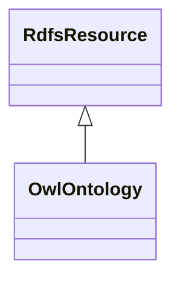

# Class: No class (type) name specified (owl_Ontology)


_No class (type) description specified_


This class occurs 0 times.


URI: [owl:Ontology](http://www.w3.org/2002/07/owl#Ontology)





## Inheritance
* [RdfsResource](../classes/RdfsResource.md)
    * **OwlOntology**


## Slots

| Name | Cardinality and Range | Description | Inheritance | Occurrences |
| ---  | --- | --- | --- | --- |


## LinkML Source

<!-- TODO: investigate https://stackoverflow.com/questions/37606292/how-to-create-tabbed-code-blocks-in-mkdocs-or-sphinx -->

### Direct

<details>

```yaml
name: owl_Ontology
conforms_to: No schema conformance document specified
annotations:
  count:
    tag: count
    value: 0
description: No class (type) description specified
title: No class (type) name specified
from_schema: spatial-kg
rank: 1000
is_a: rdfs_Resource
class_uri: owl:Ontology

```
</details>

### Induced

<details>

```yaml
name: owl_Ontology
conforms_to: No schema conformance document specified
annotations:
  count:
    tag: count
    value: 0
description: No class (type) description specified
title: No class (type) name specified
from_schema: spatial-kg
rank: 1000
is_a: rdfs_Resource
class_uri: owl:Ontology

```
</details>