# Class: No class (type) name specified -- this class is noted as a superclass of another class in this graph but has not itself been defined. (owl_Thing)


_No class (type) description specified_


This class occurs 571175 times.


URI: [owl:Thing](http://www.w3.org/2002/07/owl#Thing)

```mermaid
 classDiagram
    class OwlThing
    click OwlThing href "../OwlThing"
      OwlThing <|-- OwlNamedIndividual
        click OwlNamedIndividual href "../OwlNamedIndividual"
      OwlThing <|-- OwlNothing
        click OwlNothing href "../OwlNothing"
      
      OwlThing : geo_asWKT
        
          
    
    
    OwlThing --> "0..1" GeoWktLiteral : geo_asWKT
    click GeoWktLiteral href "../GeoWktLiteral"

        
      OwlThing : geo_defaultGeometry
        
          
    
    
    OwlThing --> "0..1" Any : geo_defaultGeometry
    click Any href "../Any"

        
      OwlThing : geo_hasDefaultGeometry
        
          
    
    
    OwlThing --> "0..1" Any : geo_hasDefaultGeometry
    click Any href "../Any"

        
      OwlThing : geo_hasGeometry
        
          
    
    
    OwlThing --> "0..1" Any : geo_hasGeometry
    click Any href "../Any"

        
      OwlThing : geo_hasMetricArea
        
          
    
    
    OwlThing --> "0..1" Float : geo_hasMetricArea
    click Float href "../Float"

        
      OwlThing : kwgo_administrativePartOf
        
          
    
    
    OwlThing --> "0..1" Any : kwgo_administrativePartOf
    click Any href "../Any"

        
      OwlThing : kwgo_cellID
        
          
    
    
    OwlThing --> "0..1" Integer : kwgo_cellID
    click Integer href "../Integer"

        
      OwlThing : kwgo_hasFIPS
        
          
    
    
    OwlThing --> "0..1" String : kwgo_hasFIPS
    click String href "../String"

        
      OwlThing : kwgo_sfContains
        
          
    
    
    OwlThing --> "0..1" Any : kwgo_sfContains
    click Any href "../Any"

        
      OwlThing : kwgo_sfOverlaps
        
          
    
    
    OwlThing --> "0..1" Any : kwgo_sfOverlaps
    click Any href "../Any"

        
      OwlThing : kwgo_sfTouches
        
          
    
    
    OwlThing --> "0..1" Any : kwgo_sfTouches
    click Any href "../Any"

        
      OwlThing : kwgo_sfWithin
        
          
    
    
    OwlThing --> "0..1" Any : kwgo_sfWithin
    click Any href "../Any"

        
      OwlThing : owl_sameAs
        
          
    
    
    OwlThing --> "0..1" Any : owl_sameAs
    click Any href "../Any"

        
      OwlThing : rdfs_domain
        
          
    
    
    OwlThing --> "0..1" Any : rdfs_domain
    click Any href "../Any"

        
      OwlThing : rdfs_label
        
          
    
    
    OwlThing --> "0..1" Any : rdfs_label
    click Any href "../Any"

        
      OwlThing : rdfs_range
        
          
    
    
    OwlThing --> "0..1" Any : rdfs_range
    click Any href "../Any"

        
      
```





## Inheritance
* **OwlThing**
    * [OwlNamedIndividual](../classes/OwlNamedIndividual.md)
    * [OwlNothing](../classes/OwlNothing.md)


## Slots

| Name | Cardinality and Range | Description | Inheritance | Occurrences |
| ---  | --- | --- | --- | --- |
| [kwgo_administrativePartOf](../slots/kwgo_administrativePartOf.md) | 0..1 <br/> [OwlThing](../classes/OwlThing.md)&nbsp;or&nbsp;<br />[KwgoAdministrativeRegion2](../classes/KwgoAdministrativeRegion2.md)&nbsp;or&nbsp;<br />[KwgoAdministrativeRegion1](../classes/KwgoAdministrativeRegion1.md) | No slot (predicate) description specified <br/>  | direct | 4688 |
| [kwgo_hasFIPS](../slots/kwgo_hasFIPS.md) | 0..1 <br/> [xsd:string](http://www.w3.org/2001/XMLSchema#string) | No slot (predicate) description specified <br/>  | direct | 2345 |
| [geo_defaultGeometry](../slots/geo_defaultGeometry.md) | 0..1 <br/> [Sf#Polygon](../classes/Sf#Polygon.md)&nbsp;or&nbsp;<br />[GeoGeometry](../classes/GeoGeometry.md)&nbsp;or&nbsp;<br />[OwlThing](../classes/OwlThing.md) | No slot (predicate) description specified <br/>  | direct | 6675 |
| [kwgo_cellID](../slots/kwgo_cellID.md) | 0..1 <br/> [xsd:integer](http://www.w3.org/2001/XMLSchema#integer) | No slot (predicate) description specified <br/>  | direct | 249509 |
| [geo_hasMetricArea](../slots/geo_hasMetricArea.md) | 0..1 <br/> [xsd:float](http://www.w3.org/2001/XMLSchema#float) | No slot (predicate) description specified <br/>  | direct | 249509 |
| [kwgo_sfOverlaps](../slots/kwgo_sfOverlaps.md) | 0..1 <br/> [OwlThing](../classes/OwlThing.md)&nbsp;or&nbsp;<br />[KwgoAdministrativeRegion1](../classes/KwgoAdministrativeRegion1.md)&nbsp;or&nbsp;<br />[KwgoAdministrativeRegion3](../classes/KwgoAdministrativeRegion3.md)&nbsp;or&nbsp;<br />[KwgoS2CellLevel13](../classes/KwgoS2CellLevel13.md)&nbsp;or&nbsp;<br />[KwgoAdministrativeRegion2](../classes/KwgoAdministrativeRegion2.md) | No slot (predicate) description specified <br/>  | direct | 574164 |
| [kwgo_sfContains](../slots/kwgo_sfContains.md) | 0..1 <br/> [OwlThing](../classes/OwlThing.md)&nbsp;or&nbsp;<br />[KwgoS2CellLevel13](../classes/KwgoS2CellLevel13.md) | No slot (predicate) description specified <br/>  | direct | 1846412 |
| [owl_sameAs](../slots/owl_sameAs.md) | 0..1 <br/> [GeoGeometry](../classes/GeoGeometry.md)&nbsp;or&nbsp;<br />[RdfObjectProperty](../classes/RdfObjectProperty.md)&nbsp;or&nbsp;<br />[RdfList](../classes/RdfList.md)&nbsp;or&nbsp;<br />[KwgoAdministrativeRegion1](../classes/KwgoAdministrativeRegion1.md)&nbsp;or&nbsp;<br />[OwlThing](../classes/OwlThing.md)&nbsp;or&nbsp;<br />[xsd:anyURI](http://www.w3.org/2001/XMLSchema#anyURI)&nbsp;or&nbsp;<br />[Sf#Polygon](../classes/Sf#Polygon.md)&nbsp;or&nbsp;<br />[KwgoAdministrativeRegion3](../classes/KwgoAdministrativeRegion3.md)&nbsp;or&nbsp;<br />[KwgoAdministrativeRegion2](../classes/KwgoAdministrativeRegion2.md)&nbsp;or&nbsp;<br />[KwgoS2CellLevel13](../classes/KwgoS2CellLevel13.md) | No slot (predicate) description specified <br/>  | direct | 1326621 |
| [kwgo_sfTouches](../slots/kwgo_sfTouches.md) | 0..1 <br/> [OwlThing](../classes/OwlThing.md)&nbsp;or&nbsp;<br />[KwgoS2CellLevel13](../classes/KwgoS2CellLevel13.md) | No slot (predicate) description specified <br/>  | direct | 4003600 |
| [geo_hasGeometry](../slots/geo_hasGeometry.md) | 0..1 <br/> [Sf#Polygon](../classes/Sf#Polygon.md)&nbsp;or&nbsp;<br />[GeoGeometry](../classes/GeoGeometry.md)&nbsp;or&nbsp;<br />[OwlThing](../classes/OwlThing.md) | No slot (predicate) description specified <br/>  | direct | 755444 |
| [rdfs_domain](../slots/rdfs_domain.md) | 0..1 <br/> [OwlThing](../classes/OwlThing.md)&nbsp;or&nbsp;<br />[OwlClass](../classes/OwlClass.md)&nbsp;or&nbsp;<br />[RdfsClass](../classes/RdfsClass.md)&nbsp;or&nbsp;<br />[xsd:anyURI](http://www.w3.org/2001/XMLSchema#anyURI) | No slot (predicate) description specified <br/>  | direct | 3 |
| [rdfs_label](../slots/rdfs_label.md) | 0..1 <br/> [xsd:string](http://www.w3.org/2001/XMLSchema#string)&nbsp;or&nbsp;<br />[xsd:anyURI](http://www.w3.org/2001/XMLSchema#anyURI) | No slot (predicate) description specified <br/>  | direct | 503708 |
| [geo_hasDefaultGeometry](../slots/geo_hasDefaultGeometry.md) | 0..1 <br/> [Sf#Polygon](../classes/Sf#Polygon.md)&nbsp;or&nbsp;<br />[GeoGeometry](../classes/GeoGeometry.md)&nbsp;or&nbsp;<br />[OwlThing](../classes/OwlThing.md) | No slot (predicate) description specified <br/>  | direct | 748769 |
| [kwgo_sfWithin](../slots/kwgo_sfWithin.md) | 0..1 <br/> [OwlThing](../classes/OwlThing.md)&nbsp;or&nbsp;<br />[KwgoAdministrativeRegion2](../classes/KwgoAdministrativeRegion2.md)&nbsp;or&nbsp;<br />[KwgoAdministrativeRegion3](../classes/KwgoAdministrativeRegion3.md)&nbsp;or&nbsp;<br />[KwgoAdministrativeRegion1](../classes/KwgoAdministrativeRegion1.md) | No slot (predicate) description specified <br/>  | direct | 1601591 |
| [rdfs_range](../slots/rdfs_range.md) | 0..1 <br/> [OwlThing](../classes/OwlThing.md)&nbsp;or&nbsp;<br />[OwlClass](../classes/OwlClass.md)&nbsp;or&nbsp;<br />[RdfsClass](../classes/RdfsClass.md)&nbsp;or&nbsp;<br />[xsd:anyURI](http://www.w3.org/2001/XMLSchema#anyURI) | No slot (predicate) description specified <br/>  | direct | 3 |
| [geo_asWKT](../slots/geo_asWKT.md) | 0..1 <br/> [GeoWktLiteral](../classes/GeoWktLiteral.md) | No slot (predicate) description specified <br/>  | direct | 251854 |


## Usages

| used by | used in | type | used |
| ---  | --- | --- | --- |
| [GeoGeometry](../classes/GeoGeometry.md) | [owl_sameAs](../slots/owl_sameAs.md) | any_of[range] | [OwlThing](../classes/OwlThing.md) |
| [KwgoAdministrativeRegion1](../classes/KwgoAdministrativeRegion1.md) | [kwgo_administrativePartOf](../slots/kwgo_administrativePartOf.md) | any_of[range] | [OwlThing](../classes/OwlThing.md) |
| [KwgoAdministrativeRegion1](../classes/KwgoAdministrativeRegion1.md) | [kwgo_sfOverlaps](../slots/kwgo_sfOverlaps.md) | any_of[range] | [OwlThing](../classes/OwlThing.md) |
| [KwgoAdministrativeRegion1](../classes/KwgoAdministrativeRegion1.md) | [kwgo_sfContains](../slots/kwgo_sfContains.md) | any_of[range] | [OwlThing](../classes/OwlThing.md) |
| [KwgoAdministrativeRegion1](../classes/KwgoAdministrativeRegion1.md) | [owl_sameAs](../slots/owl_sameAs.md) | any_of[range] | [OwlThing](../classes/OwlThing.md) |
| [KwgoAdministrativeRegion1](../classes/KwgoAdministrativeRegion1.md) | [geo_hasGeometry](../slots/geo_hasGeometry.md) | any_of[range] | [OwlThing](../classes/OwlThing.md) |
| [KwgoAdministrativeRegion1](../classes/KwgoAdministrativeRegion1.md) | [geo_hasDefaultGeometry](../slots/geo_hasDefaultGeometry.md) | any_of[range] | [OwlThing](../classes/OwlThing.md) |
| [KwgoAdministrativeRegion1](../classes/KwgoAdministrativeRegion1.md) | [kwgo_sfWithin](../slots/kwgo_sfWithin.md) | any_of[range] | [OwlThing](../classes/OwlThing.md) |
| [KwgoAdministrativeRegion2](../classes/KwgoAdministrativeRegion2.md) | [kwgo_administrativePartOf](../slots/kwgo_administrativePartOf.md) | any_of[range] | [OwlThing](../classes/OwlThing.md) |
| [KwgoAdministrativeRegion2](../classes/KwgoAdministrativeRegion2.md) | [kwgo_sfOverlaps](../slots/kwgo_sfOverlaps.md) | any_of[range] | [OwlThing](../classes/OwlThing.md) |
| [KwgoAdministrativeRegion2](../classes/KwgoAdministrativeRegion2.md) | [kwgo_sfContains](../slots/kwgo_sfContains.md) | any_of[range] | [OwlThing](../classes/OwlThing.md) |
| [KwgoAdministrativeRegion2](../classes/KwgoAdministrativeRegion2.md) | [owl_sameAs](../slots/owl_sameAs.md) | any_of[range] | [OwlThing](../classes/OwlThing.md) |
| [KwgoAdministrativeRegion2](../classes/KwgoAdministrativeRegion2.md) | [geo_hasGeometry](../slots/geo_hasGeometry.md) | any_of[range] | [OwlThing](../classes/OwlThing.md) |
| [KwgoAdministrativeRegion2](../classes/KwgoAdministrativeRegion2.md) | [geo_hasDefaultGeometry](../slots/geo_hasDefaultGeometry.md) | any_of[range] | [OwlThing](../classes/OwlThing.md) |
| [KwgoAdministrativeRegion2](../classes/KwgoAdministrativeRegion2.md) | [kwgo_sfWithin](../slots/kwgo_sfWithin.md) | any_of[range] | [OwlThing](../classes/OwlThing.md) |
| [KwgoAdministrativeRegion3](../classes/KwgoAdministrativeRegion3.md) | [kwgo_administrativePartOf](../slots/kwgo_administrativePartOf.md) | any_of[range] | [OwlThing](../classes/OwlThing.md) |
| [KwgoAdministrativeRegion3](../classes/KwgoAdministrativeRegion3.md) | [geo_defaultGeometry](../slots/geo_defaultGeometry.md) | any_of[range] | [OwlThing](../classes/OwlThing.md) |
| [KwgoAdministrativeRegion3](../classes/KwgoAdministrativeRegion3.md) | [kwgo_sfOverlaps](../slots/kwgo_sfOverlaps.md) | any_of[range] | [OwlThing](../classes/OwlThing.md) |
| [KwgoAdministrativeRegion3](../classes/KwgoAdministrativeRegion3.md) | [kwgo_sfContains](../slots/kwgo_sfContains.md) | any_of[range] | [OwlThing](../classes/OwlThing.md) |
| [KwgoAdministrativeRegion3](../classes/KwgoAdministrativeRegion3.md) | [owl_sameAs](../slots/owl_sameAs.md) | any_of[range] | [OwlThing](../classes/OwlThing.md) |
| [KwgoAdministrativeRegion3](../classes/KwgoAdministrativeRegion3.md) | [geo_hasGeometry](../slots/geo_hasGeometry.md) | any_of[range] | [OwlThing](../classes/OwlThing.md) |
| [KwgoAdministrativeRegion3](../classes/KwgoAdministrativeRegion3.md) | [kwgo_sfWithin](../slots/kwgo_sfWithin.md) | any_of[range] | [OwlThing](../classes/OwlThing.md) |
| [KwgoS2CellLevel13](../classes/KwgoS2CellLevel13.md) | [kwgo_sfOverlaps](../slots/kwgo_sfOverlaps.md) | any_of[range] | [OwlThing](../classes/OwlThing.md) |
| [KwgoS2CellLevel13](../classes/KwgoS2CellLevel13.md) | [owl_sameAs](../slots/owl_sameAs.md) | any_of[range] | [OwlThing](../classes/OwlThing.md) |
| [KwgoS2CellLevel13](../classes/KwgoS2CellLevel13.md) | [kwgo_sfTouches](../slots/kwgo_sfTouches.md) | any_of[range] | [OwlThing](../classes/OwlThing.md) |
| [KwgoS2CellLevel13](../classes/KwgoS2CellLevel13.md) | [geo_hasGeometry](../slots/geo_hasGeometry.md) | any_of[range] | [OwlThing](../classes/OwlThing.md) |
| [KwgoS2CellLevel13](../classes/KwgoS2CellLevel13.md) | [geo_hasDefaultGeometry](../slots/geo_hasDefaultGeometry.md) | any_of[range] | [OwlThing](../classes/OwlThing.md) |
| [KwgoS2CellLevel13](../classes/KwgoS2CellLevel13.md) | [kwgo_sfWithin](../slots/kwgo_sfWithin.md) | any_of[range] | [OwlThing](../classes/OwlThing.md) |
| [OwlNamedIndividual](../classes/OwlNamedIndividual.md) | [kwgo_administrativePartOf](../slots/kwgo_administrativePartOf.md) | any_of[range] | [OwlThing](../classes/OwlThing.md) |
| [OwlNamedIndividual](../classes/OwlNamedIndividual.md) | [geo_defaultGeometry](../slots/geo_defaultGeometry.md) | any_of[range] | [OwlThing](../classes/OwlThing.md) |
| [OwlNamedIndividual](../classes/OwlNamedIndividual.md) | [kwgo_sfOverlaps](../slots/kwgo_sfOverlaps.md) | any_of[range] | [OwlThing](../classes/OwlThing.md) |
| [OwlNamedIndividual](../classes/OwlNamedIndividual.md) | [kwgo_sfContains](../slots/kwgo_sfContains.md) | any_of[range] | [OwlThing](../classes/OwlThing.md) |
| [OwlNamedIndividual](../classes/OwlNamedIndividual.md) | [owl_sameAs](../slots/owl_sameAs.md) | any_of[range] | [OwlThing](../classes/OwlThing.md) |
| [OwlNamedIndividual](../classes/OwlNamedIndividual.md) | [kwgo_sfTouches](../slots/kwgo_sfTouches.md) | any_of[range] | [OwlThing](../classes/OwlThing.md) |
| [OwlNamedIndividual](../classes/OwlNamedIndividual.md) | [geo_hasGeometry](../slots/geo_hasGeometry.md) | any_of[range] | [OwlThing](../classes/OwlThing.md) |
| [OwlNamedIndividual](../classes/OwlNamedIndividual.md) | [rdfs_domain](../slots/rdfs_domain.md) | any_of[range] | [OwlThing](../classes/OwlThing.md) |
| [OwlNamedIndividual](../classes/OwlNamedIndividual.md) | [geo_hasDefaultGeometry](../slots/geo_hasDefaultGeometry.md) | any_of[range] | [OwlThing](../classes/OwlThing.md) |
| [OwlNamedIndividual](../classes/OwlNamedIndividual.md) | [kwgo_sfWithin](../slots/kwgo_sfWithin.md) | any_of[range] | [OwlThing](../classes/OwlThing.md) |
| [OwlNamedIndividual](../classes/OwlNamedIndividual.md) | [rdfs_range](../slots/rdfs_range.md) | any_of[range] | [OwlThing](../classes/OwlThing.md) |
| [OwlNothing](../classes/OwlNothing.md) | [kwgo_administrativePartOf](../slots/kwgo_administrativePartOf.md) | any_of[range] | [OwlThing](../classes/OwlThing.md) |
| [OwlNothing](../classes/OwlNothing.md) | [geo_defaultGeometry](../slots/geo_defaultGeometry.md) | any_of[range] | [OwlThing](../classes/OwlThing.md) |
| [OwlNothing](../classes/OwlNothing.md) | [kwgo_sfOverlaps](../slots/kwgo_sfOverlaps.md) | any_of[range] | [OwlThing](../classes/OwlThing.md) |
| [OwlNothing](../classes/OwlNothing.md) | [kwgo_sfContains](../slots/kwgo_sfContains.md) | any_of[range] | [OwlThing](../classes/OwlThing.md) |
| [OwlNothing](../classes/OwlNothing.md) | [owl_sameAs](../slots/owl_sameAs.md) | any_of[range] | [OwlThing](../classes/OwlThing.md) |
| [OwlNothing](../classes/OwlNothing.md) | [kwgo_sfTouches](../slots/kwgo_sfTouches.md) | any_of[range] | [OwlThing](../classes/OwlThing.md) |
| [OwlNothing](../classes/OwlNothing.md) | [geo_hasGeometry](../slots/geo_hasGeometry.md) | any_of[range] | [OwlThing](../classes/OwlThing.md) |
| [OwlNothing](../classes/OwlNothing.md) | [rdfs_domain](../slots/rdfs_domain.md) | any_of[range] | [OwlThing](../classes/OwlThing.md) |
| [OwlNothing](../classes/OwlNothing.md) | [geo_hasDefaultGeometry](../slots/geo_hasDefaultGeometry.md) | any_of[range] | [OwlThing](../classes/OwlThing.md) |
| [OwlNothing](../classes/OwlNothing.md) | [kwgo_sfWithin](../slots/kwgo_sfWithin.md) | any_of[range] | [OwlThing](../classes/OwlThing.md) |
| [OwlNothing](../classes/OwlNothing.md) | [rdfs_range](../slots/rdfs_range.md) | any_of[range] | [OwlThing](../classes/OwlThing.md) |
| [OwlThing](../classes/OwlThing.md) | [kwgo_administrativePartOf](../slots/kwgo_administrativePartOf.md) | any_of[range] | [OwlThing](../classes/OwlThing.md) |
| [OwlThing](../classes/OwlThing.md) | [geo_defaultGeometry](../slots/geo_defaultGeometry.md) | any_of[range] | [OwlThing](../classes/OwlThing.md) |
| [OwlThing](../classes/OwlThing.md) | [kwgo_sfOverlaps](../slots/kwgo_sfOverlaps.md) | any_of[range] | [OwlThing](../classes/OwlThing.md) |
| [OwlThing](../classes/OwlThing.md) | [kwgo_sfContains](../slots/kwgo_sfContains.md) | any_of[range] | [OwlThing](../classes/OwlThing.md) |
| [OwlThing](../classes/OwlThing.md) | [owl_sameAs](../slots/owl_sameAs.md) | any_of[range] | [OwlThing](../classes/OwlThing.md) |
| [OwlThing](../classes/OwlThing.md) | [kwgo_sfTouches](../slots/kwgo_sfTouches.md) | any_of[range] | [OwlThing](../classes/OwlThing.md) |
| [OwlThing](../classes/OwlThing.md) | [geo_hasGeometry](../slots/geo_hasGeometry.md) | any_of[range] | [OwlThing](../classes/OwlThing.md) |
| [OwlThing](../classes/OwlThing.md) | [rdfs_domain](../slots/rdfs_domain.md) | any_of[range] | [OwlThing](../classes/OwlThing.md) |
| [OwlThing](../classes/OwlThing.md) | [geo_hasDefaultGeometry](../slots/geo_hasDefaultGeometry.md) | any_of[range] | [OwlThing](../classes/OwlThing.md) |
| [OwlThing](../classes/OwlThing.md) | [kwgo_sfWithin](../slots/kwgo_sfWithin.md) | any_of[range] | [OwlThing](../classes/OwlThing.md) |
| [OwlThing](../classes/OwlThing.md) | [rdfs_range](../slots/rdfs_range.md) | any_of[range] | [OwlThing](../classes/OwlThing.md) |
| [RdfList](../classes/RdfList.md) | [owl_sameAs](../slots/owl_sameAs.md) | any_of[range] | [OwlThing](../classes/OwlThing.md) |
| [RdfObjectProperty](../classes/RdfObjectProperty.md) | [owl_sameAs](../slots/owl_sameAs.md) | any_of[range] | [OwlThing](../classes/OwlThing.md) |
| [RdfObjectProperty](../classes/RdfObjectProperty.md) | [rdfs_range](../slots/rdfs_range.md) | any_of[range] | [OwlThing](../classes/OwlThing.md) |
| [RdfObjectProperty](../classes/RdfObjectProperty.md) | [rdfs_domain](../slots/rdfs_domain.md) | any_of[range] | [OwlThing](../classes/OwlThing.md) |
| [Sf#Polygon](../classes/Sf#Polygon.md) | [owl_sameAs](../slots/owl_sameAs.md) | any_of[range] | [OwlThing](../classes/OwlThing.md) |


## LinkML Source

<!-- TODO: investigate https://stackoverflow.com/questions/37606292/how-to-create-tabbed-code-blocks-in-mkdocs-or-sphinx -->

### Direct

<details>

```yaml
name: owl_Thing
conforms_to: No schema conformance document specified
annotations:
  count:
    tag: count
    value: 571175
description: No class (type) description specified
title: No class (type) name specified -- this class is noted as a superclass of another
  class in this graph but has not itself been defined.
from_schema: spatial-kg
rank: 1000
slots:
- kwgo_administrativePartOf
- kwgo_hasFIPS
- geo_defaultGeometry
- kwgo_cellID
- geo_hasMetricArea
- kwgo_sfOverlaps
- kwgo_sfContains
- owl_sameAs
- kwgo_sfTouches
- geo_hasGeometry
- rdfs_domain
- rdfs_label
- geo_hasDefaultGeometry
- kwgo_sfWithin
- rdfs_range
- geo_asWKT
slot_usage:
  geo_asWKT:
    name: geo_asWKT
    annotations:
      geo_wktLiteral:
        tag: geo_wktLiteral
        value: 251854
  geo_defaultGeometry:
    name: geo_defaultGeometry
    annotations:
      geo_Geometry:
        tag: geo_Geometry
        value: 2225
      owl_Thing:
        tag: owl_Thing
        value: 2225
      sf_#Polygon:
        tag: sf_#Polygon
        value: 2225
  geo_hasDefaultGeometry:
    name: geo_hasDefaultGeometry
    annotations:
      geo_Geometry:
        tag: geo_Geometry
        value: 249629
      owl_Thing:
        tag: owl_Thing
        value: 249629
      sf_#Polygon:
        tag: sf_#Polygon
        value: 249511
  geo_hasGeometry:
    name: geo_hasGeometry
    annotations:
      geo_Geometry:
        tag: geo_Geometry
        value: 251854
      owl_Thing:
        tag: owl_Thing
        value: 251854
      sf_#Polygon:
        tag: sf_#Polygon
        value: 251736
  geo_hasMetricArea:
    name: geo_hasMetricArea
    annotations:
      float:
        tag: float
        value: 249509
  kwgo_administrativePartOf:
    name: kwgo_administrativePartOf
    annotations:
      kwgo_AdministrativeRegion_1:
        tag: kwgo_AdministrativeRegion_1
        value: 118
      kwgo_AdministrativeRegion_2:
        tag: kwgo_AdministrativeRegion_2
        value: 2225
      owl_Thing:
        tag: owl_Thing
        value: 2345
  kwgo_cellID:
    name: kwgo_cellID
    annotations:
      integer:
        tag: integer
        value: 249509
  kwgo_hasFIPS:
    name: kwgo_hasFIPS
    annotations:
      string:
        tag: string
        value: 2345
  kwgo_sfContains:
    name: kwgo_sfContains
    annotations:
      kwgo_S2Cell_Level13:
        tag: kwgo_S2Cell_Level13
        value: 923206
      owl_Thing:
        tag: owl_Thing
        value: 923206
  kwgo_sfOverlaps:
    name: kwgo_sfOverlaps
    annotations:
      kwgo_AdministrativeRegion_1:
        tag: kwgo_AdministrativeRegion_1
        value: 4873
      kwgo_AdministrativeRegion_2:
        tag: kwgo_AdministrativeRegion_2
        value: 28334
      kwgo_AdministrativeRegion_3:
        tag: kwgo_AdministrativeRegion_3
        value: 110355
      kwgo_S2Cell_Level13:
        tag: kwgo_S2Cell_Level13
        value: 143478
      owl_Thing:
        tag: owl_Thing
        value: 287124
  kwgo_sfTouches:
    name: kwgo_sfTouches
    annotations:
      kwgo_S2Cell_Level13:
        tag: kwgo_S2Cell_Level13
        value: 1996072
      owl_Thing:
        tag: owl_Thing
        value: 2007528
  kwgo_sfWithin:
    name: kwgo_sfWithin
    annotations:
      kwgo_AdministrativeRegion_1:
        tag: kwgo_AdministrativeRegion_1
        value: 244822
      kwgo_AdministrativeRegion_2:
        tag: kwgo_AdministrativeRegion_2
        value: 235535
      kwgo_AdministrativeRegion_3:
        tag: kwgo_AdministrativeRegion_3
        value: 195683
      owl_Thing:
        tag: owl_Thing
        value: 925551
  owl_sameAs:
    name: owl_sameAs
    annotations:
      geo_Geometry:
        tag: geo_Geometry
        value: 251854
      kwgo_AdministrativeRegion_1:
        tag: kwgo_AdministrativeRegion_1
        value: 2
      kwgo_AdministrativeRegion_2:
        tag: kwgo_AdministrativeRegion_2
        value: 118
      kwgo_AdministrativeRegion_3:
        tag: kwgo_AdministrativeRegion_3
        value: 2225
      kwgo_S2Cell_Level13:
        tag: kwgo_S2Cell_Level13
        value: 249509
      owl_Thing:
        tag: owl_Thing
        value: 571175
      rdf_List:
        tag: rdf_List
        value: 1
      rdf_ObjectProperty:
        tag: rdf_ObjectProperty
        value: 1
      sf_#Polygon:
        tag: sf_#Polygon
        value: 251736
  rdfs_domain:
    name: rdfs_domain
    annotations:
      owl_Class:
        tag: owl_Class
        value: 1
      owl_Thing:
        tag: owl_Thing
        value: 1
      rdfs_Class:
        tag: rdfs_Class
        value: 1
  rdfs_label:
    name: rdfs_label
    annotations:
      string:
        tag: string
        value: 503708
  rdfs_range:
    name: rdfs_range
    annotations:
      owl_Class:
        tag: owl_Class
        value: 1
      owl_Thing:
        tag: owl_Thing
        value: 1
      rdfs_Class:
        tag: rdfs_Class
        value: 1
class_uri: owl:Thing

```
</details>

### Induced

<details>

```yaml
name: owl_Thing
conforms_to: No schema conformance document specified
annotations:
  count:
    tag: count
    value: 571175
description: No class (type) description specified
title: No class (type) name specified -- this class is noted as a superclass of another
  class in this graph but has not itself been defined.
from_schema: spatial-kg
rank: 1000
slot_usage:
  geo_asWKT:
    name: geo_asWKT
    annotations:
      geo_wktLiteral:
        tag: geo_wktLiteral
        value: 251854
  geo_defaultGeometry:
    name: geo_defaultGeometry
    annotations:
      geo_Geometry:
        tag: geo_Geometry
        value: 2225
      owl_Thing:
        tag: owl_Thing
        value: 2225
      sf_#Polygon:
        tag: sf_#Polygon
        value: 2225
  geo_hasDefaultGeometry:
    name: geo_hasDefaultGeometry
    annotations:
      geo_Geometry:
        tag: geo_Geometry
        value: 249629
      owl_Thing:
        tag: owl_Thing
        value: 249629
      sf_#Polygon:
        tag: sf_#Polygon
        value: 249511
  geo_hasGeometry:
    name: geo_hasGeometry
    annotations:
      geo_Geometry:
        tag: geo_Geometry
        value: 251854
      owl_Thing:
        tag: owl_Thing
        value: 251854
      sf_#Polygon:
        tag: sf_#Polygon
        value: 251736
  geo_hasMetricArea:
    name: geo_hasMetricArea
    annotations:
      float:
        tag: float
        value: 249509
  kwgo_administrativePartOf:
    name: kwgo_administrativePartOf
    annotations:
      kwgo_AdministrativeRegion_1:
        tag: kwgo_AdministrativeRegion_1
        value: 118
      kwgo_AdministrativeRegion_2:
        tag: kwgo_AdministrativeRegion_2
        value: 2225
      owl_Thing:
        tag: owl_Thing
        value: 2345
  kwgo_cellID:
    name: kwgo_cellID
    annotations:
      integer:
        tag: integer
        value: 249509
  kwgo_hasFIPS:
    name: kwgo_hasFIPS
    annotations:
      string:
        tag: string
        value: 2345
  kwgo_sfContains:
    name: kwgo_sfContains
    annotations:
      kwgo_S2Cell_Level13:
        tag: kwgo_S2Cell_Level13
        value: 923206
      owl_Thing:
        tag: owl_Thing
        value: 923206
  kwgo_sfOverlaps:
    name: kwgo_sfOverlaps
    annotations:
      kwgo_AdministrativeRegion_1:
        tag: kwgo_AdministrativeRegion_1
        value: 4873
      kwgo_AdministrativeRegion_2:
        tag: kwgo_AdministrativeRegion_2
        value: 28334
      kwgo_AdministrativeRegion_3:
        tag: kwgo_AdministrativeRegion_3
        value: 110355
      kwgo_S2Cell_Level13:
        tag: kwgo_S2Cell_Level13
        value: 143478
      owl_Thing:
        tag: owl_Thing
        value: 287124
  kwgo_sfTouches:
    name: kwgo_sfTouches
    annotations:
      kwgo_S2Cell_Level13:
        tag: kwgo_S2Cell_Level13
        value: 1996072
      owl_Thing:
        tag: owl_Thing
        value: 2007528
  kwgo_sfWithin:
    name: kwgo_sfWithin
    annotations:
      kwgo_AdministrativeRegion_1:
        tag: kwgo_AdministrativeRegion_1
        value: 244822
      kwgo_AdministrativeRegion_2:
        tag: kwgo_AdministrativeRegion_2
        value: 235535
      kwgo_AdministrativeRegion_3:
        tag: kwgo_AdministrativeRegion_3
        value: 195683
      owl_Thing:
        tag: owl_Thing
        value: 925551
  owl_sameAs:
    name: owl_sameAs
    annotations:
      geo_Geometry:
        tag: geo_Geometry
        value: 251854
      kwgo_AdministrativeRegion_1:
        tag: kwgo_AdministrativeRegion_1
        value: 2
      kwgo_AdministrativeRegion_2:
        tag: kwgo_AdministrativeRegion_2
        value: 118
      kwgo_AdministrativeRegion_3:
        tag: kwgo_AdministrativeRegion_3
        value: 2225
      kwgo_S2Cell_Level13:
        tag: kwgo_S2Cell_Level13
        value: 249509
      owl_Thing:
        tag: owl_Thing
        value: 571175
      rdf_List:
        tag: rdf_List
        value: 1
      rdf_ObjectProperty:
        tag: rdf_ObjectProperty
        value: 1
      sf_#Polygon:
        tag: sf_#Polygon
        value: 251736
  rdfs_domain:
    name: rdfs_domain
    annotations:
      owl_Class:
        tag: owl_Class
        value: 1
      owl_Thing:
        tag: owl_Thing
        value: 1
      rdfs_Class:
        tag: rdfs_Class
        value: 1
  rdfs_label:
    name: rdfs_label
    annotations:
      string:
        tag: string
        value: 503708
  rdfs_range:
    name: rdfs_range
    annotations:
      owl_Class:
        tag: owl_Class
        value: 1
      owl_Thing:
        tag: owl_Thing
        value: 1
      rdfs_Class:
        tag: rdfs_Class
        value: 1
attributes:
  kwgo_administrativePartOf:
    name: kwgo_administrativePartOf
    annotations:
      kwgo_AdministrativeRegion_1:
        tag: kwgo_AdministrativeRegion_1
        value: 118
      kwgo_AdministrativeRegion_2:
        tag: kwgo_AdministrativeRegion_2
        value: 2225
      owl_Thing:
        tag: owl_Thing
        value: 2345
    description: No slot (predicate) description specified
    title: No slot (predicate) name specified
    examples:
    - object:
        example_object: kwgr:administrativeRegion.USA
        example_object_type: owl_Thing
        example_predicate: kwgo:administrativePartOf
        example_subject: kwgr:administrativeRegion.USA.17
        example_subject_type: kwgo_AdministrativeRegion_1
    - object:
        example_object: kwgr:administrativeRegion.USA
        example_object_type: owl_Thing
        example_predicate: kwgo:administrativePartOf
        example_subject: kwgr:administrativeRegion.USA.17
        example_subject_type: owl_Thing
    - object:
        example_object: kwgr:administrativeRegion.USA.17
        example_object_type: kwgo_AdministrativeRegion_1
        example_predicate: kwgo:administrativePartOf
        example_subject: kwgr:administrativeRegion.USA.17001
        example_subject_type: kwgo_AdministrativeRegion_2
    - object:
        example_object: kwgr:administrativeRegion.USA.17
        example_object_type: owl_Thing
        example_predicate: kwgo:administrativePartOf
        example_subject: kwgr:administrativeRegion.USA.17001
        example_subject_type: kwgo_AdministrativeRegion_2
    - object:
        example_object: kwgr:administrativeRegion.USA.17
        example_object_type: kwgo_AdministrativeRegion_1
        example_predicate: kwgo:administrativePartOf
        example_subject: kwgr:administrativeRegion.USA.17001
        example_subject_type: owl_Thing
    - object:
        example_object: kwgr:administrativeRegion.USA.17001
        example_object_type: kwgo_AdministrativeRegion_2
        example_predicate: kwgo:administrativePartOf
        example_subject: https://datacommons.org/browser/geoId/1700105742
        example_subject_type: owl_Thing
    - object:
        example_object: kwgr:administrativeRegion.USA.17001
        example_object_type: kwgo_AdministrativeRegion_2
        example_predicate: kwgo:administrativePartOf
        example_subject: https://datacommons.org/browser/geoId/1700105742
        example_subject_type: kwgo_AdministrativeRegion_3
    - object:
        example_object: kwgr:administrativeRegion.USA.17001
        example_object_type: owl_Thing
        example_predicate: kwgo:administrativePartOf
        example_subject: https://datacommons.org/browser/geoId/1700105742
        example_subject_type: kwgo_AdministrativeRegion_3
    from_schema: spatial-kg
    rank: 1000
    slot_uri: kwgo:administrativePartOf
    alias: kwgo_administrativePartOf
    owner: owl_Thing
    domain_of:
    - kwgo_AdministrativeRegion_1
    - kwgo_AdministrativeRegion_2
    - kwgo_AdministrativeRegion_3
    - owl_Thing
    range: Any
    any_of:
    - range: owl_Thing
    - range: kwgo_AdministrativeRegion_2
    - range: kwgo_AdministrativeRegion_1
  kwgo_hasFIPS:
    name: kwgo_hasFIPS
    annotations:
      string:
        tag: string
        value: 2345
    description: No slot (predicate) description specified
    title: No slot (predicate) name specified
    examples:
    - object:
        example_object: '17'
        example_object_type: string
        example_predicate: kwgo:hasFIPS
        example_subject: kwgr:administrativeRegion.USA.17
        example_subject_type: kwgo_AdministrativeRegion_1
    - object:
        example_object: '17'
        example_object_type: string
        example_predicate: kwgo:hasFIPS
        example_subject: kwgr:administrativeRegion.USA.17
        example_subject_type: owl_Thing
    - object:
        example_object: '17001'
        example_object_type: string
        example_predicate: kwgo:hasFIPS
        example_subject: kwgr:administrativeRegion.USA.17001
        example_subject_type: kwgo_AdministrativeRegion_2
    - object:
        example_object: '1700105742'
        example_object_type: string
        example_predicate: kwgo:hasFIPS
        example_subject: https://datacommons.org/browser/geoId/1700105742
        example_subject_type: kwgo_AdministrativeRegion_3
    from_schema: spatial-kg
    rank: 1000
    slot_uri: kwgo:hasFIPS
    alias: kwgo_hasFIPS
    owner: owl_Thing
    domain_of:
    - kwgo_AdministrativeRegion_1
    - kwgo_AdministrativeRegion_2
    - kwgo_AdministrativeRegion_3
    - owl_Thing
    range: string
  geo_defaultGeometry:
    name: geo_defaultGeometry
    annotations:
      geo_Geometry:
        tag: geo_Geometry
        value: 2225
      owl_Thing:
        tag: owl_Thing
        value: 2225
      sf_#Polygon:
        tag: sf_#Polygon
        value: 2225
    description: No slot (predicate) description specified
    title: No slot (predicate) name specified
    examples:
    - object:
        example_object: http://sawgraph.spatialai.org/v1/saw_geo#d.Polygon.administrativeRegion.USA.1700105742
        example_object_type: sf_#Polygon
        example_predicate: geo:defaultGeometry
        example_subject: https://datacommons.org/browser/geoId/1700105742
        example_subject_type: owl_Thing
    - object:
        example_object: http://sawgraph.spatialai.org/v1/saw_geo#d.Polygon.administrativeRegion.USA.1700105742
        example_object_type: geo_Geometry
        example_predicate: geo:defaultGeometry
        example_subject: https://datacommons.org/browser/geoId/1700105742
        example_subject_type: owl_Thing
    - object:
        example_object: http://sawgraph.spatialai.org/v1/saw_geo#d.Polygon.administrativeRegion.USA.1700105742
        example_object_type: owl_Thing
        example_predicate: geo:defaultGeometry
        example_subject: https://datacommons.org/browser/geoId/1700105742
        example_subject_type: owl_Thing
    - object:
        example_object: http://sawgraph.spatialai.org/v1/saw_geo#d.Polygon.administrativeRegion.USA.1700105742
        example_object_type: sf_#Polygon
        example_predicate: geo:defaultGeometry
        example_subject: https://datacommons.org/browser/geoId/1700105742
        example_subject_type: kwgo_AdministrativeRegion_3
    - object:
        example_object: http://sawgraph.spatialai.org/v1/saw_geo#d.Polygon.administrativeRegion.USA.1700105742
        example_object_type: geo_Geometry
        example_predicate: geo:defaultGeometry
        example_subject: https://datacommons.org/browser/geoId/1700105742
        example_subject_type: kwgo_AdministrativeRegion_3
    - object:
        example_object: http://sawgraph.spatialai.org/v1/saw_geo#d.Polygon.administrativeRegion.USA.1700105742
        example_object_type: owl_Thing
        example_predicate: geo:defaultGeometry
        example_subject: https://datacommons.org/browser/geoId/1700105742
        example_subject_type: kwgo_AdministrativeRegion_3
    from_schema: spatial-kg
    rank: 1000
    slot_uri: geo:defaultGeometry
    alias: geo_defaultGeometry
    owner: owl_Thing
    domain_of:
    - kwgo_AdministrativeRegion_3
    - owl_Thing
    range: Any
    any_of:
    - range: sf_#Polygon
    - range: geo_Geometry
    - range: owl_Thing
  kwgo_cellID:
    name: kwgo_cellID
    annotations:
      integer:
        tag: integer
        value: 249509
    description: No slot (predicate) description specified
    title: No slot (predicate) name specified
    examples:
    - object:
        example_object: '5522341869704445952'
        example_object_type: integer
        example_predicate: kwgo:cellID
        example_subject: kwgr:s2.level13.5522341869704445952
        example_subject_type: kwgo_S2Cell_Level13
    - object:
        example_object: '5522341869704445952'
        example_object_type: integer
        example_predicate: kwgo:cellID
        example_subject: kwgr:s2.level13.5522341869704445952
        example_subject_type: owl_Thing
    from_schema: spatial-kg
    rank: 1000
    slot_uri: kwgo:cellID
    alias: kwgo_cellID
    owner: owl_Thing
    domain_of:
    - kwgo_S2Cell_Level13
    - owl_Thing
    range: integer
  geo_hasMetricArea:
    name: geo_hasMetricArea
    annotations:
      float:
        tag: float
        value: 249509
    description: No slot (predicate) description specified
    title: No slot (predicate) name specified
    examples:
    - object:
        example_object: '1138180.867994085'
        example_object_type: float
        example_predicate: geo:hasMetricArea
        example_subject: kwgr:s2.level13.5522341869704445952
        example_subject_type: kwgo_S2Cell_Level13
    - object:
        example_object: '1138180.867994085'
        example_object_type: float
        example_predicate: geo:hasMetricArea
        example_subject: kwgr:s2.level13.5522341869704445952
        example_subject_type: owl_Thing
    from_schema: spatial-kg
    rank: 1000
    slot_uri: geo:hasMetricArea
    alias: geo_hasMetricArea
    owner: owl_Thing
    domain_of:
    - kwgo_S2Cell_Level13
    - owl_Thing
    range: float
  kwgo_sfOverlaps:
    name: kwgo_sfOverlaps
    annotations:
      kwgo_AdministrativeRegion_1:
        tag: kwgo_AdministrativeRegion_1
        value: 4873
      kwgo_AdministrativeRegion_2:
        tag: kwgo_AdministrativeRegion_2
        value: 28334
      kwgo_AdministrativeRegion_3:
        tag: kwgo_AdministrativeRegion_3
        value: 110355
      kwgo_S2Cell_Level13:
        tag: kwgo_S2Cell_Level13
        value: 143478
      owl_Thing:
        tag: owl_Thing
        value: 287124
    description: No slot (predicate) description specified
    title: No slot (predicate) name specified
    examples:
    - object:
        example_object: kwgr:s2.level13.9788714407319044096
        example_object_type: kwgo_S2Cell_Level13
        example_predicate: kwgo:sfOverlaps
        example_subject: kwgr:administrativeRegion.USA.17
        example_subject_type: kwgo_AdministrativeRegion_1
    - object:
        example_object: kwgr:s2.level13.9788714407319044096
        example_object_type: owl_Thing
        example_predicate: kwgo:sfOverlaps
        example_subject: kwgr:administrativeRegion.USA.17
        example_subject_type: kwgo_AdministrativeRegion_1
    - object:
        example_object: kwgr:s2.level13.9788714407319044096
        example_object_type: kwgo_S2Cell_Level13
        example_predicate: kwgo:sfOverlaps
        example_subject: kwgr:administrativeRegion.USA.17
        example_subject_type: owl_Thing
    - object:
        example_object: kwgr:s2.level13.9788714407319044096
        example_object_type: owl_Thing
        example_predicate: kwgo:sfOverlaps
        example_subject: kwgr:administrativeRegion.USA.17
        example_subject_type: owl_Thing
    - object:
        example_object: kwgr:s2.level13.9790229946658979840
        example_object_type: kwgo_S2Cell_Level13
        example_predicate: kwgo:sfOverlaps
        example_subject: kwgr:administrativeRegion.USA.17001
        example_subject_type: kwgo_AdministrativeRegion_2
    - object:
        example_object: kwgr:s2.level13.9790229946658979840
        example_object_type: owl_Thing
        example_predicate: kwgo:sfOverlaps
        example_subject: kwgr:administrativeRegion.USA.17001
        example_subject_type: kwgo_AdministrativeRegion_2
    - object:
        example_object: kwgr:administrativeRegion.USA.23
        example_object_type: kwgo_AdministrativeRegion_1
        example_predicate: kwgo:sfOverlaps
        example_subject: kwgr:s2.level13.5522341869704445952
        example_subject_type: kwgo_S2Cell_Level13
    - object:
        example_object: kwgr:administrativeRegion.USA.23
        example_object_type: owl_Thing
        example_predicate: kwgo:sfOverlaps
        example_subject: kwgr:s2.level13.5522341869704445952
        example_subject_type: kwgo_S2Cell_Level13
    - object:
        example_object: kwgr:administrativeRegion.USA.23
        example_object_type: kwgo_AdministrativeRegion_1
        example_predicate: kwgo:sfOverlaps
        example_subject: kwgr:s2.level13.5522341869704445952
        example_subject_type: owl_Thing
    - object:
        example_object: kwgr:administrativeRegion.USA.23003
        example_object_type: kwgo_AdministrativeRegion_2
        example_predicate: kwgo:sfOverlaps
        example_subject: kwgr:s2.level13.5522341869704445952
        example_subject_type: kwgo_S2Cell_Level13
    - object:
        example_object: kwgr:administrativeRegion.USA.23003
        example_object_type: kwgo_AdministrativeRegion_2
        example_predicate: kwgo:sfOverlaps
        example_subject: kwgr:s2.level13.5522341869704445952
        example_subject_type: owl_Thing
    - object:
        example_object: https://datacommons.org/browser/geoId/2300325615
        example_object_type: kwgo_AdministrativeRegion_3
        example_predicate: kwgo:sfOverlaps
        example_subject: kwgr:s2.level13.5522341869704445952
        example_subject_type: kwgo_S2Cell_Level13
    - object:
        example_object: https://datacommons.org/browser/geoId/2300325615
        example_object_type: kwgo_AdministrativeRegion_3
        example_predicate: kwgo:sfOverlaps
        example_subject: kwgr:s2.level13.5522341869704445952
        example_subject_type: owl_Thing
    - object:
        example_object: kwgr:s2.level13.9790280524193857536
        example_object_type: kwgo_S2Cell_Level13
        example_predicate: kwgo:sfOverlaps
        example_subject: https://datacommons.org/browser/geoId/1700105742
        example_subject_type: kwgo_AdministrativeRegion_3
    - object:
        example_object: kwgr:s2.level13.9790280524193857536
        example_object_type: owl_Thing
        example_predicate: kwgo:sfOverlaps
        example_subject: https://datacommons.org/browser/geoId/1700105742
        example_subject_type: kwgo_AdministrativeRegion_3
    from_schema: spatial-kg
    rank: 1000
    slot_uri: kwgo:sfOverlaps
    alias: kwgo_sfOverlaps
    owner: owl_Thing
    domain_of:
    - kwgo_AdministrativeRegion_1
    - kwgo_AdministrativeRegion_2
    - kwgo_AdministrativeRegion_3
    - kwgo_S2Cell_Level13
    - owl_Thing
    range: Any
    any_of:
    - range: owl_Thing
    - range: kwgo_AdministrativeRegion_1
    - range: kwgo_AdministrativeRegion_3
    - range: kwgo_S2Cell_Level13
    - range: kwgo_AdministrativeRegion_2
  kwgo_sfContains:
    name: kwgo_sfContains
    annotations:
      kwgo_S2Cell_Level13:
        tag: kwgo_S2Cell_Level13
        value: 923206
      owl_Thing:
        tag: owl_Thing
        value: 923206
    description: No slot (predicate) description specified
    title: No slot (predicate) name specified
    examples:
    - object:
        example_object: kwgr:s2.level13.9788714544757997568
        example_object_type: kwgo_S2Cell_Level13
        example_predicate: kwgo:sfContains
        example_subject: kwgr:administrativeRegion.USA.17
        example_subject_type: kwgo_AdministrativeRegion_1
    - object:
        example_object: kwgr:s2.level13.9788714544757997568
        example_object_type: owl_Thing
        example_predicate: kwgo:sfContains
        example_subject: kwgr:administrativeRegion.USA.17
        example_subject_type: kwgo_AdministrativeRegion_1
    - object:
        example_object: kwgr:s2.level13.9788714544757997568
        example_object_type: kwgo_S2Cell_Level13
        example_predicate: kwgo:sfContains
        example_subject: kwgr:administrativeRegion.USA.17
        example_subject_type: owl_Thing
    - object:
        example_object: kwgr:s2.level13.9788714544757997568
        example_object_type: owl_Thing
        example_predicate: kwgo:sfContains
        example_subject: kwgr:administrativeRegion.USA.17
        example_subject_type: owl_Thing
    - object:
        example_object: kwgr:s2.level13.9790230015378456576
        example_object_type: kwgo_S2Cell_Level13
        example_predicate: kwgo:sfContains
        example_subject: kwgr:administrativeRegion.USA.17001
        example_subject_type: kwgo_AdministrativeRegion_2
    - object:
        example_object: kwgr:s2.level13.9790230015378456576
        example_object_type: owl_Thing
        example_predicate: kwgo:sfContains
        example_subject: kwgr:administrativeRegion.USA.17001
        example_subject_type: kwgo_AdministrativeRegion_2
    - object:
        example_object: kwgr:s2.level13.9790280627273072640
        example_object_type: kwgo_S2Cell_Level13
        example_predicate: kwgo:sfContains
        example_subject: https://datacommons.org/browser/geoId/1700105742
        example_subject_type: kwgo_AdministrativeRegion_3
    - object:
        example_object: kwgr:s2.level13.9790280627273072640
        example_object_type: owl_Thing
        example_predicate: kwgo:sfContains
        example_subject: https://datacommons.org/browser/geoId/1700105742
        example_subject_type: kwgo_AdministrativeRegion_3
    from_schema: spatial-kg
    rank: 1000
    slot_uri: kwgo:sfContains
    alias: kwgo_sfContains
    owner: owl_Thing
    domain_of:
    - kwgo_AdministrativeRegion_1
    - kwgo_AdministrativeRegion_2
    - kwgo_AdministrativeRegion_3
    - owl_Thing
    range: Any
    any_of:
    - range: owl_Thing
    - range: kwgo_S2Cell_Level13
  owl_sameAs:
    name: owl_sameAs
    annotations:
      geo_Geometry:
        tag: geo_Geometry
        value: 251854
      kwgo_AdministrativeRegion_1:
        tag: kwgo_AdministrativeRegion_1
        value: 2
      kwgo_AdministrativeRegion_2:
        tag: kwgo_AdministrativeRegion_2
        value: 118
      kwgo_AdministrativeRegion_3:
        tag: kwgo_AdministrativeRegion_3
        value: 2225
      kwgo_S2Cell_Level13:
        tag: kwgo_S2Cell_Level13
        value: 249509
      owl_Thing:
        tag: owl_Thing
        value: 571175
      rdf_List:
        tag: rdf_List
        value: 1
      rdf_ObjectProperty:
        tag: rdf_ObjectProperty
        value: 1
      sf_#Polygon:
        tag: sf_#Polygon
        value: 251736
    description: No slot (predicate) description specified
    title: No slot (predicate) name specified
    examples:
    - object:
        example_object: http://sawgraph.spatialai.org/v1/saw_geo#d.Polygon.administrativeRegion.USA.1700105742
        example_object_type: sf_#Polygon
        example_predicate: owl:sameAs
        example_subject: http://sawgraph.spatialai.org/v1/saw_geo#d.Polygon.administrativeRegion.USA.1700105742
        example_subject_type: geo_Geometry
    - object:
        example_object: http://sawgraph.spatialai.org/v1/saw_geo#d.Polygon.administrativeRegion.USA.1700105742
        example_object_type: geo_Geometry
        example_predicate: owl:sameAs
        example_subject: http://sawgraph.spatialai.org/v1/saw_geo#d.Polygon.administrativeRegion.USA.1700105742
        example_subject_type: geo_Geometry
    - object:
        example_object: http://sawgraph.spatialai.org/v1/saw_geo#d.Polygon.administrativeRegion.USA.1700105742
        example_object_type: owl_Thing
        example_predicate: owl:sameAs
        example_subject: http://sawgraph.spatialai.org/v1/saw_geo#d.Polygon.administrativeRegion.USA.1700105742
        example_subject_type: geo_Geometry
    - object:
        example_object: http://sawgraph.spatialai.org/v1/saw_geo#d.Polygon.administrativeRegion.USA.1700105742
        example_object_type: sf_#Polygon
        example_predicate: owl:sameAs
        example_subject: http://sawgraph.spatialai.org/v1/saw_geo#d.Polygon.administrativeRegion.USA.1700105742
        example_subject_type: sf_#Polygon
    - object:
        example_object: http://sawgraph.spatialai.org/v1/saw_geo#d.Polygon.administrativeRegion.USA.1700105742
        example_object_type: geo_Geometry
        example_predicate: owl:sameAs
        example_subject: http://sawgraph.spatialai.org/v1/saw_geo#d.Polygon.administrativeRegion.USA.1700105742
        example_subject_type: sf_#Polygon
    - object:
        example_object: http://sawgraph.spatialai.org/v1/saw_geo#d.Polygon.administrativeRegion.USA.1700105742
        example_object_type: owl_Thing
        example_predicate: owl:sameAs
        example_subject: http://sawgraph.spatialai.org/v1/saw_geo#d.Polygon.administrativeRegion.USA.1700105742
        example_subject_type: sf_#Polygon
    - object:
        example_object: http://sawgraph.spatialai.org/v1/saw_geo#d.Polygon.administrativeRegion.USA.1700105742
        example_object_type: sf_#Polygon
        example_predicate: owl:sameAs
        example_subject: http://sawgraph.spatialai.org/v1/saw_geo#d.Polygon.administrativeRegion.USA.1700105742
        example_subject_type: owl_Thing
    - object:
        example_object: http://sawgraph.spatialai.org/v1/saw_geo#d.Polygon.administrativeRegion.USA.1700105742
        example_object_type: geo_Geometry
        example_predicate: owl:sameAs
        example_subject: http://sawgraph.spatialai.org/v1/saw_geo#d.Polygon.administrativeRegion.USA.1700105742
        example_subject_type: owl_Thing
    - object:
        example_object: http://sawgraph.spatialai.org/v1/saw_geo#d.Polygon.administrativeRegion.USA.1700105742
        example_object_type: owl_Thing
        example_predicate: owl:sameAs
        example_subject: http://sawgraph.spatialai.org/v1/saw_geo#d.Polygon.administrativeRegion.USA.1700105742
        example_subject_type: owl_Thing
    - object:
        example_object: kwgr:administrativeRegion.USA.17
        example_object_type: kwgo_AdministrativeRegion_1
        example_predicate: owl:sameAs
        example_subject: kwgr:administrativeRegion.USA.17
        example_subject_type: kwgo_AdministrativeRegion_1
    - object:
        example_object: kwgr:administrativeRegion.USA.17
        example_object_type: owl_Thing
        example_predicate: owl:sameAs
        example_subject: kwgr:administrativeRegion.USA.17
        example_subject_type: kwgo_AdministrativeRegion_1
    - object:
        example_object: kwgr:administrativeRegion.USA.17
        example_object_type: kwgo_AdministrativeRegion_1
        example_predicate: owl:sameAs
        example_subject: kwgr:administrativeRegion.USA.17
        example_subject_type: owl_Thing
    - object:
        example_object: kwgr:administrativeRegion.USA.17001
        example_object_type: kwgo_AdministrativeRegion_2
        example_predicate: owl:sameAs
        example_subject: kwgr:administrativeRegion.USA.17001
        example_subject_type: kwgo_AdministrativeRegion_2
    - object:
        example_object: kwgr:administrativeRegion.USA.17001
        example_object_type: owl_Thing
        example_predicate: owl:sameAs
        example_subject: kwgr:administrativeRegion.USA.17001
        example_subject_type: kwgo_AdministrativeRegion_2
    - object:
        example_object: kwgr:administrativeRegion.USA.17001
        example_object_type: kwgo_AdministrativeRegion_2
        example_predicate: owl:sameAs
        example_subject: kwgr:administrativeRegion.USA.17001
        example_subject_type: owl_Thing
    - object:
        example_object: kwgr:s2.level13.5522341869704445952
        example_object_type: kwgo_S2Cell_Level13
        example_predicate: owl:sameAs
        example_subject: kwgr:s2.level13.5522341869704445952
        example_subject_type: kwgo_S2Cell_Level13
    - object:
        example_object: kwgr:s2.level13.5522341869704445952
        example_object_type: owl_Thing
        example_predicate: owl:sameAs
        example_subject: kwgr:s2.level13.5522341869704445952
        example_subject_type: kwgo_S2Cell_Level13
    - object:
        example_object: kwgr:s2.level13.5522341869704445952
        example_object_type: kwgo_S2Cell_Level13
        example_predicate: owl:sameAs
        example_subject: kwgr:s2.level13.5522341869704445952
        example_subject_type: owl_Thing
    - object:
        example_object: rdf:nil
        example_object_type: rdf_List
        example_predicate: owl:sameAs
        example_subject: rdf:nil
        example_subject_type: owl_Thing
    - object:
        example_object: rdf:nil
        example_object_type: owl_Thing
        example_predicate: owl:sameAs
        example_subject: rdf:nil
        example_subject_type: rdf_List
    - object:
        example_object: rdf:nil
        example_object_type: rdf_List
        example_predicate: owl:sameAs
        example_subject: rdf:nil
        example_subject_type: rdf_List
    - object:
        example_object: owl:topObjectProperty
        example_object_type: rdf_ObjectProperty
        example_predicate: owl:sameAs
        example_subject: owl:topObjectProperty
        example_subject_type: rdf_ObjectProperty
    - object:
        example_object: owl:topObjectProperty
        example_object_type: owl_Thing
        example_predicate: owl:sameAs
        example_subject: owl:topObjectProperty
        example_subject_type: rdf_ObjectProperty
    - object:
        example_object: owl:topObjectProperty
        example_object_type: rdf_ObjectProperty
        example_predicate: owl:sameAs
        example_subject: owl:topObjectProperty
        example_subject_type: owl_Thing
    - object:
        example_object: https://datacommons.org/browser/geoId/1700105742
        example_object_type: kwgo_AdministrativeRegion_3
        example_predicate: owl:sameAs
        example_subject: https://datacommons.org/browser/geoId/1700105742
        example_subject_type: owl_Thing
    - object:
        example_object: https://datacommons.org/browser/geoId/1700105742
        example_object_type: owl_Thing
        example_predicate: owl:sameAs
        example_subject: https://datacommons.org/browser/geoId/1700105742
        example_subject_type: kwgo_AdministrativeRegion_3
    - object:
        example_object: https://datacommons.org/browser/geoId/1700105742
        example_object_type: kwgo_AdministrativeRegion_3
        example_predicate: owl:sameAs
        example_subject: https://datacommons.org/browser/geoId/1700105742
        example_subject_type: kwgo_AdministrativeRegion_3
    from_schema: spatial-kg
    rank: 1000
    domain: owl_sameAs
    slot_uri: owl:sameAs
    alias: owl_sameAs
    owner: owl_Thing
    domain_of:
    - geo_Geometry
    - kwgo_AdministrativeRegion_1
    - kwgo_AdministrativeRegion_2
    - kwgo_AdministrativeRegion_3
    - kwgo_S2Cell_Level13
    - owl_Thing
    - rdf_List
    - rdf_ObjectProperty
    - sf_#Polygon
    range: Any
    any_of:
    - range: geo_Geometry
    - range: rdf_ObjectProperty
    - range: rdf_List
    - range: kwgo_AdministrativeRegion_1
    - range: owl_Thing
    - range: uri
    - range: sf_#Polygon
    - range: kwgo_AdministrativeRegion_3
    - range: kwgo_AdministrativeRegion_2
    - range: kwgo_S2Cell_Level13
  kwgo_sfTouches:
    name: kwgo_sfTouches
    annotations:
      kwgo_S2Cell_Level13:
        tag: kwgo_S2Cell_Level13
        value: 1996072
      owl_Thing:
        tag: owl_Thing
        value: 2007528
    description: No slot (predicate) description specified
    title: No slot (predicate) name specified
    examples:
    - object:
        example_object: kwgr:s2.level13.5529493127691239424
        example_object_type: kwgo_S2Cell_Level13
        example_predicate: kwgo:sfTouches
        example_subject: kwgr:s2.level13.5522340254796742656
        example_subject_type: owl_Thing
    - object:
        example_object: kwgr:s2.level13.5529493127691239424
        example_object_type: owl_Thing
        example_predicate: kwgo:sfTouches
        example_subject: kwgr:s2.level13.5522340254796742656
        example_subject_type: owl_Thing
    - object:
        example_object: kwgr:s2.level13.5522340392235696128
        example_object_type: owl_Thing
        example_predicate: kwgo:sfTouches
        example_subject: kwgr:s2.level13.5522341869704445952
        example_subject_type: kwgo_S2Cell_Level13
    - object:
        example_object: kwgr:s2.level13.5522341904064184320
        example_object_type: kwgo_S2Cell_Level13
        example_predicate: kwgo:sfTouches
        example_subject: kwgr:s2.level13.5522341869704445952
        example_subject_type: kwgo_S2Cell_Level13
    from_schema: spatial-kg
    rank: 1000
    slot_uri: kwgo:sfTouches
    alias: kwgo_sfTouches
    owner: owl_Thing
    domain_of:
    - kwgo_S2Cell_Level13
    - owl_Thing
    range: Any
    any_of:
    - range: owl_Thing
    - range: kwgo_S2Cell_Level13
  geo_hasGeometry:
    name: geo_hasGeometry
    annotations:
      geo_Geometry:
        tag: geo_Geometry
        value: 251854
      owl_Thing:
        tag: owl_Thing
        value: 251854
      sf_#Polygon:
        tag: sf_#Polygon
        value: 251736
    description: No slot (predicate) description specified
    title: No slot (predicate) name specified
    examples:
    - object:
        example_object: kwgr:geometry.Polygon.administrativeRegion.USA.17
        example_object_type: sf_#Polygon
        example_predicate: geo:hasGeometry
        example_subject: kwgr:administrativeRegion.USA.17
        example_subject_type: kwgo_AdministrativeRegion_1
    - object:
        example_object: kwgr:geometry.Polygon.administrativeRegion.USA.17
        example_object_type: geo_Geometry
        example_predicate: geo:hasGeometry
        example_subject: kwgr:administrativeRegion.USA.17
        example_subject_type: kwgo_AdministrativeRegion_1
    - object:
        example_object: kwgr:geometry.Polygon.administrativeRegion.USA.17
        example_object_type: owl_Thing
        example_predicate: geo:hasGeometry
        example_subject: kwgr:administrativeRegion.USA.17
        example_subject_type: kwgo_AdministrativeRegion_1
    - object:
        example_object: kwgr:geometry.Polygon.administrativeRegion.USA.17
        example_object_type: sf_#Polygon
        example_predicate: geo:hasGeometry
        example_subject: kwgr:administrativeRegion.USA.17
        example_subject_type: owl_Thing
    - object:
        example_object: kwgr:geometry.Polygon.administrativeRegion.USA.17
        example_object_type: geo_Geometry
        example_predicate: geo:hasGeometry
        example_subject: kwgr:administrativeRegion.USA.17
        example_subject_type: owl_Thing
    - object:
        example_object: kwgr:geometry.Polygon.administrativeRegion.USA.17
        example_object_type: owl_Thing
        example_predicate: geo:hasGeometry
        example_subject: kwgr:administrativeRegion.USA.17
        example_subject_type: owl_Thing
    - object:
        example_object: kwgr:geometry.Polygon.administrativeRegion.USA.17001
        example_object_type: geo_Geometry
        example_predicate: geo:hasGeometry
        example_subject: kwgr:administrativeRegion.USA.17001
        example_subject_type: kwgo_AdministrativeRegion_2
    - object:
        example_object: kwgr:geometry.Polygon.administrativeRegion.USA.17001
        example_object_type: owl_Thing
        example_predicate: geo:hasGeometry
        example_subject: kwgr:administrativeRegion.USA.17001
        example_subject_type: kwgo_AdministrativeRegion_2
    - object:
        example_object: kwgr:geometry.polygon.s2.level13.5522341869704445952
        example_object_type: sf_#Polygon
        example_predicate: geo:hasGeometry
        example_subject: kwgr:s2.level13.5522341869704445952
        example_subject_type: kwgo_S2Cell_Level13
    - object:
        example_object: kwgr:geometry.polygon.s2.level13.5522341869704445952
        example_object_type: geo_Geometry
        example_predicate: geo:hasGeometry
        example_subject: kwgr:s2.level13.5522341869704445952
        example_subject_type: kwgo_S2Cell_Level13
    - object:
        example_object: kwgr:geometry.polygon.s2.level13.5522341869704445952
        example_object_type: owl_Thing
        example_predicate: geo:hasGeometry
        example_subject: kwgr:s2.level13.5522341869704445952
        example_subject_type: kwgo_S2Cell_Level13
    - object:
        example_object: http://sawgraph.spatialai.org/v1/saw_geo#d.Polygon.administrativeRegion.USA.1700105742
        example_object_type: sf_#Polygon
        example_predicate: geo:hasGeometry
        example_subject: https://datacommons.org/browser/geoId/1700105742
        example_subject_type: kwgo_AdministrativeRegion_3
    - object:
        example_object: http://sawgraph.spatialai.org/v1/saw_geo#d.Polygon.administrativeRegion.USA.1700105742
        example_object_type: geo_Geometry
        example_predicate: geo:hasGeometry
        example_subject: https://datacommons.org/browser/geoId/1700105742
        example_subject_type: kwgo_AdministrativeRegion_3
    - object:
        example_object: http://sawgraph.spatialai.org/v1/saw_geo#d.Polygon.administrativeRegion.USA.1700105742
        example_object_type: owl_Thing
        example_predicate: geo:hasGeometry
        example_subject: https://datacommons.org/browser/geoId/1700105742
        example_subject_type: kwgo_AdministrativeRegion_3
    from_schema: spatial-kg
    rank: 1000
    slot_uri: geo:hasGeometry
    alias: geo_hasGeometry
    owner: owl_Thing
    domain_of:
    - kwgo_AdministrativeRegion_1
    - kwgo_AdministrativeRegion_2
    - kwgo_AdministrativeRegion_3
    - kwgo_S2Cell_Level13
    - owl_Thing
    range: Any
    any_of:
    - range: sf_#Polygon
    - range: geo_Geometry
    - range: owl_Thing
  rdfs_domain:
    name: rdfs_domain
    annotations:
      owl_Class:
        tag: owl_Class
        value: 1
      owl_Thing:
        tag: owl_Thing
        value: 1
      rdfs_Class:
        tag: rdfs_Class
        value: 1
    description: No slot (predicate) description specified
    title: No slot (predicate) name specified
    examples:
    - object:
        example_object: owl:Thing
        example_object_type: owl_Class
        example_predicate: rdfs:domain
        example_subject: owl:topObjectProperty
        example_subject_type: rdf_ObjectProperty
    - object:
        example_object: owl:Thing
        example_object_type: owl_Thing
        example_predicate: rdfs:domain
        example_subject: owl:topObjectProperty
        example_subject_type: rdf_ObjectProperty
    - object:
        example_object: owl:Thing
        example_object_type: rdfs_Class
        example_predicate: rdfs:domain
        example_subject: owl:topObjectProperty
        example_subject_type: rdf_ObjectProperty
    - object:
        example_object: owl:Thing
        example_object_type: owl_Class
        example_predicate: rdfs:domain
        example_subject: owl:topObjectProperty
        example_subject_type: owl_Thing
    - object:
        example_object: owl:Thing
        example_object_type: owl_Thing
        example_predicate: rdfs:domain
        example_subject: owl:topObjectProperty
        example_subject_type: owl_Thing
    - object:
        example_object: owl:Thing
        example_object_type: rdfs_Class
        example_predicate: rdfs:domain
        example_subject: owl:topObjectProperty
        example_subject_type: owl_Thing
    from_schema: spatial-kg
    rank: 1000
    slot_uri: rdfs:domain
    alias: rdfs_domain
    owner: owl_Thing
    domain_of:
    - owl_Thing
    - rdf_ObjectProperty
    range: Any
    any_of:
    - range: owl_Thing
    - range: owl_Class
    - range: rdfs_Class
    - range: uri
  rdfs_label:
    name: rdfs_label
    annotations:
      string:
        tag: string
        value: 503708
    description: No slot (predicate) description specified
    title: No slot (predicate) name specified
    examples:
    - object:
        example_object: Geometry of Beverly township, Illinois
        example_object_type: string
        example_predicate: rdfs:label
        example_subject: http://sawgraph.spatialai.org/v1/saw_geo#d.Polygon.administrativeRegion.USA.1700105742
        example_subject_type: geo_Geometry
    - object:
        example_object: Geometry of Beverly township, Illinois
        example_object_type: string
        example_predicate: rdfs:label
        example_subject: http://sawgraph.spatialai.org/v1/saw_geo#d.Polygon.administrativeRegion.USA.1700105742
        example_subject_type: sf_#Polygon
    - object:
        example_object: Geometry of Beverly township, Illinois
        example_object_type: string
        example_predicate: rdfs:label
        example_subject: http://sawgraph.spatialai.org/v1/saw_geo#d.Polygon.administrativeRegion.USA.1700105742
        example_subject_type: owl_Thing
    - object:
        example_object: Illinois
        example_object_type: string
        example_predicate: rdfs:label
        example_subject: kwgr:administrativeRegion.USA.17
        example_subject_type: kwgo_AdministrativeRegion_1
    - object:
        example_object: Adams County, Illinois
        example_object_type: string
        example_predicate: rdfs:label
        example_subject: kwgr:administrativeRegion.USA.17001
        example_subject_type: kwgo_AdministrativeRegion_2
    - object:
        example_object: S2 Cell at level 13 with ID 5522341869704445952
        example_object_type: string
        example_predicate: rdfs:label
        example_subject: kwgr:s2.level13.5522341869704445952
        example_subject_type: kwgo_S2Cell_Level13
    - object:
        example_object: Beverly township, Illinois
        example_object_type: string
        example_predicate: rdfs:label
        example_subject: https://datacommons.org/browser/geoId/1700105742
        example_subject_type: kwgo_AdministrativeRegion_3
    from_schema: spatial-kg
    rank: 1000
    slot_uri: rdfs:label
    alias: rdfs_label
    owner: owl_Thing
    domain_of:
    - geo_Geometry
    - kwgo_AdministrativeRegion_1
    - kwgo_AdministrativeRegion_2
    - kwgo_AdministrativeRegion_3
    - kwgo_S2Cell_Level13
    - owl_Thing
    - sf_#Polygon
    range: Any
    any_of:
    - range: string
    - range: uri
  geo_hasDefaultGeometry:
    name: geo_hasDefaultGeometry
    annotations:
      geo_Geometry:
        tag: geo_Geometry
        value: 249629
      owl_Thing:
        tag: owl_Thing
        value: 249629
      sf_#Polygon:
        tag: sf_#Polygon
        value: 249511
    description: No slot (predicate) description specified
    title: No slot (predicate) name specified
    examples:
    - object:
        example_object: kwgr:geometry.Polygon.administrativeRegion.USA.17
        example_object_type: sf_#Polygon
        example_predicate: geo:hasDefaultGeometry
        example_subject: kwgr:administrativeRegion.USA.17
        example_subject_type: kwgo_AdministrativeRegion_1
    - object:
        example_object: kwgr:geometry.Polygon.administrativeRegion.USA.17
        example_object_type: geo_Geometry
        example_predicate: geo:hasDefaultGeometry
        example_subject: kwgr:administrativeRegion.USA.17
        example_subject_type: kwgo_AdministrativeRegion_1
    - object:
        example_object: kwgr:geometry.Polygon.administrativeRegion.USA.17
        example_object_type: owl_Thing
        example_predicate: geo:hasDefaultGeometry
        example_subject: kwgr:administrativeRegion.USA.17
        example_subject_type: kwgo_AdministrativeRegion_1
    - object:
        example_object: kwgr:geometry.Polygon.administrativeRegion.USA.17
        example_object_type: sf_#Polygon
        example_predicate: geo:hasDefaultGeometry
        example_subject: kwgr:administrativeRegion.USA.17
        example_subject_type: owl_Thing
    - object:
        example_object: kwgr:geometry.Polygon.administrativeRegion.USA.17
        example_object_type: geo_Geometry
        example_predicate: geo:hasDefaultGeometry
        example_subject: kwgr:administrativeRegion.USA.17
        example_subject_type: owl_Thing
    - object:
        example_object: kwgr:geometry.Polygon.administrativeRegion.USA.17
        example_object_type: owl_Thing
        example_predicate: geo:hasDefaultGeometry
        example_subject: kwgr:administrativeRegion.USA.17
        example_subject_type: owl_Thing
    - object:
        example_object: kwgr:geometry.Polygon.administrativeRegion.USA.17001
        example_object_type: geo_Geometry
        example_predicate: geo:hasDefaultGeometry
        example_subject: kwgr:administrativeRegion.USA.17001
        example_subject_type: kwgo_AdministrativeRegion_2
    - object:
        example_object: kwgr:geometry.Polygon.administrativeRegion.USA.17001
        example_object_type: owl_Thing
        example_predicate: geo:hasDefaultGeometry
        example_subject: kwgr:administrativeRegion.USA.17001
        example_subject_type: kwgo_AdministrativeRegion_2
    - object:
        example_object: kwgr:geometry.polygon.s2.level13.5522341869704445952
        example_object_type: sf_#Polygon
        example_predicate: geo:hasDefaultGeometry
        example_subject: kwgr:s2.level13.5522341869704445952
        example_subject_type: kwgo_S2Cell_Level13
    - object:
        example_object: kwgr:geometry.polygon.s2.level13.5522341869704445952
        example_object_type: geo_Geometry
        example_predicate: geo:hasDefaultGeometry
        example_subject: kwgr:s2.level13.5522341869704445952
        example_subject_type: kwgo_S2Cell_Level13
    - object:
        example_object: kwgr:geometry.polygon.s2.level13.5522341869704445952
        example_object_type: owl_Thing
        example_predicate: geo:hasDefaultGeometry
        example_subject: kwgr:s2.level13.5522341869704445952
        example_subject_type: kwgo_S2Cell_Level13
    from_schema: spatial-kg
    rank: 1000
    slot_uri: geo:hasDefaultGeometry
    alias: geo_hasDefaultGeometry
    owner: owl_Thing
    domain_of:
    - kwgo_AdministrativeRegion_1
    - kwgo_AdministrativeRegion_2
    - kwgo_S2Cell_Level13
    - owl_Thing
    range: Any
    any_of:
    - range: sf_#Polygon
    - range: geo_Geometry
    - range: owl_Thing
  kwgo_sfWithin:
    name: kwgo_sfWithin
    annotations:
      kwgo_AdministrativeRegion_1:
        tag: kwgo_AdministrativeRegion_1
        value: 244822
      kwgo_AdministrativeRegion_2:
        tag: kwgo_AdministrativeRegion_2
        value: 235535
      kwgo_AdministrativeRegion_3:
        tag: kwgo_AdministrativeRegion_3
        value: 195683
      owl_Thing:
        tag: owl_Thing
        value: 925551
    description: No slot (predicate) description specified
    title: No slot (predicate) name specified
    examples:
    - object:
        example_object: kwgr:administrativeRegion.USA
        example_object_type: owl_Thing
        example_predicate: kwgo:sfWithin
        example_subject: kwgr:administrativeRegion.USA.17
        example_subject_type: kwgo_AdministrativeRegion_1
    - object:
        example_object: kwgr:administrativeRegion.USA
        example_object_type: owl_Thing
        example_predicate: kwgo:sfWithin
        example_subject: kwgr:administrativeRegion.USA.17
        example_subject_type: owl_Thing
    - object:
        example_object: kwgr:administrativeRegion.USA.17
        example_object_type: kwgo_AdministrativeRegion_1
        example_predicate: kwgo:sfWithin
        example_subject: kwgr:administrativeRegion.USA.17001
        example_subject_type: kwgo_AdministrativeRegion_2
    - object:
        example_object: kwgr:administrativeRegion.USA.17
        example_object_type: owl_Thing
        example_predicate: kwgo:sfWithin
        example_subject: kwgr:administrativeRegion.USA.17001
        example_subject_type: kwgo_AdministrativeRegion_2
    - object:
        example_object: kwgr:administrativeRegion.USA.17
        example_object_type: kwgo_AdministrativeRegion_1
        example_predicate: kwgo:sfWithin
        example_subject: kwgr:administrativeRegion.USA.17001
        example_subject_type: owl_Thing
    - object:
        example_object: kwgr:s2.level12.5522341886884315136
        example_object_type: owl_Thing
        example_predicate: kwgo:sfWithin
        example_subject: kwgr:s2.level13.5522341869704445952
        example_subject_type: kwgo_S2Cell_Level13
    - object:
        example_object: kwgr:administrativeRegion.USA.23
        example_object_type: kwgo_AdministrativeRegion_1
        example_predicate: kwgo:sfWithin
        example_subject: kwgr:s2.level13.5522342041503137792
        example_subject_type: kwgo_S2Cell_Level13
    - object:
        example_object: kwgr:administrativeRegion.USA.23003
        example_object_type: kwgo_AdministrativeRegion_2
        example_predicate: kwgo:sfWithin
        example_subject: kwgr:s2.level13.5522342041503137792
        example_subject_type: kwgo_S2Cell_Level13
    - object:
        example_object: kwgr:administrativeRegion.USA.23003
        example_object_type: kwgo_AdministrativeRegion_2
        example_predicate: kwgo:sfWithin
        example_subject: kwgr:s2.level13.5522342041503137792
        example_subject_type: owl_Thing
    - object:
        example_object: https://datacommons.org/browser/geoId/2300325615
        example_object_type: kwgo_AdministrativeRegion_3
        example_predicate: kwgo:sfWithin
        example_subject: kwgr:s2.level13.5522342041503137792
        example_subject_type: kwgo_S2Cell_Level13
    - object:
        example_object: https://datacommons.org/browser/geoId/2300325615
        example_object_type: kwgo_AdministrativeRegion_3
        example_predicate: kwgo:sfWithin
        example_subject: kwgr:s2.level13.5522342041503137792
        example_subject_type: owl_Thing
    - object:
        example_object: kwgr:administrativeRegion.USA.17001
        example_object_type: kwgo_AdministrativeRegion_2
        example_predicate: kwgo:sfWithin
        example_subject: https://datacommons.org/browser/geoId/1700105742
        example_subject_type: kwgo_AdministrativeRegion_3
    - object:
        example_object: kwgr:administrativeRegion.USA.17001
        example_object_type: owl_Thing
        example_predicate: kwgo:sfWithin
        example_subject: https://datacommons.org/browser/geoId/1700105742
        example_subject_type: kwgo_AdministrativeRegion_3
    from_schema: spatial-kg
    rank: 1000
    slot_uri: kwgo:sfWithin
    alias: kwgo_sfWithin
    owner: owl_Thing
    domain_of:
    - kwgo_AdministrativeRegion_1
    - kwgo_AdministrativeRegion_2
    - kwgo_AdministrativeRegion_3
    - kwgo_S2Cell_Level13
    - owl_Thing
    range: Any
    any_of:
    - range: owl_Thing
    - range: kwgo_AdministrativeRegion_2
    - range: kwgo_AdministrativeRegion_3
    - range: kwgo_AdministrativeRegion_1
  rdfs_range:
    name: rdfs_range
    annotations:
      owl_Class:
        tag: owl_Class
        value: 1
      owl_Thing:
        tag: owl_Thing
        value: 1
      rdfs_Class:
        tag: rdfs_Class
        value: 1
    description: No slot (predicate) description specified
    title: No slot (predicate) name specified
    examples:
    - object:
        example_object: owl:Thing
        example_object_type: owl_Class
        example_predicate: rdfs:range
        example_subject: owl:topObjectProperty
        example_subject_type: rdf_ObjectProperty
    - object:
        example_object: owl:Thing
        example_object_type: owl_Thing
        example_predicate: rdfs:range
        example_subject: owl:topObjectProperty
        example_subject_type: rdf_ObjectProperty
    - object:
        example_object: owl:Thing
        example_object_type: rdfs_Class
        example_predicate: rdfs:range
        example_subject: owl:topObjectProperty
        example_subject_type: rdf_ObjectProperty
    - object:
        example_object: owl:Thing
        example_object_type: owl_Class
        example_predicate: rdfs:range
        example_subject: owl:topObjectProperty
        example_subject_type: owl_Thing
    - object:
        example_object: owl:Thing
        example_object_type: owl_Thing
        example_predicate: rdfs:range
        example_subject: owl:topObjectProperty
        example_subject_type: owl_Thing
    - object:
        example_object: owl:Thing
        example_object_type: rdfs_Class
        example_predicate: rdfs:range
        example_subject: owl:topObjectProperty
        example_subject_type: owl_Thing
    from_schema: spatial-kg
    rank: 1000
    slot_uri: rdfs:range
    alias: rdfs_range
    owner: owl_Thing
    domain_of:
    - owl_Thing
    - rdf_ObjectProperty
    range: Any
    any_of:
    - range: owl_Thing
    - range: owl_Class
    - range: rdfs_Class
    - range: uri
  geo_asWKT:
    name: geo_asWKT
    annotations:
      geo_wktLiteral:
        tag: geo_wktLiteral
        value: 251854
    description: No slot (predicate) description specified
    title: No slot (predicate) name specified
    examples:
    - object:
        example_object: POLYGON ((-91.030279 39.845098, -91.028128 39.845098, -91.020785
          39.8451, -91.011152 39.845113, -91.011042 39.845112, -91.004789 39.845008,
          -90.996161 39.844873, -90.992951 39.844821, -90.98298 39.844806, -90.973639
          39.844791, -90.969039 39.844793, -90.966399 39.844786, -90.964521 39.844798,
          -90.964502 39.844796, -90.964207 39.844796, -90.96399 39.844796, -90.959845
          39.844798, -90.951938 39.844806, -90.951148 39.844785, -90.947071 39.844796,
          -90.94657 39.844805, -90.945668 39.844778, -90.944069 39.844776, -90.943943
          39.844771, -90.943805 39.844741, -90.943627 39.844696, -90.943463 39.844649,
          -90.943296 39.844627, -90.943118 39.844628, -90.942944 39.844652, -90.94274
          39.844691, -90.942555 39.844732, -90.942344 39.844751, -90.941183 39.844773,
          -90.940619 39.844779, -90.940433 39.844772, -90.940259 39.844782, -90.937458
          39.8448, -90.937214 39.844822, -90.937197 39.844825, -90.933873 39.844841,
          -90.916797 39.844976, -90.916754 39.844977, -90.916669 39.844927, -90.916662
          39.844531, -90.916653 39.843797, -90.916592 39.839777, -90.91659 39.839677,
          -90.916572 39.839484, -90.916571 39.839456, -90.916636 39.839373, -90.91653
          39.834762, -90.916498 39.833395, -90.91645 39.830376, -90.916431 39.82748,
          -90.916312 39.81561, -90.91629 39.813441, -90.916288 39.81311, -90.916276
          39.811813, -90.916273 39.81155, -90.916264 39.810191, -90.916263 39.809929,
          -90.91626 39.809255, -90.916258 39.809043, -90.916257 39.808717, -90.916251
          39.807772, -90.916244 39.806234, -90.916239 39.80459, -90.916204 39.804518,
          -90.916265 39.804332, -90.916301 39.804134, -90.916318 39.803891, -90.916324
          39.802965, -90.91635 39.801685, -90.916355 39.801097, -90.916374 39.800469,
          -90.916381 39.800054, -90.916384 39.799972, -90.916399 39.799779, -90.916418
          39.798798, -90.916427 39.797926, -90.916423 39.797652, -90.916437 39.796894,
          -90.91643 39.796522, -90.916445 39.796219, -90.916436 39.795574, -90.916436
          39.795509, -90.916421 39.794655, -90.916431 39.794271, -90.916451 39.794105,
          -90.916167 39.793149, -90.916164 39.793081, -90.916165 39.792751, -90.916169
          39.792038, -90.916157 39.791259, -90.916154 39.790851, -90.916154 39.790737,
          -90.916153 39.790521, -90.916148 39.789724, -90.916145 39.789174, -90.916141
          39.788518, -90.916008 39.764746, -90.916004 39.764597, -90.915985 39.761348,
          -90.915963 39.757441, -90.915962 39.757291, -90.915961 39.7572, -90.916071
          39.757201, -90.916135 39.757201, -90.91728 39.757205, -90.917394 39.757192,
          -90.918337 39.757209, -90.918413 39.75721, -90.921845 39.757217, -90.92199
          39.75722, -90.924062 39.757216, -90.924273 39.757216, -90.924291 39.757227,
          -90.924324 39.757223, -90.924628 39.757212, -90.925177 39.757214, -90.925887
          39.757217, -90.926911 39.757215, -90.928062 39.7572, -90.929627 39.757196,
          -90.930014 39.757211, -90.930518 39.757215, -90.93107 39.757213, -90.932037
          39.757233, -90.932774 39.757219, -90.933932 39.757182, -90.935178 39.757184,
          -90.93596 39.757196, -90.937109 39.757187, -90.937543 39.757177, -90.938419
          39.757155, -90.939513 39.757161, -90.94221 39.757134, -90.944588 39.75711,
          -90.94577 39.757098, -90.946863 39.757098, -90.948741 39.75709, -90.949434
          39.75709, -90.949487 39.75709, -90.950617 39.757094, -90.951122 39.757092,
          -90.952685 39.757074, -90.952875 39.757076, -90.95357 39.75707, -90.953669
          39.757069, -90.954022 39.757066, -90.9543 39.757063, -90.955265 39.757054,
          -90.956959 39.757039, -90.957518 39.757034, -90.958524 39.757065, -90.958791
          39.757063, -90.958825 39.757062, -90.958919 39.757062, -90.959142 39.757033,
          -90.959412 39.757023, -90.959657 39.757037, -90.961545 39.757043, -90.961877
          39.757043, -90.962622 39.757092, -90.963063 39.757075, -90.963366 39.757039,
          -90.963695 39.756985, -90.964585 39.75698, -90.965233 39.756969, -90.966046
          39.756935, -90.966113 39.756934, -90.966292 39.756928, -90.966665 39.756906,
          -90.967746 39.756893, -90.969375 39.756885, -90.969962 39.756867, -90.9709
          39.756866, -90.971386 39.756877, -90.97308 39.75687, -90.973611 39.756867,
          -90.974114 39.756875, -90.975116 39.756873, -90.976231 39.756883, -90.979149
          39.756865, -90.979953 39.75687, -90.980172 39.756873, -90.980297 39.756875,
          -90.982427 39.756882, -90.982529 39.756885, -90.983505 39.75689, -90.98362
          39.75689, -90.983694 39.75689, -90.986383 39.756891, -90.98821 39.756874,
          -90.988685 39.756864, -90.990925 39.756867, -90.992037 39.756862, -90.993438
          39.75687, -90.995621 39.756873, -90.997718 39.756882, -90.999386 39.756897,
          -91.000367 39.756896, -91.000556 39.756889, -91.00067 39.75689, -91.000724
          39.756891, -91.002294 39.756905, -91.002856 39.756899, -91.002931 39.756899,
          -91.003949 39.756892, -91.004383 39.756898, -91.005928 39.75694, -91.00694
          39.756934, -91.008099 39.756935, -91.009205 39.757008, -91.009766 39.757014,
          -91.009955 39.757026, -91.010207 39.757053, -91.01074 39.75712, -91.010773
          39.757124, -91.010876 39.757145, -91.011061 39.757103, -91.011276 39.757063,
          -91.011457 39.757035, -91.011626 39.757005, -91.011774 39.756989, -91.011912
          39.756985, -91.013747 39.756989, -91.01444 39.756994, -91.014554 39.756995,
          -91.015078 39.757001, -91.015493 39.75702, -91.016401 39.757008, -91.018754
          39.757039, -91.020284 39.757043, -91.020962 39.757055, -91.022729 39.757042,
          -91.023715 39.757049, -91.025297 39.75704, -91.026616 39.757045, -91.026863
          39.757044, -91.028085 39.757048, -91.028426 39.75704, -91.028533 39.75703,
          -91.028555 39.757026, -91.02863 39.757029, -91.029097 39.756988, -91.029346
          39.757, -91.02963 39.757014, -91.02981 39.770852, -91.02983 39.771729, -91.030026
          39.786222, -91.030004 39.786529, -91.030017 39.78726, -91.030025 39.788907,
          -91.030044 39.790317, -91.030031 39.790795, -91.03003 39.791015, -91.030086
          39.79132, -91.030095 39.791441, -91.030079 39.791607, -91.030051 39.791798,
          -91.030046 39.791967, -91.030047 39.793634, -91.03006 39.794832, -91.030121
          39.8031, -91.030101 39.808542, -91.030087 39.808625, -91.030101 39.809738,
          -91.030109 39.810012, -91.03007 39.811705, -91.030083 39.812332, -91.030079
          39.812771, -91.030117 39.813668, -91.030143 39.814267, -91.03016 39.814985,
          -91.030162 39.815706, -91.030152 39.8158, -91.03013 39.81586, -91.030121
          39.816012, -91.030121 39.817196, -91.030128 39.818314, -91.030151 39.819263,
          -91.03019 39.822148, -91.030208 39.822914, -91.030208 39.823104, -91.030208
          39.82312, -91.030208 39.823519, -91.030193 39.823615, -91.030185 39.823731,
          -91.030197 39.824816, -91.030189 39.825305, -91.030225 39.828791, -91.030222
          39.829706, -91.030228 39.830514, -91.030239 39.832025, -91.030238 39.832831,
          -91.030242 39.833277, -91.030239 39.833812, -91.030252 39.834423, -91.030255
          39.836251, -91.030271 39.836886, -91.030252 39.837741, -91.030238 39.837824,
          -91.030258 39.838968, -91.030279 39.844391, -91.030279 39.845098))
        example_object_type: geo_wktLiteral
        example_predicate: geo:asWKT
        example_subject: http://sawgraph.spatialai.org/v1/saw_geo#d.Polygon.administrativeRegion.USA.1700105742
        example_subject_type: geo_Geometry
    - object:
        example_object: POLYGON ((-91.030279 39.845098, -91.028128 39.845098, -91.020785
          39.8451, -91.011152 39.845113, -91.011042 39.845112, -91.004789 39.845008,
          -90.996161 39.844873, -90.992951 39.844821, -90.98298 39.844806, -90.973639
          39.844791, -90.969039 39.844793, -90.966399 39.844786, -90.964521 39.844798,
          -90.964502 39.844796, -90.964207 39.844796, -90.96399 39.844796, -90.959845
          39.844798, -90.951938 39.844806, -90.951148 39.844785, -90.947071 39.844796,
          -90.94657 39.844805, -90.945668 39.844778, -90.944069 39.844776, -90.943943
          39.844771, -90.943805 39.844741, -90.943627 39.844696, -90.943463 39.844649,
          -90.943296 39.844627, -90.943118 39.844628, -90.942944 39.844652, -90.94274
          39.844691, -90.942555 39.844732, -90.942344 39.844751, -90.941183 39.844773,
          -90.940619 39.844779, -90.940433 39.844772, -90.940259 39.844782, -90.937458
          39.8448, -90.937214 39.844822, -90.937197 39.844825, -90.933873 39.844841,
          -90.916797 39.844976, -90.916754 39.844977, -90.916669 39.844927, -90.916662
          39.844531, -90.916653 39.843797, -90.916592 39.839777, -90.91659 39.839677,
          -90.916572 39.839484, -90.916571 39.839456, -90.916636 39.839373, -90.91653
          39.834762, -90.916498 39.833395, -90.91645 39.830376, -90.916431 39.82748,
          -90.916312 39.81561, -90.91629 39.813441, -90.916288 39.81311, -90.916276
          39.811813, -90.916273 39.81155, -90.916264 39.810191, -90.916263 39.809929,
          -90.91626 39.809255, -90.916258 39.809043, -90.916257 39.808717, -90.916251
          39.807772, -90.916244 39.806234, -90.916239 39.80459, -90.916204 39.804518,
          -90.916265 39.804332, -90.916301 39.804134, -90.916318 39.803891, -90.916324
          39.802965, -90.91635 39.801685, -90.916355 39.801097, -90.916374 39.800469,
          -90.916381 39.800054, -90.916384 39.799972, -90.916399 39.799779, -90.916418
          39.798798, -90.916427 39.797926, -90.916423 39.797652, -90.916437 39.796894,
          -90.91643 39.796522, -90.916445 39.796219, -90.916436 39.795574, -90.916436
          39.795509, -90.916421 39.794655, -90.916431 39.794271, -90.916451 39.794105,
          -90.916167 39.793149, -90.916164 39.793081, -90.916165 39.792751, -90.916169
          39.792038, -90.916157 39.791259, -90.916154 39.790851, -90.916154 39.790737,
          -90.916153 39.790521, -90.916148 39.789724, -90.916145 39.789174, -90.916141
          39.788518, -90.916008 39.764746, -90.916004 39.764597, -90.915985 39.761348,
          -90.915963 39.757441, -90.915962 39.757291, -90.915961 39.7572, -90.916071
          39.757201, -90.916135 39.757201, -90.91728 39.757205, -90.917394 39.757192,
          -90.918337 39.757209, -90.918413 39.75721, -90.921845 39.757217, -90.92199
          39.75722, -90.924062 39.757216, -90.924273 39.757216, -90.924291 39.757227,
          -90.924324 39.757223, -90.924628 39.757212, -90.925177 39.757214, -90.925887
          39.757217, -90.926911 39.757215, -90.928062 39.7572, -90.929627 39.757196,
          -90.930014 39.757211, -90.930518 39.757215, -90.93107 39.757213, -90.932037
          39.757233, -90.932774 39.757219, -90.933932 39.757182, -90.935178 39.757184,
          -90.93596 39.757196, -90.937109 39.757187, -90.937543 39.757177, -90.938419
          39.757155, -90.939513 39.757161, -90.94221 39.757134, -90.944588 39.75711,
          -90.94577 39.757098, -90.946863 39.757098, -90.948741 39.75709, -90.949434
          39.75709, -90.949487 39.75709, -90.950617 39.757094, -90.951122 39.757092,
          -90.952685 39.757074, -90.952875 39.757076, -90.95357 39.75707, -90.953669
          39.757069, -90.954022 39.757066, -90.9543 39.757063, -90.955265 39.757054,
          -90.956959 39.757039, -90.957518 39.757034, -90.958524 39.757065, -90.958791
          39.757063, -90.958825 39.757062, -90.958919 39.757062, -90.959142 39.757033,
          -90.959412 39.757023, -90.959657 39.757037, -90.961545 39.757043, -90.961877
          39.757043, -90.962622 39.757092, -90.963063 39.757075, -90.963366 39.757039,
          -90.963695 39.756985, -90.964585 39.75698, -90.965233 39.756969, -90.966046
          39.756935, -90.966113 39.756934, -90.966292 39.756928, -90.966665 39.756906,
          -90.967746 39.756893, -90.969375 39.756885, -90.969962 39.756867, -90.9709
          39.756866, -90.971386 39.756877, -90.97308 39.75687, -90.973611 39.756867,
          -90.974114 39.756875, -90.975116 39.756873, -90.976231 39.756883, -90.979149
          39.756865, -90.979953 39.75687, -90.980172 39.756873, -90.980297 39.756875,
          -90.982427 39.756882, -90.982529 39.756885, -90.983505 39.75689, -90.98362
          39.75689, -90.983694 39.75689, -90.986383 39.756891, -90.98821 39.756874,
          -90.988685 39.756864, -90.990925 39.756867, -90.992037 39.756862, -90.993438
          39.75687, -90.995621 39.756873, -90.997718 39.756882, -90.999386 39.756897,
          -91.000367 39.756896, -91.000556 39.756889, -91.00067 39.75689, -91.000724
          39.756891, -91.002294 39.756905, -91.002856 39.756899, -91.002931 39.756899,
          -91.003949 39.756892, -91.004383 39.756898, -91.005928 39.75694, -91.00694
          39.756934, -91.008099 39.756935, -91.009205 39.757008, -91.009766 39.757014,
          -91.009955 39.757026, -91.010207 39.757053, -91.01074 39.75712, -91.010773
          39.757124, -91.010876 39.757145, -91.011061 39.757103, -91.011276 39.757063,
          -91.011457 39.757035, -91.011626 39.757005, -91.011774 39.756989, -91.011912
          39.756985, -91.013747 39.756989, -91.01444 39.756994, -91.014554 39.756995,
          -91.015078 39.757001, -91.015493 39.75702, -91.016401 39.757008, -91.018754
          39.757039, -91.020284 39.757043, -91.020962 39.757055, -91.022729 39.757042,
          -91.023715 39.757049, -91.025297 39.75704, -91.026616 39.757045, -91.026863
          39.757044, -91.028085 39.757048, -91.028426 39.75704, -91.028533 39.75703,
          -91.028555 39.757026, -91.02863 39.757029, -91.029097 39.756988, -91.029346
          39.757, -91.02963 39.757014, -91.02981 39.770852, -91.02983 39.771729, -91.030026
          39.786222, -91.030004 39.786529, -91.030017 39.78726, -91.030025 39.788907,
          -91.030044 39.790317, -91.030031 39.790795, -91.03003 39.791015, -91.030086
          39.79132, -91.030095 39.791441, -91.030079 39.791607, -91.030051 39.791798,
          -91.030046 39.791967, -91.030047 39.793634, -91.03006 39.794832, -91.030121
          39.8031, -91.030101 39.808542, -91.030087 39.808625, -91.030101 39.809738,
          -91.030109 39.810012, -91.03007 39.811705, -91.030083 39.812332, -91.030079
          39.812771, -91.030117 39.813668, -91.030143 39.814267, -91.03016 39.814985,
          -91.030162 39.815706, -91.030152 39.8158, -91.03013 39.81586, -91.030121
          39.816012, -91.030121 39.817196, -91.030128 39.818314, -91.030151 39.819263,
          -91.03019 39.822148, -91.030208 39.822914, -91.030208 39.823104, -91.030208
          39.82312, -91.030208 39.823519, -91.030193 39.823615, -91.030185 39.823731,
          -91.030197 39.824816, -91.030189 39.825305, -91.030225 39.828791, -91.030222
          39.829706, -91.030228 39.830514, -91.030239 39.832025, -91.030238 39.832831,
          -91.030242 39.833277, -91.030239 39.833812, -91.030252 39.834423, -91.030255
          39.836251, -91.030271 39.836886, -91.030252 39.837741, -91.030238 39.837824,
          -91.030258 39.838968, -91.030279 39.844391, -91.030279 39.845098))
        example_object_type: geo_wktLiteral
        example_predicate: geo:asWKT
        example_subject: http://sawgraph.spatialai.org/v1/saw_geo#d.Polygon.administrativeRegion.USA.1700105742
        example_subject_type: sf_#Polygon
    - object:
        example_object: POLYGON ((-91.030279 39.845098, -91.028128 39.845098, -91.020785
          39.8451, -91.011152 39.845113, -91.011042 39.845112, -91.004789 39.845008,
          -90.996161 39.844873, -90.992951 39.844821, -90.98298 39.844806, -90.973639
          39.844791, -90.969039 39.844793, -90.966399 39.844786, -90.964521 39.844798,
          -90.964502 39.844796, -90.964207 39.844796, -90.96399 39.844796, -90.959845
          39.844798, -90.951938 39.844806, -90.951148 39.844785, -90.947071 39.844796,
          -90.94657 39.844805, -90.945668 39.844778, -90.944069 39.844776, -90.943943
          39.844771, -90.943805 39.844741, -90.943627 39.844696, -90.943463 39.844649,
          -90.943296 39.844627, -90.943118 39.844628, -90.942944 39.844652, -90.94274
          39.844691, -90.942555 39.844732, -90.942344 39.844751, -90.941183 39.844773,
          -90.940619 39.844779, -90.940433 39.844772, -90.940259 39.844782, -90.937458
          39.8448, -90.937214 39.844822, -90.937197 39.844825, -90.933873 39.844841,
          -90.916797 39.844976, -90.916754 39.844977, -90.916669 39.844927, -90.916662
          39.844531, -90.916653 39.843797, -90.916592 39.839777, -90.91659 39.839677,
          -90.916572 39.839484, -90.916571 39.839456, -90.916636 39.839373, -90.91653
          39.834762, -90.916498 39.833395, -90.91645 39.830376, -90.916431 39.82748,
          -90.916312 39.81561, -90.91629 39.813441, -90.916288 39.81311, -90.916276
          39.811813, -90.916273 39.81155, -90.916264 39.810191, -90.916263 39.809929,
          -90.91626 39.809255, -90.916258 39.809043, -90.916257 39.808717, -90.916251
          39.807772, -90.916244 39.806234, -90.916239 39.80459, -90.916204 39.804518,
          -90.916265 39.804332, -90.916301 39.804134, -90.916318 39.803891, -90.916324
          39.802965, -90.91635 39.801685, -90.916355 39.801097, -90.916374 39.800469,
          -90.916381 39.800054, -90.916384 39.799972, -90.916399 39.799779, -90.916418
          39.798798, -90.916427 39.797926, -90.916423 39.797652, -90.916437 39.796894,
          -90.91643 39.796522, -90.916445 39.796219, -90.916436 39.795574, -90.916436
          39.795509, -90.916421 39.794655, -90.916431 39.794271, -90.916451 39.794105,
          -90.916167 39.793149, -90.916164 39.793081, -90.916165 39.792751, -90.916169
          39.792038, -90.916157 39.791259, -90.916154 39.790851, -90.916154 39.790737,
          -90.916153 39.790521, -90.916148 39.789724, -90.916145 39.789174, -90.916141
          39.788518, -90.916008 39.764746, -90.916004 39.764597, -90.915985 39.761348,
          -90.915963 39.757441, -90.915962 39.757291, -90.915961 39.7572, -90.916071
          39.757201, -90.916135 39.757201, -90.91728 39.757205, -90.917394 39.757192,
          -90.918337 39.757209, -90.918413 39.75721, -90.921845 39.757217, -90.92199
          39.75722, -90.924062 39.757216, -90.924273 39.757216, -90.924291 39.757227,
          -90.924324 39.757223, -90.924628 39.757212, -90.925177 39.757214, -90.925887
          39.757217, -90.926911 39.757215, -90.928062 39.7572, -90.929627 39.757196,
          -90.930014 39.757211, -90.930518 39.757215, -90.93107 39.757213, -90.932037
          39.757233, -90.932774 39.757219, -90.933932 39.757182, -90.935178 39.757184,
          -90.93596 39.757196, -90.937109 39.757187, -90.937543 39.757177, -90.938419
          39.757155, -90.939513 39.757161, -90.94221 39.757134, -90.944588 39.75711,
          -90.94577 39.757098, -90.946863 39.757098, -90.948741 39.75709, -90.949434
          39.75709, -90.949487 39.75709, -90.950617 39.757094, -90.951122 39.757092,
          -90.952685 39.757074, -90.952875 39.757076, -90.95357 39.75707, -90.953669
          39.757069, -90.954022 39.757066, -90.9543 39.757063, -90.955265 39.757054,
          -90.956959 39.757039, -90.957518 39.757034, -90.958524 39.757065, -90.958791
          39.757063, -90.958825 39.757062, -90.958919 39.757062, -90.959142 39.757033,
          -90.959412 39.757023, -90.959657 39.757037, -90.961545 39.757043, -90.961877
          39.757043, -90.962622 39.757092, -90.963063 39.757075, -90.963366 39.757039,
          -90.963695 39.756985, -90.964585 39.75698, -90.965233 39.756969, -90.966046
          39.756935, -90.966113 39.756934, -90.966292 39.756928, -90.966665 39.756906,
          -90.967746 39.756893, -90.969375 39.756885, -90.969962 39.756867, -90.9709
          39.756866, -90.971386 39.756877, -90.97308 39.75687, -90.973611 39.756867,
          -90.974114 39.756875, -90.975116 39.756873, -90.976231 39.756883, -90.979149
          39.756865, -90.979953 39.75687, -90.980172 39.756873, -90.980297 39.756875,
          -90.982427 39.756882, -90.982529 39.756885, -90.983505 39.75689, -90.98362
          39.75689, -90.983694 39.75689, -90.986383 39.756891, -90.98821 39.756874,
          -90.988685 39.756864, -90.990925 39.756867, -90.992037 39.756862, -90.993438
          39.75687, -90.995621 39.756873, -90.997718 39.756882, -90.999386 39.756897,
          -91.000367 39.756896, -91.000556 39.756889, -91.00067 39.75689, -91.000724
          39.756891, -91.002294 39.756905, -91.002856 39.756899, -91.002931 39.756899,
          -91.003949 39.756892, -91.004383 39.756898, -91.005928 39.75694, -91.00694
          39.756934, -91.008099 39.756935, -91.009205 39.757008, -91.009766 39.757014,
          -91.009955 39.757026, -91.010207 39.757053, -91.01074 39.75712, -91.010773
          39.757124, -91.010876 39.757145, -91.011061 39.757103, -91.011276 39.757063,
          -91.011457 39.757035, -91.011626 39.757005, -91.011774 39.756989, -91.011912
          39.756985, -91.013747 39.756989, -91.01444 39.756994, -91.014554 39.756995,
          -91.015078 39.757001, -91.015493 39.75702, -91.016401 39.757008, -91.018754
          39.757039, -91.020284 39.757043, -91.020962 39.757055, -91.022729 39.757042,
          -91.023715 39.757049, -91.025297 39.75704, -91.026616 39.757045, -91.026863
          39.757044, -91.028085 39.757048, -91.028426 39.75704, -91.028533 39.75703,
          -91.028555 39.757026, -91.02863 39.757029, -91.029097 39.756988, -91.029346
          39.757, -91.02963 39.757014, -91.02981 39.770852, -91.02983 39.771729, -91.030026
          39.786222, -91.030004 39.786529, -91.030017 39.78726, -91.030025 39.788907,
          -91.030044 39.790317, -91.030031 39.790795, -91.03003 39.791015, -91.030086
          39.79132, -91.030095 39.791441, -91.030079 39.791607, -91.030051 39.791798,
          -91.030046 39.791967, -91.030047 39.793634, -91.03006 39.794832, -91.030121
          39.8031, -91.030101 39.808542, -91.030087 39.808625, -91.030101 39.809738,
          -91.030109 39.810012, -91.03007 39.811705, -91.030083 39.812332, -91.030079
          39.812771, -91.030117 39.813668, -91.030143 39.814267, -91.03016 39.814985,
          -91.030162 39.815706, -91.030152 39.8158, -91.03013 39.81586, -91.030121
          39.816012, -91.030121 39.817196, -91.030128 39.818314, -91.030151 39.819263,
          -91.03019 39.822148, -91.030208 39.822914, -91.030208 39.823104, -91.030208
          39.82312, -91.030208 39.823519, -91.030193 39.823615, -91.030185 39.823731,
          -91.030197 39.824816, -91.030189 39.825305, -91.030225 39.828791, -91.030222
          39.829706, -91.030228 39.830514, -91.030239 39.832025, -91.030238 39.832831,
          -91.030242 39.833277, -91.030239 39.833812, -91.030252 39.834423, -91.030255
          39.836251, -91.030271 39.836886, -91.030252 39.837741, -91.030238 39.837824,
          -91.030258 39.838968, -91.030279 39.844391, -91.030279 39.845098))
        example_object_type: geo_wktLiteral
        example_predicate: geo:asWKT
        example_subject: http://sawgraph.spatialai.org/v1/saw_geo#d.Polygon.administrativeRegion.USA.1700105742
        example_subject_type: owl_Thing
    from_schema: spatial-kg
    rank: 1000
    slot_uri: geo:asWKT
    alias: geo_asWKT
    owner: owl_Thing
    domain_of:
    - geo_Geometry
    - owl_Thing
    - sf_#Polygon
    range: geo_wktLiteral
class_uri: owl:Thing

```
</details>