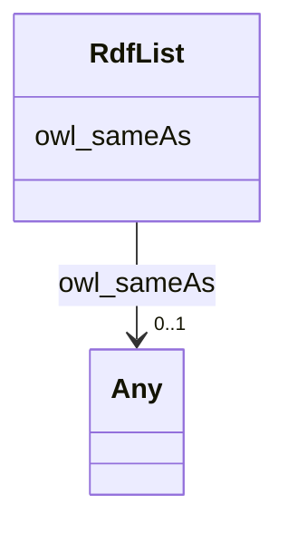

# Class: No class (type) name specified (rdf_List)


_No class (type) description specified_


This class occurs 1 times.


URI: [rdf:List](http://www.w3.org/1999/02/22-rdf-syntax-ns#List)





<!-- no inheritance hierarchy -->


## Slots

| Name | Cardinality and Range | Description | Inheritance | Occurrences |
| ---  | --- | --- | --- | --- |
| [owl_sameAs](../slots/owl_sameAs.md) | 0..1 <br/> [GeoGeometry](../classes/GeoGeometry.md)&nbsp;or&nbsp;<br />[RdfObjectProperty](../classes/RdfObjectProperty.md)&nbsp;or&nbsp;<br />[RdfList](../classes/RdfList.md)&nbsp;or&nbsp;<br />[KwgoAdministrativeRegion1](../classes/KwgoAdministrativeRegion1.md)&nbsp;or&nbsp;<br />[OwlThing](../classes/OwlThing.md)&nbsp;or&nbsp;<br />[xsd:anyURI](http://www.w3.org/2001/XMLSchema#anyURI)&nbsp;or&nbsp;<br />[Sf#Polygon](../classes/Sf#Polygon.md)&nbsp;or&nbsp;<br />[KwgoAdministrativeRegion3](../classes/KwgoAdministrativeRegion3.md)&nbsp;or&nbsp;<br />[KwgoAdministrativeRegion2](../classes/KwgoAdministrativeRegion2.md)&nbsp;or&nbsp;<br />[KwgoS2CellLevel13](../classes/KwgoS2CellLevel13.md) | No slot (predicate) description specified <br/>  | direct | 2 |


## Usages

| used by | used in | type | used |
| ---  | --- | --- | --- |
| [GeoGeometry](../classes/GeoGeometry.md) | [owl_sameAs](../slots/owl_sameAs.md) | any_of[range] | [RdfList](../classes/RdfList.md) |
| [KwgoAdministrativeRegion1](../classes/KwgoAdministrativeRegion1.md) | [owl_sameAs](../slots/owl_sameAs.md) | any_of[range] | [RdfList](../classes/RdfList.md) |
| [KwgoAdministrativeRegion2](../classes/KwgoAdministrativeRegion2.md) | [owl_sameAs](../slots/owl_sameAs.md) | any_of[range] | [RdfList](../classes/RdfList.md) |
| [KwgoAdministrativeRegion3](../classes/KwgoAdministrativeRegion3.md) | [owl_sameAs](../slots/owl_sameAs.md) | any_of[range] | [RdfList](../classes/RdfList.md) |
| [KwgoS2CellLevel13](../classes/KwgoS2CellLevel13.md) | [owl_sameAs](../slots/owl_sameAs.md) | any_of[range] | [RdfList](../classes/RdfList.md) |
| [OwlNamedIndividual](../classes/OwlNamedIndividual.md) | [owl_sameAs](../slots/owl_sameAs.md) | any_of[range] | [RdfList](../classes/RdfList.md) |
| [OwlNothing](../classes/OwlNothing.md) | [owl_sameAs](../slots/owl_sameAs.md) | any_of[range] | [RdfList](../classes/RdfList.md) |
| [OwlThing](../classes/OwlThing.md) | [owl_sameAs](../slots/owl_sameAs.md) | any_of[range] | [RdfList](../classes/RdfList.md) |
| [RdfList](../classes/RdfList.md) | [owl_sameAs](../slots/owl_sameAs.md) | any_of[range] | [RdfList](../classes/RdfList.md) |
| [RdfObjectProperty](../classes/RdfObjectProperty.md) | [owl_sameAs](../slots/owl_sameAs.md) | any_of[range] | [RdfList](../classes/RdfList.md) |
| [Sf#Polygon](../classes/Sf#Polygon.md) | [owl_sameAs](../slots/owl_sameAs.md) | any_of[range] | [RdfList](../classes/RdfList.md) |


## LinkML Source

<!-- TODO: investigate https://stackoverflow.com/questions/37606292/how-to-create-tabbed-code-blocks-in-mkdocs-or-sphinx -->

### Direct

<details>

```yaml
name: rdf_List
conforms_to: No schema conformance document specified
annotations:
  count:
    tag: count
    value: 1
description: No class (type) description specified
title: No class (type) name specified
from_schema: spatial-kg
rank: 1000
slots:
- owl_sameAs
slot_usage:
  owl_sameAs:
    name: owl_sameAs
    annotations:
      owl_Thing:
        tag: owl_Thing
        value: 1
      rdf_List:
        tag: rdf_List
        value: 1
class_uri: rdf:List

```
</details>

### Induced

<details>

```yaml
name: rdf_List
conforms_to: No schema conformance document specified
annotations:
  count:
    tag: count
    value: 1
description: No class (type) description specified
title: No class (type) name specified
from_schema: spatial-kg
rank: 1000
slot_usage:
  owl_sameAs:
    name: owl_sameAs
    annotations:
      owl_Thing:
        tag: owl_Thing
        value: 1
      rdf_List:
        tag: rdf_List
        value: 1
attributes:
  owl_sameAs:
    name: owl_sameAs
    annotations:
      owl_Thing:
        tag: owl_Thing
        value: 1
      rdf_List:
        tag: rdf_List
        value: 1
    description: No slot (predicate) description specified
    title: No slot (predicate) name specified
    examples:
    - object:
        example_object: http://sawgraph.spatialai.org/v1/saw_geo#d.Polygon.administrativeRegion.USA.1700105742
        example_object_type: sf_#Polygon
        example_predicate: owl:sameAs
        example_subject: http://sawgraph.spatialai.org/v1/saw_geo#d.Polygon.administrativeRegion.USA.1700105742
        example_subject_type: geo_Geometry
    - object:
        example_object: http://sawgraph.spatialai.org/v1/saw_geo#d.Polygon.administrativeRegion.USA.1700105742
        example_object_type: geo_Geometry
        example_predicate: owl:sameAs
        example_subject: http://sawgraph.spatialai.org/v1/saw_geo#d.Polygon.administrativeRegion.USA.1700105742
        example_subject_type: geo_Geometry
    - object:
        example_object: http://sawgraph.spatialai.org/v1/saw_geo#d.Polygon.administrativeRegion.USA.1700105742
        example_object_type: owl_Thing
        example_predicate: owl:sameAs
        example_subject: http://sawgraph.spatialai.org/v1/saw_geo#d.Polygon.administrativeRegion.USA.1700105742
        example_subject_type: geo_Geometry
    - object:
        example_object: http://sawgraph.spatialai.org/v1/saw_geo#d.Polygon.administrativeRegion.USA.1700105742
        example_object_type: sf_#Polygon
        example_predicate: owl:sameAs
        example_subject: http://sawgraph.spatialai.org/v1/saw_geo#d.Polygon.administrativeRegion.USA.1700105742
        example_subject_type: sf_#Polygon
    - object:
        example_object: http://sawgraph.spatialai.org/v1/saw_geo#d.Polygon.administrativeRegion.USA.1700105742
        example_object_type: geo_Geometry
        example_predicate: owl:sameAs
        example_subject: http://sawgraph.spatialai.org/v1/saw_geo#d.Polygon.administrativeRegion.USA.1700105742
        example_subject_type: sf_#Polygon
    - object:
        example_object: http://sawgraph.spatialai.org/v1/saw_geo#d.Polygon.administrativeRegion.USA.1700105742
        example_object_type: owl_Thing
        example_predicate: owl:sameAs
        example_subject: http://sawgraph.spatialai.org/v1/saw_geo#d.Polygon.administrativeRegion.USA.1700105742
        example_subject_type: sf_#Polygon
    - object:
        example_object: http://sawgraph.spatialai.org/v1/saw_geo#d.Polygon.administrativeRegion.USA.1700105742
        example_object_type: sf_#Polygon
        example_predicate: owl:sameAs
        example_subject: http://sawgraph.spatialai.org/v1/saw_geo#d.Polygon.administrativeRegion.USA.1700105742
        example_subject_type: owl_Thing
    - object:
        example_object: http://sawgraph.spatialai.org/v1/saw_geo#d.Polygon.administrativeRegion.USA.1700105742
        example_object_type: geo_Geometry
        example_predicate: owl:sameAs
        example_subject: http://sawgraph.spatialai.org/v1/saw_geo#d.Polygon.administrativeRegion.USA.1700105742
        example_subject_type: owl_Thing
    - object:
        example_object: http://sawgraph.spatialai.org/v1/saw_geo#d.Polygon.administrativeRegion.USA.1700105742
        example_object_type: owl_Thing
        example_predicate: owl:sameAs
        example_subject: http://sawgraph.spatialai.org/v1/saw_geo#d.Polygon.administrativeRegion.USA.1700105742
        example_subject_type: owl_Thing
    - object:
        example_object: kwgr:administrativeRegion.USA.17
        example_object_type: kwgo_AdministrativeRegion_1
        example_predicate: owl:sameAs
        example_subject: kwgr:administrativeRegion.USA.17
        example_subject_type: kwgo_AdministrativeRegion_1
    - object:
        example_object: kwgr:administrativeRegion.USA.17
        example_object_type: owl_Thing
        example_predicate: owl:sameAs
        example_subject: kwgr:administrativeRegion.USA.17
        example_subject_type: kwgo_AdministrativeRegion_1
    - object:
        example_object: kwgr:administrativeRegion.USA.17
        example_object_type: kwgo_AdministrativeRegion_1
        example_predicate: owl:sameAs
        example_subject: kwgr:administrativeRegion.USA.17
        example_subject_type: owl_Thing
    - object:
        example_object: kwgr:administrativeRegion.USA.17001
        example_object_type: kwgo_AdministrativeRegion_2
        example_predicate: owl:sameAs
        example_subject: kwgr:administrativeRegion.USA.17001
        example_subject_type: kwgo_AdministrativeRegion_2
    - object:
        example_object: kwgr:administrativeRegion.USA.17001
        example_object_type: owl_Thing
        example_predicate: owl:sameAs
        example_subject: kwgr:administrativeRegion.USA.17001
        example_subject_type: kwgo_AdministrativeRegion_2
    - object:
        example_object: kwgr:administrativeRegion.USA.17001
        example_object_type: kwgo_AdministrativeRegion_2
        example_predicate: owl:sameAs
        example_subject: kwgr:administrativeRegion.USA.17001
        example_subject_type: owl_Thing
    - object:
        example_object: kwgr:s2.level13.5522341869704445952
        example_object_type: kwgo_S2Cell_Level13
        example_predicate: owl:sameAs
        example_subject: kwgr:s2.level13.5522341869704445952
        example_subject_type: kwgo_S2Cell_Level13
    - object:
        example_object: kwgr:s2.level13.5522341869704445952
        example_object_type: owl_Thing
        example_predicate: owl:sameAs
        example_subject: kwgr:s2.level13.5522341869704445952
        example_subject_type: kwgo_S2Cell_Level13
    - object:
        example_object: kwgr:s2.level13.5522341869704445952
        example_object_type: kwgo_S2Cell_Level13
        example_predicate: owl:sameAs
        example_subject: kwgr:s2.level13.5522341869704445952
        example_subject_type: owl_Thing
    - object:
        example_object: rdf:nil
        example_object_type: rdf_List
        example_predicate: owl:sameAs
        example_subject: rdf:nil
        example_subject_type: owl_Thing
    - object:
        example_object: rdf:nil
        example_object_type: owl_Thing
        example_predicate: owl:sameAs
        example_subject: rdf:nil
        example_subject_type: rdf_List
    - object:
        example_object: rdf:nil
        example_object_type: rdf_List
        example_predicate: owl:sameAs
        example_subject: rdf:nil
        example_subject_type: rdf_List
    - object:
        example_object: owl:topObjectProperty
        example_object_type: rdf_ObjectProperty
        example_predicate: owl:sameAs
        example_subject: owl:topObjectProperty
        example_subject_type: rdf_ObjectProperty
    - object:
        example_object: owl:topObjectProperty
        example_object_type: owl_Thing
        example_predicate: owl:sameAs
        example_subject: owl:topObjectProperty
        example_subject_type: rdf_ObjectProperty
    - object:
        example_object: owl:topObjectProperty
        example_object_type: rdf_ObjectProperty
        example_predicate: owl:sameAs
        example_subject: owl:topObjectProperty
        example_subject_type: owl_Thing
    - object:
        example_object: https://datacommons.org/browser/geoId/1700105742
        example_object_type: kwgo_AdministrativeRegion_3
        example_predicate: owl:sameAs
        example_subject: https://datacommons.org/browser/geoId/1700105742
        example_subject_type: owl_Thing
    - object:
        example_object: https://datacommons.org/browser/geoId/1700105742
        example_object_type: owl_Thing
        example_predicate: owl:sameAs
        example_subject: https://datacommons.org/browser/geoId/1700105742
        example_subject_type: kwgo_AdministrativeRegion_3
    - object:
        example_object: https://datacommons.org/browser/geoId/1700105742
        example_object_type: kwgo_AdministrativeRegion_3
        example_predicate: owl:sameAs
        example_subject: https://datacommons.org/browser/geoId/1700105742
        example_subject_type: kwgo_AdministrativeRegion_3
    from_schema: spatial-kg
    rank: 1000
    domain: owl_sameAs
    slot_uri: owl:sameAs
    alias: owl_sameAs
    owner: rdf_List
    domain_of:
    - geo_Geometry
    - kwgo_AdministrativeRegion_1
    - kwgo_AdministrativeRegion_2
    - kwgo_AdministrativeRegion_3
    - kwgo_S2Cell_Level13
    - owl_Thing
    - rdf_List
    - rdf_ObjectProperty
    - sf_#Polygon
    range: Any
    any_of:
    - range: geo_Geometry
    - range: rdf_ObjectProperty
    - range: rdf_List
    - range: kwgo_AdministrativeRegion_1
    - range: owl_Thing
    - range: uri
    - range: sf_#Polygon
    - range: kwgo_AdministrativeRegion_3
    - range: kwgo_AdministrativeRegion_2
    - range: kwgo_S2Cell_Level13
class_uri: rdf:List

```
</details>