# Class: HttpsPurl.orgOknFrinkKgSpoke-genelabSchemaMetaNode


This class occurs 8 times.


URI: [https://purl.org/okn/frink/kg/spoke-genelab/schema/MetaNode](https://purl.org/okn/frink/kg/spoke-genelab/schema/MetaNode)

```mermaid
 classDiagram
    class HttpsPurl.orgOknFrinkKgSpoke-genelabSchemaMetaNode
    click HttpsPurl.orgOknFrinkKgSpoke-genelabSchemaMetaNode href "../HttpsPurl.orgOknFrinkKgSpoke-genelabSchemaMetaNode"
      HttpsPurl.orgOknFrinkKgSpoke-genelabSchemaMetaNode : https___purl.org_okn_frink_kg_spoke_genelab_schema_chromosome
        
          
    
    
    HttpsPurl.orgOknFrinkKgSpoke-genelabSchemaMetaNode --> "0..1" Any : https___purl.org_okn_frink_kg_spoke_genelab_schema_chromosome
    click Any href "../Any"

        
      HttpsPurl.orgOknFrinkKgSpoke-genelabSchemaMetaNode : https___purl.org_okn_frink_kg_spoke_genelab_schema_dist_to_feature
        
          
    
    
    HttpsPurl.orgOknFrinkKgSpoke-genelabSchemaMetaNode --> "0..1" Integer : https___purl.org_okn_frink_kg_spoke_genelab_schema_dist_to_feature
    click Integer href "../Integer"

        
      HttpsPurl.orgOknFrinkKgSpoke-genelabSchemaMetaNode : https___purl.org_okn_frink_kg_spoke_genelab_schema_end
        
          
    
    
    HttpsPurl.orgOknFrinkKgSpoke-genelabSchemaMetaNode --> "0..1" Integer : https___purl.org_okn_frink_kg_spoke_genelab_schema_end
    click Integer href "../Integer"

        
      HttpsPurl.orgOknFrinkKgSpoke-genelabSchemaMetaNode : https___purl.org_okn_frink_kg_spoke_genelab_schema_end_date
        
          
    
    
    HttpsPurl.orgOknFrinkKgSpoke-genelabSchemaMetaNode --> "0..1" Date : https___purl.org_okn_frink_kg_spoke_genelab_schema_end_date
    click Date href "../Date"

        
      HttpsPurl.orgOknFrinkKgSpoke-genelabSchemaMetaNode : https___purl.org_okn_frink_kg_spoke_genelab_schema_factor_space_1
        
          
    
    
    HttpsPurl.orgOknFrinkKgSpoke-genelabSchemaMetaNode --> "0..1" String : https___purl.org_okn_frink_kg_spoke_genelab_schema_factor_space_1
    click String href "../String"

        
      HttpsPurl.orgOknFrinkKgSpoke-genelabSchemaMetaNode : https___purl.org_okn_frink_kg_spoke_genelab_schema_factor_space_2
        
          
    
    
    HttpsPurl.orgOknFrinkKgSpoke-genelabSchemaMetaNode --> "0..1" String : https___purl.org_okn_frink_kg_spoke_genelab_schema_factor_space_2
    click String href "../String"

        
      HttpsPurl.orgOknFrinkKgSpoke-genelabSchemaMetaNode : https___purl.org_okn_frink_kg_spoke_genelab_schema_factors_1
        
          
    
    
    HttpsPurl.orgOknFrinkKgSpoke-genelabSchemaMetaNode --> "0..1" String : https___purl.org_okn_frink_kg_spoke_genelab_schema_factors_1
    click String href "../String"

        
      HttpsPurl.orgOknFrinkKgSpoke-genelabSchemaMetaNode : https___purl.org_okn_frink_kg_spoke_genelab_schema_factors_2
        
          
    
    
    HttpsPurl.orgOknFrinkKgSpoke-genelabSchemaMetaNode --> "0..1" String : https___purl.org_okn_frink_kg_spoke_genelab_schema_factors_2
    click String href "../String"

        
      HttpsPurl.orgOknFrinkKgSpoke-genelabSchemaMetaNode : https___purl.org_okn_frink_kg_spoke_genelab_schema_flight_program
        
          
    
    
    HttpsPurl.orgOknFrinkKgSpoke-genelabSchemaMetaNode --> "0..1" String : https___purl.org_okn_frink_kg_spoke_genelab_schema_flight_program
    click String href "../String"

        
      HttpsPurl.orgOknFrinkKgSpoke-genelabSchemaMetaNode : https___purl.org_okn_frink_kg_spoke_genelab_schema_in_exon
        
          
    
    
    HttpsPurl.orgOknFrinkKgSpoke-genelabSchemaMetaNode --> "0..1" Boolean : https___purl.org_okn_frink_kg_spoke_genelab_schema_in_exon
    click Boolean href "../Boolean"

        
      HttpsPurl.orgOknFrinkKgSpoke-genelabSchemaMetaNode : https___purl.org_okn_frink_kg_spoke_genelab_schema_in_intron
        
          
    
    
    HttpsPurl.orgOknFrinkKgSpoke-genelabSchemaMetaNode --> "0..1" Boolean : https___purl.org_okn_frink_kg_spoke_genelab_schema_in_intron
    click Boolean href "../Boolean"

        
      HttpsPurl.orgOknFrinkKgSpoke-genelabSchemaMetaNode : https___purl.org_okn_frink_kg_spoke_genelab_schema_in_promoter
        
          
    
    
    HttpsPurl.orgOknFrinkKgSpoke-genelabSchemaMetaNode --> "0..1" Boolean : https___purl.org_okn_frink_kg_spoke_genelab_schema_in_promoter
    click Boolean href "../Boolean"

        
      HttpsPurl.orgOknFrinkKgSpoke-genelabSchemaMetaNode : https___purl.org_okn_frink_kg_spoke_genelab_schema_material_1
        
          
    
    
    HttpsPurl.orgOknFrinkKgSpoke-genelabSchemaMetaNode --> "0..1" String : https___purl.org_okn_frink_kg_spoke_genelab_schema_material_1
    click String href "../String"

        
      HttpsPurl.orgOknFrinkKgSpoke-genelabSchemaMetaNode : https___purl.org_okn_frink_kg_spoke_genelab_schema_material_2
        
          
    
    
    HttpsPurl.orgOknFrinkKgSpoke-genelabSchemaMetaNode --> "0..1" String : https___purl.org_okn_frink_kg_spoke_genelab_schema_material_2
    click String href "../String"

        
      HttpsPurl.orgOknFrinkKgSpoke-genelabSchemaMetaNode : https___purl.org_okn_frink_kg_spoke_genelab_schema_material_id_1
        
          
    
    
    HttpsPurl.orgOknFrinkKgSpoke-genelabSchemaMetaNode --> "0..1" Any : https___purl.org_okn_frink_kg_spoke_genelab_schema_material_id_1
    click Any href "../Any"

        
      HttpsPurl.orgOknFrinkKgSpoke-genelabSchemaMetaNode : https___purl.org_okn_frink_kg_spoke_genelab_schema_material_id_2
        
          
    
    
    HttpsPurl.orgOknFrinkKgSpoke-genelabSchemaMetaNode --> "0..1" Any : https___purl.org_okn_frink_kg_spoke_genelab_schema_material_id_2
    click Any href "../Any"

        
      HttpsPurl.orgOknFrinkKgSpoke-genelabSchemaMetaNode : https___purl.org_okn_frink_kg_spoke_genelab_schema_material_name_1
        
          
    
    
    HttpsPurl.orgOknFrinkKgSpoke-genelabSchemaMetaNode --> "0..1" String : https___purl.org_okn_frink_kg_spoke_genelab_schema_material_name_1
    click String href "../String"

        
      HttpsPurl.orgOknFrinkKgSpoke-genelabSchemaMetaNode : https___purl.org_okn_frink_kg_spoke_genelab_schema_material_name_2
        
          
    
    
    HttpsPurl.orgOknFrinkKgSpoke-genelabSchemaMetaNode --> "0..1" String : https___purl.org_okn_frink_kg_spoke_genelab_schema_material_name_2
    click String href "../String"

        
      HttpsPurl.orgOknFrinkKgSpoke-genelabSchemaMetaNode : https___purl.org_okn_frink_kg_spoke_genelab_schema_measurement
        
          
    
    
    HttpsPurl.orgOknFrinkKgSpoke-genelabSchemaMetaNode --> "0..1" String : https___purl.org_okn_frink_kg_spoke_genelab_schema_measurement
    click String href "../String"

        
      HttpsPurl.orgOknFrinkKgSpoke-genelabSchemaMetaNode : https___purl.org_okn_frink_kg_spoke_genelab_schema_MetaRelationship
        
          
    
    
    HttpsPurl.orgOknFrinkKgSpoke-genelabSchemaMetaNode --> "0..1" HttpsPurl.orgOknFrinkKgSpoke-genelabSchemaMetaNode : https___purl.org_okn_frink_kg_spoke_genelab_schema_MetaRelationship
    click HttpsPurl.orgOknFrinkKgSpoke-genelabSchemaMetaNode href "../HttpsPurl.orgOknFrinkKgSpoke-genelabSchemaMetaNode"

        
      HttpsPurl.orgOknFrinkKgSpoke-genelabSchemaMetaNode : https___purl.org_okn_frink_kg_spoke_genelab_schema_organism
        
          
    
    
    HttpsPurl.orgOknFrinkKgSpoke-genelabSchemaMetaNode --> "0..1" String : https___purl.org_okn_frink_kg_spoke_genelab_schema_organism
    click String href "../String"

        
      HttpsPurl.orgOknFrinkKgSpoke-genelabSchemaMetaNode : https___purl.org_okn_frink_kg_spoke_genelab_schema_project_title
        
          
    
    
    HttpsPurl.orgOknFrinkKgSpoke-genelabSchemaMetaNode --> "0..1" String : https___purl.org_okn_frink_kg_spoke_genelab_schema_project_title
    click String href "../String"

        
      HttpsPurl.orgOknFrinkKgSpoke-genelabSchemaMetaNode : https___purl.org_okn_frink_kg_spoke_genelab_schema_project_type
        
          
    
    
    HttpsPurl.orgOknFrinkKgSpoke-genelabSchemaMetaNode --> "0..1" String : https___purl.org_okn_frink_kg_spoke_genelab_schema_project_type
    click String href "../String"

        
      HttpsPurl.orgOknFrinkKgSpoke-genelabSchemaMetaNode : https___purl.org_okn_frink_kg_spoke_genelab_schema_space_program
        
          
    
    
    HttpsPurl.orgOknFrinkKgSpoke-genelabSchemaMetaNode --> "0..1" String : https___purl.org_okn_frink_kg_spoke_genelab_schema_space_program
    click String href "../String"

        
      HttpsPurl.orgOknFrinkKgSpoke-genelabSchemaMetaNode : https___purl.org_okn_frink_kg_spoke_genelab_schema_start
        
          
    
    
    HttpsPurl.orgOknFrinkKgSpoke-genelabSchemaMetaNode --> "0..1" Integer : https___purl.org_okn_frink_kg_spoke_genelab_schema_start
    click Integer href "../Integer"

        
      HttpsPurl.orgOknFrinkKgSpoke-genelabSchemaMetaNode : https___purl.org_okn_frink_kg_spoke_genelab_schema_start_date
        
          
    
    
    HttpsPurl.orgOknFrinkKgSpoke-genelabSchemaMetaNode --> "0..1" Date : https___purl.org_okn_frink_kg_spoke_genelab_schema_start_date
    click Date href "../Date"

        
      HttpsPurl.orgOknFrinkKgSpoke-genelabSchemaMetaNode : https___purl.org_okn_frink_kg_spoke_genelab_schema_symbol
        
          
    
    
    HttpsPurl.orgOknFrinkKgSpoke-genelabSchemaMetaNode --> "0..1" String : https___purl.org_okn_frink_kg_spoke_genelab_schema_symbol
    click String href "../String"

        
      HttpsPurl.orgOknFrinkKgSpoke-genelabSchemaMetaNode : https___purl.org_okn_frink_kg_spoke_genelab_schema_taxonomy
        
          
    
    
    HttpsPurl.orgOknFrinkKgSpoke-genelabSchemaMetaNode --> "0..1" Any : https___purl.org_okn_frink_kg_spoke_genelab_schema_taxonomy
    click Any href "../Any"

        
      HttpsPurl.orgOknFrinkKgSpoke-genelabSchemaMetaNode : https___purl.org_okn_frink_kg_spoke_genelab_schema_technology
        
          
    
    
    HttpsPurl.orgOknFrinkKgSpoke-genelabSchemaMetaNode --> "0..1" String : https___purl.org_okn_frink_kg_spoke_genelab_schema_technology
    click String href "../String"

        
      HttpsPurl.orgOknFrinkKgSpoke-genelabSchemaMetaNode : rdfs_comment
        
          
    
    
    HttpsPurl.orgOknFrinkKgSpoke-genelabSchemaMetaNode --> "0..1" Any : rdfs_comment
    click Any href "../Any"

        
      HttpsPurl.orgOknFrinkKgSpoke-genelabSchemaMetaNode : rdfs_label
        
          
    
    
    HttpsPurl.orgOknFrinkKgSpoke-genelabSchemaMetaNode --> "0..1" Any : rdfs_label
    click Any href "../Any"

        
      
```





<!-- no inheritance hierarchy -->


## Slots

| Name | Cardinality and Range | Description | Inheritance | Occurrences |
| ---  | --- | --- | --- | --- |
| [https___purl.org_okn_frink_kg_spoke_genelab_schema_end](../slots/https___purl.org_okn_frink_kg_spoke_genelab_schema_end.md) | 0..1 <br/> [xsd:integer](http://www.w3.org/2001/XMLSchema#integer) |  <br/>  | direct | 1 |
| [https___purl.org_okn_frink_kg_spoke_genelab_schema_start_date](../slots/https___purl.org_okn_frink_kg_spoke_genelab_schema_start_date.md) | 0..1 <br/> [xsd:date](http://www.w3.org/2001/XMLSchema#date) |  <br/>  | direct | 1 |
| [https___purl.org_okn_frink_kg_spoke_genelab_schema_material_2](../slots/https___purl.org_okn_frink_kg_spoke_genelab_schema_material_2.md) | 0..1 <br/> [xsd:string](http://www.w3.org/2001/XMLSchema#string) |  <br/>  | direct | 1 |
| [https___purl.org_okn_frink_kg_spoke_genelab_schema_taxonomy](../slots/https___purl.org_okn_frink_kg_spoke_genelab_schema_taxonomy.md) | 0..1 <br/> [xsd:anyURI](http://www.w3.org/2001/XMLSchema#anyURI)&nbsp;or&nbsp;<br />[xsd:string](http://www.w3.org/2001/XMLSchema#string) |  <br/>  | direct | 2 |
| [https___purl.org_okn_frink_kg_spoke_genelab_schema_symbol](../slots/https___purl.org_okn_frink_kg_spoke_genelab_schema_symbol.md) | 0..1 <br/> [xsd:string](http://www.w3.org/2001/XMLSchema#string) |  <br/>  | direct | 1 |
| [https___purl.org_okn_frink_kg_spoke_genelab_schema_factor_space_1](../slots/https___purl.org_okn_frink_kg_spoke_genelab_schema_factor_space_1.md) | 0..1 <br/> [xsd:string](http://www.w3.org/2001/XMLSchema#string) |  <br/>  | direct | 1 |
| [https___purl.org_okn_frink_kg_spoke_genelab_schema_dist_to_feature](../slots/https___purl.org_okn_frink_kg_spoke_genelab_schema_dist_to_feature.md) | 0..1 <br/> [xsd:integer](http://www.w3.org/2001/XMLSchema#integer) |  <br/>  | direct | 1 |
| [https___purl.org_okn_frink_kg_spoke_genelab_schema_start](../slots/https___purl.org_okn_frink_kg_spoke_genelab_schema_start.md) | 0..1 <br/> [xsd:integer](http://www.w3.org/2001/XMLSchema#integer) |  <br/>  | direct | 1 |
| [rdfs_label](../slots/rdfs_label.md) | 0..1 <br/> [RdfsLiteral](../classes/RdfsLiteral.md)&nbsp;or&nbsp;<br />[xsd:string](http://www.w3.org/2001/XMLSchema#string) | A human-readable name for the subject <br/>  | direct | 13 |
| [https___purl.org_okn_frink_kg_spoke_genelab_schema_material_id_2](../slots/https___purl.org_okn_frink_kg_spoke_genelab_schema_material_id_2.md) | 0..1 <br/> [HttpsW3id.orgBiolinkVocabAnatomicalEntity](../classes/HttpsW3id.orgBiolinkVocabAnatomicalEntity.md)&nbsp;or&nbsp;<br />[xsd:string](http://www.w3.org/2001/XMLSchema#string)&nbsp;or&nbsp;<br />[HttpsW3id.orgBiolinkVocabCell](../classes/HttpsW3id.orgBiolinkVocabCell.md) |  <br/>  | direct | 1 |
| [https___purl.org_okn_frink_kg_spoke_genelab_schema_flight_program](../slots/https___purl.org_okn_frink_kg_spoke_genelab_schema_flight_program.md) | 0..1 <br/> [xsd:string](http://www.w3.org/2001/XMLSchema#string) |  <br/>  | direct | 1 |
| [https___purl.org_okn_frink_kg_spoke_genelab_schema_material_1](../slots/https___purl.org_okn_frink_kg_spoke_genelab_schema_material_1.md) | 0..1 <br/> [xsd:string](http://www.w3.org/2001/XMLSchema#string) |  <br/>  | direct | 1 |
| [https___purl.org_okn_frink_kg_spoke_genelab_schema_material_name_2](../slots/https___purl.org_okn_frink_kg_spoke_genelab_schema_material_name_2.md) | 0..1 <br/> [xsd:string](http://www.w3.org/2001/XMLSchema#string) |  <br/>  | direct | 1 |
| [https___purl.org_okn_frink_kg_spoke_genelab_schema_technology](../slots/https___purl.org_okn_frink_kg_spoke_genelab_schema_technology.md) | 0..1 <br/> [xsd:string](http://www.w3.org/2001/XMLSchema#string) |  <br/>  | direct | 1 |
| [https___purl.org_okn_frink_kg_spoke_genelab_schema_organism](../slots/https___purl.org_okn_frink_kg_spoke_genelab_schema_organism.md) | 0..1 <br/> [xsd:string](http://www.w3.org/2001/XMLSchema#string) |  <br/>  | direct | 2 |
| [https___purl.org_okn_frink_kg_spoke_genelab_schema_material_name_1](../slots/https___purl.org_okn_frink_kg_spoke_genelab_schema_material_name_1.md) | 0..1 <br/> [xsd:string](http://www.w3.org/2001/XMLSchema#string) |  <br/>  | direct | 1 |
| [https___purl.org_okn_frink_kg_spoke_genelab_schema_project_type](../slots/https___purl.org_okn_frink_kg_spoke_genelab_schema_project_type.md) | 0..1 <br/> [xsd:string](http://www.w3.org/2001/XMLSchema#string) |  <br/>  | direct | 1 |
| [https___purl.org_okn_frink_kg_spoke_genelab_schema_chromosome](../slots/https___purl.org_okn_frink_kg_spoke_genelab_schema_chromosome.md) | 0..1 <br/> [xsd:anyURI](http://www.w3.org/2001/XMLSchema#anyURI)&nbsp;or&nbsp;<br />[xsd:string](http://www.w3.org/2001/XMLSchema#string) |  <br/>  | direct | 1 |
| [https___purl.org_okn_frink_kg_spoke_genelab_schema_measurement](../slots/https___purl.org_okn_frink_kg_spoke_genelab_schema_measurement.md) | 0..1 <br/> [xsd:string](http://www.w3.org/2001/XMLSchema#string) |  <br/>  | direct | 1 |
| [https___purl.org_okn_frink_kg_spoke_genelab_schema_end_date](../slots/https___purl.org_okn_frink_kg_spoke_genelab_schema_end_date.md) | 0..1 <br/> [xsd:date](http://www.w3.org/2001/XMLSchema#date) |  <br/>  | direct | 1 |
| [rdfs_comment](../slots/rdfs_comment.md) | 0..1 <br/> [RdfsLiteral](../classes/RdfsLiteral.md)&nbsp;or&nbsp;<br />[xsd:string](http://www.w3.org/2001/XMLSchema#string) | A description of the subject resource <br/>  | direct | 1 |
| [https___purl.org_okn_frink_kg_spoke_genelab_schema_in_exon](../slots/https___purl.org_okn_frink_kg_spoke_genelab_schema_in_exon.md) | 0..1 <br/> [xsd:boolean](http://www.w3.org/2001/XMLSchema#boolean) |  <br/>  | direct | 1 |
| [https___purl.org_okn_frink_kg_spoke_genelab_schema_factors_1](../slots/https___purl.org_okn_frink_kg_spoke_genelab_schema_factors_1.md) | 0..1 <br/> [xsd:string](http://www.w3.org/2001/XMLSchema#string) |  <br/>  | direct | 1 |
| [https___purl.org_okn_frink_kg_spoke_genelab_schema_in_promoter](../slots/https___purl.org_okn_frink_kg_spoke_genelab_schema_in_promoter.md) | 0..1 <br/> [xsd:boolean](http://www.w3.org/2001/XMLSchema#boolean) |  <br/>  | direct | 1 |
| [https___purl.org_okn_frink_kg_spoke_genelab_schema_project_title](../slots/https___purl.org_okn_frink_kg_spoke_genelab_schema_project_title.md) | 0..1 <br/> [xsd:string](http://www.w3.org/2001/XMLSchema#string) |  <br/>  | direct | 1 |
| [https___purl.org_okn_frink_kg_spoke_genelab_schema_space_program](../slots/https___purl.org_okn_frink_kg_spoke_genelab_schema_space_program.md) | 0..1 <br/> [xsd:string](http://www.w3.org/2001/XMLSchema#string) |  <br/>  | direct | 1 |
| [https___purl.org_okn_frink_kg_spoke_genelab_schema_MetaRelationship](../slots/https___purl.org_okn_frink_kg_spoke_genelab_schema_MetaRelationship.md) | 0..1 <br/> [HttpsPurl.orgOknFrinkKgSpoke-genelabSchemaMetaNode](../classes/HttpsPurl.orgOknFrinkKgSpoke-genelabSchemaMetaNode.md) |  <br/>  | direct | 8 |
| [https___purl.org_okn_frink_kg_spoke_genelab_schema_in_intron](../slots/https___purl.org_okn_frink_kg_spoke_genelab_schema_in_intron.md) | 0..1 <br/> [xsd:boolean](http://www.w3.org/2001/XMLSchema#boolean) |  <br/>  | direct | 1 |
| [https___purl.org_okn_frink_kg_spoke_genelab_schema_factor_space_2](../slots/https___purl.org_okn_frink_kg_spoke_genelab_schema_factor_space_2.md) | 0..1 <br/> [xsd:string](http://www.w3.org/2001/XMLSchema#string) |  <br/>  | direct | 1 |
| [https___purl.org_okn_frink_kg_spoke_genelab_schema_material_id_1](../slots/https___purl.org_okn_frink_kg_spoke_genelab_schema_material_id_1.md) | 0..1 <br/> [HttpsW3id.orgBiolinkVocabAnatomicalEntity](../classes/HttpsW3id.orgBiolinkVocabAnatomicalEntity.md)&nbsp;or&nbsp;<br />[xsd:string](http://www.w3.org/2001/XMLSchema#string)&nbsp;or&nbsp;<br />[HttpsW3id.orgBiolinkVocabCell](../classes/HttpsW3id.orgBiolinkVocabCell.md) |  <br/>  | direct | 1 |
| [https___purl.org_okn_frink_kg_spoke_genelab_schema_factors_2](../slots/https___purl.org_okn_frink_kg_spoke_genelab_schema_factors_2.md) | 0..1 <br/> [xsd:string](http://www.w3.org/2001/XMLSchema#string) |  <br/>  | direct | 1 |


## Usages

| used by | used in | type | used |
| ---  | --- | --- | --- |
| [HttpsPurl.orgOknFrinkKgSpoke-genelabSchemaMetaNode](../classes/HttpsPurl.orgOknFrinkKgSpoke-genelabSchemaMetaNode.md) | [https___purl.org_okn_frink_kg_spoke_genelab_schema_MetaRelationship](../slots/https___purl.org_okn_frink_kg_spoke_genelab_schema_MetaRelationship.md) | range | [HttpsPurl.orgOknFrinkKgSpoke-genelabSchemaMetaNode](../classes/HttpsPurl.orgOknFrinkKgSpoke-genelabSchemaMetaNode.md) |


## LinkML Source

<!-- TODO: investigate https://stackoverflow.com/questions/37606292/how-to-create-tabbed-code-blocks-in-mkdocs-or-sphinx -->

### Direct

<details>

```yaml
name: https___purl.org_okn_frink_kg_spoke-genelab_schema_MetaNode
from_schema: okns:spoke-genelab
rank: 1000
slots:
- https___purl.org_okn_frink_kg_spoke-genelab_schema_end
- https___purl.org_okn_frink_kg_spoke-genelab_schema_start_date
- https___purl.org_okn_frink_kg_spoke-genelab_schema_material_2
- https___purl.org_okn_frink_kg_spoke-genelab_schema_taxonomy
- https___purl.org_okn_frink_kg_spoke-genelab_schema_symbol
- https___purl.org_okn_frink_kg_spoke-genelab_schema_factor_space_1
- https___purl.org_okn_frink_kg_spoke-genelab_schema_dist_to_feature
- https___purl.org_okn_frink_kg_spoke-genelab_schema_start
- rdfs_label
- https___purl.org_okn_frink_kg_spoke-genelab_schema_material_id_2
- https___purl.org_okn_frink_kg_spoke-genelab_schema_flight_program
- https___purl.org_okn_frink_kg_spoke-genelab_schema_material_1
- https___purl.org_okn_frink_kg_spoke-genelab_schema_material_name_2
- https___purl.org_okn_frink_kg_spoke-genelab_schema_technology
- https___purl.org_okn_frink_kg_spoke-genelab_schema_organism
- https___purl.org_okn_frink_kg_spoke-genelab_schema_material_name_1
- https___purl.org_okn_frink_kg_spoke-genelab_schema_project_type
- https___purl.org_okn_frink_kg_spoke-genelab_schema_chromosome
- https___purl.org_okn_frink_kg_spoke-genelab_schema_measurement
- https___purl.org_okn_frink_kg_spoke-genelab_schema_end_date
- rdfs_comment
- https___purl.org_okn_frink_kg_spoke-genelab_schema_in_exon
- https___purl.org_okn_frink_kg_spoke-genelab_schema_factors_1
- https___purl.org_okn_frink_kg_spoke-genelab_schema_in_promoter
- https___purl.org_okn_frink_kg_spoke-genelab_schema_project_title
- https___purl.org_okn_frink_kg_spoke-genelab_schema_space_program
- https___purl.org_okn_frink_kg_spoke-genelab_schema_MetaRelationship
- https___purl.org_okn_frink_kg_spoke-genelab_schema_in_intron
- https___purl.org_okn_frink_kg_spoke-genelab_schema_factor_space_2
- https___purl.org_okn_frink_kg_spoke-genelab_schema_material_id_1
- https___purl.org_okn_frink_kg_spoke-genelab_schema_factors_2
class_uri: https://purl.org/okn/frink/kg/spoke-genelab/schema/MetaNode

```
</details>

### Induced

<details>

```yaml
name: https___purl.org_okn_frink_kg_spoke-genelab_schema_MetaNode
from_schema: okns:spoke-genelab
rank: 1000
attributes:
  https___purl.org_okn_frink_kg_spoke-genelab_schema_end:
    name: https___purl.org_okn_frink_kg_spoke-genelab_schema_end
    from_schema: okns:spoke-genelab
    rank: 1000
    slot_uri: https://purl.org/okn/frink/kg/spoke-genelab/schema/end
    alias: https___purl.org_okn_frink_kg_spoke_genelab_schema_end
    owner: https___purl.org_okn_frink_kg_spoke-genelab_schema_MetaNode
    domain_of:
    - https___purl.org_okn_frink_kg_spoke-genelab_schema_MetaNode
    - https___purl.org_okn_frink_kg_spoke-genelab_schema_MethylationRegion
    range: integer
  https___purl.org_okn_frink_kg_spoke-genelab_schema_start_date:
    name: https___purl.org_okn_frink_kg_spoke-genelab_schema_start_date
    from_schema: okns:spoke-genelab
    rank: 1000
    slot_uri: https://purl.org/okn/frink/kg/spoke-genelab/schema/start_date
    alias: https___purl.org_okn_frink_kg_spoke_genelab_schema_start_date
    owner: https___purl.org_okn_frink_kg_spoke-genelab_schema_MetaNode
    domain_of:
    - https___purl.org_okn_frink_kg_spoke-genelab_schema_MetaNode
    - https___purl.org_okn_frink_kg_spoke-genelab_schema_Mission
    range: date
  https___purl.org_okn_frink_kg_spoke-genelab_schema_material_2:
    name: https___purl.org_okn_frink_kg_spoke-genelab_schema_material_2
    from_schema: okns:spoke-genelab
    rank: 1000
    slot_uri: https://purl.org/okn/frink/kg/spoke-genelab/schema/material_2
    alias: https___purl.org_okn_frink_kg_spoke_genelab_schema_material_2
    owner: https___purl.org_okn_frink_kg_spoke-genelab_schema_MetaNode
    domain_of:
    - https___purl.org_okn_frink_kg_spoke-genelab_schema_MetaNode
    - obo_OBI_0000070
    range: string
  https___purl.org_okn_frink_kg_spoke-genelab_schema_taxonomy:
    name: https___purl.org_okn_frink_kg_spoke-genelab_schema_taxonomy
    from_schema: okns:spoke-genelab
    rank: 1000
    slot_uri: https://purl.org/okn/frink/kg/spoke-genelab/schema/taxonomy
    alias: https___purl.org_okn_frink_kg_spoke_genelab_schema_taxonomy
    owner: https___purl.org_okn_frink_kg_spoke-genelab_schema_MetaNode
    domain_of:
    - https___purl.org_okn_frink_kg_spoke-genelab_schema_MetaNode
    - https___w3id.org_biolink_vocab_Gene
    - https___w3id.org_biolink_vocab_Study
    range: Any
    any_of:
    - range: uri
    - range: string
  https___purl.org_okn_frink_kg_spoke-genelab_schema_symbol:
    name: https___purl.org_okn_frink_kg_spoke-genelab_schema_symbol
    from_schema: okns:spoke-genelab
    rank: 1000
    slot_uri: https://purl.org/okn/frink/kg/spoke-genelab/schema/symbol
    alias: https___purl.org_okn_frink_kg_spoke_genelab_schema_symbol
    owner: https___purl.org_okn_frink_kg_spoke-genelab_schema_MetaNode
    domain_of:
    - https___purl.org_okn_frink_kg_spoke-genelab_schema_MetaNode
    - https___w3id.org_biolink_vocab_Gene
    range: string
  https___purl.org_okn_frink_kg_spoke-genelab_schema_factor_space_1:
    name: https___purl.org_okn_frink_kg_spoke-genelab_schema_factor_space_1
    from_schema: okns:spoke-genelab
    rank: 1000
    slot_uri: https://purl.org/okn/frink/kg/spoke-genelab/schema/factor_space_1
    alias: https___purl.org_okn_frink_kg_spoke_genelab_schema_factor_space_1
    owner: https___purl.org_okn_frink_kg_spoke-genelab_schema_MetaNode
    domain_of:
    - https___purl.org_okn_frink_kg_spoke-genelab_schema_MetaNode
    - obo_OBI_0000070
    range: string
  https___purl.org_okn_frink_kg_spoke-genelab_schema_dist_to_feature:
    name: https___purl.org_okn_frink_kg_spoke-genelab_schema_dist_to_feature
    from_schema: okns:spoke-genelab
    rank: 1000
    slot_uri: https://purl.org/okn/frink/kg/spoke-genelab/schema/dist_to_feature
    alias: https___purl.org_okn_frink_kg_spoke_genelab_schema_dist_to_feature
    owner: https___purl.org_okn_frink_kg_spoke-genelab_schema_MetaNode
    domain_of:
    - https___purl.org_okn_frink_kg_spoke-genelab_schema_MetaNode
    - https___purl.org_okn_frink_kg_spoke-genelab_schema_MethylationRegion
    range: integer
  https___purl.org_okn_frink_kg_spoke-genelab_schema_start:
    name: https___purl.org_okn_frink_kg_spoke-genelab_schema_start
    from_schema: okns:spoke-genelab
    rank: 1000
    slot_uri: https://purl.org/okn/frink/kg/spoke-genelab/schema/start
    alias: https___purl.org_okn_frink_kg_spoke_genelab_schema_start
    owner: https___purl.org_okn_frink_kg_spoke-genelab_schema_MetaNode
    domain_of:
    - https___purl.org_okn_frink_kg_spoke-genelab_schema_MetaNode
    - https___purl.org_okn_frink_kg_spoke-genelab_schema_MethylationRegion
    range: integer
  rdfs_label:
    name: rdfs_label
    description: A human-readable name for the subject.
    title: label
    from_schema: okns:owl-rdf-rdfs
    source: http://www.w3.org/2000/01/rdf-schema#
    domain: rdfs_Resource
    slot_uri: rdfs:label
    alias: rdfs_label
    owner: https___purl.org_okn_frink_kg_spoke-genelab_schema_MetaNode
    domain_of:
    - rdf_List
    - rdfs_Datatype
    - https___purl.org_okn_frink_kg_spoke-genelab_schema_MetaNode
    - https___purl.org_okn_frink_kg_spoke-genelab_schema_MethylationRegion
    - https___purl.org_okn_frink_kg_spoke-genelab_schema_Mission
    - https___w3id.org_biolink_vocab_Gene
    - https___w3id.org_biolink_vocab_Study
    - obo_OBI_0000070
    range: Any
    any_of:
    - range: rdfs_Literal
    - range: string
  https___purl.org_okn_frink_kg_spoke-genelab_schema_material_id_2:
    name: https___purl.org_okn_frink_kg_spoke-genelab_schema_material_id_2
    from_schema: okns:spoke-genelab
    rank: 1000
    slot_uri: https://purl.org/okn/frink/kg/spoke-genelab/schema/material_id_2
    alias: https___purl.org_okn_frink_kg_spoke_genelab_schema_material_id_2
    owner: https___purl.org_okn_frink_kg_spoke-genelab_schema_MetaNode
    domain_of:
    - https___purl.org_okn_frink_kg_spoke-genelab_schema_MetaNode
    - obo_OBI_0000070
    range: Any
    any_of:
    - range: https___w3id.org_biolink_vocab_AnatomicalEntity
    - range: string
    - range: https___w3id.org_biolink_vocab_Cell
  https___purl.org_okn_frink_kg_spoke-genelab_schema_flight_program:
    name: https___purl.org_okn_frink_kg_spoke-genelab_schema_flight_program
    from_schema: okns:spoke-genelab
    rank: 1000
    slot_uri: https://purl.org/okn/frink/kg/spoke-genelab/schema/flight_program
    alias: https___purl.org_okn_frink_kg_spoke_genelab_schema_flight_program
    owner: https___purl.org_okn_frink_kg_spoke-genelab_schema_MetaNode
    domain_of:
    - https___purl.org_okn_frink_kg_spoke-genelab_schema_MetaNode
    - https___purl.org_okn_frink_kg_spoke-genelab_schema_Mission
    range: string
  https___purl.org_okn_frink_kg_spoke-genelab_schema_material_1:
    name: https___purl.org_okn_frink_kg_spoke-genelab_schema_material_1
    from_schema: okns:spoke-genelab
    rank: 1000
    slot_uri: https://purl.org/okn/frink/kg/spoke-genelab/schema/material_1
    alias: https___purl.org_okn_frink_kg_spoke_genelab_schema_material_1
    owner: https___purl.org_okn_frink_kg_spoke-genelab_schema_MetaNode
    domain_of:
    - https___purl.org_okn_frink_kg_spoke-genelab_schema_MetaNode
    - obo_OBI_0000070
    range: string
  https___purl.org_okn_frink_kg_spoke-genelab_schema_material_name_2:
    name: https___purl.org_okn_frink_kg_spoke-genelab_schema_material_name_2
    from_schema: okns:spoke-genelab
    rank: 1000
    slot_uri: https://purl.org/okn/frink/kg/spoke-genelab/schema/material_name_2
    alias: https___purl.org_okn_frink_kg_spoke_genelab_schema_material_name_2
    owner: https___purl.org_okn_frink_kg_spoke-genelab_schema_MetaNode
    domain_of:
    - https___purl.org_okn_frink_kg_spoke-genelab_schema_MetaNode
    - obo_OBI_0000070
    range: string
  https___purl.org_okn_frink_kg_spoke-genelab_schema_technology:
    name: https___purl.org_okn_frink_kg_spoke-genelab_schema_technology
    from_schema: okns:spoke-genelab
    rank: 1000
    slot_uri: https://purl.org/okn/frink/kg/spoke-genelab/schema/technology
    alias: https___purl.org_okn_frink_kg_spoke_genelab_schema_technology
    owner: https___purl.org_okn_frink_kg_spoke-genelab_schema_MetaNode
    domain_of:
    - https___purl.org_okn_frink_kg_spoke-genelab_schema_MetaNode
    - obo_OBI_0000070
    range: string
  https___purl.org_okn_frink_kg_spoke-genelab_schema_organism:
    name: https___purl.org_okn_frink_kg_spoke-genelab_schema_organism
    from_schema: okns:spoke-genelab
    rank: 1000
    slot_uri: https://purl.org/okn/frink/kg/spoke-genelab/schema/organism
    alias: https___purl.org_okn_frink_kg_spoke_genelab_schema_organism
    owner: https___purl.org_okn_frink_kg_spoke-genelab_schema_MetaNode
    domain_of:
    - https___purl.org_okn_frink_kg_spoke-genelab_schema_MetaNode
    - https___w3id.org_biolink_vocab_Gene
    - https___w3id.org_biolink_vocab_Study
    range: string
  https___purl.org_okn_frink_kg_spoke-genelab_schema_material_name_1:
    name: https___purl.org_okn_frink_kg_spoke-genelab_schema_material_name_1
    from_schema: okns:spoke-genelab
    rank: 1000
    slot_uri: https://purl.org/okn/frink/kg/spoke-genelab/schema/material_name_1
    alias: https___purl.org_okn_frink_kg_spoke_genelab_schema_material_name_1
    owner: https___purl.org_okn_frink_kg_spoke-genelab_schema_MetaNode
    domain_of:
    - https___purl.org_okn_frink_kg_spoke-genelab_schema_MetaNode
    - obo_OBI_0000070
    range: string
  https___purl.org_okn_frink_kg_spoke-genelab_schema_project_type:
    name: https___purl.org_okn_frink_kg_spoke-genelab_schema_project_type
    from_schema: okns:spoke-genelab
    rank: 1000
    slot_uri: https://purl.org/okn/frink/kg/spoke-genelab/schema/project_type
    alias: https___purl.org_okn_frink_kg_spoke_genelab_schema_project_type
    owner: https___purl.org_okn_frink_kg_spoke-genelab_schema_MetaNode
    domain_of:
    - https___purl.org_okn_frink_kg_spoke-genelab_schema_MetaNode
    - https___w3id.org_biolink_vocab_Study
    range: string
  https___purl.org_okn_frink_kg_spoke-genelab_schema_chromosome:
    name: https___purl.org_okn_frink_kg_spoke-genelab_schema_chromosome
    from_schema: okns:spoke-genelab
    rank: 1000
    slot_uri: https://purl.org/okn/frink/kg/spoke-genelab/schema/chromosome
    alias: https___purl.org_okn_frink_kg_spoke_genelab_schema_chromosome
    owner: https___purl.org_okn_frink_kg_spoke-genelab_schema_MetaNode
    domain_of:
    - https___purl.org_okn_frink_kg_spoke-genelab_schema_MetaNode
    - https___purl.org_okn_frink_kg_spoke-genelab_schema_MethylationRegion
    range: Any
    any_of:
    - range: uri
    - range: string
  https___purl.org_okn_frink_kg_spoke-genelab_schema_measurement:
    name: https___purl.org_okn_frink_kg_spoke-genelab_schema_measurement
    from_schema: okns:spoke-genelab
    rank: 1000
    slot_uri: https://purl.org/okn/frink/kg/spoke-genelab/schema/measurement
    alias: https___purl.org_okn_frink_kg_spoke_genelab_schema_measurement
    owner: https___purl.org_okn_frink_kg_spoke-genelab_schema_MetaNode
    domain_of:
    - https___purl.org_okn_frink_kg_spoke-genelab_schema_MetaNode
    - obo_OBI_0000070
    range: string
  https___purl.org_okn_frink_kg_spoke-genelab_schema_end_date:
    name: https___purl.org_okn_frink_kg_spoke-genelab_schema_end_date
    from_schema: okns:spoke-genelab
    rank: 1000
    slot_uri: https://purl.org/okn/frink/kg/spoke-genelab/schema/end_date
    alias: https___purl.org_okn_frink_kg_spoke_genelab_schema_end_date
    owner: https___purl.org_okn_frink_kg_spoke-genelab_schema_MetaNode
    domain_of:
    - https___purl.org_okn_frink_kg_spoke-genelab_schema_MetaNode
    - https___purl.org_okn_frink_kg_spoke-genelab_schema_Mission
    range: date
  rdfs_comment:
    name: rdfs_comment
    description: A description of the subject resource.
    title: comment
    from_schema: okns:owl-rdf-rdfs
    source: http://www.w3.org/2000/01/rdf-schema#
    domain: rdfs_Resource
    slot_uri: rdfs:comment
    alias: rdfs_comment
    owner: https___purl.org_okn_frink_kg_spoke-genelab_schema_MetaNode
    domain_of:
    - rdf_List
    - rdfs_Datatype
    - https___purl.org_okn_frink_kg_spoke-genelab_schema_MetaNode
    - https___w3id.org_biolink_vocab_Study
    range: Any
    any_of:
    - range: rdfs_Literal
    - range: string
  https___purl.org_okn_frink_kg_spoke-genelab_schema_in_exon:
    name: https___purl.org_okn_frink_kg_spoke-genelab_schema_in_exon
    from_schema: okns:spoke-genelab
    rank: 1000
    slot_uri: https://purl.org/okn/frink/kg/spoke-genelab/schema/in_exon
    alias: https___purl.org_okn_frink_kg_spoke_genelab_schema_in_exon
    owner: https___purl.org_okn_frink_kg_spoke-genelab_schema_MetaNode
    domain_of:
    - https___purl.org_okn_frink_kg_spoke-genelab_schema_MetaNode
    - https___purl.org_okn_frink_kg_spoke-genelab_schema_MethylationRegion
    range: boolean
  https___purl.org_okn_frink_kg_spoke-genelab_schema_factors_1:
    name: https___purl.org_okn_frink_kg_spoke-genelab_schema_factors_1
    from_schema: okns:spoke-genelab
    rank: 1000
    slot_uri: https://purl.org/okn/frink/kg/spoke-genelab/schema/factors_1
    alias: https___purl.org_okn_frink_kg_spoke_genelab_schema_factors_1
    owner: https___purl.org_okn_frink_kg_spoke-genelab_schema_MetaNode
    domain_of:
    - https___purl.org_okn_frink_kg_spoke-genelab_schema_MetaNode
    - obo_OBI_0000070
    range: string
  https___purl.org_okn_frink_kg_spoke-genelab_schema_in_promoter:
    name: https___purl.org_okn_frink_kg_spoke-genelab_schema_in_promoter
    from_schema: okns:spoke-genelab
    rank: 1000
    slot_uri: https://purl.org/okn/frink/kg/spoke-genelab/schema/in_promoter
    alias: https___purl.org_okn_frink_kg_spoke_genelab_schema_in_promoter
    owner: https___purl.org_okn_frink_kg_spoke-genelab_schema_MetaNode
    domain_of:
    - https___purl.org_okn_frink_kg_spoke-genelab_schema_MetaNode
    - https___purl.org_okn_frink_kg_spoke-genelab_schema_MethylationRegion
    range: boolean
  https___purl.org_okn_frink_kg_spoke-genelab_schema_project_title:
    name: https___purl.org_okn_frink_kg_spoke-genelab_schema_project_title
    from_schema: okns:spoke-genelab
    rank: 1000
    slot_uri: https://purl.org/okn/frink/kg/spoke-genelab/schema/project_title
    alias: https___purl.org_okn_frink_kg_spoke_genelab_schema_project_title
    owner: https___purl.org_okn_frink_kg_spoke-genelab_schema_MetaNode
    domain_of:
    - https___purl.org_okn_frink_kg_spoke-genelab_schema_MetaNode
    - https___w3id.org_biolink_vocab_Study
    range: string
  https___purl.org_okn_frink_kg_spoke-genelab_schema_space_program:
    name: https___purl.org_okn_frink_kg_spoke-genelab_schema_space_program
    from_schema: okns:spoke-genelab
    rank: 1000
    slot_uri: https://purl.org/okn/frink/kg/spoke-genelab/schema/space_program
    alias: https___purl.org_okn_frink_kg_spoke_genelab_schema_space_program
    owner: https___purl.org_okn_frink_kg_spoke-genelab_schema_MetaNode
    domain_of:
    - https___purl.org_okn_frink_kg_spoke-genelab_schema_MetaNode
    - https___purl.org_okn_frink_kg_spoke-genelab_schema_Mission
    range: string
  https___purl.org_okn_frink_kg_spoke-genelab_schema_MetaRelationship:
    name: https___purl.org_okn_frink_kg_spoke-genelab_schema_MetaRelationship
    from_schema: okns:spoke-genelab
    rank: 1000
    slot_uri: https://purl.org/okn/frink/kg/spoke-genelab/schema/MetaRelationship
    alias: https___purl.org_okn_frink_kg_spoke_genelab_schema_MetaRelationship
    owner: https___purl.org_okn_frink_kg_spoke-genelab_schema_MetaNode
    domain_of:
    - https___purl.org_okn_frink_kg_spoke-genelab_schema_MetaNode
    range: https___purl.org_okn_frink_kg_spoke-genelab_schema_MetaNode
  https___purl.org_okn_frink_kg_spoke-genelab_schema_in_intron:
    name: https___purl.org_okn_frink_kg_spoke-genelab_schema_in_intron
    from_schema: okns:spoke-genelab
    rank: 1000
    slot_uri: https://purl.org/okn/frink/kg/spoke-genelab/schema/in_intron
    alias: https___purl.org_okn_frink_kg_spoke_genelab_schema_in_intron
    owner: https___purl.org_okn_frink_kg_spoke-genelab_schema_MetaNode
    domain_of:
    - https___purl.org_okn_frink_kg_spoke-genelab_schema_MetaNode
    - https___purl.org_okn_frink_kg_spoke-genelab_schema_MethylationRegion
    range: boolean
  https___purl.org_okn_frink_kg_spoke-genelab_schema_factor_space_2:
    name: https___purl.org_okn_frink_kg_spoke-genelab_schema_factor_space_2
    from_schema: okns:spoke-genelab
    rank: 1000
    slot_uri: https://purl.org/okn/frink/kg/spoke-genelab/schema/factor_space_2
    alias: https___purl.org_okn_frink_kg_spoke_genelab_schema_factor_space_2
    owner: https___purl.org_okn_frink_kg_spoke-genelab_schema_MetaNode
    domain_of:
    - https___purl.org_okn_frink_kg_spoke-genelab_schema_MetaNode
    - obo_OBI_0000070
    range: string
  https___purl.org_okn_frink_kg_spoke-genelab_schema_material_id_1:
    name: https___purl.org_okn_frink_kg_spoke-genelab_schema_material_id_1
    from_schema: okns:spoke-genelab
    rank: 1000
    slot_uri: https://purl.org/okn/frink/kg/spoke-genelab/schema/material_id_1
    alias: https___purl.org_okn_frink_kg_spoke_genelab_schema_material_id_1
    owner: https___purl.org_okn_frink_kg_spoke-genelab_schema_MetaNode
    domain_of:
    - https___purl.org_okn_frink_kg_spoke-genelab_schema_MetaNode
    - obo_OBI_0000070
    range: Any
    any_of:
    - range: https___w3id.org_biolink_vocab_AnatomicalEntity
    - range: string
    - range: https___w3id.org_biolink_vocab_Cell
  https___purl.org_okn_frink_kg_spoke-genelab_schema_factors_2:
    name: https___purl.org_okn_frink_kg_spoke-genelab_schema_factors_2
    from_schema: okns:spoke-genelab
    rank: 1000
    slot_uri: https://purl.org/okn/frink/kg/spoke-genelab/schema/factors_2
    alias: https___purl.org_okn_frink_kg_spoke_genelab_schema_factors_2
    owner: https___purl.org_okn_frink_kg_spoke-genelab_schema_MetaNode
    domain_of:
    - https___purl.org_okn_frink_kg_spoke-genelab_schema_MetaNode
    - obo_OBI_0000070
    range: string
class_uri: https://purl.org/okn/frink/kg/spoke-genelab/schema/MetaNode

```
</details>