# Class: HttpsPurl.orgOknFrinkKgSpoke-genelabSchemaMethylationRegion


This class occurs 5663 times.


URI: [https://purl.org/okn/frink/kg/spoke-genelab/schema/MethylationRegion](https://purl.org/okn/frink/kg/spoke-genelab/schema/MethylationRegion)

```mermaid
 classDiagram
    class HttpsPurl.orgOknFrinkKgSpoke-genelabSchemaMethylationRegion
    click HttpsPurl.orgOknFrinkKgSpoke-genelabSchemaMethylationRegion href "../HttpsPurl.orgOknFrinkKgSpoke-genelabSchemaMethylationRegion"
      HttpsPurl.orgOknFrinkKgSpoke-genelabSchemaMethylationRegion : https___purl.org_okn_frink_kg_spoke_genelab_schema_chromosome
        
          
    
    
    HttpsPurl.orgOknFrinkKgSpoke-genelabSchemaMethylationRegion --> "0..1" Any : https___purl.org_okn_frink_kg_spoke_genelab_schema_chromosome
    click Any href "../Any"

        
      HttpsPurl.orgOknFrinkKgSpoke-genelabSchemaMethylationRegion : https___purl.org_okn_frink_kg_spoke_genelab_schema_dist_to_feature
        
          
    
    
    HttpsPurl.orgOknFrinkKgSpoke-genelabSchemaMethylationRegion --> "0..1" Integer : https___purl.org_okn_frink_kg_spoke_genelab_schema_dist_to_feature
    click Integer href "../Integer"

        
      HttpsPurl.orgOknFrinkKgSpoke-genelabSchemaMethylationRegion : https___purl.org_okn_frink_kg_spoke_genelab_schema_end
        
          
    
    
    HttpsPurl.orgOknFrinkKgSpoke-genelabSchemaMethylationRegion --> "0..1" Integer : https___purl.org_okn_frink_kg_spoke_genelab_schema_end
    click Integer href "../Integer"

        
      HttpsPurl.orgOknFrinkKgSpoke-genelabSchemaMethylationRegion : https___purl.org_okn_frink_kg_spoke_genelab_schema_in_exon
        
          
    
    
    HttpsPurl.orgOknFrinkKgSpoke-genelabSchemaMethylationRegion --> "0..1" Boolean : https___purl.org_okn_frink_kg_spoke_genelab_schema_in_exon
    click Boolean href "../Boolean"

        
      HttpsPurl.orgOknFrinkKgSpoke-genelabSchemaMethylationRegion : https___purl.org_okn_frink_kg_spoke_genelab_schema_in_intron
        
          
    
    
    HttpsPurl.orgOknFrinkKgSpoke-genelabSchemaMethylationRegion --> "0..1" Boolean : https___purl.org_okn_frink_kg_spoke_genelab_schema_in_intron
    click Boolean href "../Boolean"

        
      HttpsPurl.orgOknFrinkKgSpoke-genelabSchemaMethylationRegion : https___purl.org_okn_frink_kg_spoke_genelab_schema_in_promoter
        
          
    
    
    HttpsPurl.orgOknFrinkKgSpoke-genelabSchemaMethylationRegion --> "0..1" Boolean : https___purl.org_okn_frink_kg_spoke_genelab_schema_in_promoter
    click Boolean href "../Boolean"

        
      HttpsPurl.orgOknFrinkKgSpoke-genelabSchemaMethylationRegion : https___purl.org_okn_frink_kg_spoke_genelab_schema_start
        
          
    
    
    HttpsPurl.orgOknFrinkKgSpoke-genelabSchemaMethylationRegion --> "0..1" Integer : https___purl.org_okn_frink_kg_spoke_genelab_schema_start
    click Integer href "../Integer"

        
      HttpsPurl.orgOknFrinkKgSpoke-genelabSchemaMethylationRegion : rdfs_label
        
          
    
    
    HttpsPurl.orgOknFrinkKgSpoke-genelabSchemaMethylationRegion --> "0..1" Any : rdfs_label
    click Any href "../Any"

        
      
```





<!-- no inheritance hierarchy -->


## Slots

| Name | Cardinality and Range | Description | Inheritance | Occurrences |
| ---  | --- | --- | --- | --- |
| [https___purl.org_okn_frink_kg_spoke_genelab_schema_end](../slots/https___purl.org_okn_frink_kg_spoke_genelab_schema_end.md) | 0..1 <br/> [xsd:integer](http://www.w3.org/2001/XMLSchema#integer) |  <br/>  | direct | 5663 |
| [https___purl.org_okn_frink_kg_spoke_genelab_schema_start](../slots/https___purl.org_okn_frink_kg_spoke_genelab_schema_start.md) | 0..1 <br/> [xsd:integer](http://www.w3.org/2001/XMLSchema#integer) |  <br/>  | direct | 5663 |
| [https___purl.org_okn_frink_kg_spoke_genelab_schema_chromosome](../slots/https___purl.org_okn_frink_kg_spoke_genelab_schema_chromosome.md) | 0..1 <br/> [xsd:anyURI](http://www.w3.org/2001/XMLSchema#anyURI)&nbsp;or&nbsp;<br />[xsd:string](http://www.w3.org/2001/XMLSchema#string) |  <br/>  | direct | 5663 |
| [https___purl.org_okn_frink_kg_spoke_genelab_schema_in_intron](../slots/https___purl.org_okn_frink_kg_spoke_genelab_schema_in_intron.md) | 0..1 <br/> [xsd:boolean](http://www.w3.org/2001/XMLSchema#boolean) |  <br/>  | direct | 5663 |
| [https___purl.org_okn_frink_kg_spoke_genelab_schema_in_promoter](../slots/https___purl.org_okn_frink_kg_spoke_genelab_schema_in_promoter.md) | 0..1 <br/> [xsd:boolean](http://www.w3.org/2001/XMLSchema#boolean) |  <br/>  | direct | 5663 |
| [rdfs_label](../slots/rdfs_label.md) | 0..1 <br/> [RdfsLiteral](../classes/RdfsLiteral.md)&nbsp;or&nbsp;<br />[xsd:string](http://www.w3.org/2001/XMLSchema#string) | A human-readable name for the subject <br/>  | direct | 5663 |
| [https___purl.org_okn_frink_kg_spoke_genelab_schema_dist_to_feature](../slots/https___purl.org_okn_frink_kg_spoke_genelab_schema_dist_to_feature.md) | 0..1 <br/> [xsd:integer](http://www.w3.org/2001/XMLSchema#integer) |  <br/>  | direct | 5663 |
| [https___purl.org_okn_frink_kg_spoke_genelab_schema_in_exon](../slots/https___purl.org_okn_frink_kg_spoke_genelab_schema_in_exon.md) | 0..1 <br/> [xsd:boolean](http://www.w3.org/2001/XMLSchema#boolean) |  <br/>  | direct | 5663 |


## Usages

| used by | used in | type | used |
| ---  | --- | --- | --- |
| [HttpsW3id.orgBiolinkVocabGene](../classes/HttpsW3id.orgBiolinkVocabGene.md) | [https___purl.org_okn_frink_kg_spoke_genelab_schema_METHYLATED_IN_MGmMR](../slots/https___purl.org_okn_frink_kg_spoke_genelab_schema_METHYLATED_IN_MGmMR.md) | range | [HttpsPurl.orgOknFrinkKgSpoke-genelabSchemaMethylationRegion](../classes/HttpsPurl.orgOknFrinkKgSpoke-genelabSchemaMethylationRegion.md) |
| [OboOBI0000070](../classes/OboOBI0000070.md) | [https___purl.org_okn_frink_kg_spoke_genelab_schema_MEASURED_DIFFERENTIAL_METHYLATION_ASmMR](../slots/https___purl.org_okn_frink_kg_spoke_genelab_schema_MEASURED_DIFFERENTIAL_METHYLATION_ASmMR.md) | range | [HttpsPurl.orgOknFrinkKgSpoke-genelabSchemaMethylationRegion](../classes/HttpsPurl.orgOknFrinkKgSpoke-genelabSchemaMethylationRegion.md) |


## LinkML Source

<!-- TODO: investigate https://stackoverflow.com/questions/37606292/how-to-create-tabbed-code-blocks-in-mkdocs-or-sphinx -->

### Direct

<details>

```yaml
name: https___purl.org_okn_frink_kg_spoke-genelab_schema_MethylationRegion
from_schema: okns:spoke-genelab
rank: 1000
slots:
- https___purl.org_okn_frink_kg_spoke-genelab_schema_end
- https___purl.org_okn_frink_kg_spoke-genelab_schema_start
- https___purl.org_okn_frink_kg_spoke-genelab_schema_chromosome
- https___purl.org_okn_frink_kg_spoke-genelab_schema_in_intron
- https___purl.org_okn_frink_kg_spoke-genelab_schema_in_promoter
- rdfs_label
- https___purl.org_okn_frink_kg_spoke-genelab_schema_dist_to_feature
- https___purl.org_okn_frink_kg_spoke-genelab_schema_in_exon
class_uri: https://purl.org/okn/frink/kg/spoke-genelab/schema/MethylationRegion

```
</details>

### Induced

<details>

```yaml
name: https___purl.org_okn_frink_kg_spoke-genelab_schema_MethylationRegion
from_schema: okns:spoke-genelab
rank: 1000
attributes:
  https___purl.org_okn_frink_kg_spoke-genelab_schema_end:
    name: https___purl.org_okn_frink_kg_spoke-genelab_schema_end
    from_schema: okns:spoke-genelab
    rank: 1000
    slot_uri: https://purl.org/okn/frink/kg/spoke-genelab/schema/end
    alias: https___purl.org_okn_frink_kg_spoke_genelab_schema_end
    owner: https___purl.org_okn_frink_kg_spoke-genelab_schema_MethylationRegion
    domain_of:
    - https___purl.org_okn_frink_kg_spoke-genelab_schema_MetaNode
    - https___purl.org_okn_frink_kg_spoke-genelab_schema_MethylationRegion
    range: integer
  https___purl.org_okn_frink_kg_spoke-genelab_schema_start:
    name: https___purl.org_okn_frink_kg_spoke-genelab_schema_start
    from_schema: okns:spoke-genelab
    rank: 1000
    slot_uri: https://purl.org/okn/frink/kg/spoke-genelab/schema/start
    alias: https___purl.org_okn_frink_kg_spoke_genelab_schema_start
    owner: https___purl.org_okn_frink_kg_spoke-genelab_schema_MethylationRegion
    domain_of:
    - https___purl.org_okn_frink_kg_spoke-genelab_schema_MetaNode
    - https___purl.org_okn_frink_kg_spoke-genelab_schema_MethylationRegion
    range: integer
  https___purl.org_okn_frink_kg_spoke-genelab_schema_chromosome:
    name: https___purl.org_okn_frink_kg_spoke-genelab_schema_chromosome
    from_schema: okns:spoke-genelab
    rank: 1000
    slot_uri: https://purl.org/okn/frink/kg/spoke-genelab/schema/chromosome
    alias: https___purl.org_okn_frink_kg_spoke_genelab_schema_chromosome
    owner: https___purl.org_okn_frink_kg_spoke-genelab_schema_MethylationRegion
    domain_of:
    - https___purl.org_okn_frink_kg_spoke-genelab_schema_MetaNode
    - https___purl.org_okn_frink_kg_spoke-genelab_schema_MethylationRegion
    range: Any
    any_of:
    - range: uri
    - range: string
  https___purl.org_okn_frink_kg_spoke-genelab_schema_in_intron:
    name: https___purl.org_okn_frink_kg_spoke-genelab_schema_in_intron
    from_schema: okns:spoke-genelab
    rank: 1000
    slot_uri: https://purl.org/okn/frink/kg/spoke-genelab/schema/in_intron
    alias: https___purl.org_okn_frink_kg_spoke_genelab_schema_in_intron
    owner: https___purl.org_okn_frink_kg_spoke-genelab_schema_MethylationRegion
    domain_of:
    - https___purl.org_okn_frink_kg_spoke-genelab_schema_MetaNode
    - https___purl.org_okn_frink_kg_spoke-genelab_schema_MethylationRegion
    range: boolean
  https___purl.org_okn_frink_kg_spoke-genelab_schema_in_promoter:
    name: https___purl.org_okn_frink_kg_spoke-genelab_schema_in_promoter
    from_schema: okns:spoke-genelab
    rank: 1000
    slot_uri: https://purl.org/okn/frink/kg/spoke-genelab/schema/in_promoter
    alias: https___purl.org_okn_frink_kg_spoke_genelab_schema_in_promoter
    owner: https___purl.org_okn_frink_kg_spoke-genelab_schema_MethylationRegion
    domain_of:
    - https___purl.org_okn_frink_kg_spoke-genelab_schema_MetaNode
    - https___purl.org_okn_frink_kg_spoke-genelab_schema_MethylationRegion
    range: boolean
  rdfs_label:
    name: rdfs_label
    description: A human-readable name for the subject.
    title: label
    from_schema: okns:owl-rdf-rdfs
    source: http://www.w3.org/2000/01/rdf-schema#
    domain: rdfs_Resource
    slot_uri: rdfs:label
    alias: rdfs_label
    owner: https___purl.org_okn_frink_kg_spoke-genelab_schema_MethylationRegion
    domain_of:
    - rdf_List
    - rdfs_Datatype
    - https___purl.org_okn_frink_kg_spoke-genelab_schema_MetaNode
    - https___purl.org_okn_frink_kg_spoke-genelab_schema_MethylationRegion
    - https___purl.org_okn_frink_kg_spoke-genelab_schema_Mission
    - https___w3id.org_biolink_vocab_Gene
    - https___w3id.org_biolink_vocab_Study
    - obo_OBI_0000070
    range: Any
    any_of:
    - range: rdfs_Literal
    - range: string
  https___purl.org_okn_frink_kg_spoke-genelab_schema_dist_to_feature:
    name: https___purl.org_okn_frink_kg_spoke-genelab_schema_dist_to_feature
    from_schema: okns:spoke-genelab
    rank: 1000
    slot_uri: https://purl.org/okn/frink/kg/spoke-genelab/schema/dist_to_feature
    alias: https___purl.org_okn_frink_kg_spoke_genelab_schema_dist_to_feature
    owner: https___purl.org_okn_frink_kg_spoke-genelab_schema_MethylationRegion
    domain_of:
    - https___purl.org_okn_frink_kg_spoke-genelab_schema_MetaNode
    - https___purl.org_okn_frink_kg_spoke-genelab_schema_MethylationRegion
    range: integer
  https___purl.org_okn_frink_kg_spoke-genelab_schema_in_exon:
    name: https___purl.org_okn_frink_kg_spoke-genelab_schema_in_exon
    from_schema: okns:spoke-genelab
    rank: 1000
    slot_uri: https://purl.org/okn/frink/kg/spoke-genelab/schema/in_exon
    alias: https___purl.org_okn_frink_kg_spoke_genelab_schema_in_exon
    owner: https___purl.org_okn_frink_kg_spoke-genelab_schema_MethylationRegion
    domain_of:
    - https___purl.org_okn_frink_kg_spoke-genelab_schema_MetaNode
    - https___purl.org_okn_frink_kg_spoke-genelab_schema_MethylationRegion
    range: boolean
class_uri: https://purl.org/okn/frink/kg/spoke-genelab/schema/MethylationRegion

```
</details>