# Class: HttpsPurl.orgOknFrinkKgSpoke-genelabSchemaMission


This class occurs 23 times.


URI: [https://purl.org/okn/frink/kg/spoke-genelab/schema/Mission](https://purl.org/okn/frink/kg/spoke-genelab/schema/Mission)

```mermaid
 classDiagram
    class HttpsPurl.orgOknFrinkKgSpoke-genelabSchemaMission
    click HttpsPurl.orgOknFrinkKgSpoke-genelabSchemaMission href "../HttpsPurl.orgOknFrinkKgSpoke-genelabSchemaMission"
      HttpsPurl.orgOknFrinkKgSpoke-genelabSchemaMission : https___purl.org_okn_frink_kg_spoke_genelab_schema_CONDUCTED_MIcS
        
          
    
    
    HttpsPurl.orgOknFrinkKgSpoke-genelabSchemaMission --> "0..1" HttpsW3id.orgBiolinkVocabStudy : https___purl.org_okn_frink_kg_spoke_genelab_schema_CONDUCTED_MIcS
    click HttpsW3id.orgBiolinkVocabStudy href "../HttpsW3id.orgBiolinkVocabStudy"

        
      HttpsPurl.orgOknFrinkKgSpoke-genelabSchemaMission : https___purl.org_okn_frink_kg_spoke_genelab_schema_end_date
        
          
    
    
    HttpsPurl.orgOknFrinkKgSpoke-genelabSchemaMission --> "0..1" Date : https___purl.org_okn_frink_kg_spoke_genelab_schema_end_date
    click Date href "../Date"

        
      HttpsPurl.orgOknFrinkKgSpoke-genelabSchemaMission : https___purl.org_okn_frink_kg_spoke_genelab_schema_flight_program
        
          
    
    
    HttpsPurl.orgOknFrinkKgSpoke-genelabSchemaMission --> "0..1" String : https___purl.org_okn_frink_kg_spoke_genelab_schema_flight_program
    click String href "../String"

        
      HttpsPurl.orgOknFrinkKgSpoke-genelabSchemaMission : https___purl.org_okn_frink_kg_spoke_genelab_schema_space_program
        
          
    
    
    HttpsPurl.orgOknFrinkKgSpoke-genelabSchemaMission --> "0..1" String : https___purl.org_okn_frink_kg_spoke_genelab_schema_space_program
    click String href "../String"

        
      HttpsPurl.orgOknFrinkKgSpoke-genelabSchemaMission : https___purl.org_okn_frink_kg_spoke_genelab_schema_start_date
        
          
    
    
    HttpsPurl.orgOknFrinkKgSpoke-genelabSchemaMission --> "0..1" Date : https___purl.org_okn_frink_kg_spoke_genelab_schema_start_date
    click Date href "../Date"

        
      HttpsPurl.orgOknFrinkKgSpoke-genelabSchemaMission : rdfs_label
        
          
    
    
    HttpsPurl.orgOknFrinkKgSpoke-genelabSchemaMission --> "0..1" Any : rdfs_label
    click Any href "../Any"

        
      
```





<!-- no inheritance hierarchy -->


## Slots

| Name | Cardinality and Range | Description | Inheritance | Occurrences |
| ---  | --- | --- | --- | --- |
| [https___purl.org_okn_frink_kg_spoke_genelab_schema_space_program](../slots/https___purl.org_okn_frink_kg_spoke_genelab_schema_space_program.md) | 0..1 <br/> [xsd:string](http://www.w3.org/2001/XMLSchema#string) |  <br/>  | direct | 23 |
| [https___purl.org_okn_frink_kg_spoke_genelab_schema_start_date](../slots/https___purl.org_okn_frink_kg_spoke_genelab_schema_start_date.md) | 0..1 <br/> [xsd:date](http://www.w3.org/2001/XMLSchema#date) |  <br/>  | direct | 23 |
| [https___purl.org_okn_frink_kg_spoke_genelab_schema_CONDUCTED_MIcS](../slots/https___purl.org_okn_frink_kg_spoke_genelab_schema_CONDUCTED_MIcS.md) | 0..1 <br/> [HttpsW3id.orgBiolinkVocabStudy](../classes/HttpsW3id.orgBiolinkVocabStudy.md) |  <br/>  | direct | 86 |
| [https___purl.org_okn_frink_kg_spoke_genelab_schema_end_date](../slots/https___purl.org_okn_frink_kg_spoke_genelab_schema_end_date.md) | 0..1 <br/> [xsd:date](http://www.w3.org/2001/XMLSchema#date) |  <br/>  | direct | 22 |
| [rdfs_label](../slots/rdfs_label.md) | 0..1 <br/> [RdfsLiteral](../classes/RdfsLiteral.md)&nbsp;or&nbsp;<br />[xsd:string](http://www.w3.org/2001/XMLSchema#string) | A human-readable name for the subject <br/>  | direct | 23 |
| [https___purl.org_okn_frink_kg_spoke_genelab_schema_flight_program](../slots/https___purl.org_okn_frink_kg_spoke_genelab_schema_flight_program.md) | 0..1 <br/> [xsd:string](http://www.w3.org/2001/XMLSchema#string) |  <br/>  | direct | 21 |


## LinkML Source

<!-- TODO: investigate https://stackoverflow.com/questions/37606292/how-to-create-tabbed-code-blocks-in-mkdocs-or-sphinx -->

### Direct

<details>

```yaml
name: https___purl.org_okn_frink_kg_spoke-genelab_schema_Mission
from_schema: okns:spoke-genelab
rank: 1000
slots:
- https___purl.org_okn_frink_kg_spoke-genelab_schema_space_program
- https___purl.org_okn_frink_kg_spoke-genelab_schema_start_date
- https___purl.org_okn_frink_kg_spoke-genelab_schema_CONDUCTED_MIcS
- https___purl.org_okn_frink_kg_spoke-genelab_schema_end_date
- rdfs_label
- https___purl.org_okn_frink_kg_spoke-genelab_schema_flight_program
class_uri: https://purl.org/okn/frink/kg/spoke-genelab/schema/Mission

```
</details>

### Induced

<details>

```yaml
name: https___purl.org_okn_frink_kg_spoke-genelab_schema_Mission
from_schema: okns:spoke-genelab
rank: 1000
attributes:
  https___purl.org_okn_frink_kg_spoke-genelab_schema_space_program:
    name: https___purl.org_okn_frink_kg_spoke-genelab_schema_space_program
    from_schema: okns:spoke-genelab
    rank: 1000
    slot_uri: https://purl.org/okn/frink/kg/spoke-genelab/schema/space_program
    alias: https___purl.org_okn_frink_kg_spoke_genelab_schema_space_program
    owner: https___purl.org_okn_frink_kg_spoke-genelab_schema_Mission
    domain_of:
    - https___purl.org_okn_frink_kg_spoke-genelab_schema_MetaNode
    - https___purl.org_okn_frink_kg_spoke-genelab_schema_Mission
    range: string
  https___purl.org_okn_frink_kg_spoke-genelab_schema_start_date:
    name: https___purl.org_okn_frink_kg_spoke-genelab_schema_start_date
    from_schema: okns:spoke-genelab
    rank: 1000
    slot_uri: https://purl.org/okn/frink/kg/spoke-genelab/schema/start_date
    alias: https___purl.org_okn_frink_kg_spoke_genelab_schema_start_date
    owner: https___purl.org_okn_frink_kg_spoke-genelab_schema_Mission
    domain_of:
    - https___purl.org_okn_frink_kg_spoke-genelab_schema_MetaNode
    - https___purl.org_okn_frink_kg_spoke-genelab_schema_Mission
    range: date
  https___purl.org_okn_frink_kg_spoke-genelab_schema_CONDUCTED_MIcS:
    name: https___purl.org_okn_frink_kg_spoke-genelab_schema_CONDUCTED_MIcS
    from_schema: okns:spoke-genelab
    rank: 1000
    slot_uri: https://purl.org/okn/frink/kg/spoke-genelab/schema/CONDUCTED_MIcS
    alias: https___purl.org_okn_frink_kg_spoke_genelab_schema_CONDUCTED_MIcS
    owner: https___purl.org_okn_frink_kg_spoke-genelab_schema_Mission
    domain_of:
    - https___purl.org_okn_frink_kg_spoke-genelab_schema_Mission
    range: https___w3id.org_biolink_vocab_Study
  https___purl.org_okn_frink_kg_spoke-genelab_schema_end_date:
    name: https___purl.org_okn_frink_kg_spoke-genelab_schema_end_date
    from_schema: okns:spoke-genelab
    rank: 1000
    slot_uri: https://purl.org/okn/frink/kg/spoke-genelab/schema/end_date
    alias: https___purl.org_okn_frink_kg_spoke_genelab_schema_end_date
    owner: https___purl.org_okn_frink_kg_spoke-genelab_schema_Mission
    domain_of:
    - https___purl.org_okn_frink_kg_spoke-genelab_schema_MetaNode
    - https___purl.org_okn_frink_kg_spoke-genelab_schema_Mission
    range: date
  rdfs_label:
    name: rdfs_label
    description: A human-readable name for the subject.
    title: label
    from_schema: okns:owl-rdf-rdfs
    source: http://www.w3.org/2000/01/rdf-schema#
    domain: rdfs_Resource
    slot_uri: rdfs:label
    alias: rdfs_label
    owner: https___purl.org_okn_frink_kg_spoke-genelab_schema_Mission
    domain_of:
    - rdf_List
    - rdfs_Datatype
    - https___purl.org_okn_frink_kg_spoke-genelab_schema_MetaNode
    - https___purl.org_okn_frink_kg_spoke-genelab_schema_MethylationRegion
    - https___purl.org_okn_frink_kg_spoke-genelab_schema_Mission
    - https___w3id.org_biolink_vocab_Gene
    - https___w3id.org_biolink_vocab_Study
    - obo_OBI_0000070
    range: Any
    any_of:
    - range: rdfs_Literal
    - range: string
  https___purl.org_okn_frink_kg_spoke-genelab_schema_flight_program:
    name: https___purl.org_okn_frink_kg_spoke-genelab_schema_flight_program
    from_schema: okns:spoke-genelab
    rank: 1000
    slot_uri: https://purl.org/okn/frink/kg/spoke-genelab/schema/flight_program
    alias: https___purl.org_okn_frink_kg_spoke_genelab_schema_flight_program
    owner: https___purl.org_okn_frink_kg_spoke-genelab_schema_Mission
    domain_of:
    - https___purl.org_okn_frink_kg_spoke-genelab_schema_MetaNode
    - https___purl.org_okn_frink_kg_spoke-genelab_schema_Mission
    range: string
class_uri: https://purl.org/okn/frink/kg/spoke-genelab/schema/Mission

```
</details>