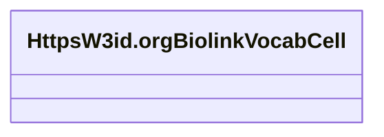

# Class: HttpsW3id.orgBiolinkVocabCell


This class occurs 7 times.


URI: [https://w3id.org/biolink/vocab/Cell](https://w3id.org/biolink/vocab/Cell)





<!-- no inheritance hierarchy -->


## Slots

| Name | Cardinality and Range | Description | Inheritance | Occurrences |
| ---  | --- | --- | --- | --- |


## Usages

| used by | used in | type | used |
| ---  | --- | --- | --- |
| [HttpsPurl.orgOknFrinkKgSpoke-genelabSchemaMetaNode](../classes/HttpsPurl.orgOknFrinkKgSpoke-genelabSchemaMetaNode.md) | [https___purl.org_okn_frink_kg_spoke_genelab_schema_material_id_2](../slots/https___purl.org_okn_frink_kg_spoke_genelab_schema_material_id_2.md) | any_of[range] | [HttpsW3id.orgBiolinkVocabCell](../classes/HttpsW3id.orgBiolinkVocabCell.md) |
| [HttpsPurl.orgOknFrinkKgSpoke-genelabSchemaMetaNode](../classes/HttpsPurl.orgOknFrinkKgSpoke-genelabSchemaMetaNode.md) | [https___purl.org_okn_frink_kg_spoke_genelab_schema_material_id_1](../slots/https___purl.org_okn_frink_kg_spoke_genelab_schema_material_id_1.md) | any_of[range] | [HttpsW3id.orgBiolinkVocabCell](../classes/HttpsW3id.orgBiolinkVocabCell.md) |
| [OboOBI0000070](../classes/OboOBI0000070.md) | [https___purl.org_okn_frink_kg_spoke_genelab_schema_INVESTIGATED_ASiCT](../slots/https___purl.org_okn_frink_kg_spoke_genelab_schema_INVESTIGATED_ASiCT.md) | range | [HttpsW3id.orgBiolinkVocabCell](../classes/HttpsW3id.orgBiolinkVocabCell.md) |
| [OboOBI0000070](../classes/OboOBI0000070.md) | [https___purl.org_okn_frink_kg_spoke_genelab_schema_material_id_1](../slots/https___purl.org_okn_frink_kg_spoke_genelab_schema_material_id_1.md) | any_of[range] | [HttpsW3id.orgBiolinkVocabCell](../classes/HttpsW3id.orgBiolinkVocabCell.md) |
| [OboOBI0000070](../classes/OboOBI0000070.md) | [https___purl.org_okn_frink_kg_spoke_genelab_schema_material_id_2](../slots/https___purl.org_okn_frink_kg_spoke_genelab_schema_material_id_2.md) | any_of[range] | [HttpsW3id.orgBiolinkVocabCell](../classes/HttpsW3id.orgBiolinkVocabCell.md) |


## LinkML Source

<!-- TODO: investigate https://stackoverflow.com/questions/37606292/how-to-create-tabbed-code-blocks-in-mkdocs-or-sphinx -->

### Direct

<details>

```yaml
name: https___w3id.org_biolink_vocab_Cell
from_schema: okns:spoke-genelab
rank: 1000
class_uri: https://w3id.org/biolink/vocab/Cell

```
</details>

### Induced

<details>

```yaml
name: https___w3id.org_biolink_vocab_Cell
from_schema: okns:spoke-genelab
rank: 1000
class_uri: https://w3id.org/biolink/vocab/Cell

```
</details>