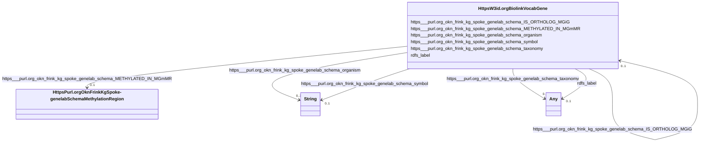

# Class: HttpsW3id.orgBiolinkVocabGene


This class occurs 59756 times.


URI: [https://w3id.org/biolink/vocab/Gene](https://w3id.org/biolink/vocab/Gene)





<!-- no inheritance hierarchy -->


## Slots

| Name | Cardinality and Range | Description | Inheritance | Occurrences |
| ---  | --- | --- | --- | --- |
| [https___purl.org_okn_frink_kg_spoke_genelab_schema_IS_ORTHOLOG_MGiG](../slots/https___purl.org_okn_frink_kg_spoke_genelab_schema_IS_ORTHOLOG_MGiG.md) | 0..1 <br/> [HttpsW3id.orgBiolinkVocabGene](../classes/HttpsW3id.orgBiolinkVocabGene.md) |  <br/>  | direct | 57492 |
| [https___purl.org_okn_frink_kg_spoke_genelab_schema_organism](../slots/https___purl.org_okn_frink_kg_spoke_genelab_schema_organism.md) | 0..1 <br/> [xsd:string](http://www.w3.org/2001/XMLSchema#string) |  <br/>  | direct | 58649 |
| [https___purl.org_okn_frink_kg_spoke_genelab_schema_METHYLATED_IN_MGmMR](../slots/https___purl.org_okn_frink_kg_spoke_genelab_schema_METHYLATED_IN_MGmMR.md) | 0..1 <br/> [HttpsPurl.orgOknFrinkKgSpoke-genelabSchemaMethylationRegion](../classes/HttpsPurl.orgOknFrinkKgSpoke-genelabSchemaMethylationRegion.md) |  <br/>  | direct | 5694 |
| [https___purl.org_okn_frink_kg_spoke_genelab_schema_taxonomy](../slots/https___purl.org_okn_frink_kg_spoke_genelab_schema_taxonomy.md) | 0..1 <br/> [xsd:anyURI](http://www.w3.org/2001/XMLSchema#anyURI)&nbsp;or&nbsp;<br />[xsd:string](http://www.w3.org/2001/XMLSchema#string) |  <br/>  | direct | 58649 |
| [https___purl.org_okn_frink_kg_spoke_genelab_schema_symbol](../slots/https___purl.org_okn_frink_kg_spoke_genelab_schema_symbol.md) | 0..1 <br/> [xsd:string](http://www.w3.org/2001/XMLSchema#string) |  <br/>  | direct | 58649 |
| [rdfs_label](../slots/rdfs_label.md) | 0..1 <br/> [RdfsLiteral](../classes/RdfsLiteral.md)&nbsp;or&nbsp;<br />[xsd:string](http://www.w3.org/2001/XMLSchema#string) | A human-readable name for the subject <br/>  | direct | 58649 |


## Usages

| used by | used in | type | used |
| ---  | --- | --- | --- |
| [HttpsW3id.orgBiolinkVocabGene](../classes/HttpsW3id.orgBiolinkVocabGene.md) | [https___purl.org_okn_frink_kg_spoke_genelab_schema_IS_ORTHOLOG_MGiG](../slots/https___purl.org_okn_frink_kg_spoke_genelab_schema_IS_ORTHOLOG_MGiG.md) | range | [HttpsW3id.orgBiolinkVocabGene](../classes/HttpsW3id.orgBiolinkVocabGene.md) |
| [OboOBI0000070](../classes/OboOBI0000070.md) | [https___purl.org_okn_frink_kg_spoke_genelab_schema_MEASURED_DIFFERENTIAL_EXPRESSION_ASmMG](../slots/https___purl.org_okn_frink_kg_spoke_genelab_schema_MEASURED_DIFFERENTIAL_EXPRESSION_ASmMG.md) | range | [HttpsW3id.orgBiolinkVocabGene](../classes/HttpsW3id.orgBiolinkVocabGene.md) |


## LinkML Source

<!-- TODO: investigate https://stackoverflow.com/questions/37606292/how-to-create-tabbed-code-blocks-in-mkdocs-or-sphinx -->

### Direct

<details>

```yaml
name: https___w3id.org_biolink_vocab_Gene
from_schema: okns:spoke-genelab
rank: 1000
slots:
- https___purl.org_okn_frink_kg_spoke-genelab_schema_IS_ORTHOLOG_MGiG
- https___purl.org_okn_frink_kg_spoke-genelab_schema_organism
- https___purl.org_okn_frink_kg_spoke-genelab_schema_METHYLATED_IN_MGmMR
- https___purl.org_okn_frink_kg_spoke-genelab_schema_taxonomy
- https___purl.org_okn_frink_kg_spoke-genelab_schema_symbol
- rdfs_label
class_uri: https://w3id.org/biolink/vocab/Gene

```
</details>

### Induced

<details>

```yaml
name: https___w3id.org_biolink_vocab_Gene
from_schema: okns:spoke-genelab
rank: 1000
attributes:
  https___purl.org_okn_frink_kg_spoke-genelab_schema_IS_ORTHOLOG_MGiG:
    name: https___purl.org_okn_frink_kg_spoke-genelab_schema_IS_ORTHOLOG_MGiG
    from_schema: okns:spoke-genelab
    rank: 1000
    slot_uri: https://purl.org/okn/frink/kg/spoke-genelab/schema/IS_ORTHOLOG_MGiG
    alias: https___purl.org_okn_frink_kg_spoke_genelab_schema_IS_ORTHOLOG_MGiG
    owner: https___w3id.org_biolink_vocab_Gene
    domain_of:
    - https___w3id.org_biolink_vocab_Gene
    range: https___w3id.org_biolink_vocab_Gene
  https___purl.org_okn_frink_kg_spoke-genelab_schema_organism:
    name: https___purl.org_okn_frink_kg_spoke-genelab_schema_organism
    from_schema: okns:spoke-genelab
    rank: 1000
    slot_uri: https://purl.org/okn/frink/kg/spoke-genelab/schema/organism
    alias: https___purl.org_okn_frink_kg_spoke_genelab_schema_organism
    owner: https___w3id.org_biolink_vocab_Gene
    domain_of:
    - https___purl.org_okn_frink_kg_spoke-genelab_schema_MetaNode
    - https___w3id.org_biolink_vocab_Gene
    - https___w3id.org_biolink_vocab_Study
    range: string
  https___purl.org_okn_frink_kg_spoke-genelab_schema_METHYLATED_IN_MGmMR:
    name: https___purl.org_okn_frink_kg_spoke-genelab_schema_METHYLATED_IN_MGmMR
    from_schema: okns:spoke-genelab
    rank: 1000
    slot_uri: https://purl.org/okn/frink/kg/spoke-genelab/schema/METHYLATED_IN_MGmMR
    alias: https___purl.org_okn_frink_kg_spoke_genelab_schema_METHYLATED_IN_MGmMR
    owner: https___w3id.org_biolink_vocab_Gene
    domain_of:
    - https___w3id.org_biolink_vocab_Gene
    range: https___purl.org_okn_frink_kg_spoke-genelab_schema_MethylationRegion
  https___purl.org_okn_frink_kg_spoke-genelab_schema_taxonomy:
    name: https___purl.org_okn_frink_kg_spoke-genelab_schema_taxonomy
    from_schema: okns:spoke-genelab
    rank: 1000
    slot_uri: https://purl.org/okn/frink/kg/spoke-genelab/schema/taxonomy
    alias: https___purl.org_okn_frink_kg_spoke_genelab_schema_taxonomy
    owner: https___w3id.org_biolink_vocab_Gene
    domain_of:
    - https___purl.org_okn_frink_kg_spoke-genelab_schema_MetaNode
    - https___w3id.org_biolink_vocab_Gene
    - https___w3id.org_biolink_vocab_Study
    range: Any
    any_of:
    - range: uri
    - range: string
  https___purl.org_okn_frink_kg_spoke-genelab_schema_symbol:
    name: https___purl.org_okn_frink_kg_spoke-genelab_schema_symbol
    from_schema: okns:spoke-genelab
    rank: 1000
    slot_uri: https://purl.org/okn/frink/kg/spoke-genelab/schema/symbol
    alias: https___purl.org_okn_frink_kg_spoke_genelab_schema_symbol
    owner: https___w3id.org_biolink_vocab_Gene
    domain_of:
    - https___purl.org_okn_frink_kg_spoke-genelab_schema_MetaNode
    - https___w3id.org_biolink_vocab_Gene
    range: string
  rdfs_label:
    name: rdfs_label
    description: A human-readable name for the subject.
    title: label
    from_schema: okns:owl-rdf-rdfs
    source: http://www.w3.org/2000/01/rdf-schema#
    domain: rdfs_Resource
    slot_uri: rdfs:label
    alias: rdfs_label
    owner: https___w3id.org_biolink_vocab_Gene
    domain_of:
    - rdf_List
    - rdfs_Datatype
    - https___purl.org_okn_frink_kg_spoke-genelab_schema_MetaNode
    - https___purl.org_okn_frink_kg_spoke-genelab_schema_MethylationRegion
    - https___purl.org_okn_frink_kg_spoke-genelab_schema_Mission
    - https___w3id.org_biolink_vocab_Gene
    - https___w3id.org_biolink_vocab_Study
    - obo_OBI_0000070
    range: Any
    any_of:
    - range: rdfs_Literal
    - range: string
class_uri: https://w3id.org/biolink/vocab/Gene

```
</details>