# Class: OboOBI0000070


This class occurs 6467 times.


URI: [obo:OBI_0000070](http://purl.obolibrary.org/obo/OBI_0000070)

```mermaid
 classDiagram
    class OboOBI0000070
    click OboOBI0000070 href "../OboOBI0000070"
      OboOBI0000070 : https___purl.org_okn_frink_kg_spoke_genelab_schema_factor_space_1
        
          
    
    
    OboOBI0000070 --> "0..1" String : https___purl.org_okn_frink_kg_spoke_genelab_schema_factor_space_1
    click String href "../String"

        
      OboOBI0000070 : https___purl.org_okn_frink_kg_spoke_genelab_schema_factor_space_2
        
          
    
    
    OboOBI0000070 --> "0..1" String : https___purl.org_okn_frink_kg_spoke_genelab_schema_factor_space_2
    click String href "../String"

        
      OboOBI0000070 : https___purl.org_okn_frink_kg_spoke_genelab_schema_factors_1
        
          
    
    
    OboOBI0000070 --> "0..1" String : https___purl.org_okn_frink_kg_spoke_genelab_schema_factors_1
    click String href "../String"

        
      OboOBI0000070 : https___purl.org_okn_frink_kg_spoke_genelab_schema_factors_2
        
          
    
    
    OboOBI0000070 --> "0..1" String : https___purl.org_okn_frink_kg_spoke_genelab_schema_factors_2
    click String href "../String"

        
      OboOBI0000070 : https___purl.org_okn_frink_kg_spoke_genelab_schema_INVESTIGATED_ASiA
        
          
    
    
    OboOBI0000070 --> "0..1" HttpsW3id.orgBiolinkVocabAnatomicalEntity : https___purl.org_okn_frink_kg_spoke_genelab_schema_INVESTIGATED_ASiA
    click HttpsW3id.orgBiolinkVocabAnatomicalEntity href "../HttpsW3id.orgBiolinkVocabAnatomicalEntity"

        
      OboOBI0000070 : https___purl.org_okn_frink_kg_spoke_genelab_schema_INVESTIGATED_ASiCT
        
          
    
    
    OboOBI0000070 --> "0..1" HttpsW3id.orgBiolinkVocabCell : https___purl.org_okn_frink_kg_spoke_genelab_schema_INVESTIGATED_ASiCT
    click HttpsW3id.orgBiolinkVocabCell href "../HttpsW3id.orgBiolinkVocabCell"

        
      OboOBI0000070 : https___purl.org_okn_frink_kg_spoke_genelab_schema_material_1
        
          
    
    
    OboOBI0000070 --> "0..1" String : https___purl.org_okn_frink_kg_spoke_genelab_schema_material_1
    click String href "../String"

        
      OboOBI0000070 : https___purl.org_okn_frink_kg_spoke_genelab_schema_material_2
        
          
    
    
    OboOBI0000070 --> "0..1" String : https___purl.org_okn_frink_kg_spoke_genelab_schema_material_2
    click String href "../String"

        
      OboOBI0000070 : https___purl.org_okn_frink_kg_spoke_genelab_schema_material_id_1
        
          
    
    
    OboOBI0000070 --> "0..1" Any : https___purl.org_okn_frink_kg_spoke_genelab_schema_material_id_1
    click Any href "../Any"

        
      OboOBI0000070 : https___purl.org_okn_frink_kg_spoke_genelab_schema_material_id_2
        
          
    
    
    OboOBI0000070 --> "0..1" Any : https___purl.org_okn_frink_kg_spoke_genelab_schema_material_id_2
    click Any href "../Any"

        
      OboOBI0000070 : https___purl.org_okn_frink_kg_spoke_genelab_schema_material_name_1
        
          
    
    
    OboOBI0000070 --> "0..1" String : https___purl.org_okn_frink_kg_spoke_genelab_schema_material_name_1
    click String href "../String"

        
      OboOBI0000070 : https___purl.org_okn_frink_kg_spoke_genelab_schema_material_name_2
        
          
    
    
    OboOBI0000070 --> "0..1" String : https___purl.org_okn_frink_kg_spoke_genelab_schema_material_name_2
    click String href "../String"

        
      OboOBI0000070 : https___purl.org_okn_frink_kg_spoke_genelab_schema_MEASURED_DIFFERENTIAL_EXPRESSION_ASmMG
        
          
    
    
    OboOBI0000070 --> "0..1" HttpsW3id.orgBiolinkVocabGene : https___purl.org_okn_frink_kg_spoke_genelab_schema_MEASURED_DIFFERENTIAL_EXPRESSION_ASmMG
    click HttpsW3id.orgBiolinkVocabGene href "../HttpsW3id.orgBiolinkVocabGene"

        
      OboOBI0000070 : https___purl.org_okn_frink_kg_spoke_genelab_schema_MEASURED_DIFFERENTIAL_METHYLATION_ASmMR
        
          
    
    
    OboOBI0000070 --> "0..1" HttpsPurl.orgOknFrinkKgSpoke-genelabSchemaMethylationRegion : https___purl.org_okn_frink_kg_spoke_genelab_schema_MEASURED_DIFFERENTIAL_METHYLATION_ASmMR
    click HttpsPurl.orgOknFrinkKgSpoke-genelabSchemaMethylationRegion href "../HttpsPurl.orgOknFrinkKgSpoke-genelabSchemaMethylationRegion"

        
      OboOBI0000070 : https___purl.org_okn_frink_kg_spoke_genelab_schema_measurement
        
          
    
    
    OboOBI0000070 --> "0..1" String : https___purl.org_okn_frink_kg_spoke_genelab_schema_measurement
    click String href "../String"

        
      OboOBI0000070 : https___purl.org_okn_frink_kg_spoke_genelab_schema_technology
        
          
    
    
    OboOBI0000070 --> "0..1" String : https___purl.org_okn_frink_kg_spoke_genelab_schema_technology
    click String href "../String"

        
      OboOBI0000070 : rdfs_label
        
          
    
    
    OboOBI0000070 --> "0..1" Any : rdfs_label
    click Any href "../Any"

        
      
```





<!-- no inheritance hierarchy -->


## Slots

| Name | Cardinality and Range | Description | Inheritance | Occurrences |
| ---  | --- | --- | --- | --- |
| [https___purl.org_okn_frink_kg_spoke_genelab_schema_INVESTIGATED_ASiA](../slots/https___purl.org_okn_frink_kg_spoke_genelab_schema_INVESTIGATED_ASiA.md) | 0..1 <br/> [HttpsW3id.orgBiolinkVocabAnatomicalEntity](../classes/HttpsW3id.orgBiolinkVocabAnatomicalEntity.md) |  <br/>  | direct | 5033 |
| [https___purl.org_okn_frink_kg_spoke_genelab_schema_material_1](../slots/https___purl.org_okn_frink_kg_spoke_genelab_schema_material_1.md) | 0..1 <br/> [xsd:string](http://www.w3.org/2001/XMLSchema#string) |  <br/>  | direct | 6467 |
| [https___purl.org_okn_frink_kg_spoke_genelab_schema_material_name_2](../slots/https___purl.org_okn_frink_kg_spoke_genelab_schema_material_name_2.md) | 0..1 <br/> [xsd:string](http://www.w3.org/2001/XMLSchema#string) |  <br/>  | direct | 6163 |
| [https___purl.org_okn_frink_kg_spoke_genelab_schema_technology](../slots/https___purl.org_okn_frink_kg_spoke_genelab_schema_technology.md) | 0..1 <br/> [xsd:string](http://www.w3.org/2001/XMLSchema#string) |  <br/>  | direct | 6467 |
| [https___purl.org_okn_frink_kg_spoke_genelab_schema_material_name_1](../slots/https___purl.org_okn_frink_kg_spoke_genelab_schema_material_name_1.md) | 0..1 <br/> [xsd:string](http://www.w3.org/2001/XMLSchema#string) |  <br/>  | direct | 6163 |
| [https___purl.org_okn_frink_kg_spoke_genelab_schema_MEASURED_DIFFERENTIAL_METHYLATION_ASmMR](../slots/https___purl.org_okn_frink_kg_spoke_genelab_schema_MEASURED_DIFFERENTIAL_METHYLATION_ASmMR.md) | 0..1 <br/> [HttpsPurl.orgOknFrinkKgSpoke-genelabSchemaMethylationRegion](../classes/HttpsPurl.orgOknFrinkKgSpoke-genelabSchemaMethylationRegion.md) |  <br/>  | direct | 9555 |
| [https___purl.org_okn_frink_kg_spoke_genelab_schema_INVESTIGATED_ASiCT](../slots/https___purl.org_okn_frink_kg_spoke_genelab_schema_INVESTIGATED_ASiCT.md) | 0..1 <br/> [HttpsW3id.orgBiolinkVocabCell](../classes/HttpsW3id.orgBiolinkVocabCell.md) |  <br/>  | direct | 1134 |
| [https___purl.org_okn_frink_kg_spoke_genelab_schema_material_2](../slots/https___purl.org_okn_frink_kg_spoke_genelab_schema_material_2.md) | 0..1 <br/> [xsd:string](http://www.w3.org/2001/XMLSchema#string) |  <br/>  | direct | 6467 |
| [https___purl.org_okn_frink_kg_spoke_genelab_schema_MEASURED_DIFFERENTIAL_EXPRESSION_ASmMG](../slots/https___purl.org_okn_frink_kg_spoke_genelab_schema_MEASURED_DIFFERENTIAL_EXPRESSION_ASmMG.md) | 0..1 <br/> [HttpsW3id.orgBiolinkVocabGene](../classes/HttpsW3id.orgBiolinkVocabGene.md) |  <br/>  | direct | 13208662 |
| [https___purl.org_okn_frink_kg_spoke_genelab_schema_measurement](../slots/https___purl.org_okn_frink_kg_spoke_genelab_schema_measurement.md) | 0..1 <br/> [xsd:string](http://www.w3.org/2001/XMLSchema#string) |  <br/>  | direct | 6467 |
| [https___purl.org_okn_frink_kg_spoke_genelab_schema_factor_space_2](../slots/https___purl.org_okn_frink_kg_spoke_genelab_schema_factor_space_2.md) | 0..1 <br/> [xsd:string](http://www.w3.org/2001/XMLSchema#string) |  <br/>  | direct | 3103 |
| [https___purl.org_okn_frink_kg_spoke_genelab_schema_material_id_1](../slots/https___purl.org_okn_frink_kg_spoke_genelab_schema_material_id_1.md) | 0..1 <br/> [HttpsW3id.orgBiolinkVocabAnatomicalEntity](../classes/HttpsW3id.orgBiolinkVocabAnatomicalEntity.md)&nbsp;or&nbsp;<br />[xsd:string](http://www.w3.org/2001/XMLSchema#string)&nbsp;or&nbsp;<br />[HttpsW3id.orgBiolinkVocabCell](../classes/HttpsW3id.orgBiolinkVocabCell.md) |  <br/>  | direct | 6163 |
| [https___purl.org_okn_frink_kg_spoke_genelab_schema_factor_space_1](../slots/https___purl.org_okn_frink_kg_spoke_genelab_schema_factor_space_1.md) | 0..1 <br/> [xsd:string](http://www.w3.org/2001/XMLSchema#string) |  <br/>  | direct | 3019 |
| [rdfs_label](../slots/rdfs_label.md) | 0..1 <br/> [RdfsLiteral](../classes/RdfsLiteral.md)&nbsp;or&nbsp;<br />[xsd:string](http://www.w3.org/2001/XMLSchema#string) | A human-readable name for the subject <br/>  | direct | 6467 |
| [https___purl.org_okn_frink_kg_spoke_genelab_schema_material_id_2](../slots/https___purl.org_okn_frink_kg_spoke_genelab_schema_material_id_2.md) | 0..1 <br/> [HttpsW3id.orgBiolinkVocabAnatomicalEntity](../classes/HttpsW3id.orgBiolinkVocabAnatomicalEntity.md)&nbsp;or&nbsp;<br />[xsd:string](http://www.w3.org/2001/XMLSchema#string)&nbsp;or&nbsp;<br />[HttpsW3id.orgBiolinkVocabCell](../classes/HttpsW3id.orgBiolinkVocabCell.md) |  <br/>  | direct | 6163 |
| [https___purl.org_okn_frink_kg_spoke_genelab_schema_factors_1](../slots/https___purl.org_okn_frink_kg_spoke_genelab_schema_factors_1.md) | 0..1 <br/> [xsd:string](http://www.w3.org/2001/XMLSchema#string) |  <br/>  | direct | 17069 |
| [https___purl.org_okn_frink_kg_spoke_genelab_schema_factors_2](../slots/https___purl.org_okn_frink_kg_spoke_genelab_schema_factors_2.md) | 0..1 <br/> [xsd:string](http://www.w3.org/2001/XMLSchema#string) |  <br/>  | direct | 17641 |


## Usages

| used by | used in | type | used |
| ---  | --- | --- | --- |
| [HttpsW3id.orgBiolinkVocabStudy](../classes/HttpsW3id.orgBiolinkVocabStudy.md) | [https___purl.org_okn_frink_kg_spoke_genelab_schema_PERFORMED_SpAS](../slots/https___purl.org_okn_frink_kg_spoke_genelab_schema_PERFORMED_SpAS.md) | range | [OboOBI0000070](../classes/OboOBI0000070.md) |


## LinkML Source

<!-- TODO: investigate https://stackoverflow.com/questions/37606292/how-to-create-tabbed-code-blocks-in-mkdocs-or-sphinx -->

### Direct

<details>

```yaml
name: obo_OBI_0000070
from_schema: okns:spoke-genelab
rank: 1000
slots:
- https___purl.org_okn_frink_kg_spoke-genelab_schema_INVESTIGATED_ASiA
- https___purl.org_okn_frink_kg_spoke-genelab_schema_material_1
- https___purl.org_okn_frink_kg_spoke-genelab_schema_material_name_2
- https___purl.org_okn_frink_kg_spoke-genelab_schema_technology
- https___purl.org_okn_frink_kg_spoke-genelab_schema_material_name_1
- https___purl.org_okn_frink_kg_spoke-genelab_schema_MEASURED_DIFFERENTIAL_METHYLATION_ASmMR
- https___purl.org_okn_frink_kg_spoke-genelab_schema_INVESTIGATED_ASiCT
- https___purl.org_okn_frink_kg_spoke-genelab_schema_material_2
- https___purl.org_okn_frink_kg_spoke-genelab_schema_MEASURED_DIFFERENTIAL_EXPRESSION_ASmMG
- https___purl.org_okn_frink_kg_spoke-genelab_schema_measurement
- https___purl.org_okn_frink_kg_spoke-genelab_schema_factor_space_2
- https___purl.org_okn_frink_kg_spoke-genelab_schema_material_id_1
- https___purl.org_okn_frink_kg_spoke-genelab_schema_factor_space_1
- rdfs_label
- https___purl.org_okn_frink_kg_spoke-genelab_schema_material_id_2
- https___purl.org_okn_frink_kg_spoke-genelab_schema_factors_1
- https___purl.org_okn_frink_kg_spoke-genelab_schema_factors_2
class_uri: obo:OBI_0000070

```
</details>

### Induced

<details>

```yaml
name: obo_OBI_0000070
from_schema: okns:spoke-genelab
rank: 1000
attributes:
  https___purl.org_okn_frink_kg_spoke-genelab_schema_INVESTIGATED_ASiA:
    name: https___purl.org_okn_frink_kg_spoke-genelab_schema_INVESTIGATED_ASiA
    from_schema: okns:spoke-genelab
    rank: 1000
    slot_uri: https://purl.org/okn/frink/kg/spoke-genelab/schema/INVESTIGATED_ASiA
    alias: https___purl.org_okn_frink_kg_spoke_genelab_schema_INVESTIGATED_ASiA
    owner: obo_OBI_0000070
    domain_of:
    - obo_OBI_0000070
    range: https___w3id.org_biolink_vocab_AnatomicalEntity
  https___purl.org_okn_frink_kg_spoke-genelab_schema_material_1:
    name: https___purl.org_okn_frink_kg_spoke-genelab_schema_material_1
    from_schema: okns:spoke-genelab
    rank: 1000
    slot_uri: https://purl.org/okn/frink/kg/spoke-genelab/schema/material_1
    alias: https___purl.org_okn_frink_kg_spoke_genelab_schema_material_1
    owner: obo_OBI_0000070
    domain_of:
    - https___purl.org_okn_frink_kg_spoke-genelab_schema_MetaNode
    - obo_OBI_0000070
    range: string
  https___purl.org_okn_frink_kg_spoke-genelab_schema_material_name_2:
    name: https___purl.org_okn_frink_kg_spoke-genelab_schema_material_name_2
    from_schema: okns:spoke-genelab
    rank: 1000
    slot_uri: https://purl.org/okn/frink/kg/spoke-genelab/schema/material_name_2
    alias: https___purl.org_okn_frink_kg_spoke_genelab_schema_material_name_2
    owner: obo_OBI_0000070
    domain_of:
    - https___purl.org_okn_frink_kg_spoke-genelab_schema_MetaNode
    - obo_OBI_0000070
    range: string
  https___purl.org_okn_frink_kg_spoke-genelab_schema_technology:
    name: https___purl.org_okn_frink_kg_spoke-genelab_schema_technology
    from_schema: okns:spoke-genelab
    rank: 1000
    slot_uri: https://purl.org/okn/frink/kg/spoke-genelab/schema/technology
    alias: https___purl.org_okn_frink_kg_spoke_genelab_schema_technology
    owner: obo_OBI_0000070
    domain_of:
    - https___purl.org_okn_frink_kg_spoke-genelab_schema_MetaNode
    - obo_OBI_0000070
    range: string
  https___purl.org_okn_frink_kg_spoke-genelab_schema_material_name_1:
    name: https___purl.org_okn_frink_kg_spoke-genelab_schema_material_name_1
    from_schema: okns:spoke-genelab
    rank: 1000
    slot_uri: https://purl.org/okn/frink/kg/spoke-genelab/schema/material_name_1
    alias: https___purl.org_okn_frink_kg_spoke_genelab_schema_material_name_1
    owner: obo_OBI_0000070
    domain_of:
    - https___purl.org_okn_frink_kg_spoke-genelab_schema_MetaNode
    - obo_OBI_0000070
    range: string
  https___purl.org_okn_frink_kg_spoke-genelab_schema_MEASURED_DIFFERENTIAL_METHYLATION_ASmMR:
    name: https___purl.org_okn_frink_kg_spoke-genelab_schema_MEASURED_DIFFERENTIAL_METHYLATION_ASmMR
    from_schema: okns:spoke-genelab
    rank: 1000
    slot_uri: https://purl.org/okn/frink/kg/spoke-genelab/schema/MEASURED_DIFFERENTIAL_METHYLATION_ASmMR
    alias: https___purl.org_okn_frink_kg_spoke_genelab_schema_MEASURED_DIFFERENTIAL_METHYLATION_ASmMR
    owner: obo_OBI_0000070
    domain_of:
    - obo_OBI_0000070
    range: https___purl.org_okn_frink_kg_spoke-genelab_schema_MethylationRegion
  https___purl.org_okn_frink_kg_spoke-genelab_schema_INVESTIGATED_ASiCT:
    name: https___purl.org_okn_frink_kg_spoke-genelab_schema_INVESTIGATED_ASiCT
    from_schema: okns:spoke-genelab
    rank: 1000
    slot_uri: https://purl.org/okn/frink/kg/spoke-genelab/schema/INVESTIGATED_ASiCT
    alias: https___purl.org_okn_frink_kg_spoke_genelab_schema_INVESTIGATED_ASiCT
    owner: obo_OBI_0000070
    domain_of:
    - obo_OBI_0000070
    range: https___w3id.org_biolink_vocab_Cell
  https___purl.org_okn_frink_kg_spoke-genelab_schema_material_2:
    name: https___purl.org_okn_frink_kg_spoke-genelab_schema_material_2
    from_schema: okns:spoke-genelab
    rank: 1000
    slot_uri: https://purl.org/okn/frink/kg/spoke-genelab/schema/material_2
    alias: https___purl.org_okn_frink_kg_spoke_genelab_schema_material_2
    owner: obo_OBI_0000070
    domain_of:
    - https___purl.org_okn_frink_kg_spoke-genelab_schema_MetaNode
    - obo_OBI_0000070
    range: string
  https___purl.org_okn_frink_kg_spoke-genelab_schema_MEASURED_DIFFERENTIAL_EXPRESSION_ASmMG:
    name: https___purl.org_okn_frink_kg_spoke-genelab_schema_MEASURED_DIFFERENTIAL_EXPRESSION_ASmMG
    from_schema: okns:spoke-genelab
    rank: 1000
    slot_uri: https://purl.org/okn/frink/kg/spoke-genelab/schema/MEASURED_DIFFERENTIAL_EXPRESSION_ASmMG
    alias: https___purl.org_okn_frink_kg_spoke_genelab_schema_MEASURED_DIFFERENTIAL_EXPRESSION_ASmMG
    owner: obo_OBI_0000070
    domain_of:
    - obo_OBI_0000070
    range: https___w3id.org_biolink_vocab_Gene
  https___purl.org_okn_frink_kg_spoke-genelab_schema_measurement:
    name: https___purl.org_okn_frink_kg_spoke-genelab_schema_measurement
    from_schema: okns:spoke-genelab
    rank: 1000
    slot_uri: https://purl.org/okn/frink/kg/spoke-genelab/schema/measurement
    alias: https___purl.org_okn_frink_kg_spoke_genelab_schema_measurement
    owner: obo_OBI_0000070
    domain_of:
    - https___purl.org_okn_frink_kg_spoke-genelab_schema_MetaNode
    - obo_OBI_0000070
    range: string
  https___purl.org_okn_frink_kg_spoke-genelab_schema_factor_space_2:
    name: https___purl.org_okn_frink_kg_spoke-genelab_schema_factor_space_2
    from_schema: okns:spoke-genelab
    rank: 1000
    slot_uri: https://purl.org/okn/frink/kg/spoke-genelab/schema/factor_space_2
    alias: https___purl.org_okn_frink_kg_spoke_genelab_schema_factor_space_2
    owner: obo_OBI_0000070
    domain_of:
    - https___purl.org_okn_frink_kg_spoke-genelab_schema_MetaNode
    - obo_OBI_0000070
    range: string
  https___purl.org_okn_frink_kg_spoke-genelab_schema_material_id_1:
    name: https___purl.org_okn_frink_kg_spoke-genelab_schema_material_id_1
    from_schema: okns:spoke-genelab
    rank: 1000
    slot_uri: https://purl.org/okn/frink/kg/spoke-genelab/schema/material_id_1
    alias: https___purl.org_okn_frink_kg_spoke_genelab_schema_material_id_1
    owner: obo_OBI_0000070
    domain_of:
    - https___purl.org_okn_frink_kg_spoke-genelab_schema_MetaNode
    - obo_OBI_0000070
    range: Any
    any_of:
    - range: https___w3id.org_biolink_vocab_AnatomicalEntity
    - range: string
    - range: https___w3id.org_biolink_vocab_Cell
  https___purl.org_okn_frink_kg_spoke-genelab_schema_factor_space_1:
    name: https___purl.org_okn_frink_kg_spoke-genelab_schema_factor_space_1
    from_schema: okns:spoke-genelab
    rank: 1000
    slot_uri: https://purl.org/okn/frink/kg/spoke-genelab/schema/factor_space_1
    alias: https___purl.org_okn_frink_kg_spoke_genelab_schema_factor_space_1
    owner: obo_OBI_0000070
    domain_of:
    - https___purl.org_okn_frink_kg_spoke-genelab_schema_MetaNode
    - obo_OBI_0000070
    range: string
  rdfs_label:
    name: rdfs_label
    description: A human-readable name for the subject.
    title: label
    from_schema: okns:owl-rdf-rdfs
    source: http://www.w3.org/2000/01/rdf-schema#
    domain: rdfs_Resource
    slot_uri: rdfs:label
    alias: rdfs_label
    owner: obo_OBI_0000070
    domain_of:
    - rdf_List
    - rdfs_Datatype
    - https___purl.org_okn_frink_kg_spoke-genelab_schema_MetaNode
    - https___purl.org_okn_frink_kg_spoke-genelab_schema_MethylationRegion
    - https___purl.org_okn_frink_kg_spoke-genelab_schema_Mission
    - https___w3id.org_biolink_vocab_Gene
    - https___w3id.org_biolink_vocab_Study
    - obo_OBI_0000070
    range: Any
    any_of:
    - range: rdfs_Literal
    - range: string
  https___purl.org_okn_frink_kg_spoke-genelab_schema_material_id_2:
    name: https___purl.org_okn_frink_kg_spoke-genelab_schema_material_id_2
    from_schema: okns:spoke-genelab
    rank: 1000
    slot_uri: https://purl.org/okn/frink/kg/spoke-genelab/schema/material_id_2
    alias: https___purl.org_okn_frink_kg_spoke_genelab_schema_material_id_2
    owner: obo_OBI_0000070
    domain_of:
    - https___purl.org_okn_frink_kg_spoke-genelab_schema_MetaNode
    - obo_OBI_0000070
    range: Any
    any_of:
    - range: https___w3id.org_biolink_vocab_AnatomicalEntity
    - range: string
    - range: https___w3id.org_biolink_vocab_Cell
  https___purl.org_okn_frink_kg_spoke-genelab_schema_factors_1:
    name: https___purl.org_okn_frink_kg_spoke-genelab_schema_factors_1
    from_schema: okns:spoke-genelab
    rank: 1000
    slot_uri: https://purl.org/okn/frink/kg/spoke-genelab/schema/factors_1
    alias: https___purl.org_okn_frink_kg_spoke_genelab_schema_factors_1
    owner: obo_OBI_0000070
    domain_of:
    - https___purl.org_okn_frink_kg_spoke-genelab_schema_MetaNode
    - obo_OBI_0000070
    range: string
  https___purl.org_okn_frink_kg_spoke-genelab_schema_factors_2:
    name: https___purl.org_okn_frink_kg_spoke-genelab_schema_factors_2
    from_schema: okns:spoke-genelab
    rank: 1000
    slot_uri: https://purl.org/okn/frink/kg/spoke-genelab/schema/factors_2
    alias: https___purl.org_okn_frink_kg_spoke_genelab_schema_factors_2
    owner: obo_OBI_0000070
    domain_of:
    - https___purl.org_okn_frink_kg_spoke-genelab_schema_MetaNode
    - obo_OBI_0000070
    range: string
class_uri: obo:OBI_0000070

```
</details>