# Class: HttpsW3id.orgBiolinkVocabChemicalEntity


This class occurs 798 times.


URI: [https://w3id.org/biolink/vocab/ChemicalEntity](https://w3id.org/biolink/vocab/ChemicalEntity)

```mermaid
 classDiagram
    class HttpsW3id.orgBiolinkVocabChemicalEntity
    click HttpsW3id.orgBiolinkVocabChemicalEntity href "../HttpsW3id.orgBiolinkVocabChemicalEntity"
      HttpsW3id.orgBiolinkVocabChemicalEntity : dct_source
        
          
    
    
    HttpsW3id.orgBiolinkVocabChemicalEntity --> "0..1" Any : dct_source
    click Any href "../Any"

        
      HttpsW3id.orgBiolinkVocabChemicalEntity : http___www.geneontology.org_formats_oboInOwl#hasDbXref
        
          
    
    
    HttpsW3id.orgBiolinkVocabChemicalEntity --> "0..1" Uri : http___www.geneontology.org_formats_oboInOwl#hasDbXref
    click Uri href "../Uri"

        
      HttpsW3id.orgBiolinkVocabChemicalEntity : https___purl.org_okn_frink_kg_spoke_schema_CONTRAINDICATES_CcD
        
          
    
    
    HttpsW3id.orgBiolinkVocabChemicalEntity --> "0..1" HttpsW3id.orgBiolinkVocabDisease : https___purl.org_okn_frink_kg_spoke_schema_CONTRAINDICATES_CcD
    click HttpsW3id.orgBiolinkVocabDisease href "../HttpsW3id.orgBiolinkVocabDisease"

        
      HttpsW3id.orgBiolinkVocabChemicalEntity : https___purl.org_okn_frink_kg_spoke_schema_DOWNREGULATES_CdG
        
          
    
    
    HttpsW3id.orgBiolinkVocabChemicalEntity --> "0..1" HttpsW3id.orgBiolinkVocabGene : https___purl.org_okn_frink_kg_spoke_schema_DOWNREGULATES_CdG
    click HttpsW3id.orgBiolinkVocabGene href "../HttpsW3id.orgBiolinkVocabGene"

        
      HttpsW3id.orgBiolinkVocabChemicalEntity : https___purl.org_okn_frink_kg_spoke_schema_FOUNDIN_CfL
        
          
    
    
    HttpsW3id.orgBiolinkVocabChemicalEntity --> "0..1" SdosAdministrativeArea : https___purl.org_okn_frink_kg_spoke_schema_FOUNDIN_CfL
    click SdosAdministrativeArea href "../SdosAdministrativeArea"

        
      HttpsW3id.orgBiolinkVocabChemicalEntity : https___purl.org_okn_frink_kg_spoke_schema_HASROLE_ChC
        
          
    
    
    HttpsW3id.orgBiolinkVocabChemicalEntity --> "0..1" HttpsW3id.orgBiolinkVocabChemicalEntity : https___purl.org_okn_frink_kg_spoke_schema_HASROLE_ChC
    click HttpsW3id.orgBiolinkVocabChemicalEntity href "../HttpsW3id.orgBiolinkVocabChemicalEntity"

        
      HttpsW3id.orgBiolinkVocabChemicalEntity : https___purl.org_okn_frink_kg_spoke_schema_INTERACTS_CiC
        
          
    
    
    HttpsW3id.orgBiolinkVocabChemicalEntity --> "0..1" HttpsW3id.orgBiolinkVocabChemicalEntity : https___purl.org_okn_frink_kg_spoke_schema_INTERACTS_CiC
    click HttpsW3id.orgBiolinkVocabChemicalEntity href "../HttpsW3id.orgBiolinkVocabChemicalEntity"

        
      HttpsW3id.orgBiolinkVocabChemicalEntity : https___purl.org_okn_frink_kg_spoke_schema_ISA_CiC
        
          
    
    
    HttpsW3id.orgBiolinkVocabChemicalEntity --> "0..1" HttpsW3id.orgBiolinkVocabChemicalEntity : https___purl.org_okn_frink_kg_spoke_schema_ISA_CiC
    click HttpsW3id.orgBiolinkVocabChemicalEntity href "../HttpsW3id.orgBiolinkVocabChemicalEntity"

        
      HttpsW3id.orgBiolinkVocabChemicalEntity : https___purl.org_okn_frink_kg_spoke_schema_max_phase
        
          
    
    
    HttpsW3id.orgBiolinkVocabChemicalEntity --> "0..1" Double : https___purl.org_okn_frink_kg_spoke_schema_max_phase
    click Double href "../Double"

        
      HttpsW3id.orgBiolinkVocabChemicalEntity : https___purl.org_okn_frink_kg_spoke_schema_PARTOF_CpC
        
          
    
    
    HttpsW3id.orgBiolinkVocabChemicalEntity --> "0..1" HttpsW3id.orgBiolinkVocabChemicalEntity : https___purl.org_okn_frink_kg_spoke_schema_PARTOF_CpC
    click HttpsW3id.orgBiolinkVocabChemicalEntity href "../HttpsW3id.orgBiolinkVocabChemicalEntity"

        
      HttpsW3id.orgBiolinkVocabChemicalEntity : https___purl.org_okn_frink_kg_spoke_schema_smiles
        
          
    
    
    HttpsW3id.orgBiolinkVocabChemicalEntity --> "0..1" String : https___purl.org_okn_frink_kg_spoke_schema_smiles
    click String href "../String"

        
      HttpsW3id.orgBiolinkVocabChemicalEntity : https___purl.org_okn_frink_kg_spoke_schema_standardized_smiles
        
          
    
    
    HttpsW3id.orgBiolinkVocabChemicalEntity --> "0..1" String : https___purl.org_okn_frink_kg_spoke_schema_standardized_smiles
    click String href "../String"

        
      HttpsW3id.orgBiolinkVocabChemicalEntity : https___purl.org_okn_frink_kg_spoke_schema_synonyms
        
          
    
    
    HttpsW3id.orgBiolinkVocabChemicalEntity --> "0..1" String : https___purl.org_okn_frink_kg_spoke_schema_synonyms
    click String href "../String"

        
      HttpsW3id.orgBiolinkVocabChemicalEntity : https___purl.org_okn_frink_kg_spoke_schema_TREATS_CtD
        
          
    
    
    HttpsW3id.orgBiolinkVocabChemicalEntity --> "0..1" HttpsW3id.orgBiolinkVocabDisease : https___purl.org_okn_frink_kg_spoke_schema_TREATS_CtD
    click HttpsW3id.orgBiolinkVocabDisease href "../HttpsW3id.orgBiolinkVocabDisease"

        
      HttpsW3id.orgBiolinkVocabChemicalEntity : https___purl.org_okn_frink_kg_spoke_schema_UPREGULATES_CuG
        
          
    
    
    HttpsW3id.orgBiolinkVocabChemicalEntity --> "0..1" HttpsW3id.orgBiolinkVocabGene : https___purl.org_okn_frink_kg_spoke_schema_UPREGULATES_CuG
    click HttpsW3id.orgBiolinkVocabGene href "../HttpsW3id.orgBiolinkVocabGene"

        
      HttpsW3id.orgBiolinkVocabChemicalEntity : rdfs_label
        
          
    
    
    HttpsW3id.orgBiolinkVocabChemicalEntity --> "0..1" Any : rdfs_label
    click Any href "../Any"

        
      
```





<!-- no inheritance hierarchy -->


## Slots

| Name | Cardinality and Range | Description | Inheritance | Occurrences |
| ---  | --- | --- | --- | --- |
| [https___purl.org_okn_frink_kg_spoke_schema_PARTOF_CpC](../slots/https___purl.org_okn_frink_kg_spoke_schema_PARTOF_CpC.md) | 0..1 <br/> [HttpsW3id.orgBiolinkVocabChemicalEntity](../classes/HttpsW3id.orgBiolinkVocabChemicalEntity.md) |  <br/>  | direct | 18 |
| [https___purl.org_okn_frink_kg_spoke_schema_standardized_smiles](../slots/https___purl.org_okn_frink_kg_spoke_schema_standardized_smiles.md) | 0..1 <br/> [xsd:string](http://www.w3.org/2001/XMLSchema#string) |  <br/>  | direct | 650 |
| [https___purl.org_okn_frink_kg_spoke_schema_ISA_CiC](../slots/https___purl.org_okn_frink_kg_spoke_schema_ISA_CiC.md) | 0..1 <br/> [HttpsW3id.orgBiolinkVocabChemicalEntity](../classes/HttpsW3id.orgBiolinkVocabChemicalEntity.md) |  <br/>  | direct | 56 |
| [https___purl.org_okn_frink_kg_spoke_schema_FOUNDIN_CfL](../slots/https___purl.org_okn_frink_kg_spoke_schema_FOUNDIN_CfL.md) | 0..1 <br/> [SdosAdministrativeArea](../classes/SdosAdministrativeArea.md) |  <br/>  | direct | 563803 |
| [https___purl.org_okn_frink_kg_spoke_schema_DOWNREGULATES_CdG](../slots/https___purl.org_okn_frink_kg_spoke_schema_DOWNREGULATES_CdG.md) | 0..1 <br/> [HttpsW3id.orgBiolinkVocabGene](../classes/HttpsW3id.orgBiolinkVocabGene.md) |  <br/>  | direct | 2161 |
| [dct_source](../slots/dct_source.md) | 0..1 <br/> [Any](../classes/Any.md) | This property is intended to be used with non-literal values <br/> description: A related resource from which the described resource is derived. | direct | 3336 |
| [https___purl.org_okn_frink_kg_spoke_schema_INTERACTS_CiC](../slots/https___purl.org_okn_frink_kg_spoke_schema_INTERACTS_CiC.md) | 0..1 <br/> [HttpsW3id.orgBiolinkVocabChemicalEntity](../classes/HttpsW3id.orgBiolinkVocabChemicalEntity.md) |  <br/>  | direct | 1 |
| [https___purl.org_okn_frink_kg_spoke_schema_smiles](../slots/https___purl.org_okn_frink_kg_spoke_schema_smiles.md) | 0..1 <br/> [xsd:string](http://www.w3.org/2001/XMLSchema#string) |  <br/>  | direct | 762 |
| [http___www.geneontology.org_formats_oboInOwl#hasDbXref](../slots/http___www.geneontology.org_formats_oboInOwl#hasDbXref.md) | 0..1 <br/> [xsd:anyURI](http://www.w3.org/2001/XMLSchema#anyURI) |  <br/>  | direct | 3825 |
| [https___purl.org_okn_frink_kg_spoke_schema_max_phase](../slots/https___purl.org_okn_frink_kg_spoke_schema_max_phase.md) | 0..1 <br/> [xsd:double](http://www.w3.org/2001/XMLSchema#double) |  <br/>  | direct | 97 |
| [https___purl.org_okn_frink_kg_spoke_schema_TREATS_CtD](../slots/https___purl.org_okn_frink_kg_spoke_schema_TREATS_CtD.md) | 0..1 <br/> [HttpsW3id.orgBiolinkVocabDisease](../classes/HttpsW3id.orgBiolinkVocabDisease.md) |  <br/>  | direct | 163 |
| [https___purl.org_okn_frink_kg_spoke_schema_synonyms](../slots/https___purl.org_okn_frink_kg_spoke_schema_synonyms.md) | 0..1 <br/> [xsd:string](http://www.w3.org/2001/XMLSchema#string) |  <br/>  | direct | 11501 |
| [https___purl.org_okn_frink_kg_spoke_schema_HASROLE_ChC](../slots/https___purl.org_okn_frink_kg_spoke_schema_HASROLE_ChC.md) | 0..1 <br/> [HttpsW3id.orgBiolinkVocabChemicalEntity](../classes/HttpsW3id.orgBiolinkVocabChemicalEntity.md) |  <br/>  | direct | 34 |
| [rdfs_label](../slots/rdfs_label.md) | 0..1 <br/> [RdfsLiteral](../classes/RdfsLiteral.md)&nbsp;or&nbsp;<br />[xsd:string](http://www.w3.org/2001/XMLSchema#string) | A human-readable name for the subject <br/>  | direct | 798 |
| [https___purl.org_okn_frink_kg_spoke_schema_UPREGULATES_CuG](../slots/https___purl.org_okn_frink_kg_spoke_schema_UPREGULATES_CuG.md) | 0..1 <br/> [HttpsW3id.orgBiolinkVocabGene](../classes/HttpsW3id.orgBiolinkVocabGene.md) |  <br/>  | direct | 2117 |
| [https___purl.org_okn_frink_kg_spoke_schema_CONTRAINDICATES_CcD](../slots/https___purl.org_okn_frink_kg_spoke_schema_CONTRAINDICATES_CcD.md) | 0..1 <br/> [HttpsW3id.orgBiolinkVocabDisease](../classes/HttpsW3id.orgBiolinkVocabDisease.md) |  <br/>  | direct | 51 |


## Usages

| used by | used in | type | used |
| ---  | --- | --- | --- |
| [HttpsW3id.orgBiolinkVocabChemicalEntity](../classes/HttpsW3id.orgBiolinkVocabChemicalEntity.md) | [https___purl.org_okn_frink_kg_spoke_schema_PARTOF_CpC](../slots/https___purl.org_okn_frink_kg_spoke_schema_PARTOF_CpC.md) | range | [HttpsW3id.orgBiolinkVocabChemicalEntity](../classes/HttpsW3id.orgBiolinkVocabChemicalEntity.md) |
| [HttpsW3id.orgBiolinkVocabChemicalEntity](../classes/HttpsW3id.orgBiolinkVocabChemicalEntity.md) | [https___purl.org_okn_frink_kg_spoke_schema_ISA_CiC](../slots/https___purl.org_okn_frink_kg_spoke_schema_ISA_CiC.md) | range | [HttpsW3id.orgBiolinkVocabChemicalEntity](../classes/HttpsW3id.orgBiolinkVocabChemicalEntity.md) |
| [HttpsW3id.orgBiolinkVocabChemicalEntity](../classes/HttpsW3id.orgBiolinkVocabChemicalEntity.md) | [https___purl.org_okn_frink_kg_spoke_schema_INTERACTS_CiC](../slots/https___purl.org_okn_frink_kg_spoke_schema_INTERACTS_CiC.md) | range | [HttpsW3id.orgBiolinkVocabChemicalEntity](../classes/HttpsW3id.orgBiolinkVocabChemicalEntity.md) |
| [HttpsW3id.orgBiolinkVocabChemicalEntity](../classes/HttpsW3id.orgBiolinkVocabChemicalEntity.md) | [https___purl.org_okn_frink_kg_spoke_schema_HASROLE_ChC](../slots/https___purl.org_okn_frink_kg_spoke_schema_HASROLE_ChC.md) | range | [HttpsW3id.orgBiolinkVocabChemicalEntity](../classes/HttpsW3id.orgBiolinkVocabChemicalEntity.md) |
| [HttpsW3id.orgBiolinkVocabGene](../classes/HttpsW3id.orgBiolinkVocabGene.md) | [https___purl.org_okn_frink_kg_spoke_schema_RESISTANT_TO_mGrC](../slots/https___purl.org_okn_frink_kg_spoke_schema_RESISTANT_TO_mGrC.md) | range | [HttpsW3id.orgBiolinkVocabChemicalEntity](../classes/HttpsW3id.orgBiolinkVocabChemicalEntity.md) |
| [HttpsW3id.orgBiolinkVocabGene](../classes/HttpsW3id.orgBiolinkVocabGene.md) | [https___purl.org_okn_frink_kg_spoke_schema_RESPONSE_TO_mGrC](../slots/https___purl.org_okn_frink_kg_spoke_schema_RESPONSE_TO_mGrC.md) | range | [HttpsW3id.orgBiolinkVocabChemicalEntity](../classes/HttpsW3id.orgBiolinkVocabChemicalEntity.md) |
| [HttpsW3id.orgBiolinkVocabGene](../classes/HttpsW3id.orgBiolinkVocabGene.md) | [https___purl.org_okn_frink_kg_spoke_schema_ADVRESPONSE_TO_mGarC](../slots/https___purl.org_okn_frink_kg_spoke_schema_ADVRESPONSE_TO_mGarC.md) | range | [HttpsW3id.orgBiolinkVocabChemicalEntity](../classes/HttpsW3id.orgBiolinkVocabChemicalEntity.md) |
| [HttpsW3id.orgBiolinkVocabOrganismTaxon](../classes/HttpsW3id.orgBiolinkVocabOrganismTaxon.md) | [https___purl.org_okn_frink_kg_spoke_schema_RESPONDS_TO_OrC](../slots/https___purl.org_okn_frink_kg_spoke_schema_RESPONDS_TO_OrC.md) | range | [HttpsW3id.orgBiolinkVocabChemicalEntity](../classes/HttpsW3id.orgBiolinkVocabChemicalEntity.md) |


## LinkML Source

<!-- TODO: investigate https://stackoverflow.com/questions/37606292/how-to-create-tabbed-code-blocks-in-mkdocs-or-sphinx -->

### Direct

<details>

```yaml
name: https___w3id.org_biolink_vocab_ChemicalEntity
from_schema: okns:spoke-kg
rank: 1000
slots:
- https___purl.org_okn_frink_kg_spoke_schema_PARTOF_CpC
- https___purl.org_okn_frink_kg_spoke_schema_standardized_smiles
- https___purl.org_okn_frink_kg_spoke_schema_ISA_CiC
- https___purl.org_okn_frink_kg_spoke_schema_FOUNDIN_CfL
- https___purl.org_okn_frink_kg_spoke_schema_DOWNREGULATES_CdG
- dct_source
- https___purl.org_okn_frink_kg_spoke_schema_INTERACTS_CiC
- https___purl.org_okn_frink_kg_spoke_schema_smiles
- http___www.geneontology.org_formats_oboInOwl#hasDbXref
- https___purl.org_okn_frink_kg_spoke_schema_max_phase
- https___purl.org_okn_frink_kg_spoke_schema_TREATS_CtD
- https___purl.org_okn_frink_kg_spoke_schema_synonyms
- https___purl.org_okn_frink_kg_spoke_schema_HASROLE_ChC
- rdfs_label
- https___purl.org_okn_frink_kg_spoke_schema_UPREGULATES_CuG
- https___purl.org_okn_frink_kg_spoke_schema_CONTRAINDICATES_CcD
class_uri: https://w3id.org/biolink/vocab/ChemicalEntity

```
</details>

### Induced

<details>

```yaml
name: https___w3id.org_biolink_vocab_ChemicalEntity
from_schema: okns:spoke-kg
rank: 1000
attributes:
  https___purl.org_okn_frink_kg_spoke_schema_PARTOF_CpC:
    name: https___purl.org_okn_frink_kg_spoke_schema_PARTOF_CpC
    from_schema: okns:spoke-kg
    rank: 1000
    slot_uri: https://purl.org/okn/frink/kg/spoke/schema/PARTOF_CpC
    alias: https___purl.org_okn_frink_kg_spoke_schema_PARTOF_CpC
    owner: https___w3id.org_biolink_vocab_ChemicalEntity
    domain_of:
    - https___w3id.org_biolink_vocab_ChemicalEntity
    range: https___w3id.org_biolink_vocab_ChemicalEntity
  https___purl.org_okn_frink_kg_spoke_schema_standardized_smiles:
    name: https___purl.org_okn_frink_kg_spoke_schema_standardized_smiles
    from_schema: okns:spoke-kg
    rank: 1000
    slot_uri: https://purl.org/okn/frink/kg/spoke/schema/standardized_smiles
    alias: https___purl.org_okn_frink_kg_spoke_schema_standardized_smiles
    owner: https___w3id.org_biolink_vocab_ChemicalEntity
    domain_of:
    - https___w3id.org_biolink_vocab_ChemicalEntity
    range: string
  https___purl.org_okn_frink_kg_spoke_schema_ISA_CiC:
    name: https___purl.org_okn_frink_kg_spoke_schema_ISA_CiC
    from_schema: okns:spoke-kg
    rank: 1000
    slot_uri: https://purl.org/okn/frink/kg/spoke/schema/ISA_CiC
    alias: https___purl.org_okn_frink_kg_spoke_schema_ISA_CiC
    owner: https___w3id.org_biolink_vocab_ChemicalEntity
    domain_of:
    - https___w3id.org_biolink_vocab_ChemicalEntity
    range: https___w3id.org_biolink_vocab_ChemicalEntity
  https___purl.org_okn_frink_kg_spoke_schema_FOUNDIN_CfL:
    name: https___purl.org_okn_frink_kg_spoke_schema_FOUNDIN_CfL
    from_schema: okns:spoke-kg
    rank: 1000
    slot_uri: https://purl.org/okn/frink/kg/spoke/schema/FOUNDIN_CfL
    alias: https___purl.org_okn_frink_kg_spoke_schema_FOUNDIN_CfL
    owner: https___w3id.org_biolink_vocab_ChemicalEntity
    domain_of:
    - https___w3id.org_biolink_vocab_ChemicalEntity
    range: sdos_AdministrativeArea
  https___purl.org_okn_frink_kg_spoke_schema_DOWNREGULATES_CdG:
    name: https___purl.org_okn_frink_kg_spoke_schema_DOWNREGULATES_CdG
    from_schema: okns:spoke-kg
    rank: 1000
    slot_uri: https://purl.org/okn/frink/kg/spoke/schema/DOWNREGULATES_CdG
    alias: https___purl.org_okn_frink_kg_spoke_schema_DOWNREGULATES_CdG
    owner: https___w3id.org_biolink_vocab_ChemicalEntity
    domain_of:
    - https___w3id.org_biolink_vocab_ChemicalEntity
    range: https___w3id.org_biolink_vocab_Gene
  dct_source:
    name: dct_source
    description: This property is intended to be used with non-literal values. The
      described resource may be derived from the related resource in whole or in part.
      Best practice is to identify the related resource by means of a URI or a string
      conforming to a formal identification system.
    title: Source
    notes:
    - No occurrences of this slot in the graph.
    comments:
    - 'description: A related resource from which the described resource is derived.'
    from_schema: okns:dc
    source: http://purl.org/dc/terms/
    slot_uri: dct:source
    alias: dct_source
    owner: https___w3id.org_biolink_vocab_ChemicalEntity
    domain_of:
    - https___purl.org_okn_frink_kg_spoke_schema_SDoH
    - https___w3id.org_biolink_vocab_ChemicalEntity
    - https___w3id.org_biolink_vocab_Disease
    - https___w3id.org_biolink_vocab_EnvironmentalFeature
    - https___w3id.org_biolink_vocab_OrganismTaxon
    subproperty_of: dct_relation
    range: Any
  https___purl.org_okn_frink_kg_spoke_schema_INTERACTS_CiC:
    name: https___purl.org_okn_frink_kg_spoke_schema_INTERACTS_CiC
    from_schema: okns:spoke-kg
    rank: 1000
    slot_uri: https://purl.org/okn/frink/kg/spoke/schema/INTERACTS_CiC
    alias: https___purl.org_okn_frink_kg_spoke_schema_INTERACTS_CiC
    owner: https___w3id.org_biolink_vocab_ChemicalEntity
    domain_of:
    - https___w3id.org_biolink_vocab_ChemicalEntity
    range: https___w3id.org_biolink_vocab_ChemicalEntity
  https___purl.org_okn_frink_kg_spoke_schema_smiles:
    name: https___purl.org_okn_frink_kg_spoke_schema_smiles
    from_schema: okns:spoke-kg
    rank: 1000
    slot_uri: https://purl.org/okn/frink/kg/spoke/schema/smiles
    alias: https___purl.org_okn_frink_kg_spoke_schema_smiles
    owner: https___w3id.org_biolink_vocab_ChemicalEntity
    domain_of:
    - https___w3id.org_biolink_vocab_ChemicalEntity
    range: string
  http___www.geneontology.org_formats_oboInOwl#hasDbXref:
    name: http___www.geneontology.org_formats_oboInOwl#hasDbXref
    from_schema: okns:spoke-kg
    rank: 1000
    slot_uri: http://www.geneontology.org/formats/oboInOwl#hasDbXref
    alias: http___www.geneontology.org_formats_oboInOwl#hasDbXref
    owner: https___w3id.org_biolink_vocab_ChemicalEntity
    domain_of:
    - https___w3id.org_biolink_vocab_ChemicalEntity
    range: uri
  https___purl.org_okn_frink_kg_spoke_schema_max_phase:
    name: https___purl.org_okn_frink_kg_spoke_schema_max_phase
    from_schema: okns:spoke-kg
    rank: 1000
    slot_uri: https://purl.org/okn/frink/kg/spoke/schema/max_phase
    alias: https___purl.org_okn_frink_kg_spoke_schema_max_phase
    owner: https___w3id.org_biolink_vocab_ChemicalEntity
    domain_of:
    - https___w3id.org_biolink_vocab_ChemicalEntity
    range: double
  https___purl.org_okn_frink_kg_spoke_schema_TREATS_CtD:
    name: https___purl.org_okn_frink_kg_spoke_schema_TREATS_CtD
    from_schema: okns:spoke-kg
    rank: 1000
    slot_uri: https://purl.org/okn/frink/kg/spoke/schema/TREATS_CtD
    alias: https___purl.org_okn_frink_kg_spoke_schema_TREATS_CtD
    owner: https___w3id.org_biolink_vocab_ChemicalEntity
    domain_of:
    - https___w3id.org_biolink_vocab_ChemicalEntity
    range: https___w3id.org_biolink_vocab_Disease
  https___purl.org_okn_frink_kg_spoke_schema_synonyms:
    name: https___purl.org_okn_frink_kg_spoke_schema_synonyms
    from_schema: okns:spoke-kg
    rank: 1000
    slot_uri: https://purl.org/okn/frink/kg/spoke/schema/synonyms
    alias: https___purl.org_okn_frink_kg_spoke_schema_synonyms
    owner: https___w3id.org_biolink_vocab_ChemicalEntity
    domain_of:
    - https___w3id.org_biolink_vocab_ChemicalEntity
    - https___w3id.org_biolink_vocab_EnvironmentalFeature
    range: string
  https___purl.org_okn_frink_kg_spoke_schema_HASROLE_ChC:
    name: https___purl.org_okn_frink_kg_spoke_schema_HASROLE_ChC
    from_schema: okns:spoke-kg
    rank: 1000
    slot_uri: https://purl.org/okn/frink/kg/spoke/schema/HASROLE_ChC
    alias: https___purl.org_okn_frink_kg_spoke_schema_HASROLE_ChC
    owner: https___w3id.org_biolink_vocab_ChemicalEntity
    domain_of:
    - https___w3id.org_biolink_vocab_ChemicalEntity
    range: https___w3id.org_biolink_vocab_ChemicalEntity
  rdfs_label:
    name: rdfs_label
    description: A human-readable name for the subject.
    title: label
    from_schema: okns:owl-rdf-rdfs
    source: http://www.w3.org/2000/01/rdf-schema#
    domain: rdfs_Resource
    slot_uri: rdfs:label
    alias: rdfs_label
    owner: https___w3id.org_biolink_vocab_ChemicalEntity
    domain_of:
    - rdf_List
    - rdfs_Datatype
    - dcam_VocabularyEncodingScheme
    - dct_AgentClass
    - sdos_ActionStatusType
    - sdos_AdultOrientedEnumeration
    - sdos_BoardingPolicyType
    - sdos_BodyMeasurementTypeEnumeration
    - sdos_BookFormatType
    - sdos_Boolean
    - sdos_CarUsageType
    - sdos_CertificationStatusEnumeration
    - sdos_ContactPointOption
    - sdos_DataType
    - sdos_DayOfWeek
    - sdos_DeliveryMethod
    - sdos_DigitalDocumentPermissionType
    - sdos_DigitalPlatformEnumeration
    - sdos_DriveWheelConfigurationValue
    - sdos_DrugCostCategory
    - sdos_DrugPregnancyCategory
    - sdos_DrugPrescriptionStatus
    - sdos_EUEnergyEfficiencyEnumeration
    - sdos_EnergyStarEnergyEfficiencyEnumeration
    - sdos_EventAttendanceModeEnumeration
    - sdos_EventStatusType
    - sdos_FulfillmentTypeEnumeration
    - sdos_GameAvailabilityEnumeration
    - sdos_GamePlayMode
    - sdos_GameServerStatus
    - sdos_GenderType
    - sdos_GovernmentBenefitsType
    - sdos_HealthAspectEnumeration
    - sdos_IPTCDigitalSourceEnumeration
    - sdos_IncentiveQualifiedExpenseType
    - sdos_IncentiveStatus
    - sdos_IncentiveType
    - sdos_InfectiousAgentClass
    - sdos_ItemAvailability
    - sdos_ItemListOrderType
    - sdos_LegalForceStatus
    - sdos_LegalValueLevel
    - sdos_MapCategoryType
    - sdos_MeasurementMethodEnum
    - sdos_MediaManipulationRatingEnumeration
    - sdos_MedicalAudienceType
    - sdos_MedicalDevicePurpose
    - sdos_MedicalEvidenceLevel
    - sdos_MedicalImagingTechnique
    - sdos_MedicalObservationalStudyDesign
    - sdos_MedicalProcedureType
    - sdos_MedicalSpecialty
    - sdos_MedicalStudyStatus
    - sdos_MedicalTrialDesign
    - sdos_MedicineSystem
    - sdos_MerchantReturnEnumeration
    - sdos_MusicAlbumProductionType
    - sdos_MusicAlbumReleaseType
    - sdos_MusicReleaseFormatType
    - sdos_NLNonprofitType
    - sdos_OfferItemCondition
    - sdos_OrderStatus
    - sdos_PaymentMethodType
    - sdos_PaymentStatusType
    - sdos_PhysicalActivityCategory
    - sdos_PhysicalExam
    - sdos_PriceComponentTypeEnumeration
    - sdos_PriceTypeEnumeration
    - sdos_ProductReturnEnumeration
    - sdos_PurchaseType
    - sdos_RefundTypeEnumeration
    - sdos_ReservationStatusType
    - sdos_RestrictedDiet
    - sdos_ReturnFeesEnumeration
    - sdos_ReturnLabelSourceEnumeration
    - sdos_ReturnMethodEnumeration
    - sdos_RsvpResponseType
    - sdos_SizeSystemEnumeration
    - sdos_SteeringPositionValue
    - sdos_TierBenefitEnumeration
    - sdos_UKNonprofitType
    - sdos_USNonprofitType
    - sdos_WearableMeasurementTypeEnumeration
    - sdos_WearableSizeGroupEnumeration
    - sdos_WearableSizeSystemEnumeration
    - time_DayOfWeek
    - time_TemporalUnit
    - https___purl.org_okn_frink_kg_spoke_schema_SDoH
    - https___w3id.org_biolink_vocab_ChemicalEntity
    - https___w3id.org_biolink_vocab_Disease
    - https___w3id.org_biolink_vocab_EnvironmentalFeature
    - https___w3id.org_biolink_vocab_Gene
    - https___w3id.org_biolink_vocab_OrganismTaxon
    range: Any
    any_of:
    - range: rdfs_Literal
    - range: string
  https___purl.org_okn_frink_kg_spoke_schema_UPREGULATES_CuG:
    name: https___purl.org_okn_frink_kg_spoke_schema_UPREGULATES_CuG
    from_schema: okns:spoke-kg
    rank: 1000
    slot_uri: https://purl.org/okn/frink/kg/spoke/schema/UPREGULATES_CuG
    alias: https___purl.org_okn_frink_kg_spoke_schema_UPREGULATES_CuG
    owner: https___w3id.org_biolink_vocab_ChemicalEntity
    domain_of:
    - https___w3id.org_biolink_vocab_ChemicalEntity
    range: https___w3id.org_biolink_vocab_Gene
  https___purl.org_okn_frink_kg_spoke_schema_CONTRAINDICATES_CcD:
    name: https___purl.org_okn_frink_kg_spoke_schema_CONTRAINDICATES_CcD
    from_schema: okns:spoke-kg
    rank: 1000
    slot_uri: https://purl.org/okn/frink/kg/spoke/schema/CONTRAINDICATES_CcD
    alias: https___purl.org_okn_frink_kg_spoke_schema_CONTRAINDICATES_CcD
    owner: https___w3id.org_biolink_vocab_ChemicalEntity
    domain_of:
    - https___w3id.org_biolink_vocab_ChemicalEntity
    range: https___w3id.org_biolink_vocab_Disease
class_uri: https://w3id.org/biolink/vocab/ChemicalEntity

```
</details>