# Class: HttpsW3id.orgBiolinkVocabDisease


This class occurs 180 times.


URI: [https://w3id.org/biolink/vocab/Disease](https://w3id.org/biolink/vocab/Disease)

```mermaid
 classDiagram
    class HttpsW3id.orgBiolinkVocabDisease
    click HttpsW3id.orgBiolinkVocabDisease href "../HttpsW3id.orgBiolinkVocabDisease"
      HttpsW3id.orgBiolinkVocabDisease : dct_source
        
          
    
    
    HttpsW3id.orgBiolinkVocabDisease --> "0..1" Any : dct_source
    click Any href "../Any"

        
      HttpsW3id.orgBiolinkVocabDisease : https___purl.org_okn_frink_kg_spoke_schema_ASSOCIATES_DaG
        
          
    
    
    HttpsW3id.orgBiolinkVocabDisease --> "0..1" HttpsW3id.orgBiolinkVocabGene : https___purl.org_okn_frink_kg_spoke_schema_ASSOCIATES_DaG
    click HttpsW3id.orgBiolinkVocabGene href "../HttpsW3id.orgBiolinkVocabGene"

        
      HttpsW3id.orgBiolinkVocabDisease : https___purl.org_okn_frink_kg_spoke_schema_ISA_DiD
        
          
    
    
    HttpsW3id.orgBiolinkVocabDisease --> "0..1" HttpsW3id.orgBiolinkVocabDisease : https___purl.org_okn_frink_kg_spoke_schema_ISA_DiD
    click HttpsW3id.orgBiolinkVocabDisease href "../HttpsW3id.orgBiolinkVocabDisease"

        
      HttpsW3id.orgBiolinkVocabDisease : https___purl.org_okn_frink_kg_spoke_schema_mesh_list
        
          
    
    
    HttpsW3id.orgBiolinkVocabDisease --> "0..1" Uri : https___purl.org_okn_frink_kg_spoke_schema_mesh_list
    click Uri href "../Uri"

        
      HttpsW3id.orgBiolinkVocabDisease : https___purl.org_okn_frink_kg_spoke_schema_MORTALITY_DmL
        
          
    
    
    HttpsW3id.orgBiolinkVocabDisease --> "0..1" SdosAdministrativeArea : https___purl.org_okn_frink_kg_spoke_schema_MORTALITY_DmL
    click SdosAdministrativeArea href "../SdosAdministrativeArea"

        
      HttpsW3id.orgBiolinkVocabDisease : https___purl.org_okn_frink_kg_spoke_schema_omim_list
        
          
    
    
    HttpsW3id.orgBiolinkVocabDisease --> "0..1" Uri : https___purl.org_okn_frink_kg_spoke_schema_omim_list
    click Uri href "../Uri"

        
      HttpsW3id.orgBiolinkVocabDisease : https___purl.org_okn_frink_kg_spoke_schema_PREVALENCE_DpL
        
          
    
    
    HttpsW3id.orgBiolinkVocabDisease --> "0..1" SdosAdministrativeArea : https___purl.org_okn_frink_kg_spoke_schema_PREVALENCE_DpL
    click SdosAdministrativeArea href "../SdosAdministrativeArea"

        
      HttpsW3id.orgBiolinkVocabDisease : https___purl.org_okn_frink_kg_spoke_schema_RESEMBLES_DrD
        
          
    
    
    HttpsW3id.orgBiolinkVocabDisease --> "0..1" HttpsW3id.orgBiolinkVocabDisease : https___purl.org_okn_frink_kg_spoke_schema_RESEMBLES_DrD
    click HttpsW3id.orgBiolinkVocabDisease href "../HttpsW3id.orgBiolinkVocabDisease"

        
      HttpsW3id.orgBiolinkVocabDisease : rdfs_label
        
          
    
    
    HttpsW3id.orgBiolinkVocabDisease --> "0..1" Any : rdfs_label
    click Any href "../Any"

        
      HttpsW3id.orgBiolinkVocabDisease : rdfs_seeAlso
        
          
    
    
    HttpsW3id.orgBiolinkVocabDisease --> "0..1" Any : rdfs_seeAlso
    click Any href "../Any"

        
      
```





<!-- no inheritance hierarchy -->


## Slots

| Name | Cardinality and Range | Description | Inheritance | Occurrences |
| ---  | --- | --- | --- | --- |
| [https___purl.org_okn_frink_kg_spoke_schema_PREVALENCE_DpL](../slots/https___purl.org_okn_frink_kg_spoke_schema_PREVALENCE_DpL.md) | 0..1 <br/> [SdosAdministrativeArea](../classes/SdosAdministrativeArea.md) |  <br/>  | direct | 275085 |
| [https___purl.org_okn_frink_kg_spoke_schema_MORTALITY_DmL](../slots/https___purl.org_okn_frink_kg_spoke_schema_MORTALITY_DmL.md) | 0..1 <br/> [SdosAdministrativeArea](../classes/SdosAdministrativeArea.md) |  <br/>  | direct | 10802 |
| [dct_source](../slots/dct_source.md) | 0..1 <br/> [Any](../classes/Any.md) | This property is intended to be used with non-literal values <br/> description: A related resource from which the described resource is derived. | direct | 180 |
| [https___purl.org_okn_frink_kg_spoke_schema_mesh_list](../slots/https___purl.org_okn_frink_kg_spoke_schema_mesh_list.md) | 0..1 <br/> [xsd:anyURI](http://www.w3.org/2001/XMLSchema#anyURI) |  <br/>  | direct | 164 |
| [https___purl.org_okn_frink_kg_spoke_schema_RESEMBLES_DrD](../slots/https___purl.org_okn_frink_kg_spoke_schema_RESEMBLES_DrD.md) | 0..1 <br/> [HttpsW3id.orgBiolinkVocabDisease](../classes/HttpsW3id.orgBiolinkVocabDisease.md) |  <br/>  | direct | 67 |
| [https___purl.org_okn_frink_kg_spoke_schema_ASSOCIATES_DaG](../slots/https___purl.org_okn_frink_kg_spoke_schema_ASSOCIATES_DaG.md) | 0..1 <br/> [HttpsW3id.orgBiolinkVocabGene](../classes/HttpsW3id.orgBiolinkVocabGene.md) |  <br/>  | direct | 21801 |
| [rdfs_label](../slots/rdfs_label.md) | 0..1 <br/> [RdfsLiteral](../classes/RdfsLiteral.md)&nbsp;or&nbsp;<br />[xsd:string](http://www.w3.org/2001/XMLSchema#string) | A human-readable name for the subject <br/>  | direct | 180 |
| [rdfs_seeAlso](../slots/rdfs_seeAlso.md) | 0..1 <br/> [RdfsResource](../classes/RdfsResource.md)&nbsp;or&nbsp;<br />[xsd:anyURI](http://www.w3.org/2001/XMLSchema#anyURI) | Further information about the subject resource <br/>  | direct | 180 |
| [https___purl.org_okn_frink_kg_spoke_schema_ISA_DiD](../slots/https___purl.org_okn_frink_kg_spoke_schema_ISA_DiD.md) | 0..1 <br/> [HttpsW3id.orgBiolinkVocabDisease](../classes/HttpsW3id.orgBiolinkVocabDisease.md) |  <br/>  | direct | 41 |
| [https___purl.org_okn_frink_kg_spoke_schema_omim_list](../slots/https___purl.org_okn_frink_kg_spoke_schema_omim_list.md) | 0..1 <br/> [xsd:anyURI](http://www.w3.org/2001/XMLSchema#anyURI) |  <br/>  | direct | 117 |


## Usages

| used by | used in | type | used |
| ---  | --- | --- | --- |
| [HttpsPurl.orgOknFrinkKgSpokeSchemaSDoH](../classes/HttpsPurl.orgOknFrinkKgSpokeSchemaSDoH.md) | [https___purl.org_okn_frink_kg_spoke_schema_ASSOCIATES_SaD](../slots/https___purl.org_okn_frink_kg_spoke_schema_ASSOCIATES_SaD.md) | range | [HttpsW3id.orgBiolinkVocabDisease](../classes/HttpsW3id.orgBiolinkVocabDisease.md) |
| [HttpsW3id.orgBiolinkVocabChemicalEntity](../classes/HttpsW3id.orgBiolinkVocabChemicalEntity.md) | [https___purl.org_okn_frink_kg_spoke_schema_TREATS_CtD](../slots/https___purl.org_okn_frink_kg_spoke_schema_TREATS_CtD.md) | range | [HttpsW3id.orgBiolinkVocabDisease](../classes/HttpsW3id.orgBiolinkVocabDisease.md) |
| [HttpsW3id.orgBiolinkVocabChemicalEntity](../classes/HttpsW3id.orgBiolinkVocabChemicalEntity.md) | [https___purl.org_okn_frink_kg_spoke_schema_CONTRAINDICATES_CcD](../slots/https___purl.org_okn_frink_kg_spoke_schema_CONTRAINDICATES_CcD.md) | range | [HttpsW3id.orgBiolinkVocabDisease](../classes/HttpsW3id.orgBiolinkVocabDisease.md) |
| [HttpsW3id.orgBiolinkVocabDisease](../classes/HttpsW3id.orgBiolinkVocabDisease.md) | [https___purl.org_okn_frink_kg_spoke_schema_RESEMBLES_DrD](../slots/https___purl.org_okn_frink_kg_spoke_schema_RESEMBLES_DrD.md) | range | [HttpsW3id.orgBiolinkVocabDisease](../classes/HttpsW3id.orgBiolinkVocabDisease.md) |
| [HttpsW3id.orgBiolinkVocabDisease](../classes/HttpsW3id.orgBiolinkVocabDisease.md) | [https___purl.org_okn_frink_kg_spoke_schema_ISA_DiD](../slots/https___purl.org_okn_frink_kg_spoke_schema_ISA_DiD.md) | range | [HttpsW3id.orgBiolinkVocabDisease](../classes/HttpsW3id.orgBiolinkVocabDisease.md) |
| [HttpsW3id.orgBiolinkVocabGene](../classes/HttpsW3id.orgBiolinkVocabGene.md) | [https___purl.org_okn_frink_kg_spoke_schema_MARKER_POS_GmpD](../slots/https___purl.org_okn_frink_kg_spoke_schema_MARKER_POS_GmpD.md) | range | [HttpsW3id.orgBiolinkVocabDisease](../classes/HttpsW3id.orgBiolinkVocabDisease.md) |
| [HttpsW3id.orgBiolinkVocabGene](../classes/HttpsW3id.orgBiolinkVocabGene.md) | [https___purl.org_okn_frink_kg_spoke_schema_EXPRESSEDIN_GeiD](../slots/https___purl.org_okn_frink_kg_spoke_schema_EXPRESSEDIN_GeiD.md) | range | [HttpsW3id.orgBiolinkVocabDisease](../classes/HttpsW3id.orgBiolinkVocabDisease.md) |
| [HttpsW3id.orgBiolinkVocabGene](../classes/HttpsW3id.orgBiolinkVocabGene.md) | [https___purl.org_okn_frink_kg_spoke_schema_MARKER_NEG_GmnD](../slots/https___purl.org_okn_frink_kg_spoke_schema_MARKER_NEG_GmnD.md) | range | [HttpsW3id.orgBiolinkVocabDisease](../classes/HttpsW3id.orgBiolinkVocabDisease.md) |


## LinkML Source

<!-- TODO: investigate https://stackoverflow.com/questions/37606292/how-to-create-tabbed-code-blocks-in-mkdocs-or-sphinx -->

### Direct

<details>

```yaml
name: https___w3id.org_biolink_vocab_Disease
from_schema: okns:spoke-kg
rank: 1000
slots:
- https___purl.org_okn_frink_kg_spoke_schema_PREVALENCE_DpL
- https___purl.org_okn_frink_kg_spoke_schema_MORTALITY_DmL
- dct_source
- https___purl.org_okn_frink_kg_spoke_schema_mesh_list
- https___purl.org_okn_frink_kg_spoke_schema_RESEMBLES_DrD
- https___purl.org_okn_frink_kg_spoke_schema_ASSOCIATES_DaG
- rdfs_label
- rdfs_seeAlso
- https___purl.org_okn_frink_kg_spoke_schema_ISA_DiD
- https___purl.org_okn_frink_kg_spoke_schema_omim_list
class_uri: https://w3id.org/biolink/vocab/Disease

```
</details>

### Induced

<details>

```yaml
name: https___w3id.org_biolink_vocab_Disease
from_schema: okns:spoke-kg
rank: 1000
attributes:
  https___purl.org_okn_frink_kg_spoke_schema_PREVALENCE_DpL:
    name: https___purl.org_okn_frink_kg_spoke_schema_PREVALENCE_DpL
    from_schema: okns:spoke-kg
    rank: 1000
    slot_uri: https://purl.org/okn/frink/kg/spoke/schema/PREVALENCE_DpL
    alias: https___purl.org_okn_frink_kg_spoke_schema_PREVALENCE_DpL
    owner: https___w3id.org_biolink_vocab_Disease
    domain_of:
    - https___w3id.org_biolink_vocab_Disease
    range: sdos_AdministrativeArea
  https___purl.org_okn_frink_kg_spoke_schema_MORTALITY_DmL:
    name: https___purl.org_okn_frink_kg_spoke_schema_MORTALITY_DmL
    from_schema: okns:spoke-kg
    rank: 1000
    slot_uri: https://purl.org/okn/frink/kg/spoke/schema/MORTALITY_DmL
    alias: https___purl.org_okn_frink_kg_spoke_schema_MORTALITY_DmL
    owner: https___w3id.org_biolink_vocab_Disease
    domain_of:
    - https___w3id.org_biolink_vocab_Disease
    range: sdos_AdministrativeArea
  dct_source:
    name: dct_source
    description: This property is intended to be used with non-literal values. The
      described resource may be derived from the related resource in whole or in part.
      Best practice is to identify the related resource by means of a URI or a string
      conforming to a formal identification system.
    title: Source
    notes:
    - No occurrences of this slot in the graph.
    comments:
    - 'description: A related resource from which the described resource is derived.'
    from_schema: okns:dc
    source: http://purl.org/dc/terms/
    slot_uri: dct:source
    alias: dct_source
    owner: https___w3id.org_biolink_vocab_Disease
    domain_of:
    - https___purl.org_okn_frink_kg_spoke_schema_SDoH
    - https___w3id.org_biolink_vocab_ChemicalEntity
    - https___w3id.org_biolink_vocab_Disease
    - https___w3id.org_biolink_vocab_EnvironmentalFeature
    - https___w3id.org_biolink_vocab_OrganismTaxon
    subproperty_of: dct_relation
    range: Any
  https___purl.org_okn_frink_kg_spoke_schema_mesh_list:
    name: https___purl.org_okn_frink_kg_spoke_schema_mesh_list
    from_schema: okns:spoke-kg
    rank: 1000
    slot_uri: https://purl.org/okn/frink/kg/spoke/schema/mesh_list
    alias: https___purl.org_okn_frink_kg_spoke_schema_mesh_list
    owner: https___w3id.org_biolink_vocab_Disease
    domain_of:
    - https___w3id.org_biolink_vocab_Disease
    range: uri
  https___purl.org_okn_frink_kg_spoke_schema_RESEMBLES_DrD:
    name: https___purl.org_okn_frink_kg_spoke_schema_RESEMBLES_DrD
    from_schema: okns:spoke-kg
    rank: 1000
    slot_uri: https://purl.org/okn/frink/kg/spoke/schema/RESEMBLES_DrD
    alias: https___purl.org_okn_frink_kg_spoke_schema_RESEMBLES_DrD
    owner: https___w3id.org_biolink_vocab_Disease
    domain_of:
    - https___w3id.org_biolink_vocab_Disease
    range: https___w3id.org_biolink_vocab_Disease
  https___purl.org_okn_frink_kg_spoke_schema_ASSOCIATES_DaG:
    name: https___purl.org_okn_frink_kg_spoke_schema_ASSOCIATES_DaG
    from_schema: okns:spoke-kg
    rank: 1000
    slot_uri: https://purl.org/okn/frink/kg/spoke/schema/ASSOCIATES_DaG
    alias: https___purl.org_okn_frink_kg_spoke_schema_ASSOCIATES_DaG
    owner: https___w3id.org_biolink_vocab_Disease
    domain_of:
    - https___w3id.org_biolink_vocab_Disease
    range: https___w3id.org_biolink_vocab_Gene
  rdfs_label:
    name: rdfs_label
    description: A human-readable name for the subject.
    title: label
    from_schema: okns:owl-rdf-rdfs
    source: http://www.w3.org/2000/01/rdf-schema#
    domain: rdfs_Resource
    slot_uri: rdfs:label
    alias: rdfs_label
    owner: https___w3id.org_biolink_vocab_Disease
    domain_of:
    - rdf_List
    - rdfs_Datatype
    - dcam_VocabularyEncodingScheme
    - dct_AgentClass
    - sdos_ActionStatusType
    - sdos_AdultOrientedEnumeration
    - sdos_BoardingPolicyType
    - sdos_BodyMeasurementTypeEnumeration
    - sdos_BookFormatType
    - sdos_Boolean
    - sdos_CarUsageType
    - sdos_CertificationStatusEnumeration
    - sdos_ContactPointOption
    - sdos_DataType
    - sdos_DayOfWeek
    - sdos_DeliveryMethod
    - sdos_DigitalDocumentPermissionType
    - sdos_DigitalPlatformEnumeration
    - sdos_DriveWheelConfigurationValue
    - sdos_DrugCostCategory
    - sdos_DrugPregnancyCategory
    - sdos_DrugPrescriptionStatus
    - sdos_EUEnergyEfficiencyEnumeration
    - sdos_EnergyStarEnergyEfficiencyEnumeration
    - sdos_EventAttendanceModeEnumeration
    - sdos_EventStatusType
    - sdos_FulfillmentTypeEnumeration
    - sdos_GameAvailabilityEnumeration
    - sdos_GamePlayMode
    - sdos_GameServerStatus
    - sdos_GenderType
    - sdos_GovernmentBenefitsType
    - sdos_HealthAspectEnumeration
    - sdos_IPTCDigitalSourceEnumeration
    - sdos_IncentiveQualifiedExpenseType
    - sdos_IncentiveStatus
    - sdos_IncentiveType
    - sdos_InfectiousAgentClass
    - sdos_ItemAvailability
    - sdos_ItemListOrderType
    - sdos_LegalForceStatus
    - sdos_LegalValueLevel
    - sdos_MapCategoryType
    - sdos_MeasurementMethodEnum
    - sdos_MediaManipulationRatingEnumeration
    - sdos_MedicalAudienceType
    - sdos_MedicalDevicePurpose
    - sdos_MedicalEvidenceLevel
    - sdos_MedicalImagingTechnique
    - sdos_MedicalObservationalStudyDesign
    - sdos_MedicalProcedureType
    - sdos_MedicalSpecialty
    - sdos_MedicalStudyStatus
    - sdos_MedicalTrialDesign
    - sdos_MedicineSystem
    - sdos_MerchantReturnEnumeration
    - sdos_MusicAlbumProductionType
    - sdos_MusicAlbumReleaseType
    - sdos_MusicReleaseFormatType
    - sdos_NLNonprofitType
    - sdos_OfferItemCondition
    - sdos_OrderStatus
    - sdos_PaymentMethodType
    - sdos_PaymentStatusType
    - sdos_PhysicalActivityCategory
    - sdos_PhysicalExam
    - sdos_PriceComponentTypeEnumeration
    - sdos_PriceTypeEnumeration
    - sdos_ProductReturnEnumeration
    - sdos_PurchaseType
    - sdos_RefundTypeEnumeration
    - sdos_ReservationStatusType
    - sdos_RestrictedDiet
    - sdos_ReturnFeesEnumeration
    - sdos_ReturnLabelSourceEnumeration
    - sdos_ReturnMethodEnumeration
    - sdos_RsvpResponseType
    - sdos_SizeSystemEnumeration
    - sdos_SteeringPositionValue
    - sdos_TierBenefitEnumeration
    - sdos_UKNonprofitType
    - sdos_USNonprofitType
    - sdos_WearableMeasurementTypeEnumeration
    - sdos_WearableSizeGroupEnumeration
    - sdos_WearableSizeSystemEnumeration
    - time_DayOfWeek
    - time_TemporalUnit
    - https___purl.org_okn_frink_kg_spoke_schema_SDoH
    - https___w3id.org_biolink_vocab_ChemicalEntity
    - https___w3id.org_biolink_vocab_Disease
    - https___w3id.org_biolink_vocab_EnvironmentalFeature
    - https___w3id.org_biolink_vocab_Gene
    - https___w3id.org_biolink_vocab_OrganismTaxon
    range: Any
    any_of:
    - range: rdfs_Literal
    - range: string
  rdfs_seeAlso:
    name: rdfs_seeAlso
    description: Further information about the subject resource.
    title: seeAlso
    from_schema: okns:owl-rdf-rdfs
    source: http://www.w3.org/2000/01/rdf-schema#
    domain: rdfs_Resource
    slot_uri: rdfs:seeAlso
    alias: rdfs_seeAlso
    owner: https___w3id.org_biolink_vocab_Disease
    domain_of:
    - rdfs_Datatype
    - dcam_VocabularyEncodingScheme
    - https___w3id.org_biolink_vocab_Disease
    range: Any
    any_of:
    - range: rdfs_Resource
    - range: uri
  https___purl.org_okn_frink_kg_spoke_schema_ISA_DiD:
    name: https___purl.org_okn_frink_kg_spoke_schema_ISA_DiD
    from_schema: okns:spoke-kg
    rank: 1000
    slot_uri: https://purl.org/okn/frink/kg/spoke/schema/ISA_DiD
    alias: https___purl.org_okn_frink_kg_spoke_schema_ISA_DiD
    owner: https___w3id.org_biolink_vocab_Disease
    domain_of:
    - https___w3id.org_biolink_vocab_Disease
    range: https___w3id.org_biolink_vocab_Disease
  https___purl.org_okn_frink_kg_spoke_schema_omim_list:
    name: https___purl.org_okn_frink_kg_spoke_schema_omim_list
    from_schema: okns:spoke-kg
    rank: 1000
    slot_uri: https://purl.org/okn/frink/kg/spoke/schema/omim_list
    alias: https___purl.org_okn_frink_kg_spoke_schema_omim_list
    owner: https___w3id.org_biolink_vocab_Disease
    domain_of:
    - https___w3id.org_biolink_vocab_Disease
    range: uri
class_uri: https://w3id.org/biolink/vocab/Disease

```
</details>