# Class: HttpsW3id.orgBiolinkVocabGene


This class occurs 16346 times.


URI: [https://w3id.org/biolink/vocab/Gene](https://w3id.org/biolink/vocab/Gene)

```mermaid
 classDiagram
    class HttpsW3id.orgBiolinkVocabGene
    click HttpsW3id.orgBiolinkVocabGene href "../HttpsW3id.orgBiolinkVocabGene"
      HttpsW3id.orgBiolinkVocabGene : https___purl.org_okn_frink_kg_spoke_schema_ADVRESPONSE_TO_mGarC
        
          
    
    
    HttpsW3id.orgBiolinkVocabGene --> "0..1" HttpsW3id.orgBiolinkVocabChemicalEntity : https___purl.org_okn_frink_kg_spoke_schema_ADVRESPONSE_TO_mGarC
    click HttpsW3id.orgBiolinkVocabChemicalEntity href "../HttpsW3id.orgBiolinkVocabChemicalEntity"

        
      HttpsW3id.orgBiolinkVocabGene : https___purl.org_okn_frink_kg_spoke_schema_ensembl
        
          
    
    
    HttpsW3id.orgBiolinkVocabGene --> "0..1" Uri : https___purl.org_okn_frink_kg_spoke_schema_ensembl
    click Uri href "../Uri"

        
      HttpsW3id.orgBiolinkVocabGene : https___purl.org_okn_frink_kg_spoke_schema_EXPRESSEDIN_GeiD
        
          
    
    
    HttpsW3id.orgBiolinkVocabGene --> "0..1" HttpsW3id.orgBiolinkVocabDisease : https___purl.org_okn_frink_kg_spoke_schema_EXPRESSEDIN_GeiD
    click HttpsW3id.orgBiolinkVocabDisease href "../HttpsW3id.orgBiolinkVocabDisease"

        
      HttpsW3id.orgBiolinkVocabGene : https___purl.org_okn_frink_kg_spoke_schema_MARKER_NEG_GmnD
        
          
    
    
    HttpsW3id.orgBiolinkVocabGene --> "0..1" HttpsW3id.orgBiolinkVocabDisease : https___purl.org_okn_frink_kg_spoke_schema_MARKER_NEG_GmnD
    click HttpsW3id.orgBiolinkVocabDisease href "../HttpsW3id.orgBiolinkVocabDisease"

        
      HttpsW3id.orgBiolinkVocabGene : https___purl.org_okn_frink_kg_spoke_schema_MARKER_POS_GmpD
        
          
    
    
    HttpsW3id.orgBiolinkVocabGene --> "0..1" HttpsW3id.orgBiolinkVocabDisease : https___purl.org_okn_frink_kg_spoke_schema_MARKER_POS_GmpD
    click HttpsW3id.orgBiolinkVocabDisease href "../HttpsW3id.orgBiolinkVocabDisease"

        
      HttpsW3id.orgBiolinkVocabGene : https___purl.org_okn_frink_kg_spoke_schema_RESISTANT_TO_mGrC
        
          
    
    
    HttpsW3id.orgBiolinkVocabGene --> "0..1" HttpsW3id.orgBiolinkVocabChemicalEntity : https___purl.org_okn_frink_kg_spoke_schema_RESISTANT_TO_mGrC
    click HttpsW3id.orgBiolinkVocabChemicalEntity href "../HttpsW3id.orgBiolinkVocabChemicalEntity"

        
      HttpsW3id.orgBiolinkVocabGene : https___purl.org_okn_frink_kg_spoke_schema_RESPONSE_TO_mGrC
        
          
    
    
    HttpsW3id.orgBiolinkVocabGene --> "0..1" HttpsW3id.orgBiolinkVocabChemicalEntity : https___purl.org_okn_frink_kg_spoke_schema_RESPONSE_TO_mGrC
    click HttpsW3id.orgBiolinkVocabChemicalEntity href "../HttpsW3id.orgBiolinkVocabChemicalEntity"

        
      HttpsW3id.orgBiolinkVocabGene : rdfs_comment
        
          
    
    
    HttpsW3id.orgBiolinkVocabGene --> "0..1" Any : rdfs_comment
    click Any href "../Any"

        
      HttpsW3id.orgBiolinkVocabGene : rdfs_label
        
          
    
    
    HttpsW3id.orgBiolinkVocabGene --> "0..1" Any : rdfs_label
    click Any href "../Any"

        
      
```





<!-- no inheritance hierarchy -->


## Slots

| Name | Cardinality and Range | Description | Inheritance | Occurrences |
| ---  | --- | --- | --- | --- |
| [https___purl.org_okn_frink_kg_spoke_schema_RESISTANT_TO_mGrC](../slots/https___purl.org_okn_frink_kg_spoke_schema_RESISTANT_TO_mGrC.md) | 0..1 <br/> [HttpsW3id.orgBiolinkVocabChemicalEntity](../classes/HttpsW3id.orgBiolinkVocabChemicalEntity.md) |  <br/>  | direct | 8 |
| [https___purl.org_okn_frink_kg_spoke_schema_MARKER_POS_GmpD](../slots/https___purl.org_okn_frink_kg_spoke_schema_MARKER_POS_GmpD.md) | 0..1 <br/> [HttpsW3id.orgBiolinkVocabDisease](../classes/HttpsW3id.orgBiolinkVocabDisease.md) |  <br/>  | direct | 6050 |
| [https___purl.org_okn_frink_kg_spoke_schema_RESPONSE_TO_mGrC](../slots/https___purl.org_okn_frink_kg_spoke_schema_RESPONSE_TO_mGrC.md) | 0..1 <br/> [HttpsW3id.orgBiolinkVocabChemicalEntity](../classes/HttpsW3id.orgBiolinkVocabChemicalEntity.md) |  <br/>  | direct | 10 |
| [rdfs_comment](../slots/rdfs_comment.md) | 0..1 <br/> [RdfsLiteral](../classes/RdfsLiteral.md)&nbsp;or&nbsp;<br />[xsd:string](http://www.w3.org/2001/XMLSchema#string) | A description of the subject resource <br/>  | direct | 16342 |
| [rdfs_label](../slots/rdfs_label.md) | 0..1 <br/> [RdfsLiteral](../classes/RdfsLiteral.md)&nbsp;or&nbsp;<br />[xsd:string](http://www.w3.org/2001/XMLSchema#string) | A human-readable name for the subject <br/>  | direct | 16342 |
| [https___purl.org_okn_frink_kg_spoke_schema_EXPRESSEDIN_GeiD](../slots/https___purl.org_okn_frink_kg_spoke_schema_EXPRESSEDIN_GeiD.md) | 0..1 <br/> [HttpsW3id.orgBiolinkVocabDisease](../classes/HttpsW3id.orgBiolinkVocabDisease.md) |  <br/>  | direct | 3544 |
| [https___purl.org_okn_frink_kg_spoke_schema_ensembl](../slots/https___purl.org_okn_frink_kg_spoke_schema_ensembl.md) | 0..1 <br/> [xsd:anyURI](http://www.w3.org/2001/XMLSchema#anyURI) |  <br/>  | direct | 16342 |
| [https___purl.org_okn_frink_kg_spoke_schema_MARKER_NEG_GmnD](../slots/https___purl.org_okn_frink_kg_spoke_schema_MARKER_NEG_GmnD.md) | 0..1 <br/> [HttpsW3id.orgBiolinkVocabDisease](../classes/HttpsW3id.orgBiolinkVocabDisease.md) |  <br/>  | direct | 8203 |
| [https___purl.org_okn_frink_kg_spoke_schema_ADVRESPONSE_TO_mGarC](../slots/https___purl.org_okn_frink_kg_spoke_schema_ADVRESPONSE_TO_mGarC.md) | 0..1 <br/> [HttpsW3id.orgBiolinkVocabChemicalEntity](../classes/HttpsW3id.orgBiolinkVocabChemicalEntity.md) |  <br/>  | direct | 1 |


## Usages

| used by | used in | type | used |
| ---  | --- | --- | --- |
| [HttpsW3id.orgBiolinkVocabChemicalEntity](../classes/HttpsW3id.orgBiolinkVocabChemicalEntity.md) | [https___purl.org_okn_frink_kg_spoke_schema_DOWNREGULATES_CdG](../slots/https___purl.org_okn_frink_kg_spoke_schema_DOWNREGULATES_CdG.md) | range | [HttpsW3id.orgBiolinkVocabGene](../classes/HttpsW3id.orgBiolinkVocabGene.md) |
| [HttpsW3id.orgBiolinkVocabChemicalEntity](../classes/HttpsW3id.orgBiolinkVocabChemicalEntity.md) | [https___purl.org_okn_frink_kg_spoke_schema_UPREGULATES_CuG](../slots/https___purl.org_okn_frink_kg_spoke_schema_UPREGULATES_CuG.md) | range | [HttpsW3id.orgBiolinkVocabGene](../classes/HttpsW3id.orgBiolinkVocabGene.md) |
| [HttpsW3id.orgBiolinkVocabDisease](../classes/HttpsW3id.orgBiolinkVocabDisease.md) | [https___purl.org_okn_frink_kg_spoke_schema_ASSOCIATES_DaG](../slots/https___purl.org_okn_frink_kg_spoke_schema_ASSOCIATES_DaG.md) | range | [HttpsW3id.orgBiolinkVocabGene](../classes/HttpsW3id.orgBiolinkVocabGene.md) |


## LinkML Source

<!-- TODO: investigate https://stackoverflow.com/questions/37606292/how-to-create-tabbed-code-blocks-in-mkdocs-or-sphinx -->

### Direct

<details>

```yaml
name: https___w3id.org_biolink_vocab_Gene
from_schema: okns:spoke-kg
rank: 1000
slots:
- https___purl.org_okn_frink_kg_spoke_schema_RESISTANT_TO_mGrC
- https___purl.org_okn_frink_kg_spoke_schema_MARKER_POS_GmpD
- https___purl.org_okn_frink_kg_spoke_schema_RESPONSE_TO_mGrC
- rdfs_comment
- rdfs_label
- https___purl.org_okn_frink_kg_spoke_schema_EXPRESSEDIN_GeiD
- https___purl.org_okn_frink_kg_spoke_schema_ensembl
- https___purl.org_okn_frink_kg_spoke_schema_MARKER_NEG_GmnD
- https___purl.org_okn_frink_kg_spoke_schema_ADVRESPONSE_TO_mGarC
class_uri: https://w3id.org/biolink/vocab/Gene

```
</details>

### Induced

<details>

```yaml
name: https___w3id.org_biolink_vocab_Gene
from_schema: okns:spoke-kg
rank: 1000
attributes:
  https___purl.org_okn_frink_kg_spoke_schema_RESISTANT_TO_mGrC:
    name: https___purl.org_okn_frink_kg_spoke_schema_RESISTANT_TO_mGrC
    from_schema: okns:spoke-kg
    rank: 1000
    slot_uri: https://purl.org/okn/frink/kg/spoke/schema/RESISTANT_TO_mGrC
    alias: https___purl.org_okn_frink_kg_spoke_schema_RESISTANT_TO_mGrC
    owner: https___w3id.org_biolink_vocab_Gene
    domain_of:
    - https___w3id.org_biolink_vocab_Gene
    range: https___w3id.org_biolink_vocab_ChemicalEntity
  https___purl.org_okn_frink_kg_spoke_schema_MARKER_POS_GmpD:
    name: https___purl.org_okn_frink_kg_spoke_schema_MARKER_POS_GmpD
    from_schema: okns:spoke-kg
    rank: 1000
    slot_uri: https://purl.org/okn/frink/kg/spoke/schema/MARKER_POS_GmpD
    alias: https___purl.org_okn_frink_kg_spoke_schema_MARKER_POS_GmpD
    owner: https___w3id.org_biolink_vocab_Gene
    domain_of:
    - https___w3id.org_biolink_vocab_Gene
    range: https___w3id.org_biolink_vocab_Disease
  https___purl.org_okn_frink_kg_spoke_schema_RESPONSE_TO_mGrC:
    name: https___purl.org_okn_frink_kg_spoke_schema_RESPONSE_TO_mGrC
    from_schema: okns:spoke-kg
    rank: 1000
    slot_uri: https://purl.org/okn/frink/kg/spoke/schema/RESPONSE_TO_mGrC
    alias: https___purl.org_okn_frink_kg_spoke_schema_RESPONSE_TO_mGrC
    owner: https___w3id.org_biolink_vocab_Gene
    domain_of:
    - https___w3id.org_biolink_vocab_Gene
    range: https___w3id.org_biolink_vocab_ChemicalEntity
  rdfs_comment:
    name: rdfs_comment
    description: A description of the subject resource.
    title: comment
    from_schema: okns:owl-rdf-rdfs
    source: http://www.w3.org/2000/01/rdf-schema#
    domain: rdfs_Resource
    slot_uri: rdfs:comment
    alias: rdfs_comment
    owner: https___w3id.org_biolink_vocab_Gene
    domain_of:
    - rdf_List
    - rdfs_Datatype
    - dcam_VocabularyEncodingScheme
    - dct_AgentClass
    - sdos_ActionStatusType
    - sdos_AdultOrientedEnumeration
    - sdos_BoardingPolicyType
    - sdos_BodyMeasurementTypeEnumeration
    - sdos_BookFormatType
    - sdos_Boolean
    - sdos_CarUsageType
    - sdos_CertificationStatusEnumeration
    - sdos_ContactPointOption
    - sdos_DataType
    - sdos_DayOfWeek
    - sdos_DeliveryMethod
    - sdos_DigitalDocumentPermissionType
    - sdos_DigitalPlatformEnumeration
    - sdos_DriveWheelConfigurationValue
    - sdos_DrugCostCategory
    - sdos_DrugPregnancyCategory
    - sdos_DrugPrescriptionStatus
    - sdos_EUEnergyEfficiencyEnumeration
    - sdos_EnergyStarEnergyEfficiencyEnumeration
    - sdos_EventAttendanceModeEnumeration
    - sdos_EventStatusType
    - sdos_FulfillmentTypeEnumeration
    - sdos_GameAvailabilityEnumeration
    - sdos_GamePlayMode
    - sdos_GameServerStatus
    - sdos_GenderType
    - sdos_GovernmentBenefitsType
    - sdos_HealthAspectEnumeration
    - sdos_IPTCDigitalSourceEnumeration
    - sdos_IncentiveQualifiedExpenseType
    - sdos_IncentiveStatus
    - sdos_IncentiveType
    - sdos_InfectiousAgentClass
    - sdos_ItemAvailability
    - sdos_ItemListOrderType
    - sdos_LegalForceStatus
    - sdos_LegalValueLevel
    - sdos_MapCategoryType
    - sdos_MeasurementMethodEnum
    - sdos_MediaManipulationRatingEnumeration
    - sdos_MedicalAudienceType
    - sdos_MedicalDevicePurpose
    - sdos_MedicalEvidenceLevel
    - sdos_MedicalImagingTechnique
    - sdos_MedicalObservationalStudyDesign
    - sdos_MedicalProcedureType
    - sdos_MedicalSpecialty
    - sdos_MedicalStudyStatus
    - sdos_MedicalTrialDesign
    - sdos_MedicineSystem
    - sdos_MerchantReturnEnumeration
    - sdos_MusicAlbumProductionType
    - sdos_MusicAlbumReleaseType
    - sdos_MusicReleaseFormatType
    - sdos_NLNonprofitType
    - sdos_OfferItemCondition
    - sdos_OrderStatus
    - sdos_PaymentMethodType
    - sdos_PaymentStatusType
    - sdos_PhysicalActivityCategory
    - sdos_PhysicalExam
    - sdos_PriceComponentTypeEnumeration
    - sdos_PriceTypeEnumeration
    - sdos_ProductReturnEnumeration
    - sdos_PurchaseType
    - sdos_RefundTypeEnumeration
    - sdos_ReservationStatusType
    - sdos_RestrictedDiet
    - sdos_ReturnFeesEnumeration
    - sdos_ReturnLabelSourceEnumeration
    - sdos_ReturnMethodEnumeration
    - sdos_RsvpResponseType
    - sdos_SizeSystemEnumeration
    - sdos_SteeringPositionValue
    - sdos_TierBenefitEnumeration
    - sdos_UKNonprofitType
    - sdos_USNonprofitType
    - sdos_WearableMeasurementTypeEnumeration
    - sdos_WearableSizeGroupEnumeration
    - sdos_WearableSizeSystemEnumeration
    - https___purl.org_okn_frink_kg_spoke_schema_SDoH
    - https___w3id.org_biolink_vocab_Gene
    range: Any
    any_of:
    - range: rdfs_Literal
    - range: string
  rdfs_label:
    name: rdfs_label
    description: A human-readable name for the subject.
    title: label
    from_schema: okns:owl-rdf-rdfs
    source: http://www.w3.org/2000/01/rdf-schema#
    domain: rdfs_Resource
    slot_uri: rdfs:label
    alias: rdfs_label
    owner: https___w3id.org_biolink_vocab_Gene
    domain_of:
    - rdf_List
    - rdfs_Datatype
    - dcam_VocabularyEncodingScheme
    - dct_AgentClass
    - sdos_ActionStatusType
    - sdos_AdultOrientedEnumeration
    - sdos_BoardingPolicyType
    - sdos_BodyMeasurementTypeEnumeration
    - sdos_BookFormatType
    - sdos_Boolean
    - sdos_CarUsageType
    - sdos_CertificationStatusEnumeration
    - sdos_ContactPointOption
    - sdos_DataType
    - sdos_DayOfWeek
    - sdos_DeliveryMethod
    - sdos_DigitalDocumentPermissionType
    - sdos_DigitalPlatformEnumeration
    - sdos_DriveWheelConfigurationValue
    - sdos_DrugCostCategory
    - sdos_DrugPregnancyCategory
    - sdos_DrugPrescriptionStatus
    - sdos_EUEnergyEfficiencyEnumeration
    - sdos_EnergyStarEnergyEfficiencyEnumeration
    - sdos_EventAttendanceModeEnumeration
    - sdos_EventStatusType
    - sdos_FulfillmentTypeEnumeration
    - sdos_GameAvailabilityEnumeration
    - sdos_GamePlayMode
    - sdos_GameServerStatus
    - sdos_GenderType
    - sdos_GovernmentBenefitsType
    - sdos_HealthAspectEnumeration
    - sdos_IPTCDigitalSourceEnumeration
    - sdos_IncentiveQualifiedExpenseType
    - sdos_IncentiveStatus
    - sdos_IncentiveType
    - sdos_InfectiousAgentClass
    - sdos_ItemAvailability
    - sdos_ItemListOrderType
    - sdos_LegalForceStatus
    - sdos_LegalValueLevel
    - sdos_MapCategoryType
    - sdos_MeasurementMethodEnum
    - sdos_MediaManipulationRatingEnumeration
    - sdos_MedicalAudienceType
    - sdos_MedicalDevicePurpose
    - sdos_MedicalEvidenceLevel
    - sdos_MedicalImagingTechnique
    - sdos_MedicalObservationalStudyDesign
    - sdos_MedicalProcedureType
    - sdos_MedicalSpecialty
    - sdos_MedicalStudyStatus
    - sdos_MedicalTrialDesign
    - sdos_MedicineSystem
    - sdos_MerchantReturnEnumeration
    - sdos_MusicAlbumProductionType
    - sdos_MusicAlbumReleaseType
    - sdos_MusicReleaseFormatType
    - sdos_NLNonprofitType
    - sdos_OfferItemCondition
    - sdos_OrderStatus
    - sdos_PaymentMethodType
    - sdos_PaymentStatusType
    - sdos_PhysicalActivityCategory
    - sdos_PhysicalExam
    - sdos_PriceComponentTypeEnumeration
    - sdos_PriceTypeEnumeration
    - sdos_ProductReturnEnumeration
    - sdos_PurchaseType
    - sdos_RefundTypeEnumeration
    - sdos_ReservationStatusType
    - sdos_RestrictedDiet
    - sdos_ReturnFeesEnumeration
    - sdos_ReturnLabelSourceEnumeration
    - sdos_ReturnMethodEnumeration
    - sdos_RsvpResponseType
    - sdos_SizeSystemEnumeration
    - sdos_SteeringPositionValue
    - sdos_TierBenefitEnumeration
    - sdos_UKNonprofitType
    - sdos_USNonprofitType
    - sdos_WearableMeasurementTypeEnumeration
    - sdos_WearableSizeGroupEnumeration
    - sdos_WearableSizeSystemEnumeration
    - time_DayOfWeek
    - time_TemporalUnit
    - https___purl.org_okn_frink_kg_spoke_schema_SDoH
    - https___w3id.org_biolink_vocab_ChemicalEntity
    - https___w3id.org_biolink_vocab_Disease
    - https___w3id.org_biolink_vocab_EnvironmentalFeature
    - https___w3id.org_biolink_vocab_Gene
    - https___w3id.org_biolink_vocab_OrganismTaxon
    range: Any
    any_of:
    - range: rdfs_Literal
    - range: string
  https___purl.org_okn_frink_kg_spoke_schema_EXPRESSEDIN_GeiD:
    name: https___purl.org_okn_frink_kg_spoke_schema_EXPRESSEDIN_GeiD
    from_schema: okns:spoke-kg
    rank: 1000
    slot_uri: https://purl.org/okn/frink/kg/spoke/schema/EXPRESSEDIN_GeiD
    alias: https___purl.org_okn_frink_kg_spoke_schema_EXPRESSEDIN_GeiD
    owner: https___w3id.org_biolink_vocab_Gene
    domain_of:
    - https___w3id.org_biolink_vocab_Gene
    range: https___w3id.org_biolink_vocab_Disease
  https___purl.org_okn_frink_kg_spoke_schema_ensembl:
    name: https___purl.org_okn_frink_kg_spoke_schema_ensembl
    from_schema: okns:spoke-kg
    rank: 1000
    slot_uri: https://purl.org/okn/frink/kg/spoke/schema/ensembl
    alias: https___purl.org_okn_frink_kg_spoke_schema_ensembl
    owner: https___w3id.org_biolink_vocab_Gene
    domain_of:
    - https___w3id.org_biolink_vocab_Gene
    range: uri
  https___purl.org_okn_frink_kg_spoke_schema_MARKER_NEG_GmnD:
    name: https___purl.org_okn_frink_kg_spoke_schema_MARKER_NEG_GmnD
    from_schema: okns:spoke-kg
    rank: 1000
    slot_uri: https://purl.org/okn/frink/kg/spoke/schema/MARKER_NEG_GmnD
    alias: https___purl.org_okn_frink_kg_spoke_schema_MARKER_NEG_GmnD
    owner: https___w3id.org_biolink_vocab_Gene
    domain_of:
    - https___w3id.org_biolink_vocab_Gene
    range: https___w3id.org_biolink_vocab_Disease
  https___purl.org_okn_frink_kg_spoke_schema_ADVRESPONSE_TO_mGarC:
    name: https___purl.org_okn_frink_kg_spoke_schema_ADVRESPONSE_TO_mGarC
    from_schema: okns:spoke-kg
    rank: 1000
    slot_uri: https://purl.org/okn/frink/kg/spoke/schema/ADVRESPONSE_TO_mGarC
    alias: https___purl.org_okn_frink_kg_spoke_schema_ADVRESPONSE_TO_mGarC
    owner: https___w3id.org_biolink_vocab_Gene
    domain_of:
    - https___w3id.org_biolink_vocab_Gene
    range: https___w3id.org_biolink_vocab_ChemicalEntity
class_uri: https://w3id.org/biolink/vocab/Gene

```
</details>