# Class: HttpsW3id.orgBiolinkVocabOrganismTaxon


This class occurs 321442 times.


URI: [https://w3id.org/biolink/vocab/OrganismTaxon](https://w3id.org/biolink/vocab/OrganismTaxon)

```mermaid
 classDiagram
    class HttpsW3id.orgBiolinkVocabOrganismTaxon
    click HttpsW3id.orgBiolinkVocabOrganismTaxon href "../HttpsW3id.orgBiolinkVocabOrganismTaxon"
      HttpsW3id.orgBiolinkVocabOrganismTaxon : dct_source
        
          
    
    
    HttpsW3id.orgBiolinkVocabOrganismTaxon --> "0..1" Any : dct_source
    click Any href "../Any"

        
      HttpsW3id.orgBiolinkVocabOrganismTaxon : https___purl.org_okn_frink_kg_spoke_schema_antimicrobial_resistance
        
          
    
    
    HttpsW3id.orgBiolinkVocabOrganismTaxon --> "0..1" String : https___purl.org_okn_frink_kg_spoke_schema_antimicrobial_resistance
    click String href "../String"

        
      HttpsW3id.orgBiolinkVocabOrganismTaxon : https___purl.org_okn_frink_kg_spoke_schema_biovar
        
          
    
    
    HttpsW3id.orgBiolinkVocabOrganismTaxon --> "0..1" String : https___purl.org_okn_frink_kg_spoke_schema_biovar
    click String href "../String"

        
      HttpsW3id.orgBiolinkVocabOrganismTaxon : https___purl.org_okn_frink_kg_spoke_schema_collection_date
        
          
    
    
    HttpsW3id.orgBiolinkVocabOrganismTaxon --> "0..1" Date : https___purl.org_okn_frink_kg_spoke_schema_collection_date
    click Date href "../Date"

        
      HttpsW3id.orgBiolinkVocabOrganismTaxon : https___purl.org_okn_frink_kg_spoke_schema_disease
        
          
    
    
    HttpsW3id.orgBiolinkVocabOrganismTaxon --> "0..1" String : https___purl.org_okn_frink_kg_spoke_schema_disease
    click String href "../String"

        
      HttpsW3id.orgBiolinkVocabOrganismTaxon : https___purl.org_okn_frink_kg_spoke_schema_genbank_accessions
        
          
    
    
    HttpsW3id.orgBiolinkVocabOrganismTaxon --> "0..1" Uri : https___purl.org_okn_frink_kg_spoke_schema_genbank_accessions
    click Uri href "../Uri"

        
      HttpsW3id.orgBiolinkVocabOrganismTaxon : https___purl.org_okn_frink_kg_spoke_schema_genome_size
        
          
    
    
    HttpsW3id.orgBiolinkVocabOrganismTaxon --> "0..1" Double : https___purl.org_okn_frink_kg_spoke_schema_genome_size
    click Double href "../Double"

        
      HttpsW3id.orgBiolinkVocabOrganismTaxon : https___purl.org_okn_frink_kg_spoke_schema_gram_stain
        
          
    
    
    HttpsW3id.orgBiolinkVocabOrganismTaxon --> "0..1" String : https___purl.org_okn_frink_kg_spoke_schema_gram_stain
    click String href "../String"

        
      HttpsW3id.orgBiolinkVocabOrganismTaxon : https___purl.org_okn_frink_kg_spoke_schema_has_amr_phenotype
        
          
    
    
    HttpsW3id.orgBiolinkVocabOrganismTaxon --> "0..1" String : https___purl.org_okn_frink_kg_spoke_schema_has_amr_phenotype
    click String href "../String"

        
      HttpsW3id.orgBiolinkVocabOrganismTaxon : https___purl.org_okn_frink_kg_spoke_schema_host_age
        
          
    
    
    HttpsW3id.orgBiolinkVocabOrganismTaxon --> "0..1" String : https___purl.org_okn_frink_kg_spoke_schema_host_age
    click String href "../String"

        
      HttpsW3id.orgBiolinkVocabOrganismTaxon : https___purl.org_okn_frink_kg_spoke_schema_host_gender
        
          
    
    
    HttpsW3id.orgBiolinkVocabOrganismTaxon --> "0..1" String : https___purl.org_okn_frink_kg_spoke_schema_host_gender
    click String href "../String"

        
      HttpsW3id.orgBiolinkVocabOrganismTaxon : https___purl.org_okn_frink_kg_spoke_schema_host_health
        
          
    
    
    HttpsW3id.orgBiolinkVocabOrganismTaxon --> "0..1" String : https___purl.org_okn_frink_kg_spoke_schema_host_health
    click String href "../String"

        
      HttpsW3id.orgBiolinkVocabOrganismTaxon : https___purl.org_okn_frink_kg_spoke_schema_host_is_human
        
          
    
    
    HttpsW3id.orgBiolinkVocabOrganismTaxon --> "0..1" String : https___purl.org_okn_frink_kg_spoke_schema_host_is_human
    click String href "../String"

        
      HttpsW3id.orgBiolinkVocabOrganismTaxon : https___purl.org_okn_frink_kg_spoke_schema_host_name
        
          
    
    
    HttpsW3id.orgBiolinkVocabOrganismTaxon --> "0..1" String : https___purl.org_okn_frink_kg_spoke_schema_host_name
    click String href "../String"

        
      HttpsW3id.orgBiolinkVocabOrganismTaxon : https___purl.org_okn_frink_kg_spoke_schema_is_resistant
        
          
    
    
    HttpsW3id.orgBiolinkVocabOrganismTaxon --> "0..1" String : https___purl.org_okn_frink_kg_spoke_schema_is_resistant
    click String href "../String"

        
      HttpsW3id.orgBiolinkVocabOrganismTaxon : https___purl.org_okn_frink_kg_spoke_schema_ISOLATEDIN_OiL
        
          
    
    
    HttpsW3id.orgBiolinkVocabOrganismTaxon --> "0..1" SdosAdministrativeArea : https___purl.org_okn_frink_kg_spoke_schema_ISOLATEDIN_OiL
    click SdosAdministrativeArea href "../SdosAdministrativeArea"

        
      HttpsW3id.orgBiolinkVocabOrganismTaxon : https___purl.org_okn_frink_kg_spoke_schema_isolation_country
        
          
    
    
    HttpsW3id.orgBiolinkVocabOrganismTaxon --> "0..1" String : https___purl.org_okn_frink_kg_spoke_schema_isolation_country
    click String href "../String"

        
      HttpsW3id.orgBiolinkVocabOrganismTaxon : https___purl.org_okn_frink_kg_spoke_schema_isolation_source
        
          
    
    
    HttpsW3id.orgBiolinkVocabOrganismTaxon --> "0..1" String : https___purl.org_okn_frink_kg_spoke_schema_isolation_source
    click String href "../String"

        
      HttpsW3id.orgBiolinkVocabOrganismTaxon : https___purl.org_okn_frink_kg_spoke_schema_level
        
          
    
    
    HttpsW3id.orgBiolinkVocabOrganismTaxon --> "0..1" String : https___purl.org_okn_frink_kg_spoke_schema_level
    click String href "../String"

        
      HttpsW3id.orgBiolinkVocabOrganismTaxon : https___purl.org_okn_frink_kg_spoke_schema_motility
        
          
    
    
    HttpsW3id.orgBiolinkVocabOrganismTaxon --> "0..1" String : https___purl.org_okn_frink_kg_spoke_schema_motility
    click String href "../String"

        
      HttpsW3id.orgBiolinkVocabOrganismTaxon : https___purl.org_okn_frink_kg_spoke_schema_oxygen_requirement
        
          
    
    
    HttpsW3id.orgBiolinkVocabOrganismTaxon --> "0..1" String : https___purl.org_okn_frink_kg_spoke_schema_oxygen_requirement
    click String href "../String"

        
      HttpsW3id.orgBiolinkVocabOrganismTaxon : https___purl.org_okn_frink_kg_spoke_schema_pathovar
        
          
    
    
    HttpsW3id.orgBiolinkVocabOrganismTaxon --> "0..1" String : https___purl.org_okn_frink_kg_spoke_schema_pathovar
    click String href "../String"

        
      HttpsW3id.orgBiolinkVocabOrganismTaxon : https___purl.org_okn_frink_kg_spoke_schema_RESPONDS_TO_OrC
        
          
    
    
    HttpsW3id.orgBiolinkVocabOrganismTaxon --> "0..1" HttpsW3id.orgBiolinkVocabChemicalEntity : https___purl.org_okn_frink_kg_spoke_schema_RESPONDS_TO_OrC
    click HttpsW3id.orgBiolinkVocabChemicalEntity href "../HttpsW3id.orgBiolinkVocabChemicalEntity"

        
      HttpsW3id.orgBiolinkVocabOrganismTaxon : https___purl.org_okn_frink_kg_spoke_schema_salinity
        
          
    
    
    HttpsW3id.orgBiolinkVocabOrganismTaxon --> "0..1" String : https___purl.org_okn_frink_kg_spoke_schema_salinity
    click String href "../String"

        
      HttpsW3id.orgBiolinkVocabOrganismTaxon : https___purl.org_okn_frink_kg_spoke_schema_serovar
        
          
    
    
    HttpsW3id.orgBiolinkVocabOrganismTaxon --> "0..1" String : https___purl.org_okn_frink_kg_spoke_schema_serovar
    click String href "../String"

        
      HttpsW3id.orgBiolinkVocabOrganismTaxon : https___purl.org_okn_frink_kg_spoke_schema_sporulation
        
          
    
    
    HttpsW3id.orgBiolinkVocabOrganismTaxon --> "0..1" String : https___purl.org_okn_frink_kg_spoke_schema_sporulation
    click String href "../String"

        
      HttpsW3id.orgBiolinkVocabOrganismTaxon : https___purl.org_okn_frink_kg_spoke_schema_strain
        
          
    
    
    HttpsW3id.orgBiolinkVocabOrganismTaxon --> "0..1" String : https___purl.org_okn_frink_kg_spoke_schema_strain
    click String href "../String"

        
      HttpsW3id.orgBiolinkVocabOrganismTaxon : https___purl.org_okn_frink_kg_spoke_schema_temperature_range
        
          
    
    
    HttpsW3id.orgBiolinkVocabOrganismTaxon --> "0..1" String : https___purl.org_okn_frink_kg_spoke_schema_temperature_range
    click String href "../String"

        
      HttpsW3id.orgBiolinkVocabOrganismTaxon : https___purl.org_okn_frink_kg_spoke_schema_usa_isolation_country
        
          
    
    
    HttpsW3id.orgBiolinkVocabOrganismTaxon --> "0..1" String : https___purl.org_okn_frink_kg_spoke_schema_usa_isolation_country
    click String href "../String"

        
      HttpsW3id.orgBiolinkVocabOrganismTaxon : rdfs_label
        
          
    
    
    HttpsW3id.orgBiolinkVocabOrganismTaxon --> "0..1" Any : rdfs_label
    click Any href "../Any"

        
      
```





<!-- no inheritance hierarchy -->


## Slots

| Name | Cardinality and Range | Description | Inheritance | Occurrences |
| ---  | --- | --- | --- | --- |
| [rdfs_label](../slots/rdfs_label.md) | 0..1 <br/> [RdfsLiteral](../classes/RdfsLiteral.md)&nbsp;or&nbsp;<br />[xsd:string](http://www.w3.org/2001/XMLSchema#string) | A human-readable name for the subject <br/>  | direct | 321442 |
| [https___purl.org_okn_frink_kg_spoke_schema_isolation_source](../slots/https___purl.org_okn_frink_kg_spoke_schema_isolation_source.md) | 0..1 <br/> [xsd:string](http://www.w3.org/2001/XMLSchema#string) |  <br/>  | direct | 223036 |
| [https___purl.org_okn_frink_kg_spoke_schema_temperature_range](../slots/https___purl.org_okn_frink_kg_spoke_schema_temperature_range.md) | 0..1 <br/> [xsd:string](http://www.w3.org/2001/XMLSchema#string) |  <br/>  | direct | 4950 |
| [https___purl.org_okn_frink_kg_spoke_schema_host_health](../slots/https___purl.org_okn_frink_kg_spoke_schema_host_health.md) | 0..1 <br/> [xsd:string](http://www.w3.org/2001/XMLSchema#string) |  <br/>  | direct | 73241 |
| [https___purl.org_okn_frink_kg_spoke_schema_RESPONDS_TO_OrC](../slots/https___purl.org_okn_frink_kg_spoke_schema_RESPONDS_TO_OrC.md) | 0..1 <br/> [HttpsW3id.orgBiolinkVocabChemicalEntity](../classes/HttpsW3id.orgBiolinkVocabChemicalEntity.md) |  <br/>  | direct | 5138 |
| [https___purl.org_okn_frink_kg_spoke_schema_usa_isolation_country](../slots/https___purl.org_okn_frink_kg_spoke_schema_usa_isolation_country.md) | 0..1 <br/> [xsd:string](http://www.w3.org/2001/XMLSchema#string) |  <br/>  | direct | 79043 |
| [https___purl.org_okn_frink_kg_spoke_schema_gram_stain](../slots/https___purl.org_okn_frink_kg_spoke_schema_gram_stain.md) | 0..1 <br/> [xsd:string](http://www.w3.org/2001/XMLSchema#string) |  <br/>  | direct | 9436 |
| [https___purl.org_okn_frink_kg_spoke_schema_host_name](../slots/https___purl.org_okn_frink_kg_spoke_schema_host_name.md) | 0..1 <br/> [xsd:string](http://www.w3.org/2001/XMLSchema#string) |  <br/>  | direct | 297421 |
| [https___purl.org_okn_frink_kg_spoke_schema_motility](../slots/https___purl.org_okn_frink_kg_spoke_schema_motility.md) | 0..1 <br/> [xsd:string](http://www.w3.org/2001/XMLSchema#string) |  <br/>  | direct | 6173 |
| [https___purl.org_okn_frink_kg_spoke_schema_genbank_accessions](../slots/https___purl.org_okn_frink_kg_spoke_schema_genbank_accessions.md) | 0..1 <br/> [xsd:anyURI](http://www.w3.org/2001/XMLSchema#anyURI) |  <br/>  | direct | 259042 |
| [https___purl.org_okn_frink_kg_spoke_schema_is_resistant](../slots/https___purl.org_okn_frink_kg_spoke_schema_is_resistant.md) | 0..1 <br/> [xsd:string](http://www.w3.org/2001/XMLSchema#string) |  <br/>  | direct | 71377 |
| [https___purl.org_okn_frink_kg_spoke_schema_isolation_country](../slots/https___purl.org_okn_frink_kg_spoke_schema_isolation_country.md) | 0..1 <br/> [xsd:string](http://www.w3.org/2001/XMLSchema#string) |  <br/>  | direct | 321442 |
| [https___purl.org_okn_frink_kg_spoke_schema_host_age](../slots/https___purl.org_okn_frink_kg_spoke_schema_host_age.md) | 0..1 <br/> [xsd:string](http://www.w3.org/2001/XMLSchema#string) |  <br/>  | direct | 26394 |
| [dct_source](../slots/dct_source.md) | 0..1 <br/> [Any](../classes/Any.md) | This property is intended to be used with non-literal values <br/> description: A related resource from which the described resource is derived. | direct | 321442 |
| [https___purl.org_okn_frink_kg_spoke_schema_host_is_human](../slots/https___purl.org_okn_frink_kg_spoke_schema_host_is_human.md) | 0..1 <br/> [xsd:string](http://www.w3.org/2001/XMLSchema#string) |  <br/>  | direct | 204101 |
| [https___purl.org_okn_frink_kg_spoke_schema_collection_date](../slots/https___purl.org_okn_frink_kg_spoke_schema_collection_date.md) | 0..1 <br/> [xsd:date](http://www.w3.org/2001/XMLSchema#date) |  <br/>  | direct | 266296 |
| [https___purl.org_okn_frink_kg_spoke_schema_serovar](../slots/https___purl.org_okn_frink_kg_spoke_schema_serovar.md) | 0..1 <br/> [xsd:string](http://www.w3.org/2001/XMLSchema#string) |  <br/>  | direct | 39181 |
| [https___purl.org_okn_frink_kg_spoke_schema_sporulation](../slots/https___purl.org_okn_frink_kg_spoke_schema_sporulation.md) | 0..1 <br/> [xsd:string](http://www.w3.org/2001/XMLSchema#string) |  <br/>  | direct | 3393 |
| [https___purl.org_okn_frink_kg_spoke_schema_salinity](../slots/https___purl.org_okn_frink_kg_spoke_schema_salinity.md) | 0..1 <br/> [xsd:string](http://www.w3.org/2001/XMLSchema#string) |  <br/>  | direct | 716 |
| [https___purl.org_okn_frink_kg_spoke_schema_biovar](../slots/https___purl.org_okn_frink_kg_spoke_schema_biovar.md) | 0..1 <br/> [xsd:string](http://www.w3.org/2001/XMLSchema#string) |  <br/>  | direct | 1112 |
| [https___purl.org_okn_frink_kg_spoke_schema_has_amr_phenotype](../slots/https___purl.org_okn_frink_kg_spoke_schema_has_amr_phenotype.md) | 0..1 <br/> [xsd:string](http://www.w3.org/2001/XMLSchema#string) |  <br/>  | direct | 77216 |
| [https___purl.org_okn_frink_kg_spoke_schema_oxygen_requirement](../slots/https___purl.org_okn_frink_kg_spoke_schema_oxygen_requirement.md) | 0..1 <br/> [xsd:string](http://www.w3.org/2001/XMLSchema#string) |  <br/>  | direct | 7966 |
| [https___purl.org_okn_frink_kg_spoke_schema_disease](../slots/https___purl.org_okn_frink_kg_spoke_schema_disease.md) | 0..1 <br/> [xsd:string](http://www.w3.org/2001/XMLSchema#string) |  <br/>  | direct | 14656 |
| [https___purl.org_okn_frink_kg_spoke_schema_ISOLATEDIN_OiL](../slots/https___purl.org_okn_frink_kg_spoke_schema_ISOLATEDIN_OiL.md) | 0..1 <br/> [SdosAdministrativeArea](../classes/SdosAdministrativeArea.md) |  <br/>  | direct | 321442 |
| [https___purl.org_okn_frink_kg_spoke_schema_level](../slots/https___purl.org_okn_frink_kg_spoke_schema_level.md) | 0..1 <br/> [xsd:string](http://www.w3.org/2001/XMLSchema#string) |  <br/>  | direct | 321442 |
| [https___purl.org_okn_frink_kg_spoke_schema_antimicrobial_resistance](../slots/https___purl.org_okn_frink_kg_spoke_schema_antimicrobial_resistance.md) | 0..1 <br/> [xsd:string](http://www.w3.org/2001/XMLSchema#string) |  <br/>  | direct | 107802 |
| [https___purl.org_okn_frink_kg_spoke_schema_pathovar](../slots/https___purl.org_okn_frink_kg_spoke_schema_pathovar.md) | 0..1 <br/> [xsd:string](http://www.w3.org/2001/XMLSchema#string) |  <br/>  | direct | 3211 |
| [https___purl.org_okn_frink_kg_spoke_schema_genome_size](../slots/https___purl.org_okn_frink_kg_spoke_schema_genome_size.md) | 0..1 <br/> [xsd:double](http://www.w3.org/2001/XMLSchema#double) |  <br/>  | direct | 320406 |
| [https___purl.org_okn_frink_kg_spoke_schema_strain](../slots/https___purl.org_okn_frink_kg_spoke_schema_strain.md) | 0..1 <br/> [xsd:string](http://www.w3.org/2001/XMLSchema#string) |  <br/>  | direct | 320856 |
| [https___purl.org_okn_frink_kg_spoke_schema_host_gender](../slots/https___purl.org_okn_frink_kg_spoke_schema_host_gender.md) | 0..1 <br/> [xsd:string](http://www.w3.org/2001/XMLSchema#string) |  <br/>  | direct | 27847 |


## LinkML Source

<!-- TODO: investigate https://stackoverflow.com/questions/37606292/how-to-create-tabbed-code-blocks-in-mkdocs-or-sphinx -->

### Direct

<details>

```yaml
name: https___w3id.org_biolink_vocab_OrganismTaxon
from_schema: okns:spoke-kg
rank: 1000
slots:
- rdfs_label
- https___purl.org_okn_frink_kg_spoke_schema_isolation_source
- https___purl.org_okn_frink_kg_spoke_schema_temperature_range
- https___purl.org_okn_frink_kg_spoke_schema_host_health
- https___purl.org_okn_frink_kg_spoke_schema_RESPONDS_TO_OrC
- https___purl.org_okn_frink_kg_spoke_schema_usa_isolation_country
- https___purl.org_okn_frink_kg_spoke_schema_gram_stain
- https___purl.org_okn_frink_kg_spoke_schema_host_name
- https___purl.org_okn_frink_kg_spoke_schema_motility
- https___purl.org_okn_frink_kg_spoke_schema_genbank_accessions
- https___purl.org_okn_frink_kg_spoke_schema_is_resistant
- https___purl.org_okn_frink_kg_spoke_schema_isolation_country
- https___purl.org_okn_frink_kg_spoke_schema_host_age
- dct_source
- https___purl.org_okn_frink_kg_spoke_schema_host_is_human
- https___purl.org_okn_frink_kg_spoke_schema_collection_date
- https___purl.org_okn_frink_kg_spoke_schema_serovar
- https___purl.org_okn_frink_kg_spoke_schema_sporulation
- https___purl.org_okn_frink_kg_spoke_schema_salinity
- https___purl.org_okn_frink_kg_spoke_schema_biovar
- https___purl.org_okn_frink_kg_spoke_schema_has_amr_phenotype
- https___purl.org_okn_frink_kg_spoke_schema_oxygen_requirement
- https___purl.org_okn_frink_kg_spoke_schema_disease
- https___purl.org_okn_frink_kg_spoke_schema_ISOLATEDIN_OiL
- https___purl.org_okn_frink_kg_spoke_schema_level
- https___purl.org_okn_frink_kg_spoke_schema_antimicrobial_resistance
- https___purl.org_okn_frink_kg_spoke_schema_pathovar
- https___purl.org_okn_frink_kg_spoke_schema_genome_size
- https___purl.org_okn_frink_kg_spoke_schema_strain
- https___purl.org_okn_frink_kg_spoke_schema_host_gender
class_uri: https://w3id.org/biolink/vocab/OrganismTaxon

```
</details>

### Induced

<details>

```yaml
name: https___w3id.org_biolink_vocab_OrganismTaxon
from_schema: okns:spoke-kg
rank: 1000
attributes:
  rdfs_label:
    name: rdfs_label
    description: A human-readable name for the subject.
    title: label
    from_schema: okns:owl-rdf-rdfs
    source: http://www.w3.org/2000/01/rdf-schema#
    domain: rdfs_Resource
    slot_uri: rdfs:label
    alias: rdfs_label
    owner: https___w3id.org_biolink_vocab_OrganismTaxon
    domain_of:
    - sdos_ActionStatusType
    - sdos_AdultOrientedEnumeration
    - sdos_BoardingPolicyType
    - sdos_BodyMeasurementTypeEnumeration
    - sdos_BookFormatType
    - sdos_Boolean
    - sdos_CarUsageType
    - sdos_CertificationStatusEnumeration
    - sdos_ContactPointOption
    - sdos_DataType
    - sdos_DayOfWeek
    - sdos_DeliveryMethod
    - sdos_DigitalDocumentPermissionType
    - sdos_DigitalPlatformEnumeration
    - sdos_DriveWheelConfigurationValue
    - sdos_DrugCostCategory
    - sdos_DrugPregnancyCategory
    - sdos_DrugPrescriptionStatus
    - sdos_EUEnergyEfficiencyEnumeration
    - sdos_EnergyStarEnergyEfficiencyEnumeration
    - sdos_EventAttendanceModeEnumeration
    - sdos_EventStatusType
    - sdos_FulfillmentTypeEnumeration
    - sdos_GameAvailabilityEnumeration
    - sdos_GamePlayMode
    - sdos_GameServerStatus
    - sdos_GenderType
    - sdos_GovernmentBenefitsType
    - sdos_HealthAspectEnumeration
    - sdos_IPTCDigitalSourceEnumeration
    - sdos_IncentiveQualifiedExpenseType
    - sdos_IncentiveStatus
    - sdos_IncentiveType
    - sdos_InfectiousAgentClass
    - sdos_ItemAvailability
    - sdos_ItemListOrderType
    - sdos_LegalForceStatus
    - sdos_LegalValueLevel
    - sdos_MapCategoryType
    - sdos_MeasurementMethodEnum
    - sdos_MediaManipulationRatingEnumeration
    - sdos_MedicalAudienceType
    - sdos_MedicalDevicePurpose
    - sdos_MedicalEvidenceLevel
    - sdos_MedicalImagingTechnique
    - sdos_MedicalObservationalStudyDesign
    - sdos_MedicalProcedureType
    - sdos_MedicalSpecialty
    - sdos_MedicalStudyStatus
    - sdos_MedicalTrialDesign
    - sdos_MedicineSystem
    - sdos_MerchantReturnEnumeration
    - sdos_MusicAlbumProductionType
    - sdos_MusicAlbumReleaseType
    - sdos_MusicReleaseFormatType
    - sdos_NLNonprofitType
    - sdos_OfferItemCondition
    - sdos_OrderStatus
    - sdos_PaymentMethodType
    - sdos_PaymentStatusType
    - sdos_PhysicalActivityCategory
    - sdos_PhysicalExam
    - sdos_PriceComponentTypeEnumeration
    - sdos_PriceTypeEnumeration
    - sdos_ProductReturnEnumeration
    - sdos_PurchaseType
    - sdos_RefundTypeEnumeration
    - sdos_ReservationStatusType
    - sdos_RestrictedDiet
    - sdos_ReturnFeesEnumeration
    - sdos_ReturnLabelSourceEnumeration
    - sdos_ReturnMethodEnumeration
    - sdos_RsvpResponseType
    - sdos_SizeSystemEnumeration
    - sdos_SteeringPositionValue
    - sdos_TierBenefitEnumeration
    - sdos_UKNonprofitType
    - sdos_USNonprofitType
    - sdos_WearableMeasurementTypeEnumeration
    - sdos_WearableSizeGroupEnumeration
    - sdos_WearableSizeSystemEnumeration
    - rdf_List
    - rdfs_Datatype
    - dcam_VocabularyEncodingScheme
    - dct_AgentClass
    - time_DayOfWeek
    - time_TemporalUnit
    - https___purl.org_okn_frink_kg_spoke_schema_SDoH
    - https___w3id.org_biolink_vocab_ChemicalEntity
    - https___w3id.org_biolink_vocab_Disease
    - https___w3id.org_biolink_vocab_EnvironmentalFeature
    - https___w3id.org_biolink_vocab_Gene
    - https___w3id.org_biolink_vocab_OrganismTaxon
    range: Any
    any_of:
    - range: rdfs_Literal
    - range: string
  https___purl.org_okn_frink_kg_spoke_schema_isolation_source:
    name: https___purl.org_okn_frink_kg_spoke_schema_isolation_source
    from_schema: okns:spoke-kg
    rank: 1000
    slot_uri: https://purl.org/okn/frink/kg/spoke/schema/isolation_source
    alias: https___purl.org_okn_frink_kg_spoke_schema_isolation_source
    owner: https___w3id.org_biolink_vocab_OrganismTaxon
    domain_of:
    - https___w3id.org_biolink_vocab_OrganismTaxon
    range: string
  https___purl.org_okn_frink_kg_spoke_schema_temperature_range:
    name: https___purl.org_okn_frink_kg_spoke_schema_temperature_range
    from_schema: okns:spoke-kg
    rank: 1000
    slot_uri: https://purl.org/okn/frink/kg/spoke/schema/temperature_range
    alias: https___purl.org_okn_frink_kg_spoke_schema_temperature_range
    owner: https___w3id.org_biolink_vocab_OrganismTaxon
    domain_of:
    - https___w3id.org_biolink_vocab_OrganismTaxon
    range: string
  https___purl.org_okn_frink_kg_spoke_schema_host_health:
    name: https___purl.org_okn_frink_kg_spoke_schema_host_health
    from_schema: okns:spoke-kg
    rank: 1000
    slot_uri: https://purl.org/okn/frink/kg/spoke/schema/host_health
    alias: https___purl.org_okn_frink_kg_spoke_schema_host_health
    owner: https___w3id.org_biolink_vocab_OrganismTaxon
    domain_of:
    - https___w3id.org_biolink_vocab_OrganismTaxon
    range: string
  https___purl.org_okn_frink_kg_spoke_schema_RESPONDS_TO_OrC:
    name: https___purl.org_okn_frink_kg_spoke_schema_RESPONDS_TO_OrC
    from_schema: okns:spoke-kg
    rank: 1000
    slot_uri: https://purl.org/okn/frink/kg/spoke/schema/RESPONDS_TO_OrC
    alias: https___purl.org_okn_frink_kg_spoke_schema_RESPONDS_TO_OrC
    owner: https___w3id.org_biolink_vocab_OrganismTaxon
    domain_of:
    - https___w3id.org_biolink_vocab_OrganismTaxon
    range: https___w3id.org_biolink_vocab_ChemicalEntity
  https___purl.org_okn_frink_kg_spoke_schema_usa_isolation_country:
    name: https___purl.org_okn_frink_kg_spoke_schema_usa_isolation_country
    from_schema: okns:spoke-kg
    rank: 1000
    slot_uri: https://purl.org/okn/frink/kg/spoke/schema/usa_isolation_country
    alias: https___purl.org_okn_frink_kg_spoke_schema_usa_isolation_country
    owner: https___w3id.org_biolink_vocab_OrganismTaxon
    domain_of:
    - https___w3id.org_biolink_vocab_OrganismTaxon
    range: string
  https___purl.org_okn_frink_kg_spoke_schema_gram_stain:
    name: https___purl.org_okn_frink_kg_spoke_schema_gram_stain
    from_schema: okns:spoke-kg
    rank: 1000
    slot_uri: https://purl.org/okn/frink/kg/spoke/schema/gram_stain
    alias: https___purl.org_okn_frink_kg_spoke_schema_gram_stain
    owner: https___w3id.org_biolink_vocab_OrganismTaxon
    domain_of:
    - https___w3id.org_biolink_vocab_OrganismTaxon
    range: string
  https___purl.org_okn_frink_kg_spoke_schema_host_name:
    name: https___purl.org_okn_frink_kg_spoke_schema_host_name
    from_schema: okns:spoke-kg
    rank: 1000
    slot_uri: https://purl.org/okn/frink/kg/spoke/schema/host_name
    alias: https___purl.org_okn_frink_kg_spoke_schema_host_name
    owner: https___w3id.org_biolink_vocab_OrganismTaxon
    domain_of:
    - https___w3id.org_biolink_vocab_OrganismTaxon
    range: string
  https___purl.org_okn_frink_kg_spoke_schema_motility:
    name: https___purl.org_okn_frink_kg_spoke_schema_motility
    from_schema: okns:spoke-kg
    rank: 1000
    slot_uri: https://purl.org/okn/frink/kg/spoke/schema/motility
    alias: https___purl.org_okn_frink_kg_spoke_schema_motility
    owner: https___w3id.org_biolink_vocab_OrganismTaxon
    domain_of:
    - https___w3id.org_biolink_vocab_OrganismTaxon
    range: string
  https___purl.org_okn_frink_kg_spoke_schema_genbank_accessions:
    name: https___purl.org_okn_frink_kg_spoke_schema_genbank_accessions
    from_schema: okns:spoke-kg
    rank: 1000
    slot_uri: https://purl.org/okn/frink/kg/spoke/schema/genbank_accessions
    alias: https___purl.org_okn_frink_kg_spoke_schema_genbank_accessions
    owner: https___w3id.org_biolink_vocab_OrganismTaxon
    domain_of:
    - https___w3id.org_biolink_vocab_OrganismTaxon
    range: uri
  https___purl.org_okn_frink_kg_spoke_schema_is_resistant:
    name: https___purl.org_okn_frink_kg_spoke_schema_is_resistant
    from_schema: okns:spoke-kg
    rank: 1000
    slot_uri: https://purl.org/okn/frink/kg/spoke/schema/is_resistant
    alias: https___purl.org_okn_frink_kg_spoke_schema_is_resistant
    owner: https___w3id.org_biolink_vocab_OrganismTaxon
    domain_of:
    - https___w3id.org_biolink_vocab_OrganismTaxon
    range: string
  https___purl.org_okn_frink_kg_spoke_schema_isolation_country:
    name: https___purl.org_okn_frink_kg_spoke_schema_isolation_country
    from_schema: okns:spoke-kg
    rank: 1000
    slot_uri: https://purl.org/okn/frink/kg/spoke/schema/isolation_country
    alias: https___purl.org_okn_frink_kg_spoke_schema_isolation_country
    owner: https___w3id.org_biolink_vocab_OrganismTaxon
    domain_of:
    - https___w3id.org_biolink_vocab_OrganismTaxon
    range: string
  https___purl.org_okn_frink_kg_spoke_schema_host_age:
    name: https___purl.org_okn_frink_kg_spoke_schema_host_age
    from_schema: okns:spoke-kg
    rank: 1000
    slot_uri: https://purl.org/okn/frink/kg/spoke/schema/host_age
    alias: https___purl.org_okn_frink_kg_spoke_schema_host_age
    owner: https___w3id.org_biolink_vocab_OrganismTaxon
    domain_of:
    - https___w3id.org_biolink_vocab_OrganismTaxon
    range: string
  dct_source:
    name: dct_source
    description: This property is intended to be used with non-literal values. The
      described resource may be derived from the related resource in whole or in part.
      Best practice is to identify the related resource by means of a URI or a string
      conforming to a formal identification system.
    title: Source
    notes:
    - No occurrences of this slot in the graph.
    comments:
    - 'description: A related resource from which the described resource is derived.'
    from_schema: okns:dc
    source: http://purl.org/dc/terms/
    slot_uri: dct:source
    alias: dct_source
    owner: https___w3id.org_biolink_vocab_OrganismTaxon
    domain_of:
    - https___purl.org_okn_frink_kg_spoke_schema_SDoH
    - https___w3id.org_biolink_vocab_ChemicalEntity
    - https___w3id.org_biolink_vocab_Disease
    - https___w3id.org_biolink_vocab_EnvironmentalFeature
    - https___w3id.org_biolink_vocab_OrganismTaxon
    subproperty_of: dct_relation
    range: Any
  https___purl.org_okn_frink_kg_spoke_schema_host_is_human:
    name: https___purl.org_okn_frink_kg_spoke_schema_host_is_human
    from_schema: okns:spoke-kg
    rank: 1000
    slot_uri: https://purl.org/okn/frink/kg/spoke/schema/host_is_human
    alias: https___purl.org_okn_frink_kg_spoke_schema_host_is_human
    owner: https___w3id.org_biolink_vocab_OrganismTaxon
    domain_of:
    - https___w3id.org_biolink_vocab_OrganismTaxon
    range: string
  https___purl.org_okn_frink_kg_spoke_schema_collection_date:
    name: https___purl.org_okn_frink_kg_spoke_schema_collection_date
    from_schema: okns:spoke-kg
    rank: 1000
    slot_uri: https://purl.org/okn/frink/kg/spoke/schema/collection_date
    alias: https___purl.org_okn_frink_kg_spoke_schema_collection_date
    owner: https___w3id.org_biolink_vocab_OrganismTaxon
    domain_of:
    - https___w3id.org_biolink_vocab_OrganismTaxon
    range: date
  https___purl.org_okn_frink_kg_spoke_schema_serovar:
    name: https___purl.org_okn_frink_kg_spoke_schema_serovar
    from_schema: okns:spoke-kg
    rank: 1000
    slot_uri: https://purl.org/okn/frink/kg/spoke/schema/serovar
    alias: https___purl.org_okn_frink_kg_spoke_schema_serovar
    owner: https___w3id.org_biolink_vocab_OrganismTaxon
    domain_of:
    - https___w3id.org_biolink_vocab_OrganismTaxon
    range: string
  https___purl.org_okn_frink_kg_spoke_schema_sporulation:
    name: https___purl.org_okn_frink_kg_spoke_schema_sporulation
    from_schema: okns:spoke-kg
    rank: 1000
    slot_uri: https://purl.org/okn/frink/kg/spoke/schema/sporulation
    alias: https___purl.org_okn_frink_kg_spoke_schema_sporulation
    owner: https___w3id.org_biolink_vocab_OrganismTaxon
    domain_of:
    - https___w3id.org_biolink_vocab_OrganismTaxon
    range: string
  https___purl.org_okn_frink_kg_spoke_schema_salinity:
    name: https___purl.org_okn_frink_kg_spoke_schema_salinity
    from_schema: okns:spoke-kg
    rank: 1000
    slot_uri: https://purl.org/okn/frink/kg/spoke/schema/salinity
    alias: https___purl.org_okn_frink_kg_spoke_schema_salinity
    owner: https___w3id.org_biolink_vocab_OrganismTaxon
    domain_of:
    - https___w3id.org_biolink_vocab_OrganismTaxon
    range: string
  https___purl.org_okn_frink_kg_spoke_schema_biovar:
    name: https___purl.org_okn_frink_kg_spoke_schema_biovar
    from_schema: okns:spoke-kg
    rank: 1000
    slot_uri: https://purl.org/okn/frink/kg/spoke/schema/biovar
    alias: https___purl.org_okn_frink_kg_spoke_schema_biovar
    owner: https___w3id.org_biolink_vocab_OrganismTaxon
    domain_of:
    - https___w3id.org_biolink_vocab_OrganismTaxon
    range: string
  https___purl.org_okn_frink_kg_spoke_schema_has_amr_phenotype:
    name: https___purl.org_okn_frink_kg_spoke_schema_has_amr_phenotype
    from_schema: okns:spoke-kg
    rank: 1000
    slot_uri: https://purl.org/okn/frink/kg/spoke/schema/has_amr_phenotype
    alias: https___purl.org_okn_frink_kg_spoke_schema_has_amr_phenotype
    owner: https___w3id.org_biolink_vocab_OrganismTaxon
    domain_of:
    - https___w3id.org_biolink_vocab_OrganismTaxon
    range: string
  https___purl.org_okn_frink_kg_spoke_schema_oxygen_requirement:
    name: https___purl.org_okn_frink_kg_spoke_schema_oxygen_requirement
    from_schema: okns:spoke-kg
    rank: 1000
    slot_uri: https://purl.org/okn/frink/kg/spoke/schema/oxygen_requirement
    alias: https___purl.org_okn_frink_kg_spoke_schema_oxygen_requirement
    owner: https___w3id.org_biolink_vocab_OrganismTaxon
    domain_of:
    - https___w3id.org_biolink_vocab_OrganismTaxon
    range: string
  https___purl.org_okn_frink_kg_spoke_schema_disease:
    name: https___purl.org_okn_frink_kg_spoke_schema_disease
    from_schema: okns:spoke-kg
    rank: 1000
    slot_uri: https://purl.org/okn/frink/kg/spoke/schema/disease
    alias: https___purl.org_okn_frink_kg_spoke_schema_disease
    owner: https___w3id.org_biolink_vocab_OrganismTaxon
    domain_of:
    - https___w3id.org_biolink_vocab_OrganismTaxon
    range: string
  https___purl.org_okn_frink_kg_spoke_schema_ISOLATEDIN_OiL:
    name: https___purl.org_okn_frink_kg_spoke_schema_ISOLATEDIN_OiL
    from_schema: okns:spoke-kg
    rank: 1000
    slot_uri: https://purl.org/okn/frink/kg/spoke/schema/ISOLATEDIN_OiL
    alias: https___purl.org_okn_frink_kg_spoke_schema_ISOLATEDIN_OiL
    owner: https___w3id.org_biolink_vocab_OrganismTaxon
    domain_of:
    - https___w3id.org_biolink_vocab_OrganismTaxon
    range: sdos_AdministrativeArea
  https___purl.org_okn_frink_kg_spoke_schema_level:
    name: https___purl.org_okn_frink_kg_spoke_schema_level
    from_schema: okns:spoke-kg
    rank: 1000
    slot_uri: https://purl.org/okn/frink/kg/spoke/schema/level
    alias: https___purl.org_okn_frink_kg_spoke_schema_level
    owner: https___w3id.org_biolink_vocab_OrganismTaxon
    domain_of:
    - https___w3id.org_biolink_vocab_OrganismTaxon
    range: string
  https___purl.org_okn_frink_kg_spoke_schema_antimicrobial_resistance:
    name: https___purl.org_okn_frink_kg_spoke_schema_antimicrobial_resistance
    from_schema: okns:spoke-kg
    rank: 1000
    slot_uri: https://purl.org/okn/frink/kg/spoke/schema/antimicrobial_resistance
    alias: https___purl.org_okn_frink_kg_spoke_schema_antimicrobial_resistance
    owner: https___w3id.org_biolink_vocab_OrganismTaxon
    domain_of:
    - https___w3id.org_biolink_vocab_OrganismTaxon
    range: string
  https___purl.org_okn_frink_kg_spoke_schema_pathovar:
    name: https___purl.org_okn_frink_kg_spoke_schema_pathovar
    from_schema: okns:spoke-kg
    rank: 1000
    slot_uri: https://purl.org/okn/frink/kg/spoke/schema/pathovar
    alias: https___purl.org_okn_frink_kg_spoke_schema_pathovar
    owner: https___w3id.org_biolink_vocab_OrganismTaxon
    domain_of:
    - https___w3id.org_biolink_vocab_OrganismTaxon
    range: string
  https___purl.org_okn_frink_kg_spoke_schema_genome_size:
    name: https___purl.org_okn_frink_kg_spoke_schema_genome_size
    from_schema: okns:spoke-kg
    rank: 1000
    slot_uri: https://purl.org/okn/frink/kg/spoke/schema/genome_size
    alias: https___purl.org_okn_frink_kg_spoke_schema_genome_size
    owner: https___w3id.org_biolink_vocab_OrganismTaxon
    domain_of:
    - https___w3id.org_biolink_vocab_OrganismTaxon
    range: double
  https___purl.org_okn_frink_kg_spoke_schema_strain:
    name: https___purl.org_okn_frink_kg_spoke_schema_strain
    from_schema: okns:spoke-kg
    rank: 1000
    slot_uri: https://purl.org/okn/frink/kg/spoke/schema/strain
    alias: https___purl.org_okn_frink_kg_spoke_schema_strain
    owner: https___w3id.org_biolink_vocab_OrganismTaxon
    domain_of:
    - https___w3id.org_biolink_vocab_OrganismTaxon
    range: string
  https___purl.org_okn_frink_kg_spoke_schema_host_gender:
    name: https___purl.org_okn_frink_kg_spoke_schema_host_gender
    from_schema: okns:spoke-kg
    rank: 1000
    slot_uri: https://purl.org/okn/frink/kg/spoke/schema/host_gender
    alias: https___purl.org_okn_frink_kg_spoke_schema_host_gender
    owner: https___w3id.org_biolink_vocab_OrganismTaxon
    domain_of:
    - https___w3id.org_biolink_vocab_OrganismTaxon
    range: string
class_uri: https://w3id.org/biolink/vocab/OrganismTaxon

```
</details>