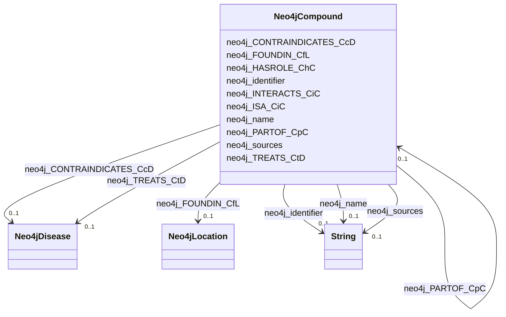

# Class: TODO -- what's a good name for this class (type)? (neo4j_Compound)


_TODO -- tell the world what this class (type) describes._


URI: [neo4j:Compound](neo4j://graph.schema#Compound)





<!-- no inheritance hierarchy -->


## Slots

| Name | Cardinality and Range | Description | Inheritance |
| ---  | --- | --- | --- |
| [neo4j_INTERACTS_CiC](../slots/neo4j_INTERACTS_CiC.md) | 0..1 <br/> [Neo4jCompound](../classes/Neo4jCompound.md) | TODO -- tell the world what this slot (predicate) describes | direct |
| [neo4j_CONTRAINDICATES_CcD](../slots/neo4j_CONTRAINDICATES_CcD.md) | 0..1 <br/> [Neo4jDisease](../classes/Neo4jDisease.md) | TODO -- tell the world what this slot (predicate) describes | direct |
| [neo4j_TREATS_CtD](../slots/neo4j_TREATS_CtD.md) | 0..1 <br/> [Neo4jDisease](../classes/Neo4jDisease.md) | TODO -- tell the world what this slot (predicate) describes | direct |
| [neo4j_identifier](../slots/neo4j_identifier.md) | 0..1 <br/> [xsd:string](http://www.w3.org/2001/XMLSchema#string) | TODO -- tell the world what this slot (predicate) describes | direct |
| [neo4j_PARTOF_CpC](../slots/neo4j_PARTOF_CpC.md) | 0..1 <br/> [Neo4jCompound](../classes/Neo4jCompound.md) | TODO -- tell the world what this slot (predicate) describes | direct |
| [neo4j_name](../slots/neo4j_name.md) | 0..1 <br/> [xsd:string](http://www.w3.org/2001/XMLSchema#string) | TODO -- tell the world what this slot (predicate) describes | direct |
| [neo4j_HASROLE_ChC](../slots/neo4j_HASROLE_ChC.md) | 0..1 <br/> [Neo4jCompound](../classes/Neo4jCompound.md) | TODO -- tell the world what this slot (predicate) describes | direct |
| [neo4j_FOUNDIN_CfL](../slots/neo4j_FOUNDIN_CfL.md) | 0..1 <br/> [Neo4jLocation](../classes/Neo4jLocation.md) | TODO -- tell the world what this slot (predicate) describes | direct |
| [neo4j_sources](../slots/neo4j_sources.md) | 0..1 <br/> [xsd:string](http://www.w3.org/2001/XMLSchema#string) | TODO -- tell the world what this slot (predicate) describes | direct |
| [neo4j_ISA_CiC](../slots/neo4j_ISA_CiC.md) | 0..1 <br/> [Neo4jCompound](../classes/Neo4jCompound.md) | TODO -- tell the world what this slot (predicate) describes | direct |


## Usages

| used by | used in | type | used |
| ---  | --- | --- | --- |
| [Neo4jCompound](../classes/Neo4jCompound.md) | [neo4j_INTERACTS_CiC](../slots/neo4j_INTERACTS_CiC.md) | range | [Neo4jCompound](../classes/Neo4jCompound.md) |
| [Neo4jCompound](../classes/Neo4jCompound.md) | [neo4j_PARTOF_CpC](../slots/neo4j_PARTOF_CpC.md) | range | [Neo4jCompound](../classes/Neo4jCompound.md) |
| [Neo4jCompound](../classes/Neo4jCompound.md) | [neo4j_HASROLE_ChC](../slots/neo4j_HASROLE_ChC.md) | range | [Neo4jCompound](../classes/Neo4jCompound.md) |
| [Neo4jCompound](../classes/Neo4jCompound.md) | [neo4j_ISA_CiC](../slots/neo4j_ISA_CiC.md) | range | [Neo4jCompound](../classes/Neo4jCompound.md) |
| [Neo4jOrganism](../classes/Neo4jOrganism.md) | [neo4j_RESPONDS_TO_OrC](../slots/neo4j_RESPONDS_TO_OrC.md) | range | [Neo4jCompound](../classes/Neo4jCompound.md) |


## Examples

| Value |
| --- |
| neo4j://graph.individuals#1961711 |

## TODOs

* TODO -- Todos for this class go here
* or you can delete the todos
* if you think the class is perfect.

## Identifier and Mapping Information


### Schema Source


* from schema: spoke-kg


## Mappings

| Mapping Type | Mapped Value |
| ---  | ---  |
| self | neo4j:Compound |
| native | spoke-kg/:Neo4jCompound |


## LinkML Source

<!-- TODO: investigate https://stackoverflow.com/questions/37606292/how-to-create-tabbed-code-blocks-in-mkdocs-or-sphinx -->

### Direct

<details>
```yaml
name: neo4j_Compound
description: TODO -- tell the world what this class (type) describes.
title: TODO -- what's a good name for this class (type)?
todos:
- TODO -- Todos for this class go here
- or you can delete the todos
- if you think the class is perfect.
notes:
- Class with 798 occurences.
examples:
- value: neo4j://graph.individuals#1961711
from_schema: spoke-kg
slots:
- neo4j_INTERACTS_CiC
- neo4j_CONTRAINDICATES_CcD
- neo4j_TREATS_CtD
- neo4j_identifier
- neo4j_PARTOF_CpC
- neo4j_name
- neo4j_HASROLE_ChC
- neo4j_FOUNDIN_CfL
- neo4j_sources
- neo4j_ISA_CiC
class_uri: neo4j:Compound

```
</details>

### Induced

<details>
```yaml
name: neo4j_Compound
description: TODO -- tell the world what this class (type) describes.
title: TODO -- what's a good name for this class (type)?
todos:
- TODO -- Todos for this class go here
- or you can delete the todos
- if you think the class is perfect.
notes:
- Class with 798 occurences.
examples:
- value: neo4j://graph.individuals#1961711
from_schema: spoke-kg
attributes:
  neo4j_INTERACTS_CiC:
    name: neo4j_INTERACTS_CiC
    description: TODO -- tell the world what this slot (predicate) describes.
    todos:
    - TODO -- Todos for this slot go here
    - or you can delete the todos
    - if you think the class is perfect.
    comments:
    - 1 occurrences with subject type neo4j_Compound and object type neo4j_Compound.
    examples:
    - value: neo4j://graph.individuals#385755 neo4j:INTERACTS_CiC neo4j://graph.individuals#386675
    from_schema: spoke-kg
    rank: 1000
    slot_uri: neo4j:INTERACTS_CiC
    alias: neo4j_INTERACTS_CiC
    owner: neo4j_Compound
    domain_of:
    - neo4j_Compound
    range: neo4j_Compound
  neo4j_CONTRAINDICATES_CcD:
    name: neo4j_CONTRAINDICATES_CcD
    description: TODO -- tell the world what this slot (predicate) describes.
    todos:
    - TODO -- Todos for this slot go here
    - or you can delete the todos
    - if you think the class is perfect.
    comments:
    - 51 occurrences with subject type neo4j_Compound and object type neo4j_Disease.
    examples:
    - value: neo4j://graph.individuals#387655 neo4j:CONTRAINDICATES_CcD neo4j://graph.individuals#152911
    from_schema: spoke-kg
    rank: 1000
    slot_uri: neo4j:CONTRAINDICATES_CcD
    alias: neo4j_CONTRAINDICATES_CcD
    owner: neo4j_Compound
    domain_of:
    - neo4j_Compound
    range: neo4j_Disease
  neo4j_TREATS_CtD:
    name: neo4j_TREATS_CtD
    description: TODO -- tell the world what this slot (predicate) describes.
    todos:
    - TODO -- Todos for this slot go here
    - or you can delete the todos
    - if you think the class is perfect.
    comments:
    - 163 occurrences with subject type neo4j_Compound and object type neo4j_Disease.
    examples:
    - value: neo4j://graph.individuals#399981 neo4j:TREATS_CtD neo4j://graph.individuals#145652
    from_schema: spoke-kg
    rank: 1000
    slot_uri: neo4j:TREATS_CtD
    alias: neo4j_TREATS_CtD
    owner: neo4j_Compound
    domain_of:
    - neo4j_Compound
    range: neo4j_Disease
  neo4j_identifier:
    name: neo4j_identifier
    description: TODO -- tell the world what this slot (predicate) describes.
    todos:
    - TODO -- Todos for this slot go here
    - or you can delete the todos
    - if you think the class is perfect.
    comments:
    - 2 occurrences with subject type neo4j_Environment and object type string.
    - 1426 occurrences with subject type neo4j_SDoH and object type string.
    - 106067 occurrences with subject type neo4j_Location and object type string.
    - 180 occurrences with subject type neo4j_Disease and object type string.
    - 798 occurrences with subject type neo4j_Compound and object type string.
    - 321442 occurrences with subject type neo4j_Organism and object type string.
    examples:
    - value: neo4j://graph.individuals#105029 neo4j:identifier ENVO_01000405
    - value: neo4j://graph.individuals#119274 neo4j:identifier 158928002
    - value: neo4j://graph.individuals#123229 neo4j:identifier 049999985379
    - value: neo4j://graph.individuals#142359 neo4j:identifier DOID:3074
    - value: neo4j://graph.individuals#1961711 neo4j:identifier inchikey:NWXMGUDVXFXRIG-WESIUVDSSA-N
    - value: neo4j://graph.individuals#105042 neo4j:identifier 104102.36
    from_schema: spoke-kg
    rank: 1000
    slot_uri: neo4j:identifier
    alias: neo4j_identifier
    owner: neo4j_Compound
    domain_of:
    - neo4j_Compound
    - neo4j_Disease
    - neo4j_Environment
    - neo4j_Location
    - neo4j_Organism
    - neo4j_SDoH
    range: string
  neo4j_PARTOF_CpC:
    name: neo4j_PARTOF_CpC
    description: TODO -- tell the world what this slot (predicate) describes.
    todos:
    - TODO -- Todos for this slot go here
    - or you can delete the todos
    - if you think the class is perfect.
    comments:
    - 18 occurrences with subject type neo4j_Compound and object type neo4j_Compound.
    examples:
    - value: neo4j://graph.individuals#395317 neo4j:PARTOF_CpC neo4j://graph.individuals#395791
    from_schema: spoke-kg
    rank: 1000
    slot_uri: neo4j:PARTOF_CpC
    alias: neo4j_PARTOF_CpC
    owner: neo4j_Compound
    domain_of:
    - neo4j_Compound
    range: neo4j_Compound
  neo4j_name:
    name: neo4j_name
    description: TODO -- tell the world what this slot (predicate) describes.
    todos:
    - TODO -- Todos for this slot go here
    - or you can delete the todos
    - if you think the class is perfect.
    comments:
    - 2 occurrences with subject type neo4j_Environment and object type string.
    - 1426 occurrences with subject type neo4j_SDoH and object type string.
    - 106067 occurrences with subject type neo4j_Location and object type string.
    - 180 occurrences with subject type neo4j_Disease and object type string.
    - 798 occurrences with subject type neo4j_Compound and object type string.
    - 321442 occurrences with subject type neo4j_Organism and object type string.
    examples:
    - value: neo4j://graph.individuals#105029 neo4j:name respirable suspended particulate
        matter
    - value: neo4j://graph.individuals#119274 neo4j:name Social scientist (occupation)
    - value: neo4j://graph.individuals#123229 neo4j:name Outside city limits
    - value: neo4j://graph.individuals#142359 neo4j:name giant cell glioblastoma
    - value: neo4j://graph.individuals#1961711 neo4j:name Tetracycline
    - value: neo4j://graph.individuals#105042 neo4j:name Acetobacter tropicalis strain
        DmPark25_167
    from_schema: spoke-kg
    rank: 1000
    slot_uri: neo4j:name
    alias: neo4j_name
    owner: neo4j_Compound
    domain_of:
    - neo4j_Compound
    - neo4j_Disease
    - neo4j_Environment
    - neo4j_Location
    - neo4j_Organism
    - neo4j_SDoH
    range: string
  neo4j_HASROLE_ChC:
    name: neo4j_HASROLE_ChC
    description: TODO -- tell the world what this slot (predicate) describes.
    todos:
    - TODO -- Todos for this slot go here
    - or you can delete the todos
    - if you think the class is perfect.
    comments:
    - 34 occurrences with subject type neo4j_Compound and object type neo4j_Compound.
    examples:
    - value: neo4j://graph.individuals#397113 neo4j:HASROLE_ChC neo4j://graph.individuals#2469017
    from_schema: spoke-kg
    rank: 1000
    slot_uri: neo4j:HASROLE_ChC
    alias: neo4j_HASROLE_ChC
    owner: neo4j_Compound
    domain_of:
    - neo4j_Compound
    range: neo4j_Compound
  neo4j_FOUNDIN_CfL:
    name: neo4j_FOUNDIN_CfL
    description: TODO -- tell the world what this slot (predicate) describes.
    todos:
    - TODO -- Todos for this slot go here
    - or you can delete the todos
    - if you think the class is perfect.
    comments:
    - 563803 occurrences with subject type neo4j_Compound and object type neo4j_Location.
    examples:
    - value: neo4j://graph.individuals#778857 neo4j:FOUNDIN_CfL neo4j://graph.individuals#30670081
    from_schema: spoke-kg
    rank: 1000
    slot_uri: neo4j:FOUNDIN_CfL
    alias: neo4j_FOUNDIN_CfL
    owner: neo4j_Compound
    domain_of:
    - neo4j_Compound
    range: neo4j_Location
  neo4j_sources:
    name: neo4j_sources
    description: TODO -- tell the world what this slot (predicate) describes.
    todos:
    - TODO -- Todos for this slot go here
    - or you can delete the todos
    - if you think the class is perfect.
    comments:
    - 2 occurrences with subject type neo4j_Environment and object type string.
    - 1426 occurrences with subject type neo4j_SDoH and object type string.
    - 106067 occurrences with subject type neo4j_Location and object type string.
    - 3336 occurrences with subject type neo4j_Compound and object type string.
    - 321442 occurrences with subject type neo4j_Organism and object type string.
    examples:
    - value: neo4j://graph.individuals#105029 neo4j:sources Environment Ontology
    - value: neo4j://graph.individuals#119274 neo4j:sources SNOMED CT
    - value: neo4j://graph.individuals#123229 neo4j:sources UnitedStatesZipcode_database
    - value: neo4j://graph.individuals#1961711 neo4j:sources BioCyc
    - value: neo4j://graph.individuals#105042 neo4j:sources BV-BRC
    from_schema: spoke-kg
    rank: 1000
    slot_uri: neo4j:sources
    alias: neo4j_sources
    owner: neo4j_Compound
    domain_of:
    - neo4j_Compound
    - neo4j_Environment
    - neo4j_Location
    - neo4j_Organism
    - neo4j_SDoH
    range: string
  neo4j_ISA_CiC:
    name: neo4j_ISA_CiC
    description: TODO -- tell the world what this slot (predicate) describes.
    todos:
    - TODO -- Todos for this slot go here
    - or you can delete the todos
    - if you think the class is perfect.
    comments:
    - 56 occurrences with subject type neo4j_Compound and object type neo4j_Compound.
    examples:
    - value: neo4j://graph.individuals#556433 neo4j:ISA_CiC neo4j://graph.individuals#388216
    from_schema: spoke-kg
    rank: 1000
    slot_uri: neo4j:ISA_CiC
    alias: neo4j_ISA_CiC
    owner: neo4j_Compound
    domain_of:
    - neo4j_Compound
    range: neo4j_Compound
class_uri: neo4j:Compound

```
</details>