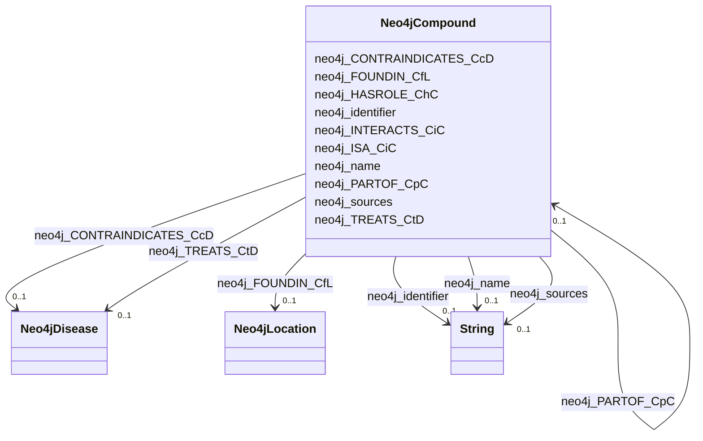

# Class: No class name specified (neo4j_Compound)


_No class (type) description specified_


URI: [neo4j:Compound](neo4j://graph.schema#Compound)





<!-- no inheritance hierarchy -->


## Slots

| Name | Cardinality and Range | Description | Inheritance |
| ---  | --- | --- | --- |
| [neo4j_name](../slots/neo4j_name.md) | 0..1 <br/> [xsd:string](xsd:string) | No slot (predicate) description specified <br/> 2 occurrences with subject type neo4j_Environment and object type string.<br/>1426 occurrences with subject type neo4j_SDoH and object type string.<br/>106067 occurrences with subject type neo4j_Location and object type string.<br/>180 occurrences with subject type neo4j_Disease and object type string.<br/>798 occurrences with subject type neo4j_Compound and object type string.<br/>321442 occurrences with subject type neo4j_Organism and object type string. | direct |
| [neo4j_INTERACTS_CiC](../slots/neo4j_INTERACTS_CiC.md) | 0..1 <br/> [Neo4jCompound](../classes/Neo4jCompound.md) | No slot (predicate) description specified <br/> 1 occurrences with subject type neo4j_Compound and object type neo4j_Compound. | direct |
| [neo4j_PARTOF_CpC](../slots/neo4j_PARTOF_CpC.md) | 0..1 <br/> [Neo4jCompound](../classes/Neo4jCompound.md) | No slot (predicate) description specified <br/> 18 occurrences with subject type neo4j_Compound and object type neo4j_Compound. | direct |
| [neo4j_ISA_CiC](../slots/neo4j_ISA_CiC.md) | 0..1 <br/> [Neo4jCompound](../classes/Neo4jCompound.md) | No slot (predicate) description specified <br/> 56 occurrences with subject type neo4j_Compound and object type neo4j_Compound. | direct |
| [neo4j_HASROLE_ChC](../slots/neo4j_HASROLE_ChC.md) | 0..1 <br/> [Neo4jCompound](../classes/Neo4jCompound.md) | No slot (predicate) description specified <br/> 34 occurrences with subject type neo4j_Compound and object type neo4j_Compound. | direct |
| [neo4j_identifier](../slots/neo4j_identifier.md) | 0..1 <br/> [xsd:string](xsd:string) | No slot (predicate) description specified <br/> 2 occurrences with subject type neo4j_Environment and object type string.<br/>1426 occurrences with subject type neo4j_SDoH and object type string.<br/>106067 occurrences with subject type neo4j_Location and object type string.<br/>180 occurrences with subject type neo4j_Disease and object type string.<br/>798 occurrences with subject type neo4j_Compound and object type string.<br/>321442 occurrences with subject type neo4j_Organism and object type string. | direct |
| [neo4j_CONTRAINDICATES_CcD](../slots/neo4j_CONTRAINDICATES_CcD.md) | 0..1 <br/> [Neo4jDisease](../classes/Neo4jDisease.md) | No slot (predicate) description specified <br/> 51 occurrences with subject type neo4j_Compound and object type neo4j_Disease. | direct |
| [neo4j_sources](../slots/neo4j_sources.md) | 0..1 <br/> [xsd:string](xsd:string) | No slot (predicate) description specified <br/> 2 occurrences with subject type neo4j_Environment and object type string.<br/>1426 occurrences with subject type neo4j_SDoH and object type string.<br/>106067 occurrences with subject type neo4j_Location and object type string.<br/>3336 occurrences with subject type neo4j_Compound and object type string.<br/>321442 occurrences with subject type neo4j_Organism and object type string. | direct |
| [neo4j_TREATS_CtD](../slots/neo4j_TREATS_CtD.md) | 0..1 <br/> [Neo4jDisease](../classes/Neo4jDisease.md) | No slot (predicate) description specified <br/> 163 occurrences with subject type neo4j_Compound and object type neo4j_Disease. | direct |
| [neo4j_FOUNDIN_CfL](../slots/neo4j_FOUNDIN_CfL.md) | 0..1 <br/> [Neo4jLocation](../classes/Neo4jLocation.md) | No slot (predicate) description specified <br/> 563803 occurrences with subject type neo4j_Compound and object type neo4j_Location. | direct |


## Usages

| used by | used in | type | used |
| ---  | --- | --- | --- |
| [Neo4jCompound](../classes/Neo4jCompound.md) | [neo4j_INTERACTS_CiC](../slots/neo4j_INTERACTS_CiC.md) | range | [Neo4jCompound](../classes/Neo4jCompound.md) |
| [Neo4jCompound](../classes/Neo4jCompound.md) | [neo4j_PARTOF_CpC](../slots/neo4j_PARTOF_CpC.md) | range | [Neo4jCompound](../classes/Neo4jCompound.md) |
| [Neo4jCompound](../classes/Neo4jCompound.md) | [neo4j_ISA_CiC](../slots/neo4j_ISA_CiC.md) | range | [Neo4jCompound](../classes/Neo4jCompound.md) |
| [Neo4jCompound](../classes/Neo4jCompound.md) | [neo4j_HASROLE_ChC](../slots/neo4j_HASROLE_ChC.md) | range | [Neo4jCompound](../classes/Neo4jCompound.md) |
| [Neo4jOrganism](../classes/Neo4jOrganism.md) | [neo4j_RESPONDS_TO_OrC](../slots/neo4j_RESPONDS_TO_OrC.md) | range | [Neo4jCompound](../classes/Neo4jCompound.md) |


## Examples

| Value |
| --- |
| neo4j://graph.individuals#1961711 |


## Identifier and Mapping Information


### Schema Source


* from schema: spoke-kg


## Mappings

| Mapping Type | Mapped Value |
| ---  | ---  |
| self | neo4j:Compound |
| native | spoke-kg/:Neo4jCompound |


## LinkML Source

<!-- TODO: investigate https://stackoverflow.com/questions/37606292/how-to-create-tabbed-code-blocks-in-mkdocs-or-sphinx -->

### Direct

<details>
```yaml
name: neo4j_Compound
conforms_to: No schema conformance document specified
description: No class (type) description specified
title: No class name specified
notes:
- Class with 798 occurrences.
examples:
- value: neo4j://graph.individuals#1961711
from_schema: spoke-kg
rank: 1000
slots:
- neo4j_name
- neo4j_INTERACTS_CiC
- neo4j_PARTOF_CpC
- neo4j_ISA_CiC
- neo4j_HASROLE_ChC
- neo4j_identifier
- neo4j_CONTRAINDICATES_CcD
- neo4j_sources
- neo4j_TREATS_CtD
- neo4j_FOUNDIN_CfL
class_uri: neo4j:Compound

```
</details>

### Induced

<details>
```yaml
name: neo4j_Compound
conforms_to: No schema conformance document specified
description: No class (type) description specified
title: No class name specified
notes:
- Class with 798 occurrences.
examples:
- value: neo4j://graph.individuals#1961711
from_schema: spoke-kg
rank: 1000
attributes:
  neo4j_name:
    name: neo4j_name
    description: No slot (predicate) description specified
    comments:
    - 2 occurrences with subject type neo4j_Environment and object type string.
    - 1426 occurrences with subject type neo4j_SDoH and object type string.
    - 106067 occurrences with subject type neo4j_Location and object type string.
    - 180 occurrences with subject type neo4j_Disease and object type string.
    - 798 occurrences with subject type neo4j_Compound and object type string.
    - 321442 occurrences with subject type neo4j_Organism and object type string.
    examples:
    - description: neo4j_Environment → string
      object:
        example_object: respirable suspended particulate matter
        example_predicate: neo4j:name
        example_subject: neo4j://graph.individuals#105029
    - description: neo4j_SDoH → string
      object:
        example_object: Social scientist (occupation)
        example_predicate: neo4j:name
        example_subject: neo4j://graph.individuals#119274
    - description: neo4j_Location → string
      object:
        example_object: Outside city limits
        example_predicate: neo4j:name
        example_subject: neo4j://graph.individuals#123229
    - description: neo4j_Disease → string
      object:
        example_object: giant cell glioblastoma
        example_predicate: neo4j:name
        example_subject: neo4j://graph.individuals#142359
    - description: neo4j_Compound → string
      object:
        example_object: Tetracycline
        example_predicate: neo4j:name
        example_subject: neo4j://graph.individuals#1961711
    - description: neo4j_Organism → string
      object:
        example_object: Acetobacter tropicalis strain DmPark25_167
        example_predicate: neo4j:name
        example_subject: neo4j://graph.individuals#105042
    from_schema: spoke-kg
    rank: 1000
    slot_uri: neo4j:name
    alias: neo4j_name
    owner: neo4j_Compound
    domain_of:
    - neo4j_Compound
    - neo4j_Disease
    - neo4j_Environment
    - neo4j_Location
    - neo4j_Organism
    - neo4j_SDoH
    range: string
  neo4j_INTERACTS_CiC:
    name: neo4j_INTERACTS_CiC
    description: No slot (predicate) description specified
    comments:
    - 1 occurrences with subject type neo4j_Compound and object type neo4j_Compound.
    examples:
    - description: neo4j_Compound → neo4j_Compound
      object:
        example_object: neo4j://graph.individuals#386675
        example_predicate: neo4j:INTERACTS_CiC
        example_subject: neo4j://graph.individuals#385755
    from_schema: spoke-kg
    rank: 1000
    slot_uri: neo4j:INTERACTS_CiC
    alias: neo4j_INTERACTS_CiC
    owner: neo4j_Compound
    domain_of:
    - neo4j_Compound
    range: neo4j_Compound
  neo4j_PARTOF_CpC:
    name: neo4j_PARTOF_CpC
    description: No slot (predicate) description specified
    comments:
    - 18 occurrences with subject type neo4j_Compound and object type neo4j_Compound.
    examples:
    - description: neo4j_Compound → neo4j_Compound
      object:
        example_object: neo4j://graph.individuals#395791
        example_predicate: neo4j:PARTOF_CpC
        example_subject: neo4j://graph.individuals#395317
    from_schema: spoke-kg
    rank: 1000
    slot_uri: neo4j:PARTOF_CpC
    alias: neo4j_PARTOF_CpC
    owner: neo4j_Compound
    domain_of:
    - neo4j_Compound
    range: neo4j_Compound
  neo4j_ISA_CiC:
    name: neo4j_ISA_CiC
    description: No slot (predicate) description specified
    comments:
    - 56 occurrences with subject type neo4j_Compound and object type neo4j_Compound.
    examples:
    - description: neo4j_Compound → neo4j_Compound
      object:
        example_object: neo4j://graph.individuals#388216
        example_predicate: neo4j:ISA_CiC
        example_subject: neo4j://graph.individuals#556433
    from_schema: spoke-kg
    rank: 1000
    slot_uri: neo4j:ISA_CiC
    alias: neo4j_ISA_CiC
    owner: neo4j_Compound
    domain_of:
    - neo4j_Compound
    range: neo4j_Compound
  neo4j_HASROLE_ChC:
    name: neo4j_HASROLE_ChC
    description: No slot (predicate) description specified
    comments:
    - 34 occurrences with subject type neo4j_Compound and object type neo4j_Compound.
    examples:
    - description: neo4j_Compound → neo4j_Compound
      object:
        example_object: neo4j://graph.individuals#2469017
        example_predicate: neo4j:HASROLE_ChC
        example_subject: neo4j://graph.individuals#397113
    from_schema: spoke-kg
    rank: 1000
    slot_uri: neo4j:HASROLE_ChC
    alias: neo4j_HASROLE_ChC
    owner: neo4j_Compound
    domain_of:
    - neo4j_Compound
    range: neo4j_Compound
  neo4j_identifier:
    name: neo4j_identifier
    description: No slot (predicate) description specified
    comments:
    - 2 occurrences with subject type neo4j_Environment and object type string.
    - 1426 occurrences with subject type neo4j_SDoH and object type string.
    - 106067 occurrences with subject type neo4j_Location and object type string.
    - 180 occurrences with subject type neo4j_Disease and object type string.
    - 798 occurrences with subject type neo4j_Compound and object type string.
    - 321442 occurrences with subject type neo4j_Organism and object type string.
    examples:
    - description: neo4j_Environment → string
      object:
        example_object: ENVO_01000405
        example_predicate: neo4j:identifier
        example_subject: neo4j://graph.individuals#105029
    - description: neo4j_SDoH → string
      object:
        example_object: '158928002'
        example_predicate: neo4j:identifier
        example_subject: neo4j://graph.individuals#119274
    - description: neo4j_Location → string
      object:
        example_object: 049999985379
        example_predicate: neo4j:identifier
        example_subject: neo4j://graph.individuals#123229
    - description: neo4j_Disease → string
      object:
        example_object: DOID:3074
        example_predicate: neo4j:identifier
        example_subject: neo4j://graph.individuals#142359
    - description: neo4j_Compound → string
      object:
        example_object: inchikey:NWXMGUDVXFXRIG-WESIUVDSSA-N
        example_predicate: neo4j:identifier
        example_subject: neo4j://graph.individuals#1961711
    - description: neo4j_Organism → string
      object:
        example_object: '104102.36'
        example_predicate: neo4j:identifier
        example_subject: neo4j://graph.individuals#105042
    from_schema: spoke-kg
    rank: 1000
    slot_uri: neo4j:identifier
    alias: neo4j_identifier
    owner: neo4j_Compound
    domain_of:
    - neo4j_Compound
    - neo4j_Disease
    - neo4j_Environment
    - neo4j_Location
    - neo4j_Organism
    - neo4j_SDoH
    range: string
  neo4j_CONTRAINDICATES_CcD:
    name: neo4j_CONTRAINDICATES_CcD
    description: No slot (predicate) description specified
    comments:
    - 51 occurrences with subject type neo4j_Compound and object type neo4j_Disease.
    examples:
    - description: neo4j_Compound → neo4j_Disease
      object:
        example_object: neo4j://graph.individuals#152911
        example_predicate: neo4j:CONTRAINDICATES_CcD
        example_subject: neo4j://graph.individuals#387655
    from_schema: spoke-kg
    rank: 1000
    slot_uri: neo4j:CONTRAINDICATES_CcD
    alias: neo4j_CONTRAINDICATES_CcD
    owner: neo4j_Compound
    domain_of:
    - neo4j_Compound
    range: neo4j_Disease
  neo4j_sources:
    name: neo4j_sources
    description: No slot (predicate) description specified
    comments:
    - 2 occurrences with subject type neo4j_Environment and object type string.
    - 1426 occurrences with subject type neo4j_SDoH and object type string.
    - 106067 occurrences with subject type neo4j_Location and object type string.
    - 3336 occurrences with subject type neo4j_Compound and object type string.
    - 321442 occurrences with subject type neo4j_Organism and object type string.
    examples:
    - description: neo4j_Environment → string
      object:
        example_object: Environment Ontology
        example_predicate: neo4j:sources
        example_subject: neo4j://graph.individuals#105029
    - description: neo4j_SDoH → string
      object:
        example_object: SNOMED CT
        example_predicate: neo4j:sources
        example_subject: neo4j://graph.individuals#119274
    - description: neo4j_Location → string
      object:
        example_object: UnitedStatesZipcode_database
        example_predicate: neo4j:sources
        example_subject: neo4j://graph.individuals#123229
    - description: neo4j_Compound → string
      object:
        example_object: BioCyc
        example_predicate: neo4j:sources
        example_subject: neo4j://graph.individuals#1961711
    - description: neo4j_Organism → string
      object:
        example_object: BV-BRC
        example_predicate: neo4j:sources
        example_subject: neo4j://graph.individuals#105042
    from_schema: spoke-kg
    rank: 1000
    slot_uri: neo4j:sources
    alias: neo4j_sources
    owner: neo4j_Compound
    domain_of:
    - neo4j_Compound
    - neo4j_Environment
    - neo4j_Location
    - neo4j_Organism
    - neo4j_SDoH
    range: string
  neo4j_TREATS_CtD:
    name: neo4j_TREATS_CtD
    description: No slot (predicate) description specified
    comments:
    - 163 occurrences with subject type neo4j_Compound and object type neo4j_Disease.
    examples:
    - description: neo4j_Compound → neo4j_Disease
      object:
        example_object: neo4j://graph.individuals#145652
        example_predicate: neo4j:TREATS_CtD
        example_subject: neo4j://graph.individuals#399981
    from_schema: spoke-kg
    rank: 1000
    slot_uri: neo4j:TREATS_CtD
    alias: neo4j_TREATS_CtD
    owner: neo4j_Compound
    domain_of:
    - neo4j_Compound
    range: neo4j_Disease
  neo4j_FOUNDIN_CfL:
    name: neo4j_FOUNDIN_CfL
    description: No slot (predicate) description specified
    comments:
    - 563803 occurrences with subject type neo4j_Compound and object type neo4j_Location.
    examples:
    - description: neo4j_Compound → neo4j_Location
      object:
        example_object: neo4j://graph.individuals#30670081
        example_predicate: neo4j:FOUNDIN_CfL
        example_subject: neo4j://graph.individuals#778857
    from_schema: spoke-kg
    rank: 1000
    slot_uri: neo4j:FOUNDIN_CfL
    alias: neo4j_FOUNDIN_CfL
    owner: neo4j_Compound
    domain_of:
    - neo4j_Compound
    range: neo4j_Location
class_uri: neo4j:Compound

```
</details>