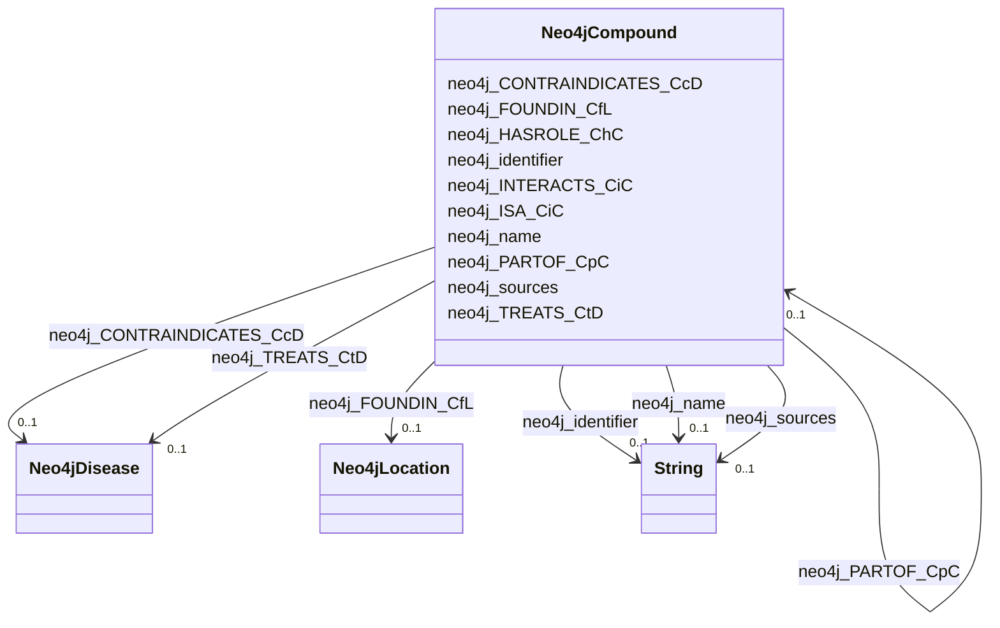

# Class: Neo4jCompound


This class occurs 798 times.


URI: [neo4j:Compound](neo4j://graph.schema#Compound)





<!-- no inheritance hierarchy -->


## Slots

| Name | Cardinality and Range | Description | Inheritance | Occurrences |
| ---  | --- | --- | --- | --- |
| [neo4j_sources](../slots/neo4j_sources.md) | 0..1 <br/> [xsd:string](http://www.w3.org/2001/XMLSchema#string) |  <br/>  | direct | 3336 |
| [neo4j_identifier](../slots/neo4j_identifier.md) | 0..1 <br/> [xsd:string](http://www.w3.org/2001/XMLSchema#string) |  <br/>  | direct | 798 |
| [neo4j_ISA_CiC](../slots/neo4j_ISA_CiC.md) | 0..1 <br/> [Neo4jCompound](../classes/Neo4jCompound.md) |  <br/>  | direct | 56 |
| [neo4j_FOUNDIN_CfL](../slots/neo4j_FOUNDIN_CfL.md) | 0..1 <br/> [Neo4jLocation](../classes/Neo4jLocation.md) |  <br/>  | direct | 563803 |
| [neo4j_INTERACTS_CiC](../slots/neo4j_INTERACTS_CiC.md) | 0..1 <br/> [Neo4jCompound](../classes/Neo4jCompound.md) |  <br/>  | direct | 1 |
| [neo4j_name](../slots/neo4j_name.md) | 0..1 <br/> [xsd:string](http://www.w3.org/2001/XMLSchema#string) |  <br/>  | direct | 798 |
| [neo4j_PARTOF_CpC](../slots/neo4j_PARTOF_CpC.md) | 0..1 <br/> [Neo4jCompound](../classes/Neo4jCompound.md) |  <br/>  | direct | 18 |
| [neo4j_TREATS_CtD](../slots/neo4j_TREATS_CtD.md) | 0..1 <br/> [Neo4jDisease](../classes/Neo4jDisease.md) |  <br/>  | direct | 163 |
| [neo4j_HASROLE_ChC](../slots/neo4j_HASROLE_ChC.md) | 0..1 <br/> [Neo4jCompound](../classes/Neo4jCompound.md) |  <br/>  | direct | 34 |
| [neo4j_CONTRAINDICATES_CcD](../slots/neo4j_CONTRAINDICATES_CcD.md) | 0..1 <br/> [Neo4jDisease](../classes/Neo4jDisease.md) |  <br/>  | direct | 51 |


## Usages

| used by | used in | type | used |
| ---  | --- | --- | --- |
| [Neo4jCompound](../classes/Neo4jCompound.md) | [neo4j_ISA_CiC](../slots/neo4j_ISA_CiC.md) | range | [Neo4jCompound](../classes/Neo4jCompound.md) |
| [Neo4jCompound](../classes/Neo4jCompound.md) | [neo4j_INTERACTS_CiC](../slots/neo4j_INTERACTS_CiC.md) | range | [Neo4jCompound](../classes/Neo4jCompound.md) |
| [Neo4jCompound](../classes/Neo4jCompound.md) | [neo4j_PARTOF_CpC](../slots/neo4j_PARTOF_CpC.md) | range | [Neo4jCompound](../classes/Neo4jCompound.md) |
| [Neo4jCompound](../classes/Neo4jCompound.md) | [neo4j_HASROLE_ChC](../slots/neo4j_HASROLE_ChC.md) | range | [Neo4jCompound](../classes/Neo4jCompound.md) |
| [Neo4jOrganism](../classes/Neo4jOrganism.md) | [neo4j_RESPONDS_TO_OrC](../slots/neo4j_RESPONDS_TO_OrC.md) | range | [Neo4jCompound](../classes/Neo4jCompound.md) |


## LinkML Source

<!-- TODO: investigate https://stackoverflow.com/questions/37606292/how-to-create-tabbed-code-blocks-in-mkdocs-or-sphinx -->

### Direct

<details>

```yaml
name: neo4j_Compound
from_schema: okns:spoke-kg
rank: 1000
slots:
- neo4j_sources
- neo4j_identifier
- neo4j_ISA_CiC
- neo4j_FOUNDIN_CfL
- neo4j_INTERACTS_CiC
- neo4j_name
- neo4j_PARTOF_CpC
- neo4j_TREATS_CtD
- neo4j_HASROLE_ChC
- neo4j_CONTRAINDICATES_CcD
class_uri: neo4j:Compound

```
</details>

### Induced

<details>

```yaml
name: neo4j_Compound
from_schema: okns:spoke-kg
rank: 1000
attributes:
  neo4j_sources:
    name: neo4j_sources
    from_schema: okns:spoke-kg
    rank: 1000
    slot_uri: neo4j:sources
    alias: neo4j_sources
    owner: neo4j_Compound
    domain_of:
    - neo4j_Compound
    - neo4j_Environment
    - neo4j_Location
    - neo4j_Organism
    - neo4j_SDoH
    range: string
  neo4j_identifier:
    name: neo4j_identifier
    from_schema: okns:spoke-kg
    rank: 1000
    slot_uri: neo4j:identifier
    alias: neo4j_identifier
    owner: neo4j_Compound
    domain_of:
    - neo4j_Compound
    - neo4j_Disease
    - neo4j_Environment
    - neo4j_Location
    - neo4j_Organism
    - neo4j_SDoH
    range: string
  neo4j_ISA_CiC:
    name: neo4j_ISA_CiC
    from_schema: okns:spoke-kg
    rank: 1000
    slot_uri: neo4j:ISA_CiC
    alias: neo4j_ISA_CiC
    owner: neo4j_Compound
    domain_of:
    - neo4j_Compound
    range: neo4j_Compound
  neo4j_FOUNDIN_CfL:
    name: neo4j_FOUNDIN_CfL
    from_schema: okns:spoke-kg
    rank: 1000
    slot_uri: neo4j:FOUNDIN_CfL
    alias: neo4j_FOUNDIN_CfL
    owner: neo4j_Compound
    domain_of:
    - neo4j_Compound
    range: neo4j_Location
  neo4j_INTERACTS_CiC:
    name: neo4j_INTERACTS_CiC
    from_schema: okns:spoke-kg
    rank: 1000
    slot_uri: neo4j:INTERACTS_CiC
    alias: neo4j_INTERACTS_CiC
    owner: neo4j_Compound
    domain_of:
    - neo4j_Compound
    range: neo4j_Compound
  neo4j_name:
    name: neo4j_name
    from_schema: okns:spoke-kg
    rank: 1000
    slot_uri: neo4j:name
    alias: neo4j_name
    owner: neo4j_Compound
    domain_of:
    - neo4j_Compound
    - neo4j_Disease
    - neo4j_Environment
    - neo4j_Location
    - neo4j_Organism
    - neo4j_SDoH
    range: string
  neo4j_PARTOF_CpC:
    name: neo4j_PARTOF_CpC
    from_schema: okns:spoke-kg
    rank: 1000
    slot_uri: neo4j:PARTOF_CpC
    alias: neo4j_PARTOF_CpC
    owner: neo4j_Compound
    domain_of:
    - neo4j_Compound
    range: neo4j_Compound
  neo4j_TREATS_CtD:
    name: neo4j_TREATS_CtD
    from_schema: okns:spoke-kg
    rank: 1000
    slot_uri: neo4j:TREATS_CtD
    alias: neo4j_TREATS_CtD
    owner: neo4j_Compound
    domain_of:
    - neo4j_Compound
    range: neo4j_Disease
  neo4j_HASROLE_ChC:
    name: neo4j_HASROLE_ChC
    from_schema: okns:spoke-kg
    rank: 1000
    slot_uri: neo4j:HASROLE_ChC
    alias: neo4j_HASROLE_ChC
    owner: neo4j_Compound
    domain_of:
    - neo4j_Compound
    range: neo4j_Compound
  neo4j_CONTRAINDICATES_CcD:
    name: neo4j_CONTRAINDICATES_CcD
    from_schema: okns:spoke-kg
    rank: 1000
    slot_uri: neo4j:CONTRAINDICATES_CcD
    alias: neo4j_CONTRAINDICATES_CcD
    owner: neo4j_Compound
    domain_of:
    - neo4j_Compound
    range: neo4j_Disease
class_uri: neo4j:Compound

```
</details>