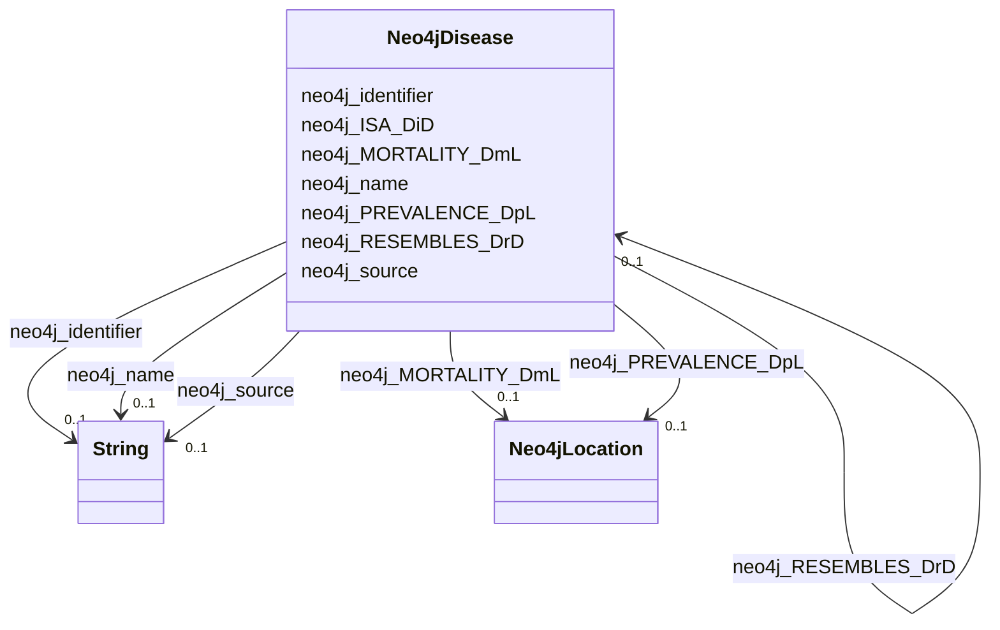

# Class: TODO -- what's a good name for this class (type)? (neo4j_Disease)


_No type description provided_


URI: [neo4j:Disease](neo4j://graph.schema#Disease)





<!-- no inheritance hierarchy -->


## Slots

| Name | Cardinality and Range | Description | Inheritance |
| ---  | --- | --- | --- |
| [neo4j_MORTALITY_DmL](../slots/neo4j_MORTALITY_DmL.md) | 0..1 <br/> [Neo4jLocation](../classes/Neo4jLocation.md) | No slot description provided | direct |
| [neo4j_identifier](../slots/neo4j_identifier.md) | 0..1 <br/> [xsd:string](xsd:string) | No slot description provided | direct |
| [neo4j_source](../slots/neo4j_source.md) | 0..1 <br/> [xsd:string](xsd:string) | No slot description provided | direct |
| [neo4j_name](../slots/neo4j_name.md) | 0..1 <br/> [xsd:string](xsd:string) | No slot description provided | direct |
| [neo4j_PREVALENCE_DpL](../slots/neo4j_PREVALENCE_DpL.md) | 0..1 <br/> [Neo4jLocation](../classes/Neo4jLocation.md) | No slot description provided | direct |
| [neo4j_RESEMBLES_DrD](../slots/neo4j_RESEMBLES_DrD.md) | 0..1 <br/> [Neo4jDisease](../classes/Neo4jDisease.md) | No slot description provided | direct |
| [neo4j_ISA_DiD](../slots/neo4j_ISA_DiD.md) | 0..1 <br/> [Neo4jDisease](../classes/Neo4jDisease.md) | No slot description provided | direct |


## Usages

| used by | used in | type | used |
| ---  | --- | --- | --- |
| [Neo4jCompound](../classes/Neo4jCompound.md) | [neo4j_CONTRAINDICATES_CcD](../slots/neo4j_CONTRAINDICATES_CcD.md) | range | [Neo4jDisease](../classes/Neo4jDisease.md) |
| [Neo4jCompound](../classes/Neo4jCompound.md) | [neo4j_TREATS_CtD](../slots/neo4j_TREATS_CtD.md) | range | [Neo4jDisease](../classes/Neo4jDisease.md) |
| [Neo4jDisease](../classes/Neo4jDisease.md) | [neo4j_RESEMBLES_DrD](../slots/neo4j_RESEMBLES_DrD.md) | range | [Neo4jDisease](../classes/Neo4jDisease.md) |
| [Neo4jDisease](../classes/Neo4jDisease.md) | [neo4j_ISA_DiD](../slots/neo4j_ISA_DiD.md) | range | [Neo4jDisease](../classes/Neo4jDisease.md) |
| [Neo4jSDoH](../classes/Neo4jSDoH.md) | [neo4j_ASSOCIATES_SaD](../slots/neo4j_ASSOCIATES_SaD.md) | range | [Neo4jDisease](../classes/Neo4jDisease.md) |


## Examples

| Value |
| --- |
| neo4j://graph.individuals#142359 |

## TODOs

* TODO -- Todos for this class go here
* or you can delete the todos
* if you think the class is perfect.

## Identifier and Mapping Information


### Schema Source


* from schema: spoke-kg


## Mappings

| Mapping Type | Mapped Value |
| ---  | ---  |
| self | neo4j:Disease |
| native | spoke-kg/:Neo4jDisease |


## LinkML Source

<!-- TODO: investigate https://stackoverflow.com/questions/37606292/how-to-create-tabbed-code-blocks-in-mkdocs-or-sphinx -->

### Direct

<details>
```yaml
name: neo4j_Disease
description: No type description provided
title: TODO -- what's a good name for this class (type)?
todos:
- TODO -- Todos for this class go here
- or you can delete the todos
- if you think the class is perfect.
notes:
- Class with 180 occurences.
examples:
- value: neo4j://graph.individuals#142359
from_schema: spoke-kg
rank: 1000
slots:
- neo4j_MORTALITY_DmL
- neo4j_identifier
- neo4j_source
- neo4j_name
- neo4j_PREVALENCE_DpL
- neo4j_RESEMBLES_DrD
- neo4j_ISA_DiD
class_uri: neo4j:Disease

```
</details>

### Induced

<details>
```yaml
name: neo4j_Disease
description: No type description provided
title: TODO -- what's a good name for this class (type)?
todos:
- TODO -- Todos for this class go here
- or you can delete the todos
- if you think the class is perfect.
notes:
- Class with 180 occurences.
examples:
- value: neo4j://graph.individuals#142359
from_schema: spoke-kg
rank: 1000
attributes:
  neo4j_MORTALITY_DmL:
    name: neo4j_MORTALITY_DmL
    description: No slot description provided
    todos:
    - TODO -- Todos for this slot go here
    - or you can delete the todos
    - if you think the class is perfect.
    comments:
    - 10802 occurrences with subject type neo4j_Disease and object type neo4j_Location.
    examples:
    - value: neo4j://graph.individuals#152579 neo4j:MORTALITY_DmL neo4j://graph.individuals#80756
    from_schema: spoke-kg
    rank: 1000
    slot_uri: neo4j:MORTALITY_DmL
    alias: neo4j_MORTALITY_DmL
    owner: neo4j_Disease
    domain_of:
    - neo4j_Disease
    range: neo4j_Location
  neo4j_identifier:
    name: neo4j_identifier
    description: No slot description provided
    todos:
    - TODO -- Todos for this slot go here
    - or you can delete the todos
    - if you think the class is perfect.
    comments:
    - 2 occurrences with subject type neo4j_Environment and object type string.
    - 1426 occurrences with subject type neo4j_SDoH and object type string.
    - 106067 occurrences with subject type neo4j_Location and object type string.
    - 180 occurrences with subject type neo4j_Disease and object type string.
    - 798 occurrences with subject type neo4j_Compound and object type string.
    - 321442 occurrences with subject type neo4j_Organism and object type string.
    examples:
    - value: neo4j://graph.individuals#105029 neo4j:identifier ENVO_01000405
    - value: neo4j://graph.individuals#119274 neo4j:identifier 158928002
    - value: neo4j://graph.individuals#123229 neo4j:identifier 049999985379
    - value: neo4j://graph.individuals#142359 neo4j:identifier DOID:3074
    - value: neo4j://graph.individuals#1961711 neo4j:identifier inchikey:NWXMGUDVXFXRIG-WESIUVDSSA-N
    - value: neo4j://graph.individuals#105042 neo4j:identifier 104102.36
    from_schema: spoke-kg
    rank: 1000
    slot_uri: neo4j:identifier
    alias: neo4j_identifier
    owner: neo4j_Disease
    domain_of:
    - neo4j_Compound
    - neo4j_Disease
    - neo4j_Environment
    - neo4j_Location
    - neo4j_Organism
    - neo4j_SDoH
    range: string
  neo4j_source:
    name: neo4j_source
    description: No slot description provided
    todos:
    - TODO -- Todos for this slot go here
    - or you can delete the todos
    - if you think the class is perfect.
    comments:
    - 180 occurrences with subject type neo4j_Disease and object type string.
    examples:
    - value: neo4j://graph.individuals#142359 neo4j:source Disease Ontology
    from_schema: spoke-kg
    rank: 1000
    slot_uri: neo4j:source
    alias: neo4j_source
    owner: neo4j_Disease
    domain_of:
    - neo4j_Disease
    range: string
  neo4j_name:
    name: neo4j_name
    description: No slot description provided
    todos:
    - TODO -- Todos for this slot go here
    - or you can delete the todos
    - if you think the class is perfect.
    comments:
    - 2 occurrences with subject type neo4j_Environment and object type string.
    - 1426 occurrences with subject type neo4j_SDoH and object type string.
    - 106067 occurrences with subject type neo4j_Location and object type string.
    - 180 occurrences with subject type neo4j_Disease and object type string.
    - 798 occurrences with subject type neo4j_Compound and object type string.
    - 321442 occurrences with subject type neo4j_Organism and object type string.
    examples:
    - value: neo4j://graph.individuals#105029 neo4j:name respirable suspended particulate
        matter
    - value: neo4j://graph.individuals#119274 neo4j:name Social scientist (occupation)
    - value: neo4j://graph.individuals#123229 neo4j:name Outside city limits
    - value: neo4j://graph.individuals#142359 neo4j:name giant cell glioblastoma
    - value: neo4j://graph.individuals#1961711 neo4j:name Tetracycline
    - value: neo4j://graph.individuals#105042 neo4j:name Acetobacter tropicalis strain
        DmPark25_167
    from_schema: spoke-kg
    rank: 1000
    slot_uri: neo4j:name
    alias: neo4j_name
    owner: neo4j_Disease
    domain_of:
    - neo4j_Compound
    - neo4j_Disease
    - neo4j_Environment
    - neo4j_Location
    - neo4j_Organism
    - neo4j_SDoH
    range: string
  neo4j_PREVALENCE_DpL:
    name: neo4j_PREVALENCE_DpL
    description: No slot description provided
    todos:
    - TODO -- Todos for this slot go here
    - or you can delete the todos
    - if you think the class is perfect.
    comments:
    - 275085 occurrences with subject type neo4j_Disease and object type neo4j_Location.
    examples:
    - value: neo4j://graph.individuals#153323 neo4j:PREVALENCE_DpL neo4j://graph.individuals#80756
    from_schema: spoke-kg
    rank: 1000
    slot_uri: neo4j:PREVALENCE_DpL
    alias: neo4j_PREVALENCE_DpL
    owner: neo4j_Disease
    domain_of:
    - neo4j_Disease
    range: neo4j_Location
  neo4j_RESEMBLES_DrD:
    name: neo4j_RESEMBLES_DrD
    description: No slot description provided
    todos:
    - TODO -- Todos for this slot go here
    - or you can delete the todos
    - if you think the class is perfect.
    comments:
    - 67 occurrences with subject type neo4j_Disease and object type neo4j_Disease.
    examples:
    - value: neo4j://graph.individuals#152554 neo4j:RESEMBLES_DrD neo4j://graph.individuals#144201
    from_schema: spoke-kg
    rank: 1000
    slot_uri: neo4j:RESEMBLES_DrD
    alias: neo4j_RESEMBLES_DrD
    owner: neo4j_Disease
    domain_of:
    - neo4j_Disease
    range: neo4j_Disease
  neo4j_ISA_DiD:
    name: neo4j_ISA_DiD
    description: No slot description provided
    todos:
    - TODO -- Todos for this slot go here
    - or you can delete the todos
    - if you think the class is perfect.
    comments:
    - 41 occurrences with subject type neo4j_Disease and object type neo4j_Disease.
    examples:
    - value: neo4j://graph.individuals#152421 neo4j:ISA_DiD neo4j://graph.individuals#152053
    from_schema: spoke-kg
    rank: 1000
    slot_uri: neo4j:ISA_DiD
    alias: neo4j_ISA_DiD
    owner: neo4j_Disease
    domain_of:
    - neo4j_Disease
    range: neo4j_Disease
class_uri: neo4j:Disease

```
</details>