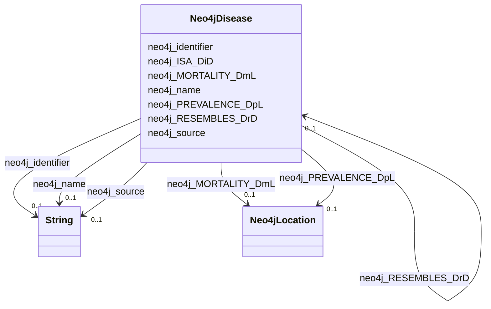

# Class: Neo4jDisease


This class occurs 180 times.


URI: [neo4j:Disease](neo4j://graph.schema#Disease)





<!-- no inheritance hierarchy -->


## Slots

| Name | Cardinality and Range | Description | Inheritance | Occurrences |
| ---  | --- | --- | --- | --- |
| [neo4j_RESEMBLES_DrD](../slots/neo4j_RESEMBLES_DrD.md) | 0..1 <br/> [Neo4jDisease](../classes/Neo4jDisease.md) |  <br/>  | direct | 67 |
| [neo4j_identifier](../slots/neo4j_identifier.md) | 0..1 <br/> [xsd:string](http://www.w3.org/2001/XMLSchema#string) |  <br/>  | direct | 180 |
| [neo4j_ISA_DiD](../slots/neo4j_ISA_DiD.md) | 0..1 <br/> [Neo4jDisease](../classes/Neo4jDisease.md) |  <br/>  | direct | 41 |
| [neo4j_source](../slots/neo4j_source.md) | 0..1 <br/> [xsd:string](http://www.w3.org/2001/XMLSchema#string) |  <br/>  | direct | 180 |
| [neo4j_MORTALITY_DmL](../slots/neo4j_MORTALITY_DmL.md) | 0..1 <br/> [Neo4jLocation](../classes/Neo4jLocation.md) |  <br/>  | direct | 10802 |
| [neo4j_name](../slots/neo4j_name.md) | 0..1 <br/> [xsd:string](http://www.w3.org/2001/XMLSchema#string) |  <br/>  | direct | 180 |
| [neo4j_PREVALENCE_DpL](../slots/neo4j_PREVALENCE_DpL.md) | 0..1 <br/> [Neo4jLocation](../classes/Neo4jLocation.md) |  <br/>  | direct | 275085 |


## Usages

| used by | used in | type | used |
| ---  | --- | --- | --- |
| [Neo4jCompound](../classes/Neo4jCompound.md) | [neo4j_TREATS_CtD](../slots/neo4j_TREATS_CtD.md) | range | [Neo4jDisease](../classes/Neo4jDisease.md) |
| [Neo4jCompound](../classes/Neo4jCompound.md) | [neo4j_CONTRAINDICATES_CcD](../slots/neo4j_CONTRAINDICATES_CcD.md) | range | [Neo4jDisease](../classes/Neo4jDisease.md) |
| [Neo4jDisease](../classes/Neo4jDisease.md) | [neo4j_RESEMBLES_DrD](../slots/neo4j_RESEMBLES_DrD.md) | range | [Neo4jDisease](../classes/Neo4jDisease.md) |
| [Neo4jDisease](../classes/Neo4jDisease.md) | [neo4j_ISA_DiD](../slots/neo4j_ISA_DiD.md) | range | [Neo4jDisease](../classes/Neo4jDisease.md) |
| [Neo4jSDoH](../classes/Neo4jSDoH.md) | [neo4j_ASSOCIATES_SaD](../slots/neo4j_ASSOCIATES_SaD.md) | range | [Neo4jDisease](../classes/Neo4jDisease.md) |


## LinkML Source

<!-- TODO: investigate https://stackoverflow.com/questions/37606292/how-to-create-tabbed-code-blocks-in-mkdocs-or-sphinx -->

### Direct

<details>

```yaml
name: neo4j_Disease
from_schema: okns:spoke-kg
rank: 1000
slots:
- neo4j_RESEMBLES_DrD
- neo4j_identifier
- neo4j_ISA_DiD
- neo4j_source
- neo4j_MORTALITY_DmL
- neo4j_name
- neo4j_PREVALENCE_DpL
class_uri: neo4j:Disease

```
</details>

### Induced

<details>

```yaml
name: neo4j_Disease
from_schema: okns:spoke-kg
rank: 1000
attributes:
  neo4j_RESEMBLES_DrD:
    name: neo4j_RESEMBLES_DrD
    from_schema: okns:spoke-kg
    rank: 1000
    slot_uri: neo4j:RESEMBLES_DrD
    alias: neo4j_RESEMBLES_DrD
    owner: neo4j_Disease
    domain_of:
    - neo4j_Disease
    range: neo4j_Disease
  neo4j_identifier:
    name: neo4j_identifier
    from_schema: okns:spoke-kg
    rank: 1000
    slot_uri: neo4j:identifier
    alias: neo4j_identifier
    owner: neo4j_Disease
    domain_of:
    - neo4j_Compound
    - neo4j_Disease
    - neo4j_Environment
    - neo4j_Location
    - neo4j_Organism
    - neo4j_SDoH
    range: string
  neo4j_ISA_DiD:
    name: neo4j_ISA_DiD
    from_schema: okns:spoke-kg
    rank: 1000
    slot_uri: neo4j:ISA_DiD
    alias: neo4j_ISA_DiD
    owner: neo4j_Disease
    domain_of:
    - neo4j_Disease
    range: neo4j_Disease
  neo4j_source:
    name: neo4j_source
    from_schema: okns:spoke-kg
    rank: 1000
    slot_uri: neo4j:source
    alias: neo4j_source
    owner: neo4j_Disease
    domain_of:
    - neo4j_Disease
    range: string
  neo4j_MORTALITY_DmL:
    name: neo4j_MORTALITY_DmL
    from_schema: okns:spoke-kg
    rank: 1000
    slot_uri: neo4j:MORTALITY_DmL
    alias: neo4j_MORTALITY_DmL
    owner: neo4j_Disease
    domain_of:
    - neo4j_Disease
    range: neo4j_Location
  neo4j_name:
    name: neo4j_name
    from_schema: okns:spoke-kg
    rank: 1000
    slot_uri: neo4j:name
    alias: neo4j_name
    owner: neo4j_Disease
    domain_of:
    - neo4j_Compound
    - neo4j_Disease
    - neo4j_Environment
    - neo4j_Location
    - neo4j_Organism
    - neo4j_SDoH
    range: string
  neo4j_PREVALENCE_DpL:
    name: neo4j_PREVALENCE_DpL
    from_schema: okns:spoke-kg
    rank: 1000
    slot_uri: neo4j:PREVALENCE_DpL
    alias: neo4j_PREVALENCE_DpL
    owner: neo4j_Disease
    domain_of:
    - neo4j_Disease
    range: neo4j_Location
class_uri: neo4j:Disease

```
</details>