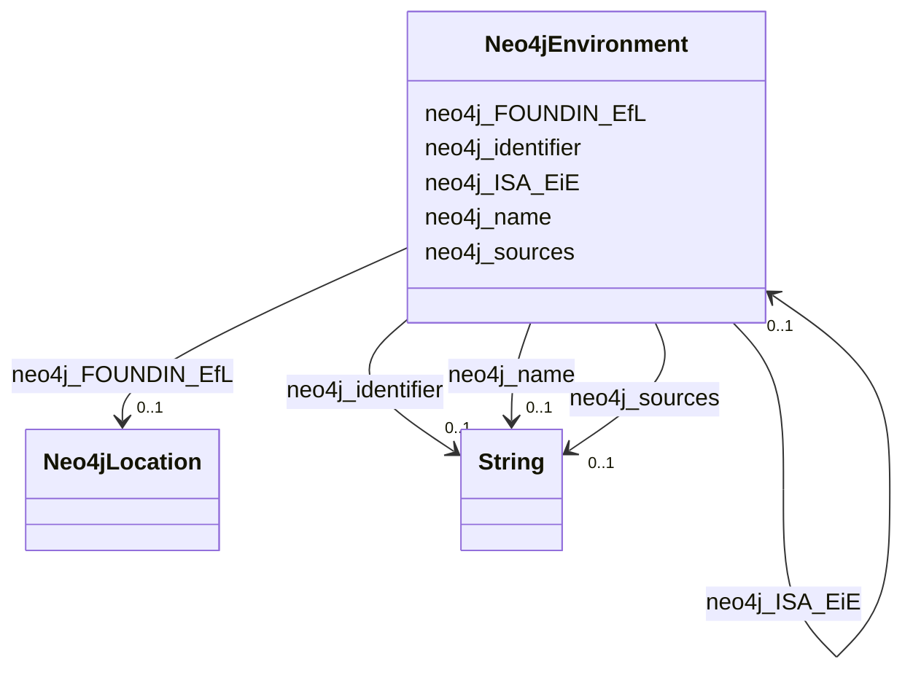

# Class: No class name specified (neo4j_Environment)


_No class (type) description specified_


URI: [neo4j:Environment](neo4j://graph.schema#Environment)





<!-- no inheritance hierarchy -->


## Slots

| Name | Cardinality and Range | Description | Inheritance |
| ---  | --- | --- | --- |
| [neo4j_name](../slots/neo4j_name.md) | 0..1 <br/> [xsd:string](xsd:string) | No slot (predicate) description specified <br/> 2 occurrences with subject type neo4j_Environment and object type string.<br/>1426 occurrences with subject type neo4j_SDoH and object type string.<br/>106067 occurrences with subject type neo4j_Location and object type string.<br/>180 occurrences with subject type neo4j_Disease and object type string.<br/>798 occurrences with subject type neo4j_Compound and object type string.<br/>321442 occurrences with subject type neo4j_Organism and object type string. | direct |
| [neo4j_ISA_EiE](../slots/neo4j_ISA_EiE.md) | 0..1 <br/> [Neo4jEnvironment](../classes/Neo4jEnvironment.md) | No slot (predicate) description specified <br/> 1 occurrences with subject type neo4j_Environment and object type neo4j_Environment. | direct |
| [neo4j_FOUNDIN_EfL](../slots/neo4j_FOUNDIN_EfL.md) | 0..1 <br/> [Neo4jLocation](../classes/Neo4jLocation.md) | No slot (predicate) description specified <br/> 11367 occurrences with subject type neo4j_Environment and object type neo4j_Location. | direct |
| [neo4j_identifier](../slots/neo4j_identifier.md) | 0..1 <br/> [xsd:string](xsd:string) | No slot (predicate) description specified <br/> 2 occurrences with subject type neo4j_Environment and object type string.<br/>1426 occurrences with subject type neo4j_SDoH and object type string.<br/>106067 occurrences with subject type neo4j_Location and object type string.<br/>180 occurrences with subject type neo4j_Disease and object type string.<br/>798 occurrences with subject type neo4j_Compound and object type string.<br/>321442 occurrences with subject type neo4j_Organism and object type string. | direct |
| [neo4j_sources](../slots/neo4j_sources.md) | 0..1 <br/> [xsd:string](xsd:string) | No slot (predicate) description specified <br/> 2 occurrences with subject type neo4j_Environment and object type string.<br/>1426 occurrences with subject type neo4j_SDoH and object type string.<br/>106067 occurrences with subject type neo4j_Location and object type string.<br/>3336 occurrences with subject type neo4j_Compound and object type string.<br/>321442 occurrences with subject type neo4j_Organism and object type string. | direct |


## Usages

| used by | used in | type | used |
| ---  | --- | --- | --- |
| [Neo4jEnvironment](../classes/Neo4jEnvironment.md) | [neo4j_ISA_EiE](../slots/neo4j_ISA_EiE.md) | range | [Neo4jEnvironment](../classes/Neo4jEnvironment.md) |


## Examples

| Value |
| --- |
| neo4j://graph.individuals#105029 |


## Identifier and Mapping Information


### Schema Source


* from schema: spoke-kg


## Mappings

| Mapping Type | Mapped Value |
| ---  | ---  |
| self | neo4j:Environment |
| native | spoke-kg/:Neo4jEnvironment |


## LinkML Source

<!-- TODO: investigate https://stackoverflow.com/questions/37606292/how-to-create-tabbed-code-blocks-in-mkdocs-or-sphinx -->

### Direct

<details>
```yaml
name: neo4j_Environment
conforms_to: No schema conformance document specified
description: No class (type) description specified
title: No class name specified
notes:
- Class with 2 occurrences.
examples:
- value: neo4j://graph.individuals#105029
from_schema: spoke-kg
rank: 1000
slots:
- neo4j_name
- neo4j_ISA_EiE
- neo4j_FOUNDIN_EfL
- neo4j_identifier
- neo4j_sources
class_uri: neo4j:Environment

```
</details>

### Induced

<details>
```yaml
name: neo4j_Environment
conforms_to: No schema conformance document specified
description: No class (type) description specified
title: No class name specified
notes:
- Class with 2 occurrences.
examples:
- value: neo4j://graph.individuals#105029
from_schema: spoke-kg
rank: 1000
attributes:
  neo4j_name:
    name: neo4j_name
    description: No slot (predicate) description specified
    comments:
    - 2 occurrences with subject type neo4j_Environment and object type string.
    - 1426 occurrences with subject type neo4j_SDoH and object type string.
    - 106067 occurrences with subject type neo4j_Location and object type string.
    - 180 occurrences with subject type neo4j_Disease and object type string.
    - 798 occurrences with subject type neo4j_Compound and object type string.
    - 321442 occurrences with subject type neo4j_Organism and object type string.
    examples:
    - description: neo4j_Environment → string
      object:
        example_object: respirable suspended particulate matter
        example_predicate: neo4j:name
        example_subject: neo4j://graph.individuals#105029
    - description: neo4j_SDoH → string
      object:
        example_object: Social scientist (occupation)
        example_predicate: neo4j:name
        example_subject: neo4j://graph.individuals#119274
    - description: neo4j_Location → string
      object:
        example_object: Outside city limits
        example_predicate: neo4j:name
        example_subject: neo4j://graph.individuals#123229
    - description: neo4j_Disease → string
      object:
        example_object: giant cell glioblastoma
        example_predicate: neo4j:name
        example_subject: neo4j://graph.individuals#142359
    - description: neo4j_Compound → string
      object:
        example_object: Tetracycline
        example_predicate: neo4j:name
        example_subject: neo4j://graph.individuals#1961711
    - description: neo4j_Organism → string
      object:
        example_object: Acetobacter tropicalis strain DmPark25_167
        example_predicate: neo4j:name
        example_subject: neo4j://graph.individuals#105042
    from_schema: spoke-kg
    rank: 1000
    slot_uri: neo4j:name
    alias: neo4j_name
    owner: neo4j_Environment
    domain_of:
    - neo4j_Compound
    - neo4j_Disease
    - neo4j_Environment
    - neo4j_Location
    - neo4j_Organism
    - neo4j_SDoH
    range: string
  neo4j_ISA_EiE:
    name: neo4j_ISA_EiE
    description: No slot (predicate) description specified
    comments:
    - 1 occurrences with subject type neo4j_Environment and object type neo4j_Environment.
    examples:
    - description: neo4j_Environment → neo4j_Environment
      object:
        example_object: neo4j://graph.individuals#105029
        example_predicate: neo4j:ISA_EiE
        example_subject: neo4j://graph.individuals#105030
    from_schema: spoke-kg
    rank: 1000
    slot_uri: neo4j:ISA_EiE
    alias: neo4j_ISA_EiE
    owner: neo4j_Environment
    domain_of:
    - neo4j_Environment
    range: neo4j_Environment
  neo4j_FOUNDIN_EfL:
    name: neo4j_FOUNDIN_EfL
    description: No slot (predicate) description specified
    comments:
    - 11367 occurrences with subject type neo4j_Environment and object type neo4j_Location.
    examples:
    - description: neo4j_Environment → neo4j_Location
      object:
        example_object: neo4j://graph.individuals#29671883
        example_predicate: neo4j:FOUNDIN_EfL
        example_subject: neo4j://graph.individuals#105030
    from_schema: spoke-kg
    rank: 1000
    slot_uri: neo4j:FOUNDIN_EfL
    alias: neo4j_FOUNDIN_EfL
    owner: neo4j_Environment
    domain_of:
    - neo4j_Environment
    range: neo4j_Location
  neo4j_identifier:
    name: neo4j_identifier
    description: No slot (predicate) description specified
    comments:
    - 2 occurrences with subject type neo4j_Environment and object type string.
    - 1426 occurrences with subject type neo4j_SDoH and object type string.
    - 106067 occurrences with subject type neo4j_Location and object type string.
    - 180 occurrences with subject type neo4j_Disease and object type string.
    - 798 occurrences with subject type neo4j_Compound and object type string.
    - 321442 occurrences with subject type neo4j_Organism and object type string.
    examples:
    - description: neo4j_Environment → string
      object:
        example_object: ENVO_01000405
        example_predicate: neo4j:identifier
        example_subject: neo4j://graph.individuals#105029
    - description: neo4j_SDoH → string
      object:
        example_object: '158928002'
        example_predicate: neo4j:identifier
        example_subject: neo4j://graph.individuals#119274
    - description: neo4j_Location → string
      object:
        example_object: 049999985379
        example_predicate: neo4j:identifier
        example_subject: neo4j://graph.individuals#123229
    - description: neo4j_Disease → string
      object:
        example_object: DOID:3074
        example_predicate: neo4j:identifier
        example_subject: neo4j://graph.individuals#142359
    - description: neo4j_Compound → string
      object:
        example_object: inchikey:NWXMGUDVXFXRIG-WESIUVDSSA-N
        example_predicate: neo4j:identifier
        example_subject: neo4j://graph.individuals#1961711
    - description: neo4j_Organism → string
      object:
        example_object: '104102.36'
        example_predicate: neo4j:identifier
        example_subject: neo4j://graph.individuals#105042
    from_schema: spoke-kg
    rank: 1000
    slot_uri: neo4j:identifier
    alias: neo4j_identifier
    owner: neo4j_Environment
    domain_of:
    - neo4j_Compound
    - neo4j_Disease
    - neo4j_Environment
    - neo4j_Location
    - neo4j_Organism
    - neo4j_SDoH
    range: string
  neo4j_sources:
    name: neo4j_sources
    description: No slot (predicate) description specified
    comments:
    - 2 occurrences with subject type neo4j_Environment and object type string.
    - 1426 occurrences with subject type neo4j_SDoH and object type string.
    - 106067 occurrences with subject type neo4j_Location and object type string.
    - 3336 occurrences with subject type neo4j_Compound and object type string.
    - 321442 occurrences with subject type neo4j_Organism and object type string.
    examples:
    - description: neo4j_Environment → string
      object:
        example_object: Environment Ontology
        example_predicate: neo4j:sources
        example_subject: neo4j://graph.individuals#105029
    - description: neo4j_SDoH → string
      object:
        example_object: SNOMED CT
        example_predicate: neo4j:sources
        example_subject: neo4j://graph.individuals#119274
    - description: neo4j_Location → string
      object:
        example_object: UnitedStatesZipcode_database
        example_predicate: neo4j:sources
        example_subject: neo4j://graph.individuals#123229
    - description: neo4j_Compound → string
      object:
        example_object: BioCyc
        example_predicate: neo4j:sources
        example_subject: neo4j://graph.individuals#1961711
    - description: neo4j_Organism → string
      object:
        example_object: BV-BRC
        example_predicate: neo4j:sources
        example_subject: neo4j://graph.individuals#105042
    from_schema: spoke-kg
    rank: 1000
    slot_uri: neo4j:sources
    alias: neo4j_sources
    owner: neo4j_Environment
    domain_of:
    - neo4j_Compound
    - neo4j_Environment
    - neo4j_Location
    - neo4j_Organism
    - neo4j_SDoH
    range: string
class_uri: neo4j:Environment

```
</details>