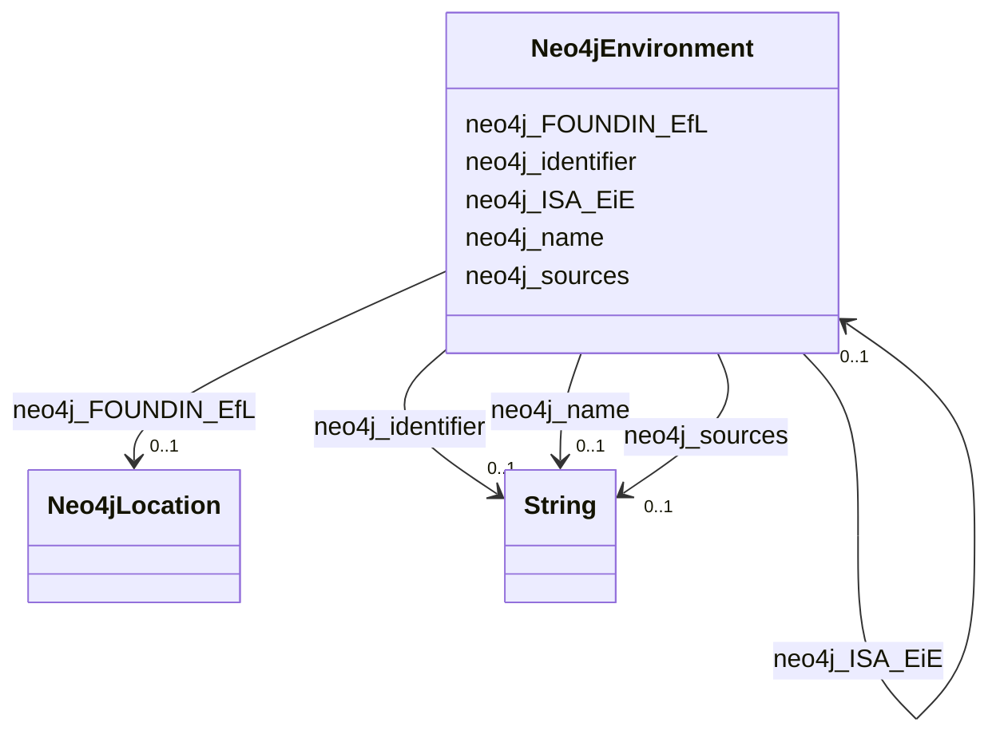

# Class: Neo4jEnvironment


This class occurs 2 times.


URI: [neo4j:Environment](neo4j://graph.schema#Environment)





<!-- no inheritance hierarchy -->


## Slots

| Name | Cardinality and Range | Description | Inheritance | Occurrences |
| ---  | --- | --- | --- | --- |
| [neo4j_sources](../slots/neo4j_sources.md) | 0..1 <br/> [xsd:string](http://www.w3.org/2001/XMLSchema#string) |  <br/>  | direct | 2 |
| [neo4j_FOUNDIN_EfL](../slots/neo4j_FOUNDIN_EfL.md) | 0..1 <br/> [Neo4jLocation](../classes/Neo4jLocation.md) |  <br/>  | direct | 11367 |
| [neo4j_identifier](../slots/neo4j_identifier.md) | 0..1 <br/> [xsd:string](http://www.w3.org/2001/XMLSchema#string) |  <br/>  | direct | 2 |
| [neo4j_name](../slots/neo4j_name.md) | 0..1 <br/> [xsd:string](http://www.w3.org/2001/XMLSchema#string) |  <br/>  | direct | 2 |
| [neo4j_ISA_EiE](../slots/neo4j_ISA_EiE.md) | 0..1 <br/> [Neo4jEnvironment](../classes/Neo4jEnvironment.md) |  <br/>  | direct | 1 |


## Usages

| used by | used in | type | used |
| ---  | --- | --- | --- |
| [Neo4jEnvironment](../classes/Neo4jEnvironment.md) | [neo4j_ISA_EiE](../slots/neo4j_ISA_EiE.md) | range | [Neo4jEnvironment](../classes/Neo4jEnvironment.md) |


## LinkML Source

<!-- TODO: investigate https://stackoverflow.com/questions/37606292/how-to-create-tabbed-code-blocks-in-mkdocs-or-sphinx -->

### Direct

<details>

```yaml
name: neo4j_Environment
from_schema: okns:spoke-kg
rank: 1000
slots:
- neo4j_sources
- neo4j_FOUNDIN_EfL
- neo4j_identifier
- neo4j_name
- neo4j_ISA_EiE
class_uri: neo4j:Environment

```
</details>

### Induced

<details>

```yaml
name: neo4j_Environment
from_schema: okns:spoke-kg
rank: 1000
attributes:
  neo4j_sources:
    name: neo4j_sources
    from_schema: okns:spoke-kg
    rank: 1000
    slot_uri: neo4j:sources
    alias: neo4j_sources
    owner: neo4j_Environment
    domain_of:
    - neo4j_Compound
    - neo4j_Environment
    - neo4j_Location
    - neo4j_Organism
    - neo4j_SDoH
    range: string
  neo4j_FOUNDIN_EfL:
    name: neo4j_FOUNDIN_EfL
    from_schema: okns:spoke-kg
    rank: 1000
    slot_uri: neo4j:FOUNDIN_EfL
    alias: neo4j_FOUNDIN_EfL
    owner: neo4j_Environment
    domain_of:
    - neo4j_Environment
    range: neo4j_Location
  neo4j_identifier:
    name: neo4j_identifier
    from_schema: okns:spoke-kg
    rank: 1000
    slot_uri: neo4j:identifier
    alias: neo4j_identifier
    owner: neo4j_Environment
    domain_of:
    - neo4j_Compound
    - neo4j_Disease
    - neo4j_Environment
    - neo4j_Location
    - neo4j_Organism
    - neo4j_SDoH
    range: string
  neo4j_name:
    name: neo4j_name
    from_schema: okns:spoke-kg
    rank: 1000
    slot_uri: neo4j:name
    alias: neo4j_name
    owner: neo4j_Environment
    domain_of:
    - neo4j_Compound
    - neo4j_Disease
    - neo4j_Environment
    - neo4j_Location
    - neo4j_Organism
    - neo4j_SDoH
    range: string
  neo4j_ISA_EiE:
    name: neo4j_ISA_EiE
    from_schema: okns:spoke-kg
    rank: 1000
    slot_uri: neo4j:ISA_EiE
    alias: neo4j_ISA_EiE
    owner: neo4j_Environment
    domain_of:
    - neo4j_Environment
    range: neo4j_Environment
class_uri: neo4j:Environment

```
</details>