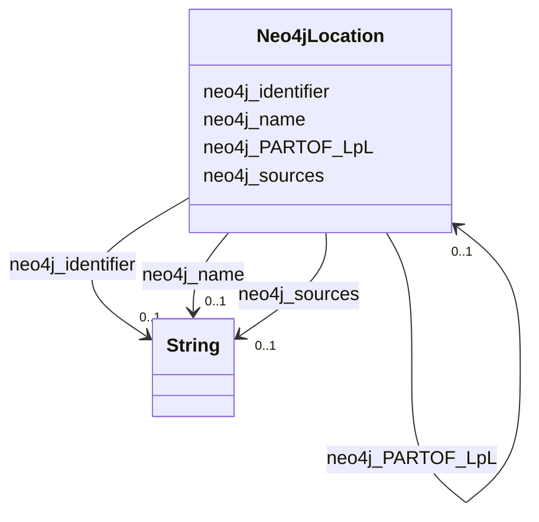

# Class: Neo4jLocation


This class occurs 106067 times.


URI: [neo4j:Location](neo4j://graph.schema#Location)





<!-- no inheritance hierarchy -->


## Slots

| Name | Cardinality and Range | Description | Inheritance | Occurrences |
| ---  | --- | --- | --- | --- |
| [neo4j_identifier](../slots/neo4j_identifier.md) | 0..1 <br/> [xsd:string](http://www.w3.org/2001/XMLSchema#string) |  <br/>  | direct | 106067 |
| [neo4j_name](../slots/neo4j_name.md) | 0..1 <br/> [xsd:string](http://www.w3.org/2001/XMLSchema#string) |  <br/>  | direct | 106067 |
| [neo4j_PARTOF_LpL](../slots/neo4j_PARTOF_LpL.md) | 0..1 <br/> [Neo4jLocation](../classes/Neo4jLocation.md) |  <br/>  | direct | 119810 |
| [neo4j_sources](../slots/neo4j_sources.md) | 0..1 <br/> [xsd:string](http://www.w3.org/2001/XMLSchema#string) |  <br/>  | direct | 106067 |


## Usages

| used by | used in | type | used |
| ---  | --- | --- | --- |
| [Neo4jCompound](../classes/Neo4jCompound.md) | [neo4j_FOUNDIN_CfL](../slots/neo4j_FOUNDIN_CfL.md) | range | [Neo4jLocation](../classes/Neo4jLocation.md) |
| [Neo4jDisease](../classes/Neo4jDisease.md) | [neo4j_MORTALITY_DmL](../slots/neo4j_MORTALITY_DmL.md) | range | [Neo4jLocation](../classes/Neo4jLocation.md) |
| [Neo4jDisease](../classes/Neo4jDisease.md) | [neo4j_PREVALENCE_DpL](../slots/neo4j_PREVALENCE_DpL.md) | range | [Neo4jLocation](../classes/Neo4jLocation.md) |
| [Neo4jEnvironment](../classes/Neo4jEnvironment.md) | [neo4j_FOUNDIN_EfL](../slots/neo4j_FOUNDIN_EfL.md) | range | [Neo4jLocation](../classes/Neo4jLocation.md) |
| [Neo4jLocation](../classes/Neo4jLocation.md) | [neo4j_PARTOF_LpL](../slots/neo4j_PARTOF_LpL.md) | range | [Neo4jLocation](../classes/Neo4jLocation.md) |
| [Neo4jOrganism](../classes/Neo4jOrganism.md) | [neo4j_ISOLATEDIN_OiL](../slots/neo4j_ISOLATEDIN_OiL.md) | range | [Neo4jLocation](../classes/Neo4jLocation.md) |
| [Neo4jSDoH](../classes/Neo4jSDoH.md) | [neo4j_PREVALENCEIN_SpL](../slots/neo4j_PREVALENCEIN_SpL.md) | range | [Neo4jLocation](../classes/Neo4jLocation.md) |


## LinkML Source

<!-- TODO: investigate https://stackoverflow.com/questions/37606292/how-to-create-tabbed-code-blocks-in-mkdocs-or-sphinx -->

### Direct

<details>

```yaml
name: neo4j_Location
from_schema: okns:spoke-kg
rank: 1000
slots:
- neo4j_identifier
- neo4j_name
- neo4j_PARTOF_LpL
- neo4j_sources
class_uri: neo4j:Location

```
</details>

### Induced

<details>

```yaml
name: neo4j_Location
from_schema: okns:spoke-kg
rank: 1000
attributes:
  neo4j_identifier:
    name: neo4j_identifier
    from_schema: okns:spoke-kg
    rank: 1000
    slot_uri: neo4j:identifier
    alias: neo4j_identifier
    owner: neo4j_Location
    domain_of:
    - neo4j_Compound
    - neo4j_Disease
    - neo4j_Environment
    - neo4j_Location
    - neo4j_Organism
    - neo4j_SDoH
    range: string
  neo4j_name:
    name: neo4j_name
    from_schema: okns:spoke-kg
    rank: 1000
    slot_uri: neo4j:name
    alias: neo4j_name
    owner: neo4j_Location
    domain_of:
    - neo4j_Compound
    - neo4j_Disease
    - neo4j_Environment
    - neo4j_Location
    - neo4j_Organism
    - neo4j_SDoH
    range: string
  neo4j_PARTOF_LpL:
    name: neo4j_PARTOF_LpL
    from_schema: okns:spoke-kg
    rank: 1000
    slot_uri: neo4j:PARTOF_LpL
    alias: neo4j_PARTOF_LpL
    owner: neo4j_Location
    domain_of:
    - neo4j_Location
    range: neo4j_Location
  neo4j_sources:
    name: neo4j_sources
    from_schema: okns:spoke-kg
    rank: 1000
    slot_uri: neo4j:sources
    alias: neo4j_sources
    owner: neo4j_Location
    domain_of:
    - neo4j_Compound
    - neo4j_Environment
    - neo4j_Location
    - neo4j_Organism
    - neo4j_SDoH
    range: string
class_uri: neo4j:Location

```
</details>